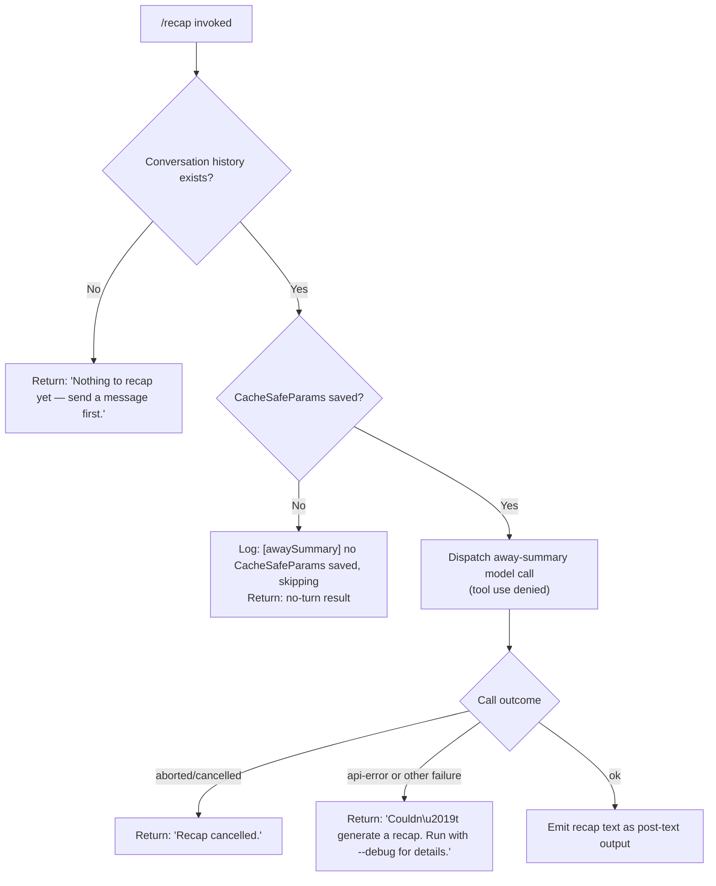

# `/recap`

> Analysis basis: CC v2.1.148 bundle.js (AST extraction + Claude interpretation)
> Minimum version: v2.1.148

---

## Overview

The `/recap` command triggers an on-demand, single-turn summarization of the current session, producing a concise one-line recap of what has happened so far. It dispatches the recap through the same "away summary" subsystem used for background session summarization, meaning it runs a lightweight model call with tool use blocked, then surfaces the result as post-text output. If no conversation history exists yet, or if the underlying call fails or is cancelled, it returns a short human-readable status message instead.

---

## Registration

| Field | Value |
|---|---|
| type | `local` |
| name | `recap` |
| description | `Generate a one-line session recap now` |
| loc_byte | `12411046` |
| loc_byte_end | `12411262` |
| loc_line | `10500` |
| supportsNonInteractive | `false` |
| thinClientDispatch | `post-text` |
| load_inline | `true` |
| load_ident | `Hi7` |
| arbor_handler.name | `Hi7` |
| arbor_handler.fqn | `claude-2.1.148::Hi7` |
| arbor_handler.kind | `AsyncFunction` |
| arbor_handler.resolution_path | `load_ident` |
| arbor_handler.n_hits | `0` |

Analysis basis: CC v2.1.148 bundle.js:+12411046

The handler was inlined into a `load:()=>Promise.resolve({call: Hi7})` shape; `Hi7` is the async function that serves as the command's entry point. Arbor resolved it via the `load_ident` path.

---

## Input Branching

Four distinct outcomes are possible depending on session state and the result of the away-summary call.



Analysis basis: CC v2.1.148 bundle.js:+12410654 (handler entry `Hi7`), +12410796, +12410888, +12410946, +5306140, +5306198

---

## Behavioral Spec

### Entry Point — `recapCommandHandler` (`Hi7`)

```
async function recapCommandHandler(context):
    result = await awaySummaryDispatcher(context)

    if result is null or result.type == "no-turn":
        return "Nothing to recap yet — send a message first."

    if result.outcome == "aborted":
        return "Recap cancelled."

    if result.outcome in ("api-error", "other"):
        return "Couldn't generate a recap. Run with --debug for details."

    // result.outcome == "ok"
    emit result.text as post-text
```

Analysis basis: CC v2.1.148 bundle.js:+12410654, +12410796, +12410888, +12410946

The three user-facing fallback strings are hard-coded literals in the handler body. No arguments are accepted from the user; the command takes no parameters.

---

### Away-Summary Dispatcher — `awaySummaryDispatcher` (`w18`)

```
async function awaySummaryDispatcher(context):
    cacheSafeParams = loadCacheSafeParams(context)  // NHH

    if cacheSafeParams is null:
        log.debug("[awaySummary] no CacheSafeParams saved, skipping")
        return { type: "no-turn" }

    abortController = new AbortController()

    // Listen for parent abort signal; propagate immediately
    context.signal.addEventListener("abort", () => abortController.abort())

    outcome = await runAwaySummaryQuery(cacheSafeParams, abortController, context)
    // outcome is one of: "ok", "aborted", "api-error", "other", "away_summary"

    remainder = collectRemainingMessages(context)   // Y5q / flatMap

    return { outcome, ...remainder }
```

Analysis basis: CC v2.1.148 bundle.js:+5306119 (`NHH` call), +5306140 (log literal), +5306198 (`no-turn`), +5306235 (abort listener), +5306266 (abort propagation), +5306313 (`FW` call), +5306675 (find), +5306764 (`Y5q`)

---

### Away-Summary Query Runner — `runAwaySummaryQuery` (`FW`)

```
async function runAwaySummaryQuery(cacheSafeParams, abortController, context):
    startTime = Date.now()

    // Resolve conversation turn list and select the latest entry
    turns = getTurnList(context)          // G array, via F06/YN8
    latestTurn = turns.at(-1)             // "main" position marker

    sessionId = generateSessionId(ck)     // randomBytes-based hex ID (8 bytes → "hex")
    requestId = crypto.randomUUID()       // $$1.randomUUID

    // Build and submit the model request
    modelResponse = await submitModelRequest(
        cacheSafeParams,
        abortController,
        sessionId,
        requestId
    )    // tY8 → xk → queryEngine (yG7)

    // Post-process response into message objects
    messages = buildMessageHistory(modelResponse)   // H8H → YkH

    // Filter to "ant" (Anthropic) role messages only
    // literal "ant" at bundle.js:+12660623
    antMessages = messages.filter(m => m.role == "ant")

    // Apply conversation context window
    contextualMessages = applyContextWindow(antMessages)   // Cx → yG7/Vj8

    // Determine result tag for output routing
    resultTag = resolveOutputTag(contextualMessages)
    // Tags observed: "ok", "aborted", "api-error", "other", "away_summary"
    // bundle.js:+5306514, +5306658, +5306747, +5306808

    // Push result into output queue (D.push)
    outputQueue.push({ tag: resultTag, messages: contextualMessages })

    return resultTag
```

Analysis basis: CC v2.1.148 bundle.js:+10455676 (`Date.now`), +10455792 (`tY8`), +10455981 (`"main"`), +10456032 (`ck`), +10456056 (`H8H`), +10456076 (`N`), +10456146 (`H.at`), +10456207 (`Cx`), +10456387 (`HG6`), +10456477 (`ijH`), +10456506 (`yP8`), +10456527 (`PM1`), +10456632 (`D.push`), +10456945 (`D.map`)

---

### Core Query Engine — `queryEngine` (`yG7`)

This is the shared agentic query engine invoked by the away-summary path. For `/recap`, two constraints are notable:

1. **Tool use is blocked** — the literal `"deny"` appears alongside `"Away summary cannot use tools"` (bundle.js:+5306431, +5306446), meaning all tool calls are refused during a recap run.
2. **Avoid-prompts flag** — the `"avoid_prompts"` literal (bundle.js:+10453776) is set in app state before the call, suppressing interactive prompt injection.

```
function queryEngine(params):
    // params.toolPolicy == "deny"
    // params.avoidPrompts == true

    setupQueryContext()         // query_setup_start / query_setup_end markers
    startAPILoop()              // query_api_loop_start
    streamResponse()            // query_api_streaming_start / query_api_streaming_end
    processToolResults()        // query_tool_execution_start / query_tool_execution_end
    finalizeOutput()
    // On token-limit: inject recovery hint (bundle.js:+10428949)
    // On malformed tool use: retry once (bundle.js:+10429730)
    // On stop-hook block: enforce cap, emit warning (bundle.js:+10431350)
    return aggregatedResult
```

Analysis basis: CC v2.1.148 bundle.js:+10415886

---

### Conversation-Log Writer — `conversationLogWriter` (`kJK`)

During the recap call the conversation-log subsystem appends output to disk:

```
function conversationLogWriter(entry, logDir):
    filePath = path.join(logDir, targetFile)   // e1A
    dirPath  = path.dirname(logDir)            // gXH.dirname

    if Buffer.byteLength(entry) exceeds threshold:
        rotateLogFile()    // t1A: stat → rename (".txt" suffix) → unlink old
        // rotation uses 4-character slice for suffix: bundle.js:+200868

    ensureDir(dirPath)                      // IJK → yI.mkdir
    appendToFile(filePath, entry)           // yI.appendFile
    updateCompactionState()                 // C_6 / _KA
    scheduleNextRotationCheck()             // Ny6.then / IJK.bind
    registerShutdownHook(r9)               // D9A.register
```

Analysis basis: CC v2.1.148 bundle.js:+201388 (`XRH`), +201413 (`XAH`), +201421 (`gXH.dirname`), +201451 (`Av`), +201466 (`F6`), +201541 (`C_6`), +201558 (`e1A`), +201590 (`t1A`), +201596 (`Buffer.byteLength`), +201629 (`_KA`), +201646 (`Ny6.then`), +201655 (`IJK.bind`), +201751 (`r9`)

---

### Session-State Serializer — `sessionStateSerializer` (`_KH`)

Before the model call, current app state is serialized and restored after:

```
function sessionStateSerializer(appState):
    snapshot = appState.load()    // _.load
    serialized = appState.dump()  // H.dump
    nb = computeNewBase(snapshot) // Nb
    return { snapshot, serialized, nb }
```

Analysis basis: CC v2.1.148 bundle.js:+4856105 (`Nb`), +4856132 (`_.load`), +4856139 (`H.dump`)

---

## State & Side Effects

| Item | Detail |
|---|---|
| Telemetry — query engine | `tengu_auto_compact_rapid_refill_breaker`, `tengu_auto_compact_succeeded`, `tengu_ptl_surfaced_to_user`, `tengu_orphaned_messages_tombstoned`, `tengu_model_fallback_triggered`, `tengu_query_error`, `tengu_model_response_keyword_detected`, `tengu_malformed_tool_use_response`, `tengu_stop_hook_block_count`, `tengu_streaming_tool_execution_used`, `tengu_streaming_tool_execution_not_used`, `tengu_loop_dynamic_wakeup_ends_turn`, `tengu_post_autocompact_turn`, `tengu_query_before_attachments`, `tengu_query_after_attachments`, `tengu_mcp_tools_refreshed_mid_turn` |
| Telemetry — feature flags | `tengu_feature_ok`, `tengu_feature_bad` |
| Telemetry — background workers | `tengu_bg_spare_enable`, `tengu_bg_low_mem_mb`, `tengu_bg_spare_spawn`, `tengu_bg_spare_claim`, `tengu_bg_spare_claim_fail`, `tengu_bg_dispatch_sigkill_escalate`, `tengu_bg_dispatch_low_mem`, `tengu_daemon_yield` |
| Telemetry — forked agents | `tengu_forked_agent_default_turns_exceeded`, `tengu_fork_agent_query` |
| Tool use | Blocked — policy `"deny"` is set for the recap model call; any tool call returns `"Away summary cannot use tools"` (bundle.js:+5306431, +5306446) |
| Avoid-prompts flag | `"avoid_prompts"` is set on app state before the model call (bundle.js:+10453776) |
| appState changes | `setAppState` called to inject `avoid_prompts` before dispatch; `getAppState` read during query setup (`tY8` → `H.getAppState` at bundle.js:+10453546); state restored after the call |
| Conversation log | `kJK` appends the recap exchange to the on-disk session log; rotates the log file when byte-length threshold is exceeded; registers a shutdown hook via `r9` / `D9A.register` (bundle.js:+57468) |
| Output routing | `thinClientDispatch: "post-text"` — result is delivered as plain post-turn text, not as an assistant message in the conversation thread |
| Abort signal | Abort events on the parent controller are forwarded to an inner `AbortController`; aborting mid-recap yields the `"Recap cancelled."` message (bundle.js:+5306254, +5306266) |
| Sound | <!-- TODO: not found in depth-2 traversal; needs --depth 4 --> |
| Hook registration | Shutdown hook registered via `D9A.register` (bundle.js:+57468) for clean log-file teardown |

---

## Version History

| Version | Change |
|---|---|
| v2.1.148 | Initial analysis |

---

## Common Mistakes

1. **Running `/recap` before any messages have been sent** — the command checks whether conversation history exists and immediately returns `"Nothing to recap yet — send a message first."` rather than making a model call. There is no way to force a recap on an empty session.
2. **Expecting tool use during recap** — the away-summary path unconditionally sets the tool policy to `"deny"`. Any expectation that the recap might call tools (e.g. to read files for context) will not be met.
3. **Expecting the recap to appear as a conversation message** — the `thinClientDispatch` field is `"post-text"`, so the recap surfaces as a post-turn text block, not as a turn in the conversation history.
4. **Assuming `/recap` works in non-interactive mode** — `supportsNonInteractive: false` means the command is silently unavailable when Claude Code is invoked in a pipeline or headless context.
5. **Interpreting `"Couldn't generate a recap. Run with --debug for details."` as a network error only** — this message covers both API errors and any other unexpected outcome category; rerun with `--debug` to see the underlying cause.

---

## Appendix — Identifier Mapping

> For bundle debugging only. Identifiers change across versions.

| Identifier | Role |
|---|---|
| `Hi7` | `recapCommandHandler` — async entry point for `/recap`; loaded via `load_ident` |
| `w18` | `awaySummaryDispatcher` — checks CacheSafeParams, sets up abort, delegates to query runner |
| `NHH` | `loadCacheSafeParams` — retrieves saved cache-safe parameters for the session |
| `N` | `buildPromptMessage` — constructs the prompt message passed to the query engine |
| `vJK` | `promptMessageFormatter` — formats prompt text, handles role and content fields |
| `j9A` | `contentBlockBuilder` — builds individual content blocks within a prompt |
| `NDK` | `textBlockFactory` — creates text-type content blocks |
| `IDK` | `imageBlockFactory` — creates image-type content blocks |
| `CH` | `jsonStringifyHelper` — wraps `JSON.stringify` for payload serialization |
| `f4` | `filePathNormalizer` — normalizes file paths, strips prefixes, resolves extensions |
| `l1A` | `pathMapper` — maps a list of paths using `WJK.map` |
| `lRH` | `logWriteDispatcher` — dispatches log write via `b1A` |
| `b1A` | `fileWriteHelper` — writes data using a file handle (`H.write`) |
| `kJK` | `conversationLogWriter` — manages on-disk conversation log, rotation, and compaction |
| `XRH` | `logRotationScheduler` — schedules log rotation via `clearTimeout`/`setTimeout`/`setImmediate` |
| `XAH` | `logFilePathBuilder` — computes the active log file path (`o1A`, `gXH.join`) |
| `F6` | `logDirectoryInitializer` — ensures the log directory exists |
| `C_6` | `compactionStateUpdater` — updates compaction metadata (`q8`) |
| `e1A` | `activeLogPathResolver` — resolves the current log file path (`gXH.join`, `h6`) |
| `t1A` | `logFileRotator` — performs stat → rename → unlink rotation of `.txt` log files |
| `IJK` | `logEntryAppender` — `mkdir` + `appendFile` + compaction + rotation pipeline |
| `r9` | `shutdownHookRegistrar` — registers a process-exit handler via `D9A.register` |
| `FW` | `runAwaySummaryQuery` — orchestrates the full away-summary model round-trip |
| `tY8` | `sessionQuerySetup` — sets up app state, session ID, request ID, and invokes the query engine |
| `xk` | `queryEngineInvoker` — wraps the core query engine call with abort-signal wiring |
| `_KH` | `sessionStateSerializer` — snapshots and restores app state around the model call |
| `COH` | `cacheParamsMerger` — merges cached parameters into the request payload |
| `K6q` | `requestPayloadBuilder` — assembles the final API request payload |
| `M` | `connectionCloser` — closes open connections (`A.close`, `q.close`) |
| `lJ8` | `responseStreamHandler` — handles streaming response events |
| `ck` | `sessionIdGenerator` — generates a hex session ID using `MPq.randomBytes` (8 bytes) |
| `G` | `turnListAccessor` — provides access to the turn list (`F06`, `YN8`) |
| `H8H` | `messageHistoryBuilder` — builds message history from raw model response |
| `v4` | `messageHistoryInitializer` — seeds message history, uses `r9` hook registration |
| `YkH` | `messageRoleFilter` — filters messages by role (`"ant"`), applies `VT8`/`CT8`/`ya7` transforms |
| `Cx` | `contextWindowApplicator` — applies context window constraints via `yG7` and `Vj8` |
| `yG7` | `coreQueryEngine` — full agentic query/streaming/tool-execution loop |
| `Vj8` | `subagentExitHandler` — handles subagent exit events (`Ej8`, `Fx.get`, `Bb_.delete`) |
| `bH` | `turnStateReader` — reads current turn state (`"turn"` literal) |
| `mH` | `turnStateWriter` — writes current turn state |
| `HG6` | `toolUseSummaryChecker` — checks `T27` set for tool-use summary presence |
| `ijH` | `notificationDispatcher` — dispatches in-session notifications |
| `yP8` | `progressReporter` — reports progress events to the UI |
| `PM1` | `postTurnSummaryEmitter` — emits `post_turn_summary` events after turn completion |
| `D` | `outputQueueManager` — manages the output message queue; handles push, map, dispose |
| `V6` | `outputEntryFactory` — creates structured output entries (`Df6`, `wf6`, `Ct`) |
| `$` | `disposableResource` — a disposable wrapper around a resource (`ZC1`) |
| `sG8` | `memoryPressureHandler` — handles low-memory conditions on macOS (1024 MB threshold) |
| `V6A` | `backgroundWorkerSpawner` — spawns background PTY worker processes via `Bun.spawn` |
| `Az` | `errorClassifier` — classifies error types for retry/fallback logic |
| `q8` | `compactionMetadataStore` — stores compaction metadata |
| `RH` | `errorLogger` — logs errors via `Gl.logError` and pushes to error buffer |
| `BG7` | `forkedAgentQueryRunner` — runs queries in a forked agent context; emits `tengu_fork_agent_query` |
| `G8` | `daemonSessionManager` — manages daemon session lifecycle (`wV.randomUUID`, process `j`/`w`) |
| `J` | `workerProcessSupervisor` — supervises worker processes, delegates to `w` |
| `w` | `workerProcessController` — full worker lifecycle: spawn, kill, memory check, session dispatch |
| `j` | `workerProcessKiller` — iterates worker values and kills them |
| `y` | `workerWriteHelper` — writes to worker stdin (`z.write`) |
| `Y5q` | `remainingMessageCollector` — collects remaining messages via `H.flatMap` |
| `_` | `promptTextExtractor` — extracts and uppercases prompt text (`_.toUpperCase`) |
| `A` | `pathCaseNormalizer` — lowercases paths (`M.toLowerCase`), slices, and searches |
| `q` | `fileUnlinkHelper` — wraps `HfK.unlinkSync` for file deletion |
| `H` | `timerWithJitter` — `Math.random`-based jitter timer using `setTimeout` |

---

Note: index built via Arbor fallback; some signals (telemetry, literals) may be missing — see arbor-fallback.js.