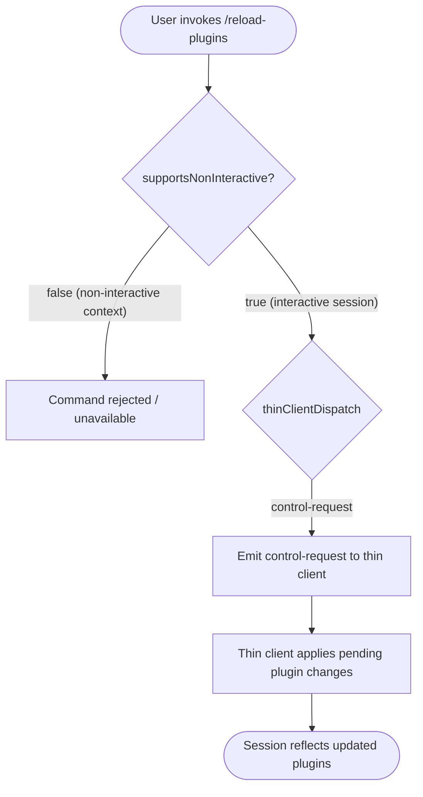

# `/reload-plugins`

> Analysis basis: CC v2.1.144 bundle.js (AST extraction + Claude interpretation)
> Minimum version: v2.1.144

---

## Overview

The `/reload-plugins` command activates any pending plugin changes within the current Claude Code session without requiring a full restart. It is registered as a `local` command that dispatches a control request to the thin client, meaning its execution is coordinated through the session control plane rather than being handled entirely in the local process.

---

## Registration

| Field | Value |
|---|---|
| type | `local` |
| name | `reload-plugins` |
| description | `Activate pending plugin changes in the current session` |
| supportsNonInteractive | `false` |
| thinClientDispatch | `control-request` |
| module_id | `OTq` |

Analysis basis: CC v2.1.144 bundle.js:+11595248

---

## Input Branching

Because the AST traversal returned an empty `callGraph` and empty `literals` array for module `OTq`, no branching logic based on user-supplied arguments could be recovered at depth ≤ 2. The following flowchart reflects the behavioral structure that can be inferred from the registration fields alone.



Analysis basis: CC v2.1.144 bundle.js:+11595248

> **Note:** `supportsNonInteractive: false` means this command cannot be used in piped or headless invocations. Attempting to call it from a non-interactive context will result in the command being unavailable or rejected by the CLI harness.

---

## Behavioral Spec

### Dispatch to Thin Client

Because `thinClientDispatch` is set to `"control-request"`, the command does not perform plugin loading directly in the local CLI process. Instead, it constructs and sends a control-request message to the thin client layer, which is responsible for orchestrating the actual plugin reload.

```
function reloadPlugins(sessionContext):
    if not sessionContext.isInteractive:
        return UNAVAILABLE  // supportsNonInteractive = false

    message = buildControlRequest(
        command = "reload-plugins",
        payload  = {}         // no additional arguments observed in literals
    )

    result = sessionContext.thinClient.dispatch(message)
    return result
```

Analysis basis: CC v2.1.144 bundle.js:+11595248

### Plugin Activation Semantics

The command description states it "activates **pending** plugin changes." This implies a two-phase model:

```
// Phase 1 — Changes are staged (e.g., by editing plugin config files)
// Phase 2 — /reload-plugins flushes staged changes into the live session

function applyPendingPlugins(pluginRegistry):
    pending = pluginRegistry.getPending()
    for each plugin in pending:
        pluginRegistry.activate(plugin)
    pluginRegistry.clearPending()
```

> **Caveat:** The internal implementation of plugin staging and activation (`applyPendingPlugins`) is located inside module `OTq` and was not reachable at AST traversal depth ≤ 2. The pseudocode above is inferred from the command description and dispatch mechanism.

<!-- TODO: not found in depth-2 traversal; needs --depth 4 -->

---

## State & Side Effects

| Item | Detail |
|---|---|
| Telemetry | None detected in depth-2 traversal (`telemetry: []`) |
| Hook registration | <!-- TODO: not found in depth-2 traversal; needs --depth 4 --> |
| appState changes | <!-- TODO: not found in depth-2 traversal; needs --depth 4 --> |
| Plugin registry mutation | Inferred: pending plugins are promoted to active state (see description) |
| Thin-client message | Emits a `control-request` message to the thin client layer |
| Sound | <!-- TODO: not found in depth-2 traversal; needs --depth 4 --> |
| Non-interactive availability | Command is **not** available in non-interactive (headless/piped) mode |

Analysis basis: CC v2.1.144 bundle.js:+11595248

---

## Version History

| Version | Change |
|---|---|
| v2.1.144 | Initial analysis; command registered as `local` with `thinClientDispatch: "control-request"` |

---

## Common Mistakes

1. **Running in non-interactive mode.** Because `supportsNonInteractive` is `false`, invoking `/reload-plugins` in a piped shell command or a headless CI script will not work. The command must be issued from an interactive Claude Code session.

2. **Expecting immediate filesystem re-scan.** The command activates *pending* changes, not arbitrary filesystem state. If plugin configuration files have not been updated through the expected plugin management workflow, `/reload-plugins` may appear to have no effect.

3. **Confusing with a full restart.** This command reloads plugins within the *current session* only. It does not restart the Claude Code process, re-initialize the entire runtime, or reset session state beyond the plugin registry.

4. **Assuming telemetry confirmation.** No telemetry events were found in the depth-2 traversal. Do not rely on log-stream or telemetry callbacks to confirm that plugin reload completed; check session behavior directly.

5. **Calling from a thin client that does not support control-request dispatch.** Environments that wrap or proxy the Claude Code thin client may not forward `control-request` messages, silently dropping the reload.

---

## Appendix — Identifier Mapping

> For bundle debugging only. Identifiers change across versions.

| Identifier | Role |
|---|---|

*No obfuscated identifiers were returned by the depth-2 AST traversal for module `OTq` (`identifiers: []`). If a deeper traversal is performed, this table should be populated with any short or non-English mangled names discovered.*

<!-- TODO: not found in depth-2 traversal; needs --depth 4 -->