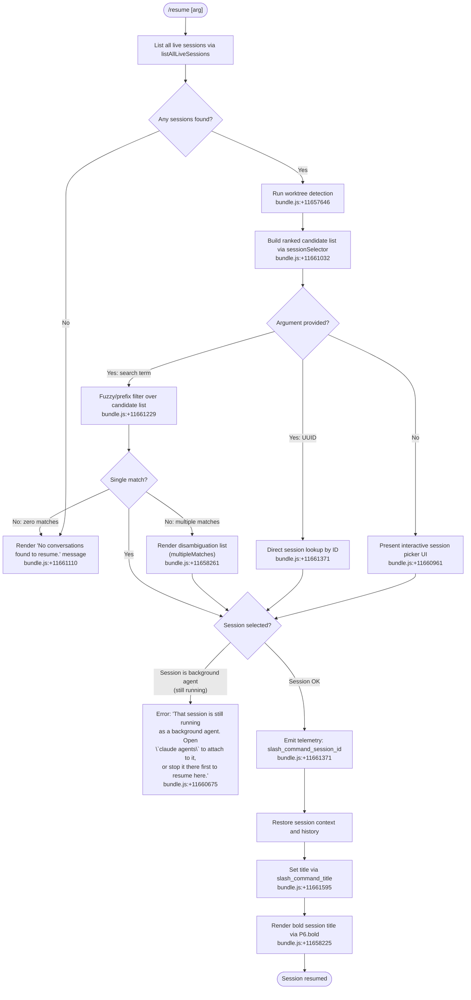

# `/resume`

> Analysis basis: CC v2.1.148 bundle.js (AST extraction + Claude interpretation)
> Minimum version: v2.1.148

---

## Overview

`/resume` (alias: `/continue`) allows a user to pick up a previous Claude Code conversation by supplying either a conversation UUID or a free-text search term. The command queries all live sessions, builds a ranked candidate list, renders a JSX selection UI, and then rehydrates the chosen session into the active context — blocking the attempt if the target session is still running as a background agent.

---

## Registration

| Field | Value |
|---|---|
| type | `local-jsx` |
| name | `resume` |
| description | `Resume a previous conversation` |
| aliases | `["continue"]` |
| argumentHint | `[conversation id or search term]` |
| module_id | `bZ1` |
| load_inline | `true` |
| loc_byte | `11662073` |
| loc_byte_end | `11662270` |
| loc_line | `9407` |
| arbor_handler.name | `lu7` |
| arbor_handler.fqn | `claude-2.1.148::lu7` |
| arbor_handler.kind | `AsyncFunction` |
| arbor_handler.resolution_path | `module_id` |
| arbor_handler.n_hits | `0` |

Analysis basis: CC v2.1.148 bundle.js:+11662073

---

## Input Branching

Six distinct code paths exist depending on session availability and the form of the user's argument. A Mermaid flowchart is used.



---

## Behavioral Spec

### Main Handler — `lu7` (resumeCommandHandler)

Analysis basis: CC v2.1.148 bundle.js:+11660665

```
async function resumeCommandHandler(args, context):
    # 1. Load all sessions
    sessions = await listAllSessions(context)          # g4H → A.listAllLiveSessions
    sessions = sessions.filter(isInteractiveSession)   # literal "interactive" :+8535648

    # 2. Guard: nothing to resume
    if sessions is empty:
        return render("No conversations found to resume.")  # :+11661110

    # 3. Detect git worktrees for the current working directory
    worktrees = detectWorktrees()                       # uyH, telemetry: tengu_worktree_detection :+11657646

    # 4. Build ranked/sorted candidate list
    candidates = buildCandidateList(sessions, worktrees, Date.now())  # uyH :+11661032

    # 5. Resolve target from argument
    if args is empty:
        target = await showInteractivePicker(candidates)   # Hw.createElement :+11660961
    else if args looks like a UUID:
        target = lookupBySessionId(candidates, args)        # CZ1 :+11661371
    else:
        target = filterBySearchTerm(candidates, args)       # lu7 → M.filter :+11661229

    # 6. Disambiguate multiple matches
    if target is list with >1 entry:
        target = await showDisambiguationUI(target)         # literals "multipleMatches" :+11658261

    # 7. Guard: background agent still running
    if target.status == "background agent" and target.isRunning:
        raise UserVisibleError(
          "That session is still running as a background agent. " +
          "Open `claude agents` to attach to it, or stop it there first to resume here."
        )                                                   # :+11660675

    # 8. Emit telemetry
    emitTelemetry("slash_command_session_id", target.id)    # :+11661371

    # 9. Restore context
    sessionHistory = loadTranscript(target)                 # BX6, rd :+11661416
    restoreState(sessionHistory)                            # c4H :+11661349

    # 10. Set UI title
    title = resolveSessionTitle(target)                     # SZ1 → P6.bold :+11661645
    setTitle("slash_command_title", title)                  # :+11661595

    return renderResumedSession(sessionHistory)
```

---

### Session Listing — `listAllSessions` (g4H)

Analysis basis: CC v2.1.148 bundle.js:+11660665 / +8535505

```
async function listAllSessions(context):
    result = await Promise.resolve()
    sessions = await A.listAllLiveSessions()    # :+8535557
    filtered = sessions.filter(s => s.mode == "interactive")  # :+8535648
    return filtered
```

---

### Worktree Detection — `detectWorktrees` (uyH)

Analysis basis: CC v2.1.148 bundle.js:+11657537

Telemetry event: `tengu_worktree_detection` (+11657646)

```
function detectWorktrees():
    startTime = Date.now()
    # Runs: git worktree list --porcelain
    # literals: "worktree", "list", "--porcelain"  :+11657557
    rawOutput = spawnGitWorktree("worktree", "list", "--porcelain")
    lines = rawOutput.split(newline)
    worktrees = []
    for line in lines:
        if line.startsWith("worktree "):           # prefix length 9 :+11657796
            path = line.slice(9).normalize("NFC")  # :+11657809
            worktrees.push(path)
    # Sort and rank by locale comparison
    current = findCurrentWorktree(worktrees)       # L.find :+11657904
    ranked = worktrees.filter(w => w.startsWith(current))  # :+11657923
                       .sort((a,b) => a.localeCompare(b))  # :+11657983
    emit("tengu_worktree_detection", ...)
    return ranked
```

---

### Candidate List Builder — `buildCandidateList` (uyH / rd)

Analysis basis: CC v2.1.148 bundle.js:+11661032

```
function buildCandidateList(sessions, worktrees, now):
    for each session in sessions:
        session.worktreeRank = computeWorktreeRank(session.cwd, worktrees)
        session.relativeTime = computeRelativeTime(session.timestamp, now)
    sorted = sessions.sort(byWorktreeRankThenRecency)
    return sorted
```

---

### Session Transcript Restore — `rd` (sessionRestorer)

Analysis basis: CC v2.1.148 bundle.js:+11661496

```
async function sessionRestorer(sessionId, context):
    history = await loadTranscript(sessionId)   # uyH, vU1, KhH
    history = history.filter(excludeInternalTypes)  # M.filter :+12643201
    if any entry has unresolvable parentUuid:
        logWarning("phantom_parent")            # telemetry: tengu_transcript_phantom_parent
    normalized = history.map(normalizeEntry)    # H.toLowerCase :+12643176
    return loadIntoContext(normalized, context) # BX6 :+11661416
```

---

### Session State Store — `c4H` (sessionStateAccessor)

Analysis basis: CC v2.1.148 bundle.js:+11661349

`c4H` is the state accessor gateway. It exposes typed `.get()` operations for
each conversation metadata key tracked in the store, including:
`"summary"`, `"last-prompt"`, `"custom-title"`, `"ai-title"`, `"tag"`,
`"agent-name"`, `"mode"`, `"permission-mode"`, `"worktree-state"`,
`"pr-link"`, `"agent-color"`, `"agent-setting"`, `"bridge-session"`.

```
function getSessionField(sessionId, fieldKey):
    store = sessionStateAccessor()    # c4H
    return store.get(fieldKey)        # typed map lookup :+12642045..12643049
```

---

### Session ID Not Found / Multiple Matches Display — `SZ1` (sessionNotFoundRenderer)

Analysis basis: CC v2.1.148 bundle.js:+11661645 / literals +11658190, +11658261

```
function renderSessionOutcome(outcome, candidates):
    if outcome == "sessionNotFound":     # :+11658190
        return renderMessage("No conversations found to resume.")
    if outcome == "multipleMatches":     # :+11658261
        return renderList(candidates, bold=P6.bold)  # :+11658225
    # normal path: render title bold
    return P6.bold(resolvedTitle)
```

---

### Background-Agent Guard

Analysis basis: CC v2.1.148 bundle.js:+11660675

```
function guardBackgroundAgent(session):
    if session.status == "background session" and session.isRunning:
        raise UserError(
          "That session is still running as a background agent. " +
          "Open `claude agents` to attach to it, or stop it there first to resume here."
        )
    # Literal "skip" is the acknowledgement path if user explicitly skips :+11660878
    # Literal "user" identifies the turn role of the injected context :+11660816
```

---

## State & Side Effects

| Item | Detail |
|---|---|
| Telemetry — `slash_command_session_id` | Emitted when a valid session is resolved; carries the session UUID (bundle.js:+11661371) |
| Telemetry — `slash_command_title` | Emitted with the resolved display title after restore (bundle.js:+11661595) |
| Telemetry — `tengu_worktree_detection` | Emitted during git worktree enumeration (bundle.js:+11657646) |
| Telemetry — `tengu_transcript_phantom_parent` | Emitted when a history entry references a non-existent parent UUID (bundle.js:+12647840) |
| Telemetry — `tengu_transcript_parent_cycle` | Emitted if a cycle is detected in the parent-UUID chain (bundle.js:+12651403) |
| Telemetry — `tengu_chain_parent_cycle` | Secondary chain cycle guard (bundle.js:+12629882) |
| Telemetry — `tengu_chain_timestamp_fallback` | Emitted when timestamp ordering falls back to secondary heuristic (bundle.js:+12630031) |
| Telemetry — `tengu_chain_parallel_tr_recovered` | Emitted when parallel transcript recovery succeeds (bundle.js:+12631897) |
| appState changes | Active session context, message history, and UI title are replaced with the resumed session's data |
| Session filter | Only sessions with mode `"interactive"` are eligible for resume (bundle.js:+8535648) |
| Background agent block | Sessions with status `"background session"` that are still running are blocked from resume (bundle.js:+11660675) |
| Git subprocess | `git worktree list --porcelain` is spawned to rank candidates by worktree proximity (bundle.js:+11657557) |
| Sound | No sound side-effects found in depth-2 traversal |
| Hook registration | No explicit hook registration found in depth-2 traversal |

---

## Version History

| Version | Change |
|---|---|
| v2.1.148 | Initial analysis |

---

## Common Mistakes

1. **Passing a partial UUID**: The command performs a prefix/fuzzy search on the argument, so an ambiguous prefix will trigger the disambiguation UI rather than immediately resuming. Provide the full session UUID to avoid this.
2. **Trying to resume a background agent session**: If a session is still active as a background agent, `/resume` will refuse with an explicit error. Use `/agents` to attach to or stop the session first.
3. **Confusing `/resume` with `/continue` alias**: Both names are functionally identical; `/continue` is registered as a first-class alias and produces the same behaviour.
4. **Expecting `/resume` to work when no prior sessions exist**: If Claude Code has no recorded interactive sessions in the current environment (e.g. a fresh install or a wiped session store), the command returns immediately with "No conversations found to resume."
5. **Searching across worktrees**: Candidate ranking is worktree-aware. Sessions whose working directory matches the current git worktree rank higher. A session from a different worktree may appear lower in the picker or require an explicit UUID.

---

## Appendix — Identifier Mapping

> For bundle debugging only. Identifiers change across versions.

| Identifier | Role |
|---|---|
| `lu7` | Main async handler for `/resume` (resumeCommandHandler); Arbor-resolved entry point |
| `CZ1` | Session list pre-filter; filters raw sessions before passing to handler |
| `hf` | Helper called during session filtering (called twice: +11660591, +11661243) |
| `g4H` | Session lister; wraps `A.listAllLiveSessions` and `Promise.resolve` |
| `uyH` | Worktree-aware candidate list builder; also emits `tengu_worktree_detection` |
| `T_` | Sub-process spawner for git worktree enumeration (wraps `i2H`) |
| `i2H` | Low-level process execution engine |
| `RH` | Error reporting / logging helper (called from multiple sites) |
| `ZH` | String coercion utility used in error formatting |
| `BW8` | Conversation list formatter; wraps `rZ6` |
| `rZ6` | Conversation record renderer; formats session metadata for display |
| `vU1` | File-system history walker; reads conversation transcript files |
| `QQ` | Path join helper for conversation storage directories |
| `KhH` | Binary transcript record parser (Buffer-based) |
| `ba7` | Transcript node parser for individual JSONL records |
| `Ar` | UUID / session-ID pattern matcher (wraps `qkL.test`) |
| `Ur` | Session identifier normaliser used by `c4H` and `c4H` |
| `c4H` | Session state accessor gateway; exposes typed `.get()` per metadata key |
| `g6H` | Full session state store; manages all per-session metadata maps |
| `so7` | Helper initialising the session metadata store |
| `U1A` | Conversation message normaliser (handles array/non-array content) |
| `pX` | Session property indexer |
| `f` | MCP/tool-state setter within session store |
| `EkH` | MCP server connection initialiser |
| `k7K` | MCP update applicator |
| `_D5` | MCP client filter and diff applicator |
| `Va7` | JSONL transcript file reader (binary, random-access) |
| `Za7` | JSONL transcript incremental parser |
| `AU1` | Session store bulk-loader |
| `$a7` | Dependency-walk helper for session chain reconstruction |
| `d4H` | Session chain builder; resolves parent-UUID chains into ordered lists |
| `Da7` | Timestamp-aware chain sorter and conflict resolver |
| `Oa7` | Chain leaf collector |
| `GU1` | Parallel transcript recovery helper |
| `Ya7` | Numeric-validation helper for chain timestamps |
| `NT8` | Session metadata getter for a specific key from nested map |
| `IT8` | Session metadata bulk extractor (Array.from + H.values) |
| `BX6` | Session snapshot loader; calls `d4H`, typed field getters |
| `VU1` | Session initialiser combining `g6H` and `Object.assign` |
| `Na7` | Project path resolver for conversation storage |
| `XT` | Directory walker for session files |
| `zr_` | Session record hydrator combining `Er_`, `UrH`, `Vr_` |
| `Er_` | Message content transformer (replaceAll + slice) |
| `UrH` | Message array mapper |
| `Vr_` | Content-type validator (wraps `wa7`, `ja7`) |
| `wa7` | Array/scalar content tester (trim + some) |
| `ja7` | Alternate content tester for array inputs |
| `vT8` | Timestamp parser (wraps `Date.parse`) |
| `rd` | Session restorer; orchestrates uyH → vU1 → KhH pipeline |
| `SZ1` | Session outcome renderer; bold title, not-found, multiple-match UI |
| `A7H` | Auxiliary UI helper called near end of `lu7` handler |
| `WE6` | Compact-summary message transformer |
| `d1` | Inline-content regex parser (trim + exec chains) |
| `sy` | Storage path resolver (wraps `oV`) |
| `w_` | Working-directory accessor |
| `oV` | Base path provider |
| `Lz` | Path segment sanitiser (replace + slice + VUK) |
| `s8` | Constant/sentinel lookup helper |
| `_WH` | BOM-stripping JSONL reader (detects UTF-8 BOM bytes 239/187/191) |
| `HgK` | BOM detection helper |
| `_gK` | JSONL line index builder |
| `qgK` | JSONL record extractor with JSON.parse |
| `AgK` | JSONL chunk parser |
| `t9` | Utility wrapper around `q8` error formatter |
| `n_` | Low-level error constructor (Error + String coercion) |
| `UH` | String coercion wrapper |
| `j1` | Error message formatter (wraps `XwA`) |
| `XwA` | Error detail extractor (wraps `UH`) |
| `FpK` | Circular error buffer manager (shift + push on `lb6`) |
| `JFK` | String formatter for process output |
| `NPA` | Spawn argument builder (DFK + VJA + unshift) |
| `hB8` | stdout handler factory |
| `SB8` | stderr handler factory |
| `CB8` | Process completion handler |
| `bJA` | Timeout validator (Number.isFinite + TypeError) |
| `eq6` | Buffered-data accumulator with Boolean coercion |
| `yB8` | Reflect-based property definer for process handle |
| `OPA` | Exit-event listener registrar |
| `CJA` | Timeout race implementation (Promise.race + clearTimeout) |
| `xJA` | Process kill helper (H.kill + Zl) |
| `SJA` | stdout data handler (bound) |
| `RJA` | Signal-based kill handler (bound) |
| `fPA` | Parallel output collector (Promise.all) |
| `q16` | Output post-processor ($B8) |
| `LPA` | Pipe setup helper |
| `MPA` | Stream add helper |
| `UJA` | Output binding helper (WB8.bind) |
| `V6` | Memory-aware spare-process spawner |
| `V6A` | Daemon background process spawner (Bun.spawn) |
| `sG8` | Memory telemetry emitter (`tengu_bg_low_mem_mb`) |
| `S6A` | Background session lifecycle manager (roster, GY.rm, etc.) |
| `v6A` | Session claim/connect handler |
| `D` | Main daemon dispatch loop |
| `w` | Daemon worker manager |
| `C` | Worker process controller |
| `I` | Away-summary state machine |
| `h` | Away-summary scheduler |
| `w18` | Away-summary API caller |
| `xM5` | Cache-safe-params retriever |
| `VY8` | App state snapshot accessor |
| `sM1` | UUID generator (crypto.randomUUID) |
| `Ou` | Graceful shutdown race (Promise.race + process.exit) |
| `Pk` | Daemon control event emitter |
| `bH` | `tengu_feature_ok` emitter |
| `mH` | `tengu_feature_bad` emitter |
| `Q` | Conversation file read/unlink helper (LT6 + Rw1) |
| `LT6` | Async readFile + JSON parse helper |
| `Rw1` | Async unlink helper |
| `z` | Session lifecycle event router (stopped/daemon_stop) |
| `B` | Message slice accessor |

---

Note: index built via Arbor fallback; some signals (telemetry, literals) may be missing — see arbor-fallback.js.