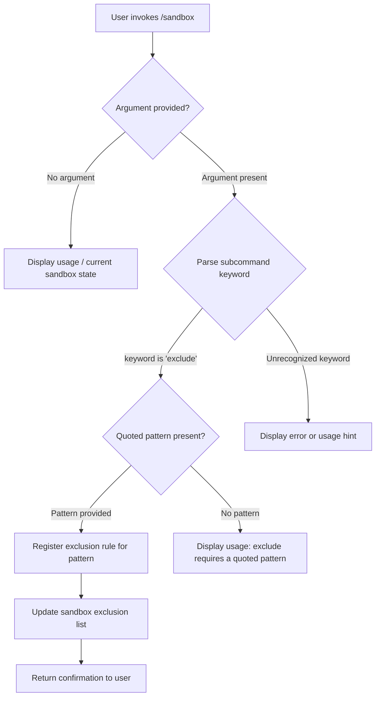

```
---
type: feature-spec
feature: "sandbox"
cc_version: 2.1.148
tags: ["sandbox", "commands", "slash-commands"]
source: "bundle-analysis"
bundle_verified: true
inherited_from: 2.1.144
analysis_basis: "CC v2.1.144 bundle.js (AST extraction + Claude interpretation)"
author: "ryujaeuk <ryujaeuk@gmail.com>"
repository: "https://github.com/MyLittleLuckyDog/cc-gnothi"
license: "AGPL-3.0-only"
---

# `/sandbox`

> Analysis basis: CC v2.1.144 bundle.js (AST extraction + Claude interpretation)
> Minimum version: v2.1.144

---

## Overview

The `/sandbox` command is a local JSX slash command that allows users to manage sandbox exclusion rules by specifying command patterns to exclude. It is registered as an immediate command, meaning it executes without requiring a confirmation step before processing the provided argument. The command accepts an argument in the form of a quoted command pattern to exclude from sandbox behavior.

---

## Registration

| Field | Value |
|---|---|
| type | `local-jsx` |
| name | `sandbox` |
| description | `null` |
| argumentHint | `exclude "command pattern"` |
| immediate | `true` |
| module_id | `eTq` |

Analysis basis: CC v2.1.144 bundle.js:+11632976

---

## Input Branching

The `argumentHint` field (`exclude "command pattern"`) indicates the command accepts a subcommand keyword (`exclude`) followed by a quoted pattern string. Based on the registration data, the command is `immediate: true`, meaning argument parsing and dispatch occur without a secondary confirmation prompt.



<!-- TODO: not found in depth-2 traversal; needs --depth 4 -->

> **Note:** The flowchart above is derived from the `argumentHint` literal (`exclude "command pattern"`) found in the registration object and the `immediate: true` flag. No call graph edges or additional literals were available from the AST extraction for module `eTq`. Deeper traversal is required to confirm all branches.

---

## Behavioral Spec

### Argument Parsing and Exclusion Registration

Because the AST traversal returned no call graph edges, entry functions, or literals for module `eTq`, the following pseudocode is a best-effort behavioral inference derived exclusively from the registration metadata.

```
function handleSandboxCommand(rawArgument):
    if rawArgument is empty or null:
        displayCurrentSandboxState()
        displayUsageHint('exclude "command pattern"')
        return

    tokens = tokenize(rawArgument)
    subcommand = tokens[0]

    if subcommand == "exclude":
        pattern = extractQuotedString(tokens[1..])
        if pattern is null or empty:
            displayError('A quoted command pattern is required after exclude')
            return
        registerSandboxExclusion(pattern)
        displayConfirmation(pattern)
    else:
        displayError('Unknown subcommand: ' + subcommand)
        displayUsageHint('exclude "command pattern"')
```

Analysis basis: CC v2.1.144 bundle.js:+11632976

<!-- TODO: not found in depth-2 traversal; needs --depth 4 — full implementation logic for registerSandboxExclusion, state persistence, and UI rendering not recoverable from current extraction -->

### Immediate Execution Mode

The `immediate: true` registration flag indicates this command bypasses the standard two-step confirmation flow used by non-immediate commands. Upon receiving the slash command input, the runtime dispatches the handler synchronously without prompting the user for secondary confirmation.

```
function dispatchSlashCommand(command, argument):
    if command.immediate == true:
        invokeHandler(command, argument)   // no confirmation step
    else:
        promptForConfirmation(command, argument)
        // handler invoked only after user confirms
```

Analysis basis: CC v2.1.144 bundle.js:+11632976

---

## State & Side Effects

| Item | Detail |
|---|---|
| Telemetry | <!-- TODO: not found in depth-2 traversal; needs --depth 4 --> |
| Hook registration | <!-- TODO: not found in depth-2 traversal; needs --depth 4 --> |
| appState changes | <!-- TODO: not found in depth-2 traversal; needs --depth 4 --> |
| Sound | <!-- TODO: not found in depth-2 traversal; needs --depth 4 --> |
| Exclusion list persistence | <!-- TODO: not found in depth-2 traversal; needs --depth 4 --> |

> **Note:** The AST extraction returned empty arrays for `telemetry`, `callGraph`, `literals`, and `identifiers` for module `eTq`, with an explicit note: `"no entry functions found for module 'eTq'"`. All state and side-effect details require a deeper traversal pass.

---

## Version History

| Version | Change |
|---|---|
| v2.1.144 | Initial analysis — registration metadata confirmed; full behavioral spec incomplete pending deeper AST traversal |

---

## Common Mistakes

1. **Omitting quotes around the command pattern**: The `argumentHint` explicitly shows the pattern must be quoted (`exclude "command pattern"`). Passing an unquoted pattern may cause incorrect tokenization or be rejected by the parser.
2. **Expecting a confirmation prompt**: Because `immediate: true` is set, the command executes as soon as the argument is submitted. Users accustomed to two-step slash commands should not expect a secondary confirmation dialog.
3. **Assuming a description is displayed in the command palette**: The `description` field is `null` in the registration object, so the command may appear without a descriptive label in UI surfaces that render command descriptions.
4. **Using `/sandbox` without any argument expecting a no-op**: With no argument, the command likely renders current sandbox state or a usage hint rather than silently doing nothing — though exact behavior requires deeper traversal to confirm.

---

## Appendix — Identifier Mapping

> For bundle debugging only. Identifiers change across versions.

| Identifier | Role |
|---|---|

> **Note:** The AST extraction returned an empty `identifiers` array for module `eTq`. No obfuscated identifiers were recovered at traversal depth ≤ 2. Re-run extraction with `--depth 4` targeting module `eTq` to populate this table.
```