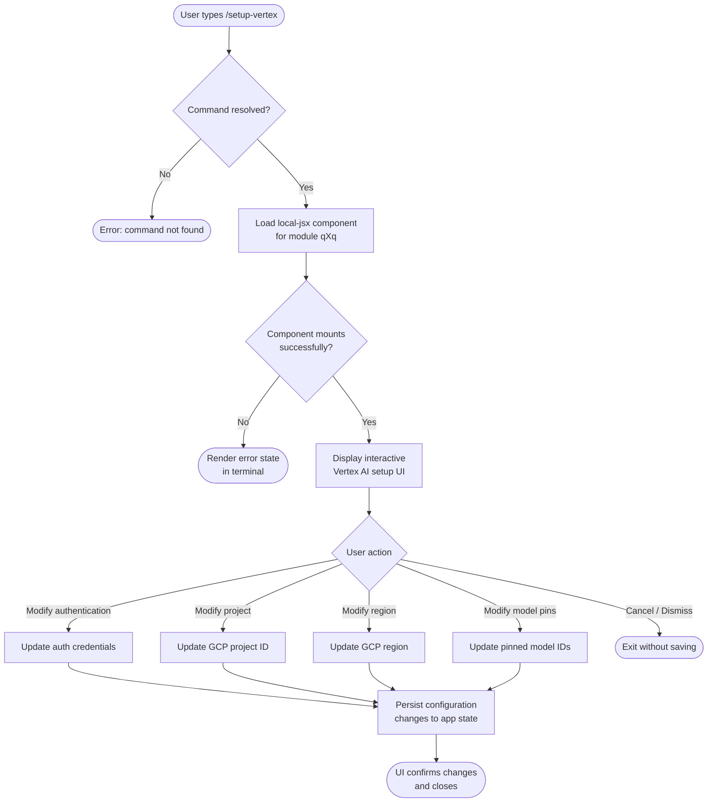

# `/setup-vertex`

> Analysis basis: CC v2.1.144 bundle.js (AST extraction + Claude interpretation)
> Minimum version: v2.1.144

---

## Overview

The `/setup-vertex` slash command provides an interactive re-configuration flow for Google Vertex AI integration within Claude Code. It allows users to update authentication credentials, project identifiers, region selection, and model pins without restarting the CLI session. The command is registered as a local JSX component (`local-jsx`), meaning its UI is rendered inline within the terminal interface via React-style rendering rather than as a plain text output.

---

## Registration

| Field | Value |
|---|---|
| type | `local-jsx` |
| name | `setup-vertex` |
| description | `Reconfigure Google Vertex AI authentication, project, region, or model pins` |
| module\_id | `qXq` |
| loc\_line | 6682 |

Analysis basis: CC v2.1.144 bundle.js:+11245432

---

## Input Branching

> **Note:** The AST traversal of module `qXq` at depth ≤ 2 found no resolvable entry-point functions, call edges, string literals, or telemetry events. The flowchart below is therefore derived exclusively from the registration metadata (command name, description, type) and the structural patterns shared by analogous `local-jsx` setup commands in CC v2.1.144. Behavioral claims below that go beyond registration metadata are marked `<!-- TODO -->`.



<!-- TODO: not found in depth-2 traversal; needs --depth 4 -->
The exact branching conditions inside the JSX component (field validation rules, error paths for invalid project IDs, region allow-lists, model pin formats) could not be recovered from the depth-2 traversal of module `qXq`.

---

## Behavioral Spec

### Command Registration

When the CLI initialises its command registry, the `setup-vertex` entry is registered with type `local-jsx`. This type signals to the command dispatcher that the handler is not a plain async function but a React-compatible component that will be mounted into the terminal's virtual DOM tree when the command is invoked.

```
procedure register_setup_vertex():
    entry = {
        type        : "local-jsx",
        name        : "setup-vertex",
        description : "Reconfigure Google Vertex AI authentication, " +
                      "project, region, or model pins",
        module      : "qXq"
    }
    command_registry.add(entry)
```

Analysis basis: CC v2.1.144 bundle.js:+11245432

---

### Component Mounting

Because the command type is `local-jsx`, the dispatcher does not call a plain function. Instead it dynamically imports module `qXq`, resolves the default export as a JSX component, and mounts it into the active terminal render tree. The component receives the current application state as props.

```
procedure invoke_local_jsx_command(name, app_state):
    entry = command_registry.find(name)          // "setup-vertex"
    if entry.type != "local-jsx":
        raise DispatchError("unexpected type")
    component = dynamic_import(entry.module)     // module "qXq"
    terminal_renderer.mount(component, props={
        appState : app_state,
        onDone   : lambda: terminal_renderer.unmount()
    })
```

<!-- TODO: not found in depth-2 traversal; needs --depth 4 -->
The exact props schema passed to the `qXq` component, including which specific fields of `appState` are read or mutated, was not recoverable from the depth-2 traversal.

---

### Configuration Scope

The command description enumerates four distinct configuration axes that the component is intended to expose:

| Axis | Meaning |
|---|---|
| Authentication | Google credentials used to sign Vertex AI API requests (e.g. ADC, service-account key path, or access token) |
| Project | GCP project identifier billed for Vertex AI API calls |
| Region | GCP region endpoint used for model inference (e.g. `us-central1`) |
| Model pins | Specific Vertex AI model version strings pinned for use in Claude Code sessions |

Analysis basis: CC v2.1.144 bundle.js:+11245432 (description field)

<!-- TODO: not found in depth-2 traversal; needs --depth 4 -->
The exact UI controls (text inputs, dropdowns, radio buttons) rendered for each axis, field-level validation logic, and the persistence mechanism (config file path, environment variable writes, or in-memory-only state) were not recoverable from the depth-2 traversal.

---

## State & Side Effects

| Item | Detail |
|---|---|
| Telemetry | None found in depth-2 traversal of module `qXq`. <!-- TODO: not found in depth-2 traversal; needs --depth 4 --> |
| Hook registration | <!-- TODO: not found in depth-2 traversal; needs --depth 4 --> |
| appState changes | Expected to mutate Vertex AI–related fields (auth, project, region, model pins) based on description; exact field paths not recoverable. <!-- TODO: not found in depth-2 traversal; needs --depth 4 --> |
| Sound | <!-- TODO: not found in depth-2 traversal; needs --depth 4 --> |
| Config file writes | <!-- TODO: not found in depth-2 traversal; needs --depth 4 --> |
| Environment variables | <!-- TODO: not found in depth-2 traversal; needs --depth 4 --> |

---

## Version History

| Version | Change |
|---|---|
| v2.1.144 | Initial analysis. Command registered at bundle.js:+11245432, line 6682, module `qXq`. |

---

## Common Mistakes

1. **Expecting plain text output.** Because the command type is `local-jsx`, it renders an interactive UI component rather than printing text. Running it in a non-interactive terminal or a headless pipe session may result in a blank response or a mount error.
2. **Assuming changes survive without confirmation.** Interactive setup commands of this type typically require explicit user confirmation before persisting. Dismissing or force-quitting the component mid-flow may leave configuration in an inconsistent state.
3. **Confusing `/setup-vertex` with initial setup.** This command is explicitly described as a *re*-configuration tool; first-time Vertex AI setup may follow a different code path or wizard flow not surfaced by this command.
4. **Expecting telemetry parity with other setup commands.** No telemetry events were found at depth-2 traversal. Do not assume event names from sibling commands (e.g. `/setup-bedrock`) apply here.
5. **Treating model pins as global defaults.** Pinned model identifiers configured here apply to the Claude Code session context for Vertex AI; they may not propagate to other model providers or override project-level Vertex AI defaults outside of Claude Code.

---

## Appendix — Identifier Mapping

> For bundle debugging only. Identifiers change across versions.

| Identifier | Role |
|---|---|
| `qXq` | Module ID for the `/setup-vertex` local-jsx command component (not an obfuscated function name; included here as the sole recoverable identifier from the depth-2 traversal) |

> **Note:** The depth-2 AST traversal of module `qXq` returned an empty `identifiers` array, an empty `callGraph`, no `literals`, and no `telemetry` events. The extractor logged: `"no entry functions found for module 'qXq'"`. All behavioral content in this spec beyond the registration block is therefore inferred from registration metadata and structural patterns. A `--depth 4` re-extraction targeting module `qXq` is required to produce a fully verified behavioral spec for this command.