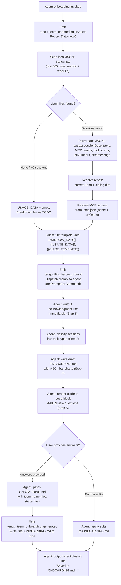

# `/team-onboarding`

> Analysis basis: CC v2.1.148 bundle.js (AST extraction + Claude interpretation)
> Minimum version: v2.1.148

---

## Overview

`/team-onboarding` is a `prompt`-type slash command that analyses the invoking user's local Claude Code session transcripts (up to 365 days back) and co-authors a personalised `ONBOARDING.md` guide for teammates new to Claude Code. The command collects usage statistics, classifies past sessions into task types, and guides the user through a two-round conversational refinement before writing the final document to disk.

---

## Registration

| Field | Value |
|---|---|
| type | `prompt` |
| name | `team-onboarding` |
| description | `Help teammates ramp on Claude Code with a guide from your usage` |
| isHidden | `false` |
| handler_method | `getPromptForCommand` |
| handler_method_start (byte) | `12444743` |
| handler_method_end (byte) | `12445453` |
| loc_byte | `12444405` |
| loc_byte_end | `12445454` |
| loc_line | `10642` |
| prompt_body.length | `4539` characters |
| prompt_body.trace | `identifier→$ (local→1 ext vars)` |
| arbor_handler.name | `getPromptForCommand` |
| arbor_handler.kind | `Method` |
| arbor_handler.fqn | `claude-2.1.148::getPromptForCommand` |
| arbor_handler.resolution_path | `direct` |
| arbor_handler.n_hits | `2` |
| `handler_method_start` | `12444743` |
| `handler_method_end` | `12445453` |

Analysis basis: CC v2.1.148 bundle.js:+12444405

---

## Input Branching

The handler executes four distinct major paths (transcript scan → data assembly → prompt template substitution → agent dispatch), with conditional sub-branches for zero-session data, MCP-server presence, and the two-round review loop.



---

## Behavioral Spec

### 1. Handler Entry and Invocation Telemetry

```
function handleTeamOnboarding(context):
    emit("tengu_team_onboarding_invoked")
    invocationTimestamp = Date.now()
    windowDays = 365          // literal: bundle.js:+12444992
    // Math.min / Math.max / Math.floor used to clamp/compute
    // the effective day window from available transcript timestamps
    rawWindow = clampWindow(windowDays)
    ...
```

Analysis basis: CC v2.1.148 bundle.js:+12444946, +12444955, +12444964, +12445003

### 2. Transcript Discovery and Parsing

The handler calls the transcript-scanner function (mapped to `$m1` internally) to enumerate JSONL conversation logs from the local Claude Code projects directory.

```
function scanTranscripts(windowDays):
    cutoffMs = Date.now() - windowDays * 24 * 60 * 1000
    // 24 * 60 * 1000 — literals: bundle.js:+12433241, +12433244, +12433250
    projectsDir = resolveProjectsDir()    // via path helper (WT / $v)
    files = fs.readdir(projectsDir)
    jsonlFiles = files.filter(f => extname(f) == ".jsonl")
    // literal ".jsonl": bundle.js:+12433356
    sessions = []
    for each file in jsonlFiles:
        stat = fs.stat(join(projectsDir, file))
        if not stat.isFile():
            continue
        raw = fs.readFile(join(projectsDir, file))
        lines = raw.split("\n")
        for each line in lines:
            if line.includes('"name":"mcp__'):
                // literal: bundle.js:+12433935 — detect MCP tool calls
                recordMcpToolUse(line)
            matches = line.matchAll(contentBlockPattern)
            // '"content":[' literal: bundle.js:+12434285
            entry = parseSessionEntry(line, matches)
            if entry.timestamp >= cutoffMs:
                sessions.push(entry)
    return sessions
```

Analysis basis: CC v2.1.148 bundle.js:+12433228, +12433269, +12433296, +12433339, +12433375, +12433612, +12433726, +12433767, +12433813

#### 2a. Session Descriptor Extraction

Each parsed JSONL line is examined with up to three regex patterns (`Bi7`, `Fi7`, `gi7`) to extract:

- Session title
- Linked PR numbers (`prNumbers`)
- First user message content
- Tool-use counts
- MCP server call counts

```
function parseSessionEntry(line, allMatches):
    titleMatch = Bi7Pattern.exec(line)     // bundle.js:+12434076
    prMatch    = Fi7Pattern.exec(line)     // bundle.js:+12434132
    mcpCount   = Number(gi7Pattern.exec(line)?.[1] ?? 0)  // bundle.js:+12434307
    firstMsg   = extractFirstUserMessage(line)
    // Truncate if firstMsg starts at offset > 3 tokens: bundle.js:+12434388
    if firstMsg.startsWith(somePrefix):
        firstMsg = firstMsg.slice(computedOffset)   // bundle.js:+12434392, +12434425
    return { title, prNumbers, firstMsg, mcpCount, toolCount }
```

Analysis basis: CC v2.1.148 bundle.js:+12434076, +12434132, +12434307, +12434388

### 3. MCP Server Resolution

The handler reads `.mcp.json` (literal: bundle.js:+12435467) from the project root via function mapped to `ci7`.

```
function resolveMcpServers(projectRoot):
    mcpConfigPath = path.join(projectRoot, ".mcp.json")   // bundle.js:+12435456, +12435467
    raw = fs.readFile(mcpConfigPath, "utf8")               // bundle.js:+12435480
    parsed = JSON.parse(raw)
    servers = parsed["mcpServers"] ?? {}                   // literal: bundle.js:+12435523
    result = []
    for each [name, config] in Object.entries(servers):
        urlOrigin = config.urlOrigin ?? null
        result.push({ name, urlOrigin, inferred_purpose: inferPurpose(name, urlOrigin) })
    return result
    // On parse error: returns empty list (guarded by J8 error handler)
```

Analysis basis: CC v2.1.148 bundle.js:+12435443, +12435456, +12435490, +12435619, +12435625, +12435702

### 4. Repo and Git Identity Resolution

Function mapped to `li7` drives the full data-collection phase. It calls:

- `w_` / `oV` for app-state access
- `WT` / `$v` / `Lz` for project-path resolution (the `"projects"` literal appears at bundle.js:+996872)
- `di7` for current-repo identification
- `T_` (process spawner) to run `git config user.name` and `git remote get-url origin`:

```
function resolveGitIdentity():
    name   = spawnSync("git", ["config", "user.name"])    // literals: bundle.js:+12436090, +12436097, +12436106
    remote = spawnSync("git", ["remote", "get-url", "origin"])
    // literals: bundle.js:+12436162, +12436171, +12436181
    return { generatedBy: name.trim(), repoUrl: remote.trim() }

function resolveCurrentRepo(projectPath):
    basename = path.basename(projectPath)     // bundle.js:+12436278
    siblingDirs = enumerateSiblings(projectPath)
    return { currentRepo: basename, siblings: siblingDirs }
```

Analysis basis: CC v2.1.148 bundle.js:+12435768, +12435775, +12435789, +12435906, +12436057, +12436087, +12436090, +12436162, +12436278

### 5. Prompt Template Assembly and Dispatch

After data collection, `getPromptForCommand` constructs the final prompt string by substituting three template placeholders using `String.replaceAll`:

```
function buildPrompt(usageData, windowDays, guideTemplate):
    body = PROMPT_TEMPLATE                              // 4539-char body
    body = body.replaceAll("{{WINDOW_DAYS}}", String(windowDays))
    // literal "{{WINDOW_DAYS}}": bundle.js:+12445203
    body = body.replaceAll("{{GUIDE_TEMPLATE}}", guideTemplate)
    // literal "{{GUIDE_TEMPLATE}}": bundle.js:+12445243
    body = body.replaceAll("{{USAGE_DATA}}", JSON.stringify(usageData))
    // literal "{{USAGE_DATA}}": bundle.js:+12445278
    emit("tengu_flint_harbor_prompt")                  // bundle.js:+12444780
    return { type: "text", content: body }             // literal "text": bundle.js:+12445437
```

Analysis basis: CC v2.1.148 bundle.js:+12444749, +12444777, +12445181, +12445190, +12445203, +12445221, +12445243, +12445278, +12445437

### 6. Agent Instruction Sequence (Prompt Body Grounding)

The assembled prompt instructs the agent to execute the following steps in strict order:

```
agent procedure teamOnboardingGuide(sessionDescriptors, windowDays, usageData):

    // Step 1 — mandatory first output (no tool calls, no thinking before this)
    print("> Looking at how you've used Claude over the last " + windowDays + " days …")

    // Step 2 — classify sessions
    for each session in sessionDescriptors:
        taskType = classify(session) into one of:
            build_feature | debug_fix | improve_quality |
            analyze_data  | plan_design | prototype | write_docs
        // Display with title case in the rendered guide
    pick top 3–5 task types with rough percentages
    // If ~0 sessions: leave breakdown as TODO

    // Step 3 — gather remaining context
    repos   = [currentRepo] + siblingRepoDirs
    servers = resolveMcpServers()  // name + urlOrigin → inferred access instructions
    // Leave "Team Tips" and "Get Started" as TODO placeholders for Review round

    // Step 4 — write ONBOARDING.md from GUIDE_TEMPLATE
    // Fill real numbers; ASCII bar chart: █ (filled) ░ (empty), 20 chars wide
    // Use generatedBy for author name; omit if missing
    // Keep the HTML comment instruction at the bottom verbatim
    write("ONBOARDING.md", renderGuide(taskBreakdown, repos, servers, usageData))

    // Step 5 — first-turn close
    renderInCodeBlock("ONBOARDING.md content")
    print("---")
    print("**Review**")
    print("1. Team name confirmation or request")
    print("2. Starter task for newcomers? (ticket / doc link — optional)")
    print("3. Team tips not already in CLAUDE.md?")

    // Round 2 — after user replies
    on userReply:
        patch("ONBOARDING.md", teamName, tips, starterTask)
        emit("tengu_team_onboarding_generated")
        print("Saved to `ONBOARDING.md`. Drop it in your team docs …")

    // Subsequent edits
    on furtherEdits:
        applyEdits("ONBOARDING.md", edits)
```

Analysis basis: CC v2.1.148 bundle.js:+12444743, +12445181, +12445299, +12445322

### 7. Guide Finalisation and Share Telemetry

After the agent writes the final file, `ioH` (the share/harbour function) is invoked, emitting `tengu_flint_harbor_share` (bundle.js:+9245745) alongside the standard `V6` session-dispatch helper.

```
function finaliseAndShare(guideContent):
    emit("tengu_flint_harbor_share")
    emit("tengu_team_onboarding_generated")        // bundle.js:+12445322
    dispatchToSession(guideContent)                // V6 → session infrastructure
```

Analysis basis: CC v2.1.148 bundle.js:+12445299, +9245742, +9245745

---

## State & Side Effects

| Item | Detail |
|---|---|
| **Telemetry — invocation** | `tengu_team_onboarding_invoked` (bundle.js:+12445003) |
| **Telemetry — prompt dispatch** | `tengu_flint_harbor_prompt` (bundle.js:+12444780) |
| **Telemetry — guide generated** | `tengu_team_onboarding_generated` (bundle.js:+12445322) |
| **Telemetry — share** | `tengu_flint_harbor_share` (bundle.js:+9245745) |
| **Telemetry — config errors** | `tengu_config_parse_error` (bundle.js:+3187440), `tengu_config_lock_contention` (bundle.js:+3184859), `tengu_config_stale_write` (bundle.js:+3184995), `tengu_config_auth_loss_prevented` (bundle.js:+3185338) |
| **Telemetry — background daemon** | `tengu_bg_dispatch_sigkill_escalate`, `tengu_bg_dispatch_low_mem`, `tengu_bg_spare_enable`, `tengu_bg_spare_claim`, `tengu_bg_spare_claim_fail`, `tengu_bg_spare_spawn`, `tengu_bg_low_mem_mb`, `tengu_daemon_control` (various bundle offsets in 15117xxx–15153xxx range) |
| **Telemetry — feature flags** | `tengu_feature_ok` (bundle.js:+960829), `tengu_feature_bad` (bundle.js:+960887) |
| **File reads** | Local JSONL transcript files under projects directory; `.mcp.json` in project root |
| **File writes** | `ONBOARDING.md` created/updated in the current working directory |
| **Process spawns** | `git config user.name`, `git remote get-url origin` (via `T_` / `i2H` subprocess infrastructure) |
| **appState changes** | Session UUID generated (via `h4_.randomUUID`); session added to active-session registry (`V$H`, `b4_`); Growthbook experiment event emitted (`growthbook_experiment`, bundle.js:+3158552) |
| **Config lock** | `saveConfigWithLock` acquires a file lock before writing config; contention logged via `tengu_config_lock_contention` |
| **Sound** | None detected in depth-2 traversal |

---

## Version History

| Version | Change |
|---|---|
| v2.1.148 | Initial analysis — command first observed in bundle; 365-day transcript window, two-round review flow, `tengu_team_onboarding_invoked` / `tengu_team_onboarding_generated` telemetry |

---

## Common Mistakes

1. **Running the command outside a Git repository.** The handler shells out to `git config user.name` and `git remote get-url origin`; if neither succeeds, `generatedBy` is omitted from the guide and the repo section will be sparse. This is handled gracefully — the guide is still produced.

2. **No prior Claude Code sessions.** If the local projects directory contains no `.jsonl` files within the 365-day window, the work-type breakdown is left as a `TODO` placeholder and the guide will be minimal. Users should run `/team-onboarding` after accumulating some real usage.

3. **Missing `.mcp.json`.** If the project root has no `.mcp.json`, the MCP server section of the guide will be empty. The parse error is caught silently; no MCP entries appear rather than the command failing.

4. **Expecting an immediate finished document.** The command is deliberately two-round: it produces a draft first, then asks three review questions. The final `ONBOARDING.md` is only written after the user replies (or declines) in round two.

5. **Editing `ONBOARDING.md` manually between rounds.** Because the agent holds the in-progress content in its context window and then overwrites the file on the round-two write, manual edits made between the draft output and the review reply will be lost.

6. **Confusing `{{GUIDE_TEMPLATE}}` with the output.** The `{{GUIDE_TEMPLATE}}` placeholder in the prompt body (bundle.js:+12445243) is substituted at dispatch time with the Anthropic-maintained template string — it is not user-editable.

---

## Appendix — Identifier Mapping

> For bundle debugging only. Identifiers change across versions.

| Identifier | Role |
|---|---|
| `__handler_team-onboarding` | Synthetic BFS entry-point for the command handler (not a real bundle symbol) |
| `V6` | Session dispatch / agent-turn initiator |
| `Df6` | Session dispatch sub-helper A |
| `wf6` | Session dispatch sub-helper B |
| `Ct` | Conversation context builder |
| `UH` | String coercion utility |
| `rC` | Request/conversation record constructor |
| `Qh` | Conversation queue handler |
| `As6` | Active-session registry manager |
| `C4_` | Session creation and registration |
| `ATH` | Session type classifier ("firstParty") |
| `Um` | Random hex token generator (32-byte) |
| `CH` | JSON serialiser wrapper |
| `ig4` | Session initialisation finaliser |
| `p4_` | Session persistence helper |
| `y29` | XUH-based session ID formatter |
| `HA` | Km-based session helper |
| `Jy9` | Session journal writer |
| `VbH` | Known-session set checker |
| `x6` | Transcript file reader / session loader |
| `F6` | Filesystem base-path resolver |
| `o4_` | File-watch options builder |
| `k$H` | Config file reader and parser |
| `q` | Filesystem module reference (Node `fs`) |
| `B6` | JSON.parse wrapper |
| `OC` | String prefix stripper |
| `_` | General-purpose utility / fs-sync wrapper |
| `q8` | Async error handler / throw helper |
| `hy9` | Backup directory enumerator |
| `N` | Message/notification formatter |
| `RH` | Error reporter with log push |
| `c` | Core app-state / context object |
| `AL_` | Path join + stat helper for backups |
| `w` | Background daemon process manager |
| `EQ4` | File-watcher setup (watchFile/unwatchFile) |
| `Tn` | Watch-event handler |
| `r9` | Signal/hook registrar (`D9A.register`) |
| `M8` | Multi-session transcript aggregator |
| `_L_` | Per-project transcript loader with locking |
| `L` | Active-task set manager |
| `M` | Session lifecycle manager (open/close) |
| `n99` | Object-assign metadata merger |
| `et8` | l99-based metadata extractor |
| `Wf6` | Config write-guard (auth-loss prevention) |
| `A` | Lowercase utility / active-map reference |
| `Z` | Path prefix checker |
| `X` | Multi-server MCP connector |
| `YN8` | MCP server initialiser |
| `n_` | Error-string normaliser |
| `V` | Slice-based array utility |
| `sq6` | Atomic file writer (temp + rename) |
| `O` | File-stat result accessor |
| `J8` | Error-code extractor |
| `H` | Randomised retry / timeout helper |
| `sUH` | Session-descriptor accumulator |
| `yy9` | Object.entries-based session iterator |
| `tUH` | Timestamp-based session filter |
| `HL_` | Config-file atomic updater |
| `li7` | Usage-data collector (orchestrator) |
| `w_` | App-state accessor |
| `oV` | State-observer helper |
| `WT` | Project-path resolver |
| `$v` | Projects-subdirectory resolver |
| `Lz` | Path segment normaliser |
| `VUK` | Math.abs-based path-length calculator |
| `$m1` | JSONL transcript scanner and parser |
| `t9` | q8-based async wrapper |
| `K` | Array map/padEnd utility |
| `$` | App-state root / ZC1 accessor |
| `ZC1` | Top-level app-state container |
| `z` | Background session state accessor |
| `bH` | Background-session stop helper |
| `mH` | Background-session stop-failed helper |
| `Pk` | Active-request tracker |
| `Ou` | Process-exit orchestrator |
| `D` | Daemon subprocess wrapper |
| `sG8` | Platform detector (macos/windows) |
| `V6A` | Background spare process spawner |
| `Az` | Async-action scheduler |
| `ci7` | `.mcp.json` reader and parser |
| `di7` | Current-repo identifier |
| `T_` | Subprocess spawner (git commands) |
| `i2H` | Child-process manager (spawn/kill/pipe) |
| `NPA` | Platform-specific executable resolver |
| `hB8` | JPA-based stdin handler |
| `SB8` | JPA/fFK-based stdout handler |
| `CB8` | zFK-based stderr handler |
| `bJA` | Finite-number validator |
| `eq6` | IBK-based IPC channel handler |
| `yB8` | Reflect-based stream proxy |
| `OPA` | Process-exit event listener |
| `CJA` | Promise-race timeout wrapper |
| `xJA` | Process kill helper |
| `SJA` | RBK-based signal handler |
| `RJA` | SIGKILL escalation handler |
| `fPA` | kB8/IB8-based stream aggregator |
| `q16` | $B8-based process-result collector |
| `LPA` | AFK/Ex6-based pipe configurator |
| `MPA` | APA-default-based stream multiplexer |
| `UJA` | WB8-bound stdout/stderr binder |
| `JFK` | String-based command formatter |
| `s2H` | Git-URL parser / remote-origin extractor |
| `cFK` | Uq-based URL hostname extractor |
| `Uq` | String indexOf/slice URL component splitter |
| `ioH` | Harbour/share prompt dispatcher |
| `j1` | XwA-based prompt record builder |
| `XwA` | UH-based prompt string assembler |

---

*Note: index built via Arbor fallback; some signals (telemetry, literals) may be missing — see arbor-fallback.js.*