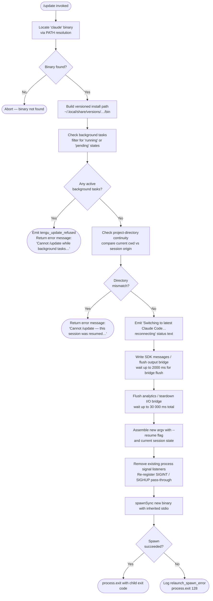

# `/update`

> Analysis basis: CC v2.1.148 bundle.js (AST extraction + Claude interpretation)
> Minimum version: v2.1.148

---

## Overview

`/update` switches the running Claude Code CLI to the latest installed version while preserving the active conversation. It performs a series of safety checks (background-task guard, project-directory continuity), tears down the current session's I/O bridge, and then re-executes the process using the newly located binary — effectively performing an in-place hot-swap without losing conversational context.

---

## Registration

| Field | Value |
|---|---|
| type | `local` |
| name | `update` |
| description | `Switch to the latest version (conversation continues)` |
| loc_byte | `12125677` |
| loc_byte_end | `12125879` |
| loc_line | `9967` |
| supportsNonInteractive | `false` |
| isHidden | `true` |
| module_id | `aS1` |
| load_inline | `true` |
| arbor_handler.name | `OQ7` |
| arbor_handler.fqn | `claude-2.1.148::OQ7` |
| arbor_handler.kind | `AsyncFunction` |
| arbor_handler.resolution_path | `module_id` |
| arbor_handler.n_hits | `0` |

Analysis basis: CC v2.1.148 bundle.js:+12125677

---

## Input Branching

The command has more than three distinct control-flow paths (background-task check, project-directory mismatch check, background-task state filtering, flush/teardown, and final re-exec), so a Mermaid flowchart is used.



---

## Behavioral Spec

### 1. Handler Entry — `updateCommandHandler` (bundle identifier: `OQ7`)

The Arbor symbol graph resolves the primary handler as `OQ7` (AsyncFunction), reached via `module_id → aS1`.

```
async function updateCommandHandler(context):

    // Step 1 — locate the running binary
    binaryPath = resolveBinaryOnPath("claude")          // via checkBinaryOnPath (s08 → c3 → nPA → Bun.which)
    if binaryPath is null:
        return  // silent abort

    // Step 2 — compute the versioned install directory
    installRoot = buildVersionedInstallPath()           // hx → LY8, iDH, P6H
    //   resolves to  ~/.local/share/versions/<ver>/bin
    //   using os.homedir() + path.join(".local","share","versions","bin")
```

Analysis basis: CC v2.1.148 bundle.js:+12123521, +12123574

---

### 2. Pre-flight Guard — Background Tasks

```
    // Step 3 — guard against active background tasks
    taskStates = Object.values(getBackgroundTaskMap())   // OQ7 → Object.values
    hasActiveTasks = taskStates.some(state =>
        state === "running" || state === "pending"
    )
    if hasActiveTasks:
        emitTelemetry("tengu_update_refused")
        return errorMessage(
            "Cannot /update while background tasks are running — wait for them to finish, then try again."
        )
```

Analysis basis: CC v2.1.148 bundle.js:+12123619, +12123844, +12123882, +12123904, +12123985

---

### 3. Pre-flight Guard — Project Directory Continuity

```
    // Step 4 — verify session was not resumed from a different project directory
    if sessionOriginDirectory !== process.cwd():
        return errorMessage(
            "Cannot /update — this session was resumed from a different project directory. Restart manually with --resume to continue on the latest version."
        )
```

Analysis basis: CC v2.1.148 bundle.js:+12124092, +12124226

---

### 4. Status Notification and Message Persistence

```
    // Step 5 — inform the user
    emitStatusText("Switching to latest Claude Code… reconnecting")   // literal at +12124737

    // Step 6 — write pending SDK messages to output
    writeSdkMessages(outputBridge)                      // OQ7 → O.writeSdkMessages

    // Step 7 — generate a fresh session UUID for the resumed session
    newSessionId = generateUUID()                       // rS1 → o08.randomUUID
```

Analysis basis: CC v2.1.148 bundle.js:+12124713, +12124733, +12124737

---

### 5. I/O Bridge Flush and Teardown

```
    // Step 8 — flush output bridge with a 2 000 ms timeout
    await withTimeout(outputBridge.flush(), 2000, "bridge flush")
    //   dM wraps Promise.race([bridgePromise, timeoutPromise])
    //   timeout label: "bridge flush"

    // Step 9 — full teardown of the I/O bridge
    outputBridge.teardown()                             // OQ7 → O.teardown
```

Analysis basis: CC v2.1.148 bundle.js:+12124804, +12124807, +12124817, +12124822, +12124858

---

### 6. Re-exec Orchestration — `relaunchWithResume` (bundle identifier: `FJH`)

```
function relaunchWithResume(newBinaryPath, sessionState):

    // Step 10 — compute absolute path to new binary
    resolvedPath = resolveAbsolutePath(newBinaryPath)   // kN1 → IN1.isAbsolute, process.cwd

    // Step 11 — stat the target binary to confirm it exists
    await fs.stat(resolvedPath)                         // FJH → SN1.stat

    // Step 12 — flush analytics with a 30 000 ms outer timeout
    await Promise.race([
        analyticsFlush(),
        timeout(30000, "flush timeout (relaunch)")
    ])
    //   Also races a "analytics flush timeout" label
    //   and a "cleanup timeout" sub-timer

    // Step 13 — run pre-exit cleanup hooks in parallel
    await Promise.all([cleanupTasks()])                 // FJH → Promise.all
    await drainEventQueue()                             // WRH → D9A.drain

    // Step 14 — build the new argv array including --resume flag
    newArgv = buildArgvWithResume(sessionState)         // literal "--resume" at +11855609
    Object.assign(newArgv, existingEnv)

    // Step 15 — reset signal handling
    process.removeAllListeners()
    process.on("SIGINT",  passThrough)
    process.on("SIGHUP",  passThrough)

    // Step 16 — spawn replacement process synchronously
    result = hN1.spawnSync(resolvedPath, newArgv, { stdio: "inherit" })

    if result indicates spawn error:
        writeErrorFile(relaunchSpawnError)              // A2 → cRH.writeFileSync
        emitTelemetry("relaunch_spawn_error")
        process.exit(128)
    else:
        process.exit(result.status)
```

Analysis basis: CC v2.1.148 bundle.js:+12124980, +11855480, +11855556, +11855609, +11855650, +11855663, +11855671, +11855722, +11855778, +11856032, +11856100, +11856106, +11856173, +11856203, +11856230, +11856452, +11856479, +11856544

---

### 7. Versioned Install Path Resolution (`buildVersionedInstallPath`, bundle identifiers: `hx`, `LY8`, `iDH`, `P6H`)

```
function buildVersionedInstallPath():
    home = os.homedir()                                 // nM8 → Ghq.homedir
    // path components: ".local", "share", "versions"
    versionsDir = path.join(home, ".local", "share", "versions")
    // then appends per-version subdirectory, then "bin"
    return path.join(versionsDir, <version>, "bin")
```

Analysis basis: CC v2.1.148 bundle.js:+8791071, +8791091, +8791100, +8791115, +7506302, +7506333, +7506344, +7506353, +7506424

---

## State & Side Effects

| Item | Detail |
|---|---|
| Telemetry — `tengu_update_refused` | Fired when `/update` is blocked because one or more background tasks are in `running` or `pending` state (bundle.js:+12123621) |
| Telemetry — `tengu_scroll_summary` | Fired during the terminal scroll/cleanup phase prior to re-exec (bundle.js:+5274361) |
| Telemetry — `tengu_amber_creek` | Fired from fullscreen/terminal-state path during teardown (bundle.js:+3351745) |
| Telemetry — `tengu_pewter_brook` | Fired from an alternate fullscreen/terminal-state branch (bundle.js:+3351653) |
| Telemetry — `tengu_bg_dispatch_sigkill_escalate` | Background-process supervisor escalation during cleanup (bundle.js:+15117585) |
| Telemetry — `tengu_feature_bad` / `tengu_feature_ok` | Feature-flag probe success/failure during cleanup path (bundle.js:+960887, +960829) |
| Telemetry — `tengu_bg_low_mem_mb` | Low-memory check on background session (bundle.js:+12461545) |
| Telemetry — `tengu_bg_dispatch_low_mem` | Background dispatch aborted due to low memory (bundle.js:+15118164) |
| Telemetry — `tengu_bg_spare_enable` | Spare background slot enabled (bundle.js:+15118859) |
| Telemetry — `tengu_bg_sendclaim_failed` | Failed to claim a background slot (bundle.js:+15098686) |
| Telemetry — `tengu_bg_spare_claim` | Spare slot claim attempted (bundle.js:+15118980) |
| Telemetry — `tengu_bg_spare_spawn` | Spare background process spawned (bundle.js:+15117278) |
| Telemetry — `tengu_bg_spare_claim_fail` | Spare slot claim failed (bundle.js:+15119243) |
| Telemetry — `tengu_daemon_control` | Daemon stop/stop-failed events during teardown (bundle.js:+15153677) |
| appState changes | `_.getAppState` / `_.setAppState` called around message serialisation; the `assistant-` prefix is used to tag outgoing messages for the resumed session (bundle.js:+12124473, +12124527, +12124627) |
| Signal handling | All existing `process` listeners are removed; `SIGINT` and `SIGHUP` are re-registered before `spawnSync` (bundle.js:+11856173, +11856203) |
| SDK message output | `O.writeSdkMessages` serialises in-flight SDK messages before process replacement (bundle.js:+12124713) |
| Flush timeout | Bridge flush hard-capped at **2 000 ms** (bundle.js:+12124817); overall relaunch flush capped at **30 000 ms** (bundle.js:+11855671) |
| Analytics flush timeout | Labelled `"analytics flush timeout"` sub-race with **500 ms** granularity (bundle.js:+11855789, +5274650) |
| Sound / visual | Terminal cursor-save/restore sequences (`ESC 7` / `ESC 8`) emitted during cleanup; tmux and iTerm2 multiplexer-aware (bundle.js:+3686190, +3686201, +3419257, +3419326) |
| Error file | On spawn failure, an error record is written synchronously via `cRH.writeFileSync` before `process.exit(128)` (bundle.js:+11856452, +189287) |
| Hook registration | `D9A.register` / `D9A.drain` used for pre-exit hook queue management (bundle.js:+57468, +57511) |

---

## Version History

| Version | Change |
|---|---|
| v2.1.148 | Initial analysis |

---

## Common Mistakes

1. **Invoking `/update` with active background tasks** — the command will refuse and emit `tengu_update_refused`. Wait for all background tasks to reach a terminal state before retrying.
2. **Using `/update` in a `--resume` session whose working directory differs from the original project directory** — the command will refuse with the "resumed from a different project directory" message; in this case the user must restart manually with `--resume`.
3. **Expecting `/update` to be visible in the slash-command menu** — `isHidden: true` means it does not appear in autocomplete or help listings; it must be typed explicitly.
4. **Expecting non-interactive use** — `supportsNonInteractive: false` means the command is only available in interactive terminal sessions.
5. **Assuming the new binary is fetched from the network** — `/update` switches to a version already installed locally under `~/.local/share/versions/…/bin`; it does not itself download a new release.
6. **Ignoring the 30-second relaunch window** — if the analytics flush and cleanup hooks do not complete within 30 000 ms, the process proceeds anyway; long-running hooks may be cut short.

---

## Appendix — Identifier Mapping

> For bundle debugging only. Identifiers change across versions.

| Identifier | Role |
|---|---|
| `OQ7` | Primary async handler for `/update` (resolved via Arbor, module_id `aS1`) |
| `s08` | Binary-path check helper; calls `c3` to probe PATH for `"claude"` |
| `c3` | Wraps PATH resolution logic; delegates to `nPA` → `Bun.which` |
| `nPA` | Thin shim calling `Bun.which` for binary lookup |
| `hx` | Versioned install-path builder; coordinates `LY8`, `iDH`, `P6H` |
| `LY8` | Constructs the `versions/` subdirectory path segment |
| `cf` | Array shape validator (`Array.isArray` check) |
| `iDH` | Resolves `~/.local/share` base via `nM8` (homedir) + `DJ6.join` |
| `nM8` | Returns `os.homedir()` via `Ghq.homedir` |
| `P6H` | Resolves the `bin` leaf of the versioned install path |
| `Rq` | Formats and emits the status/progress text block |
| `T3H` | Progress/spinner renderer; supports `"bg"`, `"daemon"`, `"daemon-worker"` modes |
| `c` | Generic text/content node constructor (produces `"text"` content type) |
| `jG` | Basename extractor + `h6` call for content formatting |
| `h6` | Content wrapper that calls `oV` |
| `oV` | Low-level output value emitter |
| `zR` | Filesystem utility (used for path checks in `FJH`, `Vc_`) |
| `Vc_` | Updates the installation record: calls `CN1.dirname`, `AO`, `M4` |
| `w_` | Helper inside `Vc_`; calls `oV` |
| `M4` | Helper inside `Vc_`; calls `oV` |
| `e8H` | Pre-relaunch state serialiser |
| `mo` | Background-task registry accessor; checks `VT8` / `ka7.has` for `"ant"` entries |
| `VT8` | Background task state store |
| `Ul_` | Appends a `"last-prompt"` entry to the session log via `_.appendEntry` |
| `v4` | Hook registration helper (`r9` → `D9A.register`) |
| `r9` | Registers a pre-exit hook with `D9A.register` |
| `RH` | Error formatter / log writer; uses `n_`, `UH`, `j1`, `FpK`, `Gl.logError` |
| `n_` | Constructs Error objects from strings |
| `UH` | Converts values to String |
| `j1` | Delegates to `XwA` for structured error wrapping |
| `XwA` | Wraps `UH` in structured error shape |
| `FpK` | Ring-buffer manager for error log: `lb6.shift` / `lb6.push` |
| `BG` | Session-state snapshot helper called before message write |
| `O` | Output bridge object exposing `writeSdkMessages`, `flush`, `teardown` |
| `v8` | Underlying write transport used by `O` |
| `rS1` | UUID generator for new session ID; uses `o08.randomUUID` |
| `dM` | Promise-race timeout wrapper; uses `setTimeout` / `clearTimeout` |
| `SOH` | String formatter for argv construction |
| `FJH` | Re-exec orchestrator: stat → flush → cleanup → `spawnSync` → `process.exit` |
| `JD6` | Interval cleaner; calls `oP_` → `clearInterval` |
| `oP_` | Wraps `clearInterval` |
| `VVH` | Terminal teardown: `yYH.writeSync`, `H.unmount`, `nh`, `ue6`, `UH` |
| `H` | Ink/React terminal renderer; exposes `unmount`, `replaceAll` |
| `nh` | Post-unmount cleanup step |
| `ue6` | Terminal restore writer: emits `ESC 8` restore sequence, calls `FTH`, `mTH`, `zG` |
| `FTH` | Terminal type detector (Ghostty ≥ 1.2.0, iTerm2 ≥ 3.6.6); uses `wx9.coerce`, `WJ`, `JZ` |
| `mTH` | Additional terminal restore helper |
| `zG` | Multiplexer escape handler (tmux `\ESC\ESC`, screen); uses `dc4`, `H.replaceAll` |
| `M18` | Scroll-summary renderer; calls `sV`, `B7q`, `c`, `U7q`, `z9` |
| `sV` | Summary view component |
| `B7q` | Summary builder helper |
| `U7q` | Time-delta/padding calculator using `Date.now`, `Math.max`, `Math.round`, `Object.assign` |
| `m7q` | Sub-helper for `U7q` |
| `z9` | Full-screen terminal state manager; orchestrates `VbH`, `G7_`, `bn`, `N`, `W7_`, `HA`, `ql4`, `V6` |
| `VbH` | Fullscreen capability gate (`kmK.has`) |
| `G7_` | Fullscreen entry formatter using `r1`, `UH` |
| `bn` | Alternate fullscreen path using `Al4` |
| `N` | Terminal control-sequence dispatcher |
| `W7_` | Windows-over-SSH / ConPTY detection (platform `"windows"`) |
| `HA` | Calls `Km` for fullscreen activation |
| `ql4` | Calls `V6` for fullscreen rendering |
| `V6` | Core fullscreen render: `Df6`, `wf6`, `Ct`, `V$H.has`, `As6`, `zf6.add`, `Pg.has/get`, `x6` |
| `PV` | Parallel hook runner; calls `v4` |
| `WRH` | Event-queue drainer; calls `D9A.drain` |
| `f18` | Analytics flush orchestrator: `Promise.all`, `Promise.race`, `$Z`, `Eg`, `r8` |
| `r8` | Subprocess exit waiter; uses `setTimeout`, `clearTimeout`, `L.unref`, `O` |
| `K` | Worker/subprocess tracker; exposes `L.map`, `M.padEnd` |
| `q` | Active-process set used by `r8` |
| `L` | Promise lifecycle tracker: `q.add`, `M.finally`, `q.delete` |
| `kN1` | Exec-via-FFI helper: resolves path, calls `f.execve` after loading `bun:ffi` / libc |
| `M` | Native module handle (dlopen result) |
| `A` | MCP client registry map |
| `$` | Subprocess registry; calls `ZC1` |
| `ZC1` | Subprocess record constructor: `ll`, `Date.now`, `M1`, `aE6`, `CH` |
| `w` | Background worker supervisor: manages spare/exec slots, memory checks |
| `C` | Individual supervised worker: `SfK`, `Az`, `N`, `RH`, `Nj5`, `z.write` |
| `mH` | Worker state reporter (ok path) calling `c` |
| `bH` | Worker state reporter (bad path) calling `c` |
| `sG8` | Memory threshold check: `o6`, `V6`; emits `tengu_bg_low_mem_mb` |
| `T$6` | Config file reader: `wX.readFile`, `M$_`, `B6`, `Array.isArray`, `_.filter`, `J8`, `v9L` |
| `g` | MCP tool-use roster: `oH.filter`, `vH.has` |
| `v6A` | Background session connector: `KB.claim`, `EN8.connect`, `M.on/once/write/end` |
| `S6A` | Background session lifecycle manager: spawn, track, clean up, roster entry |
| `D` | Background session disposer: `V6`, `$.dispose`, `sG8`, `R6A.freemem` |
| `q8` | Session queue helper |
| `S` | Spare session slot holder |
| `f` | Exec-path orchestrator: `EkH`, `k7K`, `L.get`, `N`, `_D5` |
| `EkH` | MCP server initialiser: connects transport types (stdio/sse/http/sse-ide/ws-ide) |
| `k7K` | MCP update applicator: `H.applyMcpUpdate`, `kJ8`, `A.cleanup`, `sN`, `nj` |
| `_D5` | MCP retry/recovery manager: `_.getClients`, `EK8`, `r8`, `laH`, `EkH`, `k7K` |
| `z` | Supervised process group: `bH`, `mH`, `Pk`, `Ou` |
| `Pk` | Render patch applicator: `rC`, `jg.push`, `ATH`, `R4_`; uses `"firstParty"` flag |
| `Ou` | Process-group exit handler: `Promise.race`, `Promise.all`, `Jg`, `Tg`, `r8`, `process.exit` |
| `ZH` | String coercion helper used across multiple sites |
| `A2` | Error-file writer on spawn failure: `cRH.writeFileSync`, `JS8.join` |

---

Note: index built via Arbor fallback; some signals (telemetry, literals) may be missing — see arbor-fallback.js.