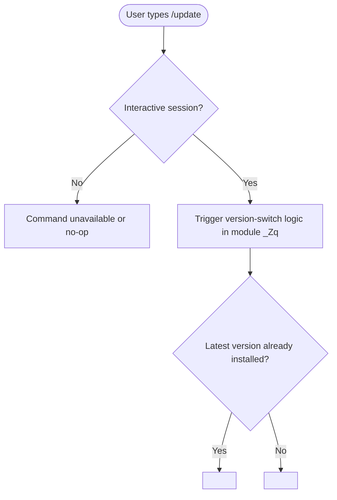

# `/update`

> Analysis basis: CC v2.1.144 bundle.js (AST extraction + Claude interpretation)
> Minimum version: v2.1.144

---

## Overview

The `/update` command instructs Claude Code to switch to the latest available version of itself while preserving the current conversation context. It is a hidden, local command intended for in-session version management without requiring the user to restart or lose conversational state.

---

## Registration

| Field | Value |
|---|---|
| type | `local` |
| name | `update` |
| description | `Switch to the latest version (conversation continues)` |
| supportsNonInteractive | `false` |
| isHidden | `true` |
| module\_id | `_Zq` |

Analysis basis: CC v2.1.144 bundle.js:+11676882

---

## Input Branching

The AST traversal at depth ≤ 2 did not resolve any call graph edges from module `_Zq`, meaning no branching logic could be verified from the extracted data.

<!-- TODO: not found in depth-2 traversal; needs --depth 4 -->

The registration fields do, however, establish two structurally certain constraints:

1. **`supportsNonInteractive: false`** — the command is only valid when an interactive session is active. If invoked from a non-interactive context (e.g., piped stdin, `--print` mode), it must be expected to either be unavailable or produce no meaningful effect.
2. **`isHidden: true`** — the command does not appear in the publicly visible slash-command list rendered by `/help` or tab-completion menus.



Analysis basis: CC v2.1.144 bundle.js:+11676882 (registration fields `supportsNonInteractive`, `isHidden`)

---

## Behavioral Spec

### Version-Switch Dispatch

Because the call graph for module `_Zq` returned no edges at traversal depth ≤ 2, the internal implementation of the version-switch cannot be specified from verified data. The pseudocode below reflects only what is structurally derivable from the registration object.

```
function handleUpdateCommand(session):

    # Guard: command is only reachable in interactive mode
    if not session.isInteractive:
        return  # no-op or unreachable by construction

    # Delegate to module _Zq entry point (unresolved at depth-2)
    result = _Zq.execute(session)

    # Post-execution behavior: conversation state is described as
    # continuing ("conversation continues" per registration description),
    # implying session context is preserved across the version switch.
    # Exact mechanism: <!-- TODO: not found in depth-2 traversal; needs --depth 4 -->

    return result
```

Analysis basis: CC v2.1.144 bundle.js:+11676882

### Session Continuity Contract

The registration description explicitly states `"conversation continues"`, which establishes a behavioral contract: the active conversation context (message history, working directory, any in-progress task state) must survive the version-switch operation. The mechanism by which this is achieved — e.g., serialization, in-process reload, or IPC handoff — is:

<!-- TODO: not found in depth-2 traversal; needs --depth 4 -->

---

## State & Side Effects

| Item | Detail |
|---|---|
| Telemetry | None detected at depth-2 traversal. <!-- TODO: not found in depth-2 traversal; needs --depth 4 --> |
| Hook registration | <!-- TODO: not found in depth-2 traversal; needs --depth 4 --> |
| appState changes | <!-- TODO: not found in depth-2 traversal; needs --depth 4 --> |
| Sound | <!-- TODO: not found in depth-2 traversal; needs --depth 4 --> |
| Session continuity | Declared by registration description: conversation context is preserved after the update |
| Visibility | Hidden from user-facing command lists (`isHidden: true`) |
| Non-interactive support | Not supported (`supportsNonInteractive: false`) |

Analysis basis: CC v2.1.144 bundle.js:+11676882

---

## Version History

| Version | Change |
|---|---|
| v2.1.144 | Initial analysis; module `_Zq` entry functions not resolved at depth-2 traversal |

---

## Common Mistakes

1. **Invoking `/update` in non-interactive mode**: Because `supportsNonInteractive` is `false`, running `/update` in a scripted or piped context will not behave as expected. Only use this command within a live, interactive Claude Code session.
2. **Expecting the command to appear in `/help` output**: The `isHidden: true` flag means `/update` is intentionally omitted from visible command listings. Its absence from the help menu is by design, not a missing feature.
3. **Assuming the conversation is lost after updating**: The registration description explicitly states the conversation continues, so users should not pre-emptively save or restart their session before running `/update`.
4. **Confusing `/update` with an OS-level package upgrade**: This command operates within a running Claude Code session. It does not invoke a package manager (npm, brew, etc.) directly — the exact mechanism is unverified at the current traversal depth, but it is scoped to the CLI process.

---

## Appendix — Identifier Mapping

> For bundle debugging only. Identifiers change across versions.

| Identifier | Role |
|---|---|
| `_Zq` | Module containing the `/update` command registration and implementation; entry functions not resolved at depth-2 traversal |

> No additional obfuscated identifiers were returned by the depth-2 AST extraction for this command.
> Analysis basis: CC v2.1.144 bundle.js:+11676882