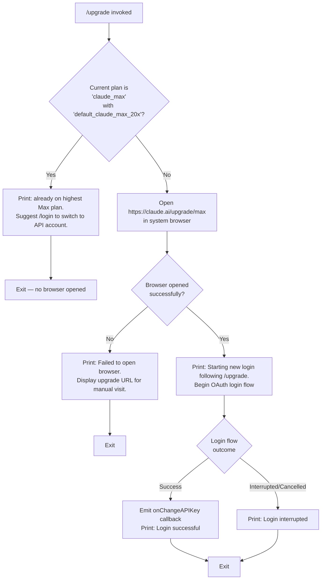

# `/upgrade`

> Analysis basis: CC v2.1.147 bundle.js (AST extraction + Claude interpretation)
> Minimum version: v2.1.147

---

## Overview

The `/upgrade` command guides the user from their current Claude subscription tier to the **Claude Max** plan by opening `https://claude.ai/upgrade/max` in the system browser and then automatically initiating a new login flow to capture the upgraded credentials. If the user is already on the highest Max tier (identified by the `claude_max` plan token with the `default_claude_max_20x` variant), the command short-circuits immediately with an informational message instead of opening a browser window.

---

## Registration

| Field | Value |
|---|---|
| type | `local-jsx` |
| name | `upgrade` |
| description | `Upgrade to Max for higher rate limits and more Opus` |
| module_id | `ol_` |
| load_inline | `true` |
| loc_byte | `12146994` |
| loc_byte_end | `12147254` |
| loc_line | `9972` |
| arbor_handler.name | `QE6` |
| arbor_handler.fqn | `claude-2.1.147::QE6` |
| arbor_handler.kind | `AsyncFunction` |
| arbor_handler.resolution_path | `module_id` |
| arbor_handler.n_hits | `0` |

Analysis basis: CC v2.1.147 bundle.js:+12146994

---

## Input Branching

The command has four distinct execution paths depending on the current subscription plan, browser availability, and login outcome.



Analysis basis: CC v2.1.147 bundle.js:+12146126, +12146151, +12146269, +12146355, +12146370, +12146520, +12146523, +12146556, +12146595, +12146691, +12146710, +12146714, +12146733, +12146787

---

## Behavioral Spec

### 1. Plan Guard — Already-on-Max Check

Before any network or browser action, the handler reads the current account plan state and checks whether the user holds the `claude_max` plan variant `default_claude_max_20x`.

```
async function upgradeCommandHandler(appContext):
    currentPlan = resolveCurrentPlan(appContext)   // calls GA → mD
    planToken    = currentPlan.name                // e.g. "claude_max"
    planVariant  = currentPlan.variant             // e.g. "default_claude_max_20x"

    if planToken == "claude_max" and planVariant == "default_claude_max_20x":
        renderInfoMessage(
            "You are already on the highest Max subscription plan. " +
            "For additional usage, run /login to switch to an API usage-billed account."
        )
        return   // ← short-circuit; no browser action
```

Analysis basis: CC v2.1.147 bundle.js:+12146126, +12146151, +12146269, +12146370

### 2. Browser Launch — Open Upgrade URL

When the plan guard does not fire, the handler uses the platform-aware URL opener (`MK`) to navigate to the upgrade page. The opener selects the OS-appropriate command:

- **macOS** (`darwin`): `open`
- **Windows** (`win32`): `rundll32 url,OpenURL`
- **Linux / other**: `xdg-open`

```
async function openUpgradeUrl():
    url = "https://claude.ai/upgrade/max"
    platform = process.platform

    if platform == "darwin":
        spawn("open", [url])
    else if platform == "win32":
        spawn("rundll32", ["url,OpenURL", url])
    else:
        spawn("xdg-open", [url])

    // validates URL scheme before spawning — only "http:" or "https:" allowed
    if url.scheme not in ["http:", "https:"]:
        raise Error("IIL: invalid scheme")
```

Analysis basis: CC v2.1.147 bundle.js:+12146520, +12146523, +6463072, +6463085, +6463144, +6463160, +6463244, +6463256, +6463318, +6463325, +6462835, +6462857, +6462785

### 3. Post-Browser Login Flow

After the browser is launched, the handler prints a notice and starts a new login/OAuth flow (reusing the same OAuth machinery as `/login`). A `setTimeout` call introduces a brief delay before kicking off the flow, giving the browser time to open.

```
async function runPostUpgradeLogin(appContext):
    printNotice("Starting new login following /upgrade. Exit with Ctrl-C to use existing account.")

    await delay()  // setTimeout — bundle.js:+12146355

    loginResult = await runOAuthLoginFlow(appContext)   // Ss → R9 → OAuth

    if loginResult.success:
        appContext.onChangeAPIKey(loginResult.newKey)   // bundle.js:+12146691
        printSuccess("Login successful")                // bundle.js:+12146714
    else:
        printWarning("Login interrupted")               // bundle.js:+12146733
```

Analysis basis: CC v2.1.147 bundle.js:+12146355, +12146520, +12146595, +12146691, +12146710, +12146714, +12146733

### 4. Browser-Launch Failure Fallback

If the OS-level spawn fails to open the browser, the handler catches the error and prints a fallback message that includes the raw upgrade URL so the user can visit it manually.

```
function handleBrowserOpenFailure():
    printError(
        "Failed to open browser. Please visit https://claude.ai/upgrade/max to upgrade."
    )
    return   // login flow is NOT started
```

Analysis basis: CC v2.1.147 bundle.js:+12146787

### 5. OAuth Profile Fetch (called via login flow)

The login sub-flow (`Ss`) performs a profile fetch with a 10 000 ms timeout and records two telemetry events:

```
async function fetchOAuthProfile(token):
    response = await httpGet(
        profileEndpoint,
        headers = { "Content-Type": "application/json" },
        timeout = 10000                                 // bundle.js:+2033888
    )
    emitTelemetry("oauth_profile_fetch")               // bundle.js:+2033904

    if response.status in [401, 403, 429] or networkError:
        emitTelemetry("oauth_profile_token_failed")    // bundle.js:+2033971
        raise TokenError
```

Analysis basis: CC v2.1.147 bundle.js:+2033744, +2033798, +2033845, +2033860, +2033888, +2033901, +2033946, +2034001, +2034071, +2034086

### 6. Auth Resolver — Provider Guard (called via plan resolution)

The auth resolver (`r$`) enforces that a valid credential is present. It recognises both `ANTHROPIC_API_KEY` and `CLAUDE_CODE_OAUTH_TOKEN_FILE_DESCRIPTOR` as credential sources and raises a hard error when neither is found.

```
function resolveAuthCredential(env, config):
    if env.ANTHROPIC_API_KEY is set:
        return credential("apiKey", env.ANTHROPIC_API_KEY)

    if config.apiKeyHelper is not "none":
        return credential("helper", config.apiKeyHelper)

    oauthFd = env.CLAUDE_CODE_OAUTH_TOKEN_FILE_DESCRIPTOR
    if oauthFd is set:
        return credential("oauth", readFd(oauthFd))

    raise Error("ANTHROPIC_API_KEY or CLAUDE_CODE_OAUTH_TOKEN env var is required")
    // bundle.js:+2925256
```

Analysis basis: CC v2.1.147 bundle.js:+2924748, +2924835, +2924859, +2924916, +2924929, +2924968, +2925027, +2925080, +2925094, +2925256

---

## State & Side Effects

| Item | Detail |
|---|---|
| Telemetry — `tengu_feature_ok` | Fired on successful feature gate check (bundle.js:+960829) |
| Telemetry — `tengu_feature_sad` | Fired on failed feature gate check (bundle.js:+960964) |
| Telemetry — `tengu_bg_spare_enable` | Fired when background-spare process is enabled (bundle.js:+15117130) |
| Telemetry — `tengu_bg_spare_spawn` | Fired when a background-spare process is spawned (bundle.js:+15117490) |
| Telemetry — `oauth_profile_fetch` | Fired after a successful OAuth profile fetch (bundle.js:+2033904) |
| Telemetry — `oauth_profile_token_failed` | Fired when the OAuth profile token is rejected (bundle.js:+2033971) |
| Browser side effect | Opens `https://claude.ai/upgrade/max` in the OS default browser via `open` / `rundll32` / `xdg-open` |
| `onChangeAPIKey` callback | Called with the new API key upon successful post-upgrade login (bundle.js:+12146691) |
| `setTimeout` delay | Brief async delay introduced before starting the login flow (bundle.js:+12146355) |
| JSX render | Handler returns JSX (`rl_.createElement`) for CLI UI rendering (bundle.js:+12146556) |
| Log level | OAuth profile error path logs at level `"error"` (bundle.js:+2034071) |
| appState changes | Plan/account state updated via `onChangeAPIKey` after successful login |
| Sound | None identified in depth-2 traversal |

---

## Version History

| Version | Change |
|---|---|
| v2.1.147 | Initial analysis |

---

## Common Mistakes

1. **Running `/upgrade` when already on Max** — The command detects the `claude_max` / `default_claude_max_20x` plan combination and exits immediately without opening a browser. If you intend to switch authentication method (e.g. to API key billing), use `/login` instead as the message instructs.
2. **Browser does not open in headless or SSH environments** — The command relies on `open` / `rundll32` / `xdg-open` being available. In environments where no display server is running the spawn will fail; the handler falls back to printing the URL for manual use.
3. **Ctrl-C during login cancels the upgrade** — Once the browser is open, a login flow starts in the CLI. Pressing Ctrl-C before it completes yields "Login interrupted" and no credential is stored; the browser tab remains open.
4. **Credential environment not set** — If neither `ANTHROPIC_API_KEY` nor `CLAUDE_CODE_OAUTH_TOKEN_FILE_DESCRIPTOR` is present before the command runs, the auth resolver throws a hard error before any UI is shown.
5. **Custom OAuth URL not approved** — If `CLAUDE_CODE_CUSTOM_OAUTH_URL` points to an endpoint outside the approved list, the OAuth helper raises `"CLAUDE_CODE_CUSTOM_OAUTH_URL is not an approved endpoint."` (bundle.js:+946134).

---

## Appendix — Identifier Mapping

> For bundle debugging only. Identifiers change across versions.

| Identifier | Role |
|---|---|
| `QE6` | Main `/upgrade` async command handler (arbor_handler) |
| `GA` | Plan/account state resolver entry point |
| `mD` | Auth configuration builder / credential assembler |
| `cK` | Configuration reader utility |
| `UH` | String utility / coercion helper |
| `Uv` | OAuth token provider |
| `$Q6` | OAuth token file-descriptor reader |
| `ZqH` | Token validation / expiry checker |
| `gl` | OAuth credential getter |
| `Bv` | Flag-settings reader (`flagSettings`) |
| `EO` | Provider type classifier (bedrock / foundry / vertex / etc.) |
| `hA` | Provider guard (rejects non-first-party providers) |
| `GJ` | App-state accessor |
| `r$` | Auth credential resolver (API key / helper / OAuth) |
| `XM6` | API-key helper executor |
| `zRH` | VS Code integration guard (`claude-vscode` check) |
| `b46` | API-key file-descriptor reader |
| `x6` | Credential cache / timestamp recorder |
| `Rh` | Credential truncation helper (last 20 chars) |
| `vC` | Array-inclusion membership checker |
| `H` | Global utility / random/timeout helper |
| `Ss` | OAuth profile fetch orchestrator |
| `R9` | OAuth endpoint URL builder |
| `ODA` | OAuth environment configuration |
| `RmK` | OAuth client-ID resolver |
| `_` | String / URL manipulation utility |
| `bH` | `tengu_feature_ok` telemetry emitter |
| `c` | Core telemetry emitter |
| `K8` | `tengu_feature_sad` telemetry emitter |
| `dz` | HTTP client (axios) instance |
| `N` | Structured logger |
| `vJK` | Log-entry formatter |
| `j9A` | Log-level comparator |
| `CH` | JSON serialiser wrapper |
| `f4` | Log-line path redactor (`[REDACTED]`) |
| `l1A` | Log-line field mapper |
| `q` | File-system cleanup utility |
| `A` | Path / string normaliser (toLowerCase) |
| `lRH` | Log file writer |
| `b1A` | Low-level write flusher |
| `kJK` | Log-file rotation / append manager |
| `XRH` | Debounced write queue (clearTimeout / setTimeout / setImmediate) |
| `XAH` | Log-directory path builder |
| `F6` | Home-directory resolver |
| `C_6` | EISDIR error handler |
| `e1A` | Log-file path builder |
| `t1A` | Log-file rename / rotate (`.txt` suffix, slice 4) |
| `IJK` | Log-file append + rotate worker |
| `r9` | Async-context / hook registrar (`D9A.register`) |
| `RH` | HTTP response / error handler |
| `n_` | Error normaliser (String coercion) |
| `j1` | HTTP success response processor |
| `XwA` | Response body extractor |
| `FpK` | Request queue manager (shift/push) |
| `MK` | Platform-aware URL opener |
| `IIL` | URL scheme validator (http/https guard) |
| `WJ` | URL parser |
| `T8` | Agent / session initialiser |
| `T_` | Session lifecycle manager |
| `i2H` | Core agent runner |
| `D` | Background-spare process manager |
| `JFK` | Session ID stringifier |
| `Az` | App-state update dispatcher |
| `q8` | Persistent settings writer |
| `b6` | Async-context store accessor |
| `sb6` | AsyncLocalStorage `.getStore()` wrapper |
| `w_` | Fallback context provider |

---

Note: index built via Arbor fallback; some signals (telemetry, literals) may be missing — see arbor-fallback.js.