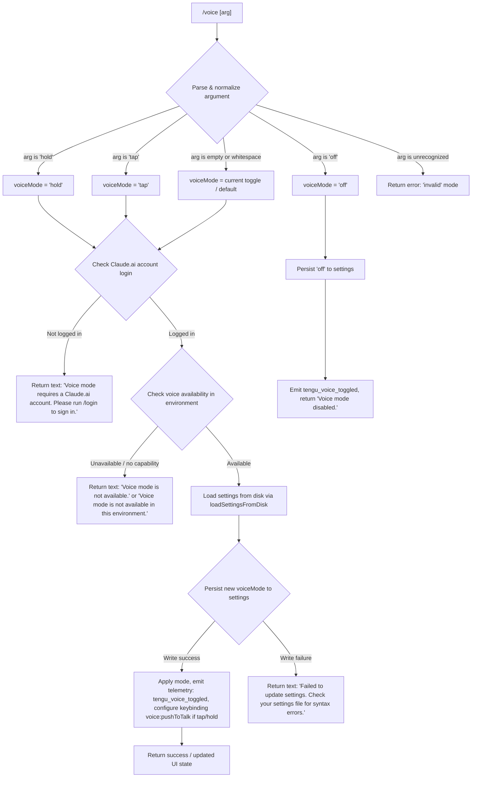

# `/voice`

> Analysis basis: CC v2.1.148 bundle.js (AST extraction + Claude interpretation)
> Minimum version: v2.1.148

---

## Overview

The `/voice` command toggles voice input mode in Claude Code, enabling speech-based interaction. It accepts an optional sub-command argument (`hold`, `tap`, or `off`) to select the voice activation mode or explicitly disable it. The command performs several prerequisite checks (account type, environment capability, settings persistence) before applying the requested mode change.

---

## Registration

| Field | Value |
|---|---|
| type | `local` |
| name | `voice` |
| description | `Toggle voice mode` |
| argumentHint | `[hold\|tap\|off]` |
| supportsNonInteractive | `false` |
| isHidden | `null` |
| module_id | `Ru1` |
| load_inline | `true` |
| loc_byte | `12410331` |
| loc_byte_end | `12410573` |
| loc_line | `10500` |
| arbor_handler.name | `sn7` |
| arbor_handler.fqn | `claude-2.1.148::sn7` |
| arbor_handler.kind | `AsyncFunction` |
| arbor_handler.resolution_path | `module_id` |
| arbor_handler.n_hits | `1` |

Analysis basis: CC v2.1.148 bundle.js:+12410331

---

## Input Branching

The handler has more than three distinct branches based on argument value and environment state, so a Mermaid flowchart is used.



Analysis basis: CC v2.1.148 bundle.js:+12407785, +12407702, +12407714, +12407725, +12407746, +12407826, +12407925, +12408244, +12408382, +12408626

---

## Behavioral Spec

### Top-level handler (`sn7`)

The main async handler is resolved via `module_id` → `Ru1` → `sn7`.

```
async function voiceCommandHandler(args, context):
    rawArg = args.trim()                      // bundle.js:+12408077

    // 1. Parse mode argument
    mode = parseVoiceMode(rawArg)             // calls an7 (argument normalizer)
    if mode == "invalid":
        return errorResult("invalid argument")

    // 2. Authentication gate
    loginStatus = checkLoginStatus(context)   // calls yeH (login checker)
    if NOT loginStatus.hasClaudeAiAccount:
        return textResult(
            "Voice mode requires a Claude.ai account. Please run /login to sign in."
        )                                     // bundle.js:+12407826

    // 3. Environment capability check
    if NOT isVoiceAvailable(context):         // bundle.js:+12407925, +12408626
        return textResult("Voice mode is not available.")
        // OR "Voice mode is not available in this environment."

    // 4. Load settings
    settings = await loadSettingsFromDisk()   // calls mD (settings loader) — bundle.js:+12407796

    // 5. Apply mode
    if mode == "off":
        await persistVoiceMode(settings, "off")
        emitTelemetry("tengu_voice_toggled", { mode: "off" })
        return textResult("Voice mode disabled.")   // bundle.js:+12408382

    // 6. For hold / tap: persist and wire keybinding
    await persistVoiceMode(settings, mode)
    if persistFailed:
        return textResult(
            "Failed to update settings. Check your settings file for syntax errors."
        )                                     // bundle.js:+12408244

    registerKeybinding("voice:pushToTalk", context="Chat", key="Space")
                                              // bundle.js:+12409595, +12409614, +12409621

    emitTelemetry("tengu_voice_toggled", { mode: mode })   // bundle.js:+12408327

    // 7. Kick off MCP / push-to-talk infrastructure
    await initializeMcpAndVoicePipeline(context)   // calls f (MCP orchestrator)

    return successResult()
```

Analysis basis: CC v2.1.148 bundle.js:+12407785

---

### Argument normalizer (`an7`)

```
function parseVoiceMode(rawArg):
    trimmed = rawArg.trim()                   // bundle.js:+12407655
    if trimmed == "hold":  return "hold"      // bundle.js:+12407702
    if trimmed == "tap":   return "tap"       // bundle.js:+12407714
    if trimmed == "off":   return "off"       // bundle.js:+12407725
    if trimmed == "":      return null        // toggle / use stored default
    return "invalid"                          // bundle.js:+12407746
```

Analysis basis: CC v2.1.148 bundle.js:+12407655

---

### Login / account checker (`yeH`, `fi_`)

```
function checkLoginStatus(context):
    authState = readAuthState(context)        // fi_ reads Boolean auth flag
    hasAccount = Boolean(authState)           // bundle.js:+12398256
    return { hasClaudeAiAccount: hasAccount }
```

`fi_` calls `mD` (settings access) and `eA` (auth-state accessor).
Analysis basis: CC v2.1.148 bundle.js:+12398318, +12398224, +12398244, +12398256

---

### Settings loader (`mD`)

`mD` is the central settings-loading routine. Its responsibilities within `/voice` are:

```
async function loadSettingsFromDisk():
    // Mark perf start (loadSettingsFromDisk_start)     // bundle.js:+1213300
    settings = await readUserSettingsFile()             // via AfH → .claude/settings.json
    settings += readProjectSettings()                   // via jC
    settings += readLocalSettings()                     // via ZqH
    settings += readFlagSettings()                      // via Uv
    settings += readPolicySettings()                    // via EO
    // Mark perf end (loadSettingsFromDisk_end)         // bundle.js:+1213356
    // Emit info: "settings_load_completed"             // bundle.js:+1210706
    return mergedSettings
```

Settings files used:
- User settings: `.claude/settings.json` (bundle.js:+1205919, +1205929)
- Local settings: `.claude/settings.local.json` (bundle.js:+1205991)

Analysis basis: CC v2.1.148 bundle.js:+12407796, +12407963

---

### Settings persistence (`_A`)

`_A` handles writing updated settings (including the new voice mode value) back to disk.

```
async function persistVoiceMode(settings, newMode):
    // Validate settings structure
    if NOT isValid(settings):
        throw Error("error")                  // bundle.js:+1214931

    // Resolve config path
    configPath = resolveSettingsPath()        // via Ru6, jC

    // Atomic write (temp file → rename via sq6)
    tempPath = generateTempPath(configPath)
    writeFileSync(tempPath, serialize(settings))
    fsyncSync(tempPath)
    renameSync(tempPath, configPath)          // bundle.js:+1007473

    // Invalidate in-memory caches
    clearSettingsCaches()                     // via VY (clears bI6 and pI8)

    // Emit event for live watchers
    emitChangeEvent()                         // XxH.emit — bundle.js:+1215611
```

Analysis basis: CC v2.1.148 bundle.js:+12408146, +1215272, +1215414, +1215611

---

### Keybinding registration for push-to-talk (`lJ`)

When mode is `hold` or `tap`, the command registers (or updates) a keybinding:

```
function registerPushToTalkKeybinding():
    action   = "voice:pushToTalk"             // bundle.js:+12409595
    context  = "Chat"                         // bundle.js:+12409614
    key      = "Space"                        // bundle.js:+12409621

    loadKeybindingsFromDisk()                 // zH8 → l36
    existingBinding = findBinding(action, context)
    if existingBinding is None or key differs:
        keybindings.set(action, context, key)
        persistKeybindings()                  // writes keybindings.json
        emitTelemetry("tengu_custom_keybindings_loaded")
```

Keybinding config file: `keybindings.json` (bundle.js:+3767596).
Keybinding format requires a `"bindings"` array (bundle.js:+3769807).

Analysis basis: CC v2.1.148 bundle.js:+12409592, +12409595

---

### Microphone permission guidance

When voice initialization fails or a macOS microphone permission issue is detected:

```
function handleMicrophonePermissionError():
    // Display guidance string:
    // "System Settings → Privacy & Security → Microphone"
    // bundle.js:+12409133
    return textResult(permissionGuidanceMessage)
```

Analysis basis: CC v2.1.148 bundle.js:+12409133

---

### MCP / voice-pipeline orchestration (`f`, `EkH`)

After mode is set, the command invokes MCP infrastructure to start or reconfigure the voice pipeline. This layer manages server connections, OAuth state, and tool availability. The entry point `f` calls `EkH` (MCP update orchestrator).

```
async function initializeMcpAndVoicePipeline(context):
    for each mcpServer in context.mcpServers:
        status = await connectOrReconnect(mcpServer)
        if status == "needs-auth":
            initiateOAuthFlow(mcpServer)      // P8H — bundle.js:+9821810
        elif status == "connected":
            updateToolManifest(mcpServer)     // EkH
    applyMcpUpdate(context)                   // k7K.applyMcpUpdate — bundle.js:+14845089
```

Analysis basis: CC v2.1.148 bundle.js:+12408901, +14844801

---

## State & Side Effects

| Item | Detail |
|---|---|
| Telemetry | `tengu_voice_toggled` (bundle.js:+12408327) — fired on every successful mode change |
| Telemetry (indirect) | `tengu_mcp_oauth_flow_start`, `tengu_mcp_oauth_flow_success`, `tengu_mcp_oauth_flow_error` — fired if voice backend requires OAuth |
| Telemetry (indirect) | `tengu_custom_keybindings_loaded`, `tengu_keybinding_fallback_used` — fired during keybinding registration |
| Telemetry (indirect) | `tengu_config_parse_error` — fired if settings.json is malformed |
| Settings mutation | Writes `voiceMode` value (`hold`/`tap`/`off`) to `.claude/settings.json` |
| Keybinding mutation | Writes `voice:pushToTalk` → `Space` in `Chat` context to `keybindings.json` (hold/tap modes only) |
| In-memory cache | Clears `bI6` and `pI8` settings caches after write (via `VY`) |
| Event emission | `XxH.emit` fires a settings-change event for live listeners |
| MCP side-effects | May trigger MCP reconnect, OAuth flow, or tool manifest update |
| Sound | <!-- TODO: not found in depth-2 traversal; needs --depth 4 --> |
| appState changes | Voice mode flag updated in application state; push-to-talk keybinding activated in the `Chat` input context |

---

## Version History

| Version | Change |
|---|---|
| v2.1.148 | Initial analysis |

---

## Common Mistakes

1. **Omitting the argument entirely when you mean to disable voice.** Running `/voice` with no argument may toggle mode rather than turn it off. Use `/voice off` to explicitly disable voice mode.
2. **Running `/voice` without a Claude.ai account.** The command will reject with a login prompt. OAuth-based or API-key-only sessions are blocked from voice mode.
3. **Malformed `settings.json`.** If your settings file contains JSON syntax errors, the settings persistence step will fail and voice mode will not be saved. Validate your `.claude/settings.json` before invoking the command.
4. **Expecting voice in non-interactive mode.** `supportsNonInteractive: false` means `/voice` cannot be used in `--print` / piped invocations; it requires an interactive terminal session.
5. **Assuming `hold` and `tap` behave the same.** `hold` requires holding the configured key (Space by default) while speaking; `tap` toggles recording on/off with a single press. Choose based on your workflow.
6. **Microphone permission not granted (macOS).** If the system microphone permission for Claude Code has not been granted, voice will fail with guidance to visit `System Settings → Privacy & Security → Microphone`.

---

## Appendix — Identifier Mapping

> For bundle debugging only. Identifiers change across versions.

| Identifier | Role |
|---|---|
| `sn7` | Main async handler for `/voice` command (arbor_handler) |
| `yeH` | Login / account-type checker (called first to gate voice on Claude.ai accounts) |
| `fi_` | Auth-state reader — reads Boolean auth flag and calls settings accessor |
| `mD` | Settings loader — loads all settings tiers from disk |
| `cK` | Low-level settings key reader |
| `Uv` | Flag-settings layer reader |
| `EO` | Policy-settings layer reader |
| `GJ` | Settings merge / conflict resolver |
| `r$` | API key / auth helper resolver within settings loader |
| `ZqH` | Local-settings file reader |
| `PZ6` | Secondary login-state accessor |
| `HA` | Telemetry / perf-mark initializer called from handler |
| `Km` | Settings load orchestrator (start/end perf marks) |
| `gR` | Perf-mark helper |
| `Wq` | Module-load deduplication guard (uses `zKA` Set) |
| `pu` | Dynamic `require` wrapper for perf_hooks |
| `Xg8` | Core settings-read routine (reads individual settings files) |
| `C8` | Settings file I/O helper (appendFileSync / mkdirSync) |
| `uI6` | Settings log helper |
| `U16` | Flag-settings merger |
| `jWA` | Settings cache populator |
| `AfH` | User-settings file path resolver (`.claude/settings.json`) |
| `XF` | User-settings file reader |
| `YWA` | SDK inline-settings reader |
| `WF` | Settings watcher registration |
| `w_` | File-watcher utility |
| `B16` | WSL platform-specific settings handler |
| `an7` | Voice argument normalizer / parser (`hold`/`tap`/`off`/`invalid`) |
| `H` | Utility host object (trim, random, setTimeout, etc.) |
| `_A` | Settings persistence writer (atomic write + cache clear + event emit) |
| `fz` | Settings path builder used by persistence layer |
| `Pg8` | Settings aggregator (collects all tiers) |
| `BP` | Pre-write validation helper |
| `El` | File-encoding detector (UTF-8 / UTF-16 BOM check) |
| `j3` | Real-path resolver (resolves symlinks, checks device type) |
| `N` | Path-normalizer / OS-path helper |
| `tb6` | File-type encoding utility |
| `J8` | ENOENT error classifier |
| `q8` | Error-code extractor |
| `TF8` | Settings timestamp cache setter |
| `$WH` | Settings path + watcher combo initializer |
| `Ru6` | Settings directory path resolver (`.claude` dir) |
| `sq6` | Atomic file-write helper (temp-file → fsync → rename) |
| `q` | Low-level `fs` wrapper (lstatSync, renameSync, unlinkSync, etc.) |
| `O` | Symlink status helper |
| `CH` | JSON serializer wrapper |
| `VY` | In-memory settings cache clearer (`bI6`, `pI8`) |
| `Ux6` | Config file read/write orchestrator |
| `b6` | Store accessor helper |
| `sb6` | AsyncLocalStorage store reader |
| `KF8` | Config key mapper |
| `OF8` | Git-ignore checker for config path |
| `T_` | git check-ignore runner |
| `lFK` | Home-dir config path builder |
| `jC` | `.claude` directory path joiner |
| `RH` | Error reporter / logger |
| `n_` | Error string normalizer |
| `UH` | String coercion utility |
| `j1` | Pending-error queue reader |
| `XwA` | Pending-error item constructor |
| `FpK` | Sliding error-log buffer (shift/push) |
| `c` | Core utility / constants object |
| `f` | MCP orchestration entry point (called after voice mode set) |
| `EkH` | MCP update orchestrator — processes all MCP server states |
| `RHH` | MCP server-group processor |
| `CKH` | Individual MCP server connector |
| `SHH` | SDK-type MCP server handler |
| `cD6` | SSE/HTTP MCP server handler |
| `TN` | Tool-name normalizer |
| `o$` | Tool-result builder |
| `c2_` | Tool-cache entry constructor |
| `s8` | Tool-list deduplicator |
| `F06` | Tool-filter helper |
| `rj7` | MCP server health checker |
| `Su_` | MCP server status reader |
| `WK8` | MCP server key hasher |
| `GK8` | MCP server config hash builder |
| `MP` | SHA-256 hash helper |
| `XK8` | MCP server profile key extractor |
| `pK` | Profile key normalizer |
| `z8` | MCP debug log emitter |
| `ux_` | MCP connection manager (per-server connect/reconnect) |
| `Hw7` | MCP transport factory |
| `PF` | MCP client constructor |
| `P8H` | MCP OAuth flow handler |
| `RaH` | OAuth pending-request tracker |
| `D` | Background session / daemon state manager |
| `AJ8` | MCP auth-state initializer |
| `Ud` | MCP reconnect orchestrator |
| `qm` | MCP client accessor |
| `Y` | Voice/MCP supervisor manager (start/stop/updateConfig) |
| `k7` | MCP error logger |
| `ZH` | String-coercion wrapper |
| `_w7` | MCP connection timeout racer |
| `eD7` | SSH-environment MCP adapter |
| `mx_` | MCP status aggregator |
| `SaH` | Cached reconnect-state reader |
| `CaH` | Cached OAuth-state reader |
| `wL1` | MCP needs-auth cache manager |
| `M1` | AsyncLocalStorage store getter |
| `IJ8` | Needs-auth cache file path builder |
| `bx_` | MCP message sender |
| `B2_` | MCP tool-list fetcher |
| `M8` | Global config read/write with auth-loss prevention |
| `A` | Platform-specific utility (toLowerCase, etc.) |
| `j` | Process-kill helper for background workers |
| `y` | Background worker write/message helper |
| `OL1` | Async-iterator / readable-stream helper |
| `Gi` | Generic iterator / observable helper |
| `g06` | parseInt wrapper (radix-guarded) |
| `Ru_` | parseInt wrapper (alternate) |
| `k7K` | MCP update applier (applyMcpUpdate) |
| `kJ8` | MCP state serializer |
| `sN` | MCP server cleanup coordinator |
| `laH` | MCP server state logger |
| `$` | Daemon status / background-session manager |
| `ZC1` | Daemon status file writer (`daemon.status.json`) |
| `ll` | Daemon status helper |
| `aE6` | Daemon status file path builder |
| `_D5` | MCP server roster reconciler |
| `EK8` | Tool-permission filter (uIL / mIL sets) |
| `r8` | Retry-with-timeout helper |
| `lJ` | Keybinding loader/registrar for voice:pushToTalk |
| `zH8` | Keybinding file reader orchestrator |
| `l36` | Keybinding JSON parser and validator |
| `Zf_` | Keybinding block structure validator |
| `qp` | Keybinding release-flag checker |
| `G1H` | Keybinding file path builder (`keybindings.json`) |
| `B6` | JSON.parse wrapper |
| `mH` | Feature-flag telemetry emitter (tengu_feature_ok / tengu_feature_bad) |
| `fH8` | Keybinding array-shape validator |
| `KH8` | Keybinding entry normalizer |
| `aU9` | Keybinding apply helper |
| `Tf_` | Duplicate-key detector in keybinding JSON |
| `Ef_` | Keybinding deduplication filter |
| `bH` | Feature-check helper (ok/bad telemetry) |
| `YH8` | Keybinding action-lookup and fallback handler |
| `kf_` | Keybinding action resolver |
| `If_` | Keybinding action validator |
| `Ke` | Keybinding display-name mapper |
| `ARH` | Locale / language normalizer (`en` default) |
| `x6` | Config watcher / file-watch setup |
| `o4_` | Config watcher deduplication helper |
| `k$H` | Config file reader with backup and migration |
| `OC` | Config path prefix stripper |
| `hy9` | Config backup directory enumerator |
| `AL_` | Config backup path builder |
| `w` | Background worker / subprocess manager |
| `C` | Child-process (worker) controller |
| `sG8` | Memory-usage reporter (macOS) |
| `T$6` | CLAUDE.md / instructions file reader |
| `g` | Background session pool manager |
| `V6` | Conversation / project context loader |
| `v6A` | Background session socket connector |
| `S6A` | Background session lifecycle manager (spawn/kill/claim) |
| `S` | Session disposer |
| `EQ4` | File-watcher setup for config hot-reload |
| `Tn` | Watcher debounce helper |
| `r9` | Process-exit cleanup registrar |