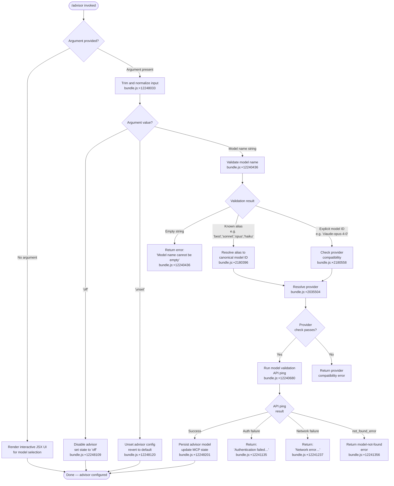

# `/advisor`

> Analysis basis: CC v2.1.149 bundle.js (AST extraction + Claude interpretation)
> Minimum version: v2.1.149

---

## Overview

The `/advisor` command configures the **Advisor Tool**, a feature that allows Claude Code to consult a stronger backing model at key decision points during an agentic task. When invoked, the command presents a React-rendered UI (type `local-jsx`) that enables the user to select, enable, or disable the advisor model. The command performs model name validation, provider resolution, and MCP server state management before committing the configuration change.

---

## Registration

| Field | Value |
|---|---|
| type | `local-jsx` |
| name | `advisor` |
| description | Configure the Advisor Tool to consult a stronger model for guidance at key moments during a task |
| loc_byte | `12248577` |
| loc_byte_end | `12248864` |
| loc_line | `9996` |
| argumentHint | `null` |
| isHidden | `null` |
| module_id | `nB1` |
| load_inline | `true` |
| arbor_handler.name | `e85` |
| arbor_handler.fqn | `claude-2.1.149::e85` |
| arbor_handler.kind | `AsyncFunction` |
| arbor_handler.resolution_path | `module_id` |
| arbor_handler.n_hits | `1` |

Analysis basis: CC v2.1.149 bundle.js:+12248577

---

## Input Branching

The command exhibits four or more distinct branches depending on the advisor state and provided model argument. A Mermaid flowchart is used.



---

## Behavioral Spec

### Top-level Handler (`e85`)

The main handler is the async function `e85`, resolved via `module_id → nB1` by the Arbor symbol graph.

```
async function advisorCommandHandler(userInput, appContext):
    trimmedInput = userInput.trim()            // bundle.js:+12248033

    if trimmedInput is empty or no argument:
        return renderAdvisorJsxPanel(appContext)  // bundle.js:+12248069

    normalized = normalizeModelToken(trimmedInput)  // calls modelTokenNormalizer

    if normalized == "off":
        return setAdvisorState("off")             // bundle.js:+12248109

    if normalized == "unset":
        return setAdvisorState("unset")           // bundle.js:+12248120

    validationResult = validateAndResolveModel(normalized, appContext)
    if validationResult.error:
        return displayError(validationResult.error)

    return persistAdvisorConfig(validationResult.model, appContext)
                                                  // bundle.js:+12248201
```

Analysis basis: CC v2.1.149 bundle.js:+12248033

---

### Model Token Normalization (`nq`)

Responsible for translating user-supplied short aliases into canonical model identifiers.

```
function modelTokenNormalizer(rawToken):
    token = rawToken.trim().toLowerCase()         // bundle.js:+2180367

    // Alias table (bundle.js:+2180463 – +2180657)
    if token == "opusplan":
        return resolveOpusPlanModel()
    if token matches "[1m]":
        return resolve1mModel()
    if token == "sonnet":
        return resolveLatestSonnet()              // bundle.js:+2180504
    if token == "haiku":
        return resolveLatestHaiku()               // bundle.js:+2180543
    if token == "opus":
        return resolveLatestOpus()                // bundle.js:+2180582
    if token == "best":
        return resolveBestAvailableModel()        // bundle.js:+2180619

    // Prefix / explicit ID path
    rawReplaced = token with provider-prefix replacements  // bundle.js:+2180406
    return rawReplaced
```

Analysis basis: CC v2.1.149 bundle.js:+2180367

---

### Model Validation via API Ping (`rZ8`)

Validates the resolved model ID by performing a lightweight API interaction before committing the config. The handler also maintains a validation result cache (`gB1`).

```
async function validateModelViaApiPing(modelId, appContext):
    if modelId is empty:
        throw Error("Model name cannot be empty")   // bundle.js:+12240436

    normalized = modelId.toLowerCase()              // bundle.js:+12240559

    // Check known-bad-provider list
    if isUnsupportedProvider(normalized):           // bundle.js:+12240578
        return { error: "provider not supported" }

    // Check validation cache
    if validationCache.has(modelId):                // bundle.js:+12240680
        return validationCache.get(modelId)

    // Build API client context and fire ping
    result = await fireAdvisorValidationRequest(    // bundle.js:+12240725
        model    = modelId,
        app      = "x-app: cli",                   // bundle.js:+2906620
        cacheKey = computeSHA256Hash(modelId),      // bundle.js:+12994479
        headers  = buildRequestHeaders(appContext)
    )

    // Interpret result
    switch result.status:
        case AUTH_ERROR:
            return { error: "Authentication failed. Please check your API credentials." }
                                                    // bundle.js:+12241135
        case NETWORK_ERROR:
            return { error: "Network error. Please check your internet connection." }
                                                    // bundle.js:+12241237
        case NOT_FOUND (type == "not_found_error"): // bundle.js:+12241356
            return { error: "model: " + modelId + " not found" }
                                                    // bundle.js:+12241438
        case SUCCESS:
            validationCache.set(modelId, { ok: true })  // bundle.js:+12240888
            return { ok: true }
```

Analysis basis: CC v2.1.149 bundle.js:+12240399

---

### Provider Resolution and Compatibility Check (`nq` → `cv` / `UpH` / `GZ`)

Determines which API provider (Anthropic-direct, Bedrock, Vertex, Foundry, etc.) owns the resolved model and whether the current credential set is compatible.

```
function resolveProvider(canonicalModelId):
    // Provider detection literals (bundle.js:+2035504 – +2036233)
    for provider in ["bedrock", "foundry", "anthropicAws",
                     "mantle", "vertex", "firstParty", "gateway"]:
        if modelOrCredentialMatchesProvider(canonicalModelId, provider):
            return provider

    return "firstParty"   // default fallback

function checkProviderCompatibility(modelId, resolvedProvider):
    currentProvider = getActiveProviderFromContext()
    if currentProvider != resolvedProvider:
        return { compatible: false, reason: "provider mismatch" }
    return { compatible: true }
```

Analysis basis: CC v2.1.149 bundle.js:+2035504

---

### Advisor Config Persistence and MCP State Update (`rZ8` → `g85` / `Q85`)

After a successful validation ping, the advisor model is written to app state and MCP connections are refreshed as needed.

```
async function persistAdvisorConfig(validatedModelId, appContext):
    // Alias / canonical-name normalization before storage
    finalName = resolveStorageName(validatedModelId)  // bundle.js:+12240929
    // e.g. "opus-4-7" / "opus_4_7" variants         // bundle.js:+12241705

    // Write to persistent config
    writeAdvisorModelToConfig(finalName)

    // Refresh MCP server connections if needed
    await applyMcpUpdate(appContext)                  // callGraph: QDK → H.applyMcpUpdate

    return { success: true, model: finalName }
```

Analysis basis: CC v2.1.149 bundle.js:+12240929

---

### JSX Panel Rendering (`e85` → `jJ.createElement`)

When invoked with no argument the command renders an interactive React component (local-jsx type) that lets the user browse and select from available advisor models.

```
function renderAdvisorJsxPanel(appContext):
    availableModels = collectAdvisorModelList(appContext)
    currentAdvisor  = readCurrentAdvisorFromConfig()

    panel = createElement(AdvisorSelectorComponent, {
        models:   availableModels,
        current:  currentAdvisor,
        onSelect: (model) => advisorCommandHandler(model, appContext),
        onDisable: ()    => advisorCommandHandler("off",   appContext),
        onUnset:   ()    => advisorCommandHandler("unset", appContext),
    })
    return panel
```

Analysis basis: CC v2.1.149 bundle.js:+12248069

---

### Side-Query Execution Engine (`Gx` / `Kp`)

The advisor validation pathway delegates to the core side-query engine (`Gx`, labelled `side_query` at bundle.js:+13038669). This engine handles:

- Building request headers including `User-Agent`, `X-Claude-Code-Session-Id`, and cloud-provider-specific headers (bundle.js:+2906648 – +2906887).
- OAuth token acquisition and refresh (bundle.js:+2907203).
- Retry logic with exponential back-off; maximum timeout 600 000 ms / 10 retries (bundle.js:+2907527, +2907535).
- Prompt-cache configuration with a 1-hour TTL (`tengu_prompt_cache_1h_config`, bundle.js:+13000852).
- SHA-256 request deduplication hash (bundle.js:+12994479).

```
async function sideQueryEngine(request, context):
    headers  = buildHeaders(context)            // bundle.js:+2906604
    token    = await getOAuthToken(context)     // bundle.js:+2911100
    response = await fireHttpRequest(
        url     = resolveEndpointUrl(context),  // bundle.js:+2227891
        headers = headers,
        timeout = AbortSignal.timeout(10000),   // bundle.js:+2228014
        body    = request
    )
    if response.ok:
        emit("tengu_api_success")               // bundle.js:+13040120
        return parseResponse(response)
    else:
        handleApiError(response)
```

Analysis basis: CC v2.1.149 bundle.js:+13038637

---

## State & Side Effects

| Item | Detail |
|---|---|
| Telemetry — `tengu_api_success` | Fired on each successful advisor validation API call (bundle.js:+13040120) |
| Telemetry — `tengu_prompt_cache_1h_config` | Fired when 1-hour prompt cache is configured for the side-query (bundle.js:+13000852) |
| Telemetry — `tengu_bg_dispatch_sigkill_escalate` | Fired if background daemon requires SIGKILL escalation during MCP refresh (bundle.js:+15260736) |
| Telemetry — `tengu_bg_dispatch_low_mem` | Fired when daemon detects low free memory during dispatch (bundle.js:+15261315) |
| Telemetry — `tengu_bg_spare_enable` | Fired when a spare background session slot is enabled (bundle.js:+15262010) |
| Telemetry — `tengu_bg_spare_claim` | Fired when a spare slot is claimed (bundle.js:+15262131) |
| Telemetry — `tengu_bg_spare_claim_fail` | Fired when spare slot claim fails (bundle.js:+15262394) |
| Telemetry — `tengu_bg_proto_mismatch` | Fired on background protocol version mismatch (bundle.js:+15249077) |
| Telemetry — `tengu_bg_dispatch_stale_drop` | Fired when a stale dispatch is dropped (bundle.js:+15250316) |
| Telemetry — `tengu_bg_attach_legacy_autorespawn` | Fired on legacy auto-respawn during attach (bundle.js:+15252392) |
| Telemetry — `tengu_bg_attach` | Fired on each background session attach (bundle.js:+15252803) |
| Telemetry — `tengu_bg_attach_stall_gave_up` | Fired when an attach stalls and is abandoned (bundle.js:+15253715) |
| Telemetry — `tengu_bg_attach_stall_respawn` | Fired when an attach stall triggers a respawn (bundle.js:+15253984) |
| Telemetry — `tengu_bg_attach_kick` | Fired when an attach is kicked by another window (bundle.js:+15254901) |
| Validation result cache | `gB1` Map — stores per-model-ID validation results to avoid redundant API pings (bundle.js:+12240680, +12240888) |
| MCP state update | `applyMcpUpdate` is called after a successful config write; may trigger MCP server reconnection (callGraph: QDK → H.applyMcpUpdate, bundle.js:+14980861) |
| Persistent config write | Advisor model name written to project/local settings via config-write subsystem |
| React JSX render | A local-jsx panel is rendered when no argument is supplied |
| `unlinkSync` | Temporary lock-file cleanup during MCP client teardown (callGraph: q → SJK.unlinkSync, bundle.js:+15239407) |
| Sound | <!-- TODO: not found in depth-2 traversal; needs --depth 4 --> |

---

## Version History

| Version | Change |
|---|---|
| v2.1.149 | Initial analysis |

---

## Common Mistakes

1. **Supplying an unsupported provider model string** — If the model ID resolves to a provider (e.g., Bedrock, Vertex) that does not match the currently configured credentials, the command returns a provider-mismatch error rather than silently ignoring it. Ensure the model string matches the active provider.
2. **Expecting instant effect after `/advisor off`** — Disabling the advisor writes `"off"` to config and may trigger an MCP reconnection cycle. Any in-flight tool calls that were already dispatched to the advisor model will complete before the setting takes effect.
3. **Using partial model names without a recognized alias** — Only the aliases `sonnet`, `opus`, `haiku`, `best`, and `opusplan` are resolved automatically (bundle.js:+2180463–+2180619). Arbitrary partial strings are passed through as-is and will fail validation if they do not match a known model ID.
4. **Empty string argument** — Passing `/advisor ` (trailing space only) triggers the "Model name cannot be empty" error (bundle.js:+12240436) rather than opening the interactive panel; omit the argument entirely to open the panel.
5. **Confusing `unset` with `off`** — `off` explicitly disables the advisor; `unset` removes the override and reverts to the default configuration. They are distinct states (bundle.js:+12248109, +12248120).

---

## Appendix — Identifier Mapping

> For bundle debugging only. Identifiers change across versions.

| Identifier | Role |
|---|---|
| `e85` | Top-level `/advisor` command handler (AsyncFunction, `claude-2.1.149::e85`) |
| `nq` | Model token normalizer — alias-to-canonical-ID resolution |
| `rZ8` | Model validation orchestrator — drives API ping and cache |
| `g85` | Advisor config persistence — writes resolved model name to config |
| `Q85` | Storage-name resolver — maps canonical IDs to stored alias variants |
| `Gx` | Side-query execution engine (`side_query`) |
| `Kp` | Core API request builder — headers, auth, retry logic |
| `bW` | Provider detection helper |
| `ZqH` | Provider-string normalizer |
| `mH` | Low-level string coercion utility |
| `GqH` | Provider inclusion checker |
| `cv` | Provider compatibility resolver |
| `Z3` | Provider lookup table accessor |
| `RA` | Provider record builder |
| `cf` | Provider context factory |
| `JCH` | Provider join/combine helper |
| `UZ4` | Provider chain resolver |
| `O69` | Provider entry enumerator |
| `zc6` | Provider finder with fallback |
| `UpH` | Provider compatibility validator |
| `GZ` | Provider-and-context combiner |
| `D79` | Provider delegation wrapper |
| `Fl6` | Include-list checker |
| `BpH` | String-to-provider coercer |
| `Xg` | MCP server list builder |
| `f` | MCP server collection helper |
| `UyH` | MCP server connection manager |
| `QDK` | MCP update applier (`applyMcpUpdate`) |
| `N` | Model-name formatter / normalizer |
| `nv5` | MCP client reconnection orchestrator |
| `K` | Column-padded display formatter |
| `Yc6` | Tool-capability enumerator |
| `HA` | Tool-hash aggregator |
| `ppH` | Inclusion-list membership checker |
| `Y79` | Index-of-with-prefix finder |
| `JI4` | Model-ID prefix validator |
| `XI4` | Prefix-based model matcher |
| `z79` | `startsWith` guard helper |
| `iw6` | Case-insensitive model-inclusion checker |
| `Kp` | HTTP request pipeline (headers, OAuth, retry, timeout) |
| `FD` | AsyncLocalStorage store reader |
| `Xl4` | Header split/trim/slice parser |
| `bq` | Background flag (`bg`) injector |
| `Fn` | Issue-reporting error formatter |
| `S6` | Durable config accessor |
| `y8_` | URL encode helper for proxy auth |
| `t$` | Workspace-lock helper |
| `W79` | Boolean coercion guard |
| `dD` | API key / env credential resolver |
| `G$` | Session-state accessor |
| `jl4` | JWT / token parser |
| `y_` | Credential cache reader |
| `Mg6` | Proxy-auth helper invoker |
| `Gl4` | HTTP session / connection-pool manager |
| `UD` | Config overlay reader |
| `zY` | OAuth credential resolver |
| `Jl4` | Token store manager |
| `Y$H` | Token refresh executor |
| `qC8` | Timestamp generator |
| `H36` | Header case-normalization helper |
| `HOH` | SDK-level error logger |
| `sa6` | Auth header injector |
| `C` | Supervisor/error-stream writer |
| `h` | Focus/blur-aware idle timer |
| `I` | Away-summary generator |
| `Z` | Retry-state tracker |
| `V2H` | Model-string prefix router |
| `Rj` | Error wrapping helper |
| `ev` | Credential environment resolver |
| `apH` | WIF token exchanger |
| `Pn6` | WIF credentials resolver |
| `G` | OAuth token provider |
| `X` | Daemon IPC socket reader |
| `J` | IPC stream multiplexer |
| `w` | Background daemon process manager |
| `zM` | Stream end/flush helper |
| `zk5` | Daemon protocol message dispatcher |
| `EH` | String-coercion output helper |
| `kTH` | Bedrock/Vertex model router |
| `Xq` | Model-type classifier |
| `sh` | Provider-record shimmer |
| `T` | MCP transport-type list |
| `HE6` | Connection-status tagger |
| `wh8` | Transport metadata helper |
| `Jf5` | Advisor model finder |
| `PHA` | SHA-256 hash builder |
| `dl6` | Request annotation/trace injector |
| `t1` | String identity helper |
| `gl6` | AsyncLocalStorage request-store getter |
| `he6` | Response-record builder |
| `ovH` | Prompt-cache configuration builder |
| `EA` | Stream-event aggregator |
| `xC8` | Cache-tag builder |
| `V6` | Cache-control block builder |
| `uC8` | Cache-filter helper |
| `vZ` | Model-context cache wrapper |
| `KL_` | Cache-key resolver |
| `ja1` | Message-list serializer |
| `OP` | Text-replacement sanitizer |
| `Ks6` | Temperature configuration injector |
| `G2` | Message mapper |
| `VzH` | API response shape builder |
| `CH` | JSON serializer |
| `$p` | Random-bytes ID generator |
| `R5` | Response model extractor |
| `jMH` | Metrics accumulator |
| `c` | IPC connection object |
| `hVH` | Hook-agent telemetry recorder |
| `rW7` | Agent-ID telemetry emitter |
| `RH` | Error telemetry reporter |
| `rQ` | Agent-type classifier for telemetry |
| `iW7` | Custom-agent path resolver |
| `RHH` | Agent prefix matcher |
| `HA6` | Telemetry flush helper |

---

Note: index built via Arbor fallback; some signals (telemetry, literals) may be missing — see arbor-fallback.js.