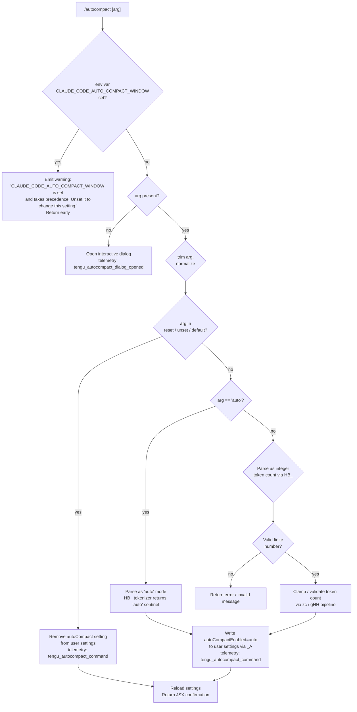

# `/autocompact`

> Analysis basis: CC v2.1.149 bundle.js (AST extraction + Claude interpretation)
> Minimum version: v2.1.149

---

## Overview

`/autocompact` configures the auto-compact context window size for Claude Code sessions. It accepts an argument of either `auto` (to enable automatic compaction heuristics) or an explicit token count, and persists the setting to user-level configuration. When called with no argument it opens an interactive dialog for the user to configure the setting visually.

---

## Registration

| Field | Value |
|---|---|
| type | `local-jsx` |
| name | `autocompact` |
| description | Configure the auto-compact window size |
| argumentHint | `[auto\|<tokens>]` |
| isHidden | `false` |
| module_id | `cW1` |
| load_inline | `true` |
| loc_byte | `10703898` |
| loc_byte_end | `10704147` |
| loc_line | `8501` |
| arbor_handler.name | `jmL` |
| arbor_handler.fqn | `claude-2.1.149::jmL` |
| arbor_handler.kind | `AsyncFunction` |
| arbor_handler.resolution_path | `module_id` |
| arbor_handler.n_hits | `1` |

Analysis basis: CC v2.1.149 bundle.js:+10703898

---

## Input Branching

Five distinct input cases exist: no argument (open dialog), `auto`/`reset`/`unset`/`default` keywords, a numeric token count, an environment-variable override guard, and a settings-write path. A Mermaid flowchart is used.



Analysis basis: CC v2.1.149 bundle.js:+10703583, +10698300, +10698436, +10698334, +10698465, +10698772, +10699153

---

## Behavioral Spec

### Top-level handler (`jmL`)

The Arbor-resolved async handler `jmL` is the command entry point.

```
async function autocompactHandler(context):
    // Render JSX dialog if no argument, or delegate to core handler
    if context.args is empty:
        emit telemetry("tengu_autocompact_dialog_opened")   // +10703618
        return createElement("dialog", ...)                 // +10703671
    else:
        return await coreAutocompactHandler(context)        // +10703583
```

Analysis basis: CC v2.1.149 bundle.js:+10703599, +10703616, +10703618, +10703660, +10703671

---

### Core command handler (`MZ6`)

```
async function coreAutocompactHandler(context):
    rawArg = context.args

    // Guard: env var takes precedence
    if envVar("CLAUDE_CODE_AUTO_COMPACT_WINDOW") is set:   // +9895305
        return warningMessage(
            "CLAUDE_CODE_AUTO_COMPACT_WINDOW is set and takes precedence..."
        )                                                   // +10698334

    trimmedArg = trim(rawArg)                              // +10698436

    // Determine if this is a reset/clear operation
    if trimmedArg in ["reset", "unset", "default"]:        // +10698465, +10698478, +10698491
        removeSettingKey("autoCompactEnabled")
        reloadSettings()
        emit telemetry("tengu_autocompact_command")         // +10698939
        return confirmationMessage()

    // Parse the token value via tokenParser
    parsedValue = tokenParser(trimmedArg)                  // +10698508

    // Determine numeric or auto mode
    if parsedValue == "auto":                              // +9894730
        settingValue = "auto"
    else:
        settingValue = clampAndValidate(parsedValue)       // see zc pipeline

    // Write to user settings
    writeUserSetting("autoCompactEnabled", settingValue)   // +9896908, +10698993
    emit telemetry("tengu_autocompact_command")             // +10698939

    applyFlagSettings()                                    // +10698876

    return confirmationMessage(settingValue)               // "Auto-compact window set to auto" +10699153
```

Analysis basis: CC v2.1.149 bundle.js:+10698300, +10698436, +10698465, +10698508, +10698676, +10698772, +10698939

---

### Token value parser (`HB_`)

This sub-routine converts the raw argument string into either the string sentinel `"auto"` or a numeric token count.

```
function tokenParser(rawString):
    s = trim(rawString)                     // +9894700

    if s ends with "%" or "k" suffix:       // +9894759
        base = parseFloat(s)                // +9894777
        if suffix is "k":
            value = base * 1000             // +1000 factor via parseInt +9894851
        else:
            value = base  // percent — treated as fraction of context window

    else:
        value = parseInt(s)                 // +9894851

    if not Number.isFinite(value):          // +9894897
        return null  // signals invalid input

    return Math.round(value)               // +9894944
```

Note: The string `"auto"` bypasses this parser — it is detected before calling `tokenParser`.

Analysis basis: CC v2.1.149 bundle.js:+9894700, +9894730, +9894777, +9894851, +9894897, +9894944

---

### Compact window validation pipeline (`zc` → `gHH`)

After parsing, the numeric value passes through a validation/clamping pipeline.

```
function validateCompactWindow(tokenCount, currentContext):
    // Read env override first
    envRaw = env("CLAUDE_CODE_AUTO_COMPACT_WINDOW")        // +9895305
    if envRaw is set:
        source = "env"                                     // +9895497
        value = parseInt(envRaw)
        if isNaN(value):
            status = "invalid"                             // +4881649
        else:
            status = "valid"                               // +4881574
    else:
        source = "settings"                                // +9895567

    // Clamp to context boundaries
    lower = Math.max(tokenCount, contextMin)               // +9895423
    upper = Math.min(lower, contextMax)                    // +9895463

    // Status labels used internally
    if result exceeds cap:
        status = "capped"                                  // +4881779

    return { value: upper, source, status }
```

Analysis basis: CC v2.1.149 bundle.js:+9895241, +9895301, +9895423, +9895463, +4881574, +4881607, +4881649, +4881779

---

### Settings persistence (`_A` / `writeUserSetting`)

The validated compact window value is written using the settings layer (`_A`), which resolves through a layered settings hierarchy:

| Priority | Layer | Literal Key |
|---|---|---|
| 1 (highest) | Policy settings | `policySettings` (+1220331) |
| 2 | Flag settings | `flagSettings` (+1220353) |
| 3 | User settings | `userSettings` (+1211389) |
| 4 | Project settings | `projectSettings` (+1211440) |
| 5 (lowest) | Local settings | `localSettings` (+1211462) |

The user-settings file is located at `~/.claude/settings.json` (bundle.js:+1211643, +1211653). The local override file is `settings.local.json` (+1211715).

```
function writeAutocompactSetting(key, value):
    settingsObj = loadSettingsFromDisk()    // hm → Wl8
    settingsObj[key] = value               // key = "autoCompactEnabled" +9896908
    atomicWriteToFile(settingsPath, serialize(settingsObj))
    invalidateCaches()                     // CY clears caches +26612, +26624
    emit("settings_load_completed")        // +1216430
```

Analysis basis: CC v2.1.149 bundle.js:+1220331, +1220353, +1211389, +1220943, +1221002, +1221549

---

### Model-family awareness (`xj` / modelFamilyCheck)

The call graph includes a model-name normalization function `xj` reached via `Xq`. This is used to determine model family context when computing the effective compact window, as different model families may have different token budgets.

Recognized model families (as string literals in the bundle):
- `claude-opus-4-7` through `claude-opus-4-0` (+2177536 – +2177796)
- `claude-sonnet-4-6` through `claude-sonnet-4-0` (+2177828 – +2177984)
- `claude-haiku-4-5` (+2178018)
- `claude-3-7-sonnet`, `claude-3-5-sonnet`, `claude-3-5-haiku` (+2178077 – +2178199)
- `claude-3-opus`, `claude-3-sonnet`, `claude-3-haiku` (+2178258 – +2178368)

The string `"application-inference-profile"` (+2178504) indicates AWS Bedrock cross-region inference profile handling.

Analysis basis: CC v2.1.149 bundle.js:+2177509, +2177536, +2178504, +2178544

---

### Token-count validation boundaries (`JG`)

```
function validateTokenInteger(raw):
    normalized = stringify(raw)            // mH +26899
    parsed = parseInt(normalized)          // +2918732
    if isNaN(parsed):                      // +2918792
        return invalidResult()

    // Hard bounds
    MIN = 0                                // +2918804
    MAX = 1000000                          // +2918831
    BASE = 10                              // parseInt radix +2918784

    if parsed < MIN or parsed > MAX:
        return outOfRangeResult()

    return parsed
```

Maximum accepted token count: **1,000,000** (bundle.js:+2918831)
Minimum accepted token count: **0** (bundle.js:+2918804)

Analysis basis: CC v2.1.149 bundle.js:+2918649, +2918732, +2918784, +2918792, +2918804, +2918831

---

## State & Side Effects

| Item | Detail |
|---|---|
| Telemetry | `tengu_autocompact_command` (+10698939), `tengu_autocompact_dialog_opened` (+10703618), `tengu_amber_redwood2` (+9895116), `tengu_feature_ok` (+963421), `tengu_feature_sad` (+963556), `tengu_feature_bad` (+963479) |
| Settings write | Persists `autoCompactEnabled` key to `~/.claude/settings.json` via atomic write (+9896908, +1211653) |
| Cache invalidation | Clears internal settings caches (`dy6`, `pS8`) after write (+26612, +26624) |
| Event emit | `kuH.emit` fires a settings-changed event after successful write (+1221549) |
| appState changes | `autoCompactEnabled` value in runtime app state updated; flag settings applied via `applyFlagSettings` (+10698876) |
| Dialog | JSX `"dialog"` element rendered when no argument is passed (+10703660) |
| Sound | <!-- TODO: not found in depth-2 traversal; needs --depth 4 --> |
| Env var guard | `CLAUDE_CODE_AUTO_COMPACT_WINDOW` env var checked; if set, settings write is blocked and a warning is returned (+9895305, +10698334) |

---

## Version History

| Version | Change |
|---|---|
| v2.1.149 | Initial analysis |

---

## Common Mistakes

1. **Setting ignored silently**: If the environment variable `CLAUDE_CODE_AUTO_COMPACT_WINDOW` is already set in the shell, `/autocompact` will refuse to write the setting and display a warning. Users must `unset CLAUDE_CODE_AUTO_COMPACT_WINDOW` first.
2. **Using `reset` vs. a number**: Passing `reset`, `unset`, or `default` as the argument removes the `autoCompactEnabled` key entirely (restoring the default behavior), rather than setting a specific value. Passing `0` is a valid explicit numeric value and is treated differently.
3. **Exceeding bounds**: Token values above 1,000,000 or below 0 are rejected. The value may also be capped to the effective context window of the selected model.
4. **Expecting immediate effect in an active session**: The setting is written to disk and the in-memory cache is invalidated, but the new compact window only takes effect on the next compaction event, not retroactively.
5. **Omitting the argument for scriptable use**: Calling `/autocompact` with no argument opens an interactive dialog (JSX), which is not suitable for scripted or non-interactive environments.

---

## Appendix — Identifier Mapping

> For bundle debugging only. Identifiers change across versions.

| Identifier | Role |
|---|---|
| `jmL` | Top-level async handler for `/autocompact` command (Arbor-resolved entry point) |
| `MZ6` | Core autocompact command logic: argument parsing, env guard, settings write |
| `zc` | Compact window validation and clamping pipeline |
| `Xq` | Model-name lookup / family resolver |
| `Yc6` | Model entry enumeration helper (uses `Object.entries`) |
| `xj` | Model name normalizer (toLowerCase, includes, replace) |
| `H` | Utility/random helper (Math.random, setTimeout) |
| `UC8` | Model-context size lookup table accessor |
| `OP` | String replace utility for model name canonicalization |
| `JG` | Integer token-count validator (parseInt, isNaN, bounds check) |
| `mH` | Value-to-string coercion helper |
| `bW` | Lower-bound result builder (delegates to ZqH) |
| `lm` | Model-family-aware limit resolver (checks for "claude-3-" prefix) |
| `EqH` | First-party / AWS / mantle provider type resolver |
| `Hs6` | Upper-bound / finite number clamp helper |
| `dX` | Dependency or context accessor within compact pipeline |
| `gHH` | Compact window status classifier ("valid" / "invalid" / "capped") |
| `N` | Log/notify utility (toUpperCase, trim, debug tagging) |
| `v28` | Settings-aware compact window calculator orchestrator |
| `AT` | Compact window applicator / writer (calls mH, qL) |
| `y_` | Auxiliary settings reader in compact calculation |
| `V6` | Feature-flag / experiment set manager (lg, YOH sets) |
| `HB_` | Token argument parser: handles "auto", "k"-suffix, percent, integer |
| `_A` | Settings persistence layer (multi-tier: user/project/local/policy/flag) |
| `o$` | Settings file loader orchestrator |
| `dfH` | Settings file path resolver (userSettings / projectSettings / localSettings) |
| `rF` | Settings object factory / deserializer |
| `Q6` | File existence / stats helper |
| `Pl8` | Settings loading pipeline coordinator |
| `EZA` | Settings object key enumerator |
| `iF` | Individual settings file reader |
| `WZA` | SDK inline settings parser |
| `oX` | File read wrapper used in settings loading |
| `il` | Raw file reader with slice/replaceAll (4096-byte buffer) |
| `j8` | File path normalization helper |
| `K8` | Path canonicalization / resolve helper |
| `Ec8` | Settings cache writer (Hp6 map, Date.now timestamp) |
| `M0H` | Settings merge / overlay helper |
| `Fp6` | Settings path resolver (bv.resolve, dirname) |
| `UK6` | Atomic file writer with symlink/permission handling |
| `q` | Filesystem module alias (lstatSync, renameSync, unlinkSync, etc.) |
| `O` | File stats result wrapper (isSymbolicLink) |
| `M` | File handle / stream wrapper (close, toLowerCase) |
| `CH` | JSON serializer wrapper (JSON.stringify) |
| `CY` | Settings cache invalidator (clears dy6, pS8) |
| `im6` | Git-ignore-aware settings file writer (mkdir, readFile, appendFile, writeFile) |
| `x6` | Settings write entry orchestrator |
| `Lc8` | Settings write sub-task (F4 delegate) |
| `A` | String utility wrapper (endsWith, toLowerCase) |
| `nm6` | Git check-ignore runner |
| `FaK` | Global gitignore path resolver (core.excludesfile, homedir) |
| `fTA` | Git ls-files tracker checker |
| `$TA` | Settings file gitignore annotation helper |
| `BC` | `.claude/` directory path builder (bv.join) |
| `j_` | Logger / tracer utility (Dv delegate) |
| `Dv` | Low-level logging sink |
| `bH` | Feature-ok telemetry emitter (`tengu_feature_ok`) |
| `c` | Core telemetry/event emission primitive |
| `_8` | Feature-sad telemetry emitter (`tengu_feature_sad`) |
| `uH` | Feature-bad telemetry emitter (`tengu_feature_bad`) |
| `hm` | Settings load orchestrator (DC, Tq, Wl8, rF, cy6) |
| `DC` | Settings load pre-check |
| `Tq` | Memory usage sampler (process.memoryUsage, XMA/ZMA sets) |
| `Wl8` | Disk settings loader with telemetry ("settings_load_started/completed") |
| `cy6` | Post-load settings side-effect handler |
| `RH` | Error reporting / logging handler (c_, G1, uiK) |
| `c_` | Error message formatter (Error, String) |
| `G1` | Error categorizer (Z2A delegate) |
| `uiK` | Rolling error buffer manager (Hm6 shift/push) |
| `HA` | Settings apply helper (calls hm) |
| `v1` | Number formatter for confirmation messages (wK → "compact" locale) |
| `wK` | Locale-aware number formatter (en-US, compact notation, DVK) |
| `DVK` | Number format options builder |

---

Note: index built via Arbor fallback; some signals (telemetry, literals) may be missing — see arbor-fallback.js.