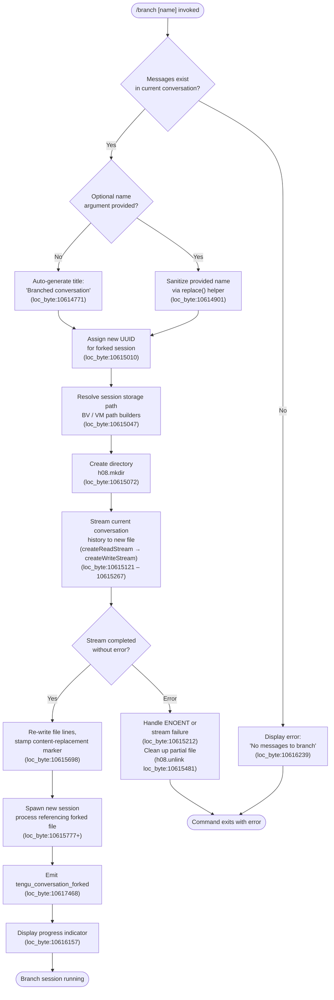

# `/branch`

> Analysis basis: CC v2.1.149 bundle.js (AST extraction + Claude interpretation)
> Minimum version: v2.1.149

---

## Overview

The `/branch` command (also invocable as `/fork`) creates a divergent copy of the current conversation at the point the command is issued. It serializes the current message history into a new session file on disk, spawns a fresh Claude Code session rooted at that snapshot, and emits a `tengu_conversation_forked` telemetry event. The original conversation continues unaffected while the branch becomes an independent conversation thread.

---

## Registration

| Field | Value |
|---|---|
| type | `local-jsx` |
| name | `branch` |
| description | `Create a branch of the current conversation at this point` |
| argumentHint | `[name]` |
| aliases | `["fork"]` |
| module_id | `Md_` |
| load_inline | `true` |
| loc_byte | `12099799` |
| loc_byte_end | `12099993` |
| loc_line | `9852` |
| arbor_handler.name | `UxL` |
| arbor_handler.fqn | `claude-2.1.149::UxL` |
| arbor_handler.kind | `AsyncFunction` |
| arbor_handler.resolution_path | `module_id` |
| arbor_handler.n_hits | `0` |

Analysis basis: CC v2.1.149 bundle.js:+12099799

---

## Input Branching

The command has four observable input/state paths: (1) the optional branch name argument is present or absent, (2) no messages exist yet to branch, (3) the current conversation history is readable and a new session can be created, and (4) an unexpected error occurs during file or process operations.



---

## Behavioral Spec

### Top-level handler — `branchCommandHandler` (Arbor: `UxL`)

The handler is an `AsyncFunction` resolved via `module_id` path from module `Md_`.

```
async function branchCommandHandler(args, context):
    name = args.trim() or null

    history = getCurrentConversationMessages(context)
    if history is empty:
        displayError("No messages to branch")   // loc_byte:10616239
        return

    title = name
        ? sanitizeBranchName(name)              // loc_byte:10614901
        : "Branched conversation"               // loc_byte:10614771

    newSessionId = randomUUID()                 // loc_byte:10615010

    targetPath = buildSessionStoragePath(       // BV/VM, loc_byte:10615047
        newSessionId
    )

    await createDirectory(targetPath)           // h08.mkdir, loc_byte:10615072

    try:
        await copyConversationHistory(          // loc_byte:10615121–10615267
            sourceStream = createReadStream(currentFile, "utf8", chunkSize=448),
            destStream   = createWriteStream(targetPath)
        )
    catch error:
        if error.code == "ENOENT":              // loc_byte:173271
            displayError("No conversation to branch")  // loc_byte:10615218
        else:
            logError(error)
        cleanup(targetPath)                     // h08.unlink, loc_byte:10615481
        return

    rewriteWithContentReplacement(             // loc_byte:10615698
        targetPath,
        contentType = "text"                   // loc_byte:10614844
    )

    sessionRef = spawnForkSession(             // loc_byte:10615777+
        sessionId   = newSessionId,
        title       = title,
        mode        = "fork",                  // loc_byte:10617989
        titleMode   = "auto"                   // loc_byte:10617422
    )

    emitTelemetry("tengu_conversation_forked") // loc_byte:10617468

    showProgress()                             // loc_byte:10616157
    return sessionRef
```

Analysis basis: CC v2.1.149 bundle.js:+10618253 (UxL entry), +10617164 (A21 sub-handler)

---

### Sub-handler — `forkSessionInitializer` (bundle: `A21`)

`A21` is the primary sub-function called from `UxL`. It orchestrates the message history scan, name resolution, and final session spawn.

```
function forkSessionInitializer(sessionContext):
    messages = filterMessages(sessionContext)  // H21 + _.find, loc_byte:10614823
    if messages.length == 0:
        return earlyExit("No messages to branch")

    computedTitle = resolveTitle(messages)     // loc_byte:10617164
    sessionHandle = startBackgroundCopy(       // _21, loc_byte:10617272
        messages,
        computedTitle
    )

    worktreeInfo = detectWorktree(             // Zc, loc_byte:10616841
        currentDirectory
    )

    markForkCompletion(                        // cy / GLH, loc_byte:10617435
        sessionHandle,
        title = computedTitle,
        worktree = worktreeInfo
    )

    await streamFinished(outputStream)        // eP1.finished, loc_byte:10616649
    return sessionHandle
```

Analysis basis: CC v2.1.149 bundle.js:+10617164

---

### Sub-handler — `conversationFileCopier` (bundle: `_21`)

`_21` performs the raw byte-level copy of the existing JSONL session log into the new session directory.

```
async function conversationFileCopier(sourcePath, destPath, options):
    sourceStream = createReadStream(sourcePath, {
        encoding: "utf8",          // loc_byte:10615154
        highWaterMark: 448         // loc_byte:10615103
    })

    // Wait for stream to open before piping
    await once(sourceStream, "open")           // loc_byte:10615169

    destStream = createWriteStream(destPath, { highWaterMark: 384 })  // loc_byte:10615313

    sourceStream.on("drain", ...)              // loc_byte:10615578

    for each chunk from readline interface:    // tP1.createInterface, loc_byte:10615361
        processedLines = chunk.map(rewriteLine) // loc_byte:10615416
        destStream.write(processedLines)

    // Replace certain content markers in the copy
    rewriteLines tagged "content-replacement"  // loc_byte:10615698

    // Accumulate progress tokens
    progressTokens.push(token)                // loc_byte:10615738

    // Track new session in daemon map
    daemonMap.set(newSessionId, sessionRef)   // loc_byte:10615823

    await streamFinished(destStream)           // loc_byte:10616649
    destStream.end()                           // loc_byte:10616635

    // Stochastic jitter on parallel copy lanes (100ms ceiling)
    jitter = randomDelay(0, 100)               // loc_byte:10614938
```

Analysis basis: CC v2.1.149 bundle.js:+10615010

---

### Sub-handler — `worktreeDetector` (bundle: `Zc`)

Detects whether the current project resides inside a Git worktree, which influences how the forked session is labeled.

```
function worktreeDetector(projectPath):
    rawOutput = execGit(["worktree", "--porcelain"])  // loc_byte:11804932
    entries   = parseWorktreeList(rawOutput)           // shH, loc_byte:12789545

    for entry in entries:
        if entry.path.startsWith("worktree ")         // loc_byte:11805133
            strip prefix at offset 9                   // loc_byte:11805164
            normalize via toLowerCase()
            match against currentPath

    emitTelemetry("tengu_worktree_detection")          // loc_byte:11805014
    return matchedEntry or null
```

Analysis basis: CC v2.1.149 bundle.js:+12789545

---

### Sub-handler — `sessionTitleWriter` (bundle: `cy` / `GLH`)

After the file copy completes, two routines stamp the title into the new session's metadata file.

```
function sessionTitleWriter(sessionId, title, titleSource):
    // cy path — custom title
    if titleSource == "custom-title":          // loc_byte:12783293
        writeSessionMetadata(sessionId, { title })
        emit("tengu_session_renamed")          // loc_byte:12783385

    // GLH path — agent name / fork label
    if titleSource == "agent-name":            // loc_byte:12786316
        writeSessionMetadata(sessionId, { agentName: title })
        emit("tengu_agent_name_set")           // loc_byte:12786414
```

Analysis basis: CC v2.1.149 bundle.js:+12783272 (cy), +12786295 (GLH)

---

### Name sanitization — `sanitizeBranchName` (bundle: `H21`)

```
function sanitizeBranchName(rawName):
    // Locate any reserved prefix in a lookup list
    found = commandPrefixList.find(p => rawName.startsWith(p))  // loc_byte:10614823
    // Escape special regex characters
    safe  = rawName.replace(specialCharPattern, "\\$&")          // loc_byte:10614901
    return safe
```

Analysis basis: CC v2.1.149 bundle.js:+10614823

---

## State & Side Effects

| Item | Detail |
|---|---|
| Telemetry | `tengu_conversation_forked` (loc_byte:10617468) — fired once per successful branch; `tengu_worktree_detection` (loc_byte:11805014) — fired during worktree probe; `tengu_session_renamed` (loc_byte:12783385) — when custom title applied; `tengu_agent_name_set` (loc_byte:12786414) — when agent-name title applied |
| File system | Creates a new session directory under the CC session storage path (via `h08.mkdir`); writes a JSONL copy of the current conversation (via `createWriteStream`); removes partial file on failure (via `h08.unlink`) |
| Process spawn | Spawns a new Claude Code background session referencing the forked file; session is tracked in the daemon map (`daemonMap.set`, loc_byte:10615823) |
| appState changes | New session ID registered in active session map; progress indicator shown to user (loc_byte:10616157) |
| Hook events | No direct hook invocations observed within depth-2 traversal from the command handler |
| Sound | None detected in depth-2 traversal |
| Stream lifecycle | Source read-stream uses `highWaterMark: 448` (loc_byte:10615103); destination write-stream uses `highWaterMark: 384` (loc_byte:10615313); both closed via `streamFinished` (loc_byte:10616649) |

---

## Version History

| Version | Change |
|---|---|
| v2.1.149 | Initial analysis |

---

## Common Mistakes

1. **Branching before any messages exist**: Invoking `/branch` immediately after starting Claude Code (no conversation turns yet) produces the error "No messages to branch" (bundle.js:+10616239). At least one exchange must be present.
2. **Confusing `/fork` and `/branch`**: Both aliases are functionally identical (loc_byte:10617989 records the `"fork"` alias). There is no behavioral difference between them.
3. **Expecting the original conversation to be affected**: The branch is a separate snapshot; subsequent messages in the original session are not propagated to the branch, and vice versa.
4. **Using names with special characters**: The name argument is sanitized via regex escaping (loc_byte:10614901). Characters that have regex meaning will be escaped, which may alter the displayed branch name from what was typed.
5. **Assuming instant availability**: The branch spawns asynchronously. The progress indicator (loc_byte:10616157) is shown while the copy and spawn complete; the new session may not be immediately attached.

---

## Appendix — Identifier Mapping

> For bundle debugging only. Identifiers change across versions.

| Identifier | Role |
|---|---|
| `UxL` | Top-level async handler for `/branch` command (Arbor-resolved) |
| `A21` | Primary sub-handler: orchestrates message scan, title resolution, session spawn |
| `H21` | Branch name sanitizer / message prefix scanner |
| `_21` | Conversation file copier: streams JSONL to new session directory |
| `pxL` | Message history scanner: deduplicates and indexes conversation lines |
| `Zc` | Worktree detector: runs `git worktree --porcelain` and parses output |
| `shH` | Worktree list parser: splits and normalizes porcelain output |
| `qr1` | File-system completer: resolves real paths and directory listings |
| `GSH` | Binary buffer builder for session storage writes |
| `cy` | Session title writer (custom-title path) |
| `GLH` | Session title writer (agent-name / fork-label path) |
| `w5H` | Metadata append helper: appends to session log file synchronously |
| `Gg` | Config persistence helper called from title writers |
| `_56` | Atomic config file read-modify-write utility |
| `Cq` | String slice utility: extracts ISO timestamp components |
| `BV` | Session storage path builder (top level) |
| `VM` | Session storage path builder (joins path segments) |
| `S6` | Base storage directory resolver |
| `Dv` | Platform data directory accessor |
| `j_` | Path join utility wrapper |
| `Wh` | Alternate path join helper |
| `YI` | Session index writer |
| `gO` | Session registry accessor |
| `h4` | Session registry sub-accessor |
| `a9` | Worker registration hook |
| `RH` | Error logger / telemetry error reporter |
| `c_` | Error code classifier (maps error objects to code strings) |
| `mH` | String coercion utility |
| `G1` | Error chain formatter |
| `Z2A` | Error message builder |
| `uiK` | Telemetry queue manager (shift/push ring buffer) |
| `CH` | JSON serializer wrapper (calls `JSON.stringify`) |
| `EH` | String coercion helper (calls `String()`) |
| `K8` | Async task scheduler / promise wrapper |
| `j8` | Error handler for async boundary |
| `g6` | JSON parse wrapper |
| `TR` | Session-in-daemon presence check |
| `W` | Notification/event debouncer with `setTimeout` / `clearTimeout` |
| `czH` | Config-change broadcast dispatcher |
| `b7` | Config reload orchestrator |
| `YW` | Hook runner / hook lifecycle manager |
| `fN8` | Hook spawn executor (runs external hook processes) |
| `te_` | Hook type router (routes by hook event type) |
| `re_` | MCP tool hook executor |
| `ie_` | HTTP hook executor |
| `MN8` | Hook JSON output parser |
| `Wo1` | Hook plain-text output parser |
| `AN8` | Hook filter / conditional evaluator |
| `H_H` | Hook environment entry transformer |
| `JV` | Abort-controller timeout wrapper |
| `SWH` | Hook stderr serializer |
| `se_` | Third-party hook filter |
| `Hv` | Hook path resolver |
| `qAH` | Hook argument assembler |
| `aLH` | Hook async-mode detector |
| `CIH` | Hook completion aggregator |
| `tQH` | Hook result some-checker |
| `Dp` | Policy settings reader |
| `j5H` | Hook list resolver (skill / plugin roots) |
| `Go1` | Hook result map reducer |
| `Eo1` | Hook output merger |
| `uqA` | Background session lifecycle manager |
| `yqA` | Daemon claim sender |
| `yHA` | Session roster writer |
| `_k5` | Claim timeout handler |
| `Hk5` | Claim frame builder |
| `bK` | Session path resolver (join + kG) |
| `cq` | Session stat / roster reader |
| `Bw` | Active-session state tagger |
| `x5` | Session socket path builder |
| `keH` | Session keepalive / timer manager |
| `hLH` | Session log path builder |
| `ny` | Session name resolver |
| `wB` | Session workspace path builder |
| `VZ6` | Session directory initializer |
| `Y` | Daemon session map manager (get/set/delete/update) |
| `D` | Background dispatch loop |
| `kqA` | Background spare session spawner |
| `w` | Background session process wrapper |
| `C` | Background session controller |
| `LXK` | Real-path / stat resolver for session files |
| `N` | Shell command executor / OS command runner |
| `Dz` | Session disposition classifier |
| `yk5` | Session exit handler |
| `z` | Daemon write-stream manager |
| `uH` | Output channel write helper |
| `bH` | Output channel byte helper |
| `Kv8` | Memory usage checker |
| `V6` | Low-memory session selector |
| `Oz6` | Session pins file reader |
| `wD_` | Pins file path resolver |
| `v37` | Session directory scanner |
| `g` | Session retire-if-settled helper |
| `v6` | Session filter (MCP prefix / direction) |
| `VH` | Session map with orphaned-permission check |
| `j` | Process kill list builder |
| `y` | Background worker kill helper |
| `X` | IPC socket message framer |
| `zM` | IPC socket message encoder |
| `zk5` | IPC message dispatch router |
| `Yk5` | IPC message type classifier |
| `Ok5` | Session phase checker / idle kill helper |
| `uJK` | IPC dispatch rate limiter / timeout tracker |
| `RqA` | IPC dispatch reply waiter |
| `r8` | Async retry-with-timeout utility |
| `P` | Terminal repaint orchestrator |
| `wh8` | Terminal screen writer |
| `FT` | Relative path formatter |
| `Nv` | Path normalizer |
| `Jz` | Path truncator / slicer |
| `E$` | Real-path canonicalizer |
| `WfH` | Session JSONL file tail reader |
| `$k5` | Terminal scroll offset calculator |
| `I` | Away-summary generator |
| `PJ8` | App state reader for away-summary |
| `s05` | Away-summary cache accessor |
| `ZLK` | Away-summary rate-limit checker |
| `V48` | Away-summary API call wrapper |
| `DJ1` | Random UUID generator (pV module) |
| `B` | Message history slice accessor |
| `s` | Voice recording toggle state |
| `Q` | Voice silence timeout manager |
| `r` | Voice permission checker |
| `m` | Cursor / spinner animation driver |
| `t` | Voice focus silence timeout state |
| `T` | Voice terminal reference |
| `l` | Terminal output filter |
| `o` | Voice session orchestrator |
| `d` | Voice stream connector |
| `W6A` | WebSocket voice stream factory |
| `Jk6` | IPC write helper with destroy guard |
| `f` | MCP server update applier |
| `UyH` | MCP server connection initializer |
| `QDK` | MCP server update/cleanup handler |
| `nv5` | MCP retry loop manager |
| `YY` | Background service type classifier |
| `DOH` | Background service V6 router |
| `Mm` | Regex escape helper (replaces special chars with `\$&`) |
| `Cf` | MCP prefix checker |
| `Q6` | Session log file path builder |
| `_56` | Atomic config read-modify-write |
| `Gg` | Config persistence wrapper with timestamp |
| `Cq` | ISO timestamp slicer |
| `vyH` | Skill index cache invalidator |
| `bo` | Skill index refresh orchestrator |
| `Vx` | Skill index cache clearer |
| `GP8` | Skill index writer |
| `aM1` | Skill roster updater |
| `XyH` | DP8 cache clearer |
| `czH` | Policy/config change broadcaster |
| `tQH` | Hook result presence checker |