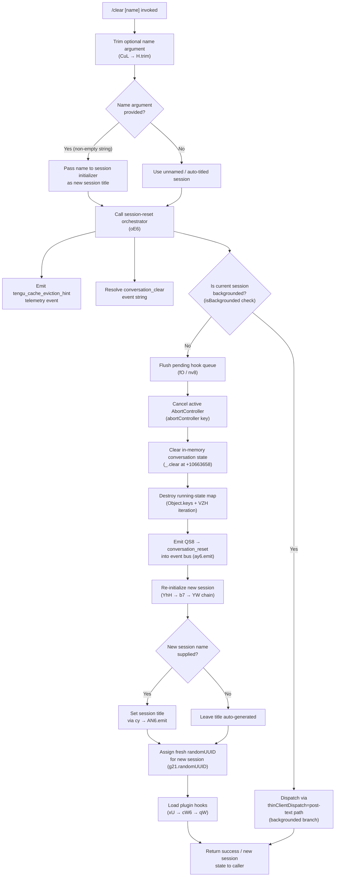

# `/clear`

> Analysis basis: CC v2.1.149 bundle.js (AST extraction + Claude interpretation)
> Minimum version: v2.1.149

---

## Overview

`/clear` (aliases: `/reset`, `/new`) starts a fresh conversation session with an empty context window. The previous session is preserved on disk and remains resumable via `/resume`. An optional `[name]` argument assigns a name to the new session at creation time.

---

## Registration

| Field | Value |
|---|---|
| type | `local` |
| name | `clear` |
| description | `Start a new session with empty context; previous session stays on disk (resumable with /resume)` |
| aliases | `["reset", "new"]` |
| argumentHint | `[name]` |
| supportsNonInteractive | `true` |
| thinClientDispatch | `post-text` |
| module_id | `c21` |
| load_inline | `true` |
| loc_byte | `10665235` |
| loc_byte_end | `10665526` |
| loc_line | `8371` |
| arbor_handler.name | `CuL` |
| arbor_handler.fqn | `claude-2.1.149::CuL` |
| arbor_handler.kind | `AsyncFunction` |
| arbor_handler.resolution_path | `module_id` |
| arbor_handler.n_hits | `0` |

Analysis basis: CC v2.1.149 bundle.js:+10665235

---

## Input Branching

The handler has 3+ distinct paths depending on the optional name argument, backgrounded-session state, and available abort controller state.



Analysis basis: CC v2.1.149 bundle.js:+10665061 – +10664814

---

## Behavioral Spec

### 1. Handler Entry — `clearCommandHandler` (`CuL`)

The Arbor-resolved async handler `CuL` is the top-level entry point for `/clear`.

```
async function clearCommandHandler(args, context):
    rawName = args.trim()            // H.trim at +10665061
    await sessionResetOrchestrator(rawName, context)  // oE6 at +10665097
```

Analysis basis: CC v2.1.149 bundle.js:+10665061

---

### 2. Session-Reset Orchestrator — `sessionResetOrchestrator` (`oE6`)

This is the primary coordination function. It validates the optional session name, wires abort signals, tears down the current session, and boots a new one.

```
async function sessionResetOrchestrator(name, context):
    // Validate / parse optional numeric session index if name looks like a number
    parsedIndex = parseOptionalIndex(name)   // sE6 at +10663238

    // Emit cache-eviction hint to telemetry
    emit("tengu_cache_eviction_hint")         // +10663342

    // Build a timeout-bounded AbortSignal for teardown operations
    signal = AbortSignal.timeout(...)         // +10663298

    // Retrieve the session-roster entry for the active foreground session
    sessionEntry = getActiveSessionEntry()    // t_6 at +10663329

    // Identify any backgrounded sessions
    backgroundedSessions = Object.values(sessionMap)  // +10663508

    // Obtain the daemon/worker interface for the active session
    activeWorker = workerPool.get(sessionId)          // w at +10663537

    // Add the new session UUID to the "about to clear" tracking set
    clearSet.add(newSessionId)                         // Y.add at +10663560

    // Push a SessionEnd marker into the message journal
    journal.push(SessionEndRecord)                     // D.push at +10663577

    // Flush pending hook queue before tearing down
    flushPendingHooks(context)                         // rw at +10663595

    // Reset all in-session caches and state stores
    resetAllCaches(context)                            // bd_ at +10663640

    // Resolve the working directory for the new session
    newCwd = resolveWorkingDirectory(name)             // Hw at +10663649

    // Set the session-name hint
    sessionNameHint = name                             // j_ at +10663652

    // Clear the in-memory conversation message list
    conversationMessages.clear()                       // _.clear at +10663658

    // Iterate all running-state map keys and terminate them
    for key in Object.keys(runningStateMap):           // +10663683
        terminateRunningEntry(key)                     // VZH iteration

    // Navigate to the new working directory context
    setContextualCwd(newCwd)                           // M at +10663765

    // Iterate environment entries, apply resets
    for [k,v] in Object.entries(envMap):               // +10663797
        applyEnvironmentReset(k, v)                    // xN at +10663880

    // Cancel the old abort controller
    clearTimeout(pendingTimer)                          // +10663958

    // Log session teardown
    logSessionEvent()                                  // RH at +10664053

    // Flush any deferred output promises
    flushOutputPromises()                              // fO at +10664059

    // Notify background-session monitor
    notifyBackgroundMonitor()                          // GlH at +10664097

    // Emit conversation_clear event string
    emitConversationClearEvent("conversation_clear")   // +10663377

    // Emit conversation_reset into the event bus
    emitConversationResetEvent("conversation_reset")   // aE6 at +10664443

    // Assign new session UUID
    newId = crypto.randomUUID()                        // g21.randomUUID at +10664499

    // Broadcast session-start event to registered listeners
    broadcastSessionStart()                            // QS8 at +10664517

    // Update session state: initialize new context record
    updateSessionState(newId, name, newCwd)            // Vc at +10664630

    // Write session audit record and fire hooks
    writeAuditAndFireHooks(context)                    // cy at +10664643

    // Emit fyH (worktree / symlink state update) if in worktree mode
    updateWorktreeSymlinks()                            // fyH at +10664750

    // Update the named-session key map
    updateKeyMap()                                     // kE at +10664759

    // Emit "tM" (task-manager reset signal)
    resetTaskManager()                                 // tM at +10664762

    // Publish yf (feature-flag snapshot for new session)
    publishFeatureFlagSnapshot()                       // yf at +10664784

    // Emit Yu (worktree-state change event)
    emitWorktreeStateChange()                          // Yu at +10664794

    // Finalize isolation latch
    finalizeIsolationLatch()                           // G_H at +10664814

    // Start the new session worker
    startNewSessionWorker(signal)                      // xU at +10664841
```

Analysis basis: CC v2.1.149 bundle.js:+10663238 – +10664841

---

### 3. Optional Index Parsing — `parseOptionalIndex` (`sE6`)

When the `[name]` argument consists entirely of digits, the handler treats it as a session-list index rather than a free-form name.

```
function parseOptionalIndex(rawName):
    n = parseInt(rawName, 10)          // +12880226, radix 10
    if not Number.isFinite(n):         // +12880248
        return null                    // non-numeric → treat as plain name

    // Clamp to valid range using Math.max / Math.min
    // Maximum value used in clamping: 1000  (+12880413)
    clamped = Math.max(0, Math.min(n, 1000))
    return resolveSessionByIndex(clamped)  // rY at +12880291
```

Analysis basis: CC v2.1.149 bundle.js:+12880226

---

### 4. Global Cache Reset — `resetAllCaches` (`bd_`)

`bd_` is called unconditionally during `/clear`. It resets every named in-memory store that may hold state from the previous session.

```
function resetAllCaches(context):
    clearSkillIndexCache()             // Vx → H.clearSkillIndexCache at +12743658
    resetPluginState()                 // GP8, aM1, vyH at +12743710–12743722
    clearMcpClientCache()              // MWq → OU.clear at +6440750
    resetSubagentQueue()               // Uo → W28 (deletes ready/subagent_exit entries)
    clearCompactCache()                // Uo → wD6 (post_compact_cleanup / session_start)
    clearO8HCache()                    // o8H → CC8, gC8
    clearNw1Cache()                    // Z28 → nw1.clear
    clearKE_Cache()                    // o0q → bj6.clear, KE_.clear
    resetNdqState()                    // Ndq → H
    resetEwHState()                    // ewH → H, _
    resetAutonomousLoopDelivered()     // MvL.resetAutonomousLoopDelivered at +9885967
    clearVwValues()                    // Vw → Object.values
    resetDP8Cache()                    // XyH → DP8.clear at +9594062
    resetWD6State()                    // wD6 → TE (session_start)
    clearJkHAndIC_()                   // Ieq → jkH.clear, iC_.clear
    clearOHAndZ26()                    // Xdq → _oH.clear, Z26.clear
    clearSuHCache()                    // Hc8 → $uH.clear
    clearDa9()                         // da9
    clearL78Cache()                    // c2q → L78.clear
    checkYC8State()                    // yC8 → H.has
    clearFuHCache()                    // Qd8 → fuH.clear
    resetI31()                         // i31
    clearGlqCaches()                   // Glq → Ko.clear, MjH.clear
    resolveGC_()                       // GC_ at +10662596
    finalizeQAndXX8()                  // q, xX8
    runBPAndTCH()                      // bP, tcH at +10662765, +10662850
```

Analysis basis: CC v2.1.149 bundle.js:+10662281 – +10662850

---

### 5. New Session Initialization — `initializeNewSession` (`YhH`)

After teardown, `YhH` bootstraps the new empty session. It records a `SessionEnd` marker for the outgoing session, then calls the full conversation-runner setup (`YW`).

```
async function initializeNewSession(sessionId, name, cwd, context):
    // Record SessionEnd event in journal for the previous session
    recordSessionEndEvent("SessionEnd")     // b7 → S6 at +12870898

    // Build the new session's conversation runner
    runner = buildConversationRunner(sessionId, name, cwd)  // YW at +12870929

    // Attach session state to app-state store
    attachToAppState(runner)               // S6 at +12871126

    // Notify any optional UI callback
    notifyUICallback()                     // OkH at +12871131
```

Analysis basis: CC v2.1.149 bundle.js:+12870871 – +12871131

---

### 6. Conversation Runner Setup — `buildConversationRunner` (`YW`)

`YW` is the heavyweight setup path executed every time a new conversation context is created (also shared with the `/resume` path). Key responsibilities:

```
async function buildConversationRunner(sessionId, name, cwd, opts):
    // Initialize model/effort settings
    modelConfig = resolveModelConfig()          // mH, Dp at +12918640, +12918729

    // Parse and validate model name
    validatedModel = validateModelName(name)    // N at +12918741

    // Load hook configuration
    hooks = loadHookConfig()                    // j5H at +12918817

    // Resolve timeout value; default randomized between 1–2× base
    timeout = computeTimeout()                  // H → Math.random/setTimeout

    // Attach context window manager
    contextWindow = attachContextWindow()       // S6, te_ at +12918919, +12918932

    // Filter available tool list
    tools = filterToolList()                    // O.filter at +12918999

    // Build goal-oriented planner
    planner = buildPlanner()                    // Go1 at +12919014

    // Assemble sub-agent filter
    subagentFilter = buildSubagentFilter()      // se_ at +12919043

    // Set execution mode flags
    setExecutionMode(Eo1, c)                    // +12919052, +12919059

    // Serialize session configuration
    serializedConfig = CH(sessionConfig)        // JSON.stringify at +12919126

    // Register hook runner
    hookRunner = registerHookRunner()           // RH at +12919199

    // Attach user-output stream
    outputStream = attachOutputStream(uH)       // +12919205

    // Attach streaming-write handler
    streamWriter = attachStreamWriter(SWH)      // +12919208

    // Map over tool list for output
    mappedTools = tools.map(...)                // O.map at +12919257

    // Create abort controller pair for the new session
    abortPair = createAbortControllerPair(JV)  // +12919397

    // Generate new conversation UUID
    convId = crypto.randomUUID()               // ESH.randomUUID at +12919427

    // Register callback on the job object
    job.callback(...)                          // J.callback at +12919452

    // Emit qAH (quota / rate-limit state snapshot)
    quotaSnapshot = qAH(...)                   // +12919481

    // Compute conversation metadata
    metadata = computeMetadata(Hv)             // +12919647

    // Attach worktree binding
    worktreeBinding = AN8(...)                 // +12919800

    // Stringify session display info
    displayInfo = String(...)                   // +12919956

    // Execute the main agent loop (re_)
    agentResult = await runAgentLoop(re_)      // +12920343

    // Process compacted context if present
    compactResult = processCompact(MN8)        // +12920629

    // Handle errors
    if error: throw Error(...)                 // +12920652

    // Fire H_H (hook result processor)
    hookResult = processHookResult(H_H)        // +12920714

    // Run ie_ (MCP/HTTP hook executor)
    mcpResult = await executeMcpHooks(ie_)     // +12921641

    // Run Wo1 (worktree hook handler)
    await runWorktreeHooks(Wo1)                // +12922030

    // Collect aLH metrics
    metrics = collectMetrics(aLH)              // +12922663

    // Execute full session hook pipeline (fN8)
    await executeSessionHookPipeline(fN8)      // +12922727

    // Run CIH (context-injection hook)
    await runContextInjectionHook(CIH)         // +12922739

    // Await all parallel promises
    await Promise.all([...])                   // +12923747

    // Return built session handle
    return buildSessionHandle(bH)              // +12923785
```

Analysis basis: CC v2.1.149 bundle.js:+12918640 – +12923785

---

### 7. Working-Directory Resolution — `resolveWorkingDirectory` (`Hw`)

```
function resolveWorkingDirectory(namehint):
    if path.isAbsolute(namehint):              // UY8.isAbsolute at +8007153
        resolved = namehint
    else:
        resolved = path.resolve(process.cwd(), namehint)  // UY8.resolve at +8007173

    // Query context-store for override
    override = dQ8()                           // Lm6.getStore at +973327

    // Normalize to NFC form
    normalized = path.normalize(resolved).normalize("NFC")  // +973353, +973365

    if not isValidDirectory(normalized):       // j8 at +8007243
        throw Error("invalid working directory") // +8007255

    return normalized
```

Analysis basis: CC v2.1.149 bundle.js:+8007153

---

### 8. Hook Flush Before Teardown — `flushPendingHooks` (`fO`)

```
async function flushPendingHooks(context):
    // Track the flush promise in the pending-hooks set
    pendingHooksSet.add(flushPromise)          // nv8 → Gr1.add at +12836477
    flushPromise.finally(() => pendingHooksSet.delete(flushPromise))

    // Retrieve any queued hook output
    cached = cv8.get(hookKey)                  // fO → cv8.get at +12837905

    // Flush the hook output buffer
    await buffer.flush()                       // _.flush at +12837927

    // Remove hook key from deferred map
    cv8.delete(hookKey)                        // +12837937
```

Analysis basis: CC v2.1.149 bundle.js:+12837884

---

## State & Side Effects

| Item | Detail |
|---|---|
| Telemetry — `tengu_cache_eviction_hint` | Fired once on every `/clear` invocation inside `oE6` (+10663342) |
| Telemetry — `tengu_run_hook` | Fired when hooks are executed during the new-session setup phase (+12919061) |
| Telemetry — `tengu_feature_bad` / `tengu_feature_ok` | Fired by hook feature-gate checks in `uH`/`bH` (+963479, +963421) |
| Telemetry — `tengu_hook_plugin_metrics` | Fired after plugin hooks complete (+12897732) |
| Telemetry — `tengu_repl_hook_finished` | Fired when any REPL-phase hook finishes (+12903140) |
| Telemetry — `tengu_hook_plugin_injected` | Fired when a plugin injects content into the session (+12917407) |
| Telemetry — `tengu_session_renamed` | Fired if the new session is given a custom name via `cy` (+12783385) |
| Telemetry — `tengu_shell_set_cwd` | Fired when the new session's working directory is set (+8007308) |
| In-memory state | All conversation messages cleared (`_.clear` +10663658); all running-state map keys purged |
| Caches | All named caches in `bd_` (skill index, MCP client, subagent queue, compact cache, hook caches, etc.) are cleared synchronously |
| Event bus | `conversation_clear` (+10663377) and `conversation_reset` (+10664460) events emitted; `SessionEnd` marker pushed to journal; new `SessionStart` broadcast via `QS8` → `ay6.emit` (+40704) |
| Abort controller | The previous session's `AbortController` is cancelled (`clearTimeout` +10663958, `K.abort` via `JV`) |
| Session UUID | A new UUID is generated via `crypto.randomUUID()` (`g21.randomUUID` +10664499, `ESH.randomUUID` +12919427) |
| Session name | If `[name]` argument is non-empty, it is applied as the new session title via `cy → AN6.emit` |
| Hook registration | Full hook pipeline (`fN8`) is re-executed for the new session; plugin hooks loaded via `xU → MuH` |
| Worktree state | Symlinks and worktree state are updated via `fyH` and `Yu` (+10664750, +10664794) |
| Disk | Previous session data remains on disk; the command does **not** delete any persisted session files |
| Sound | <!-- TODO: not found in depth-2 traversal; needs --depth 4 --> |

---

## Version History

| Version | Change |
|---|---|
| v2.1.149 | Initial analysis |

---

## Common Mistakes

1. **Expecting history erasure from disk** — `/clear` only clears the in-memory context; the previous session is preserved on disk and is fully resumable with `/resume`. Disk data is not deleted.
2. **Confusing `/clear` with `/reset` or `/new`** — All three aliases (`clear`, `reset`, `new`) invoke the exact same handler (`CuL`) and are fully equivalent.
3. **Providing a purely numeric name** — If the `[name]` argument looks like a plain integer (e.g. `/clear 2`), the handler interprets it as a session-index selector (`sE6` path, radix 10, clamped to 0–1000) rather than a free-form session name.
4. **Expecting immediate hook quiescence** — `/clear` flushes the pending hook queue (`fO`) before tearing down, but the flush is asynchronous; any hook still running will be awaited before the new session begins.
5. **Using `/clear` in non-interactive scripts without checking `supportsNonInteractive`** — The field is `true`, so the command is safe in non-interactive mode, but the `thinClientDispatch: "post-text"` field means backgrounded-session invocations follow a different dispatch path and do not perform full in-process teardown.

---

## Appendix — Identifier Mapping

> For bundle debugging only. Identifiers change across versions.

| Identifier | Role |
|---|---|
| `CuL` | Top-level `/clear` async command handler (Arbor-resolved entry point) |
| `oE6` | Session-reset orchestrator — coordinates full teardown and re-init |
| `sE6` | Optional session-index parser (parseInt + clamp) |
| `rY` | Session-by-index resolver |
| `p8` | Policy-settings accessor |
| `Hm` | Helper called during index resolution (delegates to `Dv`) |
| `wp` | Wrapper called in index resolution (delegates to `Vf_`) |
| `Vf_` | Inner helper called by `wp` (delegates to `fx9`) |
| `YhH` | New-session bootstrap — records SessionEnd, calls runner setup |
| `b7` | Session-journal entry builder (SessionEnd record) |
| `S6` | App-state store accessor |
| `Zh` | Utility helper used in journal / app-state paths |
| `R2` | Model-effort resolver (checks model name against known claude-* strings) |
| `dZ` | Effort-level classifier (`high` etc.) |
| `BV` | Session-state builder (joins fields via `zj.join`) |
| `x6` | Session-name formatter |
| `YW` | Conversation runner setup (heavyweight new-session initializer) |
| `mH` | String coercion utility |
| `Dp` | Model-config delegator (calls `p8`) |
| `N` | Model-name validator (checks includes, trim, toUpperCase, etc.) |
| `j5H` | Hook configuration loader |
| `te_` | Hook-type registry / filter (PreToolUse, PostToolUse, SessionStart, etc.) |
| `O` | Tool-list container / filter |
| `Go1` | Goal-oriented planner builder |
| `se_` | Sub-agent filter builder |
| `Eo1` | Execution-mode flag setter |
| `c` | Generic context/config accessor |
| `CH` | JSON serialization helper (wraps JSON.stringify) |
| `RH` | Hook runner / session-event logger |
| `uH` | User-output stream attacher |
| `SWH` | Streaming-write handler attacher (delegates to `cu6`) |
| `JV` | Abort-controller pair creator / canceller |
| `J` | Job-object callback registrar |
| `qAH` | Quota / rate-limit snapshot emitter |
| `Hv` | Conversation metadata computer |
| `AN8` | Worktree binding attacher |
| `re_` | Main agent loop runner |
| `MN8` | Compact-context processor |
| `H_H` | Hook result processor |
| `ie_` | MCP / HTTP hook executor |
| `Wo1` | Worktree hook handler |
| `aLH` | Metrics collector |
| `fN8` | Full session hook pipeline executor |
| `CIH` | Context-injection hook runner |
| `bH` | Session-handle finalizer |
| `OkH` | UI callback notifier (delegates to `H`, `N`) |
| `t_6` | Active session-roster entry accessor |
| `L` | Session-set manager (add / delete / finally) |
| `q` | Session-unlink utility |
| `M` | Session-close coordinator |
| `A` | Low-level process / stream handle |
| `w` | Worker-pool entry accessor and lifecycle manager |
| `C` | Worker process controller (kill / write / stat) |
| `LXK` | Worker filesystem helpers (realpath, stat) |
| `Dz` | Worker diagnostic helper |
| `yk5` | Worker-state helper (delegates to `ej8`) |
| `z` | Worker write-stream (delegates to `bH`, `uH`, `Rk`, `pu`) |
| `Kv8` | Low-memory monitor |
| `V6` | Memory-pressure tracker (uses `lg` Map) |
| `Oz6` | Pinned-context reader (`pins.json`) |
| `wD_` | Path builder for pinned context |
| `g6` | JSON parse wrapper |
| `j8` | ENOENT-safe stat check |
| `v37` | Directory-based pinned-context loader |
| `g` | Agent/session pool manager (retireIfSettled) |
| `v6` | Conversation-filter helper (left/right/collapse/expand) |
| `VH` | Orphaned-permission tracker |
| `yqA` | Background-session claim sender |
| `yHA` | Session-roster file writer |
| `_k5` | Claim-send timeout guard |
| `Hk5` | Claim-frame builder (wraps `bB.buildClaimFrame`) |
| `K8` | Error-code helper |
| `EH` | String error formatter |
| `MB` | Binary message framer (Buffer operations) |
| `uqA` | Session-cleanup orchestrator (rm, unlink, roster, refill) |
| `K` | Column-padding formatter |
| `bK` | Session-config path builder |
| `cq` | Session-state file reader / writer (XzH cache) |
| `Bw` | Active-session state helper (delegates to `gZ`) |
| `x5` | Session-path helper (SO, NP.join, Uw) |
| `keH` | Session-timer / expiry hook |
| `hLH` | Session-log path helper |
| `ny` | Session-log line reader |
| `wB` | Session-start log writer |
| `VZ6` | Session-roster directory writer |
| `Y` | Daemon config / MCP server manager |
| `D` | Spare-session lifecycle dispatcher |
| `$` | Disposable-resource manager |
| `kqA` | Background spare-session spawner (Bun.spawn) |
| `S` | Disposable session wrapper |
| `VX` | Session-visibility flag |
| `rw` | Pre-teardown hook flush trigger |
| `bd_` | Global cache reset coordinator |
| `yd_` | Cache-reset pre-check |
| `bo` | Skill/plugin state resetter |
| `Vx` | Skill-index cache clearer |
| `GP8` | Plugin-state resetter |
| `aM1` | Additional plugin-state resetter |
| `vyH` | Plugin-state resetter variant |
| `MWq` | MCP-client cache clearer (OU.clear) |
| `UvH` | MCP config file writer / reloader |
| `TA6` | Sub-module reset helper |
| `Uo` | Subagent/compact/session-state reset coordinator |
| `WVH` | Main-agent reset (delegates to `RHH`) |
| `W28` | Subagent queue cleanup (Ju.delete, bU_.delete) |
| `wD6` | Session-start / compact-state recorder |
| `o8H` | CC8/gC8 cache resetters |
| `Z28` | nw1 cache clearer |
| `o0q` | bj6 / KE_ cache clearers |
| `Ndq` | Ndq state resetter |
| `ewH` | ewH state resetter |
| `Vw` | Object.values reset helper |
| `iU_` | Isolation-latch resetter |
| `XyH` | DP8 cache clearer |
| `Ieq` | jkH / iC_ cache clearers |
| `Xdq` | _oH / Z26 cache clearers |
| `Hc8` | $uH cache clearer |
| `da9` | da9 state resetter |
| `c2q` | L78 cache clearer |
| `yC8` | yC8 state checker (H.has) |
| `Qd8` | fuH cache clearer |
| `i31` | i31 state resetter |
| `Glq` | Ko / MjH cache clearers |
| `Hw` | Working-directory resolver |
| `Q6` | Directory-existence checker |
| `dQ8` | Async-local-store working-directory accessor |
| `BAH` | Path normalizer (NFC) |
| `j_` | Session-name hint setter (delegates to `Dv`) |
| `VZH` | Running-state map iterator/terminator |
| `xN` | Environment-entry reset helper |
| `fO` | Pending hook queue flusher |
| `nv8` | Hook-promise tracker (Gr1 set) |
| `GlH` | Background-session monitor notifier |
| `mOq` | Background-monitor inner helper |
| `d21` | Deferred-output finalizer (XMH) |
| `gO` | Session-output stream wrapper (S6, h4) |
| `h4` | Low-level session-state record builder |
| `a9` | Session-state registration (W7A.register) |
| `YI` | Session-info field accessor |
| `VM` | Session-path joiner (UDH.join) |
| `Wh` | Session-state helper (delegates to `Dv`) |
| `aE6` | conversation_reset event emitter |
| `QS8` | Session-start broadcaster (randomUUID + ay6.emit) |
| `Vc` | New-session context record initializer |
| `cy` | Session-title writer and custom-title event emitter |
| `w5H` | Sync file append helper (appendFileSync, mkdirSync) |
| `fyH` | Worktree symlink state updater |
| `Fe_` | Worktree directory creator |
| `woH` | Worktree path builder |
| `L3` | Worktree path + state builder |
| `YaH` | Worktree file opener (Wa.open) |
| `kE` | Named-session key-map updater |
| `tM` | Task-manager reset signal emitter |
| `yf` | Feature-flag snapshot publisher |
| `Yu` | Worktree-state change event emitter |
| `G_H` | Isolation-latch finalizer |
| `Hr1` | Async file append helper (A7.appendFile, A7.mkdir) |
| `xU` | New-session worker starter and plugin-hook loader |
| `K4` | Session-worker config builder |
| `KEH` | Plugin-hook policy checker (policySettings) |
| `MuH` | Plugin-hook executor with date-stamp |
| `V8` | Hook-output file writer |
| `cW6` | Conversation-runner launcher (b7, qW) |
| `qW` | Full conversation agent loop |
| `f` | MCP-server lifecycle manager |
| `UyH` | MCP-server connection initializer |
| `QDK` | MCP-server update / cleanup handler |
| `nv5` | MCP-client reconciler |
| `T9` | Random-UUID generator wrapper (ZM1.randomUUID) |

---

Note: index built via Arbor fallback; some signals (telemetry, literals) may be missing — see arbor-fallback.js.