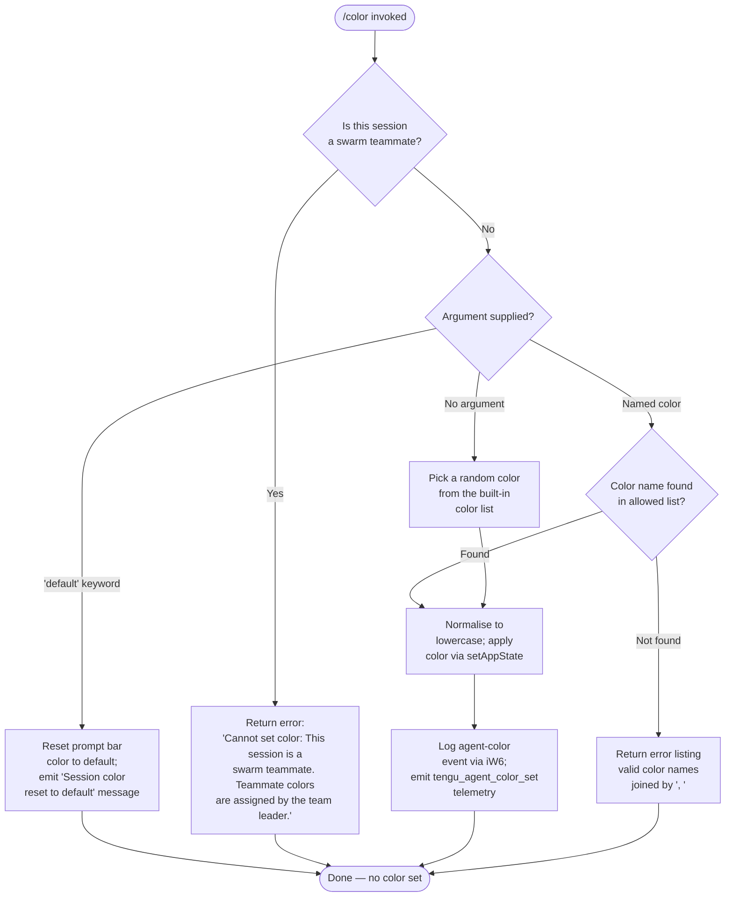

# `/color`

> Analysis basis: CC v2.1.145 bundle.js (AST extraction + Claude interpretation)
> Minimum version: v2.1.145

---

## Overview

The `/color` command sets the prompt bar color for the current Claude Code session. It accepts an optional color name argument; when invoked without arguments (or with the special keyword `default`) it resets the bar color to the default theme. In swarm multi-agent sessions, teammate instances are prohibited from changing their own color — only the team leader may assign teammate colors.

---

## Registration

| Field | Value |
|---|---|
| type | `local-jsx` |
| name | `color` |
| description | Set the prompt bar color for this session |
| loc_byte | `10147381` |
| loc_byte_end | `10147598` |
| loc_line | `5591` |
| argumentHint | `null` |
| immediate | `true` |
| module_id | `J4q` |
| load_inline | `true` |
| arbor_handler.name | `xw7` |
| arbor_handler.fqn | `claude-2.1.145::xw7` |
| arbor_handler.kind | `AsyncFunction` |
| arbor_handler.resolution_path | `module_id` |
| arbor_handler.n_hits | `0` |

Analysis basis: CC v2.1.145 bundle.js:+10147381

---

## Input Branching

Four distinct execution paths exist depending on swarm membership, the supplied argument, and whether the argument is recognised:



Analysis basis: CC v2.1.145 bundle.js:+10146217 – +10146820

---

## Behavioral Spec

### Entry Point — `colorCommandHandler` (`xw7`)

The Arbor symbol graph resolves `xw7` as the command's async handler via `module_id` resolution into module `J4q`.

```
async function colorCommandHandler(context):
    input  = context.input            // raw argument string
    result = colorExecutor(input)     // delegates to Pj8
    return result
```

Analysis basis: CC v2.1.145 bundle.js:+10146148

---

### Core Executor — `colorExecutor` (`Pj8`)

```
async function colorExecutor(rawArg):

    // 1. Swarm-teammate guard
    if isSwarmTeammate(getCurrentStore()):   // via Qf → LW → go8.getStore
        return errorMessage(
            "Cannot set color: This session is a swarm teammate. " +
            "Teammate colors are assigned by the team leader."
        )

    // 2. Normalise input
    normalised = rawArg.toLowerCase()        // A.toLowerCase

    // 3. Reset path — explicit 'default' keyword
    if normalised == "default":
        setAppState({ promptBarColor: undefined })
        logAgentColorEvent("default")        // iW6
        return systemMessage("Session color reset to default")

    // 4. No argument — pick random color
    if normalised == "":
        index    = Math.floor(Math.random() * colorList.length)
        selected = colorList[index]
        normalised = selected

    // 5. Validate against allowed color list (bw7)
    if NOT colorList.includes(normalised):
        validNames = colorList.join(", ")
        return errorMessage(
            "Unknown color '" + normalised + "'. " +
            "Valid colors: " + validNames
        )

    // 6. Apply color
    currentState = getAppState()
    setAppState({ ...currentState, promptBarColor: normalised })

    // 7. Persist + log
    colorName = jj8(normalised)              // maps display name → key
    logAgentColorEvent(colorName)            // iW6 → sZ, C4H, tengu_agent_color_set

    // 8. Render confirmation JSX component
    return renderColorConfirmation(normalised, uw7)
```

Analysis basis: CC v2.1.145 bundle.js:+10146217 – +10146811

---

### Swarm-Teammate Check — `isSwarmTeammate` (`Qf`)

```
function isSwarmTeammate(store):
    storeValue = getStoreValue(store)    // LW → go8.getStore (loc +2172150)
    return storeValue !== 0              // literal 0 at loc +2172162
```

The function reads the application's async store with index `0` to determine whether the running process is a non-leader agent in a swarm session.

Analysis basis: CC v2.1.145 bundle.js:+10146217, +2172150, +2172162

---

### Color Name Map — `colorKeyMapper` (`jj8`)

```
function colorKeyMapper(colorName):
    keys = Object.keys(colorDefinitions)   // Object.keys at loc +10145921
    // returns the canonical key for the given display name
    return keys.find(k => colorDefinitions[k] == colorName)
```

Analysis basis: CC v2.1.145 bundle.js:+10146623, +10145921

---

### Agent Color Logging — `agentColorLogger` (`iW6`)

```
async function agentColorLogger(colorKey, context):
    // Build structured log entry (sZ)
    entry = buildLogEntry(colorKey, "agent-color")   // literal "agent-color" at loc +12204713

    // Persist to log file (C4H)
    appendColorLog(entry)

    // Emit telemetry
    k6(...)           // internal telemetry dispatch
    jL(...)           // hook registration helper
    d(...)            // finalise / cleanup

    // Fires: tengu_agent_color_set (loc +12204797)
```

Analysis basis: CC v2.1.145 bundle.js:+10146593, +12204692, +12204701, +12204713, +12204758, +12204763, +12204797

---

### Log Entry Builder — `buildLogEntry` (`sZ`)

```
function buildLogEntry(colorKey, category):
    prefix   = k6(...)            // timestamp / session prefix
    role     = RS(...)            // role tag
    body     = s5(...)            // formatted body
    extras   = [r$, q_]           // additional metadata
    line     = Iw.join(extras)    // join path components
    return { prefix, role, body, line }
```

Analysis basis: CC v2.1.145 bundle.js:+12172880 – +12172925

---

### Log File Writer — `appendColorLog` (`C4H`)

```
async function appendColorLog(entry):
    serialised = JSON.stringify(entry)   // RH → JSON.stringify (loc +181618)
    try:
        A.appendFileSync(logPath, serialised, { mode: 384 })   // octal 0o600, loc +12200575
    catch ENOENT:
        A.mkdirSync(Iw.dirname(logPath), { mode: 448 })        // octal 0o700, loc +12200619
        A.appendFileSync(logPath, serialised)
    jL(...)   // register hook after write (loc +12200658)
```

File permission constants: `384` (0o600, owner read/write) and `448` (0o700, owner rwx directory).

Analysis basis: CC v2.1.145 bundle.js:+12200527, +12200548, +12200575, +12200587, +12200619, +12200658

---

### Confirmation Renderer — `colorConfirmationRenderer` (`uw7`)

```
function colorConfirmationRenderer(colorName, context):
    element = wG(...)                 // JSX color swatch component
    text    = wr(...)                 // formatted label text
    if noArg:
        return Promise.resolve(element)
    extra = UwH(...)                  // additional status row
    rows  = q(...)                    // row container
    detail = D6H(...)                 // detail line
    return <ColorConfirmation swatch=element label=text detail=detail />
```

The renderer produces a JSX component that displays a colour swatch and confirmation text in the prompt bar area.

Analysis basis: CC v2.1.145 bundle.js:+10146904, +10146945, +10146950, +10146980, +10147032, +10147050

---

### App-State Accessor Pair — `getAppState` / `setAppState` (`_`)

The handler reads current application state via `_.getAppState` (loc +10146647) and writes the updated `promptBarColor` field via `_.setAppState` (loc +10146604). Both are thin wrappers over the central application state store.

Analysis basis: CC v2.1.145 bundle.js:+10146604, +10146647

---

## State & Side Effects

| Item | Detail |
|---|---|
| Telemetry | `tengu_agent_color_set` (emitted on every successful color application, including random selection; loc +12204797) |
| appState changes | `promptBarColor` field updated via `_.setAppState` (loc +10146604); cleared (`undefined`) on reset to default |
| Log file write | Color change appended to agent log file via `A.appendFileSync`; directory auto-created with mode `0o700` if absent (loc +12200548, +12200587) |
| File permissions | Log file written with mode `0o600` (384); parent directory created with `0o700` (448) |
| Hook registration | `jL` / `h9` → `w6A.register` called after log write to register a post-write hook (loc +12200658, +12175468, +57267) |
| Swarm guard | Command exits immediately with an error string when the session is a swarm teammate (loc +10146228) |
| Reset message | Literal `"Session color reset to default"` returned as a `system`-typed message (loc +10146820, +10146174) |
| Random selection | `Math.random` + `Math.floor` used when no argument is supplied (loc +10146363, +10146374) |
| Sound | <!-- TODO: not found in depth-2 traversal; needs --depth 4 --> |

---

## Version History

| Version | Change |
|---|---|
| v2.1.145 | Initial analysis |

---

## Common Mistakes

1. **Passing a color name with mixed case** — the command normalises input via `.toLowerCase()` before validation, so `Red` and `RED` are equivalent to `red`. However, users may be confused when an all-caps entry silently matches.
2. **Expecting `/color` to persist across sessions** — the color is stored in transient `appState`; it does not survive a new Claude Code process.
3. **Using `/color default` expecting a color named "default"** — the string `"default"` is a reserved keyword that resets the bar color, not a named theme.
4. **Attempting `/color` inside a swarm teammate shell** — the command is fully blocked for non-leader swarm agents; only the team leader can assign colors to teammates.
5. **Omitting the argument expecting a prompt** — `/color` with no argument does not prompt for input; it immediately picks a random color from the built-in list because `immediate: true` is set in the registration.

---

## Appendix — Identifier Mapping

> For bundle debugging only. Identifiers change across versions.

| Identifier | Role |
|---|---|
| `xw7` | Async entry-point handler for `/color` (resolved by Arbor via module_id `J4q`) |
| `Pj8` | Core color executor — validates input, applies state, dispatches logging |
| `Qf` | Swarm-teammate guard — reads async store to check agent role |
| `LW` | Async store reader helper |
| `jj8` | Color name → canonical key mapper (uses `Object.keys`) |
| `iW6` | Agent color logger — orchestrates log entry build, file write, and telemetry |
| `sZ` | Log entry builder — assembles structured log line fields |
| `C4H` | Log file appender — writes JSON entry, creates directory if missing |
| `jL` | Post-write hook registration dispatcher |
| `h9` | Hook registration helper → `w6A.register` |
| `uw7` | Confirmation JSX renderer — produces color swatch + label component |
| `wG` | JSX color swatch component factory |
| `wr` | Formatted color label text builder |
| `UwH` | Additional status row builder for confirmation UI |
| `D6H` | Detail line builder for confirmation UI |
| `vQH` | <!-- TODO: not found in depth-2 traversal; needs --depth 4 --> |
| `ve6` | File-system utility suite (path join, stat, read, write cache) |
| `k6` | Internal telemetry dispatch helper |
| `IV` | Low-level telemetry emitter |
| `s5` | Log body formatter |
| `tU` | Log formatting sub-helper |
| `q_` | Log metadata sub-helper |
| `RS` | Role tag builder |
| `RH` | JSON serialiser wrapper → `JSON.stringify` |
| `U6` | File I/O utility |
| `d` | Log finaliser / cleanup helper |
| `_` | Application state accessor object (`getAppState` / `setAppState`) |
| `NH` | Error display renderer with log queue |
| `x_` | Error object constructor wrapper |
| `xH` | String coercion helper |
| `Hq` | Error formatter |
| `JOA` | Error display sub-component |
| `mhK` | Log queue manager (shift/push) |
| `JK` | Path join utility — session directory |
| `l0` | Path join sub-helper |
| `l8` | Base path resolver |
| `n0` | Basename extractor with slot limit |
| `H` | Random-delay / random-bytes utility |
| `u1` | File read/stat/cache manager |
| `O8` | File operation helper (A8 wrapper) |
| `A8` | Low-level async I/O primitive |
| `I` | File content processor / reader |
| `y$K` | Content type detector |
| `B4` | Content formatter (redaction, slicing) |
| `RSH` | Content sanitiser → `x_A` |
| `R$K` | Buffered file reader with size limits |
| `u6` | JSON.parse wrapper |
| `tP` | Cache invalidation helper (`U3H.delete`) |
| `y5` | Atomic file writer (`Gz` + path join + RH) |
| `Gz` | Atomic write-with-rename helper (random bytes, writeFile, rename) |

---

Note: index built via Arbor fallback; some signals (telemetry, literals) may be missing — see arbor-fallback.js.