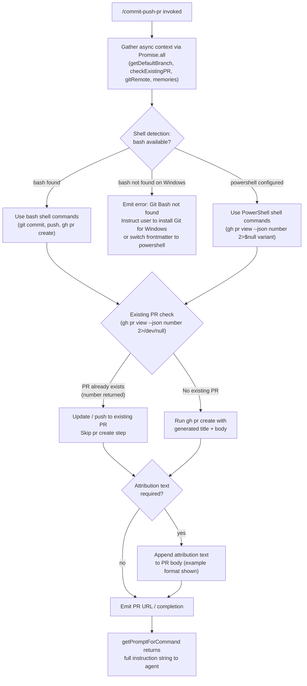

# `/commit-push-pr`

> Analysis basis: CC v2.1.149 bundle.js (AST extraction + Claude interpretation)
> Minimum version: v2.1.149

---

## Overview

`/commit-push-pr` is a `prompt`-type slash command that instructs the Claude agent to commit staged changes, push the branch to a remote, and open a pull request — all in a single workflow. The command generates a context-aware prompt via `getPromptForCommand`, assembles environmental context (default branch, existing PR state, git remote configuration, loaded memories), and then hands execution to the agent loop. It detects the available shell (bash vs. PowerShell) and adapts its shell invocations accordingly.

---

## Registration

| Field | Value |
|---|---|
| type | `prompt` |
| name | `commit-push-pr` |
| description | `Commit, push, and open a PR` |
| loc_byte | `10692702` |
| loc_byte_end | `10693314` |
| loc_line | `8494` |
| handler_method | `getPromptForCommand` |
| handler_method_start | `10692906` |
| handler_method_end | `10693313` |
| prompt_body.length | `203` |
| prompt_body.trace | `call→__H(...) (1 literals)` |
| arbor_handler.name | `getPromptForCommand` |
| arbor_handler.fqn | `claude-2.1.149::getPromptForCommand` |
| arbor_handler.kind | `Method` |
| arbor_handler.resolution_path | `direct` |
| arbor_handler.n_hits | `3` |

Analysis basis: CC v2.1.149 bundle.js:+10692702

---

## Input Branching

The handler exhibits four or more distinct execution paths depending on shell availability, existing PR state, remote configuration, and memory context. A Mermaid flowchart is used.



Analysis basis: CC v2.1.149 bundle.js:+10692906, +10689779, +10689826, +10692952, +10692965, +10692970, +10692993

---

## Behavioral Spec

### 1. Context Assembly

Before building the prompt string, the handler fires `Promise.all` across several async helpers simultaneously.

```
async function assembleContext(appState):
    results = await Promise.all([
        getDefaultBranch(),          // resolves via git symbolic-ref --short refs/remotes/origin/HEAD
        checkExistingPullRequest(),  // runs: gh pr view --json number 2>/dev/null || true
        getGitRemoteInfo(),          // reads remote config to determine push target
        loadMemories(appState)       // loads "memory"/"memories" keys from app state
    ])
    return results
```

Analysis basis: CC v2.1.149 bundle.js:+10692952, +10692965, +10692970, +10692993

#### Default Branch Resolution

The helper (`kv` → `nd8` → `h9H.get`) reads the `defaultBranch` key from a key-value store, then falls back to running:

```
git symbolic-ref --short refs/remotes/origin/HEAD
```

If that fails, it probes:

```
git show-ref --verify --quiet refs/remotes/origin/main
git show-ref --verify --quiet refs/remotes/origin/master
```

and returns `"main"` or `"master"` accordingly.

Analysis basis: CC v2.1.149 bundle.js:+1058319 (`defaultBranch`), +1069089 (`symbolic-ref`), +1069104 (`--short`), +1069114 (`refs/remotes/origin/HEAD`), +1069227 (`main`), +1069234 (`master`), +1069296 (`show-ref`), +1069307 (`--verify`), +1069318 (`--quiet`)

#### Existing PR Detection

Two shell variants are tried depending on detected shell:

- **bash**: `gh pr view --json number 2>/dev/null || true` (Analysis basis: CC v2.1.149 bundle.js:+10689779)
- **powershell**: `gh pr view --json number 2>$null; if (-not $?) { "" }` (Analysis basis: CC v2.1.149 bundle.js:+10689826)

If a number is returned, the agent is directed to push without creating a new PR; otherwise it proceeds to `gh pr create`.

#### Git Remote Check

The remote configuration helper (`zw1` → `PCH`) reads `remote` configuration to confirm the push target exists before instructing a push.

Analysis basis: CC v2.1.149 bundle.js:+10232572, +10232580

---

### 2. Shell Detection and Dispatch (`__H`)

The function resolved as `__H` (called at `+10693103`) constructs and executes shell commands. It checks the configured shell type and branches:

```
function buildShellInstructions(context, shellType):
    if shellType == "bash":
        return buildBashInstructions(context)
    elif shellType == "powershell":
        return buildPowerShellInstructions(context)
    else:
        raise Error("Shell not supported")

function buildBashInstructions(context):
    // Constructs git commit + push + gh pr create steps
    // Includes backtick-escaped negation check (!`)
    instructions = [
        "git add -A",
        "git commit -m <generated message>",
        "git push",
        conditionally("gh pr create --title ... --body ...")
    ]
    return instructions

function buildPowerShellInstructions(context):
    // Same logical steps adapted for PowerShell syntax
    // Uses 2>$null instead of 2>/dev/null
    ...
```

Analysis basis: CC v2.1.149 bundle.js:+9784586 (`bash`), +9784832 (`powershell`), +9784902 (`!``), +9784595, +9784606, +9784846

---

### 3. Prompt Construction (`getPromptForCommand` / `bW1` → `xW1`)

The `getPromptForCommand` method (Arbor-resolved, `direct`, 3 hits) delegates to a helper chain (`bW1` → `xW1`) that assembles the final prompt string.

```
function buildFinalPrompt(context, existingPR, defaultBranch, memories, shellInstructions):
    parts = []

    // Preamble: task description
    parts.append(describeTask(defaultBranch))

    // Memory injection
    if memories is not empty:
        parts.append(formatMemories(memories))   // keys: "memory", "memories"

    // Shell instructions block
    parts.append(shellInstructions)

    // Attribution clause (conditional)
    if attributionRequired(context):
        parts.append(attributionSuffix)          // ", ending with the attribution text shown in the example below"

    // PR attribution fallback log
    if noAttributionData:
        log("PR Attribution: returning default (no data)")

    return join(parts)
```

The `xW1` helper performs a `.replace()` pass on the assembled string (Analysis basis: CC v2.1.149 bundle.js:+10692309) to substitute template variables before returning.

Analysis basis: CC v2.1.149 bundle.js:+10688897, +10688912, +10689774, +10690962 (`, ending with the attribution text`), +10233353 (`PR Attribution: returning default (no data)`), +10233428 (`memory`), +10233437 (`memories`)

---

### 4. Permission and Tool Execution Layer (`_W` → `xaH` → `mSL`)

Once the prompt is handed to the agent loop, tool calls (Bash commands) pass through the standard permission pipeline:

```
function permissionCheck(toolCall, appState):
    decision = checkPermissions(toolCall)
    
    if decision == "deny":
        return DeniedResult("Permission denied")
    elif decision == "ask":
        if headlessMode:
            abort("Action requires interactive approval and permission prompts are not available in this context")
        else:
            promptUser()
    elif decision == "allow" or "passthrough":
        executeToolCall(toolCall)
    elif decision == "bypassPermissions":
        executeToolCall(toolCall)  // skip checks
    
    // Plan-mode floor enforcement
    if planModeFloor and decision below floor:
        escalate()
```

Dangerous operations (`rm`, `rmdir`) are detected and flagged separately.

Analysis basis: CC v2.1.149 bundle.js:+10310740 (`deny`), +10310768 (`rule`), +10310971 (`ask`), +10311049 (`passthrough`), +10311530 (`bypassPermissions`), +10311560 (`plan`), +10311673 (`Dangerous rm operation`), +10311720 (`Dangerous rmdir operation`), +10314583 (`Action requires interactive approval...`), +9785266 (`Permission denied`)

---

### 5. Bash Tool Result Handling (`__H` → `HcH` → `wqq`)

Results from bash tool calls are processed and persisted:

```
function processToolResult(toolResult):
    mapped = mapToolResultToToolResultBlockParam(toolResult)
    
    if resultIsEmpty(mapped):
        emitTelemetry("tengu_tool_empty_result")
    
    validated = validateResultContent(mapped)   // checks text-only constraint
    
    if containsNonTextContent(validated):
        raise Error("Cannot persist tool results containing non-text content")
    
    persistResult(validated)
    emitTelemetry("tengu_tool_result_persisted")
    
    return validated
```

Analysis basis: CC v2.1.149 bundle.js:+4893832, +4893895, +4893167 (`Cannot persist tool results containing non-text content`)

---

### 6. Windows / Shell Error Path

When `bash` is specified in the skill frontmatter but Git Bash is not found on Windows, the prompt body (203 chars, extracted from `__H` at `+10693103`) instructs the user:

> "Skill … requires bash (`shell: bash` in frontmatter) but Git Bash was not found. Install Git for Windows (https://git-scm.com/downloads/win), or change the skill's frontmatter to `shell: powershell`."

This is the sole literal that composes the `prompt_body` at length 203.

Analysis basis: CC v2.1.149 bundle.js:+10692906 (handler start), `prompt_body.length = 203`, `prompt_body.trace = call→__H(...) (1 literals)`

---

## State & Side Effects

| Item | Detail |
|---|---|
| Telemetry: `tengu_bg_spare_enable` | Fired when background spare PTY is enabled (bundle.js:+15260069) |
| Telemetry: `tengu_bg_low_mem_mb` | Fired on low-memory condition during background process management (bundle.js:+12607186) |
| Telemetry: `tengu_bg_spare_spawn` | Fired when a spare background process is spawned (bundle.js:+15260429) |
| Telemetry: `tengu_daemon_config_reload` | Fired on daemon configuration reload (bundle.js:+15275522) |
| Telemetry: `tengu_daemon_control` | Fired on daemon start/stop control events (bundle.js:+15296846) |
| Telemetry: `tengu_cobalt_ridge` | Fired during environment detection / process spawning path (bundle.js:+4786509) |
| Telemetry: `tengu_auto_mode_fallback_to_ask` | Fired when auto-mode permission falls back to interactive ask (bundle.js:+10314704) |
| Telemetry: `tengu_auto_mode_decision` | Fired on each auto-mode classifier decision (bundle.js:+10315412) |
| Telemetry: `tengu_bash_allowlist_strip_all` | Fired when the full bash allowlist is stripped (bundle.js:+10316682) |
| Telemetry: `tengu_iron_gate_closed` | Fired when classifier is unavailable and the gate closes (bundle.js:+10319186) |
| Telemetry: `tengu_auto_mode_denial_limit_exceeded` | Fired when too many classifier denials occur in headless mode (bundle.js:+10308898) |
| Telemetry: `tengu_tool_empty_result` | Fired when a tool call returns an empty result (bundle.js:+4894339) |
| Telemetry: `tengu_tool_result_persisted` | Fired when a tool result is successfully persisted (bundle.js:+4894579) |
| `appState` changes | `setAppState` called via `UtH` to update subcommand results, safety-check state, and auto-mode flags (bundle.js:+10308464) |
| `appState` reads | `getAppState` called at handler entry and inside `S_` to read `allowed_tools`, `avoid_prompts`, `effort`, `model` (bundle.js:+10693135, +10589432) |
| Permission context | `q.setToolPermissionContext` called by `xSL` to configure per-tool permission scope (bundle.js:+10307855) |
| Hook registration | `H.on("exit", …)` and `H.on("error", …)` registered via `jGA` on child processes (bundle.js:+1040559, +1040611) |
| Subprocess management | `Bun.spawn` used for PTY/background processes; `M.kill`, `H.kill`, `clearTimeout` used for cleanup (bundle.js:+15240542, +1033803, +1033514) |
| Settings load | `loadSettingsFromDisk` fires `settings_load_started` / `settings_load_completed` events; reads `policySettings` and `flagSettings` (bundle.js:+1215753, +1216430) |
| PR attribution log | Logs `"PR Attribution: returning default (no data)"` when attribution context is absent (bundle.js:+10233353) |
| Literal anchor | `/commit-push-pr` string self-referenced at bundle.js:+10693292 |

---

## Version History

| Version | Change |
|---|---|
| v2.1.149 | Initial analysis; `getPromptForCommand` handler with bash/PowerShell dual-path, PR attribution, and `Promise.all` context assembly confirmed |

---

## Common Mistakes

1. **Running on Windows without Git Bash installed**: The command defaults to `shell: bash`; if Git Bash is absent, the agent emits the 203-character error prompt rather than executing any git commands. Fix: install Git for Windows or set `shell: powershell` in the skill frontmatter.
2. **No git remote configured**: The remote-check step (`PCH` / `remote` literal at `+10232580`) will cause the push step to fail if no upstream remote exists. Ensure `git remote add origin <url>` has been run first.
3. **Invoking in headless/non-interactive mode with unwhitelisted bash tools**: The permission layer will abort with `"Action requires interactive approval and permission prompts are not available in this context"` if any required tool has `ask`-level permission and no TTY is available.
4. **Existing PR not detected**: The `gh` CLI must be authenticated and on `PATH`; if `gh pr view` exits non-zero for reasons other than "no PR", the detection logic may mis-classify the result and attempt to create a duplicate PR.
5. **Attribution text omitted accidentally**: The prompt instructs the agent to end the PR body with a specific attribution example. Manually editing the PR body after the fact may strip this text, which may violate team policy if attribution is required.

---

## Appendix — Identifier Mapping

> For bundle debugging only. Identifiers change across versions.

| Identifier | Role |
|---|---|
| `__handler_commit-push-pr` | Synthetic BFS entry node for the command handler; not a real bundle symbol |
| `kv` | Default-branch resolver — orchestrates key-value store lookup and git fallback |
| `nd8` | Key-value store getter (reads `defaultBranch` from persistent store) |
| `G_` | Git command executor — runs git subprocesses and parses output |
| `lWH` | Low-level child-process spawner with stream piping |
| `SGA` | Process argument assembler for spawned git commands |
| `Sd8` | Stdout stream data collector |
| `Rd8` | Stderr stream data collector |
| `bd8` | Stream line parser / accumulator |
| `U0A` | Numeric validation utility (wraps `Number.isFinite`) |
| `FK6` | Process exit handler — checks buffered data and emits error |
| `hd8` | `Reflect.apply` wrapper for method dispatch on child process objects |
| `jGA` | Event listener registrar — attaches `exit` / `error` handlers to child processes |
| `p0A` | Timeout-race helper — races a promise against `setTimeout` / `Promise.race` |
| `B0A` | Process kill helper — calls `H.kill` and resolves on `finally` |
| `u0A` | Child-process stdout/stderr data handler |
| `m0A` | SIGTERM sender — calls `H.kill` on the spawned process |
| `DGA` | Parallel output collector — awaits `Promise.all` over stream readers |
| `cK6` | Output post-processor / trimmer |
| `zGA` | Pipe setup utility — connects process streams |
| `YGA` | Output aggregator — adds chunks to a collection |
| `d0A` | Stream bind helper — binds `Gd8` to a context |
| `D` | Top-level daemon/session manager |
| `V6` | Module registry / export resolver |
| `$` | Disposable resource tracker |
| `Kv8` | Background spare process refill trigger |
| `kqA` | Background PTY host spawner (`Bun.spawn`, `--bg-pty-host`) |
| `c` | Shared utility / constant holder |
| `Dz` | Platform string resolver |
| `N` | Log-level / debug formatter |
| `K8` | Warning emitter |
| `RH` | Error reporter — calls `ll.logError` and pushes to error list |
| `zaK` | String coercion wrapper |
| `zw1` | PR workflow orchestrator — coordinates remote check, context load, prompt assembly |
| `PCH` | Git remote configuration reader |
| `FY6` | File-system / environment prober |
| `nD` | API environment resolver (local / staging / production URL selector) |
| `d_` | Module initializer / ES-module interop shim |
| `Ly6` | Lazy initializer binder |
| `q` | Promise / cleanup queue |
| `TX_` | Environment-flag selector |
| `iX7` | Staging-flag reader |
| `HA` | Settings loader coordinator |
| `hm` | `loadSettingsFromDisk` wrapper |
| `DC` | Settings deserializer |
| `Tq` | Memory-usage tracker (uses `XMA` / `ZMA` sets) |
| `Wl8` | Full settings-load pipeline (`settings_load_started` → `settings_load_completed`) |
| `rF` | Policy-settings applier |
| `cy6` | Settings-cache invalidator |
| `ThL` | Tool-list builder — maps tool keys to permission entries |
| `A` | Generic iterable / lower-case transformer |
| `M` | Connection / stream manager |
| `vG_` | Context-file aggregator — gathers diff stats, file sizes, generated flags |
| `VDH` | File metadata resolver |
| `S6` | Path normalizer |
| `Y` | Supervisor / MCP server state manager |
| `z` | Daemon stop/start controller |
| `SOq` | File-type classifier (uses extension set `QI7`, `hOq`) |
| `aI7` | Diff-for-new-files fetcher |
| `COq` | `git diff --stat` parser — extracts file-changed counts |
| `L` | Async task queue with add/delete/finally |
| `VhL` | Conversation-history trimmer and compact-boundary detector |
| `VM` | Working-directory path builder |
| `Wh` | Platform path joiner |
| `j_` | Cross-platform path helper |
| `Pm6` | File content reader (buffered, BOM-aware) |
| `ErK` | BOM / encoding detector (`"compact_boundary"`) |
| `NrK` | UTF-8 line reader |
| `IrK` | Binary-safe line reader |
| `krK` | Buffer copy-merge helper |
| `yrK` | Buffer final-chunk assembler |
| `hrK` | Line-ending normalizer |
| `eWH` | Stream-to-message parser (JSON / text) |
| `oaK` | Raw-stream reader |
| `aaK` | SSE / newline-delimited JSON splitter |
| `taK` | JSON-line parser |
| `saK` | Text-line accumulator |
| `K` | String padding / map utility |
| `GhL` | User-message filter (removes sidechain, meta, compactSummary) |
| `WhL` | Message-type checker (text / image / document content blocks) |
| `ZhL` | Assistant-message filter (removes non-tool-use, compact-boundary) |
| `Yg_` | Team-member file detector |
| `Xq` | Model-name normalizer |
| `Yc6` | Model-to-provider mapper |
| `xj` | Model-string transformer (lowercase, replace) |
| `UC8` | Application-inference-profile checker |
| `OP` | Model-string cleaner |
| `Fq` | Prompt-context formatter — assembles system prompt with model info |
| `Wt` | Prompt-section builder |
| `wv` | Token-budget calculator |
| `gAH` | Prompt-template variable substitutor |
| `Xg` | Model capability descriptor (context window, pricing tier) |
| `nq` | Canonical model-name resolver |
| `bW` | Model-alias lookup (`ZqH`) |
| `GqH` | Extended-thinking model detector |
| `cv` | Context-window size resolver |
| `UpH` | Haiku-tier context resolver |
| `GZ` | Sonnet-tier context resolver |
| `D79` | Sonnet-context delegator |
| `Z3` | Provider-type resolver (`firstParty`, `anthropicAws`, `gateway`) |
| `Fl6` | Extended-thinking inclusion checker (`WI4`) |
| `BpH` | `mH` wrapper for model-string normalization |
| `QJ` | Prompt-builder entry for non-streaming path |
| `CW` | Full prompt assembler (combines system sections, model info, tools) |
| `uOq` | Model-string includes-checker |
| `bW1` | PR-prompt assembler — top-level builder for commit-push-pr prompt |
| `lyH` | Commit-message / PR-body generator |
| `K$H` | Model-suffix checker (`endsWith`) + model normalizer (`Xq`) |
| `v8_` | Model-variant resolver (delegates to `K$H`) |
| `xW1` | Template variable replacer — performs `.replace()` on assembled prompt |
| `z4` | App-config reader |
| `__H` | Shell-instruction builder — constructs bash/PowerShell git+gh command sequences |
| `dp` | Environment-specific config resolver |
| `mH` | String coercer (wraps `String`) |
| `t1` | String type-checker |
| `q18` | String replacer utility |
| `_W` | Tool-call dispatcher — routes to `xaH` |
| `xaH` | Bash-tool execution engine — permission check, run, result persist |
| `mSL` | Permission-decision engine — `deny`/`ask`/`allow`/`passthrough` |
| `S_` | App-state getter (reads `allowed_tools`, `avoid_prompts`, `effort`, `model`) |
| `DE6` | Decision enricher |
| `UtH` | App-state setter (`Object.assign` + `setAppState`) |
| `$j1` | Subcommand result recorder |
| `Wc` | Recursive safety-check walker |
| `QW8` | Permission-result cache |
| `Kj1` | Auto-mode decision recorder |
| `rq` | Permission-context classifier (`mcp__` prefix detector) |
| `FW8` | Fast-path error handler |
| `Am` | Accept-edits flag checker |
| `Ih` | High-risk operation inspector |
| `ZE_` | Allowlist stripper |
| `Vdq` | Pending-tool-call tracker (add) |
| `Bj6` | Auto-mode classifier caller |
| `HjH` | Pending-tool-call tracker (delete) |
| `Ul6` | Tool-use result formatter (`q$H`) |
| `o_6` | Input-token counter |
| `Vw` | Output-token counter |
| `a_6` | Cache-read-input-token counter |
| `s_6` | Cache-creation-input-token counter |
| `Ck` | Session-registry updater |
| `zj1` | Classifier-unavailable handler (iron gate) |
| `iw1` | Fail-open classifier fallback |
| `uSL` | Denial-limit enforcer |
| `Oj1` | Permission-prompts-unavailable guard |
| `xSL` | Hook-based permission rewriter |
| `fj1` | Headless permission-unavailable guard |
| `EX` | Stop-sequence / message-limit checker |
| `nj1` | Agent-loop termination handler |
| `f` | Tool-registry accessor |
| `HcH` | Tool-result mapper and persister |
| `wqq` | Result content validator and formatter |
| `yW7` | Text-block checker |
| `Xqq` | Array-content type checker |
| `Pqq` | Result reducer |
| `NYH` | Non-text content detector and error generator |
| `kYH` | Result-size estimator |
| `IYH` | Result-join helper |
| `Yqq` | Token-count calculator (`Number.isFinite`, `Math.min`) |
| `U31` | Prompt-part trimmer and joiner |
| `AVL` | Final prompt assembler (calls `U31`, `EH`) |
| `EH` | String coercer for prompt output |

---

Note: index built via Arbor fallback; some signals (telemetry, literals) may be missing — see arbor-fallback.js.