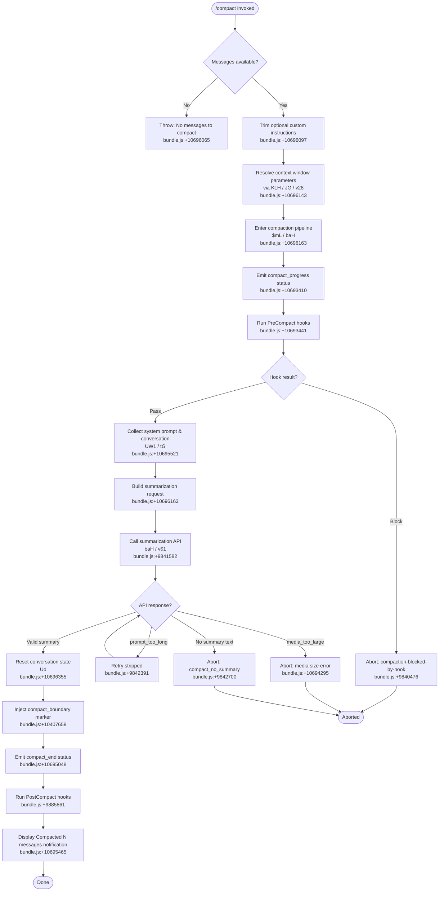

# `/compact`

> Analysis basis: CC v2.1.149 bundle.js (AST extraction + Claude interpretation)
> Minimum version: v2.1.149

---

## Overview

`/compact` frees up context window space by summarizing the current conversation into a compact summary, replacing the full message history. It supports optional custom summarization instructions and can run in both interactive and non-interactive modes. The command drives a multi-phase compaction pipeline: pre-compact hook execution, summary generation via the API, state reset, and post-compact cleanup.

---

## Registration

| Field | Value |
|---|---|
| type | `local` |
| name | `compact` |
| description | `Free up context by summarizing the conversation so far` |
| argumentHint | `<optional custom summarization instructions>` |
| supportsNonInteractive | `true` |
| thinClientDispatch | `post-text` |
| module_id | `BW1` |
| load_inline | `true` |
| loc_byte | `10697028` |
| loc_byte_end | `10697341` |
| loc_line | `8500` |
| arbor_handler.name | `fmL` |
| arbor_handler.fqn | `claude-2.1.149::fmL` |
| arbor_handler.kind | `AsyncFunction` |
| arbor_handler.resolution_path | `module_id` |
| arbor_handler.n_hits | `0` |

Analysis basis: CC v2.1.149 bundle.js:+10697028

---

## Input Branching

The handler has more than 3 distinct execution paths based on message availability, hook outcomes, and API response conditions.



---

## Behavioral Spec

### Handler Entry Point (`fmL`)

The Arbor-resolved handler is `fmL` (AsyncFunction, `claude-2.1.149::fmL`). It is the primary entry point for the `/compact` command.

```
async function compactCommandHandler(context, args):
    customInstructions = args.trim()   // optional user-provided text

    if no messages in conversation:
        throw Error("No messages to compact")
        // Analysis basis: CC v2.1.149 bundle.js:+10696059, +10696065

    contextParams = resolveContextWindowParams(context)
    // calls: contextWindowResolver → modelConfigResolver → tokenBudgetHelper
    // Analysis basis: CC v2.1.149 bundle.js:+10696143

    result = await runCompactionPipeline(context, customInstructions, contextParams)
    // Analysis basis: CC v2.1.149 bundle.js:+10696163

    if result is cancellation:
        display("Compaction canceled.")
        // Analysis basis: CC v2.1.149 bundle.js:+10696635
        return

    update appState with compactMetadata
    // Analysis basis: CC v2.1.149 bundle.js:+10694504

    resetConversationState(context)
    // Analysis basis: CC v2.1.149 bundle.js:+10696355

    displayProgressNotification(context, result)
    // Analysis basis: CC v2.1.149 bundle.js:+10695465
```

Analysis basis: CC v2.1.149 bundle.js:+10696034

---

### Context Window Parameter Resolution (`KLH` → `JG` + `v28`)

Before building the summarization prompt, the handler resolves model token limits and context window configuration.

```
function resolveContextWindowParams(context):
    modelConfig = getModelConfig(context)
    // JG: parses model name, maps to output token limit
    // known token limit constants: 64000, 128000, 32000 (bundle.js:+2919475)
    // known legacy limits: claude-3-opus→4096, claude-3-sonnet→8192 (bundle.js:+2919805)

    tokenBudget = computeTokenBudget(modelConfig)
    // HB_: parses numeric suffixes, handles "auto" mode
    // "auto" literal present at bundle.js:+9894730
    // numeric constants: 1000 (bundle.js:+9894835), 100 (bundle.js:+9894871)

    autoCompactEnabled = getConfigFlag("autoCompactEnabled")
    // literal "autoCompactEnabled" at bundle.js:+9896908

    return {modelConfig, tokenBudget, autoCompactEnabled}
```

Analysis basis: CC v2.1.149 bundle.js:+9887006, +9887024, +9887065

---

### Compaction Pipeline (`$mL`)

The pipeline is the core async body that orchestrates all compaction phases.

```
async function runCompactionPipeline(context, customInstructions, contextParams):
    startTime = performance.now()
    // Analysis basis: CC v2.1.149 bundle.js:+10693547

    emitStatus({type: "compact_progress"})
    // literal "compact_progress" at bundle.js:+10693410

    emitStatus({type: "hooks_start"})
    // literal "hooks_start" at bundle.js:+10693441

    emitStatus({type: "pre_compact"})
    // literal "pre_compact" at bundle.js:+10693464

    hookResult = await runPreCompactHooks(context)
    // hookType "PreCompact" at bundle.js:+12866445
    if hookResult.blocked:
        record("compaction-blocked-by-hook")
        return cancellation
        // Analysis basis: CC v2.1.149 bundle.js:+9840476

    emitStatus({type: "sdk_status", value: "compacting"})
    // literals at bundle.js:+10693506, +10693526

    [systemPrompt, conversationContext] = await Promise.all([
        collectSystemPrompt(context),       // $u
        collectConversationContext(context), // tG / UW1
    ])
    // Analysis basis: CC v2.1.149 bundle.js:+10693596, +10695521

    conversationSummary = await generateSummary(
        context, systemPrompt, conversationContext,
        customInstructions, contextParams
    )
    // Analysis basis: CC v2.1.149 bundle.js:+10694557 (Uo reset pathway), +10696186 (baH)

    if summary generation failed:
        // classify failure reason:
        //   "prompt_too_long"   → bundle.js:+10694172
        //   "media_too_large"   → bundle.js:+10694295
        //   default             → bundle.js:+10694420
        return failure

    resetToCompactedState(context, conversationSummary)
    // Uo: clears caches, resets autonomous loop, clears timers
    // Analysis basis: CC v2.1.149 bundle.js:+10694557

    updateAppStateCompactMetadata(context)
    // "compactMetadata" at bundle.js:+10694504
    // Analysis basis: CC v2.1.149 bundle.js:+10694504

    emitStatus({type: "notification"})
    // literal "notification" at bundle.js:+10693729

    emitStatus({type: "stream_mode", value: "requesting"})
    // literals at bundle.js:+10693824, +10693843

    emitStatus({type: "compact_start"})
    // literal "compact_start" at bundle.js:+10693968

    duration = performance.now() - startTime
    emitTelemetry("tengu_compact", {duration, ...})
    // Analysis basis: CC v2.1.149 bundle.js:+9844342

    emitStatus({type: "compact_end"})
    // literal "compact_end" at bundle.js:+10695048

    return success
```

Analysis basis: CC v2.1.149 bundle.js:+10693547

---

### Summary Generation (`baH` / `v$1`)

This sub-function drives the actual API call to produce the condensed summary.

```
async function generateSummary(context, systemPrompt, conversationContext, customInstructions, contextParams):
    startTime = performance.now()
    // Analysis basis: CC v2.1.149 bundle.js:+9841159

    triggerType = determineTriggerType()
    // "compact_auto" (bundle.js:+9841119) or "compact_manual" (bundle.js:+9841134)
    // based on whether invoked by user or auto-compact threshold

    emitOtelSpan("claude_code.compaction", {type: triggerType})
    // literal at bundle.js:+9841183

    preparedMessages = buildSummarizationMessageSet(conversationContext)
    // uses compact_boundary marker for message grouping
    // "compact_boundary" literal at bundle.js:+10407658

    if preparedMessages is empty:
        record("compact_not_enough_messages")
        // Analysis basis: CC v2.1.149 bundle.js:+9841321
        return failure("not_enough_messages")

    // Summarization uses a dedicated "helpful AI assistant tasked with summarizing conversations" system prompt
    // literal at bundle.js:+9854188

    response = await callSummarizationAPI(preparedMessages, contextParams)
    // v$1: core async loop with tool-use blocking during compaction
    //   tool use is denied during compaction: "Tool use is not allowed during compaction"
    //   literal at bundle.js:+9851869

    if response has no text:
        record("compact_no_summary")
        // literal "Failed to generate conversation summary - response did not contain valid text content"
        // at bundle.js:+9842799
        return failure("no_summary")

    if response triggered prompt_too_long:
        record("compact_prompt_too_long")
        // Analysis basis: CC v2.1.149 bundle.js:+9842391
        retry with stripped media

    summaryText = extractSummaryText(response)
    // wraps in <summary> tag: literal at bundle.js:+9822208

    return {summaryText, metadata}
```

Analysis basis: CC v2.1.149 bundle.js:+9841159, +9841582

---

### Conversation State Reset (`Uo`)

After a successful summary is generated, the prior conversation state is cleared and replaced.

```
function resetToCompactedState(context, summary):
    clearPrecomputedCompactCache()
    // W28 / k$1: deletes entries from Ju map, bU_ map
    // Analysis basis: CC v2.1.149 bundle.js:+9885855

    clearToolResultCaches()
    // Z28: nw1.clear  (bundle.js:+10290421)
    // o0q: bj6.clear, KE_.clear (bundle.js:+6514987)
    // Analysis basis: CC v2.1.149 bundle.js:+9885929, +9885935

    clearAutoModeDeliveryTracker()
    // MvL.resetAutonomousLoopDelivered (bundle.js:+9885967)

    resetBackgroundDispatchState()
    // Vw: iterates Object.values (bundle.js:+9886017)

    injectSummaryAsSingleMessage(context, summary)
    // replaces full history with one synthetic assistant message containing summary

    emitStatus("post_compact_cleanup")
    // literal "post_compact_cleanup" at bundle.js:+9885861

    updateVT6State()
    // hyH → VT6.setState (bundle.js:+9886824)
```

Analysis basis: CC v2.1.149 bundle.js:+9885845

---

### Compact Boundary Marker Injection (`XO`)

A special message boundary is inserted to track where compaction occurred.

```
function injectCompactBoundaryMarker(messages):
    // Inserts a synthetic message of role "system" with type "compact_boundary"
    // literals: "system" at bundle.js:+10407636
    //           "compact_boundary" at bundle.js:+10407658
    //           index values 1, 0 at bundle.js:+10407712, +10407717

    marker = {role: "system", type: "compact_boundary", ...}
    return [marker, ...sliceOfMessages]
    // H.slice call at bundle.js:+10407811
```

Analysis basis: CC v2.1.149 bundle.js:+10696034

---

### Post-Compact Display (`pW1`)

After state reset, the UI is updated with the compaction summary.

```
function displayPostCompactNotification(context, messageCount):
    registerKeybinding("app:toggleTranscript", "ctrl+o", "Global")
    // literals at bundle.js:+10695326, +10695349, +10695358

    displayDimText("Compacted " + messageCount + " messages")
    // "Compacted " literal at bundle.js:+10695465
    // j6.dim call at bundle.js:+10695458

    record telemetry "compact_end" with success=true
    // literal "compact_end" at bundle.js:+10695048
    // "success" at bundle.js:+10695249
```

Analysis basis: CC v2.1.149 bundle.js:+10694784

---

### Reactive Compaction Sub-path (`gVL`)

The reactive compaction path is triggered automatically when context usage crosses a threshold (≥80%), invoked internally rather than by the user.

```
async function reactiveCompact(context, params):
    emitStatus({type: "progress"})
    // literal "progress" at bundle.js:+9860951

    if fewer than 2 message groups:
        log("Reactive compact: fewer than 2 groups, nothing to compact")
        // literal at bundle.js:+9860999
        record("too_few_groups")
        // Analysis basis: CC v2.1.149 bundle.js:+9861089
        return

    // Minimum groups constant: 3 (bundle.js:+9861236)
    summarizeGroups = selectGroupsForSummarization(groups)
    // N$1: Math.max / Math.floor for group selection

    if no assistant messages in summarize set:
        log("Reactive compact: no assistant messages in summarize set, bailing")
        // literal at bundle.js:+9861561
        record("exhausted")
        return

    result = await callSummarizationWithRetry(summarizeGroups)
    // on media_too_large error: retry stripped
    // "Reactive compact: summarize hit media-size error, retrying stripped"
    // at bundle.js:+9862445

    if success:
        emitTelemetry("tengu_reactive_compact_succeeded")
        // Analysis basis: CC v2.1.149 bundle.js:+9892739

    else:
        emitTelemetry("tengu_reactive_compact_failed")
        // Analysis basis: CC v2.1.149 bundle.js:+9890485

    // threshold constant: 80 (bundle.js:+9890612)
    // "compact_reactive" literal at bundle.js:+9890888
```

Analysis basis: CC v2.1.149 bundle.js:+9858938

---

## State & Side Effects

| Item | Detail |
|---|---|
| Telemetry | `tengu_compact` (bundle.js:+9844342), `tengu_compact_failed` (+9855467), `tengu_compact_ptl_retry` (+9842431), `tengu_reactive_compact_attempt` (+9861722), `tengu_reactive_compact_failed` (+9890485), `tengu_reactive_compact_succeeded` (+9892739), `tengu_precomputed_compact_discarded` (+9869418), `tengu_compact_cache_prefix` (+9841959), `tengu_compact_cache_sharing_success` (+9852746), `tengu_compact_cache_sharing_fallback` (+9853376), `tengu_post_compact_file_restore_success` (+9855949), `tengu_post_compact_file_restore_error` (+9855991) |
| Hook registration | `PreCompact` hook executed before summarization; `PostCompact` hook executed after reset. `PreCompact` can **block** compaction entirely. |
| appState changes | `compactMetadata` field updated on success (bundle.js:+10694504). `VT6.setState` called to reflect compacted state (bundle.js:+9886824). |
| Cache clearing | `nw1.clear` (bundle.js:+10290421), `bj6.clear`, `KE_.clear` (bundle.js:+6514987) — tool result and context caches wiped on compaction. |
| Autonomous loop reset | `MvL.resetAutonomousLoopDelivered` called (bundle.js:+9885967). |
| Keybinding | `app:toggleTranscript` bound to `ctrl+o` / `Global` after compaction (bundle.js:+10695326). |
| Sound | <!-- TODO: not found in depth-2 traversal; needs --depth 4 --> |
| Otel span | `claude_code.compaction` span emitted with trigger type (`compact_auto` or `compact_manual`) (bundle.js:+9841183). |

---

## Version History

| Version | Change |
|---|---|
| v2.1.149 | Initial analysis |

---

## Common Mistakes

1. **Invoking `/compact` with zero messages** — the handler immediately throws `"No messages to compact"` (bundle.js:+10696065). The command requires at least one prior message in the conversation.
2. **Expecting tool use during compaction** — all tool calls are hard-blocked with `"Tool use is not allowed during compaction"` (bundle.js:+9851869). The summarization agent is restricted to text-only output.
3. **Assuming media survives compaction** — images and large attachments may be stripped during prompt-too-long retries. If summarization still fails after stripping, the command aborts with a media size error.
4. **Confusing manual and reactive compaction** — the same underlying pipeline runs both, but reactive compaction (auto-triggered at ≥80% context usage) uses a different entry point (`gVL`) and emits `compact_reactive` telemetry rather than `compact_manual`.
5. **Expecting conversation history after compaction** — state reset via `Uo` clears tool caches, autonomous loop state, and all pre-compacted message entries; only the summary survives.
6. **PreCompact hook blocking silently** — if a `PreCompact` hook returns a block decision, the compaction is cancelled and `"compaction-blocked-by-hook"` is recorded, but no error is surfaced unless the user checks hook output.

---

## Appendix — Identifier Mapping

> For bundle debugging only. Identifiers change across versions.

| Identifier | Role |
|---|---|
| `fmL` | Main handler (`compactCommandHandler`) — Arbor-resolved entry point |
| `XO` | Compact boundary message injector |
| `aW8` | Message array helper used by boundary injector |
| `iP` | Low-level message slice utility |
| `KLH` | Context window parameter resolver |
| `WJH` | Token budget builder |
| `y_` | App-state accessor utility |
| `V6` | Message store / conversation state accessor |
| `we` | Message grouping helper |
| `we6` | Message group cache manager |
| `m6` | Message record constructor |
| `JG` | Model config / token limit resolver |
| `mH` | String coercion utility |
| `bW` | Token count formatter |
| `ZqH` | String trimming / normalization helper |
| `lm` | Model name classifier (Claude 3 / 4 families) |
| `Xq` | Model name pattern matcher |
| `sh` | Provider type resolver (`firstParty`, `anthropicAws`, etc.) |
| `UD` | API base URL resolver |
| `EqH` | Extended model config builder |
| `Hs6` | Token budget numeric parser |
| `dX` | Context window debug helper |
| `v28` | Context window configuration assembler |
| `AT` | Model capability map builder |
| `qL` | Legacy global config accessor |
| `HB_` | Token budget string parser (handles "auto", numeric) |
| `$mL` | Compaction pipeline orchestrator |
| `HV` | Conversation context collector |
| `cvL` | Message normalization pipeline |
| `OYH` | Attachment normalizer |
| `WB_` | Full message serializer for API submission |
| `Oc` | Conversation summary builder |
| `b7` | Message content extractor |
| `S6` | String encoding utility |
| `Zh` | String decode utility |
| `R2` | Role / type classifier for messages |
| `dZ` | Media size error classifier |
| `BV` | Message join formatter |
| `x6` | File path resolver |
| `YW` | Full conversation runner (main agent loop) |
| `Dp` | Policy settings accessor |
| `N` | Message content normalizer |
| `j5H` | Conversation turn builder |
| `te_` | Hook type enumerator |
| `se_` | Third-party hook filter |
| `CH` | JSON serializer wrapper |
| `RH` | Error logger |
| `uH` | Internal message type builder |
| `SWH` | Cursor state builder |
| `JV` | Abort controller / timeout manager |
| `qAH` | Streaming callback wrapper |
| `Hv` | Hook response handler |
| `AN8` | Worktree hook executor |
| `re_` | MCP tool hook executor |
| `MN8` | Hook JSON output parser |
| `H_H` | Hook entry/exit mapper |
| `ie_` | HTTP hook executor |
| `Wo1` | Hook output plain-text fallback handler |
| `aLH` | Async hook state manager |
| `fN8` | Shell/spawn hook executor |
| `CIH` | Hook cleanup helper |
| `UW1` | System prompt + context assembler |
| `tG` | Full system prompt builder (all segments) |
| `YHA` | System prompt string builder |
| `XP8` | Tool availability section builder |
| `HA` | Hardware / memory info provider |
| `LM5` | Code style prompt segment |
| `MM5` | Memory prompt segment |
| `JHA` | Task context prompt segment |
| `FG6` | Focus/goal prompt segment |
| `WM5` | Schedule/routines prompt segment |
| `V$6` | Memory file loader / combined memory prompt builder |
| `NM5` | Environment info (static) segment |
| `vM5` | Environment info (simple) segment |
| `kM5` | Output style segment |
| `yM5` | Language / tone segment |
| `SM5` | Brief mode segment |
| `bM5` | Background-session segment |
| `EM5` | Agent identity segment |
| `D41` | GrowthBook flag segment |
| `wM5` | Tool use guidance segment |
| `jM5` | Verified vs assumed context segment |
| `JM5` | Task context segment (secondary) |
| `XM5` | Scratchpad segment |
| `GM5` | Context management segment |
| `Cx9` | Auto-memory segment builder |
| `AOH` | API provider config builder |
| `S_` | App state snapshot accessor |
| `v08` | State version mapper |
| `$u` | System prompt finalizer |
| `vK` | Session configuration accessor |
| `qD` | System prompt string builder |
| `$28` | Token count estimator |
| `SU_` | Summarization request builder |
| `sU_` | Summarization pipeline runner |
| `HJ` | Cache-safe params accessor |
| `QHH` | Prompt dedup checker |
| `j28` | Core summarization loop |
| `esH` | Message push helper |
| `N$1` | Group index calculator (Math.max/floor) |
| `w` | Background session manager |
| `gVL` | Reactive compact implementation |
| `QVL` | Group index calculator (reactive) |
| `hG` | Message role/size classifier |
| `OD` | App state reader (compaction context) |
| `dw` | Debug/verbose logger |
| `wx` | Path sanitizer (redacts home dir, IP, email) |
| `_8` | Internal message type helper |
| `l$1` | Main summarization state machine |
| `WVH` | Compact result wrapper |
| `YD6` | Token usage extractor |
| `Dd` | Session ID / model info formatter |
| `Tj6` | Output token tracker |
| `AtH` | Brief context builder |
| `a8H` | File read tracking set manager |
| `OvL` | Post-compact file restore handler |
| `PJH` | Compacted context assembler |
| `hU_` | Last-message accessor |
| `Uo` | Conversation state resetter |
| `W28` | Precomputed compact cache invalidator |
| `k$1` | Cache cleanup worker |
| `wD6` | Terminal emitter helper |
| `o8H` | Diagnostic state emitter |
| `CC8` | Compaction progress recorder |
| `gC8` | Bootstrap state helper |
| `Z28` | Tool cache clearer (nw1) |
| `o0q` | Tool result cache clearer (bj6, KE_) |
| `Ndq` | Agent registry reference |
| `ewH` | Event emitter helper |
| `Vw` | Background dispatch state resetter |
| `iU_` | Post-reset cleanup runner |
| `hyH` | App state setter (VT6.setState) |
| `pW1` | Post-compact UI notification displayer |
| `OnH` | Model picker display helper |
| `DU7` | Model variant label builder |
| `HX` | Keybinding registration helper |
| `hYH` | OTEL metrics emitter |
| `f4` | OTEL span emitter |
| `SVH` | OTEL attribute builder |
| `baH` | Summary generation orchestrator |
| `mj6` | Tracing span initializer |
| `N4H` | Span type tag helper |
| `jV` | Trace ID generator |
| `Ly` | Active trace context accessor |
| `L28` | Message text trimmer |
| `T8` | Streaming session factory |
| `v$1` | Summarization agent runner |
| `b51` | Model config fetcher |
| `cX8` | Model registry lookup |
| `C51` | Model display name resolver |
| `tW` | Agent turn executor |
| `iJ8` | App state updater during turn |
| `My` | Random bytes generator |
| `l8H` | Brief-mode context loader |
| `fu` | Post-turn cleanup runner |
| `jE6` | SSE event type checker |
| `D` | Background session state |
| `XxL` | Fork agent context builder |
| `RU_` | Min token helper |
| `ALH` | Token limit resolver |
| `_OH` | Max token lookup for model |
| `gHH` | Integer token parser |
| `NE` | Last message finder |
| `K28` | Summary marker locator |
| `q28` | findLast summary message |
| `t8` | Message type string helper |
| `I` | Away-summary eligibility checker |
| `pVL` | Compact response validator |
| `Pl` | Error display helper |
| `PT6` | Tool filtering / compaction agent tool handler |
| `uvH` | Model name lowercase matcher |
| `zyH` | Tool use presence checker |
| `YB_` | Message content text extractor |
| `mvL` | Tool search mode decision |
| `yU_` | Message content mapper |
| `xVL` | Content array checker |
| `uVL` | Message content filter |
| `mVL` | Message content normalizer |
| `kU_` | Recursive content reducer |
| `G$1` | Char code / surrogate helper |
| `TsH` | Summarization agent bootstrapper |
| `jB_` | Message preparation helper |
| `wa1` | Full agent query loop |
| `_T` | Message turn processor |
| `KRL` | Tool result grouper |
| `lg_` | Tool listing formatter |
| `zRL` | Media-removal marker |
| `ORL` | Tool input normalizer |
| `YRL` | Tool result presence checker |
| `h` | Away-summary focus tracker |
| `nW8` | Deferred tool availability checker |
| `z` | Background session reference |
| `VRL` | Random UUID generator for turns |
| `iW8` | Tool use block builder |
| `LR` | Response length classifier |
| `ag_` | Agent type tagger |
| `LRL` | Tool reference presence checker |
| `MRL` | Tool use some-check |
| `ZRL` | MCP tool name normalizer |
| `G4` | Goal tracker |
| `wRL` | Message filter for compact |
| `AJ1` | Message queue pusher |
| `vRL` | Reference joiner |
| `DRL` | Delta result processor |
| `aW6` | Orphaned thinking filter |
| `bRL` | Trailing thinking block filter |
| `oW6` | Whitespace-only assistant filter |
| `xRL` | Empty assistant content fixer |
| `jRL` | Tool use slice helper |
| `_J1` | Message content reassembler |
| `qJ1` | Tool use push helper |
| `$RL` | Message content every-filter |
| `q` | App state getter |
| `Y` | Daemon supervisor reference |
| `tXH` | Supervisor config renderer |
| `kc1` | Supervisor column formatter |
| `AXK` | Heartbeat emitter |
| `tU` | Array-check utility |
| `E$1` | Context slice calculator |
| `IQH` | Media size error parser |
| `SZH` | Array some-check |
| `QD_` | Content length regex matcher |
| `DN` | String starts-with checker |
| `O28` | Post-compact file reference restorer |
| `UVL` | File set tracker |
| `HH8` | Path prefix checker |
| `P9` | Path normalizer / validator |
| `FVL` | File reference batch processor |
| `CE` | File content builder |
| `_EH` | CLAUDE.md path builder |
| `JP8` | At-mention file reader |
| `msH` | File read handler |
| `vm6` | File type validator |
| `yFH` | Extension-to-type mapper |
| `Q6` | File system stat helper |
| `FM1` | PDF reference handler |
| `kN` | At-mention content formatter |
| `cWH` | Token-per-line estimator |
| `O7` | String index-of wrapper |
| `T9` | UUID generator for file context |
| `_M` | Token round helper |
| `w28` | Local agent task context reader |
| `L3` | Task file path formatter |
| `woH` | Task directory builder |
| `z28` | Plan file reference handler |
| `bE` | Plan content builder |
| `j8` | K8 size estimator |
| `n7H` | Tool search / deferred tool metadata assembler |
| `Zp_` | Deferred tools pool manager |
| `P` | MCP connection pool |
| `L9` | App config reader |
| `jyH` | MCP instructions pool manager |
| `JG_` | Tool group formatter |
| `t1` | String coercion (String()) |
| `D4H` | MCP instruction type builder |
| `bjH` | MCP watch-path tracker |
| `wLH` | Flat-map helper for tool watch-paths |
| `xw6` | Tool filter by name |
| `aK8` | Tool name lowercase matcher |
| `jG_` | Tool group label builder |
| `uI7` | Tool set label formatter |
| `O1` | Memory file loader |
| `MH_` | Memory header builder |
| `LH_` | Memory path formatter |
| `dD` | Memory content reader |
| `JyH` | MCP tool listing assembler |
| `a51` | MCP tool set manager |
| `xU` | Plugin hook loader |
| `K4` | Plugin path resolver |
| `rY` | Plugin policy builder |
| `p8` | Policy settings reader |
| `KEH` | Plugin inclusion filter |
| `MuH` | Plugin hook logger |
| `V8` | Plugin log file writer |
| `cW6` | Full conversation replay builder |
| `qW` | Conversation replay executor |
| `VM` | Message format builder |
| `Wh` | String encode helper |
| `Dv` | Buffer encoder |
| `j_` | Join helper |
| `cW` | Context message builder |
| `Ug` | Context type helper |
| `IY6` | REPL context accessor |
| `JT6` | REPL context formatter |
| `hVL` | Text normalization (replace/match/trim) |
| `ti` | Prompt dedup cache accessor |
| `V$1` | Compaction error classifier/displayer |
| `gS` | LRU cache manager |
| `xJ7` | LRU get/set helper |
| `lvH` | Status setter (H.setStatus) |
| `KB_` | autoCompactEnabled config reader |