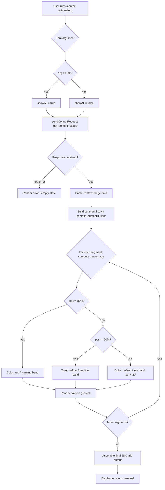

# `/context`

> Analysis basis: CC v2.1.149 bundle.js (AST extraction + Claude interpretation)
> Minimum version: v2.1.149

---

## Overview

`/context` is a local JSX command that visualizes the current conversation's context window utilization as a colored grid. When invoked, it dispatches a `get_context_usage` control request to the running agent, receives token-usage data, and renders a breakdown of context segments (system prompt, tools, memory files, messages, etc.) as a color-coded grid, allowing users to understand at a glance how much of the available context has been consumed and by which categories.

---

## Registration

| Field | Value |
|---|---|
| type | `local-jsx` |
| name | `context` |
| description | `Visualize current context usage as a colored grid` |
| argumentHint | `[all]` |
| thinClientDispatch | `control-request` |
| module_id | `PT1` |
| load_inline | `true` |
| loc_byte | `11096981` |
| loc_byte_end | `11097207` |
| loc_line | `8552` |
| arbor_handler.name | `zFL` |
| arbor_handler.fqn | `claude-2.1.149::zFL` |
| arbor_handler.kind | `AsyncFunction` |
| arbor_handler.resolution_path | `module_id` |
| arbor_handler.n_hits | `0` |

Analysis basis: CC v2.1.149 bundle.js:+11096981

---

## Input Branching

The handler has more than three distinct paths based on (a) whether the argument is `"all"`, (b) whether a `get_context_usage` control response is received, and (c) how the JSX rendering chooses color bands based on percentage thresholds. A Mermaid flowchart is used.



Analysis basis: CC v2.1.149 bundle.js:+11095675 (handler entry `zFL`), +11095706 (`"all"` literal), +11096117 (threshold constant `80`), +208219 (threshold constant `20`), +208228 (`"< 20"` label literal)

---

## Behavioral Spec

### Main Handler — contextCommandHandler (`zFL`)

```
async function contextCommandHandler(args, appState):
    trimmedArg = args.trim()                          // +11095681
    showAll    = resolveShowAllFlag(trimmedArg)       // +11095714  (H$ / Z2H)

    // Dispatch control request to the running agent
    responseEvent = await appState.sendControlRequest(
        "get_context_usage",                          // +11095771
        { showAll }
    )

    // Await the 'data' event from the bridge channel
    rawData = await waitForControlResponse(responseEvent)  // +7595574, +7595569

    // Build a JSX element via contextDisplayBuilder
    jsxElement = buildContextGridJSX(rawData, showAll)     // +11095805

    return jsxElement
```

Analysis basis: CC v2.1.149 bundle.js:+11095675

---

### Argument Resolution — resolveShowAllFlag (`H$` → `Z2H`)

```
function resolveShowAllFlag(trimmedArg):
    if trimmedArg == "all":                    // +11095706
        return true
    return false
```

The string constant `"all"` is the only recognized argument value. Any other text (or no argument) results in `showAll = false`.

Analysis basis: CC v2.1.149 bundle.js:+11095706, +4079300

---

### Context Segment Builder — contextSegmentBuilder (`JZ6`)

```
function contextSegmentBuilder(usageData, showAll):
    segments = []

    // Always-present segments (filtered from usageData)
    freeSpace       = usageData.filter(s => s.label == "Free space")       // +11093814
    autoCompact     = usageData.filter(s => s.label == "Autocompact buffer")// +11093837

    // Settings-source segments (resolved by type label)
    projectSettings = findSegment(usageData, "projectSettings")  // +11094763
    userSettings    = findSegment(usageData, "userSettings")     // +11094803
    localSettings   = findSegment(usageData, "localSettings")    // +11094837
    flagSettings    = findSegment(usageData, "Flag")             // +11094890
    policySettings  = findSegment(usageData, "Policy")           // +11094926
    pluginSettings  = findSegment(usageData, "Plugin")           // +11094956
    builtinSettings = findSegment(usageData, "Built-in")         // +11094988

    // Named display labels matched to data keys
    labelMap = {
        "Project":   projectSettings,   // +11094783
        "User":      userSettings,      // +11094820
        "Local":     localSettings,     // +11094855
        "Plugin":    pluginSettings,    // +11094956
        "Built-in":  builtinSettings    // +11094988
    }

    // Percentage formatting uses en-US locale, "compact" notation
    // with fixed ".0" suffix, capped at 20 columns               // +208219, +208190, +210198, +210216

    for each segment in usageData:
        pct = segment.tokenCount / totalTokens * 100
        color = resolveColor(pct)
        segments.push({ label, pct, color, tokenCount })

    if not showAll:
        segments = segments.filter(s => s.tokenCount > 0)

    return segments
```

Analysis basis: CC v2.1.149 bundle.js:+11093779, +11094097, +11095015

---

### Percentage Formatter — percentageFormatter (`v1` → `wK`)

```
function percentageFormatter(ratio):
    // Uses Intl.NumberFormat with locale "en-US"                // +210198
    // style "compact"                                            // +210216
    // appends ".0" suffix                                        // +208190
    // bucketed label "< 20" when value is below threshold 20    // +208228
    formatted = intlFormat(ratio * 100, { locale: "en-US", style: "compact" }) + ".0"
    return formatted
```

Analysis basis: CC v2.1.149 bundle.js:+208176, +208123

---

### Color Band Resolution — colorBandResolver (`Ws`)

```
function colorBandResolver(pct):
    roundedPct = Math.round(pct)          // +208248
    if roundedPct >= 80:                  // +11096117
        return "red"     // warning color
    if roundedPct >= 20:                  // +208219
        return "yellow"  // medium color
    return "default"     // low / normal  // +208228  ("< 20" label)
```

The threshold value `80` is the sole upper-band constant found in the handler's immediate scope.

Analysis basis: CC v2.1.149 bundle.js:+11096117, +208219, +208248

---

### Compact Boundary Helper — compactBoundaryHelper (`XO` → `aW8`)

```
function compactBoundaryHelper(usageData):
    // Locates the "compact_boundary" segment                     // +10407658
    boundarySegment = findSegmentByKey(usageData, "compact_boundary")
    if boundarySegment:
        return usageData.slice(0, boundarySegment.index)         // +10407811
    return usageData
```

Analysis basis: CC v2.1.149 bundle.js:+11095637, +10407658

---

### Control Request Dispatch — sendControlRequest (`K.sendControlRequest`)

```
async function sendControlRequest(requestType, payload):
    // Formats request with type "control_request"               // +12262830
    // Pads trailing content with "  " (two spaces)              // +15284775
    // Awaits a matching "control_response"                       // +12262720
    correlatedResponse = await bridgeTransport.dispatch(
        { type: "control_request", subtype: requestType, ...payload }
    )
    return correlatedResponse
```

Analysis basis: CC v2.1.149 bundle.js:+11095741, +12262720, +12262830

---

### Context Grid JSX Renderer — contextGridRenderer (`$rH` → `Np`)

```
function contextGridRenderer(segments, showAll):
    cells = segments.map(seg =>
        createElement("cell", {
            color: seg.color,
            label: seg.label,
            pct: seg.formattedPct
        })                                                        // +3750547
    )
    return createElement("grid", { write: true }, ...cells)      // +3750615
```

The `"write"` prop signals the JSX output pipeline to emit directly to the terminal stream.

Analysis basis: CC v2.1.149 bundle.js:+11095801, +3750634, +3750615

---

### Named Segment Categories

The following string labels are used to categorize context segments in the rendered grid (all found in the literals array):

| Label string | Source key | loc_byte |
|---|---|---|
| `"Free space"` | free space remaining | +11093814 |
| `"Autocompact buffer"` | auto-compact reservation | +11093837 |
| `"System prompt"` | system prompt tokens | +9908686 |
| `"System tools"` | built-in tool definitions | +9908765 |
| `"MCP tools"` | MCP tool definitions | +9908829 |
| `"MCP tools (deferred)"` | deferred MCP tools | +9908905 |
| `"System tools (deferred)"` | deferred system tools | +9908991 |
| `"Custom agents"` | custom agent definitions | +9909080 |
| `"Memory files"` | loaded memory files | +9909147 |
| `"Skills"` | loaded skills | +9909209 |
| `"Messages"` | conversation history | +9909709 |
| `"Project"` | project-scoped settings | +11094783 |
| `"User"` | user-scoped settings | +11094820 |
| `"Local"` | local settings | +11094855 |
| `"Flag"` | flag settings | +11094890 |
| `"Policy"` | policy settings | +11094926 |
| `"Plugin"` | plugin settings | +11094956 |
| `"Built-in"` | built-in settings | +11094988 |

Analysis basis: CC v2.1.149 bundle.js:+9908686–+9909735

---

## State & Side Effects

| Item | Detail |
|---|---|
| Telemetry | No `tengu_*` events are fired directly inside `zFL`. Indirectly reachable events from the call graph include: `tengu_marlin_porch` (+3721570), `tengu_pewter_brook` (+3360499), `tengu_amber_creek` (+3360591), `tengu_cobalt_raccoon` (+9886959), `tengu_sparrow_ledger` (+12973711), `tengu_chair_sermon` (+10371635), `tengu_verified_vs_assumed` (+12962531) |
| Bridge dispatch | Emits one `control_request` message of subtype `"get_context_usage"` (+11095771) over the active bridge/REPL transport |
| appState changes | Read-only with respect to appState; no mutations observed in depth-2 traversal |
| Sound | None observed |
| Terminal output | Renders JSX grid directly to terminal via the `"write"` prop pathway (+3750615) |
| Hook registration | `a9` → `W7A.register` (+58272): the fullscreen/display environment detection subsystem registers hooks during initialization but this is not triggered by `/context` itself |

---

## Version History

| Version | Change |
|---|---|
| v2.1.149 | Initial analysis |

---

## Common Mistakes

1. **Passing an unrecognized argument**: Only `"all"` is recognized as an argument (+11095706). Any other string is silently treated as `showAll = false` — zero-count segments will be hidden.
2. **Expecting interactive output in thin-client mode**: The command is dispatched as `thinClientDispatch: "control-request"`. In environments where the bridge transport is not configured, the `get_context_usage` control request will fail silently; the bundle contains the error string `"get_context_usage is not supported in this context (onGetContextUsage callback not registered)"` (+12267816).
3. **Misreading the color bands**: Red indicates ≥ 80 % usage (+11096117), yellow indicates ≥ 20 % (+208219), and the label `"< 20"` (+208228) applies to segments below the lower threshold. The grid does not show absolute token counts by default.
4. **Running `/context` outside an active session**: The command requires a live agent process that can respond to the `get_context_usage` control request. Running it before the agent loop is initialized yields no data.
5. **Confusing `/context` with context-editing commands**: `/context` is read-only visualization. It does not trim, compact, or modify the context window.

---

## Appendix — Identifier Mapping

> For bundle debugging only. Identifiers change across versions.

| Identifier | Role |
|---|---|
| `zFL` | Main async handler for `/context` command (arbor_handler) |
| `Y9` | Display-environment / fullscreen detection helper |
| `WxH` | Terminal capability set membership check |
| `I3_` | Color-support detection (yes/no/on/off resolution) |
| `t1` | Terminal color flag resolver ("no"/"off") |
| `mH` | String identity / passthrough utility |
| `fi` | iTerm2 / tmux control-mode detection |
| `A67` | Terminal type checker (iTerm, screen, tmux prefix) |
| `_67` | Terminal name prefix test (`startsWith`) |
| `N` | Logging / debug output dispatcher |
| `MVK` | Growthbook feature-flag lookup |
| `T7A` | Feature-flag token-class resolver |
| `H$` | "all" argument resolver wrapper |
| `Z2H` | Argument string normalizer |
| `K` | Bridge/transport object (has `sendControlRequest`, `map`, `padEnd`) |
| `L` | Promise/task set helper |
| `M` | Promise finalizer / closer |
| `$rH` | Control-response stream listener builder |
| `Np` | JSX context grid component assembler |
| `Xz_` | React/Ink `createElement` wrapper |
| `_KH` | Context display component renderer |
| `NgH` | Context grid sub-component (uses `Y9`, `V6`, `fi`, `mH`) |
| `JZ6` | Context segment list builder (main display logic) |
| `v1` | Token percentage formatter (Intl.NumberFormat) |
| `wK` | NumberFormat options builder (`DVK`) |
| `DVK` | NumberFormat locale/style constants object |
| `XuH` | Segment color class resolver |
| `Ws` | Column-width / rounding helper |
| `EH` | String coercion / display formatter |
| `OFL` | Compact-boundary slice helper wrapper |
| `XO` | Compact-boundary segment locator |
| `aW8` | Segment key finder (`iP` dependency) |
| `iP` | Generic segment search primitive |
| `k28` | System-prompt assembly orchestrator (large async function) |
| `sT` | Model/provider resolver |
| `Wt` | Model feature flag dispatcher |
| `wv` | Model display-name lookup |
| `gAH` | Model capability flag reader |
| `Xg` | Model name normalizer (strips prefixes, handles anthropic. prefix) |
| `GZ` | Provider / routing resolver |
| `Z3` | First-party API type check |
| `cf` | Provider-class multi-resolver (bedrock, vertex, gateway, etc.) |
| `cv` | Provider fallback chain |
| `AT` | Context assembly top-level helper |
| `qL` | Settings/auto-compact lookup |
| `Nm` | Tool-set registry tracker |
| `p8` | Telemetry reporter for prompt assembly |
| `zc` | Auto-compact window resolver |
| `Xq` | Model token-limit table lookup |
| `xj` | Model name fuzzy-matcher (toLowerCase, includes, replace) |
| `JG` | Token window numeric parser |
| `bW` | Token limit baseline resolver |
| `lm` | Token window clamp helper |
| `EqH` | Token window upper-bound enforcer |
| `Hs6` | Context window finalizer (parseInt, isFinite) |
| `gHH` | Env-var token limit parser |
| `v28` | Auto-compact config builder |
| `HB_` | Token size unit parser (auto/k/M, parseFloat, Math.round) |
| `tG` | Full system-prompt builder (main large async function) |
| `YHA` | Model display name formatter |
| `x6` | AsyncLocalStorage context getter |
| `Mm6` | Store getter wrapper |
| `j_` | Logger / tracer primitive |
| `XP8` | Tool list serializer for system prompt |
| `bV` | Background/session context flag |
| `LM5` | Memory file prompt section builder |
| `If_` | Memory file existence checker |
| `Nf_` | Memory style guide injector |
| `MM5` | Auto-memory section builder |
| `JHA` | CLAUDE.md / memory file reader |
| `xM5` | Memory file processor |
| `FG6` | Feature-gate context segment injector |
| `fM5` | Feature gate wrapper for FG6 |
| `WM5` | Tool-list context section builder |
| `wF` | Feature-flag "worktree" gate |
| `wX` | SDK-type string resolver |
| `PM5` | Tool permission section builder |
| `f0_` | Tool permission formatter |
| `GE` | Tool enabled/disabled state check |
| `LL` | Tool list flattener |
| `cLH` | Session-guidance section builder |
| `AB` | Tool content array flattener |
| `V$6` | Memory-directory prompt builder |
| `M4` | Directory existence / stat helper |
| `m1H` | Memory dir creator |
| `en` | File-type checker (isFile, isDirectory) |
| `bH` | Directory read helper |
| `nY` | Team-memory path resolver |
| `Vx9` | Memory listing formatter |
| `Zx9` | Memory content reader |
| `Ex9` | Auto-memory content reader |
| `pf_` | Memory section finalizer |
| `c` | Generic async utility / error wrapper |
| `OM5` | Growthbook experiment section builder |
| `NM5` | Environment info section builder |
| `Gz` | Model display-name formatter (for env section) |
| `DHA` | Shell/OS info formatter |
| `vM5` | Static environment info builder |
| `jHA` | OS version/type reader |
| `yf` | Working directory resolver |
| `wHA` | Git worktree detector |
| `zM5` | Language instruction section builder |
| `YM5` | Output style section builder |
| `kM5` | Worktree session context builder |
| `wS_` | Worktree type classifier |
| `yM5` | Scratchpad section builder |
| `AAH` | Feature-gate scratchpad injector |
| `KPH` | Scratchpad path formatter |
| `SM5` | Brief-mode section builder |
| `bM5` | Focus/context management section builder |
| `EM5` | Growthbook section tag builder |
| `D41` | MCP server tool-schema fetcher |
| `WMH` | MCP server schema waiter |
| `RC8` | MCP schema cache |
| `TM5` | Reproduce/verify workflow section |
| `DM5` | Task reminder section |
| `wM5` | Context-efficiency section builder |
| `$M5` | Context efficiency constants |
| `jM5` | Verified-vs-assumed section builder |
| `JM5` | Plan-mode section builder |
| `XM5` | Tool-use section builder |
| `cW` | Tool-use hint formatter (cli/remote) |
| `GM5` | Agent memory section builder |
| `Cx9` | Memory write-back section builder |
| `Rx9` | Memory write-back formatter |
| `AOH` | Misc section appender |
| `vZ` | Miscellaneous prompt fragment builder |
| `w5` | String concat utility |
| `RA` | Markdown heading builder |
| `$u` | Agent system-prompt getter |
| `vK` | System-prompt validator |
| `qD` | System-prompt pre-processor |
| `PvL` | Tool input schema / context token counter |
| `XvL` | Token count response parser |
| `h28` | Sub-agent system-prompt builder |
| `IM5` | Sub-agent env info builder |
| `bx9` | Sub-agent memory builder |
| `bo1` | Sub-agent prompt section parser |
| `ztH` | Context usage token counter (per-segment) |
| `RyH` | Token counting API caller |
| `RH` | Error logger for token counting |
| `s$1` | Token count response to segment mapper |
| `WvL` | Tool-token counter |
| `jD6` | Tool list filter (by type) |
| `GvL` | MCP server token aggregator |
| `f` | MCP server manager / session state |
| `UyH` | MCP server connection and tool loader |
| `QDK` | MCP update applier |
| `$` | MCP state accessor |
| `nv5` | MCP server tool reconciler |
| `GJH` | Token count batch runner |
| `S28` | Per-tool schema token counter |
| `z` | Daemon/background-session controller |
| `uH` | Async error boundary |
| `Rk` | Segment push helper |
| `pu` | Daemon shutdown runner |
| `T` | Daemon state tracker |
| `X` | IPC/socket connection handler |
| `J` | Buffer queue for IPC |
| `w` | Background session process manager |
| `zM` | IPC write helper |
| `zk5` | Full IPC message dispatch handler |
| `ZvL` | Memory file token counter |
| `_M` | Math.round wrapper |
| `O` | Background session list |
| `k8` | Background session record |
| `D` | Daemon session lifecycle manager |
| `Kv8` | macOS memory monitor |
| `kqA` | Spare background session spawner |
| `Dz` | Daemon dispose helper |
| `K8` | Logging helper |
| `VvL` | Skill / agent token counter |
| `TvL` | Custom agent token counter |
| `J0_` | Custom agent config loader |
| `K6H` | Agent type filter |
| `a$1` | Agent config normalizer |
| `JK` | Config cache lookup |
| `kvL` | Context usage segment assembler (main token→segment map) |
| `vvL` | System-prompt segment formatter |
| `NvL` | Tool segment formatter |
| `IvL` | MCP segment formatter |
| `_T` | Message history token counter / normalizer |
| `KRL` | Message content block reducer |
| `lg_` | Message type classifier |
| `zRL` | Document block normalizer |
| `ORL` | Content block type router |
| `YRL` | Assistant message validator |
| `h` | Focus/blur debouncer |
| `nW8` | Tool-result filter |
| `VRL` | UUID generator wrapper |
| `T8` | Message ID assigner |
| `P0` | Message normalizer |
| `vu_` | Thinking block handler |
| `iW8` | Tool-result injector |
| `LR` | Standard token window context builder |
| `ag_` | Array content normalizer |
| `LRL` | Local-command content normalizer |
| `Z` | Message set tracker |
| `V` | Message version tracker |
| `MRL` | Thinking block presence checker |
| `ZRL` | MCP tool name resolver |
| `G4` | Generic object getter |
| `GJ1` | Message structure validator |
| `wRL` | Message sequence repairer |
| `AJ1` | Message sequence appender |
| `WB_` | Full message normalization pipeline |
| `vRL` | Tool-result text extractor |
| `G` | Keyboard/input event handler |
| `DRL` | Deferred message processor |
| `aW6` | Orphaned thinking-block filter |
| `bRL` | Trailing thinking-block filter |
| `oW6` | Whitespace-only assistant message filter |
| `xRL` | Empty assistant content fixer |
| `jRL` | Tool-use message merger |
| `_J1` | Message deduplicator |
| `qJ1` | Tool-result injector (inline) |
| `$RL` | Message slice validator |
| `EvL` | System-prompt + message combined token counter |
| `X0_` | Environment detection gate for EvL |
| `LG` | Prompt text normalizer |
| `nq` | Prompt text tokenization helper |
| `YT6` | Token-usage display formatter |
| `jU_` | Token label generator |
| `c_` | Error string builder |
| `e8H` | Token window compaction boundary finder |
| `ALH` | Token window capacity resolver |
| `_OH` | Token window overflow handler |
| `HH` | Segment accumulator array |
| `Q` | Timer / file-watch scheduler |
| `WZ6` | Settings file reader |
| `LE1` | Settings file unlinker |
| `r` | Async task runner |
| `d` | Daemon connect helper |
| `oq8` | Permission-set checker |
| `QHH` | Permission-set membership test |
| `KLH` | Context window size finalizer |
| `WJH` | Context window size clamp |
| `lH` | Bridge REPL v2 connection manager |
| `AH` | MCP connection handler (setOnConnect) |
| `qH` | MCP pending-request tracker |
| `z8` | MCP debug logger |
| `uT6` | MCP elicitation form renderer |
| `gjK` | MCP title extractor |
| `mT6` | MCP elicitation response processor |
| `Qd` | MCP notification handler |
| `y` | IPC write stream |
| `S6` | Logger/tracer with `Dv` |
| `V8` | Append-file logger |
| `waK` | Log path builder |
| `g` | Active-plugin filter |
| `v6` | Plugin state tracker |
| `VH` | Plugin orphan-permission tracker |
| `L6` | MCP server config reconciler |
| `j6H` | MCP server entry builder |
| `pH` | MCP server tool-list updater |
| `MH` | MCP server session manager |
| `cH` | Plugin + working-directory context builder |
| `dXH` | Plugin state refresher |
| `XSH` | MCP server filter for plugins |
| `a2` | Staged MCP update builder |
| `WH` | Voice/input session manager |
| `TF1` | Bridge inbound message processor |
| `AV8` | Bridge message type validator |
| `g6` | JSON parser wrapper |
| `G_5` | Bridge init handler |
| `T_5` | Bridge set_model handler |
| `W_5` | Bridge set_max_thinking_tokens handler |
| `BH` | Token-count write batcher |
| `m` | TTY write-rate limiter |
| `SH` | Message writer (writeMessages) |
| `EF1` | Full bridge message dispatcher |
| `Y` | MCP server lifecycle manager (stop/start/updateConfig) |
| `j` | Background process killer |
| `I` | Away-summary generator |
| `o6` | Plugin/server routing parser |
| `U9` | Plugin route prefix matcher |
| `DK` | Server route prefix matcher |
| `C9` | Channel/route accumulator |
| `nA` | Task routing table |
| `QA` | CLI fatal error printer |
| `wH` | Conversation message list |
| `GH` | Context grid color helper (`V6`) |
| `f6` | Plugin install/MCP reconcile runner |
| `MuH` | Log timestamp helper |
| `FL8` | Plugin file-lock helper |
| `RjK` | Headless plugin install orchestrator |
| `ep` | Plugin base path resolver |
| `NP8` | Marketplace tool reconciler |
| `$JH` | VP8 cache clearer |
| `ZE` | Plugin zip-cache validator |
| `Efq` | Plugin zip-cache error formatter |
| `Zfq` | Plugin zip-install error formatter |
| `wu` | Installed-plugin registry builder |
| `py8` | Plugin install/update executor |
| `Nfq` | Plugin install no-marketplace logger |
| `hjK` | Plugin diff reporter |
| `hN8` | Plugin project-scope installer |
| `VI` | Plugin MCP reconcile time formatter |
| `gH` | Context usage cache map (get/set/entries) |

---

Note: index built via Arbor fallback; some signals (telemetry, literals) may be missing — see arbor-fallback.js.