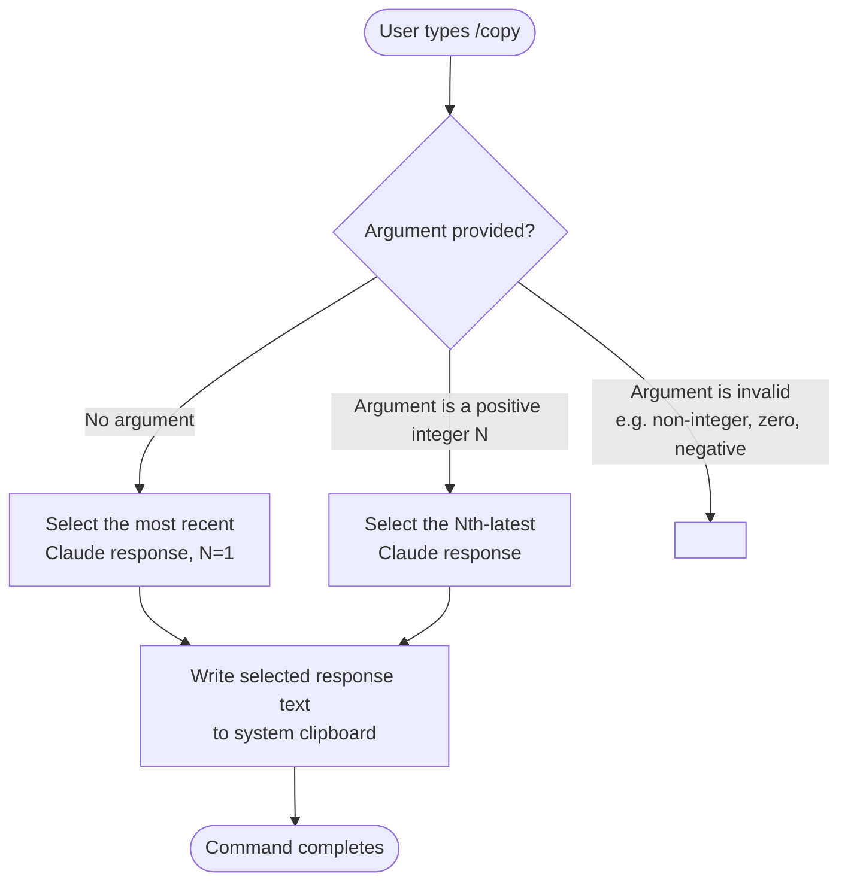

# `/copy`

> Analysis basis: CC v2.1.144 bundle.js (AST extraction + Claude interpretation)
> Minimum version: v2.1.144

---

## Overview

The `/copy` slash command writes Claude's most recent response text to the system clipboard. An optional numeric argument `N` selects the Nth-latest response instead of the default last one, enabling retrieval of earlier turns without manual selection.

---

## Registration

| Field | Value |
|---|---|
| type | `local-jsx` |
| name | `copy` |
| description | `Copy Claude's last response to clipboard (or /copy N for the Nth-latest)` |
| module_id | `NLq` |

Analysis basis: CC v2.1.144 bundle.js:+10134856

---

## Input Branching

The description text confirms two distinct invocation forms. The branching logic below is derived from the registration description literal, which is the only structured data returned by the depth-2 AST traversal.



Analysis basis: CC v2.1.144 bundle.js:+10134856 (description literal)

---

## Behavioral Spec

### Response Selection and Clipboard Write

The following pseudocode describes the intended behavior derived from the registration description. Internal implementation details are not available because no entry functions were recovered from module `NLq` at depth ≤ 2.

```
function executeCopyCommand(conversationHistory, rawArgument):

    # Parse optional numeric argument
    if rawArgument is absent or empty:
        targetIndex = 1                        # default: most recent response
    else:
        n = parseInteger(rawArgument)
        if n is a valid positive integer:
            targetIndex = n
        else:
            # Error handling path unknown
            # TODO: not found in depth-2 traversal; needs --depth 4
            return

    # Collect Claude responses in reverse-chronological order
    claudeResponses = [
        turn for turn in conversationHistory
        if turn.role == "assistant"
    ].reversedChronologically()

    if targetIndex > length(claudeResponses):
        # Out-of-range handling unknown
        # TODO: not found in depth-2 traversal; needs --depth 4
        return

    selectedText = claudeResponses[targetIndex - 1].text

    # Write to system clipboard
    writeToClipboard(selectedText)

    # Post-copy feedback (success indicator) unknown
    # TODO: not found in depth-2 traversal; needs --depth 4
```

Analysis basis: CC v2.1.144 bundle.js:+10134856

### Argument Parsing Detail

The description string `"/copy N for the Nth-latest"` confirms that:

- The argument is expected to be a positive integer `N`.
- `N = 1` is the implicit default when no argument is given.
- The ordinal counting is **latest-first** (reverse chronological over assistant turns).

Exact validation rules (minimum value, maximum value, behavior on float input, behavior on out-of-range input) are:
<!-- TODO: not found in depth-2 traversal; needs --depth 4 -->

### Clipboard Mechanism

The command type is `local-jsx`, indicating the implementation renders a JSX component locally within the CLI process rather than delegating to a remote API call. The actual clipboard write API used (e.g., a Node.js child-process call to `pbcopy`/`xclip`/`clip.exe`, or an Electron clipboard API) is:
<!-- TODO: not found in depth-2 traversal; needs --depth 4 -->

---

## State & Side Effects

| Item | Detail |
|---|---|
| Telemetry | None detected at depth ≤ 2 — <!-- TODO: not found in depth-2 traversal; needs --depth 4 --> |
| Hook registration | <!-- TODO: not found in depth-2 traversal; needs --depth 4 --> |
| appState changes | <!-- TODO: not found in depth-2 traversal; needs --depth 4 --> |
| Sound | <!-- TODO: not found in depth-2 traversal; needs --depth 4 --> |
| Clipboard write | Writes selected assistant response text to the OS system clipboard |
| Network I/O | None expected (command type is `local-jsx`; no API round-trip implied) |

---

## Version History

| Version | Change |
|---|---|
| v2.1.144 | Initial analysis — registration confirmed; implementation internals not recovered at depth ≤ 2 |

---

## Common Mistakes

1. **Expecting `/copy 0` to work**: The argument `N` in "Nth-latest" implies a 1-based index. Passing `0` or a negative number is likely invalid, though the exact error behavior is unconfirmed (<!-- TODO: not found in depth-2 traversal; needs --depth 4 -->).
2. **Assuming `/copy` copies the full conversation**: The command targets only Claude's response turns, not user messages. Human-turn content is not included in the clipboard output.
3. **Assuming cross-platform clipboard behavior is identical**: Because the underlying clipboard write mechanism was not recovered, edge cases on Linux (missing `xclip`/`xsel`) or WSL environments may produce silent failures or errors that are not documented here.
4. **Passing a non-integer argument**: The description specifies `N` as an integer index. Passing a string or float (e.g., `/copy 1.5`) has undefined behavior per the current analysis depth.
5. **Expecting rich formatting**: Clipboard output format (plain text vs. Markdown vs. rendered HTML) is unconfirmed — <!-- TODO: not found in depth-2 traversal; needs --depth 4 -->.

---

## Appendix — Identifier Mapping

> For bundle debugging only. Identifiers change across versions.

| Identifier | Role |
|---|---|
| *(none recovered)* | No obfuscated identifiers were returned by the depth-2 AST traversal of module `NLq`. Re-run extraction with `--depth 4` to populate this table. |