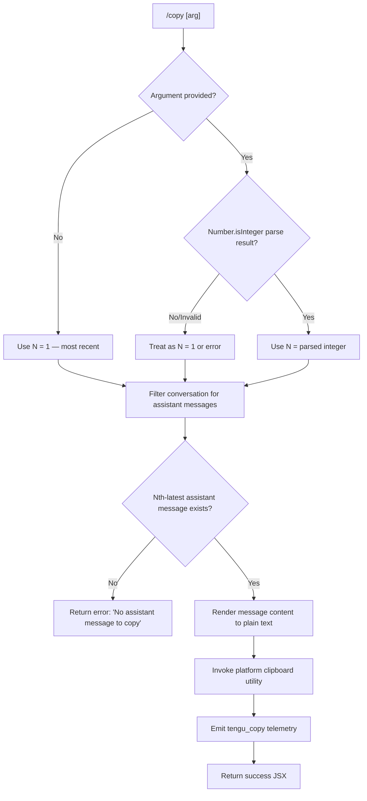

# `/copy`

> Analysis basis: CC v2.1.149 bundle.js (AST extraction + Claude interpretation)
> Minimum version: v2.1.149

---

## Overview

The `/copy` command copies Claude's most recent assistant response to the system clipboard. An optional numeric argument `N` allows copying the Nth-latest assistant message instead of the most recent one. The command locates the target message in the conversation history, renders its content as plain text, and dispatches it to the platform-appropriate clipboard utility.

---

## Registration

| Field | Value |
|---|---|
| type | `local-jsx` |
| name | `copy` |
| description | `Copy Claude's last response to clipboard (or /copy N for the Nth-latest)` |
| module_id | `YW1` |
| load_inline | `true` |
| loc_byte | `10676420` |
| loc_byte_end | `10676606` |
| loc_line | `8422` |
| arbor_handler.name | `ruL` |
| arbor_handler.fqn | `claude-2.1.149::ruL` |
| arbor_handler.kind | `AsyncFunction` |
| arbor_handler.resolution_path | `module_id` |
| arbor_handler.n_hits | `0` |

Analysis basis: CC v2.1.149 bundle.js:+10676420

---

## Input Branching

The command has three distinct paths based on argument presence/validity, then a further split based on whether any assistant messages are found.



Analysis basis: CC v2.1.149 bundle.js:+10675605 (handler entry `ruL`), +10675715 (Number parse), +10675729 (Number.isInteger check), +10675644 (error literal guard)

---

## Behavioral Spec

### Argument Parsing

```
async function copyCommandHandler(commandInput, appContext):
    rawArg = extractArgument(commandInput)          // $W1 — splits input tokens
    
    if rawArg is absent or empty:
        targetIndex = 1                             // default: most-recent
    else:
        parsed = Number(rawArg)
        if Number.isInteger(parsed) and parsed >= 1:
            targetIndex = parsed
        else:
            targetIndex = 1                         // fall back gracefully
```

Analysis basis: CC v2.1.149 bundle.js:+10675605, +10675715, +10675729

### Message Selection

```
    allMessages = getConversationMessages(appContext)   // H — message store access
    assistantMessages = filterByRole(allMessages, role="assistant")
    // "assistant" literal confirmed at bundle.js:+10671553
    
    // targetIndex = 1 means the most recent; higher N means further back
    candidate = assistantMessages[ length - targetIndex ]
    
    if candidate is undefined or null:
        return errorUI("No assistant message to copy")
        // literal at bundle.js:+10675646
```

Analysis basis: CC v2.1.149 bundle.js:+10675644, +10671553

### Content Extraction and Rendering

The selected message is passed to a Markdown-to-plain-text renderer pipeline. The pipeline (`fW1`) invokes a lexer (`Nf.lexer` at bundle.js:+10671204) and walks the token stream to produce plain text. Table cells are joined with ` | ` (literal at bundle.js:+10670893); the renderer recognises `"table"`, `"plaintext"`, `"center"`, `"right"`, and `"left"` alignment tokens (literals at bundle.js:+10671317, +10671758, +10670928, +10670970, +10671010). Column width is computed via `stringWidth` (bundle.js:+10670809) with a minimum column width of 3 characters (literal at bundle.js:+10670793) and pipe separators escaped as `\|` (literal at bundle.js:+10670734).

```
function renderToPlainText(message):
    tokens = markdownLexer(message.content)         // Nf.lexer
    lines  = []
    for each token in tokens:
        if token.type == "table":
            lines.append(renderTable(token, separator=" | ", minColWidth=3))
        else:
            lines.append(stripMarkdown(token))
    return lines.join("\n")
```

Analysis basis: CC v2.1.149 bundle.js:+10671204, +10670893, +10670793, +10670734

### Clipboard Dispatch

The plain-text string is handed to the platform clipboard helper (`md_` → `KE`). The helper inspects the runtime platform and selects the appropriate system command:

```
function writeToClipboard(text):
    platform = detectPlatform()
    
    if platform == "darwin":
        spawn("pbcopy", stdin=text)
        // literal at bundle.js:+3352934
    
    elif platform == "linux":
        if waylandSessionDetected():
            spawn("wl-copy", stdin=text)
            // literal at bundle.js:+3352999
        elif xclipAvailable():
            spawn("xclip", ["-selection", "clipboard"], stdin=text)
            // literals at bundle.js:+3353045, +3353066, +3353079
        else:
            spawn("xsel", ["--clipboard", "--input"], stdin=text)
            // literals at bundle.js:+3353111, +3353130, +3353144
    
    elif platform == "win32":
        spawn("powershell", ["-NoProfile", "-NonInteractive", "-Command", ...], stdin=text)
        // literals at bundle.js:+3353423, +3353437, +3353450, +3353468
    
    // Special terminal multiplexer / kitty / iTerm2 paths also exist
    // kitty: literal at bundle.js:+3352030
    // tmux:  "load-buffer" at bundle.js:+3352533; "-w" flag at bundle.js:+3352567
    // iTerm2: literal at bundle.js:+3352523
```

Analysis basis: CC v2.1.149 bundle.js:+10671969 (`KE`), +3352908 (darwin), +3352960 (linux), +3353411 (win32), +3352030 (kitty), +3352595 (tmux), +3352523 (iTerm2)

### Temporary-File Path for Clipboard Helpers

Some clipboard helpers (tmux `load-buffer`, kitty) require writing content to a temporary file first. The temp-file path is resolved via `VP` which uses `CLAUDE_CODE_TMPDIR` or falls back to `/tmp` (literal at bundle.js:+3922914). The directory is created with mode `0o700` (octal 448, literal at bundle.js:+3923595) and validated that it is not world-writable (error message literal: "Set CLAUDE_CODE_TMPDIR…" at bundle.js:+3922989).

Analysis basis: CC v2.1.149 bundle.js:+3923493, +3922914, +3923595

### Post-Copy Telemetry and Return

```
    emitTelemetry("tengu_copy")                     // bundle.js:+10676024
    return successJSX()
```

Analysis basis: CC v2.1.149 bundle.js:+10676024

---

## State & Side Effects

| Item | Detail |
|---|---|
| Telemetry | `tengu_copy` (bundle.js:+10676024) — emitted on every successful copy invocation |
| Telemetry (indirect — MCP paths reachable from call graph) | `tengu_mcp_oauth_flow_start`, `tengu_mcp_oauth_flow_success`, `tengu_mcp_oauth_flow_error`, `tengu_mcp_reconnect`, `tengu_mcp_reconnect_not_connected`, `tengu_mcp_reconnect_failed`, `tengu_bg_spare_enable`, `tengu_bg_spare_spawn`, `tengu_bg_spare_claim`, `tengu_bg_spare_claim_fail`, `tengu_bg_dispatch_sigkill_escalate`, `tengu_bg_dispatch_low_mem`, `tengu_bg_low_mem_mb`, `tengu_bg_sendclaim_failed`, `tengu_daemon_config_reload`, `tengu_daemon_yield`, `tengu_config_auth_loss_prevented`, `tengu_config_parse_error`, `tengu_feature_ok`, `tengu_feature_bad` — these originate from deep call-graph nodes unrelated to the core copy path |
| Clipboard side effect | Spawns a platform subprocess (`pbcopy` / `wl-copy` / `xclip` / `xsel` / `powershell`) or writes a temp file (tmux/kitty); content placed on system clipboard |
| Temp file | May create a file under `CLAUDE_CODE_TMPDIR` or `/tmp` for terminal-multiplexer clipboard paths; cleaned up by the helper after use |
| appState changes | None observed — command is read-only with respect to application state |
| Sound | None observed |
| Hook registration | None observed |

---

## Version History

| Version | Change |
|---|---|
| v2.1.149 | Initial analysis |

---

## Common Mistakes

1. **Passing a non-integer argument** — `/copy foo` will not raise a visible error in all code paths; the implementation silently falls back to copying the most-recent message. Users expecting an error prompt may be confused.
2. **Using `/copy 0`** — Index `0` is not a valid Nth-latest value; the 1-based convention means `/copy 1` is the most recent message. Passing `0` may produce unexpected results.
3. **Running in a headless/SSH environment without a clipboard utility** — If none of `pbcopy`, `wl-copy`, `xclip`, or `xsel` is installed, the clipboard write will fail silently or with a subprocess error. Users should ensure a clipboard daemon (e.g., `xclip`, `xsel`, or `wl-clipboard`) is installed and `DISPLAY`/`WAYLAND_DISPLAY` is set.
4. **Expecting rich Markdown in the clipboard** — `/copy` renders to plain text, stripping Markdown formatting. Code blocks, bold, and italics will not be preserved.
5. **Confusing `/copy N` with copying N messages** — The `N` argument selects the Nth-*latest* single message, not the last N messages.

---

## Appendix — Identifier Mapping

> For bundle debugging only. Identifiers change across versions.

| Identifier | Role |
|---|---|
| `ruL` | Main async handler for `/copy` command (arbor-resolved entry point) |
| `$W1` | Argument extractor — splits command input tokens, checks array shape |
| `$K` | Text-type content filter — filters message content blocks by `type="text"` |
| `fW1` | Plain-text renderer — walks markdown token stream, emits plain-text lines |
| `MW1` | Table renderer — formats markdown table tokens with column alignment and padding |
| `QuL` | Secondary plain-text formatter used within the render pipeline |
| `OW1` | Plain-text post-processor — applies a string replacement pass |
| `Nf` | Markdown lexer wrapper exposing `.lexer()` method |
| `tDH` | Token replacement helper used during lexer output processing |
| `duL` | Column-measurement helper called by the table renderer |
| `w8` | String-width calculator (wraps `Bun.stringWidth`) |
| `md_` | Clipboard dispatch orchestrator — delegates to platform-specific helper |
| `KE` | Platform detection + clipboard command builder |
| `cj` | Kitty terminal clipboard helper |
| `QH7` | Kitty clipboard sub-helper (uses `yJ` encoding) |
| `rH7` | Darwin (`pbcopy`) clipboard helper |
| `lH7` | Linux Wayland/X11 clipboard helper |
| `cH7` | String sanitiser — applies `.replaceAll` to clipboard content before dispatch |
| `E8` | Subprocess spawner used by clipboard helpers (`G_`, `x6`) |
| `VP` | Temporary-file path resolver (respects `CLAUDE_CODE_TMPDIR`, falls back to `/tmp`) |
| `zW1` | Temp-file writer — creates directory, writes content, calls `VP` |
| `yM7` | Directory validator — checks temp dir ownership/permissions |
| `hp` | Temp-file path join helper |
| `O7` | String index-search utility |
| `m6` | Config/file watcher initialiser reached transitively |
| `JOH` | Config file reader/writer |
| `mb9` | Backup directory resolver for config files |
| `Of_` | Path join helper for backup paths |
| `Et4` | File-watch setup helper |
| `xC` | String prefix-strip utility |
| `g6` | JSON parse wrapper |
| `K8` | Error classifier / re-throw helper |
| `c` | Generic async error boundary / try-catch wrapper |
| `CH` | `JSON.stringify` wrapper |
| `EH` | `String(...)` coercion wrapper |
| `uH` | Low-level feature-flag check (emits `tengu_feature_ok` / `tengu_feature_bad`) |
| `bH` | Secondary feature-flag check |
| `w` | Background daemon session manager (deep transitive reach) |
| `D` | Daemon spare-worker lifecycle controller |
| `Kv8` | Memory check helper for daemon low-memory events |
| `RH` | Error logger (emits to `ll.logError` + `dxH`) |
| `V6` | Session store / workspace context accessor |
| `yqA` | Background worker claim handler |
| `uqA` | Background worker lifecycle / cleanup handler |
| `g` | Settled-session reaper |
| `CL` | MCP error logger (emits to `ll.logMCPError`) |
| `z8` | MCP debug logger (emits to `ll.logMCPDebug`) |
| `UyH` | MCP client initialiser / connection manager |
| `j6H` | MCP server config processor |
| `G4H` | MCP server entry builder |
| `Sj6` | MCP transport/session tracker |
| `Rj6` | MCP server error category mapper |
| `w6H` | MCP SDK-transport builder |
| `bN` | MCP server-state aggregator |
| `HO` | MCP status display helper |
| `hB_` | MCP OAuth + connection driver |
| `f_H` | MCP OAuth callback-server setup |
| `jtH` | MCP pending-connection tracker |
| `SB_` | MCP manual-callback (remote SSH) handler |
| `Dc` | MCP reconnection logic |
| `vkL` | MCP needs-auth cache loader |
| `vF_` | MCP needs-auth cache file path builder |
| `EW8` | MCP cache file path joiner |
| `IY1` | MCP needs-auth cache writer |
| `kB_` | MCP auth-cache hash builder |
| `JX` | MCP config hash helper (SHA-256 via `K0q.createHash`) |
| `FK` | MCP fingerprint builder |
| `y78` | MCP server key builder |
| `h78` | MCP server hash resolver |
| `k78` | MCP fingerprint lookup helper |
| `lT_` | MCP transport-type inclusion checker |
| `f8` | Global config save helper |
| `nv5` | MCP multi-server refresh orchestrator |
| `R78` | MCP server allow-list checker |
| `r8` | Generic retry-with-timeout helper |
| `QDK` | MCP update applicator |
| `ZW8` | MCP update serialiser |
| `OI` | MCP client cleanup coordinator |
| `ytH` | MCP client serialiser |
| `N` | Notification / logging dispatch helper (deep transitive) |
| `MVK` | Notification formatter |
| `T7A` | Notification sub-formatter |
| `OVK` | Notification output writer (file append path) |
| `ICH` | Buffered output flusher |
| `q9H` | Output line builder |
| `LMA` | Log file path builder |
| `KMA` | Log file rotator |
| `G96` | Error-code classifier for log rotation |
| `$VK` | Log file appender |
| `a9` | Signal handler registrar (`W7A.register`) |
| `HbH` | Terminal output writer wrapper |
| `B5A` | Raw terminal write helper |
| `X4` | ANSI/escape sequence processor |
| `s5A` | ANSI map builder |
| `ZY1` | Async map-with-concurrency helper |
| `li` | Core async concurrency primitive (pool / semaphore) |
| `_E6` | Integer parser (radix 10) |
| `NF_` | Integer parser variant (radix 20) |
| `ym` | Prompt/UI helper |
| `Y` | Supervisor write / MCP watcher helper |
| `MI` | <!-- TODO: not found in depth-2 traversal; needs --depth 4 --> |
| `SNL` | MCP OAuth tool descriptor builder |
| `nF` | OAuth prompt helper |
| `RNL` | <!-- TODO: not found in depth-2 traversal; needs --depth 4 --> |
| `hNL` | SSH-session detection helper for OAuth |
| `kNL` | <!-- TODO: not found in depth-2 traversal; needs --depth 4 --> |
| `f_H` | OAuth HTTP callback server |
| `Oz6` | Conversation history file reader |
| `j` | Background worker process set manager |
| `y` | Background worker write helper |
| `C` | Background worker kill helper |
| `S` | <!-- TODO: not found in depth-2 traversal; needs --depth 4 --> |
| `Af_` | Config accessor helper |
| `rn` | File-watch event handler |
| `_Q1` | Daemon status file reader |
| `Pn` | Daemon heartbeat/status helper |
| `vqH` | Daemon socket trimmer (calls `_.trim` with timeout 1000 ms) |
| `A1` | Async-local-storage accessor (`mM7.getStore`) |
| `$v6` | Daemon status JSON path builder (`daemon.status.json`) |
| `s28` | MCP store accessor (uses `A1`, `EW8`) |