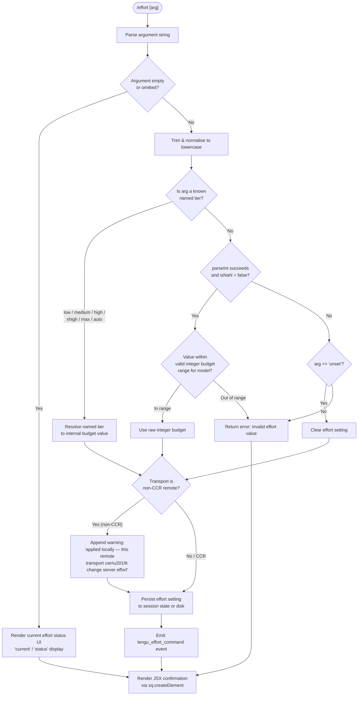

# `/effort`

> Analysis basis: CC v2.1.149 bundle.js (AST extraction + Claude interpretation)
> Minimum version: v2.1.149

---

## Overview

The `/effort` command sets the reasoning/inference effort level that Claude Code uses when interacting with the model. It accepts a named tier (`low`, `medium`, `high`, `xhigh`, `max`, or `auto`) or an integer budget value, validates the input against the active model's capabilities, and persists the setting — either to a session-local store or to disk — with appropriate warnings when the transport cannot honour server-side effort changes.

---

## Registration

| Field | Value |
|---|---|
| type | `local-jsx` |
| name | `effort` |
| description | Set effort level for model usage |
| argumentHint | `[low\|medium\|high\|xhigh\|max\|auto]` |
| immediate | `null` |
| thinClientDispatch | `control-request` |
| module_id | `Tg1` |
| load_inline | `true` |
| loc_byte | `12313835` |
| loc_byte_end | `12314098` |
| loc_line | `10011` |
| arbor_handler.name | `NA5` |
| arbor_handler.fqn | `claude-2.1.149::NA5` |
| arbor_handler.kind | `AsyncFunction` |
| arbor_handler.resolution_path | `module_id` |
| arbor_handler.n_hits | `1` |

Analysis basis: CC v2.1.149 bundle.js:+12313835

---

## Input Branching

The command has more than three distinct resolution paths (numeric budget, named tier, `auto`, `unset`, invalid, and remote-transport warning), so a Mermaid flowchart is used below.



Analysis basis: CC v2.1.149 bundle.js:+12305189, +4081129, +4081359, +4081627, +12304123

---

## Behavioral Spec

### 1. Argument Parsing and Validation

The handler (`NA5`, resolved via Arbor `module_id` path) begins by invoking a trim-and-validate helper on the raw argument string.

```
function validateEffortArgument(rawArg):
    trimmed = rawArg.trim()
    normalised = trimmed.toLowerCase()     // via NZH membership check

    if normalised is in NAMED_TIERS:
        return { kind: "named", value: normalised }

    parsed = parseInt(normalised, 10)
    if not isNaN(parsed):
        if isInteger(parsed) and parsed in validRange:
            return { kind: "numeric", value: parsed }
        else:
            return { kind: "error", reason: "out-of-range integer" }

    if normalised == "unset":
        return { kind: "unset" }

    return { kind: "error", reason: "unrecognised value" }
```

Named tiers recognised (via `NZH` / `QZ.includes` membership check):
- `low` — "Quick, straightforward implementation with minimal overhead"
- `medium` — "Balanced approach with standard implementation and testing"
- `high` — "Comprehensive implementation with extensive testing and documentation"
- `xhigh` — extended high effort
- `max` — "Maximum capability with deepest reasoning"
- `auto` — automatic selection

Integer parsing uses radix 10 (`parseInt`, base `10`).

Analysis basis: CC v2.1.149 bundle.js:+4081129, +4081171, +4081348, +4081359, +4081367, +4081627, +4081655, +4083111, +4083123, +4083189, +4083204, +4083282, +4083458

### 2. Model Compatibility Check

Before applying a numeric or named tier, the handler checks whether the currently configured model supports the requested effort level. This uses a list of model identifiers checked via `A.includes` against the current model string (lowercased to at most 40 characters).

Explicitly enumerated models with effort support:
- `claude-3-*` (prefix match)
- `claude-opus-4-0`
- `claude-opus-4-1`
- `claude-sonnet-4-0`
- `claude-sonnet-4-5`
- `claude-haiku-4-5`
- `claude-opus-4-7`
- `claude-opus-4-6`
- `claude-sonnet-4-6`
- `claude-opus-4-5`

Special alias `opus-4-7` is also recognised (bundle.js:+4081711).

`xhigh` effort requires a model that supports the `xhigh_effort` capability token; `max` effort requires `max_effort`. Both tokens are checked against the model's allowed capability set.

Analysis basis: CC v2.1.149 bundle.js:+4080082, +4080093, +4080111–4080288, +4080361, +4080715, +4081711, +15286746

### 3. Transport Warning

When the session transport is detected as a non-CCR remote transport (the token `"ccr"` is used to identify Claude Code Relay), the handler appends a warning note to the confirmation message:

> "applied locally — this remote transport can't change server effort"

This happens when the `thinClientDispatch` path is `control-request` but the actual backing transport is not CCR.

Analysis basis: CC v2.1.149 bundle.js:+12304123, +4079355

### 4. Session-only Mode

When the command is executed in a context where settings can only be stored in-memory (this session only), a "(this session only)" qualifier is appended to the output message.

Analysis basis: CC v2.1.149 bundle.js:+12305102

### 5. Named Tier → Internal Budget Mapping

Named tiers map to internal effort tokens consumed by the inference profile routing:

```
function resolveNamedTier(tier):
    switch tier:
        case "low":    return { budget: LOW_BUDGET,   label: "low" }
        case "medium": return { budget: MED_BUDGET,   label: "medium" }
        case "high":   return { budget: HIGH_BUDGET,  label: "high" }
        case "xhigh":  return { budget: XHIGH_BUDGET, label: "xhigh_effort" }
        case "max":    return { budget: MAX_BUDGET,   label: "max_effort" }
        case "auto":   return { budget: AUTO,         label: "auto" }
```

The `ultra` alias (bundle.js:+4081884) is also present in the implementation, mapping to the same budget level as `max`.

Analysis basis: CC v2.1.149 bundle.js:+4081884, +4081933, +4083797, +4083811

### 6. Persistence

After validation the resolved effort value is written via the settings-persistence subsystem (`saveSettingsOrSessionLocal`):

```
async function persistEffortSetting(resolvedValue, sessionOnly):
    if sessionOnly:
        writeToSessionState("effort", resolvedValue)
        // no disk I/O; "(this session only)" suffix added to reply
    else:
        acquireConfigLock()        // $f_ / saveConfigWithLock
        currentConfig = readConfigFromDisk()
        mergedConfig = merge(currentConfig, { effort: resolvedValue })
        writeConfigAtomically(mergedConfig)
        releaseConfigLock()
    emitTelemetry("tengu_effort_command", { value: resolvedValue })
```

The lock-based write uses a temp-file-plus-rename strategy with a 60 000 ms timeout and up to 5 backup files retained. Auth-loss prevention is active: if the re-read config is missing auth that the cache has, the write is refused (bundle.js:+3194037).

Analysis basis: CC v2.1.149 bundle.js:+3193710, +3194037, +4082777, +12305292, +12305482

### 7. Status Display (No Argument)

When `/effort` is invoked with no argument the handler renders a JSX element (via `sq.createElement`) showing the current effort level and its label. The display uses the keys `"current"` and `"status"` to populate the UI.

Analysis basis: CC v2.1.149 bundle.js:+12312265, +12312280, +12312296

### 8. Apply Flag Settings

The handler calls into an `apply_flag_settings` routine after setting the effort value, which reconciles policy-level, flag-level, user-level, project-level, and local-level settings in priority order.

Setting layers (low → high priority): `policySettings` → `flagSettings` → `userSettings` → `projectSettings` → `localSettings`.

Analysis basis: CC v2.1.149 bundle.js:+12304272, +1220331, +1220353, +1220977, +1221092, +1221115

---

## State & Side Effects

| Item | Detail |
|---|---|
| Telemetry | `tengu_effort_command` (bundle.js:+12305482) — fired on every successful effort change |
| Telemetry | `tengu_slate_finch` (bundle.js:+4083581) — fired from the render/UI path |
| Telemetry | `tengu_feature_ok` (bundle.js:+963421) — feature-flag success |
| Telemetry | `tengu_feature_sad` (bundle.js:+963556) — feature-flag soft failure |
| Telemetry | `tengu_feature_bad` (bundle.js:+963479) — feature-flag hard failure |
| Telemetry | `tengu_config_lock_contention` (bundle.js:+3193710) — config lock held too long |
| Telemetry | `tengu_config_stale_write` (bundle.js:+3193846) — stale write detected |
| Telemetry | `tengu_config_auth_loss_prevented` (bundle.js:+3194189) — auth wipe prevented |
| Telemetry | `tengu_config_parse_error` (bundle.js:+3196285) — config parse failure |
| appState changes | Effort level stored in session state or persisted to `~/.claude/settings.json` / `settings.local.json` |
| Config files | `.claude/settings.json` (project), `.claude/settings.local.json` (local), global `~/.claude.json` |
| Config locking | File-lock with 60 000 ms timeout; up to 5 backup files (`.backup.*`) retained |
| Sound | <!-- TODO: not found in depth-2 traversal; needs --depth 4 --> |
| thinClientDispatch | `control-request` — effort changes are sent as control requests when relayed |
| JSX render | `sq.createElement` renders confirmation or status UI |
| Event emission | `nn.emit` (GrowthbookExperimentEvent) fired from the model-routing subsystem |
| Event emission | `kuH.emit` fired after settings write |

---

## Version History

| Version | Change |
|---|---|
| v2.1.149 | Initial analysis |

---

## Common Mistakes

1. **Passing an unsupported model string** — The command validates the active model against a hard-coded allowlist. If the session model is not in that list, effort changes may be silently rejected or produce an error response.
2. **Using `/effort` on a non-CCR remote transport** — The effort level is applied locally but the remote server will not honour it; users may not notice the warning appended to the confirmation message.
3. **Confusing `auto` with omitting the argument** — Providing no argument shows current status; providing `auto` actively sets the effort level to automatic selection.
4. **Expecting `xhigh` to work on older Claude 3 models** — The `xhigh_effort` and `max_effort` tokens require models that advertise those capability tokens; older models silently cap at `high`.
5. **Assuming the setting is global by default** — Depending on session context, the write may be session-local only (with a "(this session only)" notice). Check the confirmation message for scope.
6. **Treating integer and named-tier inputs as interchangeable** — Integer budget values go through a separate range-validation path and are not aliases for the named tiers.

---

## Appendix — Identifier Mapping

> For bundle debugging only. Identifiers change across versions.

| Identifier | Role |
|---|---|
| `NA5` | Main handler — async function for `/effort` command (Arbor-resolved) |
| `YV8` | Effort command registration/dispatch entry point |
| `DV8` | Secondary effort command variant or renderer |
| `H$` | Effort state reader / current-value accessor |
| `Z2H` | Effort state sub-reader (called from H$) |
| `GQH` | Effort argument getter / current effort value retrieval |
| `pb` | Effort argument validator (trim, named-tier check, parseInt, isNaN) |
| `No9` | Integer budget validator (uses `Number.isInteger`) |
| `NZH` | Named-tier membership checker (uses `QZ.includes`) |
| `dZ` | Effort apply / write orchestrator |
| `AHH` | Effort persistence coordinator (calls R2, F_8, g_8, GQH, vD_, WQH, jz6) |
| `R2` | Settings write helper (uses mH, st, Xq) |
| `mH` | String coercion utility |
| `Xq` | Model/profile capability checker (checks application-inference-profile, H.includes, UC8, OP) |
| `A` | Model name normaliser (toLowerCase) |
| `sh` | Settings scope resolver (calls RA) |
| `UD` | Settings layer dispatcher (Oc6, mZ4, RA, $c6) |
| `F_8` | Effort flag-state writer (calls Xq, m6) |
| `g_8` | Effort UI state writer (calls Xq) |
| `m6` | Conversation/message record writer (Q6, GG, Af_, JOH, Date.now, Et4) |
| `vD_` | Effort validation side-effect handler |
| `WQH` | max_effort write path (st, Xq, A.includes, sh, UD) |
| `jz6` | xhigh_effort write path (st, Xq, A.includes, sh, UD) |
| `EKH` | Effort description/label renderer (calls NZH) |
| `ID_` | JSX rendering orchestrator for effort response (b37, VqH, V6) |
| `b37` | JSX sub-component builder |
| `VqH` | Pro-tier or subscription check (calls O1) |
| `O1` | Auth/account resolver (MH_, LH_, dD, eA) |
| `dD` | API key / credential loader (K4, ev, yO, TA, hJ, e$, O1H) |
| `V6` | Conversation event emitter / store updater (_$6, A$6, we, YOH, we6, e36, lg, m6) |
| `we` | Message builder (mH, Gb) |
| `Gb` | Output sink (calls OS) |
| `we6` | Deduplication and event dispatch (FM_.has/get/add, BM_, cM_) |
| `BM_` | GrowthbookExperimentEvent emitter (Gb, aTH, $p, hBH, mM_.randomUUID, CH, is4, nn.emit) |
| `cM_` | Async event completion handler (uE9, HA, Zb9, WxH) |
| `MA5` | Effort command executor (Gg1, Xz6, c, H$, GQH) |
| `Gg1` | CCR transport check / effort application for relay (H$, ck) |
| `ck` | CCR flag reader (calls H$) |
| `Xz6` | Settings-persist orchestrator for effort (TzH, _A, f8) |
| `TzH` | Settings-write precondition checker |
| `_A` | Settings write to disk (o$, Q6, Pl8, rF, oX, j8, N, Ec8, M0H, UK6, CH, CY, im6, BC, j_, bH, _8, uH, hm, RH, kuH.emit) |
| `o$` | Config cache reader (dfH, rF) |
| `Pl8` | Config file locator (EZA, dfH, iF, WZA, nl) |
| `rF` | Settings deserialiser (j_, jA6, sR8, zA6, J2H, JA6, BfH, FfH, zl8, AZA, sl, I46) |
| `oX` | Gitignore-global-rule handler (calls il) |
| `j8` | ENOENT handler (calls K8) |
| `N` | Settings writer/logger (h96, MVK, H.includes, CH, toUpperCase, X4, H.trim, cI, HbH, OVK) |
| `Ec8` | Timestamp cache setter (Hp6.set, Date.now) |
| `M0H` | Settings merger (Fp6, rF) |
| `UK6` | Atomic file writer with lock (Q6, readlinkSync, isAbsolute, resolve, dirname, N, closeSync, openSync, K8, lstatSync, isSymbolicLink, j8, randomBytes, statSync, toString, writeFileSync, fchmodSync, fsyncSync, renameSync, unlinkSync) |
| `CH` | JSON serialiser (JSON.stringify) |
| `CY` | Cache clear utility (dy6.clear, pS8.clear) |
| `im6` | Gitignore-file tracker (x6, Lc8, H.replaceAll, A.endsWith, nm6, FaK, C9H.dirname, NfH.mkdir/readFile/appendFile/writeFile, fTA, N, $TA, K8, String) |
| `BC` | Settings path builder (bv.join → ".claude/settings.json") |
| `j_` | Generic async wrapper (calls Dv) |
| `bH` | Feature-ok telemetry emitter (calls c → tengu_feature_ok) |
| `_8` | Feature-sad telemetry emitter (calls c → tengu_feature_sad) |
| `uH` | Feature-bad telemetry emitter (calls c → tengu_feature_bad) |
| `hm` | Settings-load logger (DC, Tq, Wl8, rF, cy6; events: loadSettingsFromDisk_start/end) |
| `RH` | Error reporter (c_, mH, G1, uiK, dxH.push, ll.logError) |
| `f8` | Global config save with auth-loss guard ($f_, GG, H, OFH, ub9, zFH, N, JOH, f$6, c, ff_) |
| `$f_` | Config atomic-write with lock and backup rotation |
| `ff_` | Config write finaliser (iY.dirname, Q6, qZ, CH, UK6) |
| `IZH` | Effort arg normaliser used by DV8 path (H.trim, NZH) |
| `LA5` | Full effort command handler variant (TzH, ck, Gg1, Xz6, c, H$, GQH, ID_) |