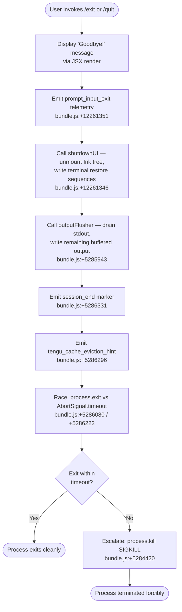

# `/exit`

> Analysis basis: CC v2.1.149 bundle.js (AST extraction + Claude interpretation)
> Minimum version: v2.1.149

---

## Overview

The `/exit` command (also aliased as `/quit`) initiates an orderly shutdown of the Claude Code CLI session. When invoked, it displays a farewell message, emits a `prompt_input_exit` telemetry signal, tears down the UI, flushes pending I/O, and calls `process.exit` — optionally escalating to `process.kill` if the process does not exit cleanly within a timeout window.

---

## Registration

| Field | Value |
|---|---|
| type | `local-jsx` |
| name | `exit` |
| aliases | `["quit"]` |
| description | `null` |
| immediate | `true` |
| module_id | `wF1` |
| load_inline | `true` |
| loc_byte | `12261914` |
| loc_byte_end | `12262075` |
| loc_line | `9999` |
| arbor_handler.name | `J_5` |
| arbor_handler.fqn | `claude-2.1.149::J_5` |
| arbor_handler.kind | `AsyncFunction` |
| arbor_handler.resolution_path | `module_id` |
| arbor_handler.n_hits | `1` |

Analysis basis: CC v2.1.149 bundle.js:+12261914

---

## Input Branching

The exit flow has more than three distinct phases (UI teardown, output flushing, process termination, escalation fallback), so a Mermaid flowchart is used.



---

## Behavioral Spec

### 1. Command Handler Entry (`J_5`)

The primary async handler is `J_5`, resolved via the `module_id` path (`wF1`).

```
async function exitCommandHandler(context):
    display farewell message ("Goodbye!")           // bundle.js:+12261127
    invoke backgroundSessionCleanup(context)        // bundle.js:+12261163
    invoke randomJitter()                           // bundle.js:+12261175
    invoke detachRequest()                          // bundle.js:+12261179
    invoke scheduledTaskDisplay(context)            // bundle.js:+12261210
    render JSX farewell element via React.createElement  // bundle.js:+12261240
    invoke shutdownSequence()                       // bundle.js:+12261346
    emit telemetry("prompt_input_exit")             // bundle.js:+12261351
    return
```

Analysis basis: CC v2.1.149 bundle.js:+12261163–12261351

---

### 2. Background Session Cleanup (`bq` → `f$H`)

Before tearing down the foreground UI, the handler contacts any background daemon/worker sessions.

```
function backgroundSessionCleanup(context):
    resolve role from context:
        if role is "bg":           // bundle.js:+2189581
            notify background session
        if role is "daemon":       // bundle.js:+2189591
            notify daemon process
        if role is "daemon-worker": // bundle.js:+2189605
            notify daemon worker
    invoke sessionFinalizer()
```

Analysis basis: CC v2.1.149 bundle.js:+2189581

---

### 3. Random Jitter (`H`)

A brief random delay is inserted before the shutdown sequence to stagger teardown across concurrent sessions and avoid thundering-herd on shared resources.

```
function randomJitter():
    delay = Math.random() * (2 - 1) + 1    // range [1, 2] — bundle.js:+13290018
    setTimeout(continue, delay)             // bundle.js:+13290057
```

Analysis basis: CC v2.1.149 bundle.js:+13290018

---

### 4. Detach-Request Dispatch (`ZLH`)

The handler sends a `"detach-request"` message over the IPC channel so that any supervisor process knows the foreground client is leaving intentionally.

```
function detachRequest():
    invoke sessionList()              // al6 — bundle.js:+10683127
    invoke activeWorkerSet()          // WW1 — bundle.js:+10683146
        mark active tasks complete (type: "task")  // bundle.js:+10677754
        set completion flag to 0                   // bundle.js:+10677710
    write IPC message "detach-request" to socket   // bundle.js:+10683161
        using serializer (JSON.stringify)           // bundle.js:+182698
    invoke exitEventEmitter()         // E_H — bundle.js:+10683207
```

Analysis basis: CC v2.1.149 bundle.js:+10683161

---

### 5. Scheduled Task Display (`c08`)

If any scheduled tasks are active at exit time, a summary is displayed before shutdown proceeds.

```
function scheduledTaskDisplay(context):
    resolve active tasks via taskFrameResolver()      // F0 — bundle.js:+10676654
    push summary to output buffer (H.push)            // bundle.js:+10676659
    invoke taskSummaryFormatter()                     // auL — bundle.js:+10676700
        compute scheduled task label                  // "scheduled task" — bundle.js:+10676673
        format duration via durationHelper()          // tZ — bundle.js:+10676786
        format next-run via nextRunCalculator()       // vN — bundle.js:+10676803
        format schedule string via scheduleParser()   // xdH — bundle.js:+10676819
        compute max(timestamps)                       // Math.max — bundle.js:+10676878
        compute elapsed via Date.now()                // bundle.js:+10676901
        apply rounding via timeRounder()              // Hq — bundle.js:+10676935
    invoke columnWidthCalculator()    // uq — bundle.js:+10676715
```

Analysis basis: CC v2.1.149 bundle.js:+10676654

---

### 6. UI Shutdown Sequence (`_q`)

This is the central shutdown orchestrator, called as `shutdownSequence`.

```
async function shutdownSequence():
    // Step 1: Sync any remaining output
    invoke terminalSyncWrite()                     // TvH — bundle.js:+5285931
        writeSync to stdout (XDH.writeSync)        // bundle.js:+5283718
        retrieve Ink handle (Y7.get)               // bundle.js:+5283744
        unmount Ink tree (H.unmount)               // bundle.js:+5283795
        invoke terminalRestoreSequences()          // l68 — bundle.js:+5283877
            write ESC-7 / ESC-8 save/restore       // bundle.js:+3695002, +3695013
            handle terminal-specific paths:
                if "ghostty" >= "1.2.0"            // bundle.js:+3428101, +3428131
                if "iTerm.app" >= "3.6.6"          // bundle.js:+3428170, +3428202
                if "tmux" session                   // bundle.js:+3352112
                if "screen" session                 // bundle.js:+3352185
        invoke exitMessageFormatter()              // mH — bundle.js:+5283884
            format via String()                    // bundle.js:+26899

    // Step 2: Collect exit summary
    invoke summaryCollector()                      // o0_ — bundle.js:+5285937
        resolve session data (jv, jC)              // bundle.js:+5284018, +5284025
        resolve project path (S6)                  // bundle.js:+5284040
        resolve git path (Aj6)                     // bundle.js:+5284049
            check statSync                         // bundle.js:+12756052
        resolve cost summary (gO)                  // bundle.js:+5284069
        replace path separators for display        // bundle.js:+5284088 ("\\\\", "\\\"")
        writeSync final summary to stdout          // bundle.js:+5284187
        apply dim styling (j6.dim)                 // bundle.js:+5284203

    // Step 3: Flush process and exit
    invoke exitProcessFinalizer()                  // a0_ — bundle.js:+5285943
        clearTimeout any pending timers            // bundle.js:+5284314
        retrieve process handle (Y7.get)           // bundle.js:+5284347
        call process.exit()                        // bundle.js:+5284395
        if process does not exit:
            call process.kill(SIGKILL escalation)  // bundle.js:+5284420
            throw Error("unreachable")             // bundle.js:+5284468

    // Step 4: Timing / race
    timeout_a = 5000 ms                            // bundle.js:+5285960
    timeout_b = 3500 ms                            // bundle.js:+5285967
    max_timeout = Math.max(timeout_a, timeout_b)   // bundle.js:+5285951
    timerRef.unref()                               // bundle.js:+5285976

    // Step 5: Emit session telemetry
    emit telemetry("session_end")                  // bundle.js:+5286331
    emit telemetry("tengu_cache_eviction_hint")    // bundle.js:+5286296

    // Step 6: Supervisor notification
    invoke supervisorNotifier()                    // Y — bundle.js:+5286134
        write supervisor channel (q.write)         // bundle.js:+15274721
        label: "supervisor"                        // bundle.js:+15274729
        stop heartbeat (G.stop)                    // bundle.js:+15274997
        invoke workerSupervisorRestart()           // AXK — bundle.js:+15275246
        invoke daemonConfigReload()                // emits tengu_daemon_config_reload
        update session map (M.set, M.delete)       // bundle.js:+15275006, +15275291

    // Step 7: Race for clean exit
    await Promise.race([
        exitProcessFinalizer(),
        AbortSignal.timeout(max_timeout)           // bundle.js:+5286222
    ])

    // Step 8: Final stdout flush
    XDH.writeSync(stdout, final_newline)           // bundle.js:+5286400
```

Analysis basis: CC v2.1.149 bundle.js:+5285863–5286400

---

### 7. Scroll/UI Metrics Snapshot (`X48`)

Immediately before the exit process finalizer runs, the command captures scroll and UI metrics for the departing session.

```
function scrollMetricsSnapshot():
    record scroll summary via scrollSummaryRecorder()  // s$q — bundle.js:+5285290
        Date.now(), Math.max(), Math.round()
        Object.assign result                           // bundle.js:+5282848
    emit telemetry("tengu_scroll_summary")             // bundle.js:+5285263
    invoke renderMetricsCollector()                    // Y9 — bundle.js:+5285307
        check terminal environment (WxH)               // bundle.js:+3359855
        check local-agent mode                         // bundle.js:+3359863
        handle fullscreen state:
            "fullscreen disabled: tmux -CC …"          // bundle.js:+3360074
            "fullscreen disabled: Windows over SSH …"  // bundle.js:+3360260
        emit tengu_pewter_brook                        // bundle.js:+3360499
        emit tengu_amber_creek                         // bundle.js:+3360591
```

Analysis basis: CC v2.1.149 bundle.js:+5285249–5285307

---

### 8. Startup Profiling Flush (`u96` → `Cx8` → `EMA`)

If startup profiling was enabled for the session, its report is written to disk at exit time.

```
function startupProfilingFlush():
    if profiling not enabled:
        log "Startup profiling not enabled"        // bundle.js:+211158
        return
    if no checkpoints:
        log "No profiling checkpoints recorded"    // bundle.js:+211248
        return
    build report:
        header: "STARTUP PROFILING REPORT"         // bundle.js:+211323
        column width: 80                           // bundle.js:+211311
        field width: 8                             // bundle.js:+211471
    write report atomically:
        openSync → writeFileSync → fsyncSync → closeSync  // bundle.js:+183206–183311
        encoding: "utf8"                           // bundle.js:+211807
    log "Startup profiling report:"                // bundle.js:+211827
    emit telemetry("tengu_startup_perf")           // bundle.js:+212856
```

Analysis basis: CC v2.1.149 bundle.js:+211652–211827

---

## State & Side Effects

| Item | Detail |
|---|---|
| Telemetry: prompt_input_exit | Fired synchronously when `/exit` is entered; bundle.js:+12261351 |
| Telemetry: session_end | Fired during shutdown orchestration; bundle.js:+5286331 |
| Telemetry: tengu_cache_eviction_hint | Cache eviction advisory during shutdown; bundle.js:+5286296 |
| Telemetry: tengu_scroll_summary | Scroll/render metrics captured at exit; bundle.js:+5285263 |
| Telemetry: tengu_amber_creek | Render environment metric; bundle.js:+3360591 |
| Telemetry: tengu_pewter_brook | Render environment metric; bundle.js:+3360499 |
| Telemetry: tengu_daemon_config_reload | Emitted when supervisor is notified; bundle.js:+15275522 |
| Telemetry: tengu_startup_perf | Startup profiling report; bundle.js:+212856 |
| Telemetry: tengu_bg_dispatch_sigkill_escalate | Emitted if background session requires SIGKILL; bundle.js:+15260736 |
| Telemetry: tengu_bg_dispatch_low_mem | Emitted if background session hits memory threshold; bundle.js:+15261315 |
| Telemetry: tengu_bg_spare_enable | Background spare worker telemetry; bundle.js:+15262010 |
| Telemetry: tengu_bg_spare_claim | Background spare worker claimed; bundle.js:+15262131 |
| Telemetry: tengu_bg_spare_claim_fail | Background spare worker claim failure; bundle.js:+15262394 |
| Telemetry: tengu_bg_spare_spawn | Background spare worker spawned; bundle.js:+15260429 |
| IPC side effect | Writes `"detach-request"` message to daemon socket; bundle.js:+10683161 |
| Terminal state | Unmounts Ink UI tree; restores terminal cursor/scroll state via ESC sequences; bundle.js:+5283795 |
| stdout | Final dim-styled session summary written synchronously; bundle.js:+5284187 |
| Process termination | `process.exit()` called; SIGKILL escalation if exit stalls beyond 5000 ms; bundle.js:+5284395, +5284420 |
| Timer management | `clearTimeout` called before exit; timer `.unref()`-d; bundle.js:+5284314, +5285976 |
| Startup profiling file | Written atomically to disk if profiling was active; bundle.js:+183206 |
| Task queue | Pending scheduled tasks marked complete before exit; bundle.js:+10677710 |
| Hook registration | <!-- TODO: not found in depth-2 traversal; needs --depth 4 --> |
| Sound | <!-- TODO: not found in depth-2 traversal; needs --depth 4 --> |

---

## Version History

| Version | Change |
|---|---|
| v2.1.149 | Initial analysis |

---

## Common Mistakes

1. **Treating `/exit` and `/quit` as separate commands.** They share an identical implementation; `quit` is a registered alias, not a distinct command. Analysis basis: CC v2.1.149 bundle.js:+12261914
2. **Assuming exit is synchronous.** The handler is an `AsyncFunction` (`J_5`) and runs a multi-step shutdown sequence including `Promise.race` with a timeout. Callers must not assume immediate termination.
3. **Ignoring the SIGKILL escalation path.** If `process.exit()` does not complete within approximately 5000 ms (bundle.js:+5285960), the process forcibly kills itself via `process.kill`. Side effects that depend on a clean exit (e.g., file flushes happening after `process.exit`) may be skipped.
4. **Overlooking the IPC `detach-request`.** Any code listening on the daemon socket should handle the `detach-request` message (bundle.js:+10683161) as a clean disconnect signal, not as an error.
5. **Missing the terminal-specific restore logic.** The shutdown sequence emits terminal-specific ANSI escape sequences conditioned on detected terminal emulator (ghostty, iTerm.app, tmux, screen). Custom terminal integrations must handle the ESC-7/ESC-8 save/restore pair; bundle.js:+3695002.

---

## Appendix — Identifier Mapping

> For bundle debugging only. Identifiers change across versions.

| Identifier | Role |
|---|---|
| `J_5` | Primary exit command handler (AsyncFunction, arbor_handler) |
| `bq` | Background session cleanup dispatcher |
| `f$H` | Session finalizer called by background cleanup |
| `H` | Random jitter / setTimeout wrapper |
| `ZLH` | Detach-request dispatch orchestrator |
| `al6` | Session list resolver |
| `WW1` | Active worker set manager |
| `bJH` | Worker set internal helper |
| `k8` | Task/worker status helper |
| `no` | IPC socket writer |
| `CH` | JSON serializer wrapper |
| `E_H` | Exit event emitter |
| `yf` | Farewell display helper |
| `c08` | Scheduled task display orchestrator |
| `F0` | Task frame resolver |
| `Dv` | Low-level display utility |
| `auL` | Task summary formatter |
| `tZ` | Duration/schedule string formatter |
| `K` | Schedule column formatter (padEnd) |
| `w` | Background session process manager |
| `L` | Pending-task tracker (Promise set) |
| `j` | Background worker kill helper |
| `D` | Background session disposal helper |
| `$` | File-system stat helper |
| `J` | UTC date computation helper |
| `vN` | Next-run calculator |
| `zP7` | Schedule parser (cron-like) |
| `A` | Display/label list builder |
| `xdH` | Schedule string builder (date/time fields) |
| `_` | Date/time base object |
| `O` | Date object with schedule setters |
| `M` | Session/connection map manager |
| `q` | File-system / socket utility |
| `Hq` | Time rounder (floor/round) |
| `uq` | Column width calculator |
| `w8` | String width (grapheme) measurer via `Bun.stringWidth` |
| `Dq` | Display column truncator |
| `_Y` | Truncation tail helper |
| `j_5` | JSX farewell component renderer |
| `_q` | Shutdown sequence orchestrator |
| `TvH` | Terminal sync writer / Ink unmounter |
| `wS` | Terminal state saver |
| `l68` | Terminal restore sequence writer |
| `xEH` | Terminal emulator version checker |
| `SEH` | Supplementary terminal escape helper |
| `VG` | tmux/screen escape sequence handler |
| `mH` | Exit message string formatter |
| `o0_` | Exit summary collector / stdout writer |
| `jv` | Session data resolver A |
| `jC` | Session data resolver B |
| `S6` | Project path resolver |
| `Aj6` | Git path resolver |
| `Wh` | Git path component A |
| `j_` | Git path component B |
| `Q6` | Path existence checker |
| `gO` | Cost summary resolver |
| `h4` | Cost summary sub-calculator |
| `e$q` | Summary entry formatter |
| `a0_` | Exit process finalizer (calls `process.exit` / `process.kill`) |
| `kCH` | stdout drain helper (`W7A.drain`) |
| `Y` | Supervisor notifier |
| `tXH` | Supervisor channel writer |
| `A1` | Async-local store accessor |
| `K8` | Session key helper |
| `ts_` | Supervisor transport helper |
| `EH` | String coercion helper |
| `kc1` | Session summary table builder |
| `G` | Heartbeat / remote-control stopper |
| `b` | Event object (preventDefault) |
| `FW` | User-settings accessor |
| `Z` | Daemon config reload controller |
| `AXK` | Worker supervisor restart helper |
| `Je` | Heartbeat internal helper |
| `V` | Config reload starter |
| `c` | Generic continuation / resolve callback |
| `u96` | Startup profiling report dispatcher |
| `Cx8` | Performance mark collector |
| `$m` | Node.js `require` wrapper |
| `EMA` | Profiling report writer orchestrator |
| `vMA` | Profiling file path builder |
| `_9H` | Atomic file writer (open/write/fsync/close) |
| `PMA` | Profiling checkpoint formatter |
| `N` | Log/debug output helper |
| `X48` | Scroll and render metrics snapshot |
| `t$q` | Render metrics accumulator |
| `s$q` | Scroll summary recorder |
| `o$q` | Scroll summary sub-helper |
| `Y9` | Render environment metrics collector |
| `WxH` | Terminal environment checker |
| `I3_` | Render-state initializer |
| `fi` | Fullscreen state helper |
| `N3_` | Fullscreen flag resolver |
| `HA` | Fullscreen mode activator |
| `q67` | Render config resolver |
| `V6` | Telemetry event dispatcher |
| `t_6` | Cache eviction hint dispatcher |
| `P48` | Promise-based exit race wrapper |
| `r8` | Timeout-with-abort helper |