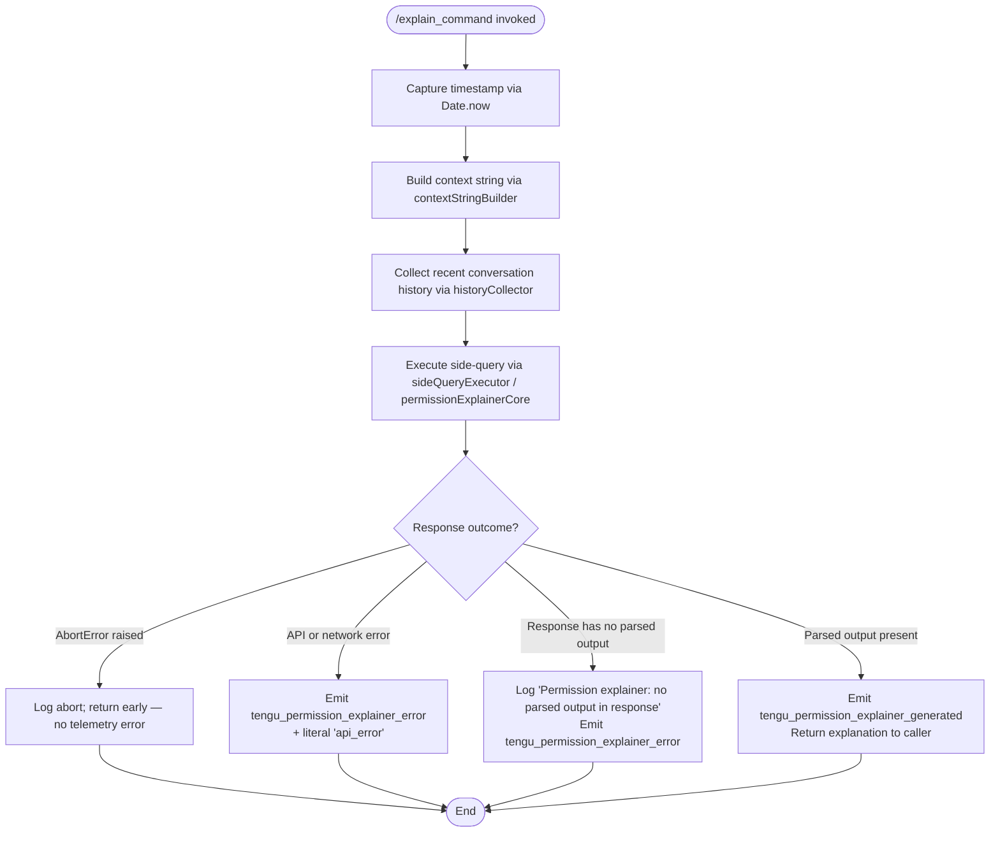

# `/explain_command`

> Analysis basis: CC v2.1.149 bundle.js (AST extraction + Claude interpretation)
> Minimum version: v2.1.149

---

## Overview

`/explain_command` is an internal tool-type slash command that generates a human-readable explanation of a pending tool/permission request in the Claude Code CLI. It invokes a dedicated AI side-query (the "permission explainer") to produce explanatory text, then surfaces either the generated explanation or an error state to the UI. The command is identified internally by the string `"permission_explainer"` and fires specific telemetry events to track success and failure paths.

---

## Registration

| Field | Value |
|---|---|
| type | `tool` |
| name | `explain_command` |
| description | `null` |
| loc_byte | `13760624` |
| loc_byte_end | `13760660` |
| loc_line | `12321` |
| arbor_handler.name | `G1K` |
| arbor_handler.fqn | `claude-2.1.149::G1K` |
| arbor_handler.kind | `AsyncFunction` |
| arbor_handler.resolution_path | `direct` |
| arbor_handler.n_hits | `1` |

Analysis basis: CC v2.1.149 bundle.js:+13760624

---

## Input Branching

The handler has four distinct outcome branches: abort/cancellation, API error, no-parsed-output error, and successful explanation. A Mermaid flowchart is used.



Analysis basis: CC v2.1.149 bundle.js:+13760319 (call to `h_A`), +13760343 (`Date.now`), +13760364 (`KP5`/contextStringBuilder), +13760382 (`LP5`/historyCollector), +13760529 (`Fq`/sideQueryExecutor), +13760542 (`Gx`/permissionExplainerCore), +13761107 (success telemetry), +13761319 (error telemetry), +13761454 (no-parsed-output literal), +13761777 (`AbortError` literal)

---

## Behavioral Spec

### Handler Entry — `permissionExplainerHandler` (G1K)

```
async function permissionExplainerHandler(toolInput, context):
    startTime = Date.now()                            // +13760343

    contextStr   = buildContextString(toolInput)      // KP5, +13760364
    historyItems = collectRecentHistory(context)      // LP5, +13760382

    try:
        response = await executeSideQuery(            // Fq → Gx, +13760529/+13760542
                       contextStr,
                       historyItems,
                       label = "permission_explainer"  // literal, +13760682
                   )

        parsedOutput = extractParsedOutput(response)  // N check, +13760722

        if parsedOutput is null or undefined:
            log("Permission explainer: no parsed output in response")  // +13761454
            emitTelemetry("tengu_permission_explainer_error")           // +13761319
            return errorResult()

        emitTelemetry("tengu_permission_explainer_generated")           // +13761107
        return successResult(parsedOutput)

    catch AbortError:                                  // literal "AbortError", +13761777
        return abortedResult()

    catch apiError:
        emitTelemetry("tengu_permission_explainer_error",               // +13761319
                      { kind: "api_error" })           // literal +13761848
        return errorResult(apiError)
```

Analysis basis: CC v2.1.149 bundle.js:+13760319–+13761813

---

### Context String Builder — `buildContextString` (KP5)

```
function buildContextString(toolInput):
    // Converts tool input to a normalised string representation.
    // Uses JSON serialisation internally (CH → JSON.stringify, +13759829/+182698)
    // and a String() cast (+13759855) with a numeric limit of 2 characters
    // for certain truncation operations (literal 2, +13759839).
    serialised = jsonStringify(toolInput)
    return String(serialised)
```

Analysis basis: CC v2.1.149 bundle.js:+13759829, +13759855, +13759839

---

### History Collector — `collectRecentHistory` (LP5)

```
function collectRecentHistory(conversationContext):
    // Filters conversation turns to "assistant" role only
    // (literal "assistant", +13759918).
    // Reverses to get most-recent-first (A.reverse, +13759963).
    // Takes the last 3 turns (literal 3, +13759938).
    // Limits each turn text to 1000 characters (literal 1000, +13759883).
    // Truncates with "..." trailer (literal "...", +13760119).
    // Joins text segments with newline (q.join, +13760160).
    // Prepends the assembled snippet via q.unshift (+13760127).

    turns = filterByRole(conversationContext, role = "assistant")
    turns = reverse(turns)
    turns = take(turns, limit = 3)
    snippets = []
    for turn in turns:
        text = extractTextContent(turn)   // kind "text", +13760021
        if length(text) > 1000:
            text = text.slice(0, 1000) + "..."
        snippets.unshift(text)
    return join(snippets, separator = "\n")
```

Analysis basis: CC v2.1.149 bundle.js:+13759895, +13759918, +13759938, +13759963, +13760021, +13760106, +13760119, +13760127, +13760160

---

### Side-Query Executor — `executeSideQuery` (Fq → sideQueryCore)

```
async function executeSideQuery(contextStr, historySnippet, label):
    // Delegates to the shared side-query infrastructure (Wt, +2176603).
    // Applies model-normalisation logic (Xg, +2176561):
    //   - strips "anthropic." prefix from model IDs (+2174609)
    //   - recognises aliases: opusplan, sonnet, haiku, opus, best
    //     (+2180463, +2180504, +2180543, +2180582, +2180619)
    //   - maps to concrete model strings (e.g. "claude-3-7-sonnet", etc.)
    // Builds final prompt via promptComposer (QJ/CW, +2176652).
    // Sends request via permissionExplainerCore (Gx, +13760542).
    normalisedModel = normaliseModelAlias(currentModel)
    prompt          = composeExplainerPrompt(contextStr, historySnippet)
    return await permissionExplainerCore(prompt, normalisedModel, label)
```

Analysis basis: CC v2.1.149 bundle.js:+2176603, +2176561, +2174609, +2176652

---

### Permission Explainer Core — `permissionExplainerCore` (Gx)

```
async function permissionExplainerCore(prompt, model, label):
    // 1. Builds API request headers via apiRequestBuilder (Kp, +13038637):
    //    - x-app header (literal, +2906620)
    //    - User-Agent, X-Claude-Code-Session-Id, etc. (+2906648/+2906666)
    //    - Side-query label "side_query" (+13038669)
    //    - prompt-cache control with "1h" TTL (+13039519)
    //
    // 2. Hashes request for deduplication via SHA-256 (PHA, +13038830;
    //    literal "sha256" +12994479, output "hex" +12994506).
    //
    // 3. Checks for in-flight duplicate; skips if already pending (Jf5, +13038821).
    //
    // 4. Streams the API response; collects chunks (Gx → X loop, +13038718).
    //
    // 5. Applies "1h" cache_control ephemeral block to system prompt
    //    (literal "cache_control" +13040611, "1h" +13039519).
    //
    // 6. Records performance metrics: Date.now() before and after
    //    (+13040092), Math.max/round for latency (+13040394/+13040405).
    //
    // 7. Emits tengu_api_success on clean completion (+13040120).
    //
    // 8. Returns structured result containing the streamed model output.

    requestHash = sha256Hex(prompt + model)
    if isDuplicateInFlight(requestHash):
        return awaitExisting(requestHash)
    registerInFlight(requestHash)
    try:
        result = await streamApiRequest(prompt, model, headers, cacheControl="1h")
        emitTelemetry("tengu_api_success")
        return result
    finally:
        deregisterInFlight(requestHash)
```

Analysis basis: CC v2.1.149 bundle.js:+13038637, +13038669, +13038718, +13038722, +13038821, +13038830, +13039202, +13039477, +13039519, +13039712, +13039889, +13039979, +13039995, +13040092, +13040120, +13040394, +13040405, +13040526, +13040544, +13040579

---

### Config / JSONC Reader — `configFileReader` (JOH)

```
function configFileReader(configPath):
    // Called transitively from configAccessor (m6) which is reached
    // from historyCollector (h_A → m6 → JOH).
    // Guards against pre-initialisation access with error
    // "Config accessed before allowed." (+3195654)
    // Reads file as UTF-8 (+3195737).
    // Parses JSONC (strips comments) via jsoncParser (g6/JSON.parse, +3195710/+183438).
    // On ENOENT (+3195884) returns a default object rather than throwing.
    // Records backup copies in "backups" sub-directory (+3195222)
    // timestamped via Date.now() (+3196775), using q.copyFileSync (+3196793).
    // Creates directory on EEXIST guard (+3196499) via q.mkdirSync (+3196464).
    if not configAllowed:
        throw Error("Config accessed before allowed.")
    raw = fs.readFileSync(configPath, "utf-8")
    return parseJsonc(raw)
```

Analysis basis: CC v2.1.149 bundle.js:+3195648, +3195654, +3195710, +3195737, +3195884, +3195222, +3196285, +3196464, +3196499, +3196775, +3196793

---

## State & Side Effects

| Item | Detail |
|---|---|
| Telemetry — success | `tengu_permission_explainer_generated` (bundle.js:+13761107) |
| Telemetry — error | `tengu_permission_explainer_error` (bundle.js:+13761319) |
| Telemetry — API layer | `tengu_api_success` (bundle.js:+13040120) |
| Telemetry — config error | `tengu_config_parse_error` (bundle.js:+3196285) |
| Telemetry — OAuth (transitive) | `tengu_oauth_token_refresh_*` family (bundle.js:+2947980–+2949644) |
| Telemetry — watchdog (transitive) | `tengu_byte_watchdog_fired_late` (bundle.js:+2913933), `tengu_stream_watchdog_default_on` (bundle.js:+2914663) |
| Side-query label written to headers | `"permission_explainer"` (bundle.js:+13760682) |
| Prompt-cache control | 1-hour ephemeral cache block appended to system content (bundle.js:+13039519, +13040611) |
| Config backup files | Written to `backups/` subdirectory on config read (bundle.js:+3195222, +3196793) |
| appState changes | None observed at depth ≤ 2 from G1K directly; display of the explanation is managed by the calling UI layer |
| Sound | None observed in call graph |
| Hook registration | `a9` → `W7A.register` reached transitively via `Et4` (bundle.js:+58272); relates to file-watch registration inside config layer, not directly tied to the command UI |
| AbortError handling | Caught explicitly; command exits cleanly without error telemetry (bundle.js:+13761777) |

---

## Version History

| Version | Change |
|---|---|
| v2.1.149 | Initial analysis |

---

## Common Mistakes

1. **Assuming the command takes user-visible arguments.** The registration `description` is `null` and the command is typed `tool`, meaning it is invoked programmatically by the UI permission-prompt layer, not directly by end users typing `/explain_command`.
2. **Expecting synchronous output.** The handler is an `AsyncFunction` (`arbor_handler.kind`) that performs a live API side-query; callers must await the result and handle the `AbortError` branch.
3. **Confusing the telemetry event names.** On success the event is `tengu_permission_explainer_generated`; on failure it is `tengu_permission_explainer_error`. The suffix `_error` does *not* imply the whole command failed — an abort produces *neither* event.
4. **Ignoring the "no parsed output" path.** A valid API response that contains no parseable structured block will trigger `tengu_permission_explainer_error` and return an empty result, not an exception; callers should handle this gracefully.
5. **Expecting history to include all roles.** The history collector filters strictly to `"assistant"` role turns, capped at 3, with a 1000-character per-turn limit; user turns are not included in the explainer context.

---

## Appendix — Identifier Mapping

> For bundle debugging only. Identifiers change across versions.

| Identifier | Role |
|---|---|
| `G1K` | Main async handler for `/explain_command` (`permissionExplainerHandler`) |
| `h_A` | Config/context accessor called at handler entry |
| `m6` | Config reader / conversation-state accessor |
| `Q6` | Utility: likely a shared guard/validator |
| `Af_` | Utility called from config reader |
| `JOH` | JSONC config file reader with backup logic |
| `g6` | JSONC parser wrapper (delegates to JSON.parse) |
| `xC` | String prefix-stripper utility |
| `K8` | Called from config reader; role unclear at depth 2 |
| `mb9` | Directory/file resolver for config backups |
| `N` | Multi-purpose: language/model detection helper; also used in several layers |
| `Of_` | Path join helper for backup directory |
| `Et4` | File-watch setup for config reload |
| `rn` | Called from file-watcher setup; role unclear at depth 2 |
| `a9` | Watch-registration wrapper (calls `W7A.register`) |
| `KP5` | Context string builder |
| `CH` | JSON.stringify wrapper |
| `LP5` | Recent-history collector |
| `Fq` | Side-query executor / model-normalisation entry |
| `Wt` | Side-query core dispatcher |
| `wv` | Side-query sub-utility |
| `gAH` | Side-query sub-utility |
| `Xg` | Model normalisation logic |
| `Yc6` | Model-properties lookup (Object.entries-based) |
| `ppH` | Model inclusion check |
| `Y79` | Model alias resolver |
| `JI4` | Model feature-flag checker |
| `GqH` | Model allowlist checker |
| `nq` | Model string normaliser (lowercase, replace, alias map) |
| `XI4` | Extended model identifier handler |
| `QJ` | Prompt composer entry |
| `CW` | Prompt component assembler |
| `EA` | Prompt part: auth/provider segment |
| `Zt` | Prompt part: plan-tier segment (max) |
| `L$H` | Prompt part: team/max-5x segment |
| `FpH` | Prompt part: enterprise segment |
| `GZ` | Prompt assembly helper |
| `$P` | Prompt part: first-party provider segment |
| `Z3` | Prompt utility: route assembler |
| `RA` | Base route/provider resolver |
| `cf` | Prompt component: combined route finaliser |
| `cv` | Prompt utility combining Z3+cf |
| `Gx` | Permission-explainer core (API streaming entry) |
| `Kp` | API request builder / main HTTP request orchestrator |
| `FD` | AsyncLocalStorage getter for request context |
| `Xl4` | URL parser utility |
| `bq` | Background-mode header helper |
| `Fn` | Context-store accessor |
| `gl6` | Secondary context-store getter |
| `S6` | Session/config helper |
| `Dv` | Low-level dependency (40447) |
| `y8_` | URL-encoding helper (encodeURIComponent) |
| `mH` | String coercion utility |
| `t$` | OAuth token acquisition entry |
| `wL_` | OAuth token refresh / lock logic |
| `W79` | Boolean coercion helper |
| `dD` | Auth credential resolver |
| `K4` | Credential sub-helper |
| `ev` | Credential strategy evaluator |
| `yO` | Route-based auth resolver |
| `hJ` | Auth storage accessor |
| `e$` | Full auth resolution with API key / OAuth logic |
| `O1H` | Auth object formatter |
| `G$` | Config getter |
| `jl4` | Request-sending pipeline |
| `TBH` | Response timing tracker |
| `y_` | Config value helper |
| `Mg6` | Proxy-auth helper executor |
| `R0H` | Proxy config reader |
| `tgA` | Proxy config sub-reader |
| `lO4` | Timeout parser (parseInt + NaN guard) |
| `nC` | Proxy-related config normaliser |
| `sX` | Proxy helper sub-utility |
| `Gl4` | HTTP request wrapper with retry/streaming |
| `w5` | Request sub-utility |
| `Tl4` | Response-header inspector |
| `Wl4` | Request metadata assembler |
| `s7_` | Numeric clamp utility (Math.max + Number) |
| `Pl4` | Stream watchdog / chunk-timing enforcer |
| `UD` | Model-to-provider mapper |
| `Oc6` | Provider object builder |
| `mZ4` | Model-ID prefix checker |
| `$c6` | Case-insensitive provider lookup |
| `zY` | Proxy URL resolver |
| `fn` | URL parser/validator |
| `np6` | Proxy credential cache |
| `egA` | Proxy sub-utility |
| `Jl4` | Fetch/send request entry |
| `sa6` | Serialisation and send helper |
| `Jv` | JSON body serialiser |
| `SCH` | Send sub-utility |
| `V2H` | Tool-invocation format validator |
| `h9` | OAuth endpoint validator |
| `Y$H` | Gateway JWT refresh logic |
| `KC8` | Gateway refresh sub-utility |
| `wk4` | Gateway token fetch/post |
| `wh6` | Gateway helper |
| `qC8` | Timestamp utility |
| `H36` | Header entry normaliser |
| `HOH` | SDK error logger |
| `C` | HTTP/TLS connection manager |
| `LXK` | Realpath/stat resolver |
| `Dz` | Connection sub-utility |
| `RH` | Error/retry handler with logging |
| `yk5` | Connection helper |
| `z` | Output stream wrapper |
| `h` | Away-summary / blur-handler |
| `tg` | Away-summary trigger helper |
| `I` | Away-summary generator |
| `V` | Rate-limit checker |
| `ZLK` | Away-summary sub-utility |
| `Z` | Generic async task tracker |
| `Rj` | Auth retry wrapper |
| `apH` | WIF (Workload Identity Federation) credentials helper |
| `Pn6` | WIF token exchange |
| `bH` | Feature-flag OK emitter |
| `uH` | Feature-flag bad emitter |
| `Pk4` | WIF inclusion checker |
| `G` | Keyboard / remote-control event handler |
| `b` | Event sub-utility |
| `FW` | User-settings accessor |
| `Y` | Terminal session controller |
| `X` | IPC socket reader |
| `J` | IPC stream accessor |
| `zM` | IPC write helper |
| `zk5` | Daemon/worker session manager (large multiplex handler) |
| `Yk5` | Session sub-helper |
| `$` | IPC write stream |
| `YY` | Background service identifier |
| `RqA` | IPC rate-control utility |
| `uJK` | IPC timeout/retry controller |
| `r8` | Promise-with-timeout utility |
| `P` | Repaint / terminal renderer |
| `FT` | File path joiner with normalisation |
| `E$` | Realpath normaliser |
| `WfH` | File-read interface builder |
| `$k5` | Session stall timer |
| `x` | Write-with-timeout helper |
| `E_H` | Session phase helper |
| `bK` | Session log path builder |
| `Ok5` | Session lifecycle manager |
| `s` | Voice recording toggle handler |
| `m` | Idle-exit timer |
| `t` | Voice focus handler |
| `W` | Skills/tool-set updater |
| `g` | MCP tool filter |
| `B` | MCP tool set builder |
| `l` | Listener filter |
| `r` | Stream pipe helper |
| `d` | Duplex stream connector |
| `Jk6` | IPC message writer |
| `T` | Terminal renderer dispatcher |
| `EH` | String coercion wrapper (String()) |
| `kTH` | Model-context validator |
| `Xq` | Prompt content normaliser |
| `xj` | Model name lowercaser/replacer |
| `UC8` | Content-part validator |
| `OP` | Text replacement utility |
| `sh` | Provider shorthand resolver |
| `Jf5` | In-flight deduplication checker |
| `PHA` | SHA-256 hash builder |
| `dl6` | Cache-control block appender |
| `t1` | String coercion sub-utility |
| `he6` | Route segment builder |
| `ovH` | Prompt-cache 1h config writer |
| `xC8` | Cache-control sub-utility |
| `V6` | Conversation-state writer (lg map) |
| `_$6` | State map sub-utility |
| `A$6` | State map sub-utility |
| `we` | State entry builder |
| `we6` | State deduplication guard (FM_ set) |
| `uC8` | Cache-control helper |
| `vZ` | Route + model combiner |
| `KL_` | Route builder helper |
| `ja1` | Message formatter |
| `Ks6` | Temperature/sampling param assembler |
| `G2` | Message array mapper |
| `VzH` | Full prompt/message assembler |
| `$p` | Conversation-state snapshot writer |
| `f8` | Global config writer with auth-loss guard |
| `R5` | Auth + state combined resolver |
| `jMH` | Telemetry metadata helper |
| `hVH` | Agent context builder |
| `rW7` | Agent ID resolver |
| `dKH` | Agent ID sub-utility |
| `W4` | Agent label formatter |
| `rQ` | Agent type classifier |
| `iW7` | Builtin/custom agent prefix stripper |
| `z18` | Agent prefix sub-utility |
| `VX_` | Agent name slicer |
| `RHH` | Agent type prefix checker |
| `HA6` | Agent context finaliser |
| `rq` | MCP tool name validator |
| `_8` | Low-level config writer |

---

Note: index built via Arbor fallback; some signals (telemetry, literals) may be missing — see arbor-fallback.js.