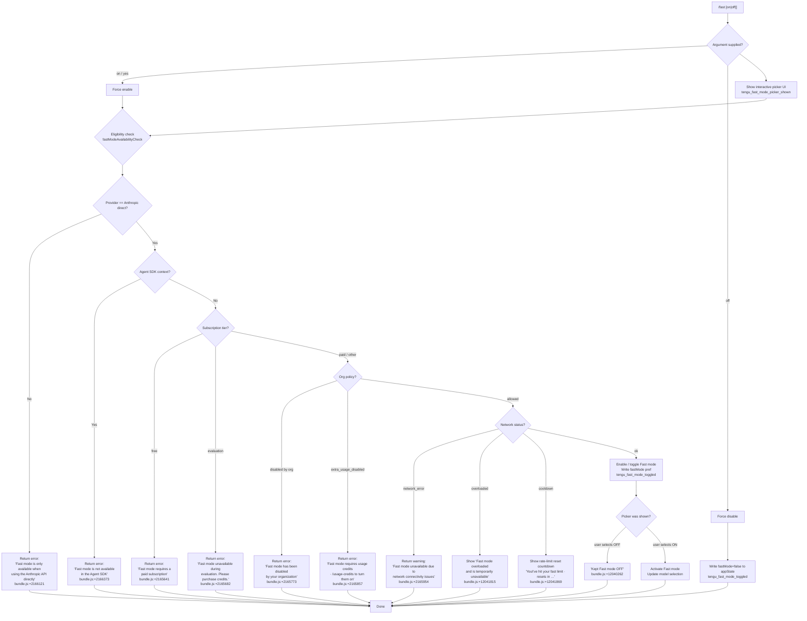

# `/fast`

> Analysis basis: CC v2.1.149 bundle.js (AST extraction + Claude interpretation)
> Minimum version: v2.1.149

---

## Overview

The `/fast` command toggles "Fast mode" (a research preview feature) on or off within a Claude Code session. When invoked without an argument it presents an interactive picker UI showing Fast mode's current availability, usage limits, and relevant status messages; when invoked with `on` or `off` it applies the change directly. The command is gated by API-plan, provider type, and organizational policy before writing the preference to app state.

---

## Registration

| Field | Value |
|---|---|
| type | `local-jsx` |
| name | `fast` |
| description | `Toggle fast mode ( ... )` |
| argumentHint | `[on\|off]` |
| immediate | `null` |
| thinClientDispatch | `control-request` |
| isHidden | `null` |
| module_id | `iu1` |
| load_inline | `true` |
| loc_byte | `12043563` |
| loc_byte_end | `12043835` |
| loc_line | `9758` |
| arbor_handler.name | `qH5` |
| arbor_handler.fqn | `claude-2.1.149::qH5` |
| arbor_handler.kind | `AsyncFunction` |
| arbor_handler.resolution_path | `module_id` |
| arbor_handler.n_hits | `3` |

Analysis basis: CC v2.1.149 bundle.js:+12043563

---

## Input Branching

Five or more distinct runtime paths exist (argument value, API provider type, subscription tier, organizational policy, and network availability), so a Mermaid flowchart is used.



---

## Behavioral Spec

### 1. Entry Point — Handler (`qH5`)

The top-level async handler (`qH5`, resolved via `module_id → iu1`; `arbor_handler.n_hits = 3`) is the command's primary entry point.

```
async function fastCommandHandler(args, appState):
    argument = args.trim().toLowerCase()   // "on", "off", or ""

    // Pre-flight: check Fast mode availability (see §2)
    availability = await fastModeAvailabilityCheck(appState)

    if argument == "off":
        writeFastModePref(false, appState)
        emitTelemetry("tengu_fast_mode_toggled", { enabled: false })
        return renderStatusLine("Fast mode OFF")   // literal bundle.js:+12039300

    if argument in ["on", "yes"]:           // literals bundle.js:+26948, +26954
        if not availability.ok:
            return renderError(availability.reason)
        writeFastModePref(true, appState)
        emitTelemetry("tengu_fast_mode_toggled", { enabled: true })
        return renderStatusLine("Fast mode ON")

    // No argument → interactive picker
    emitTelemetry("tengu_fast_mode_picker_shown")
    result = await showFastModePicker(availability, appState)
    applyPickerResult(result, appState)
```

Analysis basis: CC v2.1.149 bundle.js:+12042606

---

### 2. Availability Check (`Jt` / `fastModeAvailabilityCheck`)

Invoked by the handler to determine whether Fast mode may be enabled.

```
function fastModeAvailabilityCheck(appState):
    provider = getProviderKind(appState)
    // Known provider values: "bedrock", "foundry", "anthropicAws",
    // "mantle", "vertex", "firstParty"  (bundle.js:+2035544…+2035761)

    if provider != "firstParty":
        return { ok: false, reason: "Fast mode is only available when using the Anthropic API directly" }
        // bundle.js:+2166121

    if isAgentSDKContext(appState):
        return { ok: false, reason: "Fast mode is not available in the Agent SDK" }
        // bundle.js:+2166373

    tier = getSubscriptionTier(appState)
    if tier == "free":
        return { ok: false, reason: "Fast mode requires a paid subscription" }
        // bundle.js:+2165641
    if tier == "evaluation":
        return { ok: false, reason: "Fast mode unavailable during evaluation. Please purchase credits." }
        // bundle.js:+2165682

    orgPolicy = getOrgFastModePolicy(appState)
    if orgPolicy == "preference":   // disabled by org admin
        // bundle.js:+2165754
        return { ok: false, reason: "Fast mode has been disabled by your organization" }
        // bundle.js:+2165773
    if orgPolicy == "extra_usage_disabled":
        // bundle.js:+2165828
        return { ok: false, reason: "Fast mode requires usage credits · /usage-credits to turn them on" }
        // bundle.js:+2165857

    networkStatus = getFastModeNetworkStatus(appState)
    if networkStatus == "network_error":
        emitTelemetry("tengu_penguins_off")   // bundle.js:+2166227
        return { ok: false, reason: "Fast mode unavailable due to network connectivity issues" }
        // bundle.js:+2165954
    if networkStatus == "unavailable":
        return { ok: false, reason: "Fast mode is currently unavailable" }
        // bundle.js:+2166033

    return { ok: true, networkStatus: networkStatus }
```

Analysis basis: CC v2.1.149 bundle.js:+2166089

---

### 3. Interactive Picker UI (`kZ8` / `showFastModePicker`)

When no argument is supplied the JSX component renders a multi-row picker terminal UI.

```
function showFastModePicker(availability, appState):
    // Labelled " Fast mode (research preview)"  bundle.js:+12040867
    // Keyboard bindings surfaced:
    //   escape → cancel      bundle.js:+12041060
    //   tab    → toggle      bundle.js:+12041139
    //   enter  → confirm     bundle.js:+12041190

    currentState = appState.fastMode   // boolean

    rows = buildPickerRows([
        { label: "Fast mode", value: "ON ",  selected: currentState == true  },
        //                                    bundle.js:+12041643
        { label: "Fast mode", value: "OFF",  selected: currentState == false },
        //                                    bundle.js:+12041649
    ])

    // Status annotations overlaid on rows:
    if availability.networkStatus == "overloaded":
        annotate("warning", "Fast mode overloaded and is temporarily unavailable")
        // bundle.js:+12041815
    if availability.networkStatus == "cooldown":
        resetTime = computeResetCountdown(appState.fastLimitResetAt)
        annotate("info", "You've hit your fast limit · resets in " + resetTime)
        // bundle.js:+12041869, +12041898

    selection = awaitKeyboardInput(rows)

    if selection == "OFF" and previousState == "OFF":
        return { action: "kept_off", message: "Kept Fast mode OFF" }
        // bundle.js:+12040262

    // Documentation link shown in footer
    // https://code.claude.com/docs/en/fast-mode  bundle.js:+12042089

    return { action: selection }
```

Analysis basis: CC v2.1.149 bundle.js:+12039453

---

### 4. Fast Mode Prefetch (`mpH` / `fastModePrefetch`)

An async prefetch function is called early to warm the availability cache before the picker is displayed.

```
async function fastModePrefetch(appState):
    if prefetchInFlight:
        log("Fast mode prefetch in progress, returning in-flight promise")
        // bundle.js:+2169785
        return inFlightPromise

    lastFetchAge = Date.now() - lastPrefetchTimestamp
    if lastFetchAge < RECENT_THRESHOLD:
        log("Skipping fast mode prefetch, fetched recently")
        // bundle.js:+2170032
        return

    auth = await getAuth(appState)
    if not auth:
        log("No auth available")   // bundle.js:+2170208
        return

    try:
        response = await callFastModeStatusEndpoint(auth)
        // Uses header "anthropic-beta"  bundle.js:+2169384
        // Uses header "x-api-key"       bundle.js:+2169406
        storeFastModeAvailability(response)
        emitEvent("T8_.emit", response)   // bundle.js:+2170835

    catch error if isAxiosError(error):
        if error.status == 401:   // bundle.js:+2170343
            handleOAuth401Recovery(appState)
        if error.status == 403:   // bundle.js:+2170369
            if error.message.includes("OAuth token has been revoked"):
                // bundle.js:+2170435
                invalidateOAuthToken(appState)
        storeFastModeStatus("network_error")
        emitTelemetry("tengu_org_penguin_mode_fetch_failed")   // bundle.js:+2171204

    catch error:
        storeFastModeStatus("network_error")
```

Analysis basis: CC v2.1.149 bundle.js:+2169702

---

### 5. Cooldown / Rate-limit Timer (`G8_` / `fastModeCooldownWatcher`)

A background watcher re-enables Fast mode after its rate-limit window expires.

```
function fastModeCooldownWatcher(appState):
    // State label: "cooldown"  bundle.js:+2167291
    now = Date.now()
    if now >= appState.fastLimitResetAt:
        log("Fast mode cooldown expired, re-enabling fast mode")
        // bundle.js:+2167344
        kK(appState, { fastMode: true })   // write pref
        notifyUI("t49.emit")               // bundle.js:+2167404
```

Analysis basis: CC v2.1.149 bundle.js:+2167303

---

### 6. Config Persistence (`f8` / `saveGlobalConfig` and `$f_` / `saveConfigWithLock`)

Fast mode preference is persisted to the global config file under a file lock to prevent concurrent corruption.

```
async function saveConfigWithLock(config):
    // Acquires lock; warns if contention detected
    // "Lock acquisition took longer than expected …"  bundle.js:+3193621
    emitTelemetry("tengu_config_lock_contention") if slow

    reRead = readConfigFromDisk()
    if reRead.auth missing and cache.auth present:
        // Safety: refuse write to avoid wiping auth
        // bundle.js:+3194037
        emitTelemetry("tengu_config_auth_loss_prevented")
        return

    // Rotate backups (max 5 kept)  bundle.js:+3194640
    writeAtomically(config)
    // Max backup age: 60000 ms  bundle.js:+3194391
```

Analysis basis: CC v2.1.149 bundle.js:+3190712

---

### 7. Fast Mode Status Display in UI (status line, `IZ8` / `renderFastModeStatusLine`)

The `enabled (cached)` and `disabled (network_error)` status strings are displayed in the prompt border region.

```
function renderFastModeStatusLine(appState):
    status = appState.fastModeStatus
    if status == "enabled":
        return "enabled (cached)"     // bundle.js:+2171131
    if status == "network_error":
        return "disabled (network_error)"   // bundle.js:+2171150
    // No status string shown otherwise
```

Analysis basis: CC v2.1.149 bundle.js:+12039044

---

### 8. Reset Countdown Formatter (`Hq` / `formatTimeRemaining`)

Used to display the rate-limit reset countdown in the picker and prompt border.

```
function formatTimeRemaining(milliseconds):
    if milliseconds <= 0:
        return "0s"   // bundle.js:+207431
    days    = floor(ms / 86400000)   // bundle.js:+207536
    hours   = floor(remainder / 3600000)   // bundle.js:+207570
    minutes = floor(remainder / 60)        // bundle.js:+207643
    seconds = remainder
    return composeReadableString(days, hours, minutes, seconds)
```

Analysis basis: CC v2.1.149 bundle.js:+207484

---

## State & Side Effects

| Item | Detail |
|---|---|
| Telemetry: `tengu_fast_mode_toggled` | Fired on every confirmed on/off toggle (bundle.js:+12039129) |
| Telemetry: `tengu_fast_mode_picker_shown` | Fired when picker UI is displayed (no explicit `on`/`off` arg) (bundle.js:+12042829) |
| Telemetry: `tengu_penguins_off` | Fired when Fast mode is blocked by network error (bundle.js:+2166227) |
| Telemetry: `tengu_org_penguin_mode_fetch_failed` | Fired when the Fast mode status endpoint call fails (bundle.js:+2171204) |
| Telemetry: `tengu_config_lock_contention` | Fired when config file lock takes longer than expected (bundle.js:+3193710) |
| Telemetry: `tengu_config_stale_write` | Fired when a stale config write is detected (bundle.js:+3193846) |
| Telemetry: `tengu_config_auth_loss_prevented` | Fired when a write is refused to protect auth (bundle.js:+3194189) |
| Telemetry: `tengu_config_parse_error` | Fired on config JSON parse failure (bundle.js:+3196285) |
| Telemetry: `tengu_feature_ok` / `tengu_feature_bad` / `tengu_feature_sad` | Feature flag evaluation events (bundle.js:+963421, +963479, +963556) |
| appState changes | `fastMode` boolean written via `kK`; model selection may switch to `claude-opus-4-6` / `opus` in Fast mode (bundle.js:+2166913, +2166931) |
| Config file | Preference written to `~/.claude/settings.json` (or `settings.local.json`) under atomic file lock; up to 5 backups retained |
| Hook registration | `a9` registers a handler with `W7A` (bundle.js:+58272); cooldown watcher registered via event emitter `t49` (bundle.js:+2167404) |
| Sound | None observed |
| thinClientDispatch | `control-request` — command is dispatched as a control request in thin-client (thinClientDispatch) mode |

---

## Version History

| Version | Change |
|---|---|
| v2.1.149 | Initial analysis |

---

## Common Mistakes

1. **Using `/fast` with Bedrock / Vertex / Foundry providers** — Fast mode is restricted to the Anthropic API directly (`firstParty`). Invoking `/fast on` on any other provider returns the "Fast mode is only available when using the Anthropic API directly" error (bundle.js:+2166121).
2. **Expecting `/fast` to work on a free-tier account** — A paid subscription is required; free-tier users see "Fast mode requires a paid subscription" (bundle.js:+2165641).
3. **Ignoring the cooldown state** — After hitting the Fast mode usage limit the command does not fail silently; it shows a countdown. Toggling it off and back on does not reset the server-side limit.
4. **Using `/fast on` inside an Agent SDK session** — The Agent SDK context blocks Fast mode entirely (bundle.js:+2166373); no workaround exists at the command level.
5. **Assuming immediate persistence** — The config write uses an atomic file lock; if another Claude instance holds the lock, writes may be delayed or skipped to protect auth integrity (bundle.js:+3194037).

---

## Appendix — Identifier Mapping

> For bundle debugging only. Identifiers change across versions.

| Identifier | Role |
|---|---|
| `qH5` | Top-level async handler for `/fast` command (arbor primary handler) |
| `kK` | App-state writer — persists key/value pairs to in-memory appState |
| `RA` | Provider/model resolution helper |
| `mH` | String coercion / safe-string utility |
| `Jt` | Fast mode availability check orchestrator |
| `V6` | Feature-flag / experiment evaluation dispatcher |
| `_$6` | Feature-flag set operation A |
| `A$6` | Feature-flag set operation B |
| `we` | Feature-flag read helper |
| `Gb` | Growthbook client accessor |
| `we6` | Feature-flag cache lookup with fallback |
| `BM_` | Growthbook experiment event emitter |
| `cM_` | Feature-flag result composer |
| `m6` | Config file read-with-backup helper |
| `Q6` | Async queue / task scheduler |
| `Af_` | Config access guard (throws "Config accessed before allowed") |
| `JOH` | Low-level config file I/O (read, backup, mkdir, copy) |
| `Et4` | File watcher for config reload |
| `N` | Transcript / logging write helper |
| `MVK` | Debug-level log formatter |
| `T7A` | Terminal log renderer |
| `CH` | JSON serialiser wrapper |
| `X4` | Log-line redaction helper (`[REDACTED]`) |
| `s5A` | Header-map builder |
| `HbH` | stdout write helper |
| `B5A` | Raw terminal write |
| `OVK` | Async append-file logger with rotation |
| `ICH` | Debounced log flush / timer manager |
| `q9H` | Log file path builder |
| `G96` | Filesystem error code handler (`EISDIR`) |
| `LMA` | Log directory path resolver |
| `KMA` | Log file rotation (rename `.txt` → `.txt.4`, etc.) |
| `$VK` | Append-to-file writer with rotation |
| `a9` | Event-listener registration (W7A hook) |
| `y_` | VS Code extension environment detector |
| `GCH` | VS Code / `claude-vscode` environment guard |
| `wC` | Auth-type resolver (`oauth` / `api-key`) |
| `p8` | Config loader entry point |
| `gp6` | Settings cache lookup |
| `n4A` | Settings cache get |
| `Pl8` | Policy + flag settings merger |
| `i4A` | Settings cache set |
| `rF` | Settings object factory |
| `j_` | WSL environment detector |
| `jA6` | `policySettings` key |
| `sR8` | Settings schema validator |
| `zA6` | Settings migration helper |
| `J2H` | Settings default applier |
| `JA6` | `flagSettings` key |
| `BfH` | Settings diff reporter |
| `FfH` | Settings write guard |
| `zl8` | Settings cache invalidator |
| `AZA` | Settings merge strategy selector |
| `sl` | Settings file path selector |
| `I46` | WSL path resolver |
| `P8_` | Fast mode preference writer |
| `KI4` | Auth token refresh coordinator |
| `mpH` | Fast mode status prefetch (network call) |
| `G1` | Token/auth accessor |
| `Z2A` | String-safe token extractor |
| `Rj` | API request builder |
| `e$` | Anthropic HTTP client |
| `K4` | Safe-string wrapper for API use |
| `HN` | API request executor |
| `M36` | Request middleware chain |
| `hJ` | Request header injector |
| `TL6` | File-descriptor token reader |
| `th` | Token truncator (first 20 chars) |
| `XZ` | Array / include check helper |
| `fI4` | OAuth access-token extractor |
| `h9` | OAuth endpoint builder |
| `jPA` | OAuth base URL selector |
| `InK` | OAuth environment classifier |
| `cm` | In-flight request deduplicator (OL_ map) |
| `il4` | OAuth 401 recovery orchestrator |
| `qOH` | OAuth token revocation checker |
| `AA6` | OAuth SDK callback invoker |
| `bH` | `tengu_feature_ok` emitter |
| `uH` | `tengu_feature_bad` emitter |
| `wn` | File-descriptor token reader (OAuth) |
| `FK` | Keychain token reader |
| `$s` | Refresh-token reader |
| `DA6` | OAuth token refresher |
| `RH` | OAuth token writer / updater |
| `t$` | OAuth keychain writer |
| `_A` | Settings save orchestrator |
| `o$` | Settings file path + writer |
| `dfH` | Settings file path builder |
| `oX` | Gitignore-aware file checker |
| `il` | File reader with encoding |
| `j8` | Error code classifier (`EISDIR`, `ENOENT`) |
| `K8` | Filesystem error classifier |
| `Ec8` | Settings timestamp updater |
| `M0H` | Settings file path composer |
| `Fp6` | Resolved settings path builder |
| `UK6` | Atomic file writer (temp + rename) |
| `O` | Symbolic-link checker |
| `M` | File handle manager |
| `CY` | Settings cache clearer |
| `im6` | Gitignore rule applier |
| `x6` | Git executable locator |
| `Lc8` | Git check-ignore runner |
| `nm6` | Git check-ignore path builder |
| `FaK` | Path normaliser (home-dir expansion) |
| `fTA` | Git ls-files runner |
| `$TA` | Git ls-files result classifier |
| `BC` | `.claude/settings.json` path constant |
| `_8` | `tengu_feature_sad` emitter |
| `hm` | Settings load-from-disk orchestrator |
| `DC` | `loadSettingsFromDisk_start` log emitter |
| `Tq` | Memory usage sampler |
| `Wl8` | Settings file watcher / loader |
| `cy6` | `loadSettingsFromDisk_end` log emitter |
| `f8` | Global config save (fallback path) |
| `$f_` | Config save with file lock |
| `L` | Filesystem wrapper (mkdirSync, statSync, etc.) |
| `_L9` | Config object merger |
| `f$6` | Config pre-save validator |
| `Of_` | Backup directory path builder |
| `V` | Filename prefix checker |
| `P` | Main process / daemon coordinator |
| `Z` | Backup file slicer |
| `OFH` | Config pre-save hook |
| `ub9` | Config entry iterator |
| `zFH` | Config save timestamp recorder |
| `ff_` | Config save without lock (direct path) |
| `K` | Model name padder / formatter |
| `IZ8` | Fast mode UI renderer (JSX entry) |
| `NZ8` | Flag-setting applicator (`apply_flag_settings`) |
| `A$H` | App-state flag reader |
| `ck` | `ccr` environment flag reader |
| `H$` | Remote session flag reader |
| `upH` | Model display-name builder (Opus 4.6 / 4.7) |
| `jn` | Model short-name formatter |
| `$P` | Model availability state accessor |
| `uXH` | Feature-flag shape parser (cacheBreakerPhrase, autoCompactWindow, etc.) |
| `BD` | Command argument dispatcher |
| `CW` | Model picker state machine |
| `nq` | Model name normaliser (opusplan, sonnet, haiku, best) |
| `xXH` | Full fast-mode UI panel renderer |
| `Ve` | Theme colour resolver |
| `C$6` | Colour mode selector (`dark`, `auto`) |
| `JH8` | Colour palette inclusion check |
| `TOH` | ANSI escape prefix stripper |
| `su9` | Fallback colour applicator |
| `qL` | Prompt-border renderer |
| `Nm` | Active-server set updater |
| `hA` | Foreground colour token parser |
| `yOH` | ANSI / hex / rgb colour dispatcher |
| `sg` | Styled-string composer |
| `dm` | Model display label builder |
| `WZ` | Numeric formatter (toFixed / integer check) |
| `O79` | Duration formatter (integer / decimal) |
| `o0H` | App-state accessor for fast mode status |
| `kZ8` | Fast mode interactive picker component |
| `J6` | Zustand store subscriber (useSyncExternalStore) |
| `Tz_` | AppState context reader |
| `zA` | AppState subscribe helper |
| `G8_` | Fast mode cooldown watcher / re-enabler |
| `$` | Daemon status reader |
| `_Q1` | Daemon status file path builder (`daemon.status.json`) |
| `Pn` | Prompt sanitiser |
| `vqH` | Whitespace trimmer for prompts |
| `A1` | AsyncLocalStorage store accessor |
| `$v6` | Daemon status file path composer |
| `fA` | MCP server registry hook |
| `mw` | MCP context accessor |
| `f` | MCP server state manager |
| `UyH` | MCP server connection lifecycle manager |
| `j6H` | MCP transport factory |
| `bN` | MCP server metadata builder |
| `t8` | MCP tool-list cache |
| `HE6` | MCP error classifier |
| `vkL` | MCP connection retry scheduler |
| `h78` | MCP server health checker |
| `k78` | MCP keychain token reader |
| `z8` | MCP debug logger |
| `hB_` | MCP OAuth flow initiator |
| `SB_` | MCP OAuth callback handler |
| `IY1` | MCP post-auth tool-list fetcher |
| `kB_` | MCP connection teardown |
| `lT_` | MCP file-based transport handler |
| `j` | MCP child-process registry |
| `y` | MCP output-stream writer |
| `CL` | MCP error logger |
| `EH` | Error string coercer |
| `ZY1` | MCP server list renderer |
| `_E6` | MCP numeric parser A |
| `NF_` | MCP numeric parser B |
| `QDK` | MCP server update applier |
| `ZW8` | MCP update serialiser |
| `OI` | MCP server cleanup orchestrator |
| `nv5` | MCP server sync / reconciler |
| `R78` | MCP server filter (bm7 / xm7 sets) |
| `r8` | Abort-controller / timeout wrapper |
| `ytH` | MCP server state serialiser |
| `Hq` | Time-remaining countdown formatter |

---

Note: index built via Arbor fallback; some signals (telemetry, literals) may be missing — see arbor-fallback.js.