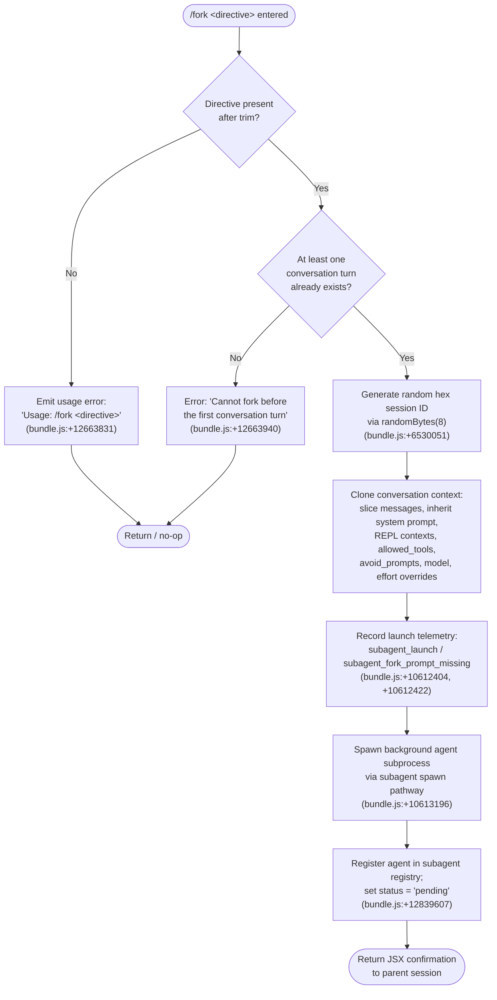

# `/fork`

> Analysis basis: CC v2.1.149 bundle.js (AST extraction + Claude interpretation)
> Minimum version: v2.1.149

---

## Overview

`/fork` spawns a background agent that inherits a full copy of the current conversation context, then executes autonomously under the given directive. The parent session continues uninterrupted while the forked agent runs as an independent subprocess. The command is gated: it cannot be used before the first conversation turn has completed.

---

## Registration

| Field | Value |
|---|---|
| type | `local-jsx` |
| name | `fork` |
| description | Spawn a background agent that inherits the full conversation |
| argumentHint | `<directive>` |
| module_id | `an1` |
| load_inline | `true` |
| loc_byte | `12664203` |
| loc_byte_end | `12664399` |
| loc_line | `10756` |
| arbor_handler.name | `I75` |
| arbor_handler.fqn | `claude-2.1.149::I75` |
| arbor_handler.kind | `AsyncFunction` |
| arbor_handler.resolution_path | `module_id` |
| arbor_handler.n_hits | `0` |

Analysis basis: CC v2.1.149 bundle.js:+12664203

---

## Input Branching

The handler has three distinct paths depending on directive presence and conversation state, so a Mermaid flowchart is used.



---

## Behavioral Spec

### 1. Directive Validation

```
function validateDirective(rawInput):
    directive = rawInput.trim()          // bundle.js:+12663807
    if directive is empty:
        return UsageError("Usage: /fork <directive>")
    return directive
```

Analysis basis: CC v2.1.149 bundle.js:+12663807, +12663831

### 2. Pre-flight Conversation Guard

```
function guardConversationExists(conversationMessages):
    // Fork requires at least one completed turn so that
    // the forked agent has meaningful context to inherit.
    if conversationMessages has no prior turn:
        throw Error("Cannot fork before the first conversation turn")
        // bundle.js:+12663940
```

Analysis basis: CC v2.1.149 bundle.js:+12663940

### 3. Session ID Generation

```
function generateForkSessionId():
    // 8 random bytes encoded as 16 hex characters
    rawBytes = crypto.randomBytes(8)     // bundle.js:+6530051
    return rawBytes.toString("hex")      // bundle.js:+6530079
```

Analysis basis: CC v2.1.149 bundle.js:+6530051

### 4. Context Snapshot (via `qd_` — subagentLaunchContext)

```
async function buildForkContext(parentSession, directive):
    // Pull full conversation history up to the current turn
    messages = sliceParentMessages(parentSession, limit=50)
    // bundle.js:+10612659 (H.slice), +10612656 (limit constant 50)

    // Inherit system prompt from parent
    systemPrompt = getSystemPrompt(parentSession)
    // bundle.js:+9135924

    // Carry forward feature flags
    replContexts  = getReplContexts(parentSession)
    // bundle.js:+10612511

    // Collect conversation-level settings forwarded to fork
    settings = {
        allowed_tools  : parentSession.allowedTools,   // +10589540
        avoid_prompts  : parentSession.avoidPrompts,   // +10589595
        effort         : parentSession.effort,          // +10589697
        model          : parentSession.model            // +10589710
    }

    // Attach timestamp and fork type marker
    launchMeta = {
        type      : "fork",        // bundle.js:+10612471
        spawnedAt : Date.now(),    // bundle.js:+10612713
        sessionId : generateForkSessionId()
    }

    return { messages, systemPrompt, replContexts, settings, launchMeta }
```

Analysis basis: CC v2.1.149 bundle.js:+10612384 (`qd_`→`mxL`), +10612511, +10612606, +10612659

### 5. Background Agent Spawn (via `jsH` / `fyH` — subagentSpawn)

```
async function spawnForkAgent(forkContext, directive):
    // Create working directory symlink / scratch space
    ensureAgentDirectory()          // Fe_, bundle.js:+12836371
    setupSymlink()                  // Wa.symlink, bundle.js:+12838689

    // Abort controller so parent can cancel the fork
    abortController = new AbortController()
    // bundle.js:+4677978

    // Register agent in the live-agent registry
    agentRegistry.add(agentHandle)   // nv8 / Gr1.add, +12836477
    agentHandle.finally(() => agentRegistry.delete(agentHandle))

    // Transition state: pending → running
    updateAgentStatus("pending")     // bundle.js:+12839607
    // (running status assigned after first message read)
    // bundle.js:+10166066

    // Launch subprocess tagged as "local_agent"
    launchLocalAgent({
        type    : "local_agent",     // bundle.js:+10166021
        subtype : "general-purpose", // bundle.js:+10166140
        mode    : "fork",            // bundle.js:+10612471
        context : forkContext,
        directive
    })
```

Analysis basis: CC v2.1.149 bundle.js:+10165974 (`fyH`), +12838636 (`nv8`), +12836371 (`Fe_`)

### 6. Forked Agent System Prompt Assembly (via `tG` — buildSystemPromptForFork)

The forked agent receives a reconstructed system prompt built from many sub-components. Key observed markers:

- Agent role preamble: software engineering interactive agent (bundle.js:+12972753)
- Worktree guidance: if the session uses a git worktree, the fork is instructed not to `cd` back to the original root (bundle.js:+12976216)
- Absolute path requirement: `"- Agent threads always have their cwd reset between bash calls, as a result please only use absolute file paths."` (bundle.js:+12979790)
- Background session mode identifier: `"bg-session"` (bundle.js:+12974561)
- Output style override for background context (bundle.js:+12974531)
- Memory sections assembled via `V$6` (memoryBuild), which reads CLAUDE.md files and optional team memory when enabled (bundle.js:+3280617)
- Model override key: `"ant_model_override"` (bundle.js:+12974356)

```
function assembleForkedAgentSystemPrompt(parentAppState, forkDirective):
    parts = []
    parts.push(buildBaseAgentPreamble())         // tG→YHA
    parts.push(buildEnvInfoBlock())              // tG→NM5 / vM5
    parts.push(buildMemoryBlock())               // tG→V$6
    parts.push(buildToolsSection())              // tG→WM5
    parts.push(buildOutputStyleSection())        // tG→MM5 / LM5
    parts.push(buildBgSessionMarker())           // "bg-session", +12974561
    parts.push(buildAbsolutePathReminder())      // +12979790
    return joinSections(parts)
```

Analysis basis: CC v2.1.149 bundle.js:+12974201 (`tG` call graph root)

### 7. Completion and Cleanup

```
async function handleForkCompletion(agentHandle):
    // Telemetry events on exit
    emit("subagent_complete")    // bundle.js:+6613840
    // or on stall:
    emit("subagent_stall_timeout") // bundle.js:+6613860

    // Remove from live registry
    agentRegistry.delete(agentHandle)   // Gr1.delete, +12836502

    // Unlink scratch symlink
    unlinkScratch()              // Wa.unlink, +12838748

    // Run safety classifier on forked agent output
    // (YL8 / Bj6 — auto-mode classifier path)
    classifierResult = runHandoffClassifier(agentOutput)
    if classifierResult.unavailable:
        warnUser(
          "Note: The safety classifier was unavailable … verify the sub-agent's actions"
        )   // bundle.js:+6611867
```

Analysis basis: CC v2.1.149 bundle.js:+6613840, +6613860, +6611778, +6611867

---

## State & Side Effects

| Item | Detail |
|---|---|
| Telemetry — launch | `subagent_launch` (bundle.js:+10612404), `subagent_fork_prompt_missing` (+10612422) |
| Telemetry — subagent lifecycle | `subagent_complete` (+6613840), `subagent_stall_timeout` (+6613860), `subagent_async_errored` (+6615972), `subagent_completed` (+6609983), `subagent_end` (+6610280), `task_local_agent` (+10165806), `task_local_agent_failed` (+10165825) |
| Telemetry — classifier | `tengu_auto_mode_decision` (+6611345), `tengu_agent_tool_terminated` (+6615531), `tengu_agent_tool_completed` (+6609702), `tengu_cache_eviction_hint` (+6610245) |
| Telemetry — background daemon | `tengu_bg_spare_enable`, `tengu_bg_spare_spawn`, `tengu_bg_spare_claim`, `tengu_bg_dispatch_sigkill_escalate` |
| Telemetry — forked agent loop | `tengu_forked_agent_default_turns_exceeded` (+10588316), `tengu_slim_subagent_claudemd` (+9124687) |
| Registry mutation | Forked agent handle added to the live-agent set (`Gr1.add`) during spawn; removed on completion (`Gr1.delete`) |
| File system | Agent scratch directory created via `fs.mkdir`; symlink created via `fs.symlink`; both unlinked on completion |
| AbortController | A per-fork `AbortController` is created; parent can abort via the controller's `.abort()` signal |
| appState changes | Forked agent registers its session under `subagents` path in app-state (key `"subagents"`, bundle.js:+6508397); parent app-state is read-only during the snapshot phase |
| Sound | None observed |
| Stall watchdog | Timeout budget observed: 600 000 ms (10 minutes) stall limit (bundle.js:+6612712); watchdog checks every 1 000 ms (+6613795) |

---

## Version History

| Version | Change |
|---|---|
| v2.1.149 | Initial analysis |

---

## Common Mistakes

1. **Using `/fork` before any exchange** — The command hard-errors with "Cannot fork before the first conversation turn" (bundle.js:+12663940). Always ensure at least one user–assistant exchange has completed.
2. **Omitting the directive** — Calling `/fork` with no argument (or only whitespace) returns the usage string `"Usage: /fork <directive>"` (bundle.js:+12663831) and does nothing else.
3. **Expecting synchronous results** — The forked agent runs entirely in the background. The parent session receives no inline output from the fork; results surface through the background-agent notification pathway.
4. **Assuming shared working directory state** — Forked agents have their cwd reset between bash calls; the system prompt explicitly requires all paths to be absolute (bundle.js:+12979790). Passing relative-path assumptions through the directive will cause failures.
5. **Trusting fork output without classifier review** — When the handoff safety classifier is unavailable, a warning is displayed (bundle.js:+6611867). Users should manually verify forked agent actions in that case.

---

## Appendix — Identifier Mapping

> For bundle debugging only. Identifiers change across versions.

| Identifier | Role |
|---|---|
| `I75` | Main handler for `/fork` (AsyncFunction, module `an1`) |
| `qd_` | Sub-agent launch context builder (orchestrates fork context snapshot) |
| `mxL` | Conversation message snapshot helper (called from `qd_`) |
| `S_` | App-state reader for conversation settings |
| `v08` | Settings extractor (allowed_tools, model, effort, etc.) |
| `tG` | System prompt assembler for forked agent |
| `YHA` | Base agent preamble builder |
| `x6` | Model/tier resolver |
| `XP8` | Plugin/tool availability builder |
| `HA` | Hook runner helper |
| `LM5` | Output style section builder |
| `MM5` | Additional prompt fragment builder |
| `JHA` | Memory load assistant |
| `xM5` | Memory section wrapper |
| `FG6` | Tool section builder |
| `fM5` | Tool section formatter |
| `WM5` | Tool listing and filtering |
| `V$6` | CLAUDE.md / memory file loader and combiner |
| `NM5` | Environment info (static) block builder |
| `vM5` | Environment info (dynamic/simple) block builder |
| `kM5` | Language/locale section builder |
| `yM5` | Context management section builder |
| `SM5` | Brief mode checker |
| `bM5` | Focus/output style section |
| `EM5` | Reproduce-verify workflow section |
| `D41` | Tool-use instruction block builder |
| `jsH` | Background agent spawn orchestrator |
| `fyH` | Low-level agent directory and file setup |
| `nv8` | Live-agent set manager (add/delete on spawn/exit) |
| `Fe_` | Agent directory creator (`fs.mkdir`) |
| `L3` | Agent path resolver (`path.join`) |
| `YaH` | Agent scratch file open helper |
| `kE` | Subagent config builder (path, type, mode) |
| `ok` | AbortController factory for forked agents |
| `B1` | Event-emitter max-listener setter |
| `lP` | Agent status timestamper |
| `KnH` | Background agent process runner / main loop |
| `My` | Random hex ID generator (wraps `crypto.randomBytes`) |
| `Zy` | Full REPL execution loop (parent session's main query loop) |
| `iJ8` | App-state mutator for subagent registration |
| `nJ8` | MCP and skill context builder for subagent |
| `s06` | Sub-agent session initializer |
| `qW` | Agent turn execution engine (main model-call loop) |
| `i7H` | Forked agent runner (model query + tool loop) |
| `b7` | Sub-agent model config resolver |
| `YL8` | Post-fork safety classifier runner |
| `Bj6` | Auto-mode classifier core |
| `lGq` | Classifier request builder |
| `$L8` | Sub-agent completion handler |
| `p6` | Primary headless run entry point (used by forked agent) |
| `LxL` | Core query/streaming loop used by forked agent |
| `fu` | Query function entry point (wraps `LxL`) |
| `W28` | Subagent exit / ready state handler |
| `h4` | Session metadata reader |
| `l8H` | Context history filter for forked agent |
| `yyH` | Message filter helper (ant/non-ant segregation) |
| `a06` | Session metadata file writer (`.meta.json`, `.jsonl`) |
| `mxL` | (see `qd_` above — also called directly as message-array builder) |
| `NX8` | Conversation message type classifier |
| `k2L` | Assistant-message filter |
| `y2L` | User-message filter |
| `I2L` | Tool-result filter |
| `h2L` | Tool-use filter |
| `HR` | Error logger for agent process |
| `Dv` | String primitive helper |
| `mH` | String coercer |
| `CH` | JSON serializer wrapper |
| `EH` | String converter |
| `c_` | Error constructor helper |
| `RH` | Error handler / logger |
| `V6` | Telemetry event emitter |
| `tXH` | Background session writer |
| `kc1` | Session column-width formatter |
| `G` | Keyboard input handler (parent session) |
| `AXK` | Heartbeat renderer |
| `SE_` | Tool permission filter |
| `Xz` | Tool name normalizer |
| `cW` | Session connection type resolver |
| `wX` | SDK connection type checker |
| `JG` | Model string parser/resolver |
| `lm` | Model family matcher |
| `Xq` | Model capability checker |
| `nq` | Model alias resolver |
| `sT` | Model tier selector |
| `Wt` | Tier-to-model mapper |
| `GZ` | Sonnet-tier resolver |
| `cv` | Haiku-tier resolver |
| `jGq` | OpenTelemetry subagent span creator |
| `dDH` | OTel context propagator (`v4H.enterWith`) |
| `lvH` | Span status setter |
| `JGq` | OTel span finalizer |
| `cDH` | OTel context restorer |
| `Ly` | Active context store accessor |
| `nvH` | Span type setter |
| `N4H` | Span attribute helper |
| `jV` | Span event recorder |
| `tM` | Task-manager reference |
| `Pg` | AsyncLocalStorage runner |
| `FD` | AsyncLocalStorage getter |
| `Wg` | Context store switcher |
| `uW` | Context store getter |
| `oP1` | Message trimmer helper |
| `My` | Random bytes session ID generator |
| `tY6` | Internal timer/bookkeeping helper |
| `yDH` | Deferred cleanup helper |
| `bH` | Callback / promise resolution helper |
| `PMH` | Progress message handler |
| `Gj6` | L78 map entry deleter (session cleanup) |

---

Note: index built via Arbor fallback; some signals (telemetry, literals) may be missing — see arbor-fallback.js.