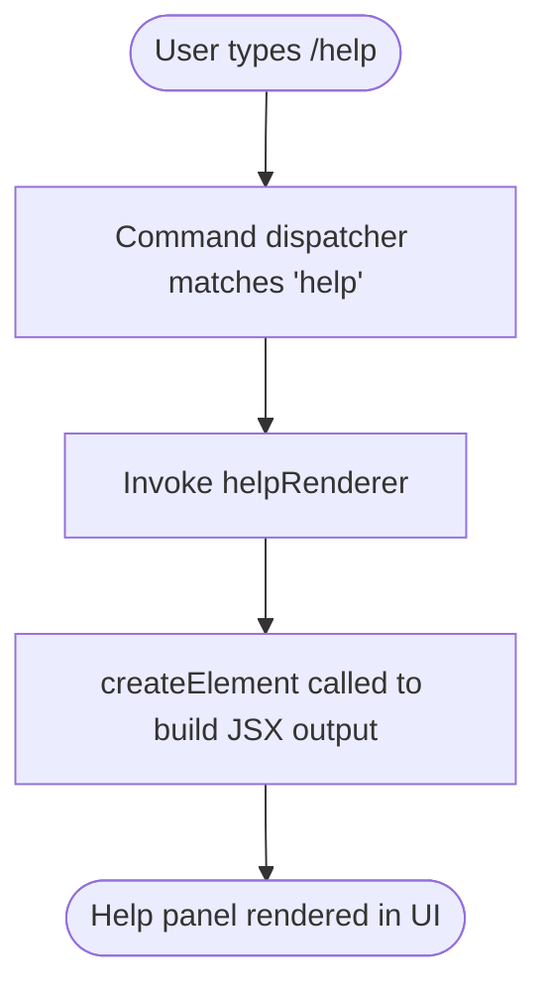

# `/help`

> Analysis basis: CC v2.1.143 bundle.js (AST extraction + Claude interpretation)
> Minimum version: v2.1.143

---

## Overview

The `/help` slash command displays a help panel listing all available slash commands and their descriptions to the user. It is implemented as a `local-jsx` command, meaning its output is rendered directly as a JSX component within the Claude Code terminal UI rather than producing plain text. The command takes no arguments and has no configurable input branching.

---

## Registration

| Field | Value |
|---|---|
| type | `local-jsx` |
| name | `help` |
| description | `Show help and available commands` |
| module_id | `wfq` |
| loc_line | `5831` |

Analysis basis: CC v2.1.143 bundle.js:+10624034

---

## Input Branching

The `/help` command accepts no arguments. Its execution path is linear: the command is invoked, the JSX render function is called, and a React element is returned for display. No branching on user input was found in the depth-2 traversal.



Analysis basis: CC v2.1.143 bundle.js:+10623919

---

## Behavioral Spec

### Help Panel Rendering

The sole implementation behavior observed at depth ≤ 2 is the construction of a React element representing the help panel.

```
function helpRenderer(props):
    element = createElement(HelpPanelComponent, props)
    return element
```

- `helpRenderer` is the top-level handler invoked when `/help` is dispatched.
- `createElement` is the standard React element factory (`cx_.createElement`), called with a component reference and any props passed by the dispatcher.
- The returned element is handed back to the Claude Code rendering pipeline, which mounts it inline in the conversation UI.

Analysis basis: CC v2.1.143 bundle.js:+10623919

### Command Type: `local-jsx`

Because the command is registered with `type: "local-jsx"`, the dispatcher does **not** send any network request to the Anthropic API. The entire response is synthesised client-side and injected into the UI as a React subtree. This means:

- `/help` is available unconditionally, even when the user is offline or unauthenticated.
- It does not consume any tokens or credits.
- It does not appear in the conversation history sent to the model.

Analysis basis: CC v2.1.143 bundle.js:+10624034

### Argument Handling

No argument-parsing literals or conditional branches were found in the depth-2 traversal. The command does not accept, validate, or act upon any text that follows `/help`.

<!-- TODO: not found in depth-2 traversal; needs --depth 4 -->

---

## State & Side Effects

| Item | Detail |
|---|---|
| Telemetry | None detected in depth-2 traversal (`telemetry: []`) |
| Hook registration | None detected in depth-2 traversal |
| appState changes | None detected in depth-2 traversal |
| Sound | None detected in depth-2 traversal |
| Network I/O | None — `local-jsx` type executes entirely client-side |
| Token consumption | None — output is not routed through the model |

> **Note:** The absence of telemetry events in the depth-2 traversal does not conclusively rule out telemetry fired from deeper call sites (e.g., inside the help panel component itself).
> <!-- TODO: not found in depth-2 traversal; needs --depth 4 -->

---

## Version History

| Version | Change |
|---|---|
| v2.1.143 | Initial analysis. Command registered as `local-jsx`, module `wfq`, line 5831. |

---

## Common Mistakes

1. **Expecting `/help <topic>` to filter output.** No argument handling was found in the depth-2 traversal. Passing any text after `/help` (e.g., `/help bash`) is silently ignored; the full help panel is always rendered.
2. **Assuming `/help` is model-aware.** Because the command type is `local-jsx`, the model never sees the `/help` invocation or its rendered output. Referencing "what `/help` showed" in a follow-up prompt will not work as expected.
3. **Expecting a telemetry event to confirm execution.** No `tengu_*` telemetry events are fired from the paths reachable at depth ≤ 2. Do not rely on telemetry presence to verify the command ran.
4. **Treating the help panel as an exhaustive API reference.** The panel lists registered slash commands only. Internal commands, keyboard shortcuts, or configuration options not surfaced as slash commands will not appear.

---

## Appendix — Identifier Mapping

> For bundle debugging only. Identifiers change across versions.

| Identifier | Role |
|---|---|
| `$P7` | Help command render function — top-level handler invoked by the slash-command dispatcher; calls `cx_.createElement` to produce the help panel JSX element |