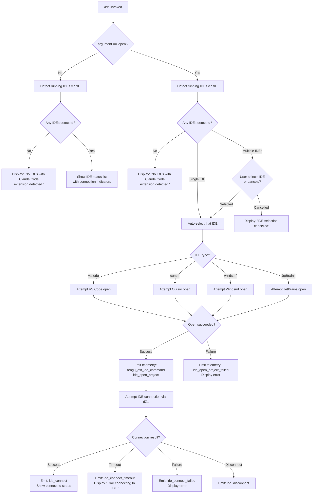

# `/ide`

> Analysis basis: CC v2.1.149 bundle.js (AST extraction + Claude interpretation)
> Minimum version: v2.1.149

---

## Overview

The `/ide` command manages IDE integrations for Claude Code, detecting which IDE instances are currently running with the Claude Code extension installed, displaying connection status, and optionally opening the project in a selected IDE. When invoked with the `open` subcommand argument, it additionally attempts to establish or confirm an active connection to an IDE, launching it if necessary.

---

## Registration

| Field | Value |
|---|---|
| type | `local-jsx` |
| name | `ide` |
| description | `Manage IDE integrations and show status` |
| argumentHint | `[open]` |
| module_id | `cZ1` |
| load_inline | `true` |
| loc_byte | `11215560` |
| loc_byte_end | `11215716` |
| loc_line | `8607` |
| arbor_handler.name | `mQL` |
| arbor_handler.fqn | `claude-2.1.149::mQL` |
| arbor_handler.kind | `AsyncFunction` |
| arbor_handler.resolution_path | `module_id` |
| arbor_handler.n_hits | `0` |

Analysis basis: CC v2.1.149 bundle.js:+11215560

---

## Input Branching

The command has 5+ distinct logical paths depending on the `open` argument, IDE detection results, connection state, and IDE type.



---

## Behavioral Spec

### Top-level Handler (`mQL`)

The primary async handler is `mQL` (Arbor-resolved, `module_id` resolution path).

```
async function ideCommandHandler(args, context):
    emit telemetry("tengu_ext_ide_command")          // loc: +11211676

    ideList = detectRunningIDEs(context)             // calls flH -> M48 -> dN7

    if ideList is empty:
        display("No IDEs with Claude Code extension detected.")
        return

    if args does NOT include "open":
        renderIDEStatusList(ideList)                 // calls mQL display path
        return

    // "open" subcommand path
    if ideList.length == 1:
        selectedIDE = ideList[0]
    else:
        selectedIDE = promptUserToSelectIDE(ideList) // interactive selection
        if selectedIDE == null:
            display("IDE selection cancelled")
            return

    result = openProjectInIDE(selectedIDE, context)  // calls jX -> opens IDE
    if result failed:
        emit telemetry("ide_open_project_failed")
        display error
        return

    emit telemetry("ide_open_project")
    attemptIDEConnection(selectedIDE, context)       // calls dZ1 component
```

Analysis basis: CC v2.1.149 bundle.js:+11211674, +11211782, +11211796, +11211820

---

### IDE Detection (`flH` / `M48` / `dN7`)

Detects running IDE processes and locates Claude Code extension installations.

```
async function detectRunningIDEs(context):
    port = parseInt(...)                             // loc: +5255915
    ideProcesses = await findIDEInstances(context)   // calls M48

    results = await Promise.all(
        ideProcesses.map(proc => resolveIDEInstance(proc))  // calls gN7 -> h8_
    )

    for each result:
        normalizeIDEPath(result)                     // uses CN.resolve
        if platform == "linux":
            scanProcessList()   // uses ps aux grep pattern
                                // pattern covers: code, cursor, windsurf,
                                // idea, pycharm, webstorm, phpstorm, rubymine,
                                // clion, goland, rider, datagrip, dataspell,
                                // aqua, gateway, fleet, android-studio
        filter out system accounts (Public, Default, "Default User", "All Users")
        dedup via realpath resolution ($$q.realpath)

    emit telemetry("ide_detect")                     // loc: +5257258
    on error: emit telemetry("ide_detect_failed")    // loc: +5257322
    return deduplicated IDE list
```

Analysis basis: CC v2.1.149 bundle.js:+5255915, +5255934, +5256004, +5257258, +5257322

---

### Platform-Specific IDE Path Resolution (`dN7`)

```
function resolveIDESearchPaths(platform):
    paths = []
    paths.push(homedir())                            // z$q.homedir
    paths.push(".claude" directory)                  // loc: +5253799

    if platform == "wsl":                            // loc: +5253844
        include "/mnt/c/Users" paths                 // loc: +5254006
        skip system accounts: Public, Default,
            "Default User", "All Users"              // loc: +5254100..5254164

    for each candidate path:
        stat = Q6(path)                              // file existence check
        if isDirectory or isSymbolicLink:
            realpath = $$q.realpath(path)
            if not already seen:
                add to result set
    return paths
```

Analysis basis: CC v2.1.149 bundle.js:+5253708, +5253785, +5253844, +5254006

---

### IDE Instance Probe (`h8_` / `G_`)

```
async function probeIDEInstance(candidate):
    // Attempt shell-based detection
    result = await runShellProbe("sh", "-c", probeCommand, timeout=3000ms)
    // loc: +2185230, +2185236, +2185253

    port = parseInt(result)                          // loc: +2185361
    if isNaN(port): return null

    return { port, type: inferIDEType(result) }

function inferIDEType(processString):
    // Matches known IDE names in process string
    // Returns one of: "vscode", "cursor", "windsurf",
    //   "jetbrains", "appcode", or derived name
    name = processString.toLowerCase()
    // loc: +5261667
    ...
```

Analysis basis: CC v2.1.149 bundle.js:+2185021, +2185227, +2185361, +5261667

---

### Open Project in IDE (`jX`)

```
function openProjectInIDE(ideInstance, projectPath):
    ideName = ideInstance.type.toLowerCase()         // loc: +5261667
    baseName = CN.basename(projectPath)              // loc: +5261725

    switch ideName:
        case "vscode":   invoke VS Code open command
        case "cursor":   invoke Cursor open command
        case "windsurf": invoke Windsurf open command
        default (JetBrains variants):
            use JetBrains remote gateway path

    // connection type for "ws:" prefixed addresses
    if address.startsWith("ws:"):                    // loc: +11214589
        useWebSocket = true
    else:
        useSSE = true                                // sse-ide / ws-ide  loc: +11209661, +11209681

    // telemetry type distinction
    if projectPath is worktree:
        openType = "worktree"                        // loc: +11212263
    else:
        openType = "project"                         // loc: +11212274
```

Analysis basis: CC v2.1.149 bundle.js:+11212089, +11212130, +11212171, +11212263, +11212274, +11214589

---

### IDE Connection Component (`dZ1`)

A JSX React component managing the connection lifecycle.

```
function IDEConnectionComponent(props):
    [connectionState, setConnectionState] = useState("pending")
    // loc: +11213562, +11213735

    appState = useAppState()                         // Tz_ hook
    stateRef = useRef()
    
    useEffect(() => {
        connectToIDE(props.ideInstance)
    }, [props.ideInstance])

    function onConnected():
        emit telemetry("ide_connect")                // loc: +11213779
        setConnectionState("connected")

    function onFailed(err):
        emit telemetry("ide_connect_failed")         // loc: +11213866
        display("Error connecting to IDE.")          // loc: +11214091

    function onTimeout():
        emit telemetry("ide_connect_timeout")        // loc: +11213973

    function onDisconnect():
        emit telemetry("ide_disconnect")             // loc: +11214472

    useCallback(() => {
        // filter MCP tools with prefix "mcp__ide__"  // loc: +11214369
        ides = filterByMCPIDEPrefix(toolList)
        ...
    }, [...])

    if connectionState == "pending":
        display("Connecting to <IDE name>...")       // loc: +11214809
    else if connected:
        renderIDEStatus(ideInstance)
```

Analysis basis: CC v2.1.149 bundle.js:+11213562, +11213779, +11213866, +11213973, +11214091, +11214369, +11214472, +11214809

---

### Connected IDE Status Display (`Rl_`)

```
function renderIDEStatusList(ideList, connectedIDE):
    // Normalizes IDE names using Unicode NFC normalization  // loc: +11215147, +11215159
    // Limits display to first 3 entries with ", …" overflow  // loc: +11215330, +11215316
    // Separator: ", "

    for each ide in ideList.slice(0, 3):             // loc: +11215061
        normalizedName = A.normalize("NFC", ide.name)
        display formatted entry

    if ideList.length > 3:
        append ", …"

    // Column padding: each name padded to 40 chars  // loc: +15286746
    // Two-space separator between columns: "  "     // loc: +15284775
```

Analysis basis: CC v2.1.149 bundle.js:+11215054, +11215061, +11215122, +11215147, +11215159, +11215208, +11215316, +11215330

---

### IDE Extension Installation Handler

```
function onInstallIDEExtension(ideType):
    // Called via _.onInstallIDEExtension callback   // loc: +11212803
    // Advises user to "restart your IDE"            // loc: +11212894
    // Only triggered when extension install is detected
    notify("restart your IDE")
```

Analysis basis: CC v2.1.149 bundle.js:+11212803, +11212894

---

## State & Side Effects

| Item | Detail |
|---|---|
| Telemetry | `tengu_ext_ide_command` (command entry), `ide_detect`, `ide_detect_failed`, `ide_open_project`, `ide_open_project_failed`, `ide_connect`, `ide_connect_failed`, `ide_connect_timeout`, `ide_disconnect` |
| Telemetry (background daemon, reached via call graph) | `tengu_bg_spare_enable`, `tengu_bg_low_mem_mb`, `tengu_bg_spare_spawn`, `tengu_bg_dispatch_sigkill_escalate`, `tengu_daemon_control`, `tengu_bg_dispatch_low_mem`, `tengu_bg_sendclaim_failed`, `tengu_bg_roster_parse_failed`, `tengu_daemon_config_reload`, `tengu_bg_spare_claim`, `tengu_bg_spare_claim_fail`, `tengu_bg_proto_mismatch`, `tengu_bg_dispatch_stale_drop`, `tengu_bg_attach_legacy_autorespawn`, `tengu_bg_attach`, `tengu_bg_attach_stall_ms`, `tengu_bg_attach_stall_gave_up`, `tengu_bg_attach_stall_respawn`, `tengu_daemon_idle_exit`, `tengu_bg_attach_kick`, `tengu_daemon_yield`, `tengu_config_parse_error`, `tengu_feature_ok`, `tengu_feature_bad`, `tengu_feature_sad`, `tengu_run_hook` |
| Transport protocols | SSE via `sse-ide` (loc: +11209661) and WebSocket via `ws-ide` (loc: +11209681); WS path triggered when address starts with `"ws:"` |
| MCP tool prefix filter | Filters tool list to entries prefixed with `"mcp__ide__"` (loc: +11214369) when building connected IDE capabilities |
| appState changes | Updates connection state from `"pending"` → connected/failed/timeout; React component lifecycle via `useState`, `useRef`, `useEffect`, `useCallback` |
| File I/O | IDE detection reads process list; on WSL reads under `/mnt/c/Users`; uses `realpath` dedup; reads `daemon.status.json` (loc: +12331232) via background daemon subsystem |
| Background daemon interaction | Routes through `yqA` (session claim) → `bB.claim`, `bB.buildClaimFrame`, `bB.spawn`; touches Unix socket via `Vh8.connect` |
| Sound | None detected |

---

## Version History

| Version | Change |
|---|---|
| v2.1.149 | Initial analysis |

---

## Common Mistakes

1. **Invoking `/ide open` without an IDE running**: If no IDE with the Claude Code extension is detected, the command displays `"No IDEs with Claude Code extension detected."` and exits without attempting a connection. The extension must be installed in the IDE before this command is useful.

2. **Expecting `/ide` (without `open`) to establish a connection**: Without the `open` argument, the command only shows status/detection output. It does not attempt to open or connect to an IDE.

3. **Misinterpreting the `[open]` argument hint**: The argument is the literal string `open` — no other sub-arguments are supported per the `argumentHint` field. Passing other strings is silently treated as the status-only path.

4. **WSL users expecting automatic Windows IDE detection**: On WSL, the command scans `/mnt/c/Users` but skips system accounts (`Public`, `Default`, `Default User`, `All Users`). If the Windows user profile is in a non-standard location, detection may fail silently.

5. **Assuming all JetBrains IDEs are named individually**: The `ps aux` probe on Linux uses a broad grep pattern; matching processes are classified collectively under JetBrains detection. The specific IDE variant may not be disambiguated.

---

## Appendix — Identifier Mapping

> For bundle debugging only. Identifiers change across versions.

| Identifier | Role |
|---|---|
| `mQL` | Main async handler for `/ide` command (arbor_handler) |
| `Rl_` | IDE status list renderer / display formatter |
| `flH` | IDE detection orchestrator (top-level detect function) |
| `M48` | IDE instance path aggregator (calls `dN7` per candidate) |
| `dN7` | IDE search path resolver (platform-aware, WSL-aware) |
| `gN7` | Per-IDE instance resolver wrapper |
| `h8_` | IDE instance shell probe (port + type detection) |
| `G_` | Shell command runner for IDE detection |
| `s3q` | IDE process string pattern matcher |
| `jX` | IDE open-project dispatcher (per IDE type) |
| `Cq` | String slice/index utility used by `jX` |
| `dZ1` | React JSX component managing IDE connection lifecycle |
| `J6` | App state accessor hook (Zustand-style) |
| `Tz_` | useContext wrapper for app state |
| `zA` | Alternate app state accessor |
| `AO` | Compound React hook (useContext + useRef + useMemo + useSyncExternalStore) |
| `OI` | Cleanup orchestrator component |
| `ytH` | Serialization utility used by `OI` |
| `u0_` | IDE capabilities/tools installer helper |
| `aN7` | MCP IDE tool filter and registration helper |
| `sX` | Platform detection helper called by `aN7` |
| `lWH` | Low-level connection transport initializer |
| `E8` | Connection type selector (SSE vs WebSocket) |
| `yf` | Formatting/display utility called early in `mQL` |
| `x6` | Context/store accessor |
| `Mm6` | Store get wrapper using `Lm6.getStore` |
| `j_` | Secondary context accessor |
| `Dv` | Utility called by `j_` |
| `Wr` | IDE list filter/display helper |
| `SQL` | Status query/list renderer |
| `MlH` | UI element used in IDE status display |
| `VE` | Value extractor used in both `flH` and `mQL` |
| `kqA` | Background daemon spawn/manage (spare PTY host) |
| `yqA` | Daemon session claim handler |
| `uqA` | Session lifecycle manager (attach/detach/cleanup) |
| `D` | Daemon normalize/connect orchestrator |
| `w` | Active session manager map |
| `C` | Worker/connection object |
| `z` | PTY write stream wrapper |
| `zk5` | IPC protocol message handler (full daemon protocol) |
| `mH` | String coercion utility |
| `CH` | JSON serialization wrapper |
| `RH` | Error logger with log-error |
| `K8` | Structured error constructor |
| `j8` | Error code utility |
| `N` | Log/write output helper |
| `bH` | Output write helper (bold/styled) |
| `uH` | Output write helper (plain) |
| `c` | Core utility / base helper |
| `c_` | Error string coercer |
| `Dz` | Dispose/teardown helper |
| `SO` | Atomic file write utility |
| `g6` | JSON parse wrapper |
| `rf` | Array.isArray guard |
| `a9` | Signal/event registration helper |
| `W` | Config-change watcher |
| `czH` | Hook/config change dispatcher |
| `b7` | Config-change event handler |
| `YW` | Hook execution engine |
| `V6` | IDE path normalizer (NFC + lowercase) |
| `we6` | IDE connection registry entry creator |
| `BM_` | GrowthBook experiment event emitter |
| `cM_` | Connection metadata builder |
| `m6` | Config file watcher |
| `Et4` | File watch + parse loop |
| `JOH` | Config file read/write with migration |
| `_Q1` | Daemon status file writer (`daemon.status.json`) |
| `Kv8` | macOS memory check (frees <1024 MB guard) |
| `kc1` | Terminal column layout calculator |
| `tXH` | Terminal render state snapshot |
| `Y` | Session/terminal manager map |
| `G` | Remote-control startup event handler |
| `AXK` | Heartbeat sender |
| `yHA` | Auth token writer |
| `VZ6` | Auth directory path builder |
| `Ll_` | Auth file path builder |
| `_k5` | Session claim retry loop |
| `Ak5` | Unix socket connection attempt |
| `Hk5` | Claim frame builder caller |
| `MB` | Binary protocol frame encoder |
| `r8` | Promise + timeout + abort race utility |
| `bK` | Job directory path resolver |
| `cq` | Job state file reader/cache |
| `Bw` | Active-job state aggregator |
| `gZ` | EZH state helper |
| `x5` | Job config writer |
| `Uw` | Job config cache invalidator |
| `keH` | Roster file watcher |
| `jB` | Roster file parser |
| `XgL` | Roster directory initializer |
| `hLH` | PTY-pids path builder |
| `wB` | Background worker launcher |
| `Al_` | Worker argument builder |
| `NeH` | PTY socket path builder |
| `ny` | PID file path resolver |
| `ShH` | PID directory path builder |
| `LXK` | Worktree realpath resolver |
| `yk5` | Worker identity verifier |
| `ej8` | Claude version path checker |
| `pu` | Supervisor shutdown orchestrator |
| `Rk` | Daemon connection entry registrar |
| `Oz6` | Pins file reader |
| `wD_` | Pins file path builder |
| `kG` | Jobs directory path builder |
| `v37` | Job directory scanner |
| `Jo9` | Pins file writer |
| `g` | Session retire-if-settled checker |
| `v6` | MCP tool filter (mcp__ prefix) |
| `Cf` | Tool set collector |
| `LH` | Permission has-set checker |
| `I8` | Keyboard shortcut registry |
| `VH` | Orphaned-permission set |
| `P` | Screen repaint orchestrator |
| `FT` | PTY path utility |
| `E$` | PTY realpath normalizer |
| `WfH` | PTY transcript reader |
| `Ok5` | Session phase checker |
| `uJK` | Dispatch stale-drop timer |
| `RqA` | Dispatch reply handler |
| `YY` | Background service emitter |
| `zM` | IPC end-of-message writer |
| `Jk6` | IPC write helper |
| `X` | IPC socket connection object |
| `J` | Session write-stream reference |
| `Yk5` | IPC message framer |
| `f` | Tool state accessor |
| `I` | Away-summary generator |
| `s` | Voice toggle silence timer |
| `t` | Voice focus silence timer |
| `m` | Transient status writer |
| `B` | Session state pair |
| `l` | Output filter |
| `r` | Stream pipe pair |
| `d` | Pipe destination |
| `T` | Terminal instance wrapper |
| `O` | Background session kill helper |
| `k8` | Session k8 utility |
| `j` | Active daemon map iterator |
| `y` | Yielding worker writer |
| `Y$q` | Process kill helper |
| `_8` | Core init utility |
| `SQL` | Status query renderer |
| `s9` | Permission error reporter |
| `MVK` | Log output formatter |
| `T7A` | Log entry type formatter |
| `X4` | Log line builder |
| `s5A` | Log prefix mapper |
| `HbH` | Buffered write helper |
| `B5A` | Stream write batcher |
| `OVK` | Structured log writer |
| `ICH` | Log batch flusher (setTimeout/setImmediate) |
| `q9H` | Log file path resolver |
| `G96` | Log timestamp formatter |
| `LMA` | Log file name builder |
| `KMA` | Log file rotation handler |
| `$VK` | Log file append + rotate |
| `a9` | Process signal registrar |
| `G1` | Network traffic mode resolver |
| `Z2A` | Traffic mode string mapper |
| `uiK` | Request queue shifter |
| `vyH` | Skills cache utility |
| `bo` | Skills index rebuilder |
| `Vx` | Skills promise resolver |
| `GP8` | Skills fetch helper |
| `aM1` | Skills aggregate builder |
| `XyH` | Skills cache clearer |
| `tQH` | Hook type presence checker |
| `Pn` | Metrics emitter |
| `A1` | Store accessor (mM7.getStore) |
| `$v6` | Status file path builder |

---

Note: index built via Arbor fallback; some signals (telemetry, literals) may be missing — see arbor-fallback.js.