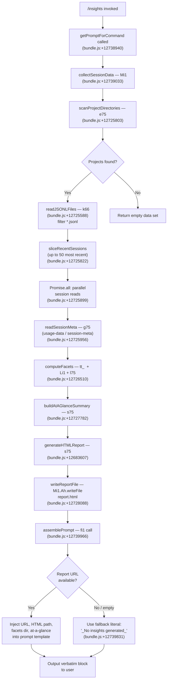

# `/insights`

> Analysis basis: CC v2.1.149 bundle.js (AST extraction + Claude interpretation)
> Minimum version: v2.1.149

---

## Overview

`/insights` generates a shareable HTML usage-report by analyzing all stored Claude Code session data (JSONL transcripts, facet directories, and session-metadata files). Once the report is written to disk, the command hands the pre-composed `<message>` block verbatim to the agent, which outputs it as-is — the user receives a ready-made confirmation with a report URL and an invitation to explore any section further.

---

## Registration

| Field | Value |
|---|---|
| type | `prompt` |
| name | `insights` |
| description | Generate a report analyzing your Claude Code sessions |
| loc_byte | `12738760` |
| loc_byte_end | `12740064` |
| loc_line | `11654` |
| handler_method | `getPromptForCommand` |
| handler_method_start | `12738934` |
| handler_method_end | `12740063` |
| prompt_body.length | `513` characters |
| prompt_body.trace | `call→fi1(...) (1 literals)` |
| arbor_handler.name | `getPromptForCommand` |
| arbor_handler.fqn | `claude-2.1.149::getPromptForCommand` |
| arbor_handler.kind | `Method` |
| arbor_handler.resolution_path | `direct` |
| arbor_handler.n_hits | `1` |

Analysis basis: CC v2.1.149 bundle.js:+12738760

---

## Input Branching

The command has more than three distinct internal paths (session-data collection → facet computation → HTML report generation → at-a-glance summary → prompt assembly), so a Mermaid flowchart is used.



---

## Behavioral Spec

### 1. Entry Point — `getPromptForCommand`

The handler is registered as an inline `ObjectMethod` named `getPromptForCommand` on the command registration object. Arbor resolved it via the `direct` path (symbol falls inside the registration byte range `12738760–12740064`).

```
async function getPromptForCommand(context):
    rawData   = await collectSessionData(context)        // Mi1
    rounded   = Math.round(rawData.metric)               // +12739321
    prompt    = assemblePrompt(fi1, rounded, rawData)    // +12739966
    encoded   = serializeToString(prompt)                // CH  +12739984
    pathObj   = buildDataPath(encoded)                   // Tv8 +12740030
    return prompt
```

Analysis basis: CC v2.1.149 bundle.js:+12738940

---

### 2. Session Data Collection — `collectSessionData` (Mi1)

`collectSessionData` is the central orchestration function. It:

1. Scans the Claude Code `projects` directory tree (literal `"projects"` at bundle.js:+6508181) for subdirectories.
2. For each project directory, lists `.jsonl` files (literal `".jsonl"` at bundle.js:+12808434).
3. Sorts entries and yields at most the 50 most-recent sessions (limit constant `50` at bundle.js:+12725822; secondary cap `200` at bundle.js:+12725827).
4. Reads session metadata from two sub-directories: `usage-data` (literal at bundle.js:+12664755) and `session-meta` (literal at bundle.js:+12664851).
5. Fans out with `Promise.all` across sessions for parallel I/O.
6. Computes facets, builds the at-a-glance summary, generates the HTML file, and writes it.

```
async function collectSessionData(context):
    projectRoot = joinPath(dataDir, "projects")           // Xd, +6508167
    dirs        = await fs.readdir(projectRoot)           // Ah.readdir +12725430
    sessionDirs = dirs.filter(isDirectory)                // +12725498
    allJsonl    = []
    for dir in sessionDirs:
        files   = await listJsonlFiles(dir)               // k66 +12725588
        allJsonl.push(...files)
    setImmediate(yieldToEventLoop)                        // +12725710
    sorted      = allJsonl.sort(byTimestamp)              // +12725734
    recent      = sorted.slice(0, 50)                     // +12725822
    sessions    = await Promise.all(recent.map(readOne))  // +12725899
    metaMap     = {}
    for s in sessions:
        meta    = await readSessionMeta(s)                // g75 +12725956
        metaMap[s.id] = meta
    facets      = computeFacets(sessions, metaMap)        // tt_ +12726510
    glance      = buildAtAGlance(facets)                  // s75 +12727782
    htmlPath    = await writeReport(facets, glance)       // +12728088
    return { sessions, facets, glance, htmlPath }
```

Analysis basis: CC v2.1.149 bundle.js:+12739033

---

### 3. JSONL File Listing — `listJsonlFiles` (k66)

```
async function listJsonlFiles(dirPath):
    entries  = await fs.readdir(dirPath)                 // A7.readdir +12808328
    files    = entries.filter(isFile and matchesJsonl)   // +12808405, +12808434
    paths    = files.map(f => path.join(dirPath, f))     // zj.join +12808536
    stats    = await Promise.all(paths.map(fs.stat))     // A7.stat  +12808637
    result   = paths.map((p, i) => ({path: p,
                    mtime: stats[i].mtime,
                    size:  stats[i].size}))
    return result
```

File-name matching uses a regex (identifier `kr`, `_p7.test` at bundle.js:+6530011).

Analysis basis: CC v2.1.149 bundle.js:+12725588

---

### 4. Session Metadata Reading — `readSessionMeta` (g75)

Reads both the `usage-data` and `session-meta` sub-directories for a session, parsing JSON content via `g6` (which calls `JSON.parse`). Uses `utf-8` encoding (literal at bundle.js:+12670886).

```
async function readSessionMeta(session):
    usagePath  = joinPath(session.dir, "usage-data")    // rv6 +12664742
    metaPath   = joinPath(session.dir, "session-meta")  // at_ +12664851
    usageRaw   = await fs.readFile(usagePath, "utf-8")  // Ah.readFile +12670862
    usage      = parseJSON(usageRaw)                    // g6  +12670907
    metaRaw    = await fs.readFile(metaPath,  "utf-8")
    meta       = parseJSON(metaRaw)
    return { usage, meta }
```

Analysis basis: CC v2.1.149 bundle.js:+12670819

---

### 5. Facet Computation — `computeFacets` (tt_ → Ai1 → Li1 → Ki1)

Facets are structured aggregations over the raw session data. The computation pipeline:

- `tt_` (`+12726510`): top-level dispatcher; delegates to `Ai1` and calls `Math.round` for numeric normalization (`+12667579`).
- `Ai1` (`+12665289`): classifies events by tool type — distinguishing `WebSearch`, `WebFetch`, `Edit`, `Write` (literals at `+12665448`, `+12665472`, `+12665579`, `+12665591`), git operations (`"git commit"` `+12665835`, `"git push"` `+12665867`), and `"Other"` (`+12666383`). Tracks error reasons including `"exit code"`, `"User Rejected"`, `"Edit Failed"`, `"File Changed"`, `"File Too Large"`, `"File Not Found"` (literals `+12666451`–`+12666862`). Timestamps are binned into 3600-second (1 hour) buckets (literal `3600` at `+12666252`).
- `Li1` (`+12674591`): aggregates per-session statistics, computes medians and percentiles via `Ki1` (`+12676858`), and uses a 1,800,000 ms (30-minute) session-boundary constant (`+12673228`).
- `Ki1` (`+12673036`): statistical helper; sorts numeric arrays, builds histograms, uses `Number.isFinite` guard.

```
function computeFacets(sessions, metaMap):
    raw      = classifyToolEvents(sessions)    // Ai1
    perSess  = aggregatePerSession(raw)        // Li1
    stats    = computeStatistics(perSess)      // Ki1
    facets   = { toolBreakdown: raw.tools,
                 errorBreakdown: raw.errors,
                 timeOfDay: raw.hourBins,
                 sessionStats: stats }
    return facets
```

Analysis basis: CC v2.1.149 bundle.js:+12726510

---

### 6. HTML Report Generation — `generateHTMLReport` (s75)

`s75` is the largest sub-function, building a self-contained HTML report.

Key sections produced (confirmed by literals in the call graph):

| Section | Key literals |
|---|---|
| Response time chart | `"2-10s"`, `"10-30s"`, `"30s-1m"`, `"1-2m"`, `"2-5m"`, `"5-15m"`, `">15m"` (`+12681973`–`+12682033`) |
| Time-of-day heatmap | `"Morning (6-12)"`, `"Afternoon (12-18)"`, `"Evening (18-24)"`, `"Night (0-6)"` (`+12682821`–`+12682974`) |
| Tool error bar chart | colours `#dc2626`, `#16a34a`, `#eab308` (`+12723354`, `+12723603`, `+12724096`) |
| Session activity bars | colours `#2563eb`, `#0891b2`, `#10b981`, `#8b5cf6` (`+12719638`–`+12720091`) |
| Suggestions panel | `"Add to CLAUDE.md"` CTA (`+12687317`) |

Empty-state placeholders: `"<p class=\"empty\">No data</p>"` (`+12681464`), `"<p class=\"empty\">No response time data</p>"` (`+12681921`), `"<p class=\"empty\">No time data</p>"` (`+12682771`), `"<p class=\"empty\">No tool errors</p>"` (`+12723365`).

Output filename: `report.html` (literal at bundle.js:+12728060). The output directory is constructed from the current date/time components (`C.getFullYear`, `C.getMonth`, `C.getDate`, `C.getHours`, `C.getMinutes`, `C.getSeconds` at `+12727892`–`+12727990`) joined via `RB.join` (`+12728010`).

The HTML generation helpers include:
- `D5H` (`+12681324`): builds bar-chart HTML rows, applying `Math.max` normalization and `J5` HTML escaping.
- `r75` (`+12682346`): generates response-time distribution rows.
- `o75` (`+12683053`): generates time-of-day distribution bars.
- `Gv8` (`+12681233`): formats template sections using `J5` HTML escaping.
- `a75` (`+12683549`): serializes a section to string via `CH` (JSON-stringify-like helper).

Max content length for a single chart item: 8192 characters (literal at bundle.js:+12681142).

```
function generateHTMLReport(facets, glance):
    html  = buildHeader()
    html += buildAtAGlanceSection(glance)          // s75 top
    html += buildResponseTimeChart(facets)         // r75
    html += buildTimeOfDayChart(facets)            // o75
    html += buildToolBreakdown(facets)             // D5H
    html += buildErrorBreakdown(facets)            // D5H
    html += buildSuggestionsPanel(facets)          // s75 suggestions
    html += buildFooter()
    return html
```

Analysis basis: CC v2.1.149 bundle.js:+12727782

---

### 7. Report File Writing — `writeReport` (Q75 / F75)

Two parallel write helpers are called:

- `Q75` (`+12671403`): creates the output directory (`Ah.mkdir`), joins the path (`RB.join`), serialises via `CH`, and writes via `Ah.writeFile`. Errors are caught and logged via `RH`.
- `F75` (`+12670646`): similar structure, writes a companion facets file; also uses `Tv8` to construct the facets sub-path.

The facets directory name is the literal `"facets"` (bundle.js:+12664805).

```
async function writeReport(facets, html, datestamp):
    outDir   = joinPath(insightsRoot, datestamp)
    await fs.mkdir(outDir, { recursive: true })    // +12671403
    htmlFile = joinPath(outDir, "report.html")
    await fs.writeFile(htmlFile, html)             // +12671484
    facetDir = joinPath(outDir, "facets")          // +12664805
    await writeFacetFiles(facetDir, facets)        // F75 +12670646
    return htmlFile
```

Analysis basis: CC v2.1.149 bundle.js:+12671403

---

### 8. Prompt Assembly — `assemblePrompt` (fi1 via getPromptForCommand)

The prompt body (513 characters, traced as `call→fi1(...) (1 literals)`) is built by calling `fi1` and injecting runtime values. The assembled string instructs the agent to:

1. Acknowledge that the user ran `/insights`.
2. Present the full insights data (injected).
3. Provide the Report URL, HTML file path, and facets directory (all injected).
4. Relay an at-a-glance summary marked as agent-only context.
5. Output the content between `<message>` tags **verbatim** as the entire response — no lines may be omitted.

The fallback literal `"_No insights generated_"` (bundle.js:+12739831) is used when the session scan returns no data.

The separator literal `" · "` (bundle.js:+12739392) is used to join multiple items in the summary line.

```
function assemblePrompt(fi1, roundedMetric, data):
    if data is empty:
        return buildPromptWithFallback("_No insights generated_")
    reportURL  = data.reportURL
    htmlPath   = data.htmlPath
    facetsDir  = data.facetsDir
    glance     = data.glance.join(" · ")
    return fi1(reportURL, htmlPath, facetsDir, glance, roundedMetric)
```

Analysis basis: CC v2.1.149 bundle.js:+12739966

---

### 9. At-a-Glance Summary — `buildAtAGlance` (l75)

`l75` (`+12677454`) aggregates the facets into a short human-readable summary. Key behaviors:

- Uses `Array.from` + `_.values` over the facet maps.
- Applies `Math.round` for display precision (`+12677919`).
- Serialises sub-structures via `CH` (`+12677801`).
- The summary key `"at_a_glance"` is the literal at bundle.js:+12679000.
- Falls back to the string `"None captured"` when all facets are empty (literal at bundle.js:+12678334).
- Fans out `Promise.all` over `c75.map` for async sub-aggregations (`+12678359`).
- Delegates per-session report generation to `Hi1` (`+12678384`), which calls `qJH` for the underlying API-metrics call.

Analysis basis: CC v2.1.149 bundle.js:+12727771

---

## State & Side Effects

| Item | Detail |
|---|---|
| Filesystem writes | Creates a timestamped directory under the insights root; writes `report.html` and companion facet files (`+12728088`, `+12671403`, `+12670646`) |
| Filesystem reads | Reads `projects/` directory tree, per-project `.jsonl` files, `usage-data`, and `session-meta` files (`+12725430`, `+12808328`, `+12670862`) |
| appState changes | None detected in depth-2 traversal |
| Hook registration | None detected in depth-2 traversal |
| Sound | None detected |
| Telemetry (in-scope call graph) | `tengu_transcript_phantom_parent` (`+12794269`), `tengu_relink_walk_broken` (`+12774542`), `tengu_chain_parent_cycle` (`+12776311`), `tengu_chain_timestamp_fallback` (`+12776460`), `tengu_chain_parallel_tr_recovered` (`+12778326`), `tengu_transcript_parent_cycle` (`+12797832`) |
| Telemetry (daemon / peripheral, reachable via callGraph depth-2) | `tengu_daemon_yield`, `tengu_daemon_control`, `tengu_daemon_config_reload`, `tengu_bg_spare_enable`, `tengu_bg_spare_spawn`, `tengu_bg_dispatch_sigkill_escalate`, `tengu_bg_dispatch_low_mem`, `tengu_bg_spare_claim`, `tengu_bg_spare_claim_fail`, `tengu_daemon_idle_exit`, `tengu_voice_circuit_breaker_tripped`, `tengu_voice_recording_started`, `tengu_voice_stream_early_retry` |
| Session sampling cap | Most-recent 50 sessions processed (hard limit at bundle.js:+12725822); secondary ceiling 200 (bundle.js:+12725827) |
| Concurrency | `setImmediate` yield after directory scan (`+12725710`); parallel session reads via `Promise.all` (`+12725899`) |
| Error handling | Write errors caught by `RH` (logError path at `+12671550`); chain-cycle errors surfaced as telemetry events |

---

## Version History

| Version | Change |
|---|---|
| v2.1.149 | Initial analysis |

---

## Common Mistakes

1. **Expecting interactive output before the report is written.** The command writes the HTML file to disk first, then the agent outputs the `<message>` block. If the write fails (permissions, disk full), the fallback literal `"_No insights generated_"` is shown instead of a real URL.
2. **Running `/insights` with no prior sessions.** If the `projects/` directory is absent or empty, the session scan returns an empty set and the report will contain only empty-state placeholders (`"No data"`, `"No response time data"`, etc.).
3. **Assuming the agent adds commentary.** The prompt instructs the agent to output the `<message>` block **verbatim** as its entire response; any appended analysis is contrary to the instruction. The only permitted deviation is the trailing question ("Want to dig into any section...").
4. **Looking for facets in the report root.** Facet JSON files are written to a `facets/` sub-directory (literal `"facets"` at bundle.js:+12664805), not alongside `report.html`.
5. **Expecting a fixed output path.** The report directory is time-stamped to the second (year, month, day, hour, minute, second components), so consecutive runs produce distinct directories.

---

## Appendix — Identifier Mapping

> For bundle debugging only. Identifiers change across versions.

| Identifier | Role |
|---|---|
| `__handler_insights` | Synthetic BFS entry node for the `/insights` command handler |
| `Mi1` | `collectSessionData` — main orchestration function |
| `e75` | `scanProjectDirectories` — reads the `projects/` tree and lists session dirs |
| `Xd` | `joinProjectsPath` — path construction helper for the projects root |
| `k66` | `listJsonlFiles` — lists and stats `.jsonl` files in a session directory |
| `kr` | `jsonlFileNameRegex` — regex predicate for `.jsonl` filename matching |
| `N` | `classifyLogLevel` — log-level / severity helper |
| `g` | `mcpToolFilter` — MCP tool-call filter helper |
| `v6` | `filterConversationMessages` — message filtering helper |
| `Cf` | `checkMessageRole` — role-check predicate |
| `F6` | `filterByRole` — role-based message filter |
| `LH` | `mcpPermissionSet` — MCP permission set helper |
| `I8` | `buildDiffIndex` — diff/index builder |
| `VH` | `orphanedPermissionChecker` — checks for orphaned MCP permissions |
| `Z` | `permissionStore` — permission store |
| `g75` | `readSessionMeta` — reads `usage-data` and `session-meta` files |
| `at_` | `buildSessionMetaPath` — constructs `session-meta` sub-path |
| `rv6` | `buildUsageDataPath` — constructs `usage-data` sub-path |
| `qi1` | `parseMetaVersion` — metadata version parser |
| `g6` | `parseJSON` — thin `JSON.parse` wrapper |
| `f` | `mcpClientRegistry` — MCP client registry / connection map |
| `UyH` | `mcpConnectionManager` — manages MCP server connections |
| `j6H` | `buildMcpTransport` — constructs MCP transport objects |
| `bN` | `mcpTransportHelper` — MCP transport helper |
| `H` | `jitterDelay` — random jitter delay utility |
| `t8` | `genericHelper` — general-purpose utility |
| `HE6` | `mcpRetryHelper` — MCP retry logic |
| `vkL` | `mcpConnectionPoller` — polls MCP connection state |
| `h78` | `mcpTimeoutBuilder` — builds MCP timeouts |
| `k78` | `mcpFKHelper` — FK-keyed MCP helper |
| `z8` | `mcpDebugLogger` — logs MCP debug messages |
| `hB_` | `oauthFlowHandler` — handles OAuth device/browser flow for MCP |
| `SB_` | `oauthCallbackHandler` — handles OAuth callback completion |
| `IY1` | `mcpInitializer` — initializes MCP server connections |
| `kB_` | `mcpConnectionRunner` — runs an MCP connection lifecycle |
| `lT_` | `mcpIncludesChecker` — checks transport type includes |
| `j` | `processKillSet` — set of child processes to kill on cleanup |
| `y` | `stdioWriteStream` — stdio write stream helper |
| `CL` | `mcpErrorLogger` — logs MCP errors |
| `EH` | `stringifyError` — converts errors to strings |
| `ZY1` | `liHelper` — `li`-keyed helper |
| `_E6` | `parseInt1` — first `parseInt` wrapper |
| `NF_` | `parseInt2` — second `parseInt` wrapper |
| `QDK` | `mcpUpdateApplier` — applies MCP configuration updates |
| `ZW8` | `mcpCHHelper` — CH-keyed MCP helper |
| `OI` | `mcpCleanupOrchestrator` — orchestrates MCP cleanup |
| `$` | `sessionRecordHelper` — session record helper |
| `_Q1` | `sessionTimestampRecord` — records session with timestamp |
| `nv5` | `mcpServerReconciler` — reconciles MCP server list |
| `R78` | `mcpHasChecker` — checks presence in MCP maps |
| `r8` | `retryWithTimeout` — generic retry-with-timeout |
| `ytH` | `mcpCHInvoker` — invokes CH-keyed MCP function |
| `B` | `messagePairHelper` — pairs messages in conversation |
| `Ev8` | `buildConversationIndex` — builds the full conversation index |
| `b8H` | `conversationStore` — main conversation/session store |
| `JL5` | `journalLookup` — journal entry lookup |
| `x` | `clearTimeoutMap` — map with clearTimeout-on-write semantics |
| `TR` | `transcriptReader` — reads transcript data |
| `c5A` | `cborDecoder` — CBOR-format decoder |
| `iP` | `indexPointer` — index pointer utility |
| `O` | `processWrapper` — child-process wrapper |
| `J` | `socketWriter` — socket write helper |
| `X` | `bufferFramer` — buffers and frames binary data |
| `P` | `connectionHandler` — handles a single server connection |
| `T` | `connectionPairHandler` — pairs connection handlers |
| `z` | `daemonProcessWrapper` — daemon process wrapper |
| `Y` | `sessionConfigUpdater` — stops/updates/restarts sessions on config change |
| `D` | `memoryMonitor` — monitors free memory, triggers GC |
| `w` | `daemonWorkerManager` — manages daemon worker pool |
| `W` | `skillsDebouncer` — debounces skills-update events |
| `G` | `remoteControlHandler` — handles remote-control startup input |
| `V` | `sessionConfigPair` — get/set pair for session config |
| `Q` | `outputQueueHelper` — queues output records |
| `I` | `awaySummaryScheduler` — schedules away-summary generation |
| `h` | `awaySummaryRunner` — runs an away-summary generation |
| `mH` | `stringConverter` — `String(...)` conversion helper |
| `gL5` | `gitLogParser` — parses binary git-log format |
| `QL5` | `quickLogReader` — quick binary log reader |
| `m` | `heartbeatTimer` — periodic heartbeat timer |
| `ui1` | `relinkWalker` — walks transcript parent links to repair orphans |
| `FL5` | `fullLogParser` — full binary log parser |
| `eWH` | `oauthTokenStore` — stores/retrieves OAuth tokens |
| `S` | `socketStream` — raw socket stream |
| `s9` | `k8Invoker` — invokes K8-keyed utility |
| `RH` | `errorLogger` — logs errors to error stream |
| `e` | `notificationAdder` — adds notifications |
| `o` | `voiceSessionManager` — manages voice recording sessions |
| `c` | `conversationCloser` — closes a conversation |
| `d` | `disposableSet` — a set of disposables |
| `r` | `disposablePair` — a pair of disposables |
| `t` | `focusSilenceTimer` — voice focus-silence timeout |
| `ti1` | `transcriptIndexUpdater` — updates transcript index entries |
| `C7H` | `chainBuilder` — builds ordered message chains from transcripts |
| `hL5` | `chainNaNGuard` — guards chain builder against NaN timestamps |
| `SL5` | `chainSorter` — sorts and deduplicates chain entries |
| `kL5` | `chainShifter` — shifts and reorders chain entries |
| `ZaH` | `mapHelper` — maps over a collection with a transform |
| `Ge_` | `promptSanitizer` — sanitizes prompt text (replaceAll, slice) |
| `RV6` | `promptReplacer` — replaces prompt placeholders |
| `Ee_` | `attachmentFilter` — filters attachment types |
| `RL5` | `attachmentTrimmer` — trims and checks attachment arrays |
| `CL5` | `attachmentSomeChecker` — checks `Array.some` on attachment arrays |
| `Cv8` | `cacheKeyStore` — stores/retrieves cache keys |
| `bv8` | `cacheValueReader` — reads cache values as arrays |
| `b75` | `nanGuard` — `Number.isNaN` guard utility |
| `tt_` | `computeFacetsDispatcher` — top-level facet computation dispatcher |
| `Ai1` | `classifyToolEvents` — classifies tool-use events into facet categories |
| `C` | `daemonTransportWriter` — daemon transport write helper |
| `iv6` | `toolNameNormalizer` — normalizes tool names for categorization |
| `C75` | `fileExtensionChecker` — checks file extensions via `RB.extname` |
| `jDH` | `diffHelper` — wraps `C$q.diff` for diff computation |
| `O7` | `indexOfHelper` — `indexOf` utility |
| `R` | `toLowerCaseHelper` — `toLowerCase` utility |
| `st_` | `sessionStateHelper` — manages session state transitions |
| `Q75` | `writeReportFile` — writes `report.html` to disk |
| `CH` | `jsonStringify` — `JSON.stringify` wrapper |
| `B75` | `readAndDeleteFacetFile` — reads a facet file then unlinks it |
| `Tv8` | `buildFacetsPath` — constructs the facets sub-directory path |
| `$i1` | `facetFileParser` — parses a facet file |
| `d75` | `generateInsightsData` — top-level insights data generator |
| `U75` | `aggregateInsightsBatches` — batches and aggregates insights |
| `u75` | `buildInsightsBatch` — builds a single insights batch |
| `qJH` | `apiMetricsCollector` — collects API usage metrics |
| `vK` | `metricsVersionKey` — version key for metrics |
| `u28` | `writeMetricsFile` — writes metrics to file (hash, UUID, mkdir) |
| `T8` | `uuidGenerator` — generates UUIDs via `pV.randomUUID` |
| `ASH` | `assertAssistantMessage` — asserts an assistant message exists |
| `EG` | `errorGuard` — error guard / rethrow helper |
| `_i1` | `gzipHelper` — gzip compression helper using `GZ` |
| `GZ` | `gzipCompressor` — core gzip compressor |
| `$K` | `filterHelper` — generic `H.filter` wrapper |
| `c_` | `errorConstructor` — constructs `Error` objects with `String` message |
| `F75` | `writeFacetFiles` — writes facet companion files |
| `HL5` | `objectKeysHelper` — `Object.keys` wrapper for facet objects |
| `Li1` | `aggregatePerSessionStats` — aggregates per-session statistics |
| `I66` | `objectEntriesHelper` — `Object.entries` helper for facets |
| `Cq` | `indexSliceHelper` — combined `indexOf` + `slice` helper |
| `Ki1` | `statisticsComputer` — computes median, percentiles, histograms |
| `l75` | `buildAtAGlanceSummary` — builds the at-a-glance summary map |
| `Hi1` | `generatePerSessionReport` — generates per-session report entry |
| `y75` | `gzipPathBuilder` — builds gzip output path via `GZ` |
| `s75` | `generateHTMLReport` — generates the full self-contained HTML report |
| `J5` | `htmlEscaper` — HTML entity escaping utility |
| `_5` | `htmlReplaceAll` — `replaceAll`-based HTML entity replacer |
| `Gv8` | `htmlSectionFormatter` — formats HTML template sections |
| `a75` | `sectionSerializer` — serializes a section using `CH` |
| `D5H` | `barChartBuilder` — builds bar-chart HTML rows |
| `r75` | `responseTimeChartBuilder` — builds response-time distribution HTML |
| `o75` | `timeOfDayChartBuilder` — builds time-of-day distribution HTML |
| `fi1` | `promptTemplateFunction` — final prompt-string assembler (1 literal injected) |