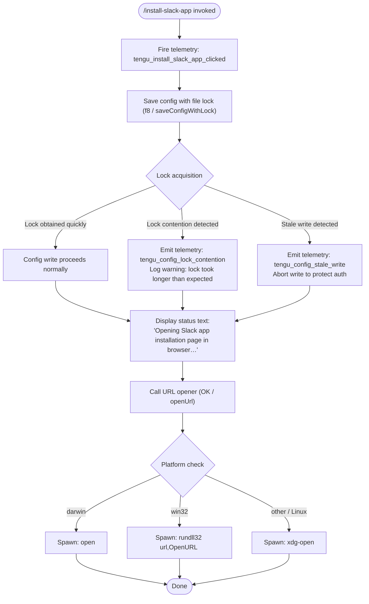

# `/install-slack-app`

> Analysis basis: CC v2.1.149 bundle.js (AST extraction + Claude interpretation)
> Minimum version: v2.1.149

---

## Overview

`/install-slack-app` is a local slash command that triggers browser-based installation of the Claude Slack app. When invoked, it fires a telemetry event, displays an informational status message, and opens the Slack app installation page in the system's default browser using a platform-aware URL-opening mechanism. The command does not interact with the Claude agent or run any AI inference.

---

## Registration

| Field | Value |
|---|---|
| type | `local` |
| name | `install-slack-app` |
| description | `Install the Claude Slack app` |
| supportsNonInteractive | `false` |
| module_id | `qv1` |
| load_inline | `true` |
| loc_byte | `11302627` |
| loc_byte_end | `11302813` |
| loc_line | `9239` |
| arbor_handler.name | `KdL` |
| arbor_handler.fqn | `claude-2.1.149::KdL` |
| arbor_handler.kind | `AsyncFunction` |
| arbor_handler.resolution_path | `module_id` |
| arbor_handler.n_hits | `0` |

Analysis basis: CC v2.1.149 bundle.js:+11302627

---

## Input Branching

This command has a relatively linear flow, but includes 3+ distinct platform branches inside the URL-opener (`OK`) and a lock-contention branch inside the config-save path (`f8`/`$f_`). A Mermaid flowchart is therefore used.



Analysis basis: CC v2.1.149 bundle.js:+11302231, +11302346, +11302379, +6474162, +6474178, +6474262, +6474336, +6474343, +3193621, +3193710

---

## Behavioral Spec

### 1. Command Entry Point — `KdL` (mainHandler)

The async handler `KdL` is the resolved entry point (via `module_id` → `qv1`, `resolution_path: module_id`).

```
async function mainHandler(context):
    fire telemetry event "tengu_install_slack_app_clicked"
    await saveConfigWithLock(context)       // f8
    await openUrl(context)                  // OK
    return
```

Analysis basis: CC v2.1.149 bundle.js:+11302231, +11302271, +11302346

---

### 2. Config Save with File Lock — `f8` (saveConfigWithLock)

This function persists updated configuration state under a filesystem-level lock before the browser is opened. The lock mechanism uses directory creation or a sentinel file as a mutex; the function retries until the lock is acquired or a timeout is exceeded.

```
async function saveConfigWithLock(context):
    lockPath = resolveLockPath()                        // $f_ / resolveAndLockConfig
    try:
        acquired = await acquireFileLock(lockPath)      // $f_
        if lockAcquisitionTookTooLong:
            emit telemetry "tengu_config_lock_contention"
            log warning "Lock acquisition took longer than expected - another Claude instance may be running"
        
        currentConfig = readConfigFromDisk()            // JOH / readConfigFromDisk
        if currentConfig is missing auth that in-memory cache has:
            emit telemetry "tengu_config_auth_loss_prevented"
            log "saveConfigWithLock: re-read config is missing auth..."
            abort write                                 // refuse to wipe ~/.claude.json
            return
        
        if staleWriteDetected:
            emit telemetry "tengu_config_stale_write"
        
        writeConfigAtomically(currentConfig)            // UK6 / atomicFileWrite
    finally:
        releaseFileLock(lockPath)
```

Key constants:
- Lock timeout warning string: `"Lock acquisition took longer than expected - another Claude instance may be running"` (bundle.js:+3193621)
- Auth-loss prevention log prefix: `"saveConfigWithLock: re-read config is missing auth..."` (bundle.js:+3194037)
- Backup directory name: `"backups"` (bundle.js:+3195222)
- Backup file infix: `".backup."` (bundle.js:+3194507)
- Maximum backup count retained: `5` (bundle.js:+3194640)
- Config file permissions octal: `384` (= `0o600`) (bundle.js:+3194922)
- Config rewrite timeout: `60000` ms (bundle.js:+3194391)

Analysis basis: CC v2.1.149 bundle.js:+3190712, +3193621, +3193710, +3193846, +3194037, +3194189

---

### 3. Atomic File Write — `UK6` (atomicFileWrite)

Performs a safe write by first writing to a randomly named temporary file, setting permissions, fsyncing, then renaming over the target.

```
function atomicFileWrite(targetPath, data):
    randomSuffix = crypto.randomBytes(6).toString("hex")    // 6 bytes, "hex" encoding
    tempPath = targetPath + "." + randomSuffix

    if targetPath is a symlink:
        resolve real path via readlinkSync + path.resolve/dirname

    fd = fs.openSync(tempPath, flags)
    try:
        fs.writeFileSync(fd, data)
        if originalPermissions available:
            fs.fchmodSync(fd, originalPermissions)
            log debug "Applied original permissions to temp file"
        fs.fsyncSync(fd)
    finally:
        fs.closeSync(fd)

    fs.renameSync(tempPath, targetPath)

    // cleanup stale temp files
    if lstatSync fails with ELOOP or ENOTDIR:
        handle gracefully

    if unlinkSync needed for old temp:
        fs.unlinkSync(oldTemp)
```

Analysis basis: CC v2.1.149 bundle.js:+1008661, +1009377, +1009405, +1009813, +1009871, +1009937, +1010065, +1009892

---

### 4. Config Read from Disk — `JOH` (readConfigFromDisk)

```
function readConfigFromDisk(configPath):
    if configPath not accessible:
        throw Error("Config accessed before allowed.")    // guard check

    raw = fs.readFileSync(configPath, "utf-8")
    parsed = JSON.parse(raw)                              // via g6 / jsonParse

    // strip BOM or leading whitespace prefix via xC / stripPrefix
    if raw.startsWith(BOM_OR_PREFIX):
        raw = raw.slice(prefixLength)

    // read backup directory for rollback candidates
    backupDir = path.join(configDir, "backups")
    backupFiles = fs.readdirStringSync(backupDir)
        .filter(f => f.startsWith(expectedPrefix))

    if configPath has stat info:
        record mtime for stale-write detection

    return parsed
```

Error strings:
- `"Config accessed before allowed."` (bundle.js:+3195654)
- `"ENOENT"` is caught and handled gracefully (bundle.js:+3193976)
- `"EEXIST"` is caught during backup directory creation (bundle.js:+3196499)

Analysis basis: CC v2.1.149 bundle.js:+3195648, +3195654, +3195710, +3195737, +3195757, +3196245

---

### 5. URL Opener — `OK` (openUrl)

Opens a URL in the system default browser. Platform detection uses `process.platform`.

```
async function openUrl(url):
    // validate URL scheme
    if not url.startsWith("http:") and not url.startsWith("https:"):
        throw Error("Only http/https URLs are supported")

    platform = process.platform

    if platform === "darwin":
        spawn("open", [url])
    else if platform === "win32":
        spawn("rundll32", ["url,OpenURL", url])
    else:
        // Linux and others
        spawn("xdg-open", [url])
```

The URL opened is the Slack app installation page (exact URL not present in depth-2 literals, but the command description and telemetry confirm this is the Slack app install flow).

Constants:
- Scheme check prefix `"http:"` (bundle.js:+6473853)
- Scheme check prefix `"https:"` (bundle.js:+6473875)
- Darwin platform string `"darwin"` (bundle.js:+6474162)
- Win32 platform string `"win32"` (bundle.js:+6474178)
- Windows opener: `"rundll32"` with arg `"url,OpenURL"` (bundle.js:+6474262, +6474274)
- macOS opener: `"open"` (bundle.js:+6474336)
- Linux opener: `"xdg-open"` (bundle.js:+6474343)

Analysis basis: CC v2.1.149 bundle.js:+6474090, +6474103, +6474162, +6474178, +6474211, +6474262, +6474336, +6474343

---

### 6. Status Message Display

Before opening the browser, the command emits a plain-text status line to the terminal output stream.

- Output type: `"text"` (bundle.js:+11302366)
- Message: `"Opening Slack app installation page in browser…"` (bundle.js:+11302379)

Analysis basis: CC v2.1.149 bundle.js:+11302366, +11302379

---

### 7. Background Session / Daemon Subsystem (via `E8` / `G_` / `lWH`)

The call graph reaches background session management code through `E8` → `G_` → `lWH`. This subsystem manages spare daemon processes used to pre-warm future agent sessions. It is a shared infrastructure layer invoked as part of context setup, not specific to Slack installation logic.

Key behaviors observed in call graph:
- Spare session pre-warming: telemetry `tengu_bg_spare_enable`, `tengu_bg_spare_claim`, `tengu_bg_spare_claim_fail`, `tengu_bg_spare_spawn`
- Memory-pressure check (`mqA.freemem`) before spawning background processes (bundle.js:+15261145)
- SIGKILL escalation for stuck processes: telemetry `tengu_bg_dispatch_sigkill_escalate` (bundle.js:+15260736)
- Low-memory dispatch abort: telemetry `tengu_bg_dispatch_low_mem` (bundle.js:+15261315)
- Background session creation telemetry: `"daemon_bg_session_create"` (bundle.js:+15261046)
- Duplicate retry exhaustion: `"dup_retry_exhausted"` (bundle.js:+15261073)
- Process kill grace period: `30` seconds, escalation after `15` seconds (bundle.js:+15260691, +15260702)

Analysis basis: CC v2.1.149 bundle.js:+1046765, +1047271, +15260066, +15261046, +15261145, +15261315

---

## State & Side Effects

| Item | Detail |
|---|---|
| Telemetry — primary | `tengu_install_slack_app_clicked` fired at command entry (bundle.js:+11302233) |
| Telemetry — config lock | `tengu_config_lock_contention` on slow lock acquisition (bundle.js:+3193710) |
| Telemetry — stale write | `tengu_config_stale_write` when on-disk config diverged from cache (bundle.js:+3193846) |
| Telemetry — auth guard | `tengu_config_auth_loss_prevented` when write would wipe auth (bundle.js:+3194189) |
| Telemetry — config parse | `tengu_config_parse_error` on malformed config JSON (bundle.js:+3196285) |
| Telemetry — bg spare enable | `tengu_bg_spare_enable` when daemon spare slot is activated (bundle.js:+15262010) |
| Telemetry — bg spare claim | `tengu_bg_spare_claim` on successful spare reuse (bundle.js:+15262131) |
| Telemetry — bg spare claim fail | `tengu_bg_spare_claim_fail` when spare unavailable (bundle.js:+15262394) |
| Telemetry — bg spare spawn | `tengu_bg_spare_spawn` when new spare process is launched (bundle.js:+15260429) |
| Telemetry — bg SIGKILL | `tengu_bg_dispatch_sigkill_escalate` on process kill escalation (bundle.js:+15260736) |
| Telemetry — bg low mem | `tengu_bg_dispatch_low_mem` when memory is insufficient for dispatch (bundle.js:+15261315) |
| Config file side effect | `~/.claude.json` may be read and rewritten with fresh lock; auth fields are protected from accidental erasure |
| Config backup | Up to 5 backup files retained in `~/.claude/backups/` with `.backup.` infix |
| Browser side effect | System default browser is opened to Slack app installation page |
| Terminal output | Text message `"Opening Slack app installation page in browser…"` printed to stdout |
| Non-interactive support | `supportsNonInteractive: false` — command is skipped or errors in headless mode |
| Sound | <!-- TODO: not found in depth-2 traversal; needs --depth 4 --> |
| Hook registration | <!-- TODO: not found in depth-2 traversal; needs --depth 4 --> |

---

## Version History

| Version | Change |
|---|---|
| v2.1.149 | Initial analysis |

---

## Common Mistakes

1. **Running in non-interactive mode**: `supportsNonInteractive` is `false`. Invoking `/install-slack-app` in a headless or piped session (e.g., `--print` flag) will not work as intended.
2. **Expecting immediate installation**: The command only opens a browser page — it does not install anything locally or modify Slack configuration. Actual installation requires the user to complete the OAuth/app-install flow in the browser.
3. **Firewall or no-browser environments**: In environments where `open`, `xdg-open`, or `rundll32` is blocked or unavailable (e.g., SSH sessions, containers, CI), the browser launch will silently fail or produce an error. The command has no fallback to print the URL to the terminal.
4. **Confusing config write errors with command failure**: The config lock/write phase runs before the browser opens. A `tengu_config_lock_contention` warning means another Claude process may be running, not that the Slack installation failed.
5. **Assuming the command modifies Slack settings**: `/install-slack-app` is purely a navigation helper — it does not authenticate with Slack, configure webhooks, or alter any Claude workspace settings.

---

## Appendix — Identifier Mapping

> For bundle debugging only. Identifiers change across versions.

| Identifier | Role |
|---|---|
| `KdL` | Main async handler for `/install-slack-app` command (arbor_handler) |
| `c` | Logging / output utility (used for terminal text output) |
| `f8` | `saveConfigWithLock` — config persistence under filesystem mutex |
| `$f_` | `resolveAndLockConfig` — lock acquisition and config file coordination |
| `_` | Filesystem abstraction layer (readdirStringSync, statSync, etc.) |
| `Q6` | Path resolution / existence check utility |
| `L` | File lock lifecycle manager (add, delete, finally cleanup) |
| `q` | Secondary filesystem module (readFileSync, statSync, copyFileSync, etc.) |
| `M` | Lock/stream close coordinator (A.close, q.close) |
| `_L9` | Config object merger / initializer (uses Object.assign) |
| `A__` | Config schema validator or default-applier |
| `N` | HTTP request dispatcher (includes debug log, retry with jitter) |
| `MVK` | HTTP transport core (connects Gv, LVK, T7A) |
| `H` | Retry/jitter helper (Math.random, setTimeout) |
| `CH` | JSON serializer wrapper (JSON.stringify) |
| `X4` | HTTP response parser / header extractor |
| `HbH` | HTTP error formatter (uses B5A) |
| `OVK` | HTTP write/send pipeline (Buffer.byteLength, fMA, $VK) |
| `K8` | Error construction utility |
| `JOH` | `readConfigFromDisk` — reads and parses ~/.claude.json |
| `g6` | JSON.parse wrapper with error handling |
| `xC` | BOM / prefix stripper for raw file content |
| `mb9` | Backup directory scanner and candidate selector |
| `Of_` | Path joiner with existence check (iY.join + i8) |
| `w` | Background daemon process manager (spawn, SIGKILL, memory check) |
| `f$6` | Config cache invalidation helper |
| `A` | String normalization (toLowerCase) |
| `V` | Config field validator (startsWith check) |
| `P` | MCP/SDK transport initializer (http, sse, dynamic modes) |
| `wh8` | Transport protocol selector |
| `RH` | MCP connection handler (error logging, state push) |
| `c_` | Error class constructor wrapper |
| `Z` | Slice helper for backup array management |
| `UK6` | `atomicFileWrite` — safe write via temp file + rename |
| `O` | File stat wrapper with symbolic-link detection |
| `j8` | Error code extractor (errno field) |
| `OFH` | Config path resolver |
| `ub9` | Object.entries iterator for config map |
| `zFH` | Timestamp recorder for config write (Date.now) |
| `ff_` | Config symlink/lock path builder (dirname + UK6) |
| `OK` | `openUrl` — platform-aware browser launcher |
| `vm7` | URL scheme validator (http/https guard) |
| `yJ` | URL construction or normalization helper |
| `E8` | Background session context initializer |
| `G_` | Daemon session orchestrator (lWH, D, zaK, RH) |
| `lWH` | Daemon session factory / lifecycle manager |
| `D` | Background process supervisor (memory, SIGKILL, spare) |
| `zaK` | String coercion utility for session IDs |
| `Dz` | Diagnostic / debug emitter |
| `x6` | AsyncLocalStorage context accessor (Mm6 / j_) |
| `Mm6` | Store getter from AsyncLocalStorage context |
| `j_` | Context lookup fallback (Dv) |

---

Note: index built via Arbor fallback; some signals (telemetry, literals) may be missing — see arbor-fallback.js.