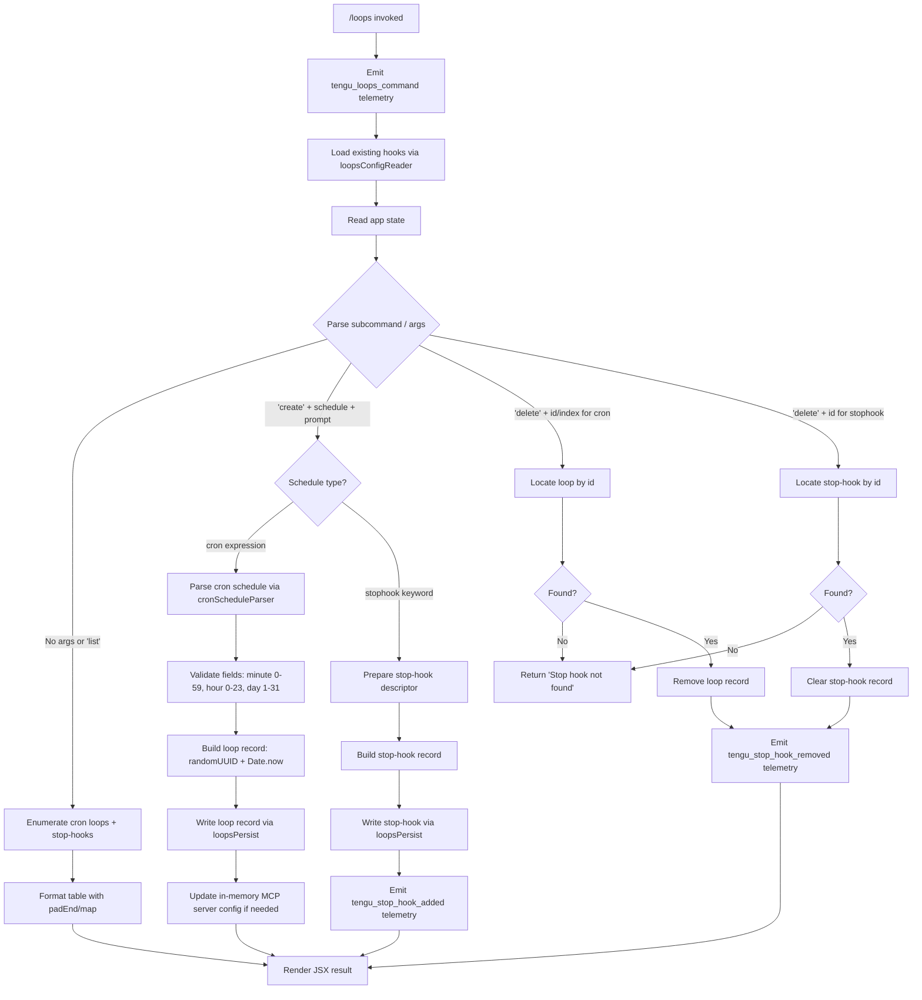

# `/loops`

> Analysis basis: CC v2.1.149 bundle.js (AST extraction + Claude interpretation)
> Minimum version: v2.1.149

---

## Overview

The `/loops` command provides a management interface for recurring loops (cron-scheduled tasks) and stop-hooks (one-shot hooks that fire when the agent stops). Users can list existing loops and stop-hooks, create new ones by specifying a schedule and a prompt, and delete them individually. The command operates directly against the `.claude` configuration directory, reading and writing JSON-encoded hook definitions.

---

## Registration

| Field | Value |
|---|---|
| type | `local-jsx` |
| name | `loops` |
| description | `List, create, and delete recurring loops and stop-hooks` |
| loc_byte | `12099575` |
| loc_byte_end | `12099757` |
| loc_line | `9852` |
| immediate | `true` |
| module_id | `gm1` |
| load_inline | `true` |
| arbor_handler.name | `hH5` |
| arbor_handler.fqn | `claude-2.1.149::hH5` |
| arbor_handler.kind | `AsyncFunction` |
| arbor_handler.resolution_path | `module_id` |
| arbor_handler.n_hits | `0` |

Analysis basis: CC v2.1.149 bundle.js:+12099575

---

## Input Branching

The command has at least five distinct input paths (list, create-cron, create-stophook, delete-cron, delete-stophook), so a Mermaid flowchart is used.



---

## Behavioral Spec

### Top-Level Handler (`hH5`)

The async function `hH5` is the primary entry point for `/loops`.

```
async function loopsCommandHandler(context):
    emit telemetry("tengu_loops_command")              // bundle.js:+12098532

    configData = await loopsConfigReader(context)      // bundle.js:+12098570
    appState   = context.getAppState()                 // bundle.js:+12098582
    loopType   = appState.contains("cron") ? "cron"   // bundle.js:+12098628
                                           : "stophook"// bundle.js:+12098714

    subcommand = parseSubcommand(context.args)

    if subcommand == "list" or no args:
        items = appState.loops.map(formatLoopEntry)    // bundle.js:+12098610
        return renderLoopList(items)

    if subcommand == "create":
        scheduleSpec = extractScheduleSpec(context.args)
        if loopType == "cron":
            loop = buildCronLoop(scheduleSpec)         // bundle.js:+12099082
            persist(loop)                              // bundle.js:+12099180
        else:
            hook = buildStopHook(scheduleSpec)
            persist(hook)
            emit telemetry("tengu_stop_hook_added")

    if subcommand == "delete":
        target = findLoopById(context.args.id)
        if not found:
            return "Stop hook not found"               // bundle.js:+12098974
        removeLoop(target)
        if target.type == "stophook":
            clearStopHookState()
            emit "Stop hook cleared"                   // bundle.js:+12098996
        emit telemetry("tengu_stop_hook_removed")

    return buildJsxResponse(context)                   // bundle.js:+12099335
```

Analysis basis: CC v2.1.149 bundle.js:+12098530

---

### Hooks Configuration Reader (`bHH`)

Called by the handler to read the current loops/hooks configuration from disk.

```
async function loopsConfigReader(context):
    configPath = buildConfigPath()                     // bundle.js:+4763595
    raw        = await fs.readFile(configPath, "utf-8")// bundle.js:+4761607
    parsed     = parseJsonSafe(raw)
    if not Array.isArray(parsed):
        return []
    return parsed.filter(isValidEntry)
```

Analysis basis: CC v2.1.149 bundle.js:+4763595

---

### Config Path Builder (`UKH`)

Constructs the absolute path to the loops configuration file inside the `.claude` directory.

```
function buildConfigPath():
    base = pathJoinHelper(rootDir, ".claude")          // bundle.js:+4761538
    return pathResolver(base)                          // bundle.js:+4761550
```

The literal `".claude"` is used as the subdirectory name (bundle.js:+4762776).

Analysis basis: CC v2.1.149 bundle.js:+4761538

---

### Cron Schedule Parser (`tZ`)

Converts a human-readable or cron-syntax schedule string into an internal schedule object.

```
function cronScheduleParser(scheduleString):
    trimmed = scheduleString.trim()                    // bundle.js:+4759379

    if trimmed matches "Every minute" pattern:         // bundle.js:+4759499
        return { minute: "*", hour: "*", ... }

    if trimmed matches "Every hour" pattern:           // bundle.js:+4759716
        return { minute: "0", hour: "*", ... }

    parts = trimmed.match(cronRegex)                   // bundle.js:+4759520
    minute = parseInt(parts[0])                        // bundle.js:+4759555

    // Validate ranges: minute 0-59, hour 0-23, day 1-31
    validate(minute,  min=0,  max=59)                  // bundle.js:+12098297
    validate(hour,    min=0,  max=23)                  // bundle.js:+12098368
    validate(day,     min=1,  max=31)                  // bundle.js:+12098421

    // Day-of-week parsing: integers 1-7 map to weekdays
    // Ranges such as "1-5" are also supported         // bundle.js:+4760423
    dowSet = parseDayOfWeek(parts)                     // bundle.js:+4757754

    // UTC normalization using Date UTC methods
    date = new Date()
    date.setUTCDate(...)                               // bundle.js:+4760275
    date.setUTCHours(...)                              // bundle.js:+4760306

    return buildScheduleObject(minute, hour, day, dowSet, date)
```

Numeric constants confirming field limits:
- Minute max: `59` (bundle.js:+12098297)
- Hour max: `23` (bundle.js:+12098368)
- Day max: `31` (bundle.js:+12098421)
- Day-of-week range example literal: `"1-5"` (bundle.js:+4760423)

Analysis basis: CC v2.1.149 bundle.js:+4759379

---

### Human-Readable Schedule Formatter (`vN`)

Converts an internal schedule object back to a human-readable description for display.

```
function scheduleFormatter(scheduleObject):
    trimmed = scheduleObject.toString().trim()          // bundle.js:+4758208
    parts   = splitScheduleParts(scheduleObject)        // bundle.js:+4758294
    // Splits on whitespace, matches numeric tokens, parses via parseInt
    // Day-of-week values 3, 6, 7 are treated as weekend boundary markers
    // (literals 3, 6, 7 at bundle.js:+4757869, +4757905, +4757911)
    // Maximum display tokens: 5 (bundle.js:+4758244)
    tokens  = Array.from(parts, formatToken)            // bundle.js:+4758156
    result  = tokens.join(separator)
    output.push(result)                                 // bundle.js:+4758329
    return output
```

Analysis basis: CC v2.1.149 bundle.js:+4758208

---

### Loop Record Creator (`UdH`)

Constructs a new loop record and persists it.

```
async function buildAndPersistLoop(schedule, promptText, context):
    id        = crypto.randomUUID()                    // bundle.js:+4762935
    createdAt = Date.now()                             // bundle.js:+4762997
    record    = {
        id:        id,
        createdAt: createdAt,
        schedule:  schedule,
        prompt:    promptText,
        type:      "cron"
    }
    // Maximum UUID segment length: 8 chars (bundle.js:+4762960)

    existing = await loopsConfigReader(context)        // bundle.js:+4763087
    existing.push(record)                              // bundle.js:+4763100

    await persistLoopsToDisk(existing)                 // bundle.js:+4763132
    await notifySystemOfNewLoop(record)                // bundle.js:+4763181

    return record
```

Analysis basis: CC v2.1.149 bundle.js:+4762935

---

### Stop-Hook Management (`atH` and `otH`)

**Adding a stop-hook (`atH`):**

```
async function addStopHook(hookSpec, context):
    currentState = context.getAppState()               // bundle.js:+10454423
    newHookId    = generateUUID()                      // bundle.js:+10454768

    op = {
        type:      "append",                           // bundle.js:+10454644
        subtype:   "attachment",                       // bundle.js:+10454750
        goal:      hookSpec.goal,                      // bundle.js:+10454709
        goal_status: "active"                          // bundle.js:+10454837
    }

    context.applyMessageOp(op)                         // bundle.js:+10454621
    context.setAppState(updatedState)
    emit telemetry("tengu_stop_hook_added")            // bundle.js:+10454310
    return "Stop hook set"                             // bundle.js:+12099292
```

**Removing a stop-hook (`otH`):**

```
async function removeStopHook(hookId, context):
    currentState = context.getAppState()               // bundle.js:+10454009

    startTime = Date.now()                             // bundle.js:+10454173
    gate      = checkHooksGate(context)                // bundle.js:+10453820

    if not gate.passes("trust_gate"):                  // bundle.js:+10453874
        return earlyExit("Stop")                       // bundle.js:+10453632

    subtype = resolveSubtype(currentState)             // bundle.js:+10453739
    if subtype == "goal_set":                          // bundle.js:+10453952
        context.applyMessageOp({ type: "remove", id: hookId })
        emit telemetry("tengu_stop_hook_removed")      // bundle.js:+10454678
        announceChange("Stop hook cleared")            // bundle.js:+12098996

    context.setAppState(updatedState)                  // bundle.js:+10454211
```

Analysis basis: CC v2.1.149 bundle.js:+10453624 and +10453924

---

### Loop Listing and Formatting (`rtH`, `hjH`)

```
function buildLoopListDisplay(loops, stopHooks):
    columnWidths = computeColumnWidths(loops)          // bundle.js:+8622505
    rows = loops.map(entry =>
        formatRow(entry, columnWidths)                 // bundle.js:+8622274
    )
    // Column padding: 40 characters (bundle.js:+15286746)
    // Separator: two spaces "  " (bundle.js:+15284775)
    output = []
    for row in rows:
        output.push(padEnd(row, 40))                   // bundle.js:+15284754
    output.push(stopHooks)                             // bundle.js:+10453748
    return output
```

Analysis basis: CC v2.1.149 bundle.js:+10453624

---

### Hook Validation and Filtering (`CHH`, `zs`)

Before persisting, the command validates loop definitions against the stored set:

```
function validateAndFilterLoops(incoming, existing):
    if zs.has(incoming.id):                            // bundle.js:+51193
        return { valid: false, reason: "duplicate" }

    filtered = existing.filter(e =>
        not alreadyRegistered(e.id)                    // bundle.js:+4763323
    )
    if filtered.has(incoming.id):                      // bundle.js:+4763338
        return { valid: false, reason: "conflict" }

    // Write new loop files to .claude directory
    fs.mkdir(path.join(root, ".claude"))               // bundle.js:+4762755
    fs.writeFile(loopPath, serialized)                 // bundle.js:+4762852
    return { valid: true, entry: incoming }
```

Analysis basis: CC v2.1.149 bundle.js:+4763265

---

### MCP Server Interaction (`f`, `nv5`, `UyH`)

When a new loop requires a connected MCP server, the command triggers an MCP update cycle:

```
async function mcpUpdateForLoop(loopRecord, context):
    clients   = getClients()                           // bundle.js:+14981282
    entries   = Object.entries(clients)

    for [name, client] of entries:
        if client.status == "disabled":               // bundle.js:+10090705
            continue
        transport = resolveTransport(client)           // bundle.js:+10090807
        // Supported: "stdio", "sse", "http", "sse-ide", "ws-ide"

        result = await connectClient(client)
        applyMcpUpdate(result)                         // bundle.js:+14980861

    return Object.fromEntries(updatedClients)          // bundle.js:+14981647
```

Analysis basis: CC v2.1.149 bundle.js:+14980573

---

## State & Side Effects

| Item | Detail |
|---|---|
| Telemetry: `tengu_loops_command` | Fired at entry to the handler (bundle.js:+12098532) |
| Telemetry: `tengu_stop_hook_added` | Fired when a stop-hook is successfully registered (bundle.js:+10454310) |
| Telemetry: `tengu_stop_hook_removed` | Fired when a stop-hook is deleted (bundle.js:+10454678) |
| Telemetry: `tengu_bg_dispatch_sigkill_escalate` | Fired if background worker escalation occurs during loop dispatch (bundle.js:+15260736) |
| Telemetry: `tengu_daemon_control` | Fired on daemon control operations (bundle.js:+15296846) |
| Telemetry: `tengu_feature_bad` / `tengu_feature_ok` / `tengu_feature_sad` | General feature health signals (bundle.js:+963479, +963421, +963556) |
| Telemetry: `tengu_bg_low_mem_mb` | Memory pressure event during background dispatch (bundle.js:+12607186) |
| Telemetry: `tengu_bg_dispatch_low_mem` | Low-memory guard during dispatch (bundle.js:+15261315) |
| Telemetry: `tengu_bg_spare_enable` / `tengu_bg_spare_claim` / `tengu_bg_spare_spawn` / `tengu_bg_spare_claim_fail` | Spare worker pool lifecycle events (bundle.js:+15262010, +15262131, +15260429, +15262394) |
| Telemetry: `tengu_bg_sendclaim_failed` | Claim send failure on IPC socket (bundle.js:+15241837) |
| Telemetry: `tengu_daemon_config_reload` | Daemon configuration reloaded (bundle.js:+15275522) |
| Telemetry: `tengu_daemon_yield` | Daemon yields to a foreground/service daemon (bundle.js:+15279693) |
| File system writes | Creates/updates hook files inside `.claude/` (bundle.js:+4762776, +4762755, +4762852) |
| appState changes | `applyMessageOp` with `"append"` or remove ops; `setAppState` called after mutation (bundle.js:+10454621, +10454211) |
| Hook registration | Stop-hook recorded as `"attachment"` / `"goal"` subtype in message ops (bundle.js:+10454750, +10454709) |
| MCP server side effects | `applyMcpUpdate` called for affected MCP clients (bundle.js:+14980861) |
| Sound | None detected in depth-2 traversal |
| Daemon IPC | Claim frames sent over Unix socket via `bB.claim` / `bB.buildClaimFrame` (bundle.js:+15241681, +15242138) |

---

## Version History

| Version | Change |
|---|---|
| v2.1.149 | Initial analysis |

---

## Common Mistakes

1. **Omitting the schedule type**: Invoking `/loops create` without specifying `cron` or `stophook` as the loop type leaves the command unable to route to the correct creation path. Always include the keyword explicitly.
2. **Invalid cron field ranges**: Minute values must be 0–59, hour values 0–23, and day-of-month values 1–31. Values outside these ranges will fail validation (bundle.js:+12098297, +12098368, +12098421).
3. **Deleting by display index instead of UUID**: The delete subcommand expects the loop's UUID identifier, not its zero-based index in the list output. Using an index will result in "Stop hook not found" (bundle.js:+12098974).
4. **Expecting immediate effect for cron loops**: Cron loops are scheduled entries; they do not execute immediately upon creation. Use `stophook` type if one-shot-on-stop behavior is desired.
5. **Editing `.claude/` files manually and then running `/loops`**: The reader validates the JSON array structure and filters malformed entries; hand-edited files that are not valid JSON arrays will be silently treated as empty (bundle.js:+4761751).

---

## Appendix — Identifier Mapping

> For bundle debugging only. Identifiers change across versions.

| Identifier | Role |
|---|---|
| `hH5` | Top-level async handler for `/loops` command (entry point, module `gm1`) |
| `c` | Core utility / context accessor called at entry |
| `bHH` | Loops configuration reader (reads hook definitions from disk) |
| `GVH` | Hook file loader — reads, parses, and validates a single hook config file |
| `Q6` | File existence / stat check helper |
| `UKH` | Config path builder — constructs `.claude`-relative path |
| `rK` | Path resolution helper |
| `s9` | JSON parse wrapper |
| `K8` | Error constructor / normalizer |
| `RH` | Hook entry validation and error logging |
| `c_` | Error type discriminator |
| `mH` | String coercion helper |
| `G1` | Traffic classification helper (`"essential-traffic"`) |
| `uiK` | Queue shift/push manager |
| `N` | Tool-call / message node constructor |
| `MVK` | Message value wrapper |
| `H` | Generic collection / map (context-dependent) |
| `CH` | JSON serializer wrapper |
| `X4` | String redaction/sanitizer (`[REDACTED]` literal) |
| `HbH` | String builder helper |
| `OVK` | File write helper with byte-length check |
| `vN` | Human-readable schedule formatter |
| `zP7` | Schedule string splitter and token parser |
| `A` | Generic accumulator array (context-dependent) |
| `L` | Process / promise lifecycle tracker |
| `q` | Active-set tracker (add/delete/has) |
| `M` | Stream or socket handle (context-dependent) |
| `F0` | Fallback path resolver |
| `Dv` | Core dependency/utility (called from multiple helpers) |
| `rtH` | Loop list builder / column-width calculator |
| `hjH` | Column-set helper for display table |
| `K` | Map with padEnd formatting |
| `Oeq` | Row-mapping helper for display |
| `S6` | Shared utility (called at handler start and in sub-handlers) |
| `tZ` | Cron schedule parser (string → schedule object) |
| `w` | Background session / daemon worker manager |
| `C` | Daemon lifecycle controller (LXK/realpath/stat) |
| `LXK` | Real-path + stat resolver for daemon binary |
| `Dz` | Daemon state discriminator |
| `yk5` | PTY executor helper |
| `z` | Daemon write stream wrapper |
| `uH` | Session creation helper |
| `bH` | Session background helper |
| `Kv8` | macOS memory pressure checker (1024 MB threshold) |
| `V6` | Spare-pool eligibility checker |
| `Oz6` | `pins.json` loader and pinned-file reader |
| `wD_` | Pins path builder |
| `g6` | JSON parse safe wrapper |
| `j8` | Error classifier (ENOENT etc.) |
| `v37` | Directory-scan loop reader |
| `g` | Settled-promise retirement helper |
| `v6` | MCP tool-use filter (left/right/collapse/expand) |
| `VH` | Orphaned-permission set manager |
| `yqA` | Claim sender (IPC socket claim flow) |
| `yHA` | Loop config writer (mkdir + writeFile + JSON.stringify) |
| `_k5` | Claim timeout enforcer (5000 ms) |
| `Hk5` | Claim frame builder |
| `EH` | String error wrapper |
| `MB` | Binary message framer (Buffer.allocUnsafe + writeUInt32BE) |
| `uqA` | Full background-session lifecycle manager |
| `bK` | Session base-path builder |
| `cq` | Session state reader / cache invalidator |
| `Bw` | Active-state filter helper |
| `x5` | Session path + hash builder |
| `keH` | Hook executor with timestamp and catch |
| `hLH` | Hook path joiner (w$.join + ShH) |
| `ny` | Notification split helper |
| `wB` | Write-back helper (Al_ path) |
| `VZ6` | Directory ensurer (mkdir + Ll_) |
| `Y` | Loop/session registry (get/set/delete/stop/start) |
| `D` | Daemon dispatch loop (recursive, 2000 ms retry) |
| `$` | Disposable resource wrapper |
| `kqA` | Spare worker spawner (Bun.spawn, `--bg-pty-host`) |
| `S` | Disposable session handle |
| `j` | Active-session iterator (values + kill) |
| `y` | Transient session (yielding to foreground) |
| `J` | Date wrapper (w → getUTCDay / setUTCDate) |
| `CHH` | Loop validation and filtering orchestrator |
| `zs` | Duplicate-ID checker (_.has) |
| `pdH` | Hook file writer (mkdir + writeFile inside `.claude/`) |
| `atH` | Add-stop-hook handler (applyMessageOp append) |
| `gJ1` | UUID generator (crypto.randomUUID) |
| `yH5` | Cron field validator (max/ceil/round with range limits) |
| `UdH` | New loop record constructor and persister |
| `T2H` | Loop record type discriminator |
| `f` | MCP server update orchestrator |
| `UyH` | MCP client connection manager |
| `j6H` | MCP transport dispatcher |
| `bN` | MCP auth handler |
| `t8` | MCP tool registry lookup |
| `HE6` | MCP health evaluator |
| `vkL` | MCP version/latency tracker |
| `h78` | MCP JX helper (y78 + JX) |
| `k78` | MCP FK helper |
| `z8` | MCP debug log pusher |
| `hB_` | MCP OAuth flow initiator |
| `SB_` | MCP OAuth callback handler |
| `IY1` | MCP reconnect / GW8 handler |
| `kB_` | MCP connection builder (JX + FK) |
| `lT_` | MCP capability checker |
| `CL` | MCP error log pusher |
| `ZY1` | MCP list result processor |
| `_E6` | MCP integer parser (parseInt) |
| `NF_` | MCP numeric field parser |
| `QDK` | MCP update applier (applyMcpUpdate) |
| `ZW8` | MCP update serializer |
| `OI` | MCP cleanup orchestrator |
| `nv5` | MCP server sync and retry manager |
| `R78` | MCP tool/resource presence checker |
| `r8` | MCP retry timer (setTimeout + clearTimeout) |
| `ytH` | MCP state serializer |
| `Pn` | Loop notification dispatcher |
| `vqH` | Notification body trimmer |
| `Bs` | Notification pipe writer (200 / 1 000 000 byte limits) |
| `otH` | Remove-stop-hook handler (trust_gate + applyMessageOp) |
| `JQ_` | Hook gate evaluator (Dp + rY + y_ + uL) |
| `Dp` | Policy-settings reader |
| `p8` | Policy gate checker (gp6 + rF) |
| `rY` | Rule evaluator (p8 + TA) |
| `y_` | Gate pass/fail discriminator |
| `uL` | Pt4-based gate resolver |
| `Pt4` | Full gate resolution (mH + ECH + bq + m6 + DFH + gF + x6) |
| `_8` | Early-exit wrapper (c) |
| `Vw` | Output-token counter (zCH + Object.values) |