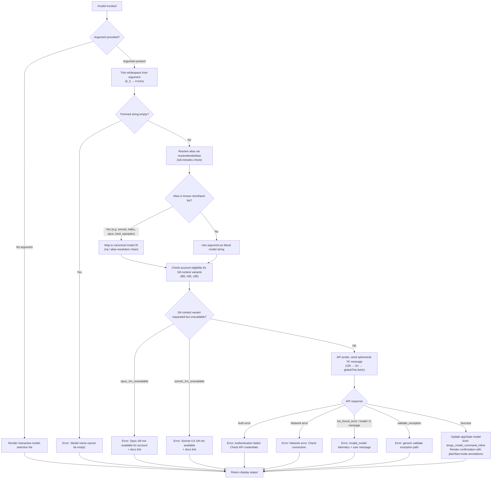

# `/model`

> Analysis basis: CC v2.1.149 bundle.js (AST extraction + Claude interpretation)
> Minimum version: v2.1.149

---

## Overview

The `/model` command allows users to switch the AI model used by Claude Code for the current session. When invoked with a model name argument, it validates the name against available models, performs a lightweight API probe to confirm the model is accessible for the user's account, and updates `appState` accordingly. When invoked without an argument, it renders a structured model-selection UI displaying all eligible models, their tier labels, and relevant plan/fast-mode annotations.

---

## Registration

| Field | Value |
|---|---|
| type | `local` |
| name | `model` |
| description | Set the AI model for Claude Code |
| argumentHint | `<model>` |
| supportsNonInteractive | `true` |
| module_id | `uF1` |
| load_inline | `true` |
| loc_byte | `12286919` |
| loc_byte_end | `12287093` |
| arbor_handler.name | `b_5` |
| arbor_handler.fqn | `claude-2.1.149::b_5` |
| arbor_handler.kind | `AsyncFunction` |
| arbor_handler.resolution_path | `module_id` |
| arbor_handler.n_hits | `0` |

Analysis basis: CC v2.1.149 bundle.js:+12286919

---

## Input Branching

Four distinct execution paths exist depending on argument presence, model alias resolution, and account eligibility. A Mermaid flowchart is used.



Analysis basis: CC v2.1.149 bundle.js:+12278730, +12278746, +12278813, +12240399, +12240436, +12241135, +12241237, +12241356, +12242359, +12242576

---

## Behavioral Spec

### 1. Handler Entry (`b_5`)

The primary async handler (Arbor: `b_5`, `claude-2.1.149::b_5`) is resolved via `module_id` → `uF1`.

```
async function handleModelCommand(args, context):
    rawInput = args.trim()                         // H.trim @ +12278730

    if rawInput is in knownShorthands(iu6):        // iu6.includes @ +12278746
        resolvedModel = resolveAlias(rawInput)
    else:
        resolvedModel = rawInput

    currentState = getAppState()                   // _.getAppState @ +12278769

    if resolvedModel is empty:
        return errorResult("Model name cannot be empty")  // literal @ +12240436

    eligibility = checkAccountEligibility(resolvedModel, currentState)
    if eligibility.blocked:
        return errorResult(eligibility.message)

    validationResult = validateModelViaApi(resolvedModel)
    if validationResult.error:
        emitTelemetry("tengu_model_command_inline", ...)  // @ +12278888
        return errorResult(validationResult.message)

    updateAppState({ model: resolvedModel })
    emitTelemetry("tengu_model_command_inline", ...)
    return renderModelConfirmation(resolvedModel, currentState)
```

Analysis basis: CC v2.1.149 bundle.js:+12278730, +12278746, +12278769, +12278813, +12278888

---

### 2. Alias Resolution (`resolveAlias` → `nq` chain)

The shorthand aliases map to canonical or composite model identifiers. Observed aliases in the literals:

| Shorthand | Resolved Behavior |
|---|---|
| `sonnet` | Maps to the current Sonnet model ID |
| `haiku` | Maps to the current Haiku model ID |
| `opus` | Maps to the current Opus model ID |
| `best` | Maps to the highest-capability model available |
| `opusplan` | "Opus in plan mode, else Sonnet" composite mode |
| `[1m]` suffix | 1M-context variant (subject to eligibility) |

The alias resolver (`nq`) trims, lowercases, applies string replacements, and consults provider routing helpers (`GqH`, `cv`, `UpH`, `GZ`, `D79`, `Z3`, `Fl6`, `BpH`) to produce a fully-qualified model string.

Analysis basis: CC v2.1.149 bundle.js:+2180367, +2180378, +2180504, +2180543, +2180582, +2180619, +2179021, +2179038

---

### 3. Account Eligibility Checks (`l85`, `n85`, `c85`)

Before the API probe, the handler checks whether the user's account tier permits access to 1M-context variants.

```
function checkEligibilityFor1M(resolvedModel, appState):
    modelLower = resolvedModel.toLowerCase()

    // Sonnet 1M branch (n85)
    if modelLower matches "sonnet[1m]" or "sonnet-4-6[1m]":   // +12244156, +12244182
        eligible = checkPlanIncludes1M(appState)               // n85 → b4H → EA, AEq
        if not eligible:
            return blocked("sonnet_1m_unavailable",
                "Sonnet 4.6 with 1M context is not available for your account. " +
                "Learn more: https://code.claude.com/docs/en/model-config#extended-context-with-1m")
                                                               // +12242576, +12242616

    // Opus 1M branch (l85)
    if modelLower matches opus with [1m]:
        eligible = checkPlanIncludes1MOpus(appState)           // l85 → E6H → EA, AEq
        if not eligible:
            return blocked("opus_1m_unavailable",
                "Opus with 1M context is not available for your account. " +
                "Learn more: https://code.claude.com/docs/en/model-config#extended-context-with-1m")
                                                               // +12242359, +12242397

    // Provider/tier flags (c85)
    if WqH includes model prefix:                              // c85 → WqH.includes @ +12243957
        perform case-specific eligibility logic

    return allowed()
```

Analysis basis: CC v2.1.149 bundle.js:+12242181, +12242327, +12242544, +12242770, +12244016, +12244114

---

### 4. API Validation Probe (`rZ8` → `Gx`)

To confirm a model string is valid and accessible, the handler sends a minimal ephemeral message to the API.

```
async function validateModelViaApi(modelId):
    if modelId is empty:
        return error("Model name cannot be empty")    // +12240436

    // Check in-flight deduplication cache (gB1)
    if gB1.has(modelId):                              // +12240680
        return getCachedResult(modelId)

    // Normalize model string
    normalized = modelId.trim().toLowerCase()          // +12240399, +12240559

    // Reject models in deny-list (WqH)
    if WqH.includes(normalized):                       // +12240578
        return error(...)

    // Send minimal "Hi" probe via fetch
    probeRequest = {
        model: modelId,
        messages: [{ role: "user", content: "Hi" }],  // +12240810, +12240844
        max_tokens: 1024,                              // +13038485
        cache_policy: "ephemeral"                      // +12240869
    }
    response = await globalThis.fetch(apiEndpoint, probeRequest)  // Gx @ +13038722

    // Cache result
    gB1.set(modelId, result)                           // +12240888

    // Classify errors
    if response indicates auth failure:
        emit("model_validation", "user")               // +12240775, +12240810
        return error("Authentication failed. Please check your API credentials.")  // +12241135

    if response indicates network error:
        return error("Network error. Please check your internet connection.")      // +12241237

    if response.type == "not_found_error" AND "model:" in response.message:
        emitTelemetry("tengu_model_command_inline", { reason: "invalid_model" })  // +12242859
        return error(...)

    if validate_exception occurred:
        emitTelemetry("tengu_model_command_inline", { reason: "validate_exception" })  // +12242956
        return error(...)

    emitTelemetry("tengu_api_success", ...)            // +13040120
    return success()
```

Analysis basis: CC v2.1.149 bundle.js:+12240399, +12240470, +12240680, +12240725, +12240775, +12240844, +12240869, +12240888, +12241135, +12241237, +12241356

---

### 5. Model Selection UI (`QB1` → `Za_` → `Xg` + `Va_`)

When no argument is passed (or after a successful model switch), the command renders a structured list of available models.

```
function renderModelSelectionList(appState):
    availableModels = buildModelList()           // Za_ → Xg → TA, A.map, f.trim

    for each model in availableModels:
        displayName = formatModelEntry(model)    // Xg: pad to 40 chars, bold/dim styling

        // Provider prefix checks
        if model.startsWith("anthropic."):       // +2174609
            markAsFirstParty()                   // +2179229

        if model.startsWith("claude-"):          // +2174230
            applyClaudeFormatting()

        // Alias display (GqH, JI4, XI4)
        aliasLabel = resolveDisplayAlias(model)

    // Confirmation output (Va_)
    output lines include:
        - Bold model name                        // Va_ → j6.bold @ +12243299
        - Plan annotation: " · Draws from usage credits"  // +12243475
        - Fast mode: " · Fast mode ON" or " · Fast mode OFF"  // +12243424, +12243521
        - Settings source (d85):
            - "model" key in projectSettings / localSettings / policySettings
            - "Managed settings" label when policy-locked  // +12243827

    // Settings provenance (d85 → f0H, p8, BC)
    settingsPath = resolveSettingsPath()         // BC → bv.join(".claude/settings.json")
                                                 // +1211643, +1211653, +1211715

    return formattedList
```

Analysis basis: CC v2.1.149 bundle.js:+12243070, +12243139, +12243183, +12243258, +12243299, +12243345, +12243354, +12243453, +12243466, +12243553, +12243661, +12243681, +12243704, +12243725, +12243827, +12243859, +12243885, +12243893

---

### 6. Provider Routing Context (`sZ8` → `sy` → `iL6` / `CW`)

The handler also consults provider routing tables to determine which model identifiers are valid under the current authentication context (first-party, Bedrock, Vertex, Foundry, Mantle, gateway, enterprise).

```
function resolveProviderContext(appState):
    providerType = getProviderType(appState)  // sZ8 → sy → iL6 → uj, nq

    switch providerType:
        case "firstParty":     // +2179229
            return firstPartyModels()
        case "anthropicAws":   // +2036213
        case "bedrock":        // +2035544
            return bedrockModels()
        case "vertex":         // +2035752
            return vertexModels()
        case "foundry":        // +2035594
            return foundryModels()
        case "mantle":         // +2035704
            return mantleModels()
        case "gateway":        // +2036233
            return gatewayModels()

    // Subscription tier checks (CW → Zt, L$H, FpH)
    tier = getAccountTier()
    switch tier:
        case "max":                    // +2950381
            return maxTierModels()
        case "team":                   // +2950452
        case "default_claude_max_5x":  // +2950467
            return teamModels()
        case "enterprise":             // +2950562
        case "enterprise_usage_based": // +2950584
            return enterpriseModels()
```

Analysis basis: CC v2.1.149 bundle.js:+12278813, +12244420, +12244222, +2179078, +2179229, +2035544, +2035594, +2035704, +2035752, +2036213, +2036233, +2950381, +2950452, +2950467, +2950562, +2950584

---

### 7. `opusplan` Special Mode

The `opusplan` alias (`+2179021`) maps to a composite behavior described as "Opus in plan mode, else Sonnet" (`+2179038`). This is a named preset that selects Opus when Claude Code is in plan-generation mode and falls back to Sonnet otherwise. The display label "Opus Plan" (`+2179329`) is used in the model list UI.

Analysis basis: CC v2.1.149 bundle.js:+2179021, +2179038, +2179329, +2179344, +2179358

---

## State & Side Effects

| Item | Detail |
|---|---|
| Telemetry | `tengu_model_command_inline` (emitted on inline model set, including error sub-reasons `invalid_model`, `validate_exception`, `not_allowed`, `opus_1m_unavailable`, `sonnet_1m_unavailable`) |
| Telemetry | `tengu_api_success` (emitted on successful API probe via `Gx`) |
| Telemetry | `tengu_feature_ok` (emitted via `bH` on successful feature path) |
| Telemetry | `tengu_feature_bad` (emitted via `uH` on failed feature path) |
| appState changes | `appState.model` updated to the validated canonical model string on success |
| API side effect | Ephemeral single-message probe sent to the Anthropic API (`globalThis.fetch`) with `max_tokens: 1024` and cache policy `ephemeral` |
| Cache | In-flight validation results cached in `gB1` (Map) keyed by model ID; reads at `+12240680`, writes at `+12240888` |
| Settings read | Reads `model` key from `projectSettings`, `localSettings`, `policySettings` for provenance display |
| Settings write | <!-- TODO: not found in depth-2 traversal; needs --depth 4 --> |
| Sound | None observed in traversal |
| Hook registration | None observed in traversal |

---

## Version History

| Version | Change |
|---|---|
| v2.1.149 | Initial analysis — async handler `b_5`, alias resolution, 1M eligibility gates, API probe with dedup cache, provider/tier routing, `opusplan` composite mode |

---

## Common Mistakes

1. **Using an empty string or only whitespace as the model argument** — the command explicitly rejects trimmed-empty input with the message "Model name cannot be empty" (`+12240436`). Always supply a non-blank model name or alias.

2. **Assuming alias names are case-sensitive** — the alias resolver lowercases all input (`nq → _.toLowerCase @ +2180378`) before matching. However, the canonical model string forwarded to the API preserves casing from the resolved mapping, not from user input.

3. **Expecting 1M-context variants to be universally available** — `opus[1m]` and `sonnet-4-6[1m]` are gated by account eligibility checks (`l85`, `n85`). Users on plans that do not include extended context will receive a specific error message with a documentation link.

4. **Invoking `/model` in non-interactive mode without an argument** — `supportsNonInteractive: true` applies only when an explicit model argument is provided. The interactive selection UI (`QB1` / `Za_` path) requires a TTY context.

5. **Expecting instant switching for Bedrock/Vertex/enterprise providers** — provider routing (`sZ8` → `sy` → `CW`) applies additional tier and subscription checks before confirming model availability. A model valid for first-party accounts may not resolve under a Bedrock or enterprise context.

6. **Assuming the API probe is free of cost** — the validation probe (`rZ8` → `Gx`) is a real API call with `max_tokens: 1024` marked `ephemeral`. It counts against API quota. Results are deduplicated in a session-scoped cache (`gB1`) to avoid repeated probes for the same model string.

---

## Appendix — Identifier Mapping

> For bundle debugging only. Identifiers change across versions.

| Identifier | Role |
|---|---|
| `b_5` | Primary async handler for `/model` command (Arbor-resolved entry point) |
| `H` | Input argument string (trimmed/processed); also a general utility with `Math.random`/`setTimeout` at depth-2 |
| `_` | App-state accessor namespace (e.g. `_.getAppState`, `_.toLowerCase`, `_.includes`) |
| `sZ8` | Provider context resolver — reads appState and dispatches to model-list builder |
| `sy` | Model list orchestrator — calls `iL6` (model-set builder) and `CW` (tier/plan filter) |
| `iL6` | Model-set builder — delegates to `uj` and `nq` for model entries |
| `uj` | Individual model entry constructor |
| `nq` | Alias/canonical name resolver — trims, lowercases, replaces, and routes through provider helpers |
| `CW` | Tier/plan filter — dispatches to `EA`, `Zt`, `L$H`, `FpH`, `GZ`, `$P`, `Z3`, `RA`, `cf`, `cv` |
| `EA` | First-party plan check (calls `dD`, `oC`, `eA`) |
| `Zt` | "max" tier handler (calls `O1`) |
| `L$H` | "team" / `default_claude_max_5x` tier handler (calls `O1`, `pg`) |
| `FpH` | "enterprise" / `enterprise_usage_based` tier handler (calls `O1`, `EE9`) |
| `GZ` | Model grouping helper (calls `Z3`, `cf`) |
| `$P` | Provider-type discriminator (firstParty branch; calls `ZqH`, `VqH`, `RA`, `EA`, `O1`) |
| `Z3` | Routing helper (calls `RA`) |
| `RA` | Model record constructor (calls `mH`) |
| `cf` | Model capability annotator (calls `JCH`, `UZ4`, `O69`, `zc6`, `RA`) |
| `cv` | Model filter/validator (calls `Z3`, `cf`) |
| `c` | Telemetry/feature-flag utility (shared; emits `tengu_feature_ok` / `tengu_feature_bad`) |
| `QB1` | No-argument path dispatcher — calls `Za_` (model lister) and `Va_` (confirmation renderer) |
| `Za_` | Full model list builder — calls `Xg`, `uH`, `l85`, `n85`, `c85`, `rZ8`, `EH` |
| `Xg` | Individual model row formatter — handles padding (40 chars), alias labels, provider prefix checks |
| `A` | Model array iterator / display buffer |
| `f` | Model metadata lookup helper (UyH, QDK, L.get, L.values) |
| `K` | Column padding helper (L.map, M.padEnd) |
| `q` | Deny-list or file-system utility (SJK.unlinkSync at depth-2; also `q.includes`, `q.map`) |
| `Yc6` | Object.entries-based model properties iterator |
| `ppH` | Model-prefix inclusion check (`jI4.includes`) |
| `Y79` | Model index finder (`ppH`, `A.indexOf`) |
| `JI4` | Alias label resolver (`H.includes`, `GqH`, `nq`) |
| `GqH` | Provider-alias membership check (`WqH.includes`) |
| `XI4` | Extended alias resolver (`GqH`, `nq`, `z79`, `_.startsWith`) |
| `uH` | Feature-bad telemetry emitter (calls `c`) |
| `l85` | Opus 1M eligibility checker (lowercases, calls `E6H`, `$P`, `_.includes`) |
| `E6H` | 1M eligibility API call helper (calls `ZqH`, `EA`, `AEq`) |
| `n85` | Sonnet 4.6 1M eligibility checker (lowercases, calls `b4H`, `_.includes`) |
| `b4H` | Sonnet 1M eligibility API call helper (calls `ZqH`, `EA`, `AEq`) |
| `c85` | Provider-prefix deny-list check for model strings (`WqH.includes`, lowercases) |
| `rZ8` | API validation probe orchestrator (trim, `Xg`, lowercase, `WqH`, `gB1`, `Gx`, `g85`) |
| `Gx` | HTTP fetch wrapper for API probe (`globalThis.fetch`, `Kp`, `X`, `Lp`, performance timing) |
| `g85` | API probe response classifier (calls `Q85`, `String`) |
| `EH` | String coercion utility (calls `String`) |
| `Va_` | Model confirmation renderer (bold name, plan annotation, fast-mode label, settings provenance) |
| `bH` | Feature-ok telemetry emitter (calls `c`) |
| `kK` | Model metadata formatter (calls `RA`, `mH`) |
| `mH` | String utility / model ID formatter (calls `String`) |
| `A$H` | Additional annotation helper in confirmation output |
| `BD` | Fast-mode / Opus variant annotator (calls `kK`, `CW`, `nq`, `jn`, `q.includes`) |
| `jn` | Display string constructor (calls `mH`) |
| `cJH` | "Draws from usage credits" annotation helper (calls `EA`, `nq`, `QJ`, `q.includes`, `jn`, `bW`) |
| `QJ` | Tier-aware display helper (calls `nq`, `CW`) |
| `bW` | ZqH-based formatting helper |
| `d85` | Settings provenance renderer (calls `f0H`, `p8`, `BC`, `j6.dim`, `j6.bold`, `Jn`) |
| `f0H` | Settings file path builder (calls `Nm`, `p8`) |
| `p8` | Settings read helper (calls `gp6`, `rF`) |
| `BC` | `.claude/settings.json` path joiner (`bv.join`) |
| `Jn` | Settings display row formatter (calls `GqH`, `uj`, `nq`) |

---

Note: index built via Arbor fallback; some signals (telemetry, literals) may be missing — see arbor-fallback.js.