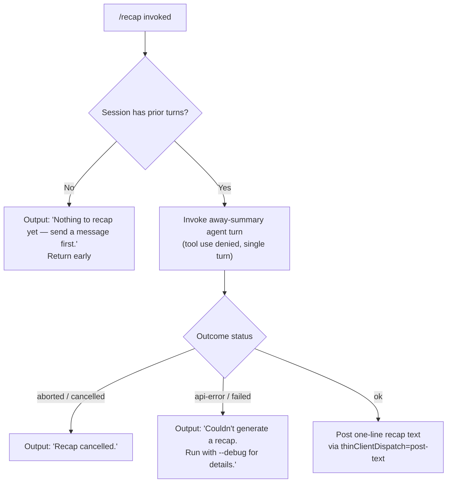

# `/recap`

> Analysis basis: CC v2.1.149 bundle.js (AST extraction + Claude interpretation)
> Minimum version: v2.1.149

---

## Overview

`/recap` triggers an on-demand, single-turn "away summary" that produces a one-line recap of the current session. It invokes the same summarisation pipeline used for background away-summaries, dispatching a tool-restricted agent turn and presenting the result as a text message in the chat. If no session history is present, or if the run is cancelled or fails, the command emits an appropriate short status message rather than a recap.

---

## Registration

| Field | Value |
|---|---|
| type | `local` |
| name | `recap` |
| description | `Generate a one-line session recap now` |
| loc_byte | `12556654` |
| loc_byte_end | `12556870` |
| loc_line | `10535` |
| supportsNonInteractive | `false` |
| thinClientDispatch | `post-text` |
| load_inline | `true` |
| load_ident | `GK5` |
| arbor_handler.name | `GK5` |
| arbor_handler.fqn | `claude-2.1.149::GK5` |
| arbor_handler.kind | `AsyncFunction` |
| arbor_handler.resolution_path | `load_ident` |
| arbor_handler.n_hits | `0` |

Analysis basis: CC v2.1.149 bundle.js:+12556654

---

## Input Branching

Four distinct outcome branches exist: the no-history early exit, the abort/cancel path, the API-error path, and the happy-path (successful recap). A Mermaid flowchart is used.



Analysis basis: CC v2.1.149 bundle.js:+12556404, :+12556496, :+12556554

---

## Behavioral Spec

### Main Handler — `recapCommandHandler` (bundle: `GK5`)

```
async function recapCommandHandler(context):
    // 1. Guard: require existing conversation history
    cacheSafeParams = lookupCacheSafeParams(context)
    if cacheSafeParams is null:
        log.debug("[awaySummary] no CacheSafeParams saved, skipping")
        return earlyExit("no-turn")

    // 2. Invoke the away-summary pipeline
    result = await runAwaySummaryTurn(cacheSafeParams, context)

    // 3. Branch on result status
    switch result.status:
        case "aborted":
            postText("Recap cancelled.")
            return

        case "api-error":
            postText("Couldn't generate a recap. Run with --debug for details.")
            return

        case "ok":
            postText(result.summaryText)   // one-line recap
            return
```

Analysis basis: CC v2.1.149 bundle.js:+12556262 (`GK5`→`V48`), :+12556404, :+12556496, :+12556554

---

### Away-Summary Turn Dispatcher — `awaySummaryDispatcher` (bundle: `V48`)

```
async function awaySummaryDispatcher(cacheSafeParams, context):
    // Early exit if no saved params
    if not cacheSafeParams:
        logDebug("[awaySummary] no CacheSafeParams saved, skipping")
        return { status: "no-turn" }

    // Set up abort signal listener
    abortController = new AbortController()
    context.signal.addEventListener("abort", () => abortController.abort())

    // Run a single summarisation agent turn
    // Tool use is explicitly denied for this turn
    agentResult = await runSingleAgentTurn(
        params      = cacheSafeParams,
        toolPolicy  = "deny",          // "Away summary cannot use tools"
        turnType    = "away_summary",
        abortSignal = abortController.signal
    )

    // Map agent outcome to recap status
    if agentResult.wasAborted:
        return { status: "aborted" }
    if agentResult.hasApiError:
        return { status: "api-error" }

    // Collect final text from the turn
    summaryText = extractFlatText(agentResult.messages)
    return { status: "ok", summaryText }
```

Analysis basis: CC v2.1.149 bundle.js:+5317133 (`V48`→`$6H`), :+5317154, :+5317212, :+5317268, :+5317445, :+5317460, :+5317528, :+5317672, :+5317761, :+5317822

---

### Tool-Denial Gate — `toolDenyPolicy` (bundle: `N`, sub-path inside `V48`)

```
function toolDenyPolicy(toolCallRequest):
    // All tool calls are refused during recap
    return {
        decision : "deny",
        reason   : "Away summary cannot use tools"
    }
```

Analysis basis: CC v2.1.149 bundle.js:+5317445, :+5317460

---

### Session-History Check — `lookupCacheSafeParams` (bundle: `$6H`, called from `V48`)

```
function lookupCacheSafeParams(context):
    // Returns the saved CacheSafeParams for the current session,
    // or null if no messages have been exchanged yet.
    params = sessionStore.getCacheSafeParams(context.sessionId)
    return params   // null → no-turn early exit
```

Analysis basis: CC v2.1.149 bundle.js:+5317133

---

### Summary-Text Extraction — `extractFlatText` (bundle: `vOq`)

```
function extractFlatText(messages):
    // Flatten assistant message content blocks into a single string
    return messages
        .flatMap(msg => msg.content)
        .filter(block => block.type === "text")
        .map(block => block.text)
        .join("")
```

Analysis basis: CC v2.1.149 bundle.js:+5317988 (`vOq`→`H.flatMap`)

---

### Core Agent-Turn Loop — `agentQueryLoop` (bundle: `LxL`, depth-2 from `fu`)

The recap reuses the shared agent query loop. Key characteristics for this invocation:

- Single turn (`max_turns = 1` effectively, enforced via `away_summary` turn type).
- `avoid_prompts` flag is set to suppress interactive prompting (Analysis basis: CC v2.1.149 bundle.js:+10584923).
- `autocompact` is available in the loop but will not trigger on a single short turn (Analysis basis: CC v2.1.149 bundle.js:+10548694).
- Model is called via `D.callModel` (Analysis basis: CC v2.1.149 bundle.js:+10552161).
- Telemetry hooks fire around the streaming call (see State & Side Effects).

---

### Conversation-File Persistence — `sessionFileWriter` (bundle: `OVK` + `$VK`)

```
async function sessionFileWriter(content, sessionPath):
    dir = path.dirname(sessionPath)
    await fs.mkdir(dir, { recursive: true })
    await fs.appendFile(sessionPath, content)
    byteCount = Buffer.byteLength(content)

    if byteCount > rotationThreshold:
        await rotateSessionFile(sessionPath)
    // Rotation renames .txt → .txt.<n> and removes old segments
```

Analysis basis: CC v2.1.149 bundle.js:+202192 (`OVK`), :+201946 (`$VK`→`dI.mkdir`), :+202005 (`$VK`→`dI.appendFile`), :+201650 (`.txt` extension), :+201702 (`KMA`→`dI.rename`)

---

## State & Side Effects

| Item | Detail |
|---|---|
| Telemetry — query lifecycle | `tengu_query_error` (bundle.js:+10556683), `tengu_model_fallback_triggered` (:+10556358), `tengu_model_response_keyword_detected` (:+10557327), `tengu_malformed_tool_use_response` (:+10560719) |
| Telemetry — streaming | `tengu_streaming_tool_execution_used` (:+10563016), `tengu_streaming_tool_execution_not_used` (:+10563119) |
| Telemetry — compact | `tengu_auto_compact_rapid_refill_breaker` (:+10549019), `tengu_auto_compact_succeeded` (:+10549480), `tengu_ptl_surfaced_to_user` (:+10551524), `tengu_post_autocompact_turn` (:+10565442) |
| Telemetry — hooks | `tengu_stop_hook_block_count` (:+10561673), `tengu_loop_dynamic_wakeup_ends_turn` (:+10565275) |
| Telemetry — agent queries | `tengu_query_before_attachments` (:+10565556), `tengu_query_after_attachments` (:+10567874), `tengu_fork_agent_query` (:+10588759), `tengu_forked_agent_default_turns_exceeded` (:+10588316) |
| Telemetry — features | `tengu_feature_ok` (:+963421), `tengu_feature_bad` (:+963479) |
| Telemetry — background PTY | `tengu_bg_spare_enable`, `tengu_bg_spare_spawn`, `tengu_bg_spare_claim`, `tengu_bg_spare_claim_fail`, `tengu_bg_dispatch_sigkill_escalate`, `tengu_bg_dispatch_low_mem`, `tengu_bg_attach`, `tengu_bg_attach_stall_gave_up`, `tengu_bg_attach_stall_respawn`, `tengu_bg_attach_kick`, `tengu_bg_attach_legacy_autorespawn`, `tengu_bg_proto_mismatch`, `tengu_bg_dispatch_stale_drop`, `tengu_bg_low_mem_mb` |
| Telemetry — MCP | `tengu_mcp_tools_refreshed_mid_turn` (:+10568177) |
| Tool policy | All tools denied during the recap turn; any tool-use attempt returns "Away summary cannot use tools" (bundle.js:+5317460) |
| thinClientDispatch | `post-text` — the recap result is dispatched as a plain text message, not rendered as a rich UI block |
| appState changes | `H.getAppState` / `H.setAppState` called inside the agent loop (`iJ8`); session state is updated after the turn completes (bundle.js:+10584693, :+10585473) |
| File I/O | Recap turn messages appended to session file via `dI.appendFile`; rotation via `dI.rename` / `dI.unlink` when size threshold exceeded (bundle.js:+202005, :+201702, :+201742) |
| Hook registration | `a9` registers a stop/lifecycle hook via `W7A.register` (bundle.js:+58272); `OVK` calls `a9` at bundle.js:+202555 |
| AbortController | An `AbortController` is created for the recap turn; the parent signal's `"abort"` event propagates to it (bundle.js:+5317249, :+5317280) |
| supportsNonInteractive | `false` — command cannot be invoked in non-interactive (headless) mode |

---

## Version History

| Version | Change |
|---|---|
| v2.1.149 | Initial analysis |

---

## Common Mistakes

1. **Running `/recap` before any messages** — the command silently exits with "Nothing to recap yet — send a message first." rather than producing a summary. At least one completed user/assistant turn must exist.
2. **Expecting tool results in the recap** — the away-summary turn explicitly denies all tool calls. Any expectation that the recap will read files, run searches, or call MCP tools will not be met.
3. **Using in non-interactive sessions** — `supportsNonInteractive: false` means invoking `/recap` in a script or headless pipeline will not work; use a fully interactive REPL session.
4. **Interpreting "Couldn't generate a recap" without debug output** — pass `--debug` to the CLI to surface the underlying API error, as the user-facing message intentionally omits technical detail.
5. **Assuming the recap persists across sessions** — the generated summary text is posted as a transient `post-text` dispatch and is not written back as a durable session summary entry.

---

## Appendix — Identifier Mapping

> For bundle debugging only. Identifiers change across versions.

| Identifier | Role |
|---|---|
| `GK5` | Main handler for `/recap` (`recapCommandHandler`); async function resolved via `load_ident` |
| `V48` | Away-summary turn dispatcher; orchestrates the single summarisation agent turn |
| `$6H` | CacheSafeParams lookup; retrieves saved session params or returns null |
| `N` | Shared message/content processing utility (used in multiple paths) |
| `MVK` | Message-value transformation helper |
| `T7A` | Sub-helper within `MVK`; calls `fTK` and `$TK` |
| `H` | Session/context object (also used as a timer/random source in some call sites) |
| `CH` | JSON serialisation helper (`JSON.stringify` wrapper) |
| `_` | String utilities (`.toUpperCase`, `.push`, etc.) |
| `X4` | Path/filename normalisation utility |
| `s5A` | Segment-map builder used by `X4` |
| `q` | File queue / unlink helper |
| `A` | Lowercase / path helper |
| `HbH` | Write-wrapper calling `B5A` |
| `B5A` | Underlying stream write helper (`H.write`) |
| `OVK` | Session-file persistence controller; manages mkdir, append, rotation, hook registration |
| `ICH` | Async batch-write scheduler with `setTimeout`/`setImmediate` |
| `q9H` | Path-joining and segment helper used by `OVK` |
| `Q6` | Rotation/compaction predicate |
| `G96` | Directory-existence guard (`K8`) |
| `LMA` | Session-file path builder |
| `KMA` | File-rotation executor (stat → rename → unlink) |
| `$VK` | Append-and-rotate write unit |
| `a9` | Hook registrar (`W7A.register`) |
| `tW` | Single agent turn runner; drives `iJ8`, `fu`, and message posting |
| `iJ8` | Core per-turn execution: loads state, calls model, sets state |
| `ok` | AbortController setup and binding helper |
| `QKH` | State snapshot loader/dumper (`sb`, `_.load`, `H.dump`) |
| `GzH` | Pre-turn state preparation helper |
| `jqq` | Post-turn state commit helper |
| `M` | Stream/connection close utility |
| `FW8` | Turn metadata finaliser |
| `My` | Random-bytes token generator (`GGq.randomBytes`) |
| `T` | Message-store reference (`HE6`, `wh8`) |
| `HE6` | Message store entry type A |
| `wh8` | Message store entry type B |
| `l8H` | Summary/turn-output collector; calls `h4` and `yyH` |
| `h4` | Hook-accessor helper |
| `yyH` | Message-filter for summary content (`Sv8`, `Bv8`, `nL5`) |
| `fu` | Agent query entry point; calls `LxL`, `W28`, `bH`, `uH` |
| `LxL` | Full agent query loop (multi-step, tool-execution, compaction) |
| `W28` | Subagent-exit / ready-state handler |
| `bH` | Turn-context builder (wraps `c`) |
| `uH` | Turn-result unwrapper (wraps `c`) |
| `jE6` | SSE/event-type set membership check (`sSL.has`) |
| `UJH` | Post-turn notification dispatcher |
| `N08` | Turn-count / loop-limit checker |
| `Rj1` | Dynamic wakeup / continuation helper |
| `D` | Background PTY session manager (spawn, dispose, push) |
| `V6` | Session-registry lookup and add |
| `$` | Disposable resource handle |
| `Kv8` | macOS memory-pressure aware session helper (1024 MB threshold) |
| `kqA` | Background spare PTY spawner (`Bun.spawn`, `--bg-pty-host`) |
| `c` | Core observable/reactive primitive |
| `Dz` | Session cleanup utility |
| `K8` | Directory-existence checker |
| `RH` | Error reporter (`ll.logError`, `uiK`) |
| `XxL` | Forked-agent query wrapper |
| `T8` | Tool-use message builder (`pV.randomUUID`) |
| `X` | PTY IPC framing layer (`Buffer.concat`, `w.off`, `zM`) |
| `J` | Stream/pipe reference |
| `w` | PTY worker process manager |
| `zM` | IPC message encoder (`H.end`, `CH`) |
| `zk5` | Full PTY protocol handler (ping, nudge, dispatch, attach, resize, etc.) |
| `EH` | String coercion utility |
| `vOq` | Away-summary text extractor (`H.flatMap`) |

---

Note: index built via Arbor fallback; some signals (telemetry, literals) may be missing — see arbor-fallback.js.