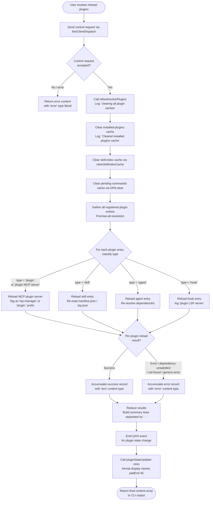

# `/reload-plugins`

> Analysis basis: CC v2.1.149 bundle.js (AST extraction + Claude interpretation)
> Minimum version: v2.1.149

---

## Overview

`/reload-plugins` activates any pending plugin changes in the current Claude Code session without requiring a full restart. It does this by sending a `control-request` to the daemon, flushing all in-memory plugin caches, and re-resolving every registered plugin (MCP server, skill, LSP server, and agent-type) from disk, then reporting success or error for each one.

---

## Registration

| Field | Value |
|---|---|
| type | `local` |
| name | `reload-plugins` |
| description | `Activate pending plugin changes in the current session` |
| supportsNonInteractive | `false` |
| thinClientDispatch | `control-request` |
| module_id | `yU1` |
| load_inline | `true` |
| loc_byte | `12190175` |
| loc_byte_end | `12190394` |
| loc_line | `9967` |
| arbor_handler.name | `c65` |
| arbor_handler.fqn | `claude-2.1.149::c65` |
| arbor_handler.kind | `AsyncFunction` |
| arbor_handler.resolution_path | `module_id` |
| arbor_handler.n_hits | `0` |

Analysis basis: CC v2.1.149 bundle.js:+12190175

---

## Input Branching

The handler branches across five or more distinct outcomes (control request result, per-plugin type classification, per-plugin reload success/failure, LSP vs MCP vs skill vs agent, summary message construction). A Mermaid flowchart is used.



Analysis basis: CC v2.1.149 bundle.js:+12189197 – +12189680

---

## Behavioral Spec

### 1. Handler Entry — `asyncReloadPluginsHandler` (`c65`)

```
async function asyncReloadPluginsHandler(context):
    // Step 1: send control request
    sendControlRequest(context.connection, "ccr")   // literal "ccr" at +12189215
    // "ccr" = claude control request token

    // Step 2: refresh all plugin caches
    await refreshActivePlugins(context)             // dXH at +12189605

    // Step 3: update plugin state tracking
    updatePluginStateMap(context)                   // bLH at +12189637

    // Step 4: format and return result lines
    result = formatPluginSummary(context)           // nHH at +12189680
    return result
```

Analysis basis: CC v2.1.149 bundle.js:+12189197

---

### 2. Control Request Dispatch — `sendControlRequest` (`H$` → `Z2H`)

```
function sendControlRequest(connection, token):
    // token = "ccr" (bundle.js:+12189215)
    // dispatches via thinClientDispatch="control-request"
    // internally calls connection.sendControlRequest (A.sendControlRequest at +12189234)
    // uses connection object A whose toLowerCase normalisation
    // occurs at +15286672 (transport layer)
    lowerCaseNormalise(connection.type)
    enqueue(token, connection)
```

Analysis basis: CC v2.1.149 bundle.js:+12189197, +12189234

---

### 3. Cache Flush & Plugin Re-resolution — `refreshActivePlugins` (`dXH`)

This is the core reload routine. It performs the following steps in order:

```
async function refreshActivePlugins(context):
    log("refreshActivePlugins: clearing all plugin caches")
    // literal at +12187082

    // 3a. Clear installed-plugin cache
    clearInstalledPluginsCache()        // Xf1 → N at +12187134
    // logs "Cleared installed plugins cache" (+9650104)

    // 3b. Clear skill-index cache
    clearSkillIndexCache()              // q3 → bo → Vx.clearSkillIndexCache at +12187140
    // H.clearSkillIndexCache at +12743658

    // 3c. Clear pending-command cache
    clearPendingCommandsCache()         // q3 → XyH → DP8.clear at +12187282 / +9594062

    // 3d. Reload all plugin configurations from disk
    pluginConfigs = await Promise.all([
        loadMcpJsonConfigs(),           // vr → jWq → Tw6 at +12187386
        loadLspConfigs(),               // pIH at +12187547
    ])
    // MCP config files: ".mcp.json" (+6449967), ".mcpb" (+5111448), ".dxt" (+5111469)
    // LSP config file: ".lsp.json" (+8021716)

    // 3e. Merge and deduplicate plugin entries
    mergedPlugins = pluginConfigs.reduce(mergeEntries)  // $.reduce at +12187616

    // 3f. For each plugin, classify by type string
    for entry in mergedPlugins:
        if entry.type in ["plugin", "plugin MCP server"]:    // +12189420
            reloadMcpPlugin(entry)
        elif entry.type == "skill":                           // +12189360
            reloadSkill(entry)
        elif entry.type == "agent":                           // +12189388
            reloadAgent(entry)
        elif entry.type == "hook":                            // +12189854
            reloadHook(entry)

    // 3g. Emit plugin state-change event
    emitPluginStateChange(QXH)          // QXH.emit at +12188169

    // 3h. Build result lines with separator " · "  (+12189447)
    resultLines = buildResultLines(mergedPlugins)
    // Success entries use content type "text"  (+12189577)
    // Error entries use content type "error"   (+12189502)

    // 3i. Emit telemetry event "reload_plugins" (+12189264)
    telemetry.track("reload_plugins")

    return resultLines
```

Analysis basis: CC v2.1.149 bundle.js:+12187080, +12187082, +12187134, +12187140, +12187189, +12187547, +12187616, +12188169, +12189264, +12189447, +12189502, +12189577

---

### 4. MCP/MCPB Plugin Loading — `loadMcpConfigs` (`vr` → `jWq` → `Tw6`)

```
async function loadMcpConfigs(projectRoot):
    // Scans for ".mcp.json" files (+6449967)
    // Also processes ".mcpb" binary archives (+5111448)
    // Also processes ".dxt" extension packages (+5111469)

    for each candidate file:
        if file.endsWith(".mcpb"):
            // extract MCPB archive (+5118653: "Extracting MCPB archive...")
            // require "manifest.json" inside archive (+5117468)
            // if missing: error "No manifest.json found in MCPB file" (+5118764)
            // hash content with md5 (+5118305), hex encoding (+5118329)
            config = parseMcpbManifest(file)

        elif file.endsWith(".mcp.json"):
            raw = readFile(file, "utf-8")  // +6450633
            config = JSON.parse(raw)

        // Check plugin status field (+6449106: "status")
        // Filter by transport: "http" (+6449526), "download" (+6449547), "network" (+6449571)
        // On download failure: "mcpb-download-failed" (+6449596)
        // On invalid manifest: "mcpb-invalid-manifest" (+6449737)
        // On extract failure: "mcpb-extract-failed" (+6449833)

    return configs
```

Analysis basis: CC v2.1.149 bundle.js:+6449967, +5111448, +5111469, +5117468, +5118305, +5118653, +6449106, +6449526, +6449596

---

### 5. LSP Plugin Loading — `loadLspConfigs` (`pIH` → `Q5L`)

```
async function loadLspConfigs(pluginRoot):
    // pluginRoot key: "pluginRoot" (+8645481)
    // config file: ".lsp.json"  (+8021716)
    raw = readFile(join(pluginRoot, ".lsp.json"))

    try:
        config = JSON.parse(raw)
    except:
        logError("lsp-config-invalid")    // +8021986
        logError("Failed to parse JSON file")  // +8022433
        return []

    // Validate each path is relative and within plugin directory
    // Error if not: "Invalid path: must be relative and within plugin directory" (+8022916)
    // Disallow parent traversal ".." (+8021615)

    for each server entry:
        normalise(entry)
        entries.push(entry)

    return entries
```

Analysis basis: CC v2.1.149 bundle.js:+8021716, +8021986, +8022433, +8022916

---

### 6. Plugin State Map Update — `updatePluginStateMap` (`bLH`)

```
function updatePluginStateMap(context):
    // Reads current state from _.get / _.set  (+11367262, +11367298)
    // Adds new entries: $.add  (+11367320)

    for each plugin in resolvedPlugins:
        // Load marketplace data from "known_marketplaces.json" (+9621673)
        marketplaceEntry = loadMarketplace(plugin)

        // Validate dependency tree
        deps = resolveDependencies(plugin)    // RP at +11367564

        if deps.status == "dependency-unsatisfied":   // +11367198
            markUnsatisfied(plugin)
        elif deps.status == "not-found":              // +11367235
            markNotFound(plugin)

        // Check policy: "blocked-by-policy" (+5133677)
        //               "marketplace-blocked-by-policy" (+5133769)
        //               "dependency-blocked-by-policy" (+5135003)
        if policyBlocked(plugin):
            markBlocked(plugin)
            continue

        // Scope check: "managed" scope blocks installs (+4887740)
        if plugin.scope == "managed":
            error("Cannot install plugins to managed scope")  // +4887762

        // Version range resolution
        // Uses semver: oQ.valid, oQ.coerce, oQ.satisfies (+4921515–+4921569)
        // Error types: "too-complex" (+4919893), "invalid" (+4920134),
        //              "disjoint" (+4920633), "range-conflict" (+5136455)
        resolveVersionRange(plugin)

        // Update MCP server connection state
        // Transport types: "sdk" (+15131664), "sse" (+15129689), "dynamic" (+15129734)
        // Connection states: "connected" (+15131800), "failed" (+15131929)
        updateConnectionState(plugin)

        // Mark updated or added in summary
        // "Updated" (+9655329), "Added" (+9655340)
        recordChange(plugin)
```

Analysis basis: CC v2.1.149 bundle.js:+11367198, +11367235, +11367262, +11367564, +4887740, +5133677, +9655329

---

### 7. Result Formatter — `formatPluginSummary` (`nHH`)

```
function formatPluginSummary(resolvedPlugins):
    // Formats display names using padEnd(40) for alignment  (+15284746, +15284775: "  ")
    // Limits display to 5 entries per group  (+4925189: 5)
    // Separates entries with " · "  (+12189447)
    // Groups under labels: "dependency" (+4925303), "dependencies" (+4925316)

    lines = []
    for plugin in resolvedPlugins[0..5]:
        name = plugin.name.padEnd(40)
        if plugin.error:
            label = join([name, plugin.errorCode], " · ")
            lines.push({ type: "error", text: label })
        else:
            lines.push({ type: "text", text: name })

    return lines
```

Analysis basis: CC v2.1.149 bundle.js:+12189447, +12189502, +12189577, +4925189, +15284746

---

## State & Side Effects

| Item | Detail |
|---|---|
| Telemetry — `reload_plugins` event | Fired once per invocation (string literal `"reload_plugins"` at bundle.js:+12189264) |
| Telemetry — `tengu_daemon_yield` | Emitted by daemon layer if session yields to foreground (bundle.js:+15279693) |
| Telemetry — `tengu_daemon_control` | Emitted on daemon control request dispatch (bundle.js:+15296846) |
| Telemetry — `tengu_feature_ok` / `tengu_feature_sad` / `tengu_feature_bad` | Feature-level outcome tracking on the underlying control-request path (bundle.js:+963421, +963556, +963479) |
| Installed-plugins cache | Cleared unconditionally on every invocation (bundle.js:+9650104) |
| Skill-index cache | Cleared via `H.clearSkillIndexCache` (bundle.js:+12743658) |
| Pending-commands cache | Cleared via `DP8.clear` (bundle.js:+9594062) |
| Plugin state map | Updated with new resolved entries; triggers `QXH.emit` state-change event (bundle.js:+12188169) |
| MCP server connections | Existing connections may be closed and reopened (`A.close`, `q.close` at bundle.js:+15272033, +15272043) |
| LSP server connections | Re-registered via `W7A.register` (bundle.js:+58272) |
| File I/O | Reads `.mcp.json`, `.mcpb`, `.dxt`, `.lsp.json`, `manifest.json`, `known_marketplaces.json`, `marketplace.json`, `daemon.status.json` |
| Hook registration | Hooks re-registered on reload; type literal `"hook"` at bundle.js:+12189854 |
| Sound | None detected |
| appState changes | Plugin state store updated via `_.get`/`_.set` on the central plugin registry (bundle.js:+11367262, +11367298) |
| Non-interactive support | `supportsNonInteractive: false` — command is interactive-session only |

---

## Version History

| Version | Change |
|---|---|
| v2.1.149 | Initial analysis |

---

## Common Mistakes

1. **Running in non-interactive mode**: `supportsNonInteractive` is `false`. Invoking `/reload-plugins` in a non-interactive (`--print` / pipe) session will be rejected or silently skipped.
2. **Expecting instant MCP reconnection**: The command clears caches and re-resolves plugin configurations, but MCP server processes are not force-killed; existing transport connections are gracefully closed first. If a server is slow to close, the new connection may take a moment to appear.
3. **Managed-scope plugins**: Plugins installed under the `"managed"` scope cannot be modified. `/reload-plugins` will surface a `"Cannot install plugins to managed scope"` error for those entries but will still reload all other plugins.
4. **Unsupported source types**: If a plugin's source type is not recognised by the current CC version, the reload will return the error `"This plugin uses a source type your Claude Code version does not support. Update Claude Code and try again."` (bundle.js:+5154338) for that entry.
5. **yarn/pnpm lockfiles**: Plugins whose npm install step uses yarn or pnpm lockfiles will be skipped with a warning (`"Skipped: yarn/pnpm lockfiles are not supported…"` at bundle.js:+4932002). Use npm or bun instead.
6. **Policy blocks silently drop plugins**: If an enterprise policy blocks a plugin source, the plugin is dropped from the active set without an interactive prompt. Check the output lines for `"blocked-by-policy"` entries.

---

## Appendix — Identifier Mapping

> For bundle debugging only. Identifiers change across versions.

| Identifier | Role |
|---|---|
| `c65` | Main async handler for `/reload-plugins` (`asyncReloadPluginsHandler`) |
| `H$` | Control-request dispatcher (sends "ccr" token) |
| `Z2H` | Low-level control-request enqueue helper |
| `Uc` | Pre-flight check before plugin reload |
| `k8` | Generic error-code formatter helper |
| `dXH` | Core cache-flush and plugin re-resolution function (`refreshActivePlugins`) |
| `N` | Logger / structured-log emitter |
| `MVK` | Plugin-list aggregator |
| `T7A` | Plugin type classifier |
| `CH` | JSON serialiser wrapper |
| `X4` | Path normaliser / redactor (uses `"[REDACTED]"`) |
| `s5A` | Header/value mapper |
| `HbH` | Stream write helper |
| `B5A` | Low-level write emitter |
| `OVK` | Plugin config writer / file-append orchestrator |
| `ICH` | Debounced batch-write coordinator |
| `q9H` | File join + write helper |
| `Q6` | Filesystem `stat`/`access` wrapper |
| `G96` | Error-code classifier (`K8`) |
| `LMA` | Path-join + write helper |
| `KMA` | File rename/unlink helper (handles `.txt` suffix rotation) |
| `$VK` | Directory-create + appendFile orchestrator |
| `a9` | Hook registrar (`W7A.register`) |
| `Xf1` | Installed-plugins cache clear entry point |
| `q3` | Skill-index and pending-command cache coordinator |
| `hTL` | Plugin loader pipeline orchestrator |
| `ZE` | Plugin state initialiser |
| `GP8` | Plugin entry constructor |
| `nK8` | Plugin notification helper |
| `$j8` | Plugin error-flag setter |
| `sC_` | Plugin-root directory scanner |
| `RH` | Per-plugin reload executor / error reporter |
| `SK8` | Plugin schema validator |
| `hp_` | Plugin hook processor |
| `Af1` | Plugin activation finaliser |
| `bo` | Skill-index invalidator + reload trigger |
| `Vx` | Skill-index cache clear wrapper |
| `aM1` | Plugin marketplace validator |
| `vyH` | Plugin version-check helper |
| `O0_` | Plugin notification dispatcher |
| `P0_` | Plugin post-load reconciler |
| `XyH` | Pending-commands cache flusher (`DP8.clear`) |
| `eGq` | Plugin event emitter wrapper |
| `icq` | Plugin incremental update checker |
| `j_` | Async-context / async-local-storage accessor |
| `Dv` | Async-context value getter |
| `K` | MCP server entry formatter / padEnd wrapper |
| `vr` | MCP config file loader (`.mcp.json` / `.mcpb` / `.dxt`) |
| `RT_` | Individual MCP config file reader and parser |
| `j8` | ENOENT / EISDIR error handler |
| `g6` | `JSON.parse` safe wrapper |
| `Ld` | File extension classifier (`.mcpb`, `.dxt`) |
| `jWq` | Plugin source downloader / fetcher |
| `Tw6` | MCPB archive extractor and manifest parser |
| `EH` | String coercion helper |
| `pIH` | LSP config file loader (`.lsp.json`) |
| `Q5L` | LSP server entry validator and normaliser |
| `g5L` | LSP path resolver (relative-path guard) |
| `$` | Plugin-entry set / reduce accumulator |
| `_Q1` | Daemon status file writer (`daemon.status.json`) |
| `Pn` | Daemon status serialiser |
| `A1` | AsyncLocalStorage store accessor |
| `$v6` | Daemon status path joiner |
| `O` | MCP server connection state reducer |
| `Q65` | Plugin-entry filter (active set computation) |
| `kU1` | Plugin key hasher |
| `d65` | Plugin-entry filter (removed set computation) |
| `bLH` | Plugin state map updater |
| `Md` | Marketplace data loader |
| `LM` | `known_marketplaces.json` reader |
| `vP8` | Marketplace path resolver |
| `bVH` | Plugin entry schema validator |
| `p8` | Plugin source-type dispatcher |
| `gp6` | npm source handler |
| `rF` | Composite plugin-source handler (git, url, file, npm, etc.) |
| `_V` | Error thrower helper |
| `BA` | Scope string parser (`includes`/`split`) |
| `RP` | Dependency resolution orchestrator |
| `GD6` | Host-pattern policy checker |
| `_18` | Policy settings extractor |
| `Lqq` | Host-pattern matcher |
| `Mqq` | Path-pattern matcher |
| `vW7` | GitHub source policy validator |
| `cHH` | Policy settings loader |
| `VW7` | URL source policy validator |
| `K4H` | Plugin marketplace entry reader |
| `aG6` | `.claude-plugin` / `marketplace.json` path builder |
| `Cp_` | Marketplace config safe-parser |
| `K8` | Error-code normaliser |
| `UG` | Plugin user-settings loader |
| `eW_` | User plugin config reader |
| `SdL` | Plugin deduplication set checker |
| `kw6` | Full plugin install/reload resolver (dependency graph walker) |
| `AV` | Plugin availability checker |
| `pK8` | Scope + dependency validator |
| `J46` | Local-source path prefix checker (`"./"`) |
| `x6` | Async-context getter for plugin operations |
| `Mm6` | AsyncLocalStorage plugin-context reader |
| `EE` | Plugin extension entry loader |
| `xp_` | Plugin extension config reader (readFileSync) |
| `up_` | Plugin extension entry enumerator |
| `j` | MCP process set (running processes) |
| `y` | Individual MCP server process handle |
| `P` | MCP server connection manager |
| `wh8` | MCP transport factory |
| `c_` | Error/string coercion helper |
| `Hx` | Plugin scope validator |
| `oS` | Scope allowed-list checker |
| `W18` | Semver validator (`oQ.valid`, `oQ.coerce`, `oQ.satisfies`) |
| `W` | Plugin debounced-reload scheduler |
| `z` | Plugin reload debounce set |
| `czH` | ConfigChange event handler |
| `tQH` | Policy-settings change detector |
| `H1q` | Dependency graph cycle/conflict detector |
| `f` | Plugin feature-flag registry |
| `_A` | Settings file atomic writer (`UK6`) |
| `o$` | Settings path resolver |
| `Pl8` | Settings file reader/parser |
| `oX` | Symlink-safe path opener |
| `Ec8` | Settings write-timestamp recorder |
| `M0H` | Settings merge helper |
| `UK6` | Atomic file write with fsync and rename |
| `CY` | Cache clearing coordinator (`dy6.clear`, `pS8.clear`) |
| `im6` | gitignore / settings tracker |
| `BC` | `.claude/settings.json` path builder |
| `bH` | "feature_ok" telemetry emitter |
| `_8` | "feature_sad" telemetry emitter |
| `uH` | "feature_bad" telemetry emitter |
| `hm` | Settings load timing wrapper |
| `Nw6` | Plugin root path validator (must start with resolved `$x.resolve`) |
| `B` | MCP server registry map |
| `g` | MCP server filter by active prefix (`mcp__`) |
| `Q` | MCP file-based config reader/writer (`WZ6`, `LE1`) |
| `WZ6` | MCP config file reader |
| `LE1` | MCP config file unlinker |
| `LH` | Plugin change notification pusher |
| `e` | Notification dispatcher (`H.addNotification`) |
| `DH` | Output queue enqueuer |
| `Z` | Plugin reload phase tracker |
| `I` | Away-summary generator (invoked during background reload) |
| `l` | Audio/voice session filter (background context) |
| `o` | Voice recording session manager |
| `RD6` | Version range conflict resolver |
| `FP_` | Version range pre-validator |
| `bK8` | Git-subdir source handler |
| `Xfq` | Git CYH commit extractor |
| `xK8` | Git tag/version resolver (`ls-remote`) |
| `Kv7` | Git remote URL builder |
| `E8` | Git subprocess spawner |
| `w` | Background worker / subprocess pool |
| `Iw6` | Plugin install executor (download + extract + register) |
| `icH` | Plugin archive installer |
| `BK8` | Plugin runtime kernel registrar (`rK6`) |
| `kfq` | Plugin file cleanup helper |
| `H6H` | Plugin content-hash generator (sha256) |
| `hN` | Plugin cache key builder |
| `X` | IPC/socket stream handler |
| `Z18` | npm/bun package installer |
| `ep` | Plugin install error reporter |
| `qDH` | Plugin cache query helper |
| `mK8` | Plugin temp-dir cleanup |
| `nW_` | Plugin registry upsert (`"Updated"` / `"Added"`) |
| `h` | Away-summary schedule checker |
| `tg` | Away-summary blur-state detector |
| `V` | Away-summary result accumulator |
| `ZLK` | Away-summary rate-limit checker |
| `zH` | Process exit handler list |
| `r` | Background-worker request dispatcher |
| `d` | Background-worker `W6A` wrapper |
| `R` | Subprocess channel writer (`C`) |
| `C` | Raw transport write handler |
| `t` | Voice silence-timeout tracker |
| `T` | MCP transport instance holder |
| `zv7` | Plugin dependency graph builder |
| `b` | Plugin list mapper |
| `tk` | Plugin namespace checker |
| `of` | Error string coercer (`mH`) |
| `mH` | String coercion primitive |
| `f4` | OTEL metrics emitter for plugin events |
| `CR8` | OTEL exporter initialiser |
| `SVH` | OTEL attribute builder |
| `ZA6` | OTEL metric recorder |
| `nHH` | Plugin summary formatter (padEnd + separator `" · "`) |