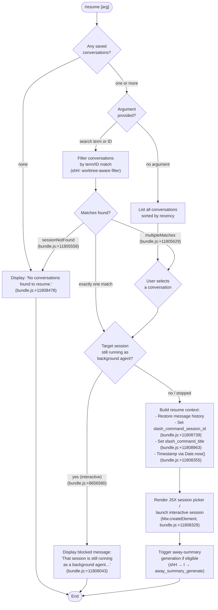

# `/resume`

> Analysis basis: CC v2.1.149 bundle.js (AST extraction + Claude interpretation)
> Minimum version: v2.1.149

---

## Overview

`/resume` (aliased as `/continue`) allows a user to reattach to a previously saved conversation by supplying an optional conversation ID or search term. The command queries the session store, presents matching conversations as a selectable list, and launches a new interactive session restoring the selected conversation's message history. If the target session is currently running as a background agent, the command blocks resumption and instructs the user to manage it through `claude agents` instead.

---

## Registration

| Field | Value |
|---|---|
| type | `local-jsx` |
| name | `resume` |
| description | `Resume a previous conversation` |
| argumentHint | `[conversation id or search term]` |
| aliases | `["continue"]` |
| module_id | `fC1` |
| load_inline | `true` |
| loc_byte | `11809441` |
| loc_byte_end | `11809638` |
| loc_line | `9442` |
| arbor_handler.name | `KsL` |
| arbor_handler.fqn | `claude-2.1.149::KsL` |
| arbor_handler.kind | `AsyncFunction` |
| arbor_handler.resolution_path | `module_id` |
| arbor_handler.n_hits | `0` |

Analysis basis: CC v2.1.149 bundle.js:+11809441

---

## Input Branching

Five or more distinct control-flow paths exist (no argument vs. search term, exact-ID match, running-background-agent block, multiple matches requiring selection, and no conversations found), so a Mermaid flowchart is used.



---

## Behavioral Spec

### Main Handler — `KsL` (resumeCommandHandler)

Analysis basis: CC v2.1.149 bundle.js:+11808033

```
async function resumeCommandHandler(commandInput, appState):

    # 1. Retrieve live session list
    liveSessions = await listAllLiveSessions()          # S7H → A.listAllLiveSessions

    # 2. Build candidate conversation list
    allConversations = filterConversations(appState)    # MC1 → H.filter
    allConversations = sortConversations(allConversations, appState)  # Cf

    if allConversations is empty:
        return displayMessage("No conversations found to resume.")
        # literal at bundle.js:+11808478

    # 3. Resolve target conversation
    searchTerm = commandInput.args?.trim()
    if searchTerm is non-empty:
        candidates = worktreeAwareSearch(searchTerm, allConversations)  # shH
        if candidates is empty:
            return displayMessage("No conversations found to resume.")
            # sessionNotFound path, bundle.js:+11805558
        if candidates.length > 1:
            target = await presentSelectionUI(candidates)  # multipleMatches, bundle.js:+11805629
        else:
            target = candidates[0]
    else:
        target = await presentSelectionUI(allConversations)

    # 4. Guard: block if session is actively running as background agent
    sessionStatus = liveSessions.find(s => s.id == target.id)
    if sessionStatus?.mode == "interactive":   # literal at bundle.js:+8656580
        return displayMessage(
            "That session is still running as a background agent. " +
            "Open `claude agents` to attach to it, or stop it there first to resume here."
        )
        # literal at bundle.js:+11808043

    # 5. Build resume payload
    resumeContext = {
        sessionId:  target.id,           # slash_command_session_id, bundle.js:+11808739
        title:      target.title,        # slash_command_title, bundle.js:+11808963
        messages:   target.messages,
        role:       "user",              # literal at bundle.js:+11808184
        skipFlag:   "skip",              # literal at bundle.js:+11808246
        timestamp:  Date.now(),          # bundle.js:+11808355
    }

    # 6. Restore conversation and launch JSX session UI
    element = createElement(SessionResumeComponent, resumeContext)  # Mw.createElement, bundle.js:+11808329
    return renderSession(element, appState)
```

### Worktree-Aware Conversation Search — `shH` (worktreeAwareSearch)

Analysis basis: CC v2.1.149 bundle.js:+11804870

```
function worktreeAwareSearch(searchTerm, conversations):

    # Detect current git worktrees
    worktreeOutput = runGit(["worktree", "list", "--porcelain"])
    # literals: "worktree", "list", "--porcelain" at bundle.js:+11804914..11804932
    # telemetry: tengu_worktree_detection at bundle.js:+11805014

    worktrees = parseWorktreeOutput(worktreeOutput)
    # parses "worktree " prefix (literal at bundle.js:+11805133, offset 9 at +11805164)
    # normalises path with NFC (literal at bundle.js:+11805177)

    # Find best single match
    exactMatch = conversations.find(c => c.id.startsWith(searchTerm))
    # bundle.js:+11805291

    if exactMatch exists:
        return [exactMatch]

    # Fall back to fuzzy filter
    filtered = conversations.filter(c =>
        c.title.toLowerCase().includes(searchTerm.toLowerCase()) or
        c.id.startsWith(searchTerm)
    )
    # bundle.js:+11805318

    # Sort by locale
    filtered.sort((a, b) => a.title.localeCompare(b.title))
    # bundle.js:+11805351

    if filtered is empty:
        emit("sessionNotFound")    # literal at bundle.js:+11805558
    if filtered.length > 1:
        emit("multipleMatches")    # literal at bundle.js:+11805629

    return filtered
```

### Live-Session Lookup — `S7H` (liveSessionResolver)

Analysis basis: CC v2.1.149 bundle.js:+8656437

```
async function liveSessionResolver(sessionId):
    # Check local in-process cache first
    cached = await Promise.resolve(cachedSessions)
    # bundle.js:+8656437

    if cached missing:
        sessions = await A.listAllLiveSessions()
        # bundle.js:+8656489

    # Filter to sessions whose mode is "interactive"
    interactiveSessions = sessions.filter(s => s.mode == EaH)
    # bundle.js:+8656467; "interactive" literal at +8656580

    return interactiveSessions
```

### Conversation Sort/Filter Utility — `MC1` (conversationListBuilder)

Analysis basis: CC v2.1.149 bundle.js:+11807929

```
function conversationListBuilder(appState):
    raw = appState.sessions.filter(isResumable)   # H.filter, bundle.js:+11807929
    sorted = sortByCriteria(raw)                  # Cf, bundle.js:+11807959
    return sorted
```

### Session State Renderer — `KC1` (sessionTitleRenderer)

Analysis basis: CC v2.1.149 bundle.js:+11809013

```
function sessionTitleRenderer(session):
    # Renders title text in bold for the picker list
    return boldText(session.title)   # j6.bold, bundle.js:+11805593
```

### Away-Summary Eligibility Check — `shH` → `I` (`awaySummaryOrchestrator`)

Analysis basis: CC v2.1.149 bundle.js:+14008576

The resume flow optionally triggers an "away summary" — a compact recap generated when the user was absent for a meaningful duration. The following conditions cause a skip:

| Condition | Log message (fragment) | Location |
|---|---|---|
| Cache age unknown | `[awaySummary] skipped: cache age unk…` | bundle.js:+14008578 |
| Cache stale (threshold 0.9) | `[awaySummary] skipped: cache stale` | bundle.js:+14008654 |
| Near rate limit | `[awaySummary] skipped: at or near ra…` | bundle.js:+14008742 |
| Draft input present | `[awaySummary] skipped: draft input p…` | bundle.js:+14008825 |

When eligible, generation is attempted (telemetry `away_summary_generate`; failure emits `generate_failed`). The blurred/focused distinction is evaluated with a threshold of 0.8 and a stale-window of 3 600 000 ms (1 hour) at bundle.js:+14009429/+14009485.

---

## State & Side Effects

| Item | Detail |
|---|---|
| Telemetry — `tengu_worktree_detection` | Emitted each time git worktree detection runs during conversation search (bundle.js:+11805014) |
| Telemetry — `tengu_bg_spare_enable` | Emitted by the daemon background-spare machinery reached transitively (bundle.js:+15260069) |
| Telemetry — `tengu_bg_spare_spawn` | Emitted when a spare background slot is spawned (bundle.js:+15260429) |
| Telemetry — `tengu_bg_spare_claim` | Emitted when a background spare is claimed for a session (bundle.js:+15262131) |
| Telemetry — `tengu_bg_spare_claim_fail` | Emitted on spare-claim failure (bundle.js:+15262394) |
| Telemetry — `tengu_bg_dispatch_sigkill_escalate` | Emitted when a background worker is escalated to SIGKILL (bundle.js:+15260736) |
| Telemetry — `tengu_bg_dispatch_low_mem` | Emitted under low-memory conditions in the daemon (bundle.js:+15261315) |
| Telemetry — `tengu_bg_sendclaim_failed` | Emitted when the daemon fails to send a claim (bundle.js:+15241837) |
| Telemetry — `tengu_daemon_control` | Emitted for daemon control operations (bundle.js:+15296846) |
| Telemetry — `tengu_daemon_yield` | Emitted when daemon yields to a foreground session (bundle.js:+15279693) |
| Telemetry — `tengu_daemon_config_reload` | Emitted on daemon config reload (bundle.js:+15275522) |
| Telemetry — `tengu_daemon_idle_exit` | Emitted on daemon idle-exit (bundle.js:+15280686) |
| Telemetry — `tengu_transcript_phantom_parent` | Emitted when a phantom parent message is detected in transcript parsing (bundle.js:+12794269) |
| Telemetry — `tengu_transcript_parent_cycle` | Emitted when a cycle is detected in message parent chain (bundle.js:+12797832) |
| Telemetry — `tengu_chain_parent_cycle` | Emitted on chain-level parent cycle (bundle.js:+12776311) |
| Telemetry — `tengu_chain_timestamp_fallback` | Emitted when chain ordering falls back to timestamp (bundle.js:+12776460) |
| Telemetry — `tengu_chain_parallel_tr_recovered` | Emitted when parallel tool-result chains are recovered (bundle.js:+12778326) |
| Telemetry — `tengu_relink_walk_broken` | Emitted when a relink walk cannot resolve a parent (bundle.js:+12775821) |
| Telemetry — `tengu_feature_ok` / `tengu_feature_bad` | Emitted by the feature-flag check layer (bundle.js:+963421 / +963479) |
| Telemetry — `tengu_bg_low_mem_mb` | Records available memory (MB) at spawn time (bundle.js:+12607186) |
| appState changes | `slash_command_session_id` and `slash_command_title` are written into app state at bundle.js:+11808739 and +11808963 |
| Session store reads | Live session list fetched via `A.listAllLiveSessions` (bundle.js:+8656489); conversation list read from session store via `MC1`/`H.filter` (bundle.js:+11807929) |
| File I/O | Git `worktree list --porcelain` subprocess executed during search; conversation JSONL files read via `b8H` / `gL5` path |
| Daemon interaction | Resumption of a stopped background session triggers daemon lifecycle calls (`uqA`, `yqA`) including socket connect, message write, and file cleanup |
| Sound | <!-- TODO: not found in depth-2 traversal; needs --depth 4 --> |

---

## Version History

| Version | Change |
|---|---|
| v2.1.149 | Initial analysis |

---

## Common Mistakes

1. **Passing a partial title instead of an ID when multiple sessions share similar titles** — the command will fall into the `multipleMatches` path and present a selection UI rather than immediately resuming. Use the full session UUID to avoid ambiguity.
2. **Trying to `/resume` a session that is still running as a background agent** — the command will display the blocked message (`"That session is still running as a background agent…"`) and refuse to resume. Use `/agents` to stop or attach to it first (bundle.js:+11808043).
3. **Expecting `/resume` without arguments to resume the most-recent session automatically** — without an argument the command presents a full picker list; it does not auto-select the newest entry.
4. **Using `/resume` in a directory different from the one used for the original session** — the worktree-aware search normalises paths via NFC and compares git worktree roots; sessions created in a different worktree may not appear unless the search term exactly matches the session ID.
5. **Assuming the alias `/continue` has different behaviour** — it is registered as a direct alias and follows the identical code path (bundle.js:+11809441).

---

## Appendix — Identifier Mapping

> For bundle debugging only. Identifiers change across versions.

| Identifier | Role |
|---|---|
| `KsL` | Main async handler for `/resume` command (`resumeCommandHandler`) |
| `MC1` | Conversation list builder — filters and sorts sessions from app state |
| `S7H` | Live-session resolver — fetches and caches `listAllLiveSessions` result |
| `shH` | Worktree-aware conversation search and sort utility |
| `KC1` | Session title renderer — applies bold formatting in picker list |
| `Zc` | Composite completion/picker helper calling `shH`, `qr1`, `GSH` |
| `sW6` | Session store accessor — bulk getter for all stored session maps |
| `Ar1` | Session state assembler — calls `dL5` and `b8H`, assigns via `Object.assign` |
| `b7H` | High-level session reader — pulls all per-session metadata map entries |
| `b8H` | Low-level session store — sets/gets all metadata keys (summary, title, mode, etc.) |
| `gL5` | JSONL transcript file parser — reads and chunks conversation log files |
| `C7H` | Conversation chain builder — resolves parent/child message relationships |
| `SL5` | Message chain sorter/deduplicator |
| `kL5` | Chain queue manager — shifts and sorts pending messages |
| `hL5` | NaN-safe chain validator |
| `ti1` | Chain accumulator — collects and maps chain segments |
| `Ge_` | Compact-summary replacer for message list |
| `RV6` | Raw message transformer — rewrites tool use/result entries |
| `Ee_` | Attachment/image filter for message list |
| `RL5` | Content-type validator (array/image/document) |
| `CL5` | Content-type validator (array/some) |
| `ZaH` | Message role mapper |
| `$e_` | Conversation entry formatter combining `Ge_`, `ZaH`, `Ee_` |
| `qr1` | Top-level conversation loader — reads files, filters, paginates |
| `ze_` | Directory-level conversation file enumerator |
| `GSH` | Conversation metadata serializer for picker display |
| `sL5` | Individual conversation metadata reader |
| `Cv8` | Session map: conversation-level getter/setter |
| `bv8` | Session map: bulk values extractor |
| `ui1` | Session index manager — walks and updates conversation index |
| `IL5` | Relink/walk helper — resolves broken parent references |
| `iP` | In-process session index cache |
| `FL5` | Binary JSONL index parser |
| `QL5` | Binary index file reader |
| `eWH` | JSONL stream splitter (BOM-aware) |
| `aaK` | JSONL line accumulator |
| `taK` | JSONL JSON-line parser |
| `saK` | JSONL boundary detector |
| `I` | Away-summary session context (awaySummary orchestrator) |
| `PJ8` | Away-summary cache-state reader |
| `s05` | Away-summary API metrics recorder |
| `V48` | Away-summary API call dispatcher |
| `h` | Away-summary blurred/focused window tracker |
| `RH` | Structured error reporter with log and push |
| `c_` | Error coercion utility |
| `mH` | String coercion utility |
| `G1` | Error wrapper combining `Z2A` and `mH` |
| `Z2A` | Error message extractor |
| `uiK` | Rotating error buffer (shift/push) |
| `EH` | Short string formatter |
| `G_` | Session spawn coordinator calling `lWH` and `D` |
| `lWH` | Child-process launcher (full lifecycle) |
| `D` | Daemon session dispatcher |
| `Kv8` | Memory-aware daemon slot picker |
| `kqA` | Daemon background-spare process spawner |
| `V6` | Daemon slot registry manager |
| `uqA` | Background session lifecycle manager (create/retire/cleanup) |
| `yqA` | Background session connect/claim handler |
| `w` | Foreground session orchestrator |
| `C` | Foreground session writer/killer |
| `j_` | Path utilities (directory helpers) |
| `Dv` | Core path resolver |
| `Wh` | Path join wrapper |
| `Xd` | Projects-directory path builder |
| `dL5` | Session directory initialiser |
| `BT` | Directory walker/reader for session paths |
| `dLH` | Session-list display helper |
| `wo` | UI conversation picker component |
| `KN6` | Conversation summary formatter for display |
| `iE8` | Conversation display entry builder |
| `Jz` | Text snippet truncator |
| `K` | Column-pad formatter (padEnd 40) |
| `kr` | UUID-pattern tester |
| `Cf` | Conversation sort comparator |
| `MC1` | (see above) Conversation list builder |
| `N` | Logging/debug dispatcher |
| `K8` | Structured log emitter |
| `Dz` | Log-level filter |
| `s9` | Log-level resolver |
| `WZ6` | Session file reader (readFile path) |
| `LE1` | Session file deleter (unlink path) |
| `Q` | Session persistence coordinator |
| `O` | Background-session status tracker |
| `z` | Daemon-stop lifecycle manager |
| `bH` | Feature-flag check (ok path) |
| `uH` | Feature-flag check (bad path) |
| `Rk` | Daemon control dispatcher |
| `pu` | Daemon shutdown race (Promise.race) |
| `Sd8` / `Rd8` / `bd8` | Process-spawn helpers (encoding, args, cwd) |
| `SGA` | Process argv builder |
| `U0A` | Numeric-argument validator |
| `FK6` | Spawn error handler |
| `hd8` | Reflect.apply wrapper for spawn binding |
| `jGA` | Process exit-event hook |
| `p0A` | Spawn timeout wrapper (Promise.race + clearTimeout) |
| `B0A` | Spawn kill handler |
| `u0A` / `m0A` | Spawn stdout/stderr bind helpers |
| `DGA` | Parallel-spawn coordinator |
| `cK6` | Spawn output collector |
| `zGA` | Pipe attachment helper |
| `YGA` | Watcher set manager |
| `d0A` | Output binding dispatcher |
| `zaK` | Path-to-string coercion |
| `nv5` | MCP client config applicator |
| `UyH` | MCP server connection handler |
| `QDK` | MCP update applier |
| `Oz6` | Config file reader/parser |
| `g` | MCP tool-use filter |
| `qPH` | Session context page builder |
| `av6` | Conversation metadata cache (get/set) |
| `$O` | Path existence checker |
| `L9` | File-stat helper |
| `Rv8` | ISO-date parser for session timestamps |
| `WZ6` | (see above) |
| `W6A` | Permission-check helper |
| `r` | Permission dispatcher (allow/deny) |
| `d` | Permission rule matcher |
| `tg` | Away-summary time-gate helper |
| `ZLK` | Away-summary rate-limit checker |
| `DJ1` | UUID generator wrapper |
| `B` | Conversation snapshot selector |
| `DH` | Transcript stream enqueuer |
| `LH` | Transcript stream orchestrator |
| `HH` / `s` / `t` | Ref-based timer helpers for voice/recording (unrelated, traversal artefact) |
| `o` | Voice input session manager (traversal artefact) |
| `e` | Notification dispatcher (traversal artefact) |
| `Rk` | (see above) |