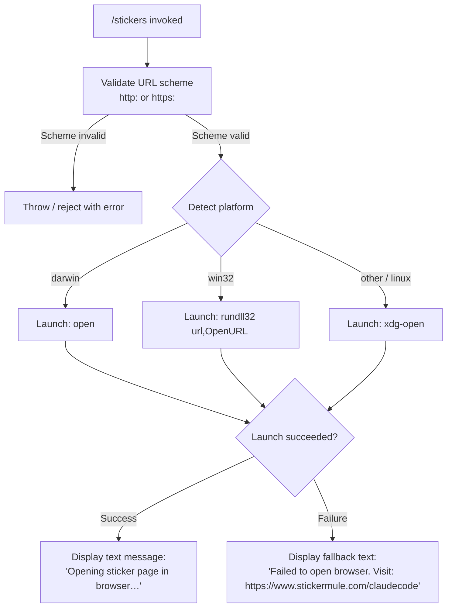

# `/stickers`

> Analysis basis: CC v2.1.147 bundle.js (AST extraction + Claude interpretation)
> Minimum version: v2.1.147

---

## Overview

The `/stickers` command opens the Claude Code sticker ordering page (`https://www.stickermule.com/claudecode`) in the user's default system browser. It is a simple, non-interactive utility command that constructs a platform-appropriate browser-launch invocation and reports either a success message or a fallback instruction if the browser cannot be opened. No agent interaction or LLM call is involved.

---

## Registration

| Field | Value |
|---|---|
| type | `local` |
| name | `stickers` |
| description | `Order Claude Code stickers` |
| supportsNonInteractive | `false` |
| module_id | `fS1` |
| load_inline | `true` |
| loc_byte | `12092516` |
| loc_byte_end | `12092676` |
| loc_line | `9962` |
| arbor_handler.name | `vg7` |
| arbor_handler.fqn | `claude-2.1.147::vg7` |
| arbor_handler.kind | `AsyncFunction` |
| arbor_handler.resolution_path | `module_id` |
| arbor_handler.n_hits | `0` |

Analysis basis: CC v2.1.147 bundle.js:+12092516

---

## Input Branching

The command has 3+ distinct branches based on operating system detection and browser-launch success/failure. A Mermaid flowchart is required.



Analysis basis: CC v2.1.147 bundle.js:+6462835, +6463144, +6463160, +6463244, +12092319, +12092390

---

## Behavioral Spec

### Handler Entry Point (`vg7` — `openStickersPage`)

```
async function openStickersPage(context):
    targetURL = "https://www.stickermule.com/claudecode"
    result = await openURLInBrowser(targetURL)
    if result.success:
        return { type: "text", content: "Opening sticker page in browser…" }
    else:
        return { type: "text", content:
            "Failed to open browser. Visit: https://www.stickermule.com/claudecode" }
```

Analysis basis: CC v2.1.147 bundle.js:+12092249, +12092252, +12092306, +12092319, +12092390

---

### URL Validation (`IIL` — `validateURLScheme`)

```
function validateURLScheme(url):
    parsed = new URL(url)
    if parsed.protocol not in ["http:", "https:"]:
        throw new Error("Unsupported URL scheme")
    return parsed
```

Analysis basis: CC v2.1.147 bundle.js:+6462785, +6462835, +6462857

---

### Platform Detection and Browser Launch (`MK` — `launchBrowser`)

```
async function launchBrowser(url):
    validateURLScheme(url)          // throws if scheme is invalid
    platform = process.platform

    if exitCode is non-zero (step WJ check):
        // treat as launch failure
        return { success: false }

    if platform == "darwin":
        spawn("open", [url])
    else if platform == "win32":
        spawn("rundll32", ["url,OpenURL", url])
    else:                           // linux and other POSIX
        spawn("xdg-open", [url])

    return { success: true }
```

Analysis basis: CC v2.1.147 bundle.js:+6463072, +6463085, +6463110, +6463144, +6463160, +6463244, +6463256, +6463318, +6463325

---

### Child Process Execution (`T8` / `T_` — `spawnChildProcess`)

```
async function spawnChildProcess(command, args, options):
    // Retrieve current async-context store (sb6 / ab6.getStore)
    store = getAsyncLocalStore()

    // Build child-process options; inherit stdio
    // Memory threshold constant: 1,000,000 bytes (1044640)
    // Concurrency limit constant: 10 (1044118)
    child = spawnProcess(command, args, mergedOptions)

    // i2H sets up stdio streams, rejection on error, and binds
    // callbacks (SJA, RJA) for stdout/stderr line handling
    setupStreams(child)

    // D manages background spare-process lifecycle, polling
    // every 2000 ms (15117423), emitting telemetry events
    // tengu_bg_spare_enable / tengu_bg_spare_spawn as needed

    result = await waitForExit(child)
    return result
```

Analysis basis: CC v2.1.147 bundle.js:+1044118, +1044173, +1044640, +1039854, +1039867, +1040020, +1044816, +15117423

---

### Logging and Error Handling (`N` / `RH`)

```
function logDebug(message):
    // N: emits at level "debug" (201876)
    // checks H.includes for known log targets
    // normalises level to uppercase
    logger.emit("debug", message)

function logError(err):
    // RH: delegates to n_ and UH for formatting
    // pushes to bbH error buffer (966283)
    // calls Gl.logError for persistent logging (966323)
    // if j1 condition met, records FpK metadata
    errorBuffer.push(formatError(err))
    Gl.logError(err)
```

Analysis basis: CC v2.1.147 bundle.js:+201876, +965923, +965936, +966182, +966283, +966323, +1045067

---

## State & Side Effects

| Item | Detail |
|---|---|
| Telemetry | `tengu_bg_spare_enable` (bundle.js:+15117130); `tengu_bg_spare_spawn` (bundle.js:+15117490) — both emitted by the background spare-process manager (`D`) during child-process spawning, not sticker-specific |
| Browser process | Spawns one detached OS-level process (`open` / `rundll32` / `xdg-open`) pointing at `https://www.stickermule.com/claudecode` |
| Hook registration | None detected at depth-2 traversal |
| appState changes | None detected at depth-2 traversal |
| Sound | None detected at depth-2 traversal |
| supportsNonInteractive | `false` — command must not be invoked in non-interactive (headless) mode |
| Return type | Plain `text` message object; no assistant turn, no LLM call |
| Error output | Fallback text message displayed inline; error also routed through `RH` → `Gl.logError` |
| Memory/concurrency | Spawn subsystem enforces 1,000,000-byte memory threshold (bundle.js:+1044640) and concurrency limit of 10 (bundle.js:+1044118) for child processes generally — not sticker-specific limits |
| Platform string "windows" | Literal `"windows"` at bundle.js:+15117293 used in background-spare OS check; separate from the `"win32"` check used for browser launch |

---

## Version History

| Version | Change |
|---|---|
| v2.1.147 | Initial analysis |

---

## Common Mistakes

1. **Running in non-interactive mode**: `/stickers` sets `supportsNonInteractive: false`. Attempting to invoke it in a headless or scripted pipeline will be rejected before the handler fires.
2. **Expecting LLM output**: The command produces a static text message only — it does not start an agent turn or stream any model response.
3. **Firewall / sandbox environments**: If the OS process cannot launch a browser (sandboxed CI, restricted shell), the handler returns the fallback text with the full URL instead of silently failing — users should copy that URL manually.
4. **Platform assumptions**: The browser-launch mechanism is strictly platform-branched (`open` on macOS, `rundll32` on Windows, `xdg-open` on Linux/other). On systems where `xdg-open` is absent, the command will fail and show the fallback message.
5. **Treating telemetry events as sticker-specific**: `tengu_bg_spare_enable` and `tengu_bg_spare_spawn` are emitted by the shared child-process infrastructure, not by the sticker feature itself — they will appear in logs for any spawning operation.

---

## Appendix — Identifier Mapping

> For bundle debugging only. Identifiers change across versions.

| Identifier | Role |
|---|---|
| `vg7` | `openStickersPage` — async handler entry point for `/stickers`; resolved via `module_id` by Arbor |
| `MK` | `launchBrowser` — validates URL scheme and dispatches platform-specific browser spawn |
| `IIL` | `validateURLScheme` — checks that URL protocol is `http:` or `https:`, throws on mismatch |
| `WJ` | `checkExitCode` — inspects child-process exit code for failure detection |
| `T8` | `spawnWithContext` — wraps child-process spawn with async-context store retrieval |
| `T_` | `spawnChildProcess` — core spawn orchestrator; sets up streams, memory limits, logging |
| `i2H` | `setupChildStreams` — configures stdio streams, rejection handlers, stdout/stderr callbacks |
| `D` | `backgroundSpareManager` — manages background spare-process lifecycle; emits telemetry |
| `JFK` | `stringifyArg` — converts spawn arguments to strings via `String()` |
| `Az` | `logLevel` — log-level constant or helper used during process execution |
| `N` | `debugLogger` — emits `"debug"`-level log entries with level normalisation |
| `q8` | `processMetrics` — collects or checks process resource metrics during spawn |
| `RH` | `errorLogger` — formats and records errors to the error buffer and `Gl.logError` |
| `b6` | `asyncContextAccessor` — retrieves the current async-local-storage context |
| `sb6` | `getAsyncStore` — calls `ab6.getStore()` and resolves the active store or fallback |
| `w_` | `resolveContext` — resolves context object via `oV`; used during spawn setup |

---

Note: index built via Arbor fallback; some signals (telemetry, literals) may be missing — see arbor-fallback.js.