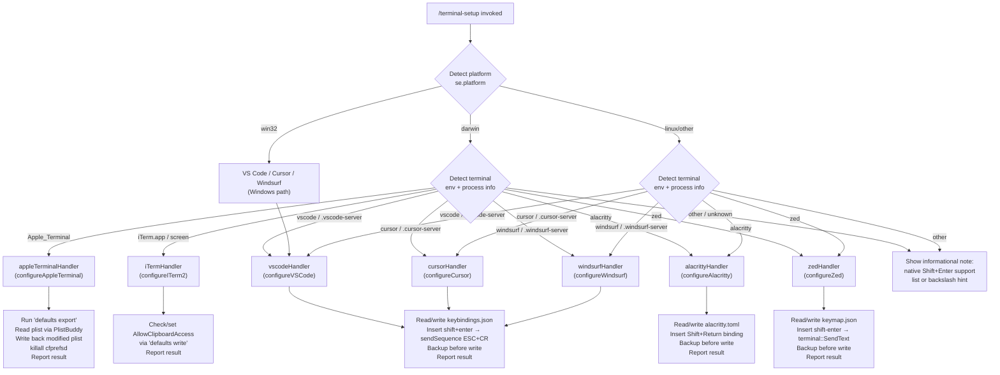

# `/terminal-setup`

> Analysis basis: CC v2.1.149 bundle.js (AST extraction + Claude interpretation)
> Minimum version: v2.1.149

---

## Overview

`/terminal-setup` installs the `Shift+Enter` key binding (and related terminal settings) so that pressing Shift+Enter in the terminal sends a newline instead of submitting input. The command auto-detects the running terminal emulator (Apple Terminal, iTerm2, VS Code, Cursor, Windsurf, Alacritty, Zed, or others) and applies the appropriate configuration change for each. It is a one-time setup aid intended to improve the interactive editing experience inside Claude Code.

---

## Registration

| Field | Value |
|---|---|
| type | `local-jsx` |
| name | `terminal-setup` |
| description | `Install Shift+Enter key binding for newlines` |
| loc_byte | `11984119` |
| loc_byte_end | `11984751` |
| loc_line | `9753` |
| module_id | `Ti9` |
| load_inline | `true` |
| arbor_handler.name | `UM7` |
| arbor_handler.fqn | `claude-2.1.149::UM7` |
| arbor_handler.kind | `AsyncFunction` |
| arbor_handler.resolution_path | `module_id` |
| arbor_handler.n_hits | `1` |

Analysis basis: CC v2.1.149 bundle.js:+11984119

---

## Input Branching

Seven or more distinct terminal-target branches are present; a Mermaid flowchart is used.



Analysis basis: CC v2.1.149 bundle.js:+3937335 (platform check), +3935399, +3935439, +3935471, +3935495, +3935519, +3935545, +3935572

---

## Behavioral Spec

### Top-Level Handler (`UM7`)

The primary async handler (`UM7`, resolved by Arbor via `module_id → Ti9`) is the entry point for the command.

```
async function terminalSetupHandler(context):
    platform = os.platform()                    // se.platform
    terminalEnv = detectTerminal(platform)      // OZH / GY_ helpers
    result = await dispatchToTerminalHandler(platform, terminalEnv)
    renderResultUI(result)                      // local-jsx render
```

Analysis basis: CC v2.1.149 bundle.js:+3937335

### Terminal Detection (`OZH` / `GY_`)

```
function detectTerminal(platform):
    if platform == "darwin":
        check TERM_PROGRAM, LC_TERMINAL, process ancestry for:
            "Apple_Terminal", "iTerm.app", "screen"
        check server-socket dirs: .vscode-server, .cursor-server, .windsurf-server
        check TERM_PROGRAM: "vscode", "cursor", "windsurf", "alacritty", "zed"
    else:
        check same env vars without macOS-specific logic
    return terminalId   // one of the string literals or null
```

Analysis basis: CC v2.1.149 bundle.js:+3935399, +3934976, +3935068

### Apple Terminal Configuration (`WY_`)

Handles the `Apple_Terminal` case on macOS.

```
async function configureAppleTerminal():
    prefPath = path.join(homedir(), "Library", "Preferences",
                         "com.apple.Terminal.plist")
    // Export current plist via: defaults export com.apple.Terminal <tmpfile>
    backupPath = createBackup(prefPath)         // randomBytes suffix
    if backupPath == null:
        throw "Failed to create backup of Terminal.app preferences, bailing out"

    defaultProfile = plistBuddyRead("Default Window Settings")
    if defaultProfile == null:
        throw "Failed to read default Terminal.app profile"
    startupProfile = plistBuddyRead("Startup Window Settings")

    // Modify each profile: enable Option-as-Meta, disable audio bell
    successCount = 0
    for profile in [defaultProfile, startupProfile, ...]:
        ok = applyProfileSettings(profile)    // Ji9 / Xi9
        if ok: successCount++

    if successCount == 0:
        rollbackFromBackup(backupPath)        // t88 restore path
        throw "Failed to enable Option as Meta key or disable audio bell ..."

    // Flush prefs daemon
    spawn("killall", ["cfprefsd"])

    display("Configured Terminal.app settings:")
    display("- Enabled \"Use Option as Meta key\"")
    display("- Switched to visual bell")
    display("Shift+Return will now enter a newline.")
    display("Option+Enter will now enter a newline.")
    display("You must restart Terminal.app for changes to take effect.")
```

Analysis basis: CC v2.1.149 bundle.js:+3941527, +3941587, +3942446, +3943606, +3943744, +3943804, +3943921, +3944290, +3944301, +3944343, +3944410, +3944472, +3944517, +3944566, +3944651

#### PlistBuddy Sub-helper (`Ji9` / `Xi9`)

```
async function plistBuddyRead(command, plistPath):
    // Runs: /usr/libexec/PlistBuddy -c "<command>" <plistPath>
    result = await runProcess("/usr/libexec/PlistBuddy", ["-c", command, plistPath])
    return result.stdout.trim()
```

Analysis basis: CC v2.1.149 bundle.js:+3942833, +3942860, +3942926

#### Backup / Restore Sub-helper (`t88` / `MQH`)

```
function createPlistBackup(srcPath):
    if flag == "no_backup": return null
    // Stat the source; generate randomBytes suffix
    dest = srcPath + ".backup." + randomHex
    copy(srcPath, dest)
    return dest

async function restoreFromBackup(backupPath):
    // Re-imports via: defaults import com.apple.Terminal <backupPath>
    status = await runProcess("defaults", ["import", "com.apple.Terminal", backupPath])
    if status == "failed": log "failed"
    if status == "restored": log "restored"
```

Analysis basis: CC v2.1.149 bundle.js:+3931927, +3931953, +3932105, +3932162, +3932239, +3932016

### iTerm2 Configuration (`Gi9`)

```
async function configureITerm2():
    domain = "com.googlecode.iterm2"
    current = runDefaults("read", domain, "AllowClipboardAccess")
    if current indicates already enabled:
        display("iTerm2 clipboard access already enabled")
        return

    result = runDefaults("write", domain, "AllowClipboardAccess", "-bool", "true")
    if result.error:
        display("Couldn't update iTerm2 clipboard setting.")
        return

    display("Enabled \"Applications in terminal may access clipboard\" in iTerm2")
    display("Restart iTerm2 for this to take effect. Undo: defaults write ...")
```

Analysis basis: CC v2.1.149 bundle.js:+3936327, +3936392, +3936416, +3936491, +3936579, +3936634, +3936685, +3936776, +3936859

### VS Code / Cursor / Windsurf Configuration (`WY_` / `PY_`)

All three VS Code-family editors share a keybindings-file approach. `WY_` handles the "write new binding" path; `PY_` handles the "already exists / update" path.

```
async function configureVSCodeFamily(editorName, platform):
    kbPath = resolveKeybindingsPath(editorName, platform)
    //   win32:  AppData/Roaming/<editorName>/User/keybindings.json
    //   darwin: ~/Library/Application Support/<editorName>/User/keybindings.json
    //   linux:  ~/.config/<editorName>/User/keybindings.json

    mkdir(dirname(kbPath), {recursive: true})
    raw = readFile(kbPath) ?? "[]"
    existingBindings = parseJSON(raw)   // em6 / ZTA / ETA

    alreadyPresent = existingBindings.some(entry =>
        entry.key == "shift+enter" and
        entry.command == "workbench.action.terminal.sendSequence")

    if alreadyPresent:
        display(dim("shift+enter binding already present"))
        return

    backupPath = createBackup(kbPath)   // randomBytes

    newEntry = {
        key: "shift+enter",
        command: "workbench.action.terminal.sendSequence",
        args: { text: "\x1b\r" },       // ESC + CR
        when: "terminalFocus"
    }
    updatedBindings = [...existingBindings, newEntry]
    writeFile(kbPath, JSON.stringify(updatedBindings, null, 2), "utf-8")

    display(dim("Configured " + editorName + " settings:"))
    display("Shift+Return will now enter a newline.")
    display("You must restart " + editorName + " for changes to take effect.")
```

Analysis basis: CC v2.1.149 bundle.js:+3941497, +3941527, +3941560, +3941611, +3941628, +3941678, +3941741, +3941946, +3941968, +3942020, +3942035, +3939381, +3939434, +3939450, +3939460, +3939472, +3939523, +3939563

### Alacritty Configuration (`gM7`)

```
async function configureAlacritty():
    candidatePaths = platformAlacrittyConfigPaths()  // homedir variants
    configPath = candidatePaths.find(p => fileExists(p))
    if configPath == null:
        throw "No valid config path found for Alacritty"

    raw = readFile(configPath)
    if raw contains 'mods = "Shift"' and 'key = "Return"':
        display("Alacritty Shift+Enter key binding already configured")
        return

    backupPath = createBackup(configPath)
    if backupPath == null:
        throw "Error backing up existing Alacritty config. Bailing out."

    newSection = buildAlacrittyKeySection()
    // Appends [keyboard] / [[keyboard.bindings]] block
    mkdir(dirname(configPath), {recursive: true})
    writeFile(configPath, raw + newSection)

    display("Installed Alacritty Shift+Enter key binding")
    display("You may need to restart Alacritty for changes to take effect")
```

Analysis basis: CC v2.1.149 bundle.js:+3945266, +3945295, +3945656, +3945724, +3945754, +3945797, +3946007, +3946381, +3946451, +3945334, +3945391

### Zed Configuration (`QM7`)

```
async function configureZed():
    keymapPath = path.join(homedir(), <zed-config-dir>, "keymap.json")
    mkdir(dirname(keymapPath), {recursive: true})
    raw = readFile(keymapPath) ?? "[]"
    existing = parseJSON(raw)

    alreadyPresent = existing.some(entry =>
        entry.bindings?.["shift-enter"] != null and
        entry.context == "Terminal")

    if alreadyPresent:
        display("Zed Shift+Enter key binding already configured")
        return

    backupPath = createBackup(keymapPath)
    if backupPath == null:
        throw "Error backing up existing Zed keymap. Bailing out."

    newEntry = {
        context: "Terminal",
        bindings: { "shift-enter": "terminal::SendText" }
    }
    existing.push(newEntry)
    writeFile(keymapPath, JSON.stringify(existing, null, 2))

    display("Installed Zed Shift+Enter key binding")
```

Analysis basis: CC v2.1.149 bundle.js:+3946760, +3946810, +3946835, +3946890, +3946965, +3946976, +3947016, +3947087, +3947109, +3947172, +3947366, +3947413, +3947429, +3947465, +3947505, +3947576, +3947785

### Fallback / Unknown Terminal (`UM7` info path)

When no supported terminal is detected the handler displays an informational note instead of modifying any configuration file:

- "Note: You can already use backslash (`\`) + return to add newlines." (Analysis basis: CC v2.1.149 bundle.js:+3938328)
- "Note: iTerm2, WezTerm, Ghostty, Kitty, Warp, and Windows Terminal support Shift+Enter natively." (Analysis basis: CC v2.1.149 bundle.js:+3938663)

### Shell-Command Execution Helper (`E8` / `G_`)

Several sub-handlers spawn external processes (e.g., `defaults`, `/usr/libexec/PlistBuddy`, `killall`).

```
async function runShellCommand(executable, args, options):
    proc = spawnProcess(executable, args, options)
    // Collect stdout/stderr with a 1 000 000 µs timeout
    // Queue management: shift oldest entry when queue exceeds limit
    if exitCode != 0:
        logError(stderr)
    return { stdout, stderr, exitCode }
```

Analysis basis: CC v2.1.149 bundle.js:+1046765, +1046876, +1047232, +1047271

---

## State & Side Effects

| Item | Detail |
|---|---|
| Telemetry | `tengu_config_auth_loss_prevented` (+3191047), `tengu_bg_spare_enable` (+15260069), `tengu_bg_low_mem_mb` (+12607186), `tengu_bg_spare_spawn` (+15260429), `tengu_config_lock_contention` (+3193710), `tengu_config_stale_write` (+3193846), `tengu_config_parse_error` (+3196285), `tengu_feature_ok` (+963421) |
| Config file mutations | Modifies `keybindings.json` (VS Code/Cursor/Windsurf), `alacritty.toml`, `keymap.json` (Zed), or macOS Terminal plist. Always creates a timestamped/randomBytes backup before writing. |
| Backup files | Written alongside originals with a `.backup.<randomHex>` suffix; retained after successful install. |
| Process spawns | `defaults export/read/write/import` (macOS), `/usr/libexec/PlistBuddy` (macOS Terminal), `killall cfprefsd` (macOS preference daemon flush) |
| appState changes | None observed in depth-2 traversal |
| Sound | None observed in depth-2 traversal |
| Hook registration | `onboarding_project_complete` literal present in call graph (+3930884); likely used for onboarding state tracking |

---

## Version History

| Version | Change |
|---|---|
| v2.1.149 | Initial analysis |

---

## Common Mistakes

1. **Running on an unsupported terminal**: The command silently falls back to an informational note rather than an error when the terminal is not recognized. Users who expect a configuration change may miss the printed note entirely.
2. **Forgetting to restart the terminal/editor**: Every per-terminal handler explicitly warns that a restart is required (e.g., "You must restart Terminal.app for changes to take effect"). Ignoring this leaves the new binding inactive.
3. **Multiple Claude Code instances racing on config files**: The config-write helpers use file locking (`$f_`); if a second instance holds the lock the write is delayed and a `tengu_config_lock_contention` telemetry event is emitted. Running `/terminal-setup` from two sessions simultaneously is therefore safe but may be slower than expected.
4. **macOS SIP or permission restrictions**: If `defaults write` or `PlistBuddy` is blocked by System Integrity Protection or sandboxing, the handler catches the error and displays "Couldn't update iTerm2 clipboard setting." or similar, without altering system state.
5. **VSCode remote / server environments**: Detection relies on the presence of `.vscode-server`, `.cursor-server`, or `.windsurf-server` directories under `$HOME`. If these are absent (unusual remote setup) the editor may not be detected correctly and the fallback note is shown instead.

---

## Appendix — Identifier Mapping

> For bundle debugging only. Identifiers change across versions.

| Identifier | Role |
|---|---|
| `UM7` | Top-level async handler for `/terminal-setup` (Arbor-resolved, `AsyncFunction`, `Ti9` module) |
| `OZH` | Terminal environment detection helper (reads `se.platform`) |
| `__8` | Per-editor dispatch router; calls `WY_`, `PY_`, `gM7`, `QM7`, `f8`, `LQH` |
| `FM7` | Apple Terminal plist-modification orchestrator |
| `Yi9` | Apple Terminal plist path resolver (`fQH` + homedir) |
| `fQH` | Constructs `~/Library/Preferences/com.apple.Terminal.plist` path |
| `E8` | Shell process spawner (used by multiple sub-handlers) |
| `G_` | Low-level process execution core; queue/timeout management |
| `x6` | Stdout/stderr collector for spawned processes |
| `xM7` | Calls `f8` (plist read/write helper) for Apple Terminal |
| `f8` | Config file read/write with lock and backup |
| `RH` | Shell-command run-and-collect result handler |
| `c_` | Error formatter (wraps `Error` + `String`) |
| `mH` | String coercion utility |
| `G1` | Retry / queue lookup helper |
| `uiK` | Process-queue shift/push manager (`Hm6`) |
| `Ji9` | PlistBuddy invocation for Default Window Settings profile |
| `Xi9` | PlistBuddy invocation for Startup Window Settings profile |
| `N` | Async shell-command wrapper with logging (`OVK`, `CH`) |
| `MVK` | Command runner with logging helpers (`Gv`, `LVK`, `T7A`) |
| `H` | Random-delay / setTimeout utility |
| `CH` | JSON.stringify wrapper |
| `X4` | String-path manipulation (replace, slice, lastIndexOf) |
| `HbH` | Buffer/byte-length helper (`B5A`) |
| `OVK` | File-based async command executor (dirname, mkdir, write) |
| `MQH` | Backup-create wrapper (calls `f8`) |
| `hA` | ANSI styled string builder (starts-with color prefix, `yOH`) |
| `yOH` | Full ANSI/256/RGB color formatter (maps `j6.*` color methods) |
| `sg` | Styled-string finalize helper |
| `D` | Background-spare process manager (spawn, memfree, recycle) |
| `V6` | Process-registry entry creator (`_$6`, `A$6`, `we`, `we6`) |
| `_$6` | Process-registry key builder |
| `A$6` | Process-registry value builder |
| `we` | String-hash / Gb helper for registry |
| `we6` | Registry add/get with `FM_` / `YOH` maps |
| `m6` | Process metadata recorder (`Date.now`, `Et4`) |
| `$` | Process-disposable wrapper (`_Q1`) |
| `_Q1` | Timing/telemetry disposable (`Pn`, `Date.now`, `A1`, `$v6`, `CH`) |
| `Kv8` | Background-spare spawn coordinator (`a6`, `V6`) |
| `kqA` | Daemon background PTY process spawner (`Bun.spawn`, `iB.mkdir`) |
| `f1` | Generic file-op helper (`_`, `bH`, `uH`) |
| `JE1` | Spare-process path builder (`w$.join`, `yc`) |
| `XE1` | Alternate spare-process path builder |
| `yc` | Config directory join helper (`w$.join`, `to`) |
| `qk5` | Process-result recorder (`rf`) |
| `eI5` | Spawn environment merger (`Object.assign`) |
| `ny` | Process log-path resolver (`ShH`, `H.split`) |
| `c` | Low-level I/O helper |
| `Dz` | Drain/cleanup helper |
| `K8` | Error-check / throw helper |
| `t88` | Apple Terminal backup orchestrator (`uM7`, `MQH`, `wY_.stat`, `RH`) |
| `uM7` | Apple Terminal profile-settings writer (calls `m6`) |
| `WY_` | VS Code / Cursor / Windsurf keybindings-write handler |
| `GY_` | Server-directory (.vscode-server etc.) detection helper |
| `NY_` | VS Code settings-path resolver (platform-aware, `se.homedir`, `se.platform`) |
| `em6` | JSON file parser with BOM-strip (`xC`, `N`, `String`) |
| `xC` | BOM / encoding prefix stripper (`H.startsWith`, `H.slice`) |
| `s9` | Error-severity classifier (`K8`) |
| `Cb` | Hyperlink builder for terminal output (`EP`, `Pi9.pathToFileURL`) |
| `EP` | Terminal hyperlink escape-sequence builder (`yJ`, `FORCE_HYPERLINK`) |
| `yJ` | Hyperlink formatter |
| `ZTA` | JSON-patch apply helper (insert/remove/modify AST edits) |
| `Wc8` | JSON insert-edit executor (`wTA`) |
| `wTA` | Low-level JSON array-node insertion (`Jc8`, `am6`, `tWH`) |
| `Gc8` | JSON remove-edit executor (`sm6`) |
| `sm6` | JSON substring-removal helper |
| `PY_` | VS Code / Cursor / Windsurf keybindings-update handler (existing file) |
| `ETA` | JSON-patch apply helper variant for update path |
| `gM7` | Alacritty TOML config writer |
| `QM7` | Zed keymap.json writer |
| `g6` | JSON.parse wrapper |
| `LQH` | Onboarding / workspace layout manager (`HO`, `Mi9`, `Vz`, `bH`) |
| `HO` | Workspace panel helper (`DFH`, `m6`, `Nq`) |
| `Mi9` | Project-layout sub-component (`DY_`) |
| `DY_` | CLAUDE.md path resolver (`Li9.join`, `Vm6`) |
| `Q6` | Filesystem stat/read/write synchronous helper |
| `Vm6` | Workspace-type resolver (`j8`) |
| `Vz` | Project config save (with lock, backup, `$f_`) |
| `$f_` | Config write with file-lock, backup rotation, and stale-write guard |
| `_L9` | Config object merger (`A__`, `Object.assign`) |
| `JOH` | Config file reader (readFileSync, JSON.parse, backup copy) |
| `f$6` | Config diff/merge helper |
| `Of_` | Config backup-directory resolver (`iY.join`, `i8`) |
| `V` | Path-check helper (`V.startsWith`) |
| `P` | Background-process connection helper (`wh8`, `uy`, `QU`, `RH`, `c_`) |
| `Z` | Slice target (config backup rotation) |
| `UK6` | Atomic file writer (open, fchmod, fsync, rename, with symlink resolution) |
| `OFH` | File-operation flag builder |
| `zFH` | Timestamp helper (`Date.now`) |
| `ff_` | Config file write via `UK6` (dirname, qZ, CH) |
| `bH` | General error-catch wrapper (`c`) |
| `vY_` | iTerm2 / screen terminal detection sub-handler |
| `BM7` | iTerm2-specific config sub-helper |
| `VY_` | VS Code family terminal sub-handler variant (calls `m6`, `f8`) |
| `EY_` | Editor sub-handler variant (calls `m6`) |
| `ZY_` | Editor sub-handler variant (calls `m6`) |
| `TY_` | Editor sub-handler variant |
| `Gi9` | iTerm2 clipboard-access configuration handler |
| `e88` | Terminal-type probe / env-var reader |