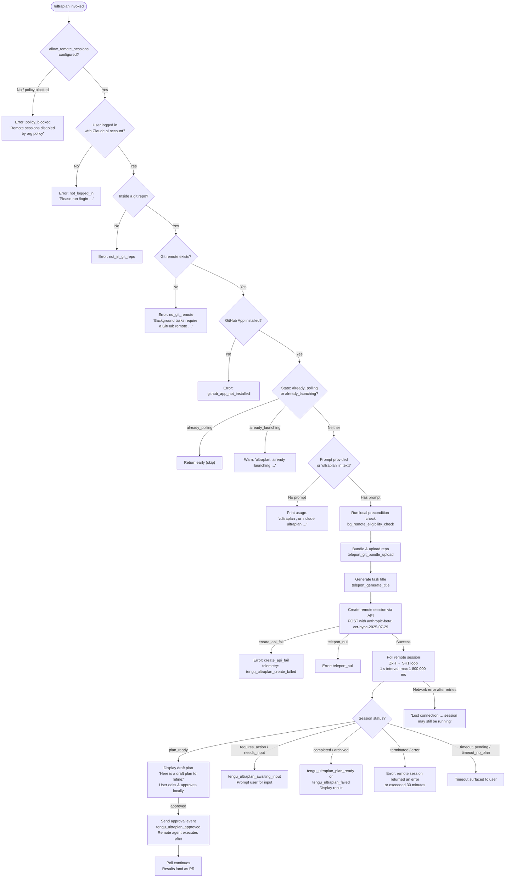

# `/ultraplan`

> Analysis basis: CC v2.1.149 bundle.js (AST extraction + Claude interpretation)
> Minimum version: v2.1.149

---

## Overview

`/ultraplan` launches a remote cloud-based planning session in which Claude Code on the web drafts an implementation plan that the user can review, edit, and approve before any code is written. The command validates a set of preconditions (login state, git repo, GitHub remote, GitHub App installation, and organizational policy), bundles the current repository and uploads it to Anthropic infrastructure, then teleports execution to a remote environment and polls for plan-ready or completion events. Once the user approves the draft plan the remote agent proceeds to execute it, delivering results as a pull request.

---

## Registration

| Field | Value |
|---|---|
| type | `local-jsx` |
| name | `ultraplan` |
| description | `" ... · Claude Code on the web drafts a plan you can edit and approve. See ..."` |
| argumentHint | `<prompt>` |
| load_inline | `true` |
| load_ident | `ysL` |
| loc_byte | `11841542` |
| loc_byte_end | `11841786` |
| loc_line | `9533` |
| arbor_handler.name | `ysL` |
| arbor_handler.fqn | `claude-2.1.149::ysL` |
| arbor_handler.kind | `AsyncFunction` |
| arbor_handler.resolution_path | `load_ident` |
| arbor_handler.n_hits | `1` |

Analysis basis: CC v2.1.149 bundle.js:+11841542

The handler was inlined as `load:()=>Promise.resolve({call: ysL})`. Arbor resolved the handler via `load_ident` to the async function `ysL` (FQN `claude-2.1.149::ysL`).

---

## Input Branching

The command has five or more distinct guard branches (not-logged-in, no git repo, no git remote, GitHub App not installed, policy blocked, already-polling, already-launching, no prompt text) plus a happy-path that itself branches on plan approval vs. remote-only execution. A Mermaid flowchart is used.



Analysis basis: CC v2.1.149 bundle.js:+11839685 (handler entry `ysL`), +11837200 (already_polling), +11837218 (already_launching), +11837264 (usage message), +11838028 (plan assembly `ZsL`), +8750867 (poll loop `ZkH`).

---

## Behavioral Spec

### 1. Handler Entry — `ysL` (main async handler)

```
async function ultaplanHandler(toolInput, context):
    appState = context.getAppState()

    // Guard: remote sessions allowed?
    if not appState.allow_remote_sessions:
        return earlyExit("policy_blocked")

    // Guard: logged in?
    eligibility = await checkEligibility(appState)   // k1
    if eligibility.missing("allow_remote_sessions"):
        return earlyExit("not_logged_in")

    // Set launch state
    context.setAppState({ ultraplan: "already_launching" })

    // Delegate to core launch pipeline
    await coreLaunchPipeline(toolInput, context)     // uV6

    // Read updated state, surface to UI
    newState = context.getAppState()
    // ...render JSX result
```

Analysis basis: CC v2.1.149 bundle.js:+11839685 (`ysL→LP8`), +11839703 (`ysL→k1`), +11840020 (`ysL→_.getAppState`), +11840238 (`ysL→_.setAppState`).

---

### 2. Eligibility Check — `checkEligibility` (`k1`)

```
function checkEligibility(appState):
    // Reads plan-level feature flags from persisted config (bJ_ reads file)
    flags = readConfigFile()           // bJ_ → b8q.readFileSync, utf-8
    // Checks membership tier: firstParty | enterprise | team
    tier = flags.tier                  // literals: "firstParty", "enterprise", "team"
    // Checks allow_product_feedback flag
    feedbackAllowed = LX_flags.has("allow_product_feedback")
    // Calls cb() for config resolution
    return resolvedEligibility
```

Relevant literals: `"firstParty"` (bundle.js:+4681542), `"enterprise"` (bundle.js:+4681798), `"team"` (bundle.js:+4681833), `"allow_product_feedback"` (bundle.js:+4685131), `"allow_remote_sessions"` (bundle.js:+11839706).

---

### 3. Core Launch Pipeline — `coreLaunchPipeline` (`uV6`)

```
async function coreLaunchPipeline(input, context):
    // Duplicate-launch guard
    state = getCurrentState()
    if state == "already_polling":
        return { status: "already_polling" }   // literal +11837200
    if state == "already_launching":
        warn("ultraplan: already launching. Please wait …")  // literal +11835812
        return

    // Prompt extraction: strip "/ultraplan" prefix or detect inline keyword
    prompt = extractPrompt(input)              // LP8 → fp_ → H.startsWith, matchAll
    if not prompt:
        return showUsage()                     // literal +11837264

    // Run remote eligibility preflight
    preconditions = await runRemoteEligibility(context)  // mjH → IH1
    // IH1 checks: not_logged_in, not_in_git_repo, no_git_remote,
    //             github_app_not_installed, policy_blocked
    if preconditions.failed:
        return displayError(preconditions.errorCode)

    // Build draft plan locally via local model call
    draftPlan = await buildLocalDraftPlan(prompt, context)  // ZsL → EsL → WsL
    // ZsL pushes "Here is a draft plan to refine:" prefix  (literal +11832929)

    // Launch remote teleport session
    sessionResult = await teleportToRemote(prompt, draftPlan, context)  // ed
    if sessionResult.failed:
        handleCreateError(sessionResult)   // telemetry: tengu_ultraplan_create_failed
        return

    // Mark launched
    emitTelemetry("tengu_ultraplan_launched")   // +11838655
    context.setAppState({ ultraplan: "already_polling" })

    // Begin polling loop
    await pollRemoteSession(sessionResult.sessionId, context)  // VsL → hC1 → ZkH → SH1
```

Analysis basis: CC v2.1.149 bundle.js:+11836948 (`uV6→k1`), +11837058 (`uV6→m7H`), +11837240 (`uV6→pC1`), +11837353 (`uV6→sE8`), +11837407 (`uV6→M`), +11837467 (`uV6→ksL`).

---

### 4. Prompt Extraction — `extractPrompt` (`LP8` + `fp_`)

```
function extractPrompt(rawInput):
    // Strip leading "/ultraplan" token
    text = rawInput.slice(...)           // LP8 → H.slice (+9561857)
    // Normalize whitespace: replace "$1$2" pattern  (literal +9561954)
    text = text.replace(regex, "$1$2")
    // Truncate to first 5 sentences if needed  (literal value 5 at +9561977)
    // Detect "ultraplan" keyword anywhere in prompt (gi regex, +9561277)
    matches = text.matchAll(/ultraplan/gi)
    // If keyword found inline, extract surrounding context
    if matches.some(...):
        return extractedContext
    return text.trim() or null
```

Analysis basis: CC v2.1.149 bundle.js:+9561629 (literal `"ultraplan"`), +9561277 (literal `"gi"`), +9561857 (`LP8→H.slice`), +9561928 (`LP8→A.replace`), +9561285 (`fp_→H.matchAll`), +9561377 (`fp_→q.some`).

---

### 5. Remote Eligibility Preflight — `remoteEligibilityCheck` (`IH1`)

Verifies all conditions required before a remote session may be created.

```
async function remoteEligibilityCheck(context):
    checks = []

    // 1. Login check
    if not isLoggedIn(context):
        return { error: "not_logged_in",
                 message: "Please run /login and sign in with your Claude.ai account (not Console)." }
        // literal +8746200

    // 2. Git repo check
    if not inGitRepo():
        return { error: "not_in_git_repo" }   // literal +8746279

    // 3. GitHub remote check
    if not hasGitHubRemote():
        return { error: "no_git_remote",
                 message: "Background tasks require a GitHub remote. Add one with `git remote add origin REPO_URL`." }
        // literal +8746439

    // 4. GitHub App installation
    installed = await checkGithubAppInstalled(context)   // YkH
    if not installed:
        return { error: "github_app_not_installed" }      // literal +8746534

    // 5. Policy check
    if policyBlocked():
        return { error: "policy_blocked",
                 message: "Remote sessions are disabled by your organization's policy …" }
        // literal +8746711

    // Telemetry: bg_remote_eligibility_check
    emitTelemetry("bg_remote_eligibility_check")         // literal +8744350
    return { ok: true }
```

Analysis basis: CC v2.1.149 bundle.js:+8744280 (`IH1→k1`), +8744347 (`IH1→_8`), +8744415 (`IH1→Promise.all`), +8744502 (`IH1→Peq`), +8746200, +8746279, +8746439, +8746534, +8746711.

---

### 6. Repository Bundle & Upload — `teleportGitBundleUpload` (`Yb_`)

```
async function teleportGitBundleUpload(context):
    // Verify git repo
    if not isGitRepo():
        throw Error("Not in a git repository")     // literal +8667153

    // Stash uncommitted changes
    stashResult = git("stash", "create")           // literals +8667577, +8667585
    // Create temporary git bundle file: ccr-seed.bundle  (+8668380, +8668391)
    bundleFile = createTempBundle("ccr-seed", ".bundle")

    // Attempt upload strategies in order:
    // Strategy A: HEAD bundle
    // Strategy B: fallback HEAD  (literals: "head", "fallback_head")
    // Strategy C: squashed       (literals: "squashed", "fallback_squashed")
    result = await uploadBundle(bundleFile)
    if result == "failed":
        emitTelemetry("tengu_ccr_bundle_upload")   // +8667385
        throw UploadError("upload_failed")          // literal +8668828

    // Cleanup temp file
    fs.unlink(bundleFile)                          // Yb_ → vaH.unlink +8669316

    emitTelemetry("tengu_ccr_bundle_upload")
    return { status: "success", mode: bundleMode }
```

Analysis basis: CC v2.1.149 bundle.js:+8667063 (`Yb_→x6`), +8667092 (literal `"teleport_git_bundle_upload"`), +8667121 (literal `"empty_repo"`), +8668380, +8668391, +8669316.

---

### 7. Remote Session Creation — `teleportToRemote` (`ed`)

```
async function teleportToRemote(prompt, draftPlan, context):
    // Resolve access token and org UUID
    token = getAccessToken(context)               // Xb_
    if not token:
        throw Error("No access token found for remote session creation")  // +8681681

    orgUUID = getOrgUUID(context)                 // aC → m6
    if not orgUUID:
        throw Error("Unable to get organization UUID …")  // +8681991

    // Determine bundle mode (too_large | bundle | explicit_env_bundle | git_repository)
    bundleMode = resolveBundleMode(context)       // emits tengu_teleport_bundle_mode +8682740

    // Resolve git remote URL  (Uh → git config --get remote.origin.url)
    remoteURL = getGitRemoteURL()                 // +1060356

    // Build request body including:
    //   anthropic-beta: "ccr-byoc-2025-07-29"   (literal +8682330)
    //   x-organization-uuid header               (literal +8682352)
    //   permission mode control_request / set_permission_mode  (+8681201)
    //   uuid via randomUUID()                    (req → wb_.randomUUID +8681165)

    response = await httpClient.post(sessionEndpoint, body, {
        headers: { "anthropic-beta": "ccr-byoc-2025-07-29", ... },
        timeout: 15000    // literal +8630383
    })

    // HTTP status handling:
    //   201 → session created successfully          (literal +8683664)
    //   401/403/429 → auth / rate-limit error       (literals +8683732/36/40)
    //   500 → server error                          (literal +8683628)
    //   409 → conflict (duplicate)                  (literal +8689854)

    if response.status not in [201]:
        return { failed: true, code: mapErrorCode(response) }

    sessionId = response.data.id
    if not sessionId:
        throw Error("Server returned a malformed session response (no session id)")  // +8684086

    emitTelemetry("tengu_ccr_session_link")   // +8677141
    return { sessionId, environmentId }
```

Analysis basis: CC v2.1.149 bundle.js:+8681512 (`ed→x6`), +8681651 (`ed→t$`), +8681662 (`ed→Xb_`), +8682307 (`ed→h9`), +8683131 (`ed→req`), +8683572 (`ed→l_.post`), +8683706 (`ed→CH`).

---

### 8. Poll Loop — `pollRemoteSession` (`ZkH` → `SH1`)

```
async function pollRemoteSession(sessionId, context):
    // Generate poll token (8 random bytes)  (lN → Vr1.randomBytes, literal 8 at +12839500)
    pollToken = randomBytes(8)

    // Open browser to session URL  (YaH → Wa.open)
    openBrowser(buildSessionURL(sessionId))

    // Record start time
    startTime = Date.now()
    maxDuration = 1_800_000   // 30 minutes in ms  (literal +8752465)
    pollInterval = 1_000      // 1 second           (literal +8752458)

    loop:
        await sleep(pollInterval)
        elapsed = Date.now() - startTime
        if elapsed > maxDuration:
            surfaceError("remote session exceeded 30 minutes")  // literal +8755084
            break

        status = await fetchSessionStatus(sessionId)   // SH1 → l_.get / CH

        switch status:
            case "pending" | "starting" | "running":
                continue polling

            case "plan_ready":
                emitTelemetry("tengu_ultraplan_plan_ready")   // +11833300
                displayDraftPlan(status.planText)              // ZsL assembles plan
                approved = await awaitUserApproval()
                if approved:
                    emitTelemetry("tengu_ultraplan_approved")  // +11833708
                    sendApprovalEvent(sessionId)
                    displayMessage("Results will land as a pull request …")  // +11834194
                continue polling

            case "requires_action" | "needs_input":
                emitTelemetry("tengu_ultraplan_awaiting_input")  // +11833232
                promptUser(status.inputRequest)
                continue polling

            case "completed" | "archived":
                emitTelemetry("tengu_ultraplan_plan_ready" or "tengu_ultraplan_failed")
                displayResult(status.result)
                break loop

            case "terminated":
                surfaceError("remote session returned an error")  // +8755043
                break loop

        // Timeout states
        if timeoutPending:
            surfaceError("timeout_pending")   // literal +11824991
```

Poll timeout constant: **1,800,000 ms (30 minutes)** (bundle.js:+8752465). Poll interval: **1,000 ms** (bundle.js:+8752458). Session timeout sentinel: `5400` seconds (bundle.js:+11832622). Plan-ready acknowledgment prefix: `"Here is a draft plan to refine:"` (bundle.js:+11832929).

Analysis basis: CC v2.1.149 bundle.js:+8750867 (`ZkH→lN`), +8750886 (`ZkH→YaH`), +8750903 (`ZkH→lP`), +8751107 (`ZkH→Date.now`), +8751346 (`ZkH→SH1`), +11823448 (`hC1→Date.now`).

---

### 9. Draft Plan Assembly — `buildLocalDraftPlan` (`ZsL`)

```
function buildLocalDraftPlan(prompt, existingPlan):
    parts = []
    parts.push("Here is a draft plan to refine:")   // literal +11832929
    // EsL → WsL assembles intermediate plan content
    parts.push(assembleIntermediatePlan(existingPlan))  // EsL +11832982
    return parts.join("")    // ZsL → q.join +11833012
```

Analysis basis: CC v2.1.149 bundle.js:+11832922 (`ZsL→q.push`), +11832982 (`ZsL→EsL`), +11833012 (`ZsL→q.join`).

---

### 10. Task Metadata Generation — `generateTaskTitle` (`UYL`)

```
async function generateTaskTitle(prompt):
    // Trim prompt to first 75 characters for title generation  (literal +8670380)
    shortPrompt = prompt.slice(0, 75)
    // Replace {description} template placeholder  (literal +8670422)
    titlePrompt = template.replace("{description}", shortPrompt)
    // POST to claude/task endpoint  (literal +8670386)
    response = await httpClient.post("claude/task", titlePrompt)
    // Parse json_schema response  (literal +8670506)
    // Extract fields: title, branch  (literals +8670610, +8670618)
    emitTelemetry("tengu_ccr_session_link")   // via ieq
    return { title, branch }
```

Analysis basis: CC v2.1.149 bundle.js:+8670375 (`UYL→Dq`), +8670410 (`UYL→pYL.replace`), +8670450 (`UYL→nk`), +8670874 (`UYL→Nq`), +8670894 (`UYL→k.object`).

---

### 11. GitHub App Check — `checkGithubAppInstalled` (`YkH`)

```
async function checkGithubAppInstalled(context):
    token = getAccessToken(context)
    if not token:
        log("checkGithubAppInstalled: No access token found, assuming app not installed")
        // literal +8631962
        return false

    orgUUID = getOrgUUID(context)
    if not orgUUID:
        log("checkGithubAppInstalled: No org UUID found, assuming app not installed")
        // literal +8632075
        return false

    response = await httpClient.get(githubAppCheckEndpoint)

    if response.isAxiosError:
        if response.status == 400:
            return false    // literal +8632733
        return false        // other errors: not installed

    // Log "is" / "is not" installed  (literals +8632473, +8632478)
    return response.data.installed
```

Analysis basis: CC v2.1.149 bundle.js:+8631929 (`YkH→eA`), +8632161 (`YkH→h9`), +8632332 (`YkH→l_.get`), +8632679 (`YkH→l_.isAxiosError`).

---

### 12. Error Recovery and Archiving

```
// On unexpected error during launch:
//   emitTelemetry("tengu_ultraplan_create_failed")   +11836985
//   display: "Ultraplan hit an unexpected error during launch …"  +11839222
//   errorCode: "unexpected_error"  +11839064
//
// Orphaned session cleanup:
//   log: "ultraplan: failed to archive orphaned session"  +11839370
//   retry delay: 1500 ms  (literal +11838996)
//
// Remote failure system prompt injection:
//   "Remote Ultraplan session failed. Wait for the user's next instructions."  +11834988
```

Analysis basis: CC v2.1.149 bundle.js:+11836985, +11839064, +11839222, +11839370, +11838996.

---

## State & Side Effects

| Item | Detail |
|---|---|
| Telemetry: `tengu_ultraplan_create_failed` | Emitted when session creation POST fails (bundle.js:+11836985) |
| Telemetry: `tengu_ultraplan_prompt_identifier` | Emitted to classify how the prompt was supplied (bundle.js:+11832755) |
| Telemetry: `tengu_ultraplan_launched` | Emitted when session successfully created and polling begins (bundle.js:+11838655) |
| Telemetry: `tengu_ultraplan_timeout_seconds` | Emitted with elapsed time on timeout (bundle.js:+11832588) |
| Telemetry: `tengu_ultraplan_awaiting_input` | Emitted when remote session requests user input (bundle.js:+11833232) |
| Telemetry: `tengu_ultraplan_plan_ready` | Emitted when draft plan arrives from remote (bundle.js:+11833300) |
| Telemetry: `tengu_ultraplan_approved` | Emitted when user approves the plan (bundle.js:+11833708) |
| Telemetry: `tengu_ultraplan_failed` | Emitted on remote session failure (bundle.js:+11834581) |
| Telemetry: `tengu_ccr_bundle_seed_enabled` | Emitted per bundle seed feature flag (bundle.js:+8744745) |
| Telemetry: `tengu_ccr_bundle_upload` | Emitted after bundle upload attempt (bundle.js:+8667385) |
| Telemetry: `tengu_teleport_bundle_mode` | Emitted with resolved bundle mode (bundle.js:+8682740) |
| Telemetry: `tengu_ccr_session_link` | Emitted with session link after creation (bundle.js:+8677141) |
| Telemetry: `tengu_teleport_source_decision` | Emitted with chosen upload strategy (bundle.js:+8687810) |
| Telemetry: `tengu_config_parse_error` | Emitted on config file parse failure (bundle.js:+3196285) |
| Telemetry: `tengu_bg_dispatch_sigkill_escalate` | Emitted when background process requires SIGKILL (bundle.js:+15260736) |
| Telemetry: `tengu_bg_low_mem_mb`, `tengu_bg_dispatch_low_mem` | Memory pressure events in background task dispatch (bundle.js:+12607186, +15261315) |
| Telemetry: `tengu_bg_spare_enable/claim/spawn/claim_fail` | Spare background process pool events (bundle.js:+15262010, +15262131, +15260429, +15262394) |
| Telemetry: `tengu_bg_sendclaim_failed` | Emitted when IPC claim message fails (bundle.js:+15241837) |
| Telemetry: `tengu_feature_ok` / `tengu_feature_bad` | Feature gate pass/fail events (bundle.js:+963421, +963479) |
| appState changes | Sets `ultraplan` key to `"already_launching"` then `"already_polling"` via `_.setAppState` (bundle.js:+11840238) |
| Browser open | Session URL opened via `Wa.open` (bundle.js:+12838514) |
| File system | Temporary git bundle file (`ccr-seed.bundle`) written and then unlinked; config file read via `readFileSync` (utf-8) |
| Network | HTTP POST to session creation endpoint; HTTP GET for environment list and GitHub App check; axios client used (`l_.post`, `l_.get`, `l_.isAxiosError`, `l_.isCancel`) |
| Git operations | `stash create`, `for-each-ref`, `rev-parse --verify HEAD`, `update-ref -d`, `git bundle`, `git config --get remote.origin.url`, `symbolic-ref --short refs/remotes/origin/HEAD` |
| Random | `crypto.randomUUID()` for session request ID; `crypto.randomBytes(8)` for poll token |
| Hook registration | `a9 → W7A.register` registers a task-notification hook (bundle.js:+58272); hook type literal `"task-notification"` (+11837965) |
| Sound | None observed in depth-2 traversal |

---

## Version History

| Version | Change |
|---|---|
| v2.1.149 | Initial analysis |

---

## Common Mistakes

1. **Invoking `/ultraplan` without a Claude.ai login.** The command requires OAuth-based login (`/login`), not an API key. API key authentication is explicitly rejected with the message "Claude Code web sessions require authentication with a Claude.ai account" (bundle.js:+8629952).
2. **Running in a directory without a git repository.** All remote session transport relies on git bundle upload; the command will return a `not_in_git_repo` error immediately.
3. **Missing GitHub remote.** Even with a valid git repository, a GitHub remote (`git remote add origin …`) is required before the command can proceed.
4. **GitHub App not installed on the target repository.** The GitHub App check (`checkGithubAppInstalled`) is performed before any upload; the app must be installed at `github.com` (literal bundle.js:+8744941).
5. **Invoking the command twice rapidly.** A second invocation while the first is in the `already_launching` or `already_polling` state will be silently skipped or return a warning; there is no queuing.
6. **Expecting immediate results.** The remote session polls for up to 30 minutes (1,800,000 ms). Results arrive as a pull request; the local terminal only shows status updates during polling.
7. **Organization policy restriction.** If the organization admin has disabled remote sessions, `/ultraplan` returns `policy_blocked` immediately and no prompt is sent to the remote infrastructure.

---

## Appendix — Identifier Mapping

> For bundle debugging only. Identifiers change across versions.

| Identifier | Role |
|---|---|
| `ysL` | Main async handler for `/ultraplan` (Arbor-resolved entry point) |
| `LP8` | Prompt text extraction and normalization |
| `KP8` | Inner prompt cleaning helper called by LP8 |
| `fp_` | Prompt keyword detection (matchAll, startsWith, some) |
| `H` | Generic string/buffer variable (multi-use across call sites) |
| `M` | Generic collection / promise / stream variable (multi-use) |
| `q` | Generic array / set / file-system variable (multi-use) |
| `f` | Feature-flag / config record array |
| `A` | Generic object / response variable (multi-use) |
| `k1` | Eligibility / feature-flag checker |
| `p8q` | Config loading outer wrapper |
| `_q8` | Config loading inner resolver |
| `cb` | Config record builder (tier: firstParty/enterprise/team) |
| `bJ_` | Config file reader (readFileSync, utf-8) |
| `G1` | Telemetry / string normalizer |
| `Z2A` | String conversion utility |
| `mH` | Low-level string coercion helper |
| `X1H` | Alternate string coercion path |
| `m7H` | UI message / modal helper |
| `uV6` | Core launch pipeline orchestrator |
| `c` | Generic callback / closure variable |
| `L` | Promise lifecycle manager (add/finally/delete pattern) |
| `pC1` | UI progress / spinner controller |
| `sE8` | Session state transition handler |
| `aE8` | Session state inner transition |
| `V6` | App-state reader with feature-gate checks |
| `GsL` | Ultraplan-specific state getter |
| `ksL` | Full Ultraplan lifecycle coordinator (plan + teleport + poll) |
| `mjH` | Remote session precondition runner |
| `IH1` | Remote eligibility check implementation |
| `ZsL` | Draft plan text assembler |
| `EsL` | Intermediate plan content builder |
| `ed` | Remote session creation (`teleportToRemote`) |
| `x6` | Environment / URL resolver utility |
| `t$` | OAuth token retrieval |
| `Xb_` | Access token extractor |
| `RH` | Error logger / reporter |
| `aC` | Organization UUID fetcher |
| `h9` | API endpoint URL builder |
| `oJ` | HTTP client header builder |
| `Yb_` | Git bundle upload handler (`teleportGitBundleUpload`) |
| `S6` | Generic data serializer |
| `N` | Log-level / severity router |
| `Uh` | Git remote URL resolver (git config --get remote.origin.url) |
| `req` | Session creation request body builder |
| `CH` | JSON serializer wrapper |
| `ieq` | Session link emitter |
| `Do` | Environment list fetcher (`teleport_environments_list`) |
| `GaH` | Default environment creator (`teleport_default_environment_create`) |
| `EH` | String coercion / display formatter |
| `UYL` | Task title/branch generator (`teleport_generate_title`) |
| `Tb` | App-state writer with feature-gate checks |
| `YkH` | GitHub App installation checker |
| `kv` | Default branch resolver (symbolic-ref / show-ref) |
| `Fq` | Notification / toast dispatcher |
| `c_` | Error type checker (AbortError / string) |
| `Ih` | Cancellation signal checker |
| `HY` | UI hook / render helper |
| `nD` | Daemon / background process spawner |
| `d_` | Module initializer / ES-module shim |
| `TX_` | Environment URL resolver (local/staging/prod) |
| `NsL` | Ultraplan notification helper |
| `ZkH` | Remote session poll orchestrator |
| `lN` | Poll token generator (randomBytes) |
| `YaH` | Browser open helper (Wa.open) |
| `lP` | Pending session timeout tracker |
| `PDL` | Poll result status formatter |
| `SH1` | Remote session status fetcher and event dispatcher |
| `my` | Task list / background task manager |
| `JGL` | Task-started event handler |
| `wGL` | Task-updated event handler |
| `em_` | Task event emitter |
| `XGL` | Task timestamp recorder |
| `PGL` | Task state persistence handler |
| `s8H` | Task status state machine |
| `VsL` | Plan-ready / approved / failed branch router |
| `hC1` | Poll loop body (ingest messages, compute elapsed time) |
| `PsL` | Plan state reader |
| `IsL` | Plan approval state setter |
| `M06` | Orphaned file cleanup helper |
| `K` | Column padding / display formatter |
| `ex` | Plan approval HTTP POST sender |
| `a9` | Hook registrar (`W7A.register`) |
| `vsL` | Ultraplan visual state renderer (JSX) |
| `m6` | App config / project config reader |
| `Q6` | Config directory path resolver |
| `Af_` | Config file path builder |
| `JOH` | Project config file reader/writer |
| `g6` | JSON parse wrapper |
| `xC` | Path prefix stripper |
| `K8` | File-not-found sentinel |
| `mb9` | Config backup directory scanner |
| `Of_` | Config backup path builder |
| `$` | Generic collection / set variable |
| `w` | Background process supervisor loop |
| `C` | Background child process wrapper |
| `uH` | Feature-ok telemetry emitter |
| `bH` | Feature-bad telemetry emitter |
| `Kv8` | macOS memory limit checker |
| `Oz6` | Daemon config file reader |
| `g` | Background process retirement checker |
| `yqA` | Background process IPC claim sender |
| `uqA` | Background process lifecycle manager |
| `D` | Spare process disposal handler |
| `Et4` | Config file watcher |
| `rn` | Config file change callback |
| `NH6` | Initial session state loader (Promise.all fan-out) |

---

*Note: index built via Arbor fallback; some signals (telemetry, literals) may be missing — see arbor-fallback.js.*