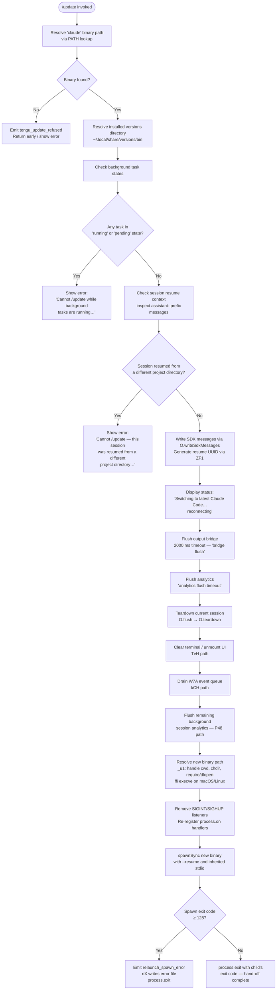

# `/update`

> Analysis basis: CC v2.1.149 bundle.js (AST extraction + Claude interpretation)
> Minimum version: v2.1.149

---

## Overview

The `/update` command performs an in-place upgrade of the running Claude Code CLI to its latest published version while preserving the active conversation. It resolves the installed binary path, validates preconditions (no background tasks running, no cross-directory resume mismatch), then orchestrates a graceful teardown and re-exec of the new binary with the `--resume` flag so the session continues seamlessly.

---

## Registration

| Field | Value |
|---|---|
| type | `local` |
| name | `update` |
| description | `Switch to the latest version (conversation continues)` |
| loc_byte | `12273051` |
| loc_byte_end | `12273253` |
| loc_line | `10002` |
| supportsNonInteractive | `false` |
| isHidden | `true` |
| module_id | `vF1` |
| load_inline | `true` |
| arbor_handler.name | `Z_5` |
| arbor_handler.fqn | `claude-2.1.149::Z_5` |
| arbor_handler.kind | `AsyncFunction` |
| arbor_handler.resolution_path | `module_id` |
| arbor_handler.n_hits | `0` |

Analysis basis: CC v2.1.149 bundle.js:+12273051

---

## Input Branching

The command has four or more distinct guard branches before it reaches the relaunch path, making a Mermaid flowchart the appropriate representation.



Analysis basis: CC v2.1.149 bundle.js:+12271256, +12271278, +12271359, +12271600, +12272111, +12272191, +12003599, +12003848

---

## Behavioral Spec

### 1 — Binary and Version Path Resolution

```
async function resolveBinaryAndVersionPath():
    binaryPath = lookupInPath("claude")          // sGA / Bun.which
    if binaryPath is null:
        emitTelemetry("tengu_update_refused")    // loc +12270995
        return ABORT

    versionsDir = joinPath(
        homeDir(),                               // BO8 / GUq.homedir
        ".local", "share", "versions"           // literals +7626140, +7626149
    )
    binDir = joinPath(versionsDir, "bin")        // literal +7626220
    return { binaryPath, binDir }
```

Analysis basis: CC v2.1.149 bundle.js:+12270895, +12270948, +1059700, +7625867, +7626140

---

### 2 — Background Task Guard

```
function checkBackgroundTaskGuard(appState):
    tasks = Object.values(appState.backgroundTasks)  // loc +12271218
    for task in tasks:
        if task.status == "running" or task.status == "pending":  // +12271256, +12271278
            showError(
                "Cannot /update while background tasks are running" +
                " — wait for them to finish, then try again."      // +12271359
            )
            return BLOCKED
    return CLEAR
```

Analysis basis: CC v2.1.149 bundle.js:+12271218, +12271256, +12271359

---

### 3 — Cross-Directory Resume Guard

```
function checkResumeMismatchGuard(messages):
    // Scan conversation for messages whose ID starts with "assistant-"
    // (literal +12271901) to detect cross-project resume
    assistantMessages = messages.filter(m => m.id.startsWith("assistant-"))
    if resumedFromDifferentDirectory(assistantMessages):
        showError(
            "Cannot /update — this session was resumed from a different" +
            " project directory. Restart manually with --resume to" +
            " continue on the latest version."                        // +12271600
        )
        return BLOCKED
    return CLEAR
```

Analysis basis: CC v2.1.149 bundle.js:+12271600, +12271901

---

### 4 — Session Serialisation and Resume Token

```
async function serialiseSessionForResume(sessionContext):
    // Write current SDK messages so the resumed process can reload them
    O.writeSdkMessages(sessionContext)            // +12272087

    // Generate a UUID that the relaunched process uses to resume
    resumeId = generateResumeUUID()              // ZF1 / qV8.randomUUID +12269968
    return resumeId
```

Analysis basis: CC v2.1.149 bundle.js:+12272087, +12272107, +12269968

---

### 5 — Graceful Teardown Sequence

```
async function gracefulTeardown(bridge, timeout = 2000):
    displayStatusMessage(
        "Switching to latest Claude Code… reconnecting"  // literal +12272111
    )

    // 1. Flush the output bridge with a 2 000 ms ceiling
    await withTimeout(bridge.flush(), timeout,
                      label = "bridge flush")            // +12272196, +12272191

    // 2. Flush analytics with a separate timeout
    await withTimeout(analyticsFlush(),
                      label = "analytics flush timeout") // +12003158

    // 3. Full session teardown
    bridge.teardown()                                    // +12272232

    // 4. Tear down terminal UI (clear screen, unmount Ink/React tree)
    teardownTerminalUI()                                 // TvH path +12003001

    // 5. Drain the event queue
    drainEventQueue()                                    // kCH / W7A.drain +58315

    // 6. Flush background-session analytics
    await flushBackgroundAnalytics()                     // P48 path +12003147
```

Analysis basis: CC v2.1.149 bundle.js:+12272178, +12272181, +12272232, +12003001, +12003032, +12003091, +12003147

---

### 6 — Re-exec via execve (in-place replacement)

```
async function relaunchBinary(newBinaryPath, resumeId, env):
    // Prepare environment: merge current env with any updated fields
    mergedEnv = Object.assign({}, process.env, env)      // +12272322

    // Remove existing signal handlers to avoid double-handling
    process.removeAllListeners("SIGINT")                  // +12003513
    process.removeAllListeners("SIGHUP")                  // +12003532

    // Re-attach minimal handlers for the hand-off window
    process.on("beforeExit", ...)                         // +12003688
    process.on("exit", ...)                               // +12003729

    // Attempt execve (replaces current process image on POSIX systems)
    // Uses bun:ffi to call libc execve:
    //   macOS: /usr/lib/libSystem.B.dylib             // +12002143
    //   Linux: libc.so.6                              // +12002172
    result = spawnSyncFallback(
        newBinaryPath,
        args = ["--resume", resumeId],                   // +12002978
        stdio = "inherit"                                // +12003634
    )

    if result.exitCode >= 128:                           // +12003961
        emitError("relaunch_spawn_error")                // +12003824
        writeErrorFile()                                 // nX / eCH.writeFileSync +190091
        process.exit(result.exitCode)

    process.exit(result.exitCode)
```

Analysis basis: CC v2.1.149 bundle.js:+12272322, +12003513, +12003532, +12003599, +12003821, +12003848, +12002099, +12002143, +12002172

---

### 7 — Flush Timeout Helper

```
async function withTimeout(promise, ms, label):
    // Races the supplied promise against a timer
    // setTimeout / clearTimeout pattern (t5)             // +2226079, +2226189
    timeout = new Promise(resolve => setTimeout(resolve, ms))
    result = await Promise.race([promise, timeout])      // +2226142
    clearTimeout(timeout)
    return result
```

Flush timeout ceiling: 2 000 ms for bridge flush (bundle.js:+12272191); 30 000 ms for relaunch flush (bundle.js:+12003040).

Analysis basis: CC v2.1.149 bundle.js:+2226079, +12272191, +12003040

---

## State & Side Effects

| Item | Detail |
|---|---|
| Telemetry — `tengu_update_refused` | Fired when the command is blocked (binary not found or precondition failed); loc +12270995 |
| Telemetry — `tengu_scroll_summary` | Fired during terminal scroll/summary rendering in the teardown path; loc +5285263 |
| Telemetry — `tengu_amber_creek` | Fired inside the fullscreen rendering path reached during teardown; loc +3360591 |
| Telemetry — `tengu_pewter_brook` | Fired alongside `tengu_amber_creek` in the same render path; loc +3360499 |
| Telemetry — `tengu_bg_dispatch_sigkill_escalate` | Background dispatcher escalation during teardown; loc +15260736 |
| Telemetry — `tengu_feature_bad` / `tengu_feature_ok` | Feature-flag probe results recorded during setup; loc +963479, +963421 |
| Telemetry — `tengu_bg_low_mem_mb` | Low-memory condition recorded during background session cleanup; loc +12607186 |
| Telemetry — `tengu_bg_dispatch_low_mem` | Dispatched when background worker memory is low; loc +15261315 |
| Telemetry — `tengu_bg_spare_enable` | Background spare slot enabled; loc +15262010 |
| Telemetry — `tengu_bg_sendclaim_failed` | Background claim failed during teardown; loc +15241837 |
| Telemetry — `tengu_bg_spare_claim` | Background spare slot claimed; loc +15262131 |
| Telemetry — `tengu_bg_spare_spawn` | Spare background process spawned; loc +15260429 |
| Telemetry — `tengu_bg_spare_claim_fail` | Spare claim failure; loc +15262394 |
| Telemetry — `tengu_daemon_control` | Daemon control event (stop/stop-failed) recorded during shutdown; loc +15296846 |
| appState read | `_.getAppState()` called to inspect background task list; loc +12271847 |
| appState write | `_.setAppState()` called to mark update in-progress; loc +12272001 |
| SDK message persistence | `O.writeSdkMessages()` serialises conversation for the resumed process; loc +12272087 |
| Hook registration | `a9` / `W7A.register` hooks registered in `ma_` path; loc +58272 |
| Last-prompt entry | `_.appendEntry` writes a `"last-prompt"` entry before teardown; loc +12770376 |
| Terminal UI teardown | Ink/React tree unmounted via `H.unmount`; terminal escape sequences written via `XDH.writeSync`; loc +5283795, +5283718 |
| Process signal handlers | `SIGINT` and `SIGHUP` listeners removed then re-registered around the re-exec; loc +12003513, +12003532 |
| File system | Error file written on spawn failure via `nX` / `eCH.writeFileSync`; loc +190091 |
| Process replacement | `qu1.spawnSync` (fallback) or `f.execve` (libc FFI) replaces the process image; loc +12003599, +12002498 |

---

## Version History

| Version | Change |
|---|---|
| v2.1.149 | Initial analysis |

---

## Common Mistakes

1. **Running `/update` during active background tasks.** The command is unconditionally blocked when any background task reports `"running"` or `"pending"` status. Wait for all background tasks to complete before issuing `/update`.

2. **Using `/update` in a resumed cross-directory session.** If Claude Code was started with `--resume` and the resume token points to a different working directory than the current shell, `/update` will refuse with an explicit error and ask you to restart manually with `--resume`.

3. **Expecting the command to be visible in the slash-command menu.** The registration sets `isHidden: true`, so `/update` does not appear in autocomplete listings; it must be typed explicitly.

4. **Assuming the update is instantaneous.** The teardown sequence includes a 2 000 ms bridge-flush window and a 30 000 ms flush-timeout ceiling before the process is replaced. The UI will show *"Switching to latest Claude Code… reconnecting"* during this period.

5. **Attempting `/update` in non-interactive mode.** `supportsNonInteractive: false` means the command is unavailable in headless or piped invocations and will not execute.

6. **Expecting the old PID to persist.** On POSIX systems the implementation uses `execve` via Bun FFI (macOS: `/usr/lib/libSystem.B.dylib`; Linux: `libc.so.6`) which replaces the process image entirely; the PID may or may not be preserved depending on the OS and the spawn path taken.

---

## Appendix — Identifier Mapping

> For bundle debugging only. Identifiers change across versions.

| Identifier | Role |
|---|---|
| `Z_5` | Main async handler for `/update` (arbor_handler; AsyncFunction) |
| `LV8` | Binary path resolution entry point; calls `i3` (PATH lookup) and `Ku` (version-dir builder) |
| `i3` | Wrapper that invokes `sGA` / `Bun.which` to locate the `claude` binary on PATH |
| `sGA` | `Bun.which` shim; resolves an executable name to an absolute path |
| `Ku` | Constructs the versioned install directory path (`~/.local/share/versions/bin`) |
| `ej8` | Joins path segments and resolves the `versions` sub-directory |
| `rf` | Array normalization helper (uses `Array.isArray`) |
| `UwH` | Home-directory path helper; calls `BO8` and `ZP6.join` |
| `BO8` | Retrieves the OS home directory via `GUq.homedir` |
| `$8H` | Alternate home-dir path builder; parallel to `UwH` |
| `bq` | Background-task filter / status helper; spawns `f$H` |
| `f$H` | Inner predicate used by `bq` to classify task states (`bg`, `daemon`, `daemon-worker`) |
| `c` | Generic utility / context accessor used throughout the handler |
| `yG` | File basename helper; calls `NP.basename` and `S6` |
| `S6` | String/path utility wrapping `Dv` |
| `Dv` | Low-level string primitive helper |
| `YI` | Path existence / stat utility |
| `Zo_` | Directory-change helper; calls `j_`, `Mu1.dirname`, `$O`, `rK` |
| `j_` | Inner helper used by `Zo_`; wraps `Dv` |
| `rK` | Secondary helper used by `Zo_`; wraps `Dv` |
| `n_H` | Pre-relaunch notification / message helper |
| `wa` | Attachment/hook type checker; reads `Sv8` and `lL5.has` |
| `Sv8` | Attachment type constant set |
| `ma_` | Hook registration and last-prompt entry writer; calls `h4`, `_.appendEntry`, `S6` |
| `h4` | Hook registrar; delegates to `a9` / `W7A.register` |
| `a9` | Underlying hook registration call (`W7A.register`) |
| `RH` | Output / message renderer; calls `c_`, `mH`, `G1`, `uiK`, `dxH.push`, `ll.logError` |
| `c_` | Error message formatter (uses `Error`, `String`) |
| `mH` | String coercion / formatting helper |
| `G1` | Message queue helper; calls `Z2A` |
| `Z2A` | Inner queue entry builder |
| `uiK` | Ring-buffer manager for displayed messages (`Hm6.shift`, `Hm6.push`) |
| `eG` | App-state transformer applied between `getAppState` and `setAppState` |
| `O` | SDK I/O bridge: `writeSdkMessages`, `flush`, `teardown` |
| `k8` | Internal SDK message handler used by `O` |
| `ZF1` | Resume UUID generator; calls `qV8.randomUUID` |
| `t5` | Timeout-race helper: `setTimeout`, `Promise.race`, `clearTimeout` |
| `PzH` | String serialisation helper (uses `String`) |
| `RXH` | Full relaunch orchestrator: stat check, teardown UI, drain queues, flush analytics, execve |
| `_j6` | Interval-clearing helper; calls `_G_` |
| `_G_` | `clearInterval` wrapper |
| `TvH` | Terminal UI teardown: `XDH.writeSync`, `Y7.get`, `H.unmount`, `wS`, `l68`, `mH` |
| `H` | Ink/React renderer instance; also overloaded as generic container |
| `wS` | Terminal write-sync helper |
| `l68` | Terminal escape-sequence writer; calls `ue.writeSync`, `xEH`, `SEH`, `VG` |
| `xEH` | Terminal emulator capability probe; checks Ghostty, iTerm, tmux, screen |
| `SEH` | Secondary escape helper |
| `VG` | tmux/screen multiplexer escape handler |
| `X48` | Scroll summary renderer; fires `tengu_scroll_summary`; calls `jv`, `t$q`, `s$q`, `Y9` |
| `jv` | Scroll summary input formatter |
| `t$q` | Scroll summary token helper |
| `s$q` | Scroll metrics calculator (`Date.now`, `Math.max`, `Math.round`, `Object.assign`) |
| `o$q` | Inner metrics helper used by `s$q` |
| `Y9` | UI rendering dispatch: `WxH`, `I3_`, `mH`, `fi`, `N`, `N3_`, `HA`, `q67`, `V6` |
| `WxH` | Render mode cache check (`AQK.has`) |
| `I3_` | Render type resolver (`t1`, `mH`) |
| `fi` | Fallback renderer; calls `A67` |
| `N` | Main message renderer; handles `debug`, `fullscreen` paths |
| `N3_` | Boolean predicate for renderer selection |
| `HA` | Alternate renderer; calls `hm` |
| `q67` | Queue-based renderer; delegates to `V6` |
| `V6` | Core render dispatch with MCP-tool filtering |
| `FV` | Background flush helper; calls `h4` |
| `kCH` | Event-queue drainer; calls `W7A.drain` |
| `P48` | Background-analytics flush: `Promise.all`, `IZ`, `ag`, `Promise.race`, `r8` |
| `r8` | Child-process runner with abort support; calls `K`, `Error`, `q`, `setTimeout`, `O`, `clearTimeout`, `L.unref` |
| `K` | Process-pool map helper |
| `q` | Temp-file cleanup helper (`SJK.unlinkSync`) |
| `L` | Promise-tracking set helper (`q.add`, `M.finally`, `q.delete`) |
| `_u1` | execve orchestrator: resolves cwd, chdir, require, FFI dlopen, Buffer, BigInt, ptr, execve |
| `M` | Native module handle / FFI module object |
| `A` | Process or module abstraction |
| `$` | Process roster / telemetry entry map |
| `_Q1` | Roster entry builder (`Pn`, `Date.now`, `A1`, `$v6`, `CH`) |
| `w` | Background worker supervisor |
| `C` | Worker subprocess controller |
| `uH` | Worker stderr handler |
| `bH` | Worker stdout handler |
| `Kv8` | Low-memory probe; fires `tengu_bg_low_mem_mb` |
| `Oz6` | Config file reader (`vP.readFile`, `g6`, `Array.isArray`, `j8`, `v37`) |
| `g` | Worker pool; `retireIfSettled` method |
| `yqA` | Daemon connection helper: `bB.claim`, `Vh8.connect`, socket write/end |
| `uqA` | Worker lifecycle manager; fires state strings (`done`, `killed`, `failed`, `crashed`, `blocked`, `working`, `active`, `idle`) |
| `D` | Worker dispatcher; calls `V6`, `$.dispose`, `Kv8`, `D` (recursive), `N`, `RH`, `K8` |
| `K8` | Worker-state recorder |
| `S` | Worker slot disposer |
| `f` | MCP update orchestrator: `UyH` (MCP connect), `QDK` (MCP apply-update), `L.get`, `N`, `nv5` |
| `UyH` | MCP server connection builder; handles `stdio`, `sse`, `http`, `sse-ide`, `ws-ide` transports |
| `QDK` | MCP update applier: `H.applyMcpUpdate`, `ZW8`, `A.cleanup`, `OI`, `_J` |
| `nv5` | MCP server reconciler; calls `UyH`, `QDK`, `ytH`, retry logic |
| `z` | Background daemon stop helper: `bH`, `uH`, `Rk`, `pu` |
| `Rk` | Daemon pipe builder: `Gb`, `dg.push`, `aTH`, `UM_` |
| `pu` | Daemon stop awaiter: `Promise.race`, `Promise.all`, `cg`, `og`, `r8`, `process.exit` |
| `EH` | String error formatter (uses `String`) |
| `nX` | Error-file writer on spawn failure: `eCH.writeFileSync`, `jx8.join` |