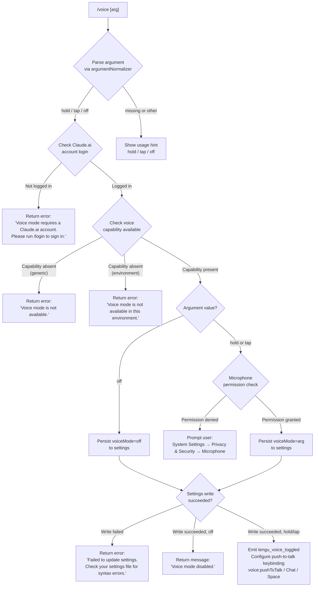

# `/voice`

> Analysis basis: CC v2.1.149 bundle.js (AST extraction + Claude interpretation)
> Minimum version: v2.1.149

---

## Overview

The `/voice` command toggles voice input mode for Claude Code, allowing users to choose between three sub-modes: `hold` (push-to-talk), `tap` (tap-to-start/stop), and `off` (disable voice). It enforces a Claude.ai account requirement and performs environment capability checks before persisting the selected mode to settings.

---

## Registration

| Field | Value |
|---|---|
| type | `local` |
| name | `voice` |
| description | `Toggle voice mode` |
| argumentHint | `[hold\|tap\|off]` |
| supportsNonInteractive | `false` |
| isHidden | `null` |
| module_id | `fl1` |
| load_inline | `true` |
| loc_byte | `12555939` |
| loc_byte_end | `12556181` |
| loc_line | `10535` |
| arbor_handler.name | `XK5` |
| arbor_handler.fqn | `claude-2.1.149::XK5` |
| arbor_handler.kind | `AsyncFunction` |
| arbor_handler.resolution_path | `module_id` |
| arbor_handler.n_hits | `1` |

Analysis basis: CC v2.1.149 bundle.js:+12555939

---

## Input Branching

The command has 5+ distinct branches based on the submode argument value, account type, and environment capability. A Mermaid flowchart is used.



Analysis basis: CC v2.1.149 bundle.js:+12553310, +12553393, +12553434, +12553533, +12553852, +12553990, +12554234, +12554741, +12555203

---

## Behavioral Spec

### 1. Argument Parsing and Validation

```
function normalizeVoiceArgument(rawArg):
    trimmed = rawArg.trim()
    if trimmed in ["hold", "tap", "off"]:
        return trimmed
    else:
        return "invalid"
```

Valid mode tokens are the literals `"hold"`, `"tap"`, and `"off"` (bundle.js:+12553310, +12553322, +12553333). If the argument trims to anything else the result is classified as `"invalid"` (bundle.js:+12553354), and the handler surfaces usage guidance rather than proceeding.

Analysis basis: CC v2.1.149 bundle.js:+12553263 (via handler `JK5` performing `.trim()`)

---

### 2. Account Requirement Check

```
function checkAccountRequirement(appState):
    authState = loadAuthState(appState)          // calls dD → ev → O1H chain
    if not authState.isClaudeAiAccount:
        return {
            type: "text",
            text: "Voice mode requires a Claude.ai account. Please run /login to sign in."
        }
    return null  // check passed
```

Voice mode is gated on a Claude.ai account (OAuth token, not bare API key). If the check fails, the command returns a `text`-type response (bundle.js:+12553421) with the login prompt message (bundle.js:+12553434) and exits immediately.

Analysis basis: CC v2.1.149 bundle.js:+12553393, +12553404

---

### 3. Environment Capability Check

```
function checkVoiceCapability(environment):
    if not voiceFeatureEnabled(environment):
        return "Voice mode is not available."
    if not environmentSupportsVoice(environment):
        return "Voice mode is not available in this environment."
    return null  // checks passed
```

Two distinct capability failure paths exist:
- **Feature-level unavailability** (bundle.js:+12553533): returns the short "not available" message.
- **Environment-level unavailability** (bundle.js:+12554234): returns the environment-specific variant.

The handler resolves the capability check by calling into `HA` → `hm` (telemetry/settings loader) to inspect the current environment profile.

Analysis basis: CC v2.1.149 bundle.js:+12553571

---

### 4. Microphone Permission Gate (hold / tap modes only)

```
function checkMicrophonePermission():
    permissionStatus = queryMicrophonePermission()
    if permissionStatus == DENIED:
        showGuidance("System Settings → Privacy & Security → Microphone")
        return false
    return true
```

When the selected mode is `hold` or `tap`, the handler checks for microphone permission before persisting. The literal `"System Settings → Privacy & Security → Microphone"` (bundle.js:+12554741) is surfaced to guide the user on macOS.

Analysis basis: CC v2.1.149 bundle.js:+12554509 (via `f` call), +12554721

---

### 5. Settings Persistence

```
async function persistVoiceMode(mode, appState):
    result = await writeSettings(appState, { voiceMode: mode })  // calls _A → settings writer chain
    if result.error:
        return {
            type: "text",
            text: "Failed to update settings. Check your settings file for syntax errors."
        }
    if mode == "off":
        return { type: "text", text: "Voice mode disabled." }
    return null  // success, proceed to keybinding registration
```

The settings write path follows: handler `XK5` → `_A` (settings writer) → `im6` (file I/O) → `UK6` (atomic write with rename). On write failure the error literal (bundle.js:+12553852) is returned. On `off`, the "Voice mode disabled." literal is returned (bundle.js:+12553990).

Analysis basis: CC v2.1.149 bundle.js:+12553754, +12553852, +12553990

---

### 6. Keybinding Registration (hold / tap modes)

```
function registerVoiceKeybinding(mode):
    binding = {
        action: "voice:pushToTalk",    // bundle.js:+12555203
        context: "Chat",               // bundle.js:+12555222
        key: "Space"                   // bundle.js:+12555229
    }
    loadKeybindingConfig()             // HX → T88 → xO6
    registerBinding(binding, mode)
```

After a successful settings write for `hold` or `tap`, the handler calls `HX` (bundle.js:+12555200) which delegates to `T88` → `xO6` to load the keybinding configuration from `keybindings.json` (bundle.js:+3776661). The action `"voice:pushToTalk"` is registered in the `"Chat"` context, bound to the `"Space"` key.

Analysis basis: CC v2.1.149 bundle.js:+12555200, +12555203, +12555222, +12555229

---

### 7. Telemetry Emission

```
function emitVoiceTelemetry(mode, previousMode, success):
    emit("tengu_voice_toggled", {
        mode: mode,
        previousMode: previousMode,
        success: success
    })
```

Immediately after the settings path completes (success or failure), a `tengu_voice_toggled` telemetry event is fired (bundle.js:+12553935) via the `c` telemetry helper.

Analysis basis: CC v2.1.149 bundle.js:+12553933

---

### 8. MCP State Sync (post-toggle)

After voice mode is persisted, the handler calls `f` → `UyH` (bundle.js:+12554509), which triggers an MCP server state refresh. This ensures any MCP servers that surface voice-related tools (e.g., `claudeai-proxy` transport, bundle.js:+10091214) are re-evaluated with the updated mode.

Analysis basis: CC v2.1.149 bundle.js:+12554509

---

## State & Side Effects

| Item | Detail |
|---|---|
| Telemetry | `tengu_voice_toggled` (bundle.js:+12553935); general feature-path events `tengu_feature_ok`, `tengu_feature_sad`, `tengu_feature_bad` via settings writer |
| Settings write | Persists `voiceMode` field in user/project settings via atomic rename pattern (UK6) |
| Keybinding registration | Registers `voice:pushToTalk` → `Space` in `Chat` context when mode is `hold` or `tap` |
| Keybinding config load | Reads `keybindings.json` from user config directory |
| MCP state sync | Triggers full MCP server refresh via `UyH` call chain |
| appState changes | Voice mode field updated; relevant UI reactive state notified via `kuH.emit` (bundle.js:+1221549) |
| Account gate | Command exits early if no Claude.ai account is detected |
| Microphone permission | Checks and potentially surfaces macOS permission guidance |
| Sound | <!-- TODO: not found in depth-2 traversal; needs --depth 4 --> |

---

## Version History

| Version | Change |
|---|---|
| v2.1.149 | Initial analysis |

---

## Common Mistakes

1. **Running `/voice` without a Claude.ai account** — the command will reject with a login prompt even if `ANTHROPIC_API_KEY` is set; an OAuth-based Claude.ai account is required.
2. **Forgetting the submode argument** — `/voice` alone without `hold`, `tap`, or `off` is not valid; the argument is required and must exactly match one of the three tokens.
3. **Expecting `/voice` to work in non-interactive mode** — `supportsNonInteractive: false` means the command is silently unavailable in `--print` / headless invocations.
4. **Settings file syntax errors** — if `settings.json` has a JSON syntax error, the toggle will fail with the parse-error message; the existing voice mode value will not change.
5. **Missing microphone permission on macOS** — selecting `hold` or `tap` mode while the Terminal/Claude Code process lacks microphone permission will stall with a guidance message rather than activating voice input.
6. **Assuming `/voice off` is a global reset** — it only persists the `voiceMode` setting; it does not revoke microphone permissions or unregister OS-level audio hooks.

---

## Appendix — Identifier Mapping

> For bundle debugging only. Identifiers change across versions.

| Identifier | Role |
|---|---|
| `XK5` | Main async handler for `/voice` command (arbor_handler) |
| `J66` | Auth state loader helper called early in handler |
| `Lt_` | Account type checker (Claude.ai vs API-key account) |
| `dD` | Settings read/write dispatcher |
| `K4` | Settings read primitive |
| `ev` | Settings environment resolver |
| `yO` | First-party auth type classifier |
| `hJ` | Settings field accessor |
| `e$` | Settings write core logic (includes API key check, error handling) |
| `O1H` | OAuth state inspector |
| `kv6` | Auth capability checker |
| `HA` | Environment/telemetry initializer called after auth check |
| `hm` | Settings loader from disk (loadSettingsFromDisk entry) |
| `DC` | Telemetry dispatcher |
| `Tq` | Performance/memory usage sampler |
| `Wl8` | Settings load completion handler |
| `V8` | Log file writer |
| `N46` | Flag/policy settings merger |
| `EZA` | Settings object key enumerator |
| `dfH` | Settings file path resolver (userSettings/projectSettings/localSettings) |
| `iF` | SDK inline settings loader |
| `WZA` | SDK settings merger |
| `rF` | Settings registry builder |
| `j_` | Utility: error type guard |
| `JK5` | Argument trimmer / mode token validator |
| `H` | General utility object (includes `Math.random`, `setTimeout`, `lstatSync`, etc.) |
| `_A` | Settings writer (persists voiceMode and related fields) |
| `o$` | Settings write pre-flight (combines dfH + rF) |
| `Pl8` | Settings pipeline assembler |
| `oX` | File read helper with encoding detection |
| `il` | File content reader with BOM stripping |
| `W3` | Filesystem stat/realpath helper |
| `N` | Path normalizer and case handler |
| `fm6` | File read with size limit |
| `j8` | Filesystem utility wrapper |
| `K8` | Generic error-code checker |
| `Ec8` | Timestamp cache setter |
| `M0H` | Settings merge helper (Fp6 + rF) |
| `Fp6` | Settings file path builder (bv.resolve based) |
| `UK6` | Atomic file writer (open → write → fsync → rename) |
| `CH` | JSON serializer wrapper |
| `CY` | Cache clear utility (clears dy6 and pS8) |
| `im6` | Async file write with gitignore awareness |
| `x6` | Async store context accessor |
| `Mm6` | AsyncLocalStorage store reader |
| `Lc8` | File format validator |
| `nm6` | Gitignore rule evaluator entry |
| `G_` | Git check-ignore runner |
| `FaK` | Global excludesfile path resolver |
| `fTA` | Git ls-files tracker checker |
| `BC` | Path joiner (.claude directory) |
| `bH` | Feature telemetry: ok path emitter |
| `_8` | Feature telemetry: sad path emitter |
| `uH` | Feature telemetry: bad path emitter |
| `RH` | Log writer with error queue |
| `c_` | Error message extractor |
| `mH` | String coercion utility |
| `G1` | Log queue flusher |
| `Z2A` | Log message formatter |
| `uiK` | Circular log buffer manager |
| `f` | MCP state sync dispatcher |
| `UyH` | MCP server state refresh orchestrator |
| `j6H` | MCP server config processor |
| `Rj6` | MCP server entry validator |
| `G4H` | MCP server config builder |
| `w6H` | MCP SDK server loader |
| `Sj6` | MCP server deduplication handler |
| `bN` | MCP server capability merger |
| `HO` | MCP server display formatter |
| `t8` | Settings snapshot reader |
| `HE6` | MCP health evaluator |
| `vkL` | MCP needs-auth cache reader |
| `vF_` | Cache file path builder |
| `y78` | MCP tool schema resolver |
| `h78` | MCP tool hash generator |
| `JX` | SHA-256 hash helper |
| `k78` | MCP tool fingerprint builder |
| `FK` | Tool identifier hasher |
| `z8` | MCP debug logger |
| `hB_` | MCP server connection manager |
| `SNL` | MCP server SSH environment checker |
| `nF` | MCP notification forwarder |
| `f_H` | MCP OAuth flow handler (full) |
| `jtH` | MCP connection state tracker |
| `D` | Background session spare-pool manager |
| `s28` | Cache path constructor |
| `Dc` | MCP reconnect logic |
| `ym` | Notification dispatcher |
| `Y` | Background session writer |
| `CL` | MCP error logger |
| `EH` | Error string extractor |
| `RNL` | MCP reconnect result classifier |
| `hNL` | SSH environment voice/MCP checker |
| `SB_` | MCP complete-authentication tool handler |
| `wtH` | Connection pending state reader |
| `JtH` | Connection cache reader |
| `IY1` | MCP needs-auth cache writer |
| `A1` | Request context store reader |
| `EW8` | Cache file path joiner |
| `kB_` | MCP hash+fingerprint+debug logger |
| `lT_` | MCP transport type classifier |
| `f8` | Global config loader (saveGlobalConfig) |
| `ZY1` | MCP tool schema validator |
| `li` | Async iterator utility |
| `_E6` | Integer parser (radix-10) |
| `NF_` | Integer parser variant |
| `QDK` | MCP update applier |
| `ZW8` | MCP update serializer |
| `OI` | MCP server cleanup orchestrator |
| `ytH` | MCP server state serializer |
| `$` | Background daemon status inspector |
| `_Q1` | Daemon status file reader |
| `Pn` | Daemon PID resolver |
| `$v6` | Daemon status file path builder |
| `nv5` | MCP remote server retry manager |
| `R78` | MCP server suppression checker |
| `r8` | MCP server timeout wrapper |
| `HX` | Keybinding config loader (voice keybinding entry) |
| `T88` | Keybinding file reader |
| `xO6` | Keybinding config parser |
| `hz_` | Keybinding default config builder |
| `kp` | Keybinding customization release telemetry emitter |
| `MKH` | Keybinding file path builder |
| `g6` | JSON.parse wrapper |
| `P88` | Keybinding block structure validator |
| `j88` | Keybinding entry extractor |
| `qc9` | Custom keybinding loaded telemetry emitter |
| `kz_` | Duplicate key detector in keybinding context |
| `yz_` | Keybinding action normalizer |
| `E88` | Keybinding action-not-found fallback handler |
| `xz_` | Keybinding fallback resolver |
| `bz_` | Keybinding fallback telemetry emitter |
| `Fe` | Keybinding action mapper |
| `YCH` | Language/locale detector |
| `m6` | Config file watcher and reader |
| `JOH` | Config file reader with backup support |
| `xC` | Config path prefix stripper |
| `mb9` | Config backup directory scanner |
| `Of_` | Config path joiner |
| `w` | Background worker process manager |
| `C` | Child process spawner with signal handling |
| `Kv8` | macOS memory limit checker |
| `Oz6` | Roster file reader |
| `g` | Background session lifecycle manager |
| `V6` | Background session state loader |
| `yqA` | IPC socket connection manager |
| `uqA` | Background session cleanup handler |
| `Et4` | File watcher registration helper |
| `rn` | File change event emitter |
| `a9` | Worker restart registrar |