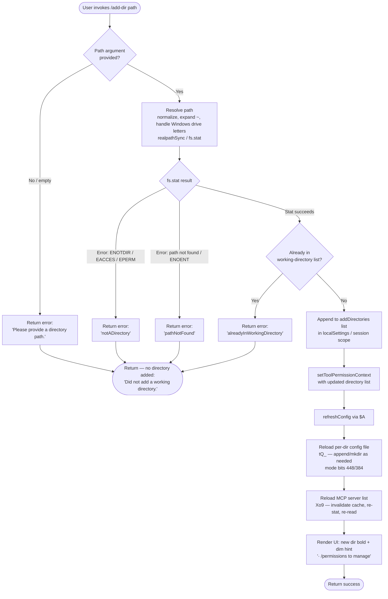

# `/add-dir`

> Analysis basis: CC v2.1.149 bundle.js (AST extraction + Claude interpretation)
> Minimum version: v2.1.149

---

## Overview

`/add-dir` registers an additional working directory for the current Claude Code session. The command validates the supplied path (resolving home-directory shortcuts, symlinks, and platform quirks), checks that it is an accessible directory not already tracked, then appends it to the session's working-directory list and refreshes all dependent configuration — including tool-permission context, MCP servers, and the persistent per-directory log file.

---

## Registration

| Field | Value |
|---|---|
| type | `local-jsx` |
| name | `add-dir` |
| description | Add a new working directory |
| argumentHint | `<path>` |
| module_id | `kP1` |
| load_inline | `true` |
| loc_byte | `10592040` |
| loc_byte_end | `10592188` |
| loc_line | `8314` |
| arbor_handler.name | `WxL` |
| arbor_handler.fqn | `claude-2.1.149::WxL` |
| arbor_handler.kind | `AsyncFunction` |
| arbor_handler.resolution_path | `module_id` |
| arbor_handler.n_hits | `0` |

Analysis basis: CC v2.1.149 bundle.js:+10592040

---

## Input Branching

The command has four or more distinct outcome branches (empty path, not-a-directory, inaccessible/not-found, already tracked, success), so a Mermaid flowchart is used.



Analysis basis: CC v2.1.149 bundle.js:+10590821 (handler entry `WxL`), +3752939 (empty-path sentinel), +3753037 (notADirectory), +3753182 (pathNotFound), +3753293 (alreadyInWorkingDirectory), +3753369 (success)

---

## Behavioral Spec

### 1. Handler Entry Point (`WxL`)

```
async function addDirHandler(args, appContext):
    rawPath = args[0]

    // Step 1 — resolve and validate path
    result = validateAndResolvePath(rawPath, appContext)   // mgH

    if result.kind == "emptyPath":
        display("Please provide a directory path.")
        return "Did not add a working directory."

    if result.kind in ["notADirectory", "pathNotFound"]:
        display(errorMessageFor(result.kind))
        return "Did not add a working directory."

    if result.kind == "alreadyInWorkingDirectory":
        display(errorMessageFor(result.kind))
        return "Did not add a working directory."

    resolvedPath = result.path

    // Step 2 — persist new directory in app state
    appState = getAppState()                              // S_
    appState.localSettings.addDirectories.push(resolvedPath)   // literal "addDirectories" / "localSettings"

    // Step 3 — update permission context for the session
    setToolPermissionContext(appContext, {scope: "session"})    // _.setToolPermissionContext, literals "session"

    // Step 4 — apply per-directory permission rules
    applyPermissionRules(appContext)                      // Vf

    // Step 5 — check --add-dir CLI flag consistency
    verifyAddDirFlag(resolvedPath)                        // Y.includes, literal "--add-dir"

    // Step 6 — emit post-add actions
    postAddActions(appContext)                            // EA6

    // Step 7 — refresh global config
    appContext.refreshConfig()                            // $A.refreshConfig

    // Step 8 — reload per-directory config file
    reloadPerDirConfig(resolvedPath)                      // tQ_

    // Step 9 — reload MCP server state
    reloadMcpServers(resolvedPath)                        // Xo9

    // Step 10 — render result UI
    renderSuccessUI(resolvedPath, appContext)              // NHH, pgH

    return "success"
```

Analysis basis: CC v2.1.149 bundle.js:+10590821–+10591617

---

### 2. Path Resolution (`mgH` → `P9`)

```
async function validateAndResolvePath(rawPath, appContext):
    if rawPath is null or rawPath.trim() == "":
        return {kind: "emptyPath"}

    // resolve Promise (O88.resolve) then stat
    stat = await fs.stat(resolvedCanonical)               // cd9.stat

    if stat error:
        code = error.code
        if code in ["ENOTDIR", "EACCES", "EPERM"]:
            return {kind: "notADirectory"}
        else:
            return {kind: "pathNotFound"}

    canonicalPath = normalizePath(rawPath)                // P9, XS

    if canonicalPath already in currentWorkingDirs:
        return {kind: "alreadyInWorkingDirectory"}

    return {kind: "success", path: canonicalPath}
```

Sub-function `normalizePath` (`P9`):
```
function normalizePath(raw):
    trimmed = raw.trim()
    if trimmed contains null bytes:
        throw TypeError("Path contains null bytes")
    normalized = path.normalize(trimmed)                  // Iv.normalize
    if normalized starts with "~/":
        base = os.homedir()                               // Wm6.homedir
        normalized = path.join(base, normalized.slice(2)) // Iv.join, q.slice
    if platform is "windows":
        // apply Windows drive-letter regex match         // q.match
    if not path.isAbsolute(normalized):
        normalized = path.resolve(normalized)             // Iv.resolve
    // macOS /var/ → /tmp normalisation
    normalized = normalized.replace("/var/", "/tmp$1")    // XS, literal "/var/" → "/tmp$1"
    return normalized
```

Analysis basis: CC v2.1.149 bundle.js:+3752958 (`mgH`), +1004679 (`P9`), +3753100 (`K8` error branch), +3753127 (ENOTDIR), +3753142 (EACCES), +3753156 (EPERM), +3753182 (pathNotFound), +3753293 (alreadyInWorkingDirectory), +1004932 (null bytes error), +1004988 (Iv.normalize), +1005039 (homedir), +1005086 ("~/"), +1005168 (windows), +12824136 (/var/), +12824177 (/tmp$1)

---

### 3. App-State Retrieval (`S_` / `v08`)

```
function getSessionAppState(context):
    state = context.getAppState()                         // H.getAppState
    filtered = applyStateFilter(state, {
        allowed_tools: ...,                               // literal "allowed_tools"
        avoid_prompts: ...,                               // literal "avoid_prompts"
        effort:        ...,                               // literal "effort"
        model:         ...                                // literal "model"
    })                                                    // v08 / L9
    return filtered
```

Analysis basis: CC v2.1.149 bundle.js:+10589432, +10589540, +10589558, +10589595, +10589697, +10589710, +10583674

---

### 4. Permission-Rule Application (`Vf`)

```
function applyPermissionRules(context):
    // Validate bypass-permissions mode request
    if requestedMode == "bypassPermissions" and modeNotAvailable:
        log("Ignoring permission update: setMode 'bypassPermissions' rejected…")
        // literal at +4634109

    // Merge allow / deny / ask rule sets
    for each ruleSet in [addRules, replaceRules, removeRules]:     // literals +4634385, +4634733, +4635390
        applyToContext(ruleSet, {
            allow: "alwaysAllowRules",                    // +4634578
            deny:  "alwaysDenyRules",                     // +4634617
            ask:   "alwaysDenyRules" / "alwaysAskRules"   // +4634635
        })

    removeDirectories(context)                            // literal "removeDirectories" +4635774
    context.permissions.filter(...)                       // K.filter, L.has, A.delete
```

Analysis basis: CC v2.1.149 bundle.js:+4634107 (`Vf` entry), +4634021 (setMode), +4634043 (bypassPermissions), +4634109 (rejection message), +4634570 (allow), +4634610 (deny)

---

### 5. Per-Directory Config File Reload (`tQ_`)

```
async function reloadPerDirConfig(dirPath):
    env = detectEnvironment()                             // _PH
    if env == "production":
        // perform real FS operations
    elif env == "test":
        // use test stubs                                 // literals +12756106, +12756203

    canonical = await fs.realpath(dirPath)                // A7.realpath
    canonical = canonical.normalize("NFC")                // literal +12756467

    configDir  = path.dirname(configPath)                 // zj.dirname
    configPath = path.join(configDir, ...)                // zj.join

    if configDir does not exist:
        await fs.mkdir(configDir, {mode: 448})            // A7.mkdir, literal 448 at +12756783
    await fs.appendFile(configPath, "", {
        encoding: "utf8",
        mode: 384                                         // literals +12756659, +12756850
    })

    content = await fs.readFile(configPath, "utf8")       // A7.readFile
    logError if needed                                    // RH → ll.logError
```

Analysis basis: CC v2.1.149 bundle.js:+12756407 (`tQ_`), +12756441 (realpath), +12756467 (NFC), +12756741 (mkdir), +12756783 (mode 448), +12756822 (appendFile), +12756850 (mode 384), +12756659 (utf8)

---

### 6. MCP Server Reload (`Xo9` / `cq`)

```
async function reloadMcpServers(dirPath):
    // Invalidate cached server state
    invalidateMcpCache()                                  // Uw → XzH.delete

    // Re-read server config files in parallel
    servers = await reloadServerConfigs(dirPath)          // cq

    for each serverConfig in servers:
        stat  = await fs.stat(serverConfigPath)           // vP.stat
        bytes = await fs.readFile(serverConfigPath)       // vP.readFile
        parsed = parseJson(bytes)                         // g6 → JSON.parse

        key = path.join(dirPath, path.basename(...))      // NP.join, NP.basename
        if Number.isFinite(orderValue):
            serverCache.set(key, parsed)                  // XzH.set, XzH.get
        else:
            serverCache.clear()                           // XzH.clear

    // Atomic config write
    atomicWriteConfig(...)                                // x5 → SO
        // SO: L__.randomBytes → Nt.writeFile → Nt.rename
        //     may copy (Nt.copyFile) or unlink (Nt.unlink)
```

Analysis basis: CC v2.1.149 bundle.js:+4066262 (`Xo9`/`Uw`), +4062934 (`cq`/NP.join), +4063019 (Promise.all), +4063032 (vP.stat), +4063418 (readFile), +4063523 (V37), +4063684 (XzH.set), +4063796 (Number.isFinite), +4063901 (XzH.clear), +2220980 (randomBytes), +2221027 (writeFile), +2221080 (rename)

---

### 7. Result UI Rendering (`NHH` / `pgH`)

```
function renderAddDirResult(resolvedPath, context):
    // Build directory-listing component
    dirList = buildDirectoryList(context)                 // d6q, wY6, DJ7
    // Each entry: lstat → check FIFO/socket/char/block device → realpathSync
    // (W3 at +183783)

    // Render success panel with bold path and dim hint
    display(
        bold(resolvedPath),                               // j6.bold at +10591093
        dim("· /permissions to manage")                   // j6.dim at +10591379, literal +10591386
    )

    // Render parent-dir footer
    renderFooter(path.dirname(resolvedPath))              // pgH → O88.dirname at +3753590, j6.bold at +3753522

    if error occurred during any step:
        display("Unknown error")                          // literal +10591278
        return "Did not add a working directory."         // literal +10591522
```

Analysis basis: CC v2.1.149 bundle.js:+10591075 (`NHH`), +10591093 (bold), +10591379 (dim), +10591386 ("/permissions to manage"), +10591522 ("Did not add a working directory."), +10591617 (`pgH`), +3753522 (pgH bold), +3753590 (pgH dirname)

---

## State & Side Effects

| Item | Detail |
|---|---|
| Telemetry | `tengu_daemon_config_reload` (bundle.js:+15275522) — fired when the daemon reloads configuration after the directory is added |
| appState changes | `localSettings.addDirectories` array extended with the resolved path (literal `"addDirectories"` at +10590857; `"localSettings"` at +10590904) |
| Session scope | Tool-permission context updated under `"session"` scope (literal +10590920) |
| Permission rules | `alwaysAllowRules`, `alwaysDenyRules`, `alwaysAskRules` re-evaluated and merged (literals +4634578, +4634617, +4634635) |
| Config file | Per-directory config file created (mkdir mode `448`) and/or appended (appendFile mode `384`); path normalized to NFC Unicode form (literals +12756783, +12756850, +12756467) |
| MCP server cache | `XzH` map cleared/updated; atomic rename-based write for server config (SO: randomBytes → writeFile → rename) |
| Config refresh | `$A.refreshConfig()` called after state update (bundle.js:+10591015) |
| CLI flag | `--add-dir` flag consistency checked against new directory list (literal +10591045) |
| Sound | <!-- TODO: not found in depth-2 traversal; needs --depth 4 --> |
| Hook registration | `W7A.register` called inside `a9` (bundle.js:+58272) — likely a file-watcher hook for the new directory |

---

## Version History

| Version | Change |
|---|---|
| v2.1.149 | Initial analysis |

---

## Common Mistakes

1. **Relative paths not resolved**: Passing a relative path like `../sibling` works — the handler calls `path.resolve()` — but the stored path is always absolute. Expect the stored value to differ from what was typed.
2. **Home-directory shorthand**: `~/projects/foo` is supported through explicit `os.homedir()` expansion, but only the `~/` prefix is handled. Paths like `~user/foo` are not expanded and will likely fail path resolution.
3. **macOS `/var/` symlink**: On macOS, `/var/` is internally rewritten to `/private/tmp` (via the `/var/` → `/tmp$1` substitution). Comparing the stored path against what `pwd` returns may show a mismatch.
4. **Already-added directory**: Re-running `/add-dir` on a path already in the working-directory list silently returns `"alreadyInWorkingDirectory"` and displays an error rather than a no-op success. Check `localSettings.addDirectories` before calling.
5. **Bypassing permission mode**: If `disableBypassPermissionsMode` is set or the session was not launched in `bypassPermissions` mode, any permission-rule update that requests that mode is silently dropped with only an internal log message (literal at +4634109). The directory is still added.
6. **MCP cache invalidation**: Adding a directory triggers a full MCP server cache invalidation and reload. In projects with many MCP servers this may cause a brief re-connection delay.

---

## Appendix — Identifier Mapping

> For bundle debugging only. Identifiers change across versions.

| Identifier | Role |
|---|---|
| `WxL` | Main async handler for `/add-dir` (arbor_handler; AsyncFunction) |
| `S_` | Session app-state retrieval helper |
| `v08` | App-state filter / projection function |
| `L9` | Inner app-state field extractor |
| `Vf` | Permission-rule application / merge function |
| `N` | General-purpose permission rule processor |
| `MVK` | Rule-set transformation helper |
| `T7A` | Rule token parser helper |
| `CH` | JSON serialisation utility (wraps JSON.stringify) |
| `X4` | Path-string formatting / redaction helper |
| `s5A` | Path component mapper |
| `HbH` | File-write wrapper |
| `B5A` | Low-level handle.write helper |
| `OVK` | Config-file write orchestrator |
| `ICH` | Async write-queue / debounce scheduler |
| `q9H` | Config path join / integrity helper |
| `Q6` | Path existence / accessibility checker |
| `G96` | File-hash / checksum helper |
| `LMA` | Config path constructor (path.join + S6) |
| `KMA` | Atomic file rotate helper (stat / rename / unlink) |
| `$VK` | Async config-append worker (mkdir + appendFile) |
| `a9` | File-watcher hook registrar (W7A.register) |
| `iM` | String escape / backslash normaliser (BsK) |
| `BsK` | replaceAll-based string escaper |
| `FI` | CLI-flag lookup helper |
| `Y` | Supervisor / daemon restart manager |
| `tXH` | Daemon config reload implementation (reads ENOENT, K8, etc.) |
| `A1` | AsyncLocalStorage store accessor |
| `K8` | Error-code classifier |
| `ts_` | Config-file state tracker |
| `EH` | String coercion wrapper |
| `kc1` | Key-width calculation (Math.max over Object.keys) |
| `G` | Supervisor process controller (preventDefault + FW) |
| `FW` | Config-write orchestrator called by supervisor |
| `_A` | Full config persistence function (reads/writes all settings layers) |
| `Z` | Daemon lifecycle manager (stop / updateConfig / start) |
| `AXK` | Heartbeat emitter (Je) |
| `Je` | Heartbeat payload builder |
| `EA6` | Post-add-directory action dispatcher |
| `tQ_` | Per-directory config file loader / creator |
| `_PH` | Environment detector (production / test) |
| `mH` | String normaliser (String constructor wrapper) |
| `ni1` | Config path normaliser |
| `jC` | Config validation helper |
| `j8` | Error-code / classification wrapper (→ K8) |
| `Wh` | Async utility (→ Dv) |
| `Dv` | Promise resolution helper |
| `j_` | Deferred / promise utility (→ Dv) |
| `RH` | Error logger / reporter (→ ll.logError) |
| `c_` | Error string formatter |
| `G1` | Log-record builder (→ Z2A) |
| `Z2A` | Log-entry formatter |
| `uiK` | Circular log-buffer manager (shift/push on Hm6) |
| `Xo9` | MCP server reload orchestrator |
| `Uw` | MCP cache invalidator (XzH.delete) |
| `cq` | MCP server config reader (stat + readFile + parse) |
| `g6` | Safe JSON parser (JSON.parse) |
| `x5` | Atomic config writer (→ SO) |
| `SO` | Atomic file write implementation (randomBytes + writeFile + rename) |
| `NHH` | Result UI renderer (directory list + success/error display) |
| `OJ_` | Directory-list component builder |
| `d6q` | Full directory-entry renderer |
| `wY6` | Directory metadata gatherer (→ p8) |
| `p8` | Path resolution for display (gp6 + rF) |
| `DJ7` | Single directory entry formatter (lstat, realpathSync, device-type checks) |
| `o$` | Path display formatter (dfH + rF) |
| `W3` | File-type inspector (lstatSync + isFIFO/isSocket/isCharacterDevice/isBlockDevice/realpathSync) |
| `oX` | Path indentation / alignment helper (→ il) |
| `JJ7` | Directory-entry annotation helper |
| `Xz` | Markdown / display string formatter (gsK, zZ, QsK, FsK) |
| `gsK` | Markdown token extractor |
| `zZ` | Object.hasOwn-based property guard |
| `QsK` | Display substring helper |
| `FsK` | replaceAll-based display escaper |
| `f` | MCP server state map accessor (UyH, QDK, nv5) |
| `UyH` | MCP server connection handler (connects stdio/sse/http/ws-ide transport types) |
| `QDK` | MCP server update applier (applyMcpUpdate, cleanup) |
| `nv5` | MCP server retry / refresh orchestrator |
| `mgH` | Path validation + stat entry point |
| `P9` | Path normalisation (tilde, Windows, null-byte check, path.resolve) |
| `x6` | Context store accessor (→ Mm6) |
| `Mm6` | AsyncLocalStorage context reader (Lm6.getStore) |
| `Si` | Deferred promise helper (→ j_) |
| `XS` | Platform path normaliser (/var/ → /tmp substitution) |
| `X0` | Case-normaliser (toLowerCase) |
| `xe_` | Path suffix / extension helper (a6, j2) |
| `ps` | Path-segment utility |
| `pgH` | Footer renderer (bold path + dirname) |

---

Note: index built via Arbor fallback; some signals (telemetry, literals) may be missing — see arbor-fallback.js.