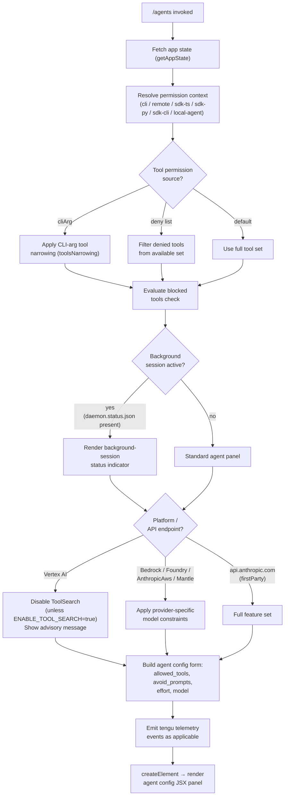

# `/agents`

> Analysis basis: CC v2.1.144 bundle.js (AST extraction + Claude interpretation)
> Minimum version: v2.1.144

---

## Overview

The `/agents` command provides an interactive UI panel for managing agent configurations within Claude Code. It renders a JSX component that exposes controls for agent profiles, tool permissions, model selection, and related session-level settings. The command bridges the application state layer with a dedicated agent-configuration surface, applying permission narrowing and background-session awareness before rendering.

---

## Registration

| Field | Value |
|---|---|
| type | `local-jsx` |
| name | `agents` |
| description | `Manage agent configurations` |
| loc_byte | `11591160` |
| loc_byte_end | `11591285` |
| loc_line | `7202` |
| module_id | `tGq` |
| load_inline | `true` |
| arbor_handler.name | `hy7` |
| arbor_handler.fqn | `claude-2.1.144::hy7` |
| arbor_handler.kind | `AsyncFunction` |
| arbor_handler.resolution_path | `module_id` |
| arbor_handler.n_hits | `0` |

Analysis basis: CC v2.1.144 bundle.js:+11591160

---

## Input Branching

The command exercises five or more distinct branches across app-state inspection, permission narrowing, tool-set filtering, background-session detection, and platform gating. A flowchart is required.



Analysis basis: CC v2.1.144 bundle.js:+11591002 (handler entry `hy7`), +10049670 (app state), +9772376 (cliArg/toolsNarrowing), +8991849 (blocked), +14577350 (background session), +9397340 (Vertex ToolSearch advisory), +11591015 (createElement)

---

## Behavioral Spec

### 1. Handler Entry — Async Agent Panel Loader

The top-level handler (`hy7`) is an `AsyncFunction`. It calls the app-state accessor and the main component builder in sequence before delegating to `createElement` to produce the renderable JSX node.

```
async function agentsPanelHandler(context):
    appState   = await fetchAppState(context)          // y_  → H.getAppState
    agentComp  = buildAgentComponent(appState)         // mZ
    return createElement(agentComp, props)             // DF_.createElement
```

Analysis basis: CC v2.1.144 bundle.js:+11590994, +11591002, +11591015

---

### 2. App-State Retrieval (`y_`)

Calls `getAppState` on the shared application-state object and then reads the `allowed_tools`, `avoid_prompts`, `effort`, and `model` fields from the result. A constant `0` sentinel is used during early-access guarding.

```
function resolveAppState(context):
    state = appStateHolder.getAppState()             // H.getAppState
    if state is uninitialized (sentinel 0):
        return earlyExitValue                        // Y1 via Xb_
    return {
        allowedTools : state["allowed_tools"],       // literal @ +10049778
        avoidPrompts : state["avoid_prompts"],       // literal @ +10049833
        effort       : state["effort"],              // literal @ +10049935
        model        : state["model"]                // literal @ +10049948
    }
```

Analysis basis: CC v2.1.144 bundle.js:+10049670, +10049778, +10049833, +10049935, +10049948, +10043689

---

### 3. Component Builder — `mZ`

`mZ` is the central assembly function. It orchestrates permission resolution, tool-set computation, platform checks, and background-session detection before constructing the final prop tree passed to the JSX renderer.

```
function buildAgentComponent(appState):
    permCtx      = resolvePermissionContext(appState)   // hX  → PF, Cq, P6
    toolSet      = computeToolSet(appState)             // _6H → iX6, XLH, iR_
    permBundle   = buildPermissionBundle(appState)      // Pk_ → su, UnH, t_
    configFields = buildConfigFields(appState)          // XK  → c6, p_H
    agentLayout  = buildAgentLayout(appState,           // K6H
                       permBundle, configFields,
                       toolSet, permCtx)
    featureFlags = checkFeatureFlags(appState)          // Eq.isEnabled, O.isEnabled
    filteredTools = filterToolsByFlags(toolSet,         // K.filter, K.map
                        featureFlags,
                        hpH set membership)
    providerCtx  = detectProviderContext()              // $.includes, NVq, Qa, CH
    return assemble(agentLayout, filteredTools,
                    providerCtx, featureFlags)
```

Analysis basis: CC v2.1.144 bundle.js:+8992436, +8992475, +8992507, +8992532, +8992544, +8992632, +8992651, +8992679, +8992691, +8992702, +8992778, +8992793, +8992821, +8992832, +8992874, +8992919

---

### 4. Permission Context Resolution (`hX` / `P6`)

Determines whether the current invocation context is `cli` or `remote`, then narrows by SDK type (`sdk-ts`, `sdk-py`, `sdk-cli`, `local-agent`). Fires the `tengu_slate_harbor` telemetry event. Uses a registry (`T$H`, `m1_`, `K56`, `vF`) to cache and deduplicate context entries.

```
function resolvePermissionContext(appState):
    source = readContextSource(appState)            // xH, Cq
    // source ∈ {"cli", "remote"}                  // literals @ +3197102, +3197113
    sdkType = readSdkType(appState)
    // sdkType ∈ {"sdk-ts","sdk-py","sdk-cli",
    //             "local-agent"}                  // literals @ +3197359–3197402

    emit("tengu_slate_harbor")                      // @ +3197132

    if T$H registry does not have entry:
        entry = buildNewEntry(source, sdkType)      // Vr6 → m1_.has/get/add, u1_, F1_
        K56.add(entry)
    else:
        entry = vF.get(cached key)
    return deduplicatedEntry via y6(m6, C0, t1_,
                                    V$H, Date.now, fCL)
```

Analysis basis: CC v2.1.144 bundle.js:+3196950, +3196967, +3197012, +3197102, +3197113, +3197129, +3197132, +3142150–3142275, +3144509–3144672, +3163715–3163857

---

### 5. Tool-Set Computation (`_6H` / `iX6`)

Filters the global tool array, then calls the tool-expansion helper which performs a `flatMap` across tool descriptors and constructs deny-list entries. A secondary path (`iR_`) reads `Op8`, `h16`, and `Fy` to resolve nested tool metadata. The `cliArg` and `toolsNarrowing` source strings control which narrowing path is taken.

```
function computeToolSet(appState):
    baseTools = globalTools.filter(predicate)       // H.filter @ +8991788
    expanded  = expandTools(baseTools)              // iX6 → XLH, iR_, VAq
        // XLH: flatMap over yD8, passing jO
        // iR_: resolves Op8 / h16 / Fy for each tool
        // VAq: post-processes expansion result

    // Narrowing source strings:
    //   "cliArg"         @ +9772376
    //   "toolsNarrowing" @ +9772397
    //   "deny"           @ +9771790

    if source == "cliArg":
        apply cliArg narrowing
    else if source == "toolsNarrowing":
        apply policy narrowing
    mark any blocked tools with status "blocked"    // literal @ +8991849
    return expanded tool set
```

Analysis basis: CC v2.1.144 bundle.js:+8991788, +8991803, +9772376, +9772397, +9771790, +9771713, +9771807, +9772439, +9772456, +8991849

---

### 6. Permission Bundle Construction (`Pk_` / `su`)

Builds the permission data bundle attached to agent props. Sets platform-specific defaults (e.g., `windows` sentinel for path handling). Fires `tengu_cobalt_ridge`. Delegates to `t_` for module-export wiring (`gjH`, `xZ8`, `hV6`, `RV6`, `F1K`, `Ls_.set`).

```
function buildPermissionBundle(appState):
    platform = readPlatform()           // "windows" sentinel @ +3198432
    basePermissions = readBase(appState)    // c6
    canonicalized = normalizeIds(basePermissions)   // xH, Cq
    p_H applied for provider gating
    emit("tengu_cobalt_ridge")          // @ +3198526
    permissionRecord = buildRecord(basePermissions,
                                   canonicalized,
                                   P6 context)
    wire module exports via moduleWirer(permissionRecord)  // t_
    return permissionRecord
```

Analysis basis: CC v2.1.144 bundle.js:+8992363, +3198425, +3198432, +3198449, +3198458, +3198494, +3198523, +3198526, +1500–1692

---

### 7. Agent Layout Assembly (`K6H`)

The most complex sub-function. Integrates config fields, agent-teams flag (`--agent-teams` CLI argument), permission context, blocked-tool info, and provider identifiers. Also fires `tengu_amber_flint`.

```
function buildAgentLayout(appState, permBundle,
                           configFields, toolSet,
                           permCtx):
    configBlock = buildConfigBlock(appState)    // XK → c6, p_H
    idBlock     = resolveAgentIds(appState)     // $Y → xH
    providerTag = resolveProviderTag(appState)  // OD → Cq
    nameTag     = canonicalizeName(appState)    // xH @ +8991394

    // --agent-teams CLI argument gating
    // literal "--agent-teams" @ +5282059
    agentTeamsEnabled = aiH check
    if agentTeamsEnabled:
        teamConfig = buildTeamConfig()          // M9 → xH, k34, P6
        emit("tengu_amber_flint")               // @ +5282171

    // Effort / model controls
    effortControl = buildEffortControl()        // C87 → Lo9, t_
    modelControl  = buildModelControl()         // h87 → Br9, t_
    resetControl  = buildResetControl()         // R87 → lr9, t_

    // Tool-search / provider feature gating
    toolSearchPanel = buildToolSearchPanel()    // Kh → US_, v, JA, i5
        // US_: standard / tst / tst-auto modes
        //      numeric threshold 100 @ +9396418
        //      "standard"  @ +9396326
        //      "tst"       @ +9396405
        //      "tst-auto"  @ +9396455
        // v:   debug flag @ +201277
        //      H.includes, CH, x4, sv, YhH, yfK
        // JA:  provider checks → xH
        //      "bedrock"      @ +2021996
        //      "foundry"      @ +2022046
        //      "anthropicAws" @ +2022102
        //      "mantle"       @ +2022156
        //      "vertex"       @ +2022204
        //      "firstParty"   @ +2022213
        //      "api.anthropic.com" @ +2022902

    // Vertex advisory: disable ToolSearch unless override
    // "[ToolSearch:optimistic] disabled: Vertex AI does not
    //   accept the tool-search beta header. Set
    //   ENABLE_TOOL_SEARCH=true to override."    @ +9397340

    layoutProps = assembleProps(configBlock, idBlock,
                                providerTag, nameTag,
                                agentTeamsEnabled, teamConfig,
                                effortControl, modelControl,
                                resetControl, toolSearchPanel,
                                permBundle, toolSet, permCtx)
    return layoutProps
```

Analysis basis: CC v2.1.144 bundle.js:+8991164, +8991180, +8991301, +8991394, +8991465, +8991484, +8991525, +8991531, +8991537, +8991676, +8991717, +8991744, +5282059, +5282171, +9396265–9396490, +9396804–9397018, +2021996–2022902, +9397340

---

### 8. Background-Session Detection

Reads `daemon.status.json` to determine whether a background session is active. If the session status equals `"stopped"`, a `"background session"` label is rendered alongside session metadata. Uses `Math.random` for a jitter component in the polling loop (`setTimeout`).

```
function detectBackgroundSession():
    statusPath = resolveStatusFile("daemon.status.json")  // @ +11730149
    sessionData = readStatusStore(statusPath)             // SG6 → vVq.join, n8
    timestamp = Date.now()                                // @ +11730261
    apiContext = buildApiContext()                        // Qa → wMH
    serialized = serializeContext(apiContext)             // CH → JSON.stringify

    if sessionData.status == "stopped":                   // @ +14577307
        label = "background session"                      // @ +14577350
    return { label, sessionData, timestamp }
```

```
function pollSessionStatus():
    delay = Math.random() * 2 + 1   // literals 2 @ +12668349, 1 @ +12668365
    setTimeout(pollSessionStatus, delay * unit)
```

Analysis basis: CC v2.1.144 bundle.js:+11730149, +11730135, +11730144, +11730246, +11730261, +11730293, +11730310, +11730316, +14577307, +14577350, +12668349, +12668365, +12668351, +12668388

---

### 9. Provider / API-Endpoint Checks

Identifies the active API provider by string-matching against a known-provider list. Results feed directly into feature-flag gating (ToolSearch, model picker, agent-teams).

```
function detectProviderContext():
    providers = ["bedrock", "foundry", "anthropicAws",
                 "mantle", "vertex", "firstParty"]
    endpoint  = readCurrentEndpoint()     // "api.anthropic.com" @ +2022902
    for p in providers:
        if activeConfig.includes(p):      // $.includes @ +8992919
            return p
    return "firstParty"
```

Analysis basis: CC v2.1.144 bundle.js:+2021996, +2022046, +2022102, +2022156, +2022204, +2022213, +2022902, +8992919

---

### 10. Feature-Flag Evaluation

Two independent feature-flag helpers are consulted. One (`Eq.isEnabled`) gates higher-level agent features; the other (`O.isEnabled`, delegating to `k8`) gates background-session display. Results filter the tool list and toggle UI sections.

```
function evaluateFeatureFlags(toolSet):
    flagA = FeatureFlagRegistry.isEnabled(flagKeyA)    // Eq.isEnabled @ +8992702
    flagB = BackgroundFlagRegistry.isEnabled(flagKeyB) // O.isEnabled  @ +8992832
                                                       // O → k8 @ +14577345
    filtered = toolSet
        .filter(t => !blockedSet.has(t))               // K.filter @ +8992778
                                                       // hpH.has   @ +8992793
        .map(t => enrichToolEntry(t))                  // K.map    @ +8992821
    return { flagA, flagB, filtered }
```

Analysis basis: CC v2.1.144 bundle.js:+8992702, +8992778, +8992793, +8992821, +8992832, +14577345

---

### 11. String / Boolean Normalisation Helpers

Several helpers normalize string-encoded booleans and identifier strings throughout the pipeline.

```
function normalizeBooleanString(val):
    // Truthy tokens:  "yes", "on"    @ +26422, +26428
    // Falsy  tokens:  "no",  "off"   @ +26573, +26578
    if val.toLowerCase() in {"yes", "on"}:  return true
    if val.toLowerCase() in {"no",  "off"}: return false
    return null

function normalizeIdentString(val):
    return String(val)   // xH → String @ +26373; Cq → String @ +26523
```

Analysis basis: CC v2.1.144 bundle.js:+26373, +26422, +26428, +26523, +26573, +26578

---

## State & Side Effects

| Item | Detail |
|---|---|
| Telemetry — `tengu_slate_harbor` | Fired during permission-context resolution (`hX` / `P6`); records cli/remote + SDK-type context. Analysis basis: bundle.js:+3197132 |
| Telemetry — `tengu_cobalt_ridge` | Fired during permission-bundle construction (`su`); records platform + permission record shape. Analysis basis: bundle.js:+3198526 |
| Telemetry — `tengu_amber_flint` | Fired when `--agent-teams` flag is active during layout assembly (`M9`). Analysis basis: bundle.js:+5282171 |
| App-state reads | `allowed_tools`, `avoid_prompts`, `effort`, `model` read from shared app state via `getAppState`. |
| Registry mutations | `T$H`, `m1_`, `K56`, `vF` caches updated during permission deduplication (`Vr6`). |
| Module-export wiring | `Ls_.set` called during permission-bundle build (`t_`); side-effects the module-exports map. |
| Background-session poll | `setTimeout` + `Math.random` jitter drives a daemon-status polling loop; reads `daemon.status.json`. |
| Tool-list mutations | `m1_.add`, `K56.add` — tool/permission entries added to module-level sets during narrowing. |
| File I/O | `t_K.unlinkSync` reached via `q` at depth 2 — may clean up stale daemon temp files. Analysis basis: bundle.js:+14520889 |
| JSX render | Final side effect: `DF_.createElement` called to produce the renderable agent-config panel. Analysis basis: bundle.js:+11591015 |

---

## Version History

| Version | Change |
|---|---|
| v2.1.144 | Initial analysis |

---

## Common Mistakes

1. **Expecting synchronous output**: `/agents` is backed by an `AsyncFunction` (`hy7`). Callers should not assume the panel is available before the async chain (`getAppState` → `buildAgentComponent`) resolves.
2. **Assuming ToolSearch works on Vertex AI**: The bundle explicitly disables ToolSearch on Vertex AI endpoints and prints an advisory. Setting `ENABLE_TOOL_SEARCH=true` is required to override this. (Analysis basis: bundle.js:+9397340)
3. **Misinterpreting `--agent-teams` availability**: The `--agent-teams` CLI argument only activates `tengu_amber_flint` and the team-config branch if the corresponding feature gate is open. Passing the flag without the feature enabled has no effect.
4. **Ignoring `cliArg` vs `toolsNarrowing` distinction**: Tool permissions sourced from `cliArg` follow a different narrowing path than those sourced from `toolsNarrowing`. Mixing these up leads to unexpected blocked-tool behaviour.
5. **Treating `allowed_tools` as the only filter**: `avoid_prompts`, `effort`, and `model` are also read from app state and influence what the agent panel renders and permits.

---

## Appendix — Identifier Mapping

> For bundle debugging only. Identifiers change across versions.

| Identifier | Role |
|---|---|
| `hy7` | Top-level async handler for `/agents` (arbor_handler; AsyncFunction in module `tGq`) |
| `y_` | App-state resolver; calls `H.getAppState` and reads config fields |
| `H` | Shared app-state / tool-array holder; also source of `Math.random` / `setTimeout` polling |
| `Xb_` | Early-exit path helper used when app state is not yet initialised |
| `Y1` | Sentinel / fallback value emitted by `Xb_` |
| `mZ` | Central agent-component builder; orchestrates all sub-functions |
| `xH` | String normalisation / identifier canonicalisation helper |
| `hX` | Permission-context top-level resolver; delegates to `PF`, `Cq`, `P6` |
| `PF` | Permission-context sub-utility called from `hX` |
| `Cq` | String coercion helper (wraps `String()`) |
| `P6` | Permission-context registry builder; manages `T$H`, `m1_`, `K56`, `vF` caches |
| `f56` | Sub-utility called from `P6` during context construction |
| `M56` | Sub-utility called from `P6` during context construction |
| `Cs` | Context-entry canonicalisation helper; calls `xH` and `IF` |
| `Vr6` | Cache deduplication function for permission contexts; uses `m1_`, `T$H`, `u1_`, `F1_` |
| `y6` | Final context-entry assembler; calls `m6`, `C0`, `t1_`, `V$H`, `Date.now`, `fCL` |
| `_6H` | Tool-set filter driver; calls `H.filter` then `iX6` |
| `iX6` | Tool-expansion coordinator; delegates to `XLH`, `iR_`, `VAq` |
| `XLH` | Tool flatMap expander; operates over `yD8` with helper `jO` |
| `iR_` | Individual-tool metadata resolver; uses `Op8`, `h16`, `Fy` |
| `VAq` | Post-processing step after tool expansion |
| `Pk_` | Permission-bundle builder; calls `su`, `UnH`, `t_` |
| `su` | Base-permission record constructor; fires `tengu_cobalt_ridge` |
| `t_` | Module-export wiring helper; calls `gjH`, `xZ8`, `hV6`, `RV6`, `F1K`, `Ls_.set` |
| `RV6` | Bound function registered during module-export wiring |
| `XK` | Config-field builder; calls `c6` and `p_H` |
| `K6H` | Agent layout assembler; integrates all sub-components |
| `$Y` | Agent-ID resolver; calls `xH` |
| `OD` | Provider-tag resolver; calls `Cq` |
| `aiH` | Agent-teams feature-gate check |
| `C87` | Effort-control builder; calls `Lo9` and `t_` |
| `M9` | Team-config builder; fires `tengu_amber_flint`; calls `xH`, `k34`, `P6` |
| `k34` | Sub-utility used in team-config construction |
| `h87` | Model-control builder; calls `Br9` and `t_` |
| `R87` | Reset-control builder; calls `lr9` and `t_` |
| `Kh` | Tool-search panel builder; calls `US_`, `v`, `JA`, `i5` |
| `US_` | Tool-search mode resolver (`standard` / `tst` / `tst-auto`); threshold 100 |
| `v` | Debug-flag evaluator for tool-search; handles `toUpperCase`, `trim`, `sv`, `YhH`, `yfK` |
| `JA` | Provider-identity resolver for tool-search gating; calls `xH`; handles all known providers |
| `i5` | Post-processing step in tool-search panel assembly |
| `A` | Provider-name lowercasing helper; calls `f.toLowerCase` |
| `f` | Background-session / daemon connection manager; calls `A.close`, `q.close`, `L` |
| `q` | Temp-file cleanup utility; calls `t_K.unlinkSync` |
| `L` | Daemon-lifecycle manager; calls `q.add`, `f.finally`, `q.delete` |
| `K` | Active-session / tool-list holder; provides `L.map`, `f.padEnd` (column width 40) |
| `vL` | Miscellaneous helper called from `mZ` (role not fully resolved at depth 2) |
| `O` | Background-session feature-flag registry; delegates to `k8` |
| `k8` | Background-session flag-check implementation |
| `$` | Provider-list reference; checked via `$.includes` |
| `NVq` | Telemetry-context builder; calls `Qa`, `Date.now`, `n9`, `SG6`, `CH` |
| `Qa` | API-context accessor; calls `wMH` |
| `n9` | Async-store accessor; calls `viL.getStore` |
| `SG6` | Status-path builder; joins `vVq`, calls `n8`; produces `daemon.status.json` path |
| `CH` | JSON serialisation wrapper; calls `JSON.stringify` |

---

Note: index built via Arbor fallback; some signals (telemetry, literals) may be missing — see arbor-fallback.js.