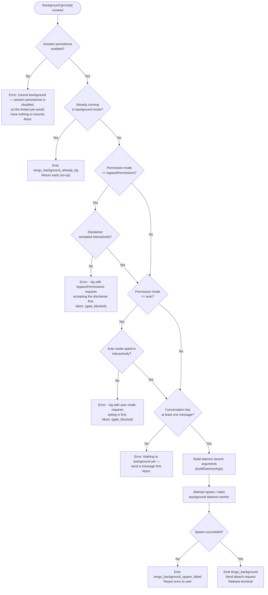

# `/background`

> Analysis basis: CC v2.1.150 bundle.js (AST extraction + Claude interpretation)
> Minimum version: v2.1.150

---

## Overview

The `/background` command (alias `/bg`) detaches the current interactive Claude Code session from the terminal and hands it off to a background daemon process, freeing the controlling TTY. An optional prompt argument is forwarded to the backgrounded session before it is detached, allowing the user to queue work before releasing the terminal. Internally the command performs permission and state gate checks, spawns or claims a daemon worker, serialises session state, and emits a detach-request signal.

---

## Registration

| Field | Value |
|---|---|
| type | `local-jsx` |
| name | `background` |
| description | Send this session to the background and free the terminal |
| argumentHint | `[prompt]` |
| aliases | `bg` |
| immediate | `null` |
| module_id | `Fn1` |
| `loc_byte_end` | `12662381` |
| `arbor_handler.name` | `$75` |
| `arbor_handler.kind` | `AsyncFunction` |
| `arbor_handler.resolution_path` | `module_id` |
| `arbor_handler.fqn` | `claude-2.1.150::$75` |
| `arbor_handler.n_hits` | `0` |

Analysis basis: CC v2.1.150 bundle.js:+12662141

---

## Input Branching

The command entry-point (`commandHandler`) performs a series of sequential gate checks before attempting the actual background operation. Each failed gate aborts with a user-visible error message.



Analysis basis: CC v2.1.150 bundle.js:+12657656, +12661502, +12661583, +12661759, +12655223, +12655385, +12658526, +12658595

---

## Behavioral Spec

### Gate 1 — Session Persistence Check

```
function checkSessionPersistenceEnabled(appState):
    if appState.sessionPersistenceDisabled == true:
        return error(
            "Cannot background — session persistence is disabled, " +
            "so the forked job would have nothing to resume."
        )
    return ok
```

Analysis basis: CC v2.1.150 bundle.js:+12661583

---

### Gate 2 — Already-Backgrounded Guard

```
function checkNotAlreadyBackground(appState):
    if appState.runMode == "bg":
        emit telemetry("tengu_background_already_bg")
        return already_bg   // silent no-op to caller
    return ok
```

Analysis basis: CC v2.1.150 bundle.js:+12661516, +12639492

---

### Gate 3 — Permission-Mode Safety Gates

```
function checkPermissionGates(config):
    mode = config.permissionMode   // "--permission-mode" flag value

    if mode == "bypassPermissions":
        if not config.dangerouslySkipPermissionsAccepted:
            return gate_blocked(
                "--bg with bypassPermissions requires accepting the " +
                "disclaimer first. Run `claude --dangerously-skip-permissions` " +
                "once interactively."
            )

    if mode == "auto":
        if not config.autoModeOptedIn:
            return gate_blocked(
                "--bg with auto mode requires opting in first. " +
                "Run `claude --permission-mode auto` once interactively."
            )

    return ok
```

Relevant CLI flags parsed during this step:
- `--permission-mode` (Analysis basis: CC v2.1.150 bundle.js:+12655023)
- `bypassPermissions` value (Analysis basis: CC v2.1.150 bundle.js:+12655054)
- `--dangerously-skip-permissions` (Analysis basis: CC v2.1.150 bundle.js:+12655086)
- `--allow-dangerously-skip-permissions` (Analysis basis: CC v2.1.150 bundle.js:+12655132)
- `auto` mode value (Analysis basis: CC v2.1.150 bundle.js:+12655365)

The string `"gate_blocked"` is recorded in the abort result. Analysis basis: CC v2.1.150 bundle.js:+12637953

---

### Gate 4 — Conversation Non-Empty Check

```
function checkConversationHasMessages(messages):
    if messages.length == 0:
        return error("Nothing to background yet — send a message first.")
    return ok
```

Analysis basis: CC v2.1.150 bundle.js:+12661759

---

### Building Daemon Launch Arguments

```
function buildDaemonArgs(currentSession, userArgs):
    args = []

    // Carry forward session identity
    args.append("--session-id", currentSession.id)  // "--session-id"

    // Mode flags
    args.append("--agent")     // marks daemon as agent-mode worker
    if userArgs.name:
        args.append("--name", userArgs.name)   // "-n" / "--name"

    // Continue / resume flags (mutually exclusive)
    if currentSession.continueMode:
        args.append("-c")        // "--continue"
    if currentSession.resumeTarget:
        args.append("-r", currentSession.resumeTarget)   // "--resume"

    // Tool allow/deny lists forwarded verbatim
    if currentSession.allowedTools:
        args.append("--allowed-tools", join(currentSession.allowedTools))
    if currentSession.disallowedTools:
        args.append("--disallowed-tools", join(currentSession.disallowedTools))

    // Model / effort forwarded if non-default
    if currentSession.model != "default":
        args.append("--model", currentSession.model)
    if currentSession.effort:
        args.append("--effort", currentSession.effort)

    // Additional working directories
    for dir in currentSession.additionalDirs:
        args.append("--add-dir", dir)

    // Optional user-supplied prompt appended last
    if userArgs.prompt:
        args.append(userArgs.prompt)

    return args
```

Analysis basis: CC v2.1.150 bundle.js:+12638461, +12638488, +12638504, +12638591, +12638601, +12638619, +12638629, +12638912, +12658024, +12658059, +12658100, +12658131, +12658153, +12658177

---

### Daemon Spawn / Spare-Claim Pipeline

The daemon acquisition follows a try-spare-then-spawn sequence:

```
function acquireDaemonWorker(launchArgs, signal):
    // Phase 1: attempt to claim a pre-warmed spare worker
    spare = tryClaimSpareWorker()
    if spare.ok:
        emit telemetry("tengu_bg_spare_claim")
        return spare.worker

    emit telemetry("tengu_bg_spare_claim_fail")

    // Phase 2: check available memory before spawning fresh
    freeMem = os.freemem()          // mqA.freemem
    if freeMem < LOW_MEM_THRESHOLD:
        emit telemetry("tengu_bg_dispatch_low_mem")
        // warn user but do not abort

    // Phase 3: spawn a new daemon worker process
    worker = daemonSpawn(launchArgs, signal)   // bB.spawn
    if not worker.ok:
        emit telemetry("tengu_background_spawn_failed")
        return error

    emit telemetry("tengu_bg_spare_spawn")
    return worker
```

- Spare-claim enabled telemetry: `tengu_bg_spare_enable` (Analysis basis: CC v2.1.150 bundle.js:+15262145)
- Spare claim attempt: `tengu_bg_spare_claim` (Analysis basis: CC v2.1.150 bundle.js:+15262266)
- Spawn fallback: `tengu_bg_spare_spawn` (Analysis basis: CC v2.1.150 bundle.js:+15260564)
- Send-claim failure: `tengu_bg_sendclaim_failed` (Analysis basis: CC v2.1.150 bundle.js:+15241972)
- Low-memory detection uses `mqA.freemem` (Analysis basis: CC v2.1.150 bundle.js:+15261280)

---

### Dispatch and Detach

```
function dispatchAndDetach(worker, prompt, sessionState):
    // Send optional queued prompt before disconnecting
    if prompt != "":
        sendPromptToWorker(worker, prompt, type="slash")

    // Register a detach-request event so the daemon takes ownership
    sendDetachRequest(worker)     // "detach-request" signal

    // Mark terminal as released; update UI label
    appState.label = "(backgrounded)"
    appState.runMode = "bg"

    // Wait up to 5000 ms for worker acknowledgement
    // If ack not received within 6000 ms, escalate
    // Timeout constants: ack_wait=5000 ms, escalate=6000 ms
    waitForAck(worker, ackTimeout=5000, escalateTimeout=6000)

    releaseTerminal()
```

- Timeout 5000 ms (ack wait): Analysis basis: CC v2.1.150 bundle.js:+12641749
- Timeout 6000 ms (escalate): Analysis basis: CC v2.1.150 bundle.js:+12641766
- Label string `"(backgrounded)"`: Analysis basis: CC v2.1.150 bundle.js:+12659283
- Detach-request signal name: Analysis basis: CC v2.1.150 bundle.js:+10683137
- Prompt type recorded as `"slash"`: Analysis basis: CC v2.1.150 bundle.js:+12640355

---

### Dispatch Rescue Path

If a previous daemon session file is detected as `"stale-short"` (a daemon that started but exited within its short-alive window):

```
function handleStaleShortSession(staleSessionPath):
    // Stale short-alive session detected
    if sessionAge < SHORT_ALIVE_THRESHOLD:
        emit telemetry("tengu_bg_dispatch_rescued")    // attempt recovery
        userMessage = "Previous session is still shutting down — try again in a moment"
        return retry_later

    removeStaleSession(staleSessionPath)   // t_H.rm
```

- `"short-alive"` / `"stale-short"` literals: Analysis basis: CC v2.1.150 bundle.js:+12642120, +12642281
- User-facing retry message: Analysis basis: CC v2.1.150 bundle.js:+12642314
- `tengu_bg_dispatch_rescued`: Analysis basis: CC v2.1.150 bundle.js:+12641391

---

### SIGKILL Escalation in Worker Supervisor

If a background worker process does not terminate gracefully after receiving SIGTERM, the supervisor escalates:

```
function supervisorEscalate(worker):
    send(worker, SIGTERM)
    wait(timeout=100 ms)       // 100 ms grace period
    if worker.stillAlive:
        emit telemetry("tengu_bg_dispatch_sigkill_escalate")
        send(worker, SIGKILL)
```

- Grace period 100 ms: Analysis basis: CC v2.1.150 bundle.js:+15260943
- SIGKILL escalation telemetry: Analysis basis: CC v2.1.150 bundle.js:+15260871
- Signal names `"SIGTERM"` / `"SIGKILL"`: Analysis basis: CC v2.1.150 bundle.js:+15242210, +15260919

---

### Session Roster Entry

After successful detach, a roster entry is written so other CLI invocations can discover the backgrounded session:

```
function writeRosterEntry(sessionId, workerPid, launchArgs):
    entry = {
        sessionId:  sessionId,
        pid:        workerPid,
        startedAt:  Date.now(),
        mode:       "bg",
        status:     "working",      // transitions to "idle"/"done"/"crashed" later
    }
    roster.rosterEntry(entry)      // _.rosterEntry
    scheduleCleanup(after=300000)  // 5-minute roster TTL
```

- Roster TTL 300 000 ms (5 min): Analysis basis: CC v2.1.150 bundle.js:+15267635
- Status literals `"working"`, `"active"`, `"idle"`, `"done"`, `"killed"`, `"stopped"`, `"failed"`, `"crashed"`: Analysis basis: CC v2.1.150 bundle.js:+15266413, +15266439, +12639761, +15266068, +15266086, +15266095, +15266105, +15266252

---

### AbortSignal Timeout

The entire background-spawn pipeline is wrapped in an `AbortSignal.timeout` to prevent indefinite hangs:

```
function backgroundWithTimeout(launchArgs, prompt):
    signal = AbortSignal.timeout(BACKGROUND_SPAWN_TIMEOUT_MS)
    return acquireDaemonWorker(launchArgs, signal)
```

`AbortSignal.timeout` is called directly at Analysis basis: CC v2.1.150 bundle.js:+12658721

The per-session dispatch timeout used when communicating with an already-running daemon is 120 seconds:
- 120 s constant: Analysis basis: CC v2.1.150 bundle.js:+12659053

---

### macOS Low-Memory Guard

On macOS, free memory is sampled before spawning a new worker; if it falls below the threshold, a `tengu_bg_low_mem_mb` event is emitted and a warning is shown, but the spawn is not blocked:

```
function checkMemoryMacos():
    if platform == "macos":
        freeMb = os.freemem() / 1024    // 1024 divisor
        if freeMb < LOW_MEM_THRESHOLD:
            emit telemetry("tengu_bg_low_mem_mb", {mb: freeMb})
```

- Platform string `"macos"`: Analysis basis: CC v2.1.150 bundle.js:+12607135
- Divisor 1024: Analysis basis: CC v2.1.150 bundle.js:+12607184
- Telemetry: Analysis basis: CC v2.1.150 bundle.js:+12607162

---

### Daemon Error Classification

Connection errors returned from the daemon are normalised to lowercase codes for consistent handling:

| Raw error code | Normalised code | Meaning |
|---|---|---|
| `ENOENT` | `enoent` | Socket/pipe file not found — daemon not started |
| `ECONNREFUSED` | `econnrefused` | Daemon process exists but refuses connection |
| `ack-timeout` | `ack-timeout` | Daemon did not acknowledge within 5 s window |
| `enoconn` | `enoconn` | No connection available |
| `estarting` | `estarting` | Daemon is still starting up |
| `daemon-unreachable` | `daemon_unavailable` | Daemon cannot be reached after retries |

Analysis basis: CC v2.1.150 bundle.js:+15262438, +15262447, +15262460, +15262475, +12641121, +12641147, +12641169, +12642507, +12642528

---

## State & Side Effects

| Item | Detail |
|---|---|
| Telemetry — `tengu_background` | Emitted on every successful backgrounding. Analysis basis: +12658595 |
| Telemetry — `tengu_background_already_bg` | Emitted when the session is already in background mode (no-op path). Analysis basis: +12661516 |
| Telemetry — `tengu_background_spawn_failed` | Emitted when daemon worker spawn fails. Analysis basis: +12658526 |
| Telemetry — `tengu_bg_dispatch_rescued` | Emitted when a stale short-alive session is recovered. Analysis basis: +12641391 |
| Telemetry — `tengu_bg_dispatch_sigkill_escalate` | Emitted when SIGTERM grace period expires and SIGKILL is sent. Analysis basis: +15260871 |
| Telemetry — `tengu_bg_low_mem_mb` | Emitted with free-MB metric on macOS when memory is low. Analysis basis: +12607162 |
| Telemetry — `tengu_bg_dispatch_low_mem` | Emitted in dispatcher when system memory is insufficient. Analysis basis: +15261450 |
| Telemetry — `tengu_bg_spare_enable` | Emitted when the spare-worker pool is enabled. Analysis basis: +15262145 |
| Telemetry — `tengu_bg_spare_claim` | Emitted when a pre-warmed spare worker is successfully claimed. Analysis basis: +15262266 |
| Telemetry — `tengu_bg_spare_claim_fail` | Emitted when spare worker claim fails (falling back to spawn). Analysis basis: +12658529 (see +15262529) |
| Telemetry — `tengu_bg_spare_spawn` | Emitted when a new daemon worker process is freshly spawned. Analysis basis: +15260564 |
| Telemetry — `tengu_bg_sendclaim_failed` | Emitted when the send-claim IPC call to a spare worker fails. Analysis basis: +15241972 |
| Telemetry — `tengu_rename_full_session_fork` | Emitted during the session-fork rename step triggered by background. Analysis basis: +11647764 |
| Telemetry — `tengu_feature_ok` / `tengu_feature_bad` | General feature health events emitted by underlying IPC layer. Analysis basis: +963421, +963479 |
| Telemetry — `tengu_config_auth_loss_prevented` | Emitted if a config save would have silently dropped auth credentials. Analysis basis: +3191047 |
| Hook registration | `a9` calls `W7A.register` to register the command handler with the slash-command dispatcher. Analysis basis: +12658814, +58272 |
| `appState` changes | `runMode` set to `"bg"`; session label set to `"(backgrounded)"`. Analysis basis: +12639492, +12659283 |
| Roster file | A roster entry is written to disk and scheduled for cleanup after 300 000 ms (5 min). Analysis basis: +15267635 |
| Filesystem — mkdir | A daemon working directory is created (`t_H.mkdir`). Analysis basis: +12638038 |
| Filesystem — rm | Stale session directories are removed (`t_H.rm`) on rescue or cleanup. Analysis basis: +12638181, +12642058 |
| IPC socket | A Unix socket connection is established (`Vh8.connect`) for daemon communication. Analysis basis: +15242119 |
| Signal — SIGTERM | Sent to worker on graceful shutdown request. Analysis basis: +15242210 |
| Signal — SIGKILL | Sent if SIGTERM is not acknowledged within 100 ms. Analysis basis: +15260919 |
| Sound | <!-- TODO: not found in depth-2 traversal; needs --depth 4 --> |

---

## Version History

| Version | Change |
|---|---|
| v2.1.150 | Initial analysis |

---

## Common Mistakes

1. **Running `/background` before sending any message.** The command aborts with "Nothing to background yet — send a message first." You must have at least one exchange in the conversation. Analysis basis: CC v2.1.150 bundle.js:+12661759

2. **Using `bypassPermissions` mode without first accepting the disclaimer interactively.** Running `claude` non-interactively or skipping the interactive acceptance step causes a `gate_blocked` error. You must run `claude --dangerously-skip-permissions` once in an interactive session first. Analysis basis: CC v2.1.150 bundle.js:+12655223

3. **Using `auto` permission mode without the interactive opt-in.** Similar to the above: run `claude --permission-mode auto` interactively first. Analysis basis: CC v2.1.150 bundle.js:+12655385

4. **Session persistence disabled.** If the Claude Code session was started without persistence (e.g. certain CI configurations), `/background` cannot work because there is no resumable state for the daemon to hand back. Analysis basis: CC v2.1.150 bundle.js:+12661583

5. **Retrying immediately after a stale short-alive error.** When the previous daemon session is still in its shutdown window, the command returns "Previous session is still shutting down — try again in a moment." Waiting a few seconds before retrying resolves this. Analysis basis: CC v2.1.150 bundle.js:+12642314

6. **Confusing `/bg` with a full re-attach command.** `/bg` only detaches the current terminal; to re-attach to a backgrounded session you must use `claude --resume` or `/resume` from a new terminal.

7. **Low system memory on macOS.** When available memory is below the internal threshold the daemon spawn may degrade or warn. Check system memory before running long background tasks. Analysis basis: CC v2.1.150 bundle.js:+12607162

---

## Appendix — Identifier Mapping

> For bundle debugging only. Identifiers change across versions.

| Identifier | Role |
|---|---|
| `Xv8` | Top-level `/background` command handler function |
| `Pv8` | JSX render component for the background command UI |
| `$75` | Background command module entry / registration wrapper |
| `wv` | Session list / active-sessions accessor |
| `K` | Task-queue map utility (maps task entries) |
| `L` | Individual task-queue item wrapper (tracks promise lifecycle via `q.add` / `q.delete`) |
| `M` | Daemon IPC connection/message object |
| `yf` | Boolean filter helper (used to remove falsy session entries) |
| `rt_` | Permission-mode gate checker |
| `h4` | Interactive acceptance checker for dangerous flags |
| `cc` | Core background-dispatch orchestrator (builds args, invokes daemon) |
| `L75` | CLI argument builder for the `shell` / daemon invocation |
| `o45` | Full daemon session launch function |
| `EH` | Error formatting / normalisation utility |
| `K8` | Logging / debug output helper |
| `ER8` | Additional-directory (`--add-dir`) list builder |
| `w` | Background worker / daemon process manager |
| `A` | Worker registry map |
| `c` | Generic IPC / event-emitter helper |
| `C` | Worker supervisor (handles mtime, SIGTERM/SIGKILL escalation) |
| `H` | Jitter / random-delay utility (used in retry back-off) |
| `uH` | Feature-ok telemetry emitter |
| `bH` | Feature-bad telemetry emitter |
| `Kv8` | macOS low-memory sampler |
| `Oz6` | Roster file reader (reads JSON roster from disk) |
| `RH` | Structured error reporter / log-error utility |
| `g` | Settled-promise retirement helper (retires resolved/rejected tasks) |
| `V6` | Spare-worker pool manager |
| `yqA` | Send-claim IPC function (claims spare worker over socket) |
| `uqA` | Background session lifecycle tracker (status transitions) |
| `D` | Spare-worker spawner / pool refresher |
| `S` | Disposable resource wrapper for daemon connections |
| `P` | MCP server connection handler (SDK transport) |
| `wh8` | MCP connection state accessor |
| `c_` | Error constructor wrapper |
| `T` | Additional MCP transport handler |
| `HE6` | MCP transport type discriminator |
| `j_` | JSX element factory helper |
| `Dv` | Core JSX renderer |
| `Gh` | UI component for backgrounding status display |
| `V_H` | Renders the background command output panel |
| `m6` | Session metadata / timestamp recorder |
| `f8` | Global config save guard (prevents auth-loss on write) |
| `ew6` | Working-directory context accessor |
| `PvH` | Abort-signal propagation wrapper |
| `$H6` | Session-fork / rename orchestrator |
| `sQ_` | Session timestamp tracker |
| `eiL` | Session-name generation via LLM (rename flow) |
| `fE8` | Conversation message serialiser for session fork |
| `nk` | Session-name generation prompt builder |
| `vK` | Model / tool-schema validator |
| `$K` | Message filter (removes disallowed message types) |
| `_h1` | Session-name result extractor |
| `N` | Markdown / ANSI text normaliser for session titles |
| `XO` | Argument-slice utility (strips leading flags) |
| `aW8` | Argument parser for positional prompt |
| `WzH` | Context-file / working-directory loader |
| `S6` | File-path resolver |
| `yG` | Basename extractor for context file names |
| `cq` | Context-file reader with stat + cache |
| `Uw` | Context-file cache invalidator |
| `x5` | Context-file writer / updater |
| `j8` | Structured logger wrapper |
| `a9` | Slash-command registration caller (`W7A.register`) |
| `tU` | Array-type guard |
| `O` | Background session label string container |
| `k8` | String constant holder (`"background session"`) |
| `nW8` | `tool_result` message type detector |
| `_` | Utility array / collection helper |
| `$y` | Conversation message pre-processor |
| `Lc` | Message list normaliser |
| `dtH` | Path `startsWith` guard |
| `gO` | Config-path resolver (uses `S6` + `h4`) |
| `fB` | Fallback config-path resolver |
| `bq` | Daemon-worker process descriptor |
| `f$H` | Worker process factory |
| `ZLH` | Detach-request sender |
| `al6` | Detach-request payload builder |
| `PW1` | Task-type discriminator (`"task"` vs `"detach-request"`) |
| `no` | IPC write helper (`lo.write`) |
| `E_H` | Detach acknowledgement handler |
| `_PH` | Environment / build-mode checker |
| `mH` | String coercion utility (used in env checks) |
| `li1` | Test-environment guard |
| `jC` | Production/test mode branching helper |