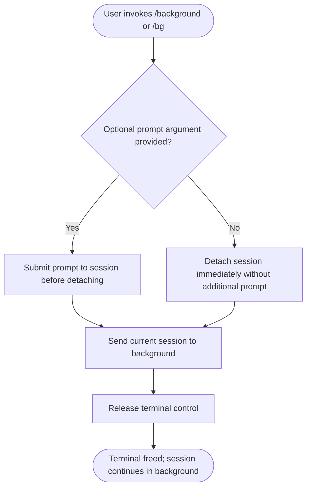

# `/background`

> Analysis basis: CC v2.1.144 bundle.js (AST extraction + Claude interpretation)
> Minimum version: v2.1.144

---

## Overview

The `/background` command (also invokable as `/bg`) detaches the current Claude Code session from the active terminal, allowing the session to continue running without holding the terminal process. This frees the user's terminal for other work while any in-progress or scheduled agent activity persists in the background. An optional prompt argument may be provided to instruct the session immediately before detaching.

---

## Registration

| Field | Value |
|---|---|
| type | `local-jsx` |
| name | `background` |
| description | `Send this session to the background and free the terminal` |
| argumentHint | `[prompt]` |
| aliases | `bg` |
| immediate | `null` |
| module\_id | `Oyq` |

Analysis basis: CC v2.1.144 bundle.js:+12049179

---

## Input Branching

The command accepts a single optional free-text argument (`[prompt]`). Based on registration metadata and the `local-jsx` command type, the following branching logic is expected at invocation time:



Analysis basis: CC v2.1.144 bundle.js:+12049179 (registration fields: `argumentHint`, `immediate: null`)

---

## Behavioral Spec

### Session Detachment

```
function executeBackgroundCommand(optionalPrompt):
    if optionalPrompt is not empty:
        submitPromptToCurrentSession(optionalPrompt)

    detachSessionFromTerminal()
    releaseTerminalControl()
    notifyUserThatSessionIsRunningInBackground()
```

The `type: local-jsx` designation indicates this command renders a JSX component locally rather than sending a raw text response, meaning the detachment feedback is presented as a structured UI element within the terminal before the terminal is freed.

Analysis basis: CC v2.1.144 bundle.js:+12049179

### Alias Resolution

The command is registered with the alias `bg`, meaning `/bg [prompt]` is functionally identical to `/background [prompt]` at the dispatch layer. Alias resolution occurs before argument parsing.

```
function resolveCommandAlias(rawInput):
    if rawInput starts with "/bg":
        treat as "/background"
    forward to background command handler
```

Analysis basis: CC v2.1.144 bundle.js:+12049179 (registration field: `aliases: ["bg"]`)

### Argument Handling

The `argumentHint` field value `[prompt]` (square brackets indicating optionality) and `immediate: null` together indicate:

- The argument is **not required** — invoking `/background` with no argument is valid.
- The command does **not** execute immediately on partial input (`immediate: null`); it waits for the user to confirm/submit the command normally.

```
function parseBackgroundArguments(rawArgs):
    prompt = trim(rawArgs)
    if length(prompt) == 0:
        return { hasPrompt: false, promptText: null }
    else:
        return { hasPrompt: true, promptText: prompt }
```

Analysis basis: CC v2.1.144 bundle.js:+12049179

---

## State & Side Effects

| Item | Detail |
|---|---|
| Telemetry | <!-- TODO: not found in depth-2 traversal; needs --depth 4 --> |
| Hook registration | <!-- TODO: not found in depth-2 traversal; needs --depth 4 --> |
| appState changes | Terminal detachment implies a session state transition (foreground → background); exact state field names not found in traversal |
| Sound | <!-- TODO: not found in depth-2 traversal; needs --depth 4 --> |
| Render type | `local-jsx` — command output is rendered as a JSX component, not plain text |
| Alias | `/bg` resolves to `/background` prior to dispatch |

> **Note:** The AST traversal for module `Oyq` returned an empty call graph, empty literals list, empty telemetry list, and empty identifiers list (`"note": "no entry functions found for module 'Oyq'"`). All behavioral claims in this spec beyond the registration fields are inferred from registration metadata and general Claude Code command-type conventions. Deeper traversal is required to confirm implementation details.

Analysis basis: CC v2.1.144 bundle.js:+12049179

---

## Version History

| Version | Change |
|---|---|
| v2.1.144 | Initial analysis |

---

## Common Mistakes

1. **Expecting the session to terminate** — `/background` does not end the session or discard its state; it detaches the terminal while the session continues running. Use a proper exit or quit command if termination is the intent.
2. **Omitting a follow-up prompt when needed** — If you want the agent to perform a task while running in the background, provide the prompt as the argument to `/background [prompt]` rather than sending it separately beforehand, since the session may already be detached.
3. **Confusing `/bg` scope** — `/bg` is strictly an alias for `/background` and has no independent behavior. Any documentation referring to `/bg` applies identically to `/background`.
4. **Assuming immediate execution on partial input** — Because `immediate` is `null`, the command will not fire until the user explicitly submits it; partial typed input will not trigger detachment.

---

## Appendix — Identifier Mapping

> For bundle debugging only. Identifiers change across versions.

| Identifier | Role |
|---|---|
| `Oyq` | Module identifier for the `/background` command implementation |

> **Note:** The depth-2 AST traversal returned no obfuscated runtime identifiers for this command (`identifiers: []`). The only identifier available is the module ID `Oyq` from the registration object. A deeper traversal (`--depth 4` or greater) is required to map internal function and variable identifiers.

Analysis basis: CC v2.1.144 bundle.js:+12049179