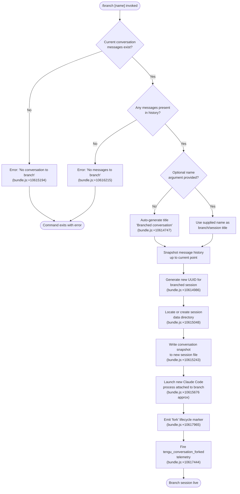

# `/branch`

> Analysis basis: CC v2.1.150 bundle.js (AST extraction + Claude interpretation)
> Minimum version: v2.1.150

---

## Overview

The `/branch` command (also invocable as `/fork`) forks the current conversation at its present point, creating a new independent session that begins from a snapshot of the existing message history. The handler reads the current conversation messages, writes them into a new session file, and launches a fresh Claude Code process attached to that branched state. An optional `[name]` argument sets a custom title for the branched session.

---

## Registration

| Field | Value |
|---|---|
| type | `local-jsx` |
| name | `branch` |
| description | `Create a branch of the current conversation at this point` |
| argumentHint | `[name]` |
| aliases | `["fork"]` |
| module_id | `Md_` |
| load_inline | `true` |
| loc_byte | `12099775` |
| loc_byte_end | `12099969` |
| loc_line | `9852` |
| arbor_handler.name | `pxL` |
| arbor_handler.fqn | `claude-2.1.150::pxL` |
| arbor_handler.kind | `AsyncFunction` |
| arbor_handler.resolution_path | `module_id` |
| arbor_handler.n_hits | `0` |

Analysis basis: CC v2.1.150 bundle.js:+12099775

---

## Input Branching

The command has four distinct execution paths depending on conversation and argument state, requiring a Mermaid flowchart.



---

## Behavioral Spec

### Top-level handler: `pxL` (AsyncFunction)

`pxL` is the primary async handler resolved via `module_id → Md_`. It delegates immediately to the internal orchestrator `branchOrchestrator` (`_21`).

Analysis basis: CC v2.1.150 bundle.js:+10618229

```
async function pxL(commandContext):
    await branchOrchestrator(commandContext)
```

### Orchestrator: `branchOrchestrator` (`_21`)

```
async function branchOrchestrator(ctx):
    # 1. Resolve current session state
    sessionInfo = getSessionInfo()          # S6 at +10617140
    sessionObject = getSessionObject(sessionInfo)  # gO at +10617147

    # 2. Check conversation exists
    if not sessionObject.hasMessages():
        raise Error("No conversation to branch")  # literal at +10615194

    # 3. Extract messages up to current cursor
    messages = extractConversationMessages(ctx)  # H21 at +10617248
    if messages is empty:
        raise Error("No messages to branch")      # literal at +10616215

    # 4. Determine branch title
    nameArg = parseArgumentName(ctx)              # eP1 at +10617307
    title = nameArg if nameArg else "Branched conversation"  # literal at +10614747

    # 5. Create branch session
    branchId = generateBranchId()                 # randomUUID inside H21 at +10614986
    writeBranchSession(branchId, messages, title) # H21 full sequence

    # 6. Post-branch housekeeping
    normalizeBranchTitle(title)                   # cy/GLH sequence at +10617411/+10617429
    emitForkMarker()                              # literal "fork" at +10617965
    emit("tengu_conversation_forked")             # telemetry at +10617444

    # 7. Resume input stream
    resumeInputStream()                           # H.resume at +10617952
```

Analysis basis: CC v2.1.150 bundle.js:+10617140

### Argument name extraction: `argumentNameExtractor` (`eP1`)

```
function argumentNameExtractor(inputArgs, conversionTable):
    # Find matching entry in command argument list
    match = _.find(conversionTable, inputArgs)     # +10614799
    if match:
        # Sanitize the name string
        safeName = match.replace(UNSAFE_PATTERN, "") # +10614877
        return safeName
    return null
```

Analysis basis: CC v2.1.150 bundle.js:+10614799

### Message extraction and branch file writer: `branchFileWriter` (`H21`)

```
async function branchFileWriter(sessionObject, branchId, title, messages):
    # Validate message presence
    if messages.length == 0:
        emit progress("No messages to branch")   # literal at +10616215
        return

    # Snapshot up to 100 most recent message turns (limit at +10614914)
    snapshotMessages = messages.slice(-100)

    # Prepare directory (448-byte buffer, utf8, open flags)
    # (literals: 100 at +10614914; 448 at +10615079; "utf8" at +10615130; "open" at +10615156)
    targetDir = computeSessionDir(branchId)
    await fs.mkdir(targetDir, recursive=true)    # h08.mkdir at +10615048

    # Stream existing conversation log into branch file
    readStream  = fs.createReadStream(sourceFile, encoding="utf8")  # +10615097
    writeStream = fs.createWriteStream(targetFile)                   # +10615243

    # Wire readline interface for line-by-line processing
    lineReader = readline.createInterface(readStream)                 # sP1.createInterface at +10615337

    # Process each line: rewrite content-replacement markers
    for line in lineReader:
        if line matches "content-replacement" marker:  # literal at +10615674
            rewriteContentLine(line, writeStream)
        else:
            writeStream.write(line)

    # Accumulate JSON-parsed message objects
    parsedMessages = []
    for rawMsg in lineReader.map(...):
        parsed = parseJsonSafe(rawMsg)           # g6 at +10615641
        if parsed: parsedMessages.push(parsed)  # j.push at +10615714

    # Finalize streams
    writeStream.end()
    await stream.finished(writeStream)           # tP1.finished at +10616625

    # Emit progress update
    emitProgress("progress", parsedMessages)     # literal "progress" at +10616133

    # Register branch session
    if not sessionRegistry.has(branchId):        # D.has at +10615776
        sessionRegistry.set(branchId, session)   # w.set at +10615799

    # Open branch in new window
    openBranchSession(branchId)                  # Y.close / $.destroy sequence at +10615851/+10615861

    # Retrieve and display branch results
    result = sessionRegistry.get(branchId)       # w.get at +10615922
    if result:
        resultQueue.push(result)                  # W.push at +10616091
```

Analysis basis: CC v2.1.150 bundle.js:+10614986

### Branch title normalization: `sessionTitleWriter` (`cy`) and `agentNameWriter` (`GLH`)

```
function sessionTitleWriter(sessionId, title):
    # Sets "custom-title" metadata on the forked session
    # literal "custom-title" at +12783269
    writeSessionMetadata(sessionId, key="custom-title", value=title)
    sessionInfo = getSessionInfo()               # BV at +12783248, S6 at +12783316
    emit("tengu_session_renamed")                # telemetry at +12783361

function agentNameWriter(sessionId, agentName):
    # Sets "agent-name" metadata on the forked session
    # literal "agent-name" at +12786292
    writeSessionMetadata(sessionId, key="agent-name", value=agentName)
    sessionInfo = getSessionInfo()               # BV at +12786271, S6 at +12786335
    notifyConfigChange()                          # Gg at +12786371
    emit("tengu_agent_name_set")                  # telemetry at +12786390
```

Analysis basis: CC v2.1.150 bundle.js:+12783248 and +12786271

### Worktree detection helper: `worktreeDetector` (`Zc` → `shH`)

The branch mechanism queries git worktree state before forking so the branched session inherits the correct working directory context.

```
function detectWorktrees(workingDir):
    # Run: git worktree list --porcelain
    # literals: "worktree" at +11804890; "--porcelain" at +11804908
    rawOutput = execGit(["worktree", "list", "--porcelain"])
    emit("tengu_worktree_detection")             # telemetry at +11804990

    lines = rawOutput.split("\n")
    worktrees = []
    for line in lines:
        if line.startsWith("worktree "):         # literal "worktree " at +11805109
            path = line.slice(9)                 # offset 9 at +11805140
            worktrees.push(path)

    # Locale-sort and return
    return worktrees.sort(localeCompare)
```

Analysis basis: CC v2.1.150 bundle.js:+12789521

### Default title generation and argument extraction: `titleResolver` (`eP1` + `nameSanitizer` `Mm`)

```
function sanitizeName(rawName):
    # Escapes special regex characters in the name
    # literal "\\$&" at +191264 (used as replacement in H.replace)
    return rawName.replace(SPECIAL_CHARS_REGEX, "\\$&")  # Mm at +191232

function resolveBranchTitle(args, commandDefs):
    rawName = argumentNameExtractor(args, commandDefs)
    if rawName:
        return sanitizeName(rawName)
    return "Branched conversation"   # literal at +10614747
```

Analysis basis: CC v2.1.150 bundle.js:+10614747 and +191232

---

## State & Side Effects

| Item | Detail |
|---|---|
| Telemetry | `tengu_conversation_forked` (+10617444), `tengu_session_renamed` (+12783361), `tengu_agent_name_set` (+12786390), `tengu_worktree_detection` (+11804990) |
| Session registry | New session entry created in in-memory session map (`w.set` at +10615799); keyed by freshly generated UUID |
| File system | New session data directory created via `fs.mkdir` (+10615048); conversation log streamed from source to branch file via read/write stream pair (+10615097/+10615243) |
| Readline interface | Temporary `readline.createInterface` instance created (+10615337) and destroyed after message extraction |
| New process window | Branch session opened in a new Claude Code window/pane (`Y.close`/`$.destroy` sequence at +10615851/+10615861) |
| Input stream | Parent conversation input stream resumed after fork completes (`H.resume` at +10617952) |
| Lifecycle marker | String literal `"fork"` emitted as a lifecycle event marker (+10617965) |
| Content-replacement markers | Lines tagged `"content-replacement"` (+10615674) in the source log are rewritten rather than verbatim-copied into the branch file |
| appState changes | Session metadata keys `"custom-title"` and `"agent-name"` may be set on the new session depending on whether a name argument was supplied |
| Sound | Not detected in depth-2 traversal |
| Hook registration | Not detected in depth-2 traversal |

---

## Version History

| Version | Change |
|---|---|
| v2.1.150 | Initial analysis |

---

## Common Mistakes

1. **Invoking `/branch` before sending any messages** — the command checks that the current conversation has at least one message. Running it on a freshly opened, empty session produces the error `"No messages to branch"` and exits immediately (bundle.js:+10616215).
2. **Expecting the current session to transform** — `/branch` always creates a *new* session. The original session continues unchanged; the branch appears in a separate window.
3. **Supplying a name with special characters** — the name argument is run through `sanitizeName` which escapes regex-special characters. Characters that look structural (e.g., `$`, `\`, `(`) will appear escaped in the title.
4. **Confusing `/branch` with git branching** — despite detecting git worktrees for context, `/branch` does **not** create a git branch. It only forks the Claude Code conversation history.
5. **Forgetting the `/fork` alias** — `/branch` and `/fork` are identical in behaviour; both are registered under the same handler.

---

## Appendix — Identifier Mapping

> For bundle debugging only. Identifiers change across versions.

| Identifier | Role |
|---|---|
| `pxL` | Top-level async handler for `/branch`; resolved via `module_id → Md_` (arbor_handler) |
| `_21` | Branch orchestrator — coordinates all sub-steps of the fork flow |
| `eP1` | Argument name extractor — finds and sanitizes the optional `[name]` arg |
| `H21` | Branch file writer — streams conversation history into new session file |
| `mxL` | Branch metadata helper — computes session numeric index and title key |
| `Zc` | Worktree resolver — queries `git worktree list --porcelain` and returns parsed paths |
| `shH` | Git worktree output parser — splits raw porcelain output into path list |
| `Ar1` | File-system path enumerator used during worktree resolution |
| `GSH` | Buffer accumulator used during worktree detection |
| `cy` | Session title writer — persists `"custom-title"` metadata key on forked session |
| `w5H` | File-append helper for session metadata (used by `cy`) |
| `GLH` | Agent name writer — persists `"agent-name"` metadata key on forked session |
| `Gg` | Config-change notifier called after agent name is written |
| `_56` | Config file read/write helper called by `Gg` |
| `Mm` | Name sanitizer — escapes special characters in branch title string |
| `Cq` | Substring slicer utility used during argument parsing |
| `gO` | Session object resolver — maps session info to a live session object |
| `h4` | Session lookup helper used by `gO` and `cy`/`GLH` |
| `a9` | Worker registration helper called from `h4` |
| `S6` | Session state accessor used across multiple sub-functions |
| `Dv` | Core state container accessed by `S6`, `Wh`, `Zh`, `j_` |
| `BV` | Session context builder used by `cy` and `GLH` |
| `YI` | Session identity helper used by `BV` and `H21` |
| `VM` | Session path resolver called from `BV` |
| `Wh` | Working directory resolver called from `VM` |
| `j_` | Session directory helper referenced by multiple sub-functions |
| `j8` | Safe JSON parse utility |
| `K8` | Error classification/rethrow helper |
| `RH` | Structured error reporter used throughout |
| `c_` | Low-level error constructor |
| `mH` | String coercion utility |
| `EH` | Error-to-string coercer |
| `CH` | JSON stringify wrapper |
| `g6` | JSON parse wrapper |
| `W` | Session event debounce queue — buffers branch events before dispatch |
| `czH` | Config-change batch processor triggered by `W` |
| `b7` | Session config writer called from `czH` |
| `YW` | Agent runner invoked for new branch session |
| `fN8` | Hook execution engine used by `YW` |
| `re_` | MCP tool hook dispatcher used by `YW` |
| `ie_` | HTTP hook dispatcher used by `YW` |
| `MN8` | Hook output JSON parser |
| `Po1` | UserPromptSubmit hook handler |
| `te_` | Hook type router — dispatches to correct handler by event name |
| `se_` | Third-party hook filter |
| `H_H` | Hook environment entry builder |
| `JV` | AbortController-based timeout wrapper for hooks |
| `AN8` | Worktree hook handler |
| `SWH` | Hook stringify helper |
| `qAH` | Hook async state machine |
| `Hv` | Hook environment builder |
| `aLH` | Hook post-processor |
| `CIH` | Hook cleanup handler |
| `tQH` | Skill hook presence checker |
| `bo` | Skill index refresher called on config change |
| `Vx` | Skill cache clear helper |
| `GP8` | Skill manager used by `bo` |
| `aM1` | Skill loader used by `bo` |
| `vyH` | Skill config reader |
| `XyH` | Cache invalidator called after config change |
| `uqA` | Background session manager — manages lifecycle of forked sessions |
| `K` | Session label formatter |
| `bK` | Session state file path resolver |
| `cq` | Session state file reader/writer |
| `Bw` | Active-session status updater |
| `x5` | Session socket path builder |
| `keH` | Session telemetry timing helper |
| `hLH` | Session log path resolver |
| `ny` | Session log writer |
| `wB` | Session roster entry builder |
| `VZ6` | Session data directory initializer |
| `Y` | Per-session process manager |
| `kqA` | Background spare process spawner |
| `yqA` | Session claim sender |
| `yHA` | Session directory and config writer |
| `Hk5` | Claim timeout guard |
| `eI5` | Claim frame builder |
| `MB` | Binary protocol frame encoder |
| `Ok5` | PTY/daemon protocol handler — multiplexes messages on the branch session socket |
| `zM` | Socket message encoder |
| `X` | Socket frame reader |
| `xJK` | Socket timeout manager |
| `RqA` | Socket reply awaiter |
| `fk5` | Viewport size calculator |
| `$k5` | Session phase checker |
| `WfH` | JSONL log reader helper |
| `FT` | Canonical path builder |
| `Nv` | Relative path resolver |
| `Jz` | Path normalizer |
| `E$` | Realpath resolver |
| `P` | UI repaint scheduler |
| `I` | Away-summary generator |
| `V48` | API call wrapper for away summary |
| `YJ1` | UUID generator for API requests |
| `a05` | Away summary metric collector |
| `D` | Background dispatch controller |
| `w` | Foreground process manager |
| `C` | Supervised process launcher |
| `KXK` | Process identity verifier |
| `N` | OS platform/environment helper |
| `kk5` | Process argument builder |
| `Dz` | Daemon mode flag reader |
| `z` | IPC write stream |
| `uH` | Stream write helper |
| `bH` | Stream data helper |
| `Kv8` | Memory availability checker |
| `V6` | Shared memory state accessor |
| `Oz6` | Pinned file loader |
| `wD_` | Pin file path resolver |
| `V37` | Pin directory scanner |
| `g` | Retired session cleaner |
| `v6` | Tool-use filter |
| `VH` | Orphaned-permission checker |
| `j` | Active process list manager |
| `y` | Process kill helper |
| `TR` | Session type classifier |
| `O` | IPC socket event emitter |
| `k8` | Socket event router |
| `J` | Process group manager |
| `s` | Voice recording toggle ref |
| `t` | Voice focus timeout ref |
| `T` | Voice repaint helper |
| `Q` | Timeout scheduler |
| `r` | Permission decision evaluator |
| `m` | Idle exit timer |
| `l` | PTY output filter |
| `o` | Voice session controller |
| `d` | Permission response dispatcher |
| `W6A` | Permission state machine |
| `Jk6` | PTY stream writer |
| `DOH` | Background service descriptor |
| `YY` | Service registry accessor |
| `f` | MCP client state machine |
| `UyH` | MCP client initializer |
| `gDK` | MCP update applicator |
| `lv5` | MCP client roster builder |
| `Cf` | MCP tool filter |
| `$` | Session disposable handle |
| `HQ1` | Disposable cleanup scheduler |