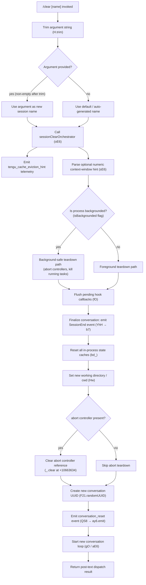

# `/clear`

> Analysis basis: CC v2.1.150 bundle.js (AST extraction + Claude interpretation)
> Minimum version: v2.1.150

---

## Overview

`/clear` starts a fresh conversation session with an empty context window while preserving the previous session on disk so it can be resumed later with `/resume`. It accepts an optional `[name]` argument to label the new session. The command is also reachable via the aliases `/reset` and `/new`.

---

## Registration

| Field | Value |
|---|---|
| type | `local` |
| name | `clear` |
| description | `Start a new session with empty context; previous session stays on disk (resumable with /resume)` |
| argumentHint | `[name]` |
| aliases | `reset`, `new` |
| supportsNonInteractive | `true` |
| thinClientDispatch | `post-text` |
| module_id | `d21` |
| load_inline | `true` |
| loc_byte | `10665211` |
| loc_byte_end | `10665502` |
| loc_line | `8371` |
| arbor_handler.name | `RuL` |
| arbor_handler.fqn | `claude-2.1.150::RuL` |
| arbor_handler.kind | `AsyncFunction` |
| arbor_handler.resolution_path | `module_id` |
| arbor_handler.n_hits | `0` |

Analysis basis: CC v2.1.150 bundle.js:+10665211

---

## Input Branching

Five or more distinct paths exist depending on argument presence, backgrounded state, session state, and abort-controller status.



Analysis basis: CC v2.1.150 bundle.js:+10665037, +10663214, +10663421, +10663634, +10664436, +10664475

---

## Behavioral Spec

### 1. Argument Parsing

```
async function clearCommandHandler(args, appContext):
    rawArg = args.trim()                       // H.trim at +10665037
    sessionName = rawArg if rawArg != "" else null
    return sessionClearOrchestrator(sessionName, appContext)
```

Analysis basis: CC v2.1.150 bundle.js:+10665037, +10665052

---

### 2. Session Clear Orchestrator (`oE6`)

This is the primary orchestration function reached from `RuL`.

```
async function sessionClearOrchestrator(sessionName, context):
    hint = parseContextWindowHint(context)     // sE6 at +10663214
    emit("tengu_cache_eviction_hint")          // +10663318
    emit_telemetry("conversation_clear")       // literal at +10663353

    if context.isBackgrounded:                 // flag literal at +10663421
        killAllRunningWorkers(context)         // w (process map) at +10663513
        pruneBackgroundSessions()

    finalizeCurrentSession(context)            // YhH at +10663226
    resetInProcessCaches()                     // bd_ at +10663616
    setWorkingDirectory(sessionName, context)  // Hw at +10663625

    clearAbortController(context)              // _.clear at +10663634
    pruneObjectKeys(context)                   // Object.keys at +10663659

    newConversationId = crypto.randomUUID()    // F21.randomUUID at +10664475
    broadcastConversationReset(newConversationId) // QS8 at +10664493
    emit_telemetry("conversation_reset")       // literal at +10664436

    startFreshConversation(context)            // gO at +10664378, aE6 at +10664419

    clearTimeout(pendingTimer)                 // clearTimeout at +10663934
    restartHookFramework(context)              // fO at +10664035, GlH at +10664073

    return buildPostTextResult()
```

Analysis basis: CC v2.1.150 bundle.js:+10663214 through +10664819

---

### 3. Context-Window Hint Parsing (`sE6`)

```
function parseContextWindowHint(rawValue):
    parsed = parseInt(rawValue, 10)            // +12880202 (radix 10)
    if not Number.isFinite(parsed):
        return defaultContextSize()            // rY at +12880267
    clamped = Math.max(0, Math.min(parsed, 1000))  // +12880420, +12880433
    return clamped
```

- Radix 10 for integer parsing (bundle.js:+12880213, value `10`)
- Upper clamp: 1000 (bundle.js:+12880389)
- Lower clamp: 0 (bundle.js:+10665052)

Analysis basis: CC v2.1.150 bundle.js:+12880202, +12880224, +12880389, +12880420, +12880433

---

### 4. Current Session Finalization (`YhH`)

```
function finalizeCurrentSession(context):
    broadcastEvent("SessionEnd", context)      // literal "SessionEnd" at +12870874; b7 at +12870847
    runSessionEndHooks(context)                // YW at +12870905
    appendFinalEntry()                         // OkH at +12871107
    updateSessionRecord(context)               // S6 at +12871102
```

- The `"SessionEnd"` event string is emitted to hook subscribers before the context is wiped. Analysis basis: CC v2.1.150 bundle.js:+12870847, +12870874

---

### 5. In-Process Cache Reset (`bd_`)

`bd_` is called immediately after session finalization and clears the broadest set of in-memory caches before the new conversation begins.

```
function resetInProcessCaches():
    clearSkillIndexCache()                     // Vx → H.clearSkillIndexCache at +12743634
    clearPluginCache()                         // GP8, aM1, vyH at +12743686-+12743698
    clearMcpCache()                            // MWq → OU.clear at +6440750
    resetSubagentMap()                         // Uo → W28 at +9885855
    resetCompactState()                        // wD6 at +10662311
    clearHookCaches()                          // Ieq, Xdq, Hc8, Qd8 at +10662478-+10662524
    clearGlobalCommandStore()                  // Glq at +10662536
    resolveOutstandingPromises()               // Promise.resolve at +10662542
    flushRemainingCallbacks()                  // tcH at +10662826
    resetLvlAutonomousLoop()                   // LvL.resetAutonomousLoopDelivered at +9885967
    clearConversationRegistryMaps()            // ewH, Ndq at +9885941, +9885947
```

Analysis basis: CC v2.1.150 bundle.js:+10662257 through +10662826

---

### 6. Working Directory Resolution (`Hw`)

```
function setWorkingDirectory(sessionName, context):
    target = sessionName ?? context.currentCwd
    if not path.isAbsolute(target):            // UY8.isAbsolute at +8007153
        target = path.resolve(target)          // UY8.resolve at +8007173
    validated = validateDirectory(target)      // Q6 at +8007188, j8 at +8007243
    if not valid:
        throw Error(...)                       // Error at +8007255
    store = getContextStore()                  // dQ8 → Lm6.getStore at +973327
    store.normalizedCwd = normalize(target)    // H.normalize at +973353
    emit_telemetry("tengu_shell_set_cwd")
    return validated
```

Analysis basis: CC v2.1.150 bundle.js:+8007153, +8007173, +8007188, +8007243, +8007255, +8007295, +8007308

---

### 7. New Conversation Broadcast (`QS8`)

```
function broadcastConversationReset(newId):
    uuid = crypto.randomUUID()                 // mAH.randomUUID at +40610
    ay6.emit("conversation_reset", {id: uuid}) // ay6.emit at +40704
```

Analysis basis: CC v2.1.150 bundle.js:+40610, +40704, +10664493

---

### 8. Hook Framework Flush (`fO`)

Pending hook callbacks buffered in `cv8` are flushed before the new session starts.

```
function flushHookCallbacks():
    trackInflight(promise)                     // nv8 → Wr1.add at +12836453
    cached = cv8.get(key)                      // +12837881
    if cached:
        cached.flush()                         // _.flush at +12837903
        cv8.delete(key)                        // +12837913
```

Analysis basis: CC v2.1.150 bundle.js:+12837860, +12837881, +12837903, +12837913

---

## State & Side Effects

| Item | Detail |
|---|---|
| Telemetry — `tengu_cache_eviction_hint` | Fired once per `/clear` invocation, during context-window hint processing (bundle.js:+10663318) |
| Telemetry — `tengu_run_hook` | Fired for each hook executed during session-end processing (+12919037) |
| Telemetry — `tengu_repl_hook_finished` | Fired when hook execution loop completes (+12903116) |
| Telemetry — `tengu_hook_plugin_metrics` | Fired with plugin timing data (+12897708) |
| Telemetry — `tengu_hook_plugin_injected` | Fired when a plugin hook is injected into the pipeline (+12917383) |
| Telemetry — `tengu_feature_ok` / `tengu_feature_bad` | Fires on feature gate pass/fail (+963421, +963479) |
| Telemetry — `tengu_session_renamed` | Fires if the new session is assigned a name (+12783361) |
| Telemetry — `tengu_shell_set_cwd` | Fires on successful working-directory update (+8007308) |
| Telemetry — `tengu_bg_dispatch_sigkill_escalate` | Fires if a backgrounded process requires SIGKILL during teardown (+15260871) |
| Telemetry — `tengu_daemon_control` | Fires during daemon lifecycle transitions (+15296981) |
| SessionEnd event | Emitted to all hook subscribers before context wipe (`"SessionEnd"` literal at +12870874) |
| conversation_reset broadcast | New UUID generated via `crypto.randomUUID()` and emitted through internal event bus (+10664475, +40704) |
| Cache invalidation | All skill, plugin, MCP, hook, subagent, and compact-state caches cleared via `bd_` (+10662257–+10662826) |
| Abort controller | Existing abort controller reference cleared (`_.clear` at +10663634); any pending `clearTimeout` cancelled (+10663934) |
| Previous session | Persisted to disk by `YhH` → `YW`; resumable via `/resume`. NOT deleted. |
| Hook framework | Pending buffered callbacks in `cv8` are flushed (`fO` at +10664035) before new session starts |
| appState | `conversation_reset` dispatched; new conversation ID set; `isBackgrounded` flag inspected and running background workers killed if set |
| Sound | <!-- TODO: not found in depth-2 traversal; needs --depth 4 --> |

---

## Version History

| Version | Change |
|---|---|
| v2.1.150 | Initial analysis |

---

## Common Mistakes

1. **Expecting the previous session to be deleted.** `/clear` only archives the current session on disk; it remains fully resumable with `/resume`. Users who want to permanently discard a session must do so manually.
2. **Using `/clear` to change working directory.** The `[name]` argument labels the new session, not a directory path. Changing the working directory requires `/cwd` or a separate mechanism; `/clear` only re-validates and normalizes the existing cwd (via `Hw`).
3. **Assuming hooks do not run on clear.** `SessionEnd` hook events fire before the context is wiped. Hooks registered for `SessionEnd` will execute synchronously in the teardown path.
4. **Invoking `/clear` in a backgrounded session expecting foreground behaviour.** When `isBackgrounded` is `true`, a different teardown code path runs that kills background workers before resetting state. The result is the same (new session) but side effects differ.
5. **Treating `/reset` and `/new` as separate commands.** Both are aliases registered on the same handler (`RuL` / `oE6`) and produce identical behaviour to `/clear`.

---

## Appendix — Identifier Mapping

> For bundle debugging only. Identifiers change across versions.

| Identifier | Role |
|---|---|
| `RuL` | Async handler entry point for `/clear` (arbor_handler, module `d21`) |
| `oE6` | Session clear orchestrator — main coordination function |
| `sE6` | Context-window hint parser (parseInt + clamp) |
| `rY` | Default context size resolver |
| `p8` | Policy settings accessor |
| `Hm` | Display/render helper (calls `Dv`) |
| `wp` | Wrapper utility (calls `Vf_`) |
| `Vf_` | Internal formatter (calls `fx9`) |
| `YhH` | Current session finalizer — emits `SessionEnd`, calls `YW` and `OkH` |
| `b7` | Session record writer / broadcaster |
| `S6` | Session state updater |
| `Zh` | Alternate session event emitter |
| `R2` | Model-name classifier (contains `claude-3-`, `claude-opus-4-*` literals) |
| `dZ` | Effort-level handler |
| `BV` | Conversation header builder |
| `x6` | Conversation metadata formatter |
| `YW` | Full session-end flush: runs hooks, closes worktrees, emits events |
| `mH` | String coercion helper |
| `Dp` | Dependency pointer resolver |
| `N` | System-prompt / message normalizer |
| `j5H` | Hook output pair handler |
| `te_` | Hook type dispatcher (PreToolUse, PostToolUse, SessionStart, etc.) |
| `O` | Generic collection / observer object |
| `Wo1` | Worktree open helper |
| `se_` | Third-party filter for hooks |
| `To1` | Tool registry accessor |
| `c` | Generic context/config container |
| `CH` | JSON serializer wrapper |
| `RH` | Error logger / reporter |
| `uH` | Context state reader |
| `SWH` | Context state writer |
| `JV` | Abort controller manager |
| `J` | Callback registry |
| `qAH` | Async queue helper |
| `Hv` | Hook validator |
| `AN8` | Hook result aggregator |
| `re_` | Hook result parser (checks `text` key, MCP errors) |
| `MN8` | Hook output normalizer (JSON vs plain-text detection) |
| `H_H` | Hook env-vars filter |
| `ie_` | HTTP hook executor |
| `Po1` | HTTP hook response normalizer |
| `aLH` | Async lock helper |
| `fN8` | Shell/command hook executor (spawns subprocess) |
| `CIH` | Hook completion handler |
| `bH` | Context builder |
| `OkH` | Session append-entry helper |
| `t_6` | Thin-client dispatch helper |
| `L` | Promise lifecycle tracker (add/finally/delete) |
| `q` | Active-process registry (unlinkSync on cleanup) |
| `M` | Connection / channel object |
| `A` | Process map |
| `w` | Background-session dispatch manager |
| `C` | Process supervisor |
| `KXK` | Filesystem realpath/stat helper |
| `Dz` | Daemon health checker |
| `kk5` | IPC socket connector |
| `z` | Output stream (write/bH/uH/Rk/pu) |
| `Kv8` | Memory check + spare-session loader |
| `V6` | Spare-session pool manager |
| `Oz6` | Pinned-file reader (`pins.json`) |
| `wD_` | Path builder for pins file |
| `g6` | JSON.parse wrapper |
| `_` | Generic utility / array/string helper |
| `j8` | ENOENT-safe file stat helper |
| `V37` | Directory-recursive file reader |
| `g` | Conversation retirement scheduler |
| `v6` | Filter helper for MCP-prefixed items |
| `VH` | Orphaned-permission registry |
| `yqA` | Spare background session claim sender |
| `yHA` | Session state persister (mkdir + writeFile) |
| `Hk5` | Claim send timeout handler |
| `eI5` | Claim frame builder |
| `K8` | Structured error constructor |
| `EH` | String-based error formatter |
| `MB` | Binary message framer (Buffer operations) |
| `uqA` | Background session lifecycle manager (done/killed/failed states) |
| `K` | Session label formatter (padEnd) |
| `bK` | Session file path builder |
| `cq` | Session cache file reader/writer |
| `Bw` | Active-session state builder |
| `x5` | Session socket path builder |
| `keH` | Session keepalive timer |
| `hLH` | Session log path builder |
| `ny` | Log-line splitter helper |
| `wB` | Session state writer to disk |
| `VZ6` | Session directory initializer |
| `Y` | Session roster manager (start/stop/updateConfig) |
| `D` | Background session GC / reaper |
| `$` | HQ1 wrapper (dispose) |
| `kqA` | Spare-session spawner (Bun.spawn) |
| `S` | Spare session descriptor |
| `VX` | VX flag accessor |
| `rw` | Rewrite helper |
| `bd_` | Master in-process cache reset function |
| `yd_` | Pre-reset validator |
| `bo` | Plugin + MCP bundle resetter |
| `Vx` | Skill-index cache clearer |
| `GP8` | Plugin state clearer |
| `aM1` | Alternate plugin state clearer |
| `vyH` | Vy hook state clearer |
| `MWq` | MCP cache clearer (OU.clear) |
| `UvH` | MCP config reloader |
| `TA6` | TA6 cache clearer |
| `Uo` | Broad session-state resetter (subagents, compact, cwd, hooks) |
| `WVH` | Main-session resetter |
| `W28` | Subagent registry clearer |
| `wD6` | Session-start state resetter |
| `o8H` | Conversation-compact state clearer |
| `Z28` | lw1 cache clearer |
| `o0q` | bj6/KE_ dual-cache clearer |
| `Ndq` | Ndq conversation registry resetter |
| `ewH` | ewH conversation registry resetter |
| `Vw` | Object-values broadcast resetter |
| `iU_` | iU_ additional resetter |
| `XyH` | DP8 cache clearer |
| `Ieq` | jkH/iC_ hook-cache clearer |
| `Xdq` | _oH/Z26 hook-cache clearer |
| `Hc8` | $uH cache clearer |
| `da9` | da9 state clearer |
| `c2q` | L78 cache clearer |
| `yC8` | yC8 registry presence checker |
| `Qd8` | fuH cache clearer |
| `i31` | i31 misc resetter |
| `Glq` | Global command-store clearer (Ko/MjH maps) |
| `Hw` | Working-directory resolver and validator |
| `Q6` | Directory existence validator |
| `dQ8` | Context-store getter (Lm6.getStore + normalize) |
| `BAH` | Path normalizer (NFC) |
| `j_` | Display helper (Dv) |
| `VZH` | VZH state flag setter |
| `xN` | xN transition helper |
| `fO` | Pending hook-callback flusher (cv8 map) |
| `nv8` | Inflight-promise tracker (Wr1 Set) |
| `GlH` | Hook framework restarter (mOq) |
| `mOq` | CLI hook orchestrator |
| `Q21` | XMH session-title resolver |
| `XMH` | Session title formatter |
| `gO` | New-conversation loop starter |
| `h4` | Conversation object factory |
| `a9` | W7A hook registrar |
| `YI` | YI conversation metadata helper |
| `VM` | Conversation directory path builder |
| `Wh` | Dv-based display helper |
| `aE6` | Alternate new-conversation initializer |
| `QS8` | Conversation-reset broadcaster (randomUUID + ay6.emit) |
| `Vc` | Vc conversation view factory |
| `cy` | Conversation log writer (appendFileSync) |
| `w5H` | Sync log appender (appendFileSync + mkdirSync) |
| `fyH` | Symlink-based conversation task-dir manager |
| `Fe_` | Task directory creator (Wa.mkdir) |
| `woH` | Task directory path resolver |
| `L3` | Task directory join helper |
| `YaH` | Conversation file opener |
| `kE` | Subagent path builder |
| `tM` | tM transition helper |
| `yf` | yf misc helper |
| `Yu` | Worktree-state emitter |
| `G_H` | Isolation-latch writer |
| `ei1` | Async log appender (appendFile + mkdir) |
| `xU` | Plugin-hook loader and executor |
| `K4` | Plugin metadata accessor |
| `KEH` | Plugin policy-settings extractor |
| `MuH` | Plugin metric logger |
| `V8` | Sync log appender for plugins |
| `cW6` | Conversation runner (full agent loop) |
| `qW` | Main agent loop dispatcher |
| `f` | MCP server set manager |
| `UyH` | MCP tool loader |
| `gDK` | MCP update applier |
| `lv5` | MCP client reconnect / retry manager |
| `T9` | UUID-based token generator (ZM1.randomUUID) |

---

Note: index built via Arbor fallback; some signals (telemetry, literals) may be missing — see arbor-fallback.js.