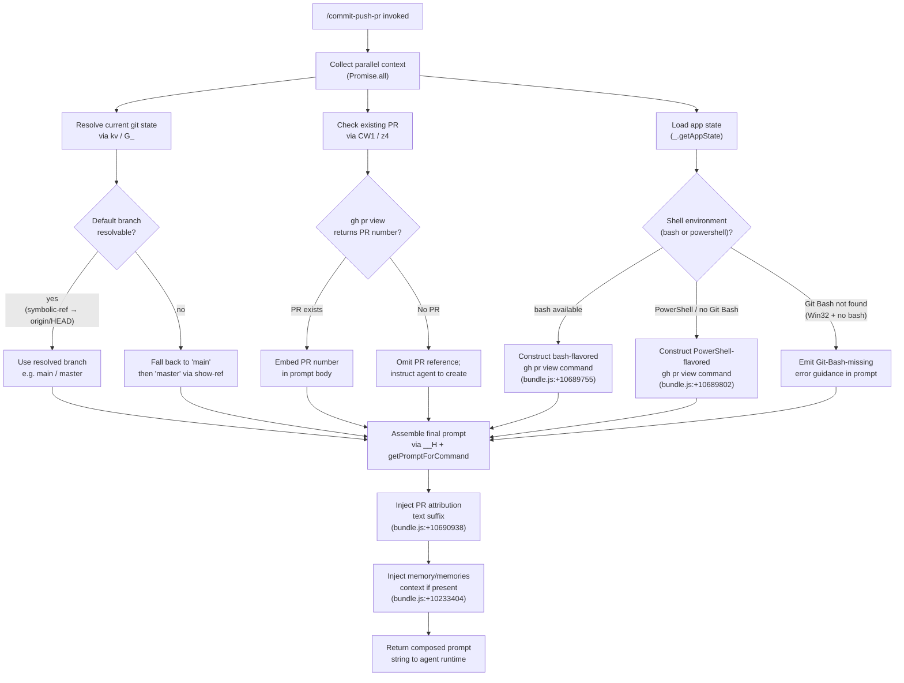

# `/commit-push-pr`

> Analysis basis: CC v2.1.150 bundle.js (AST extraction + Claude interpretation)
> Minimum version: v2.1.150

---

## Overview

The `/commit-push-pr` command is a `prompt`-type slash command that instructs the Claude agent to stage and commit local changes, push them to a remote branch, and open a pull request — all in one automated workflow. It delegates the full sequence to the agent by injecting a structured prompt through `getPromptForCommand`, which dynamically resolves the current PR state, default branch, and shell environment before composing the instruction text. The command is designed for interactive sessions and incorporates PR attribution metadata and memory context into the generated prompt.

---

## Registration

| Field | Value |
|---|---|
| type | `prompt` |
| name | `commit-push-pr` |
| description | `Commit, push, and open a PR` |
| loc_byte | `10692678` |
| loc_byte_end | `10693290` |
| loc_line | `8494` |
| handler_method | `getPromptForCommand` |
| handler_method_start | `10692882` |
| handler_method_end | `10693289` |
| prompt_body.length | `203` |
| prompt_body.trace | `call→__H(...) (1 literals)` |
| arbor_handler.name | `getPromptForCommand` |
| arbor_handler.kind | `Method` |
| arbor_handler.resolution_path | `direct` |
| arbor_handler.fqn | `claude-2.1.150::getPromptForCommand` |
| arbor_handler.n_hits | `3` |

Analysis basis: CC v2.1.150 bundle.js:+10692678

---

## Input Branching

The handler exhibits 4+ distinct branches: shell type detection (bash vs PowerShell), existing-PR detection, default-branch resolution, and memory/attribution injection. A Mermaid flowchart is used.



---

## Behavioral Spec

### Handler Entry — `getPromptForCommand`

The Arbor symbol graph resolves the handler as `getPromptForCommand` (kind: `Method`, resolution_path: `direct`, n_hits: 3). The BFS synthetic node `__handler_commit-push-pr` is bookkeeping only; all behavioral claims reference `getPromptForCommand` as the authoritative entry point.

Analysis basis: CC v2.1.150 bundle.js:+10692882

### Sub-feature: Parallel Context Gathering

```
async function gatherContext(appState):
    [gitContext, prContext] = await Promise.all([
        resolveGitDefaults(appState),   // kv → nd8 → h9H.get("defaultBranch")
        resolveExistingPR(appState)     // CW1 → z4
    ])
    return { gitContext, prContext }
```

`Promise.all` is invoked at the top of the handler to fetch the default branch and the existing PR number concurrently, minimising latency.

Analysis basis: CC v2.1.150 bundle.js:+10692928

### Sub-feature: Default Branch Resolution

```
async function resolveDefaultBranch():
    // Step 1: try persistent KV cache
    cached = await kvStore.get("defaultBranch")   // nd8 → h9H.get
    if cached:
        return cached

    // Step 2: ask git symbolic-ref for origin/HEAD
    result = await runGit(["symbolic-ref", "--short", "refs/remotes/origin/HEAD"])
    // literals: "symbolic-ref" +1069089, "--short" +1069104,
    //           "refs/remotes/origin/HEAD" +1069114
    if result.ok:
        branch = result.stdout.trim()
        kvStore.set("defaultBranch", branch)
        return branch

    // Step 3: check whether "main" exists
    mainExists = await runGit(["show-ref", "--verify", "--quiet", "refs/heads/main"])
    // literals: "show-ref" +1069296, "--verify" +1069307, "--quiet" +1069318
    if mainExists:
        return "main"   // literal "main" +1069227

    return "master"     // literal "master" +1069234
```

Analysis basis: CC v2.1.150 bundle.js:+1069047 (nd8), +1069080 (G_), +1069089 (symbolic-ref literal)

### Sub-feature: Existing PR Detection

```
async function resolveExistingPR(shellType):
    if shellType == "powershell":
        cmd = "gh pr view --json number 2>$null; if (-not $?) { \"\" }"
        // literal +10689802
    else:
        cmd = "gh pr view --json number 2>/dev/null || true"
        // literal +10689755

    raw = await runShell(cmd)           // z4 → a6, k9H
    parsed = JSON.parse(raw.trim())
    return parsed?.number ?? null
```

When the command returns a PR number, it is embedded in the prompt body so the agent targets the existing PR rather than creating a new one.

Analysis basis: CC v2.1.150 bundle.js:+10689750 (z4), +10689755 (bash literal), +10689802 (PowerShell literal)

### Sub-feature: Shell Environment Detection

```
function detectShell(appState):
    shell = appState.shell   // via S_ → H.getAppState
    if shell == "bash":
        verifyGitBashPresent()   // on win32, checks for Git Bash binary
        if platform == "win32" and gitBashMissing:
            embedErrorGuidance()   // Git-Bash-missing message in prompt
            // "shell: bash" frontmatter warning — see prompt_body
        return "bash"
    return "powershell"
```

The literals `"win32"` (+1045096), `"bash"` (+9784586), and `"powershell"` (+9784832) anchor this branch. The 203-character prompt body is the Git-Bash error message path; it is surfaced when the shell is configured as `bash` but the Git Bash executable is not found on Windows.

Analysis basis: CC v2.1.150 bundle.js:+9784586, +9784832, +1045096

### Sub-feature: Prompt Assembly (`__H`)

```
function buildCommitPushPrPrompt(context):
    // context = { defaultBranch, prNumber, shell, memories, attribution }

    base = templateInterpolate(promptTemplate, context)
    // promptTemplate is the body passed to __H (1 literal, length 203)
    // __H is called at bundle.js:+10693079

    if context.prNumber:
        base = base + attributionSuffix
        // ", ending with the attribution text shown in the example below"
        // literal +10690938

    if context.memories:
        base = appendMemoryBlock(base, context.memories)
        // keys "memory" +10233404, "memories" +10233413

    return base
```

The `__H` helper (called at +10693079) performs template substitution with one literal constant. It delegates to `dp` for app-state reads and to `m31` / `U31` for string normalisation. The final string is returned to the agent runtime as the user-visible prompt content.

Analysis basis: CC v2.1.150 bundle.js:+10693079 (__H call), +10690938 (attribution suffix), +10693111 (_.getAppState)

### Sub-feature: PR Attribution

```
function buildAttributionSuffix(prNumber):
    // Logged as "PR Attribution: returning default (no data)"
    // when attribution metadata is absent
    // literal +10233329
    if attributionData available:
        return formatAttribution(attributionData)
    else:
        return defaultAttributionText
```

The literal string `"PR Attribution: returning default (no data)"` (+10233329) is emitted to the debug log when no attribution metadata is available, confirming that attribution injection is always attempted.

Analysis basis: CC v2.1.150 bundle.js:+10233329

### Sub-feature: Context Window Passed to Agent (`Ow1`)

The `Ow1` helper prepares the conversation context slice forwarded alongside the prompt. It:

1. Calls `GhL` to collect existing tool-result entries from the conversation (via `Array.from` + `A.keys`, +10231851).
2. Calls `ZhL` to locate the last `compact_boundary` system message (`"compact_boundary"` literal +10232380) and slices the conversation to that boundary (`K.findLastIndex` +10232311, `K.slice` +10232407).
3. Calls `WhL` / `EhL` to filter out sidechain messages (`"isSidechain"` +10231625), meta messages (`"isMeta"` +10231664), and compact-summary messages (`"isCompactSummary"` +10231693).
4. Applies file-context enrichment via `vG_`, which runs `git diff --cached --name-status` (literals `"diff"` +5332758, `"--cached"` +5332765, `"--name-status"` +5332776) with a 5 000 ms timeout (number `5000` +5332815).

Analysis basis: CC v2.1.150 bundle.js:+10233115 (Promise.all), +10232380, +10232311, +10231625, +5332758

---

## State & Side Effects

| Item | Detail |
|---|---|
| Telemetry — `tengu_cobalt_ridge` | Fired during app-state dispatch path (`dp` → `V6`); loc +4786509 |
| Telemetry — `tengu_auto_mode_fallback_to_ask` | Fired when permission classifier falls back to interactive ask; loc +10314680 |
| Telemetry — `tengu_auto_mode_decision` | Fired on each auto-mode permission decision; loc +10315388 |
| Telemetry — `tengu_bash_allowlist_strip_all` | Fired when entire bash allowlist is stripped; loc +10316658 |
| Telemetry — `tengu_iron_gate_closed` | Fired when auto-mode classifier is unavailable and denies; loc +10319162 |
| Telemetry — `tengu_auto_mode_denial_limit_exceeded` | Fired when denial count ceiling is breached; loc +10308874 |
| Telemetry — `tengu_tool_empty_result` | Fired when a tool returns an empty result (e.g., gh CLI produces no output); loc +4894339 |
| Telemetry — `tengu_tool_result_persisted` | Fired after tool result is written to conversation; loc +4894579 |
| Telemetry — `tengu_bg_spare_enable` | Background spare-process management; not specific to this command; loc +15260204 |
| appState changes | `UtH` calls `H.setAppState` (+10308440) to update allowed_tools, avoid_prompts, effort, model fields after context resolution |
| KV store write | `G_` writes resolved default branch under key `"defaultBranch"` (+1058327) |
| Shell execution | Two shell commands conditionally executed: bash variant (`2>/dev/null`) and PowerShell variant (`2>$null`) for PR number lookup |
| git commands | `git symbolic-ref --short refs/remotes/origin/HEAD`, `git show-ref --verify --quiet`, `git diff --cached --name-status` |
| Hook registration | `jGA` registers process `exit` (+1040564) and `error` (+1040611) handlers on the child process |
| Memory context | `"memory"` / `"memories"` keys appended to prompt body when present in app state |
| Sound | <!-- TODO: not found in depth-2 traversal; needs --depth 4 --> |

---

## Version History

| Version | Change |
|---|---|
| v2.1.150 | Initial analysis; `getPromptForCommand` handler with bash/PowerShell branching, PR detection via `gh pr view`, attribution suffix, memory injection |

---

## Common Mistakes

1. **Running on Windows without Git Bash installed**: If the shell is configured as `bash` in frontmatter but Git Bash is not present, the command embeds an error guidance message rather than the commit/push/PR instructions. Install Git for Windows (https://git-scm.com/downloads/win) or switch the shell setting to `powershell`.
2. **`gh` CLI not authenticated**: The `gh pr view --json number` sub-command will fail silently (`2>/dev/null || true`), causing the command to treat the session as having no existing PR. Ensure `gh auth login` has been run before invoking `/commit-push-pr`.
3. **No remote configured**: `git symbolic-ref --short refs/remotes/origin/HEAD` will fail if `origin` is not set up, causing default-branch resolution to fall back through `show-ref` to `main` then `master`. Set `origin` explicitly if your default branch differs.
4. **Using in headless/non-interactive mode**: The command's permission handling path includes `"Action requires interactive approval and permission prompts are not available in this context"` (+10314559). In headless pipelines the agent may abort if the classifier denies the required git/gh operations.
5. **Compact boundary handling**: The context window slicing by `ZhL` means messages before the last `/compact` boundary are excluded. In long sessions this may omit relevant earlier context about the intended commit scope.

---

## Appendix — Identifier Mapping

> For bundle debugging only. Identifiers change across versions.

| Identifier | Role |
|---|---|
| `__handler_commit-push-pr` | Synthetic BFS entry node for the command handler (bookkeeping only; real handler is `getPromptForCommand`) |
| `kv` | Default-branch KV lookup orchestrator; calls `nd8` for cache read and `G_` for git resolution |
| `nd8` | KV cache reader; delegates to `h9H.get("defaultBranch")` |
| `G_` | Git-based default branch resolver; runs symbolic-ref and show-ref sub-commands |
| `lWH` | Child-process executor (shell/git runner); manages timeout, kill, stdio streams |
| `SGA` | Process-start helper; handles win32 `.exe` / `cmd /q` wrapping |
| `Sd8` | stdout accumulation helper |
| `Rd8` | stderr accumulation helper |
| `bd8` | Combined (all) stream accumulation helper |
| `U0A` | Numeric timeout validator (`Number.isFinite`) |
| `FK6` | Child-process result packager; emits `[object Error]` / `bufferedData` fields |
| `hd8` | `Reflect.apply` / `Reflect.defineProperty` shim for process handle |
| `jGA` | Event-listener registrar (`exit`, `error`) on child process |
| `p0A` | Timeout-race helper (`setTimeout` + `Promise.race` + `clearTimeout`) |
| `B0A` | Process-kill helper (`H.kill` / SIGTERM) |
| `u0A` | stdio data listener binder |
| `m0A` | Kill-on-close binder |
| `DGA` | Parallel stdio-stream collector (`Promise.all`) |
| `cK6` | Post-run output extractor (`Od8`) |
| `zGA` | Stream pipe setup (`A.pipe`) |
| `YGA` | Stream `add` registration (`fGA.default`) |
| `d0A` | Stream bind helper (`Gd8.bind`) |
| `D` | Top-level agent dispatch / background-spare orchestrator |
| `V6` | Conversation-state registry (has/get/add on `YOH`, `lg`, `e36`) |
| `Kv8` | macOS memory check + `V6` invocation |
| `kqA` | Background PTY-host spare-process spawner (`Bun.spawn`, `--bg-pty-host`) |
| `N` | Log-level router (`debug`, `warn`, `info`; delegates to `CH`, `HbH`, `$VK`) |
| `K8` | <!-- TODO: not found in depth-2 traversal; needs --depth 4 --> |
| `RH` | Error-logging helper; pushes to `dxH`, calls `ll.logError` |
| `OaK` | String coercion utility |
| `Ow1` | Conversation-context preparation; calls `GhL`, `ZhL`, `WhL`, `EhL`, `vG_` |
| `PCH` | <!-- TODO: not found in depth-2 traversal; needs --depth 4 --> |
| `FY6` | <!-- TODO: not found in depth-2 traversal; needs --depth 4 --> |
| `nD` | Environment/API-base resolver (staging vs production vs localhost) |
| `d_` | Module-export initialiser (`__esModule`, `j1A.set`) |
| `TX_` | API endpoint builder |
| `HA` | Settings loader; calls `hm` → `Wl8` (loads policy + flag settings from disk) |
| `hm` | Settings-load dispatcher; calls `DC`, `Tq`, `Wl8`, `rF`, `cy6` |
| `Tq` | Memory-usage tracker (`process.memoryUsage`, `XMA`, `ZMA`) |
| `Wl8` | Disk settings reader (`policySettings`, `flagSettings`, telemetry events `settings_load_started` / `settings_load_completed`) |
| `rF` | Settings merge helper; calls `j_`, `jA6`, `sR8`, `zA6`, etc. |
| `GhL` | Tool-result key collector (`Array.from`, `A.keys`, `Object.keys`) |
| `vG_` | File-context enricher; runs `git diff --cached --name-status`, computes stat, builds context array |
| `VDH` | File-read helper (`x6`, `F4`, `j_`) |
| `S6` | Path-normalisation helper (`Dv`) |
| `SOq` | File-type classifier (extension check via `gI7`, `hOq`, regex `L.test`) |
| `oI7` | File-open helper for generated files (`VDH`, `G_`, `n_`) |
| `COq` | Git-diff stat parser (`--stat`, `file changed` / `files changed` literals) |
| `ZhL` | Conversation-window slicer; finds last `compact_boundary`, slices with `K.findLastIndex` / `K.slice` |
| `VM` | Message-path builder (`Wh`, `$O`, `j_`, `UDH.join`) |
| `Pm6` | File-read chunker (opens with `Gm.open`, reads with `M.read`, uses `Buffer.allocUnsafe`) |
| `eWH` | Conversation-message parser (`raK`, `oaK`, `saK`, `aaK`) |
| `WhL` | User-message filter (removes sidechain / meta / compact-summary messages) |
| `EhL` | Assistant-message filter (`tool_use` type, `ThL.has`, `Yg_`) |
| `Yg_` | Team-member file checker (`Kw1.isTeamMemFile`) |
| `Xq` | Model-ID normaliser and classifier (AWS inference-profile detection) |
| `Yc6` | Model-tier enumerator (`Object.entries`) |
| `xj` | Model-string lowercaser / includes / replacer |
| `Fq` | Full model-context builder; calls `Wt`, `nq`, `QJ` |
| `Wt` | Model-display-name builder; calls `wv`, `gAH`, `TA`, `Xg` |
| `Xg` | Model-family mapper (anthropic prefix, opus/sonnet/haiku families) |
| `nq` | Model-alias resolver (opusplan, sonnet, haiku, opus, best) |
| `bW` | Model-alias sub-resolver (`ZqH`) |
| `GqH` | Model-include-list checker (`WqH.includes`) |
| `cv` | Model-context-window builder (`Z3`, `cf`) |
| `UpH` | Model-capability resolver (`cf`) |
| `GZ` | Model-provider resolver (`Z3`, `cf`) |
| `D79` | Model-default-provider getter (`GZ`) |
| `Z3` | Model-routing decision helper (`RA`) |
| `Fl6` | Model-include-list filter (`PI4.includes`) |
| `BpH` | Model-human-name builder (`mH`) |
| `QJ` | Model-full-context aggregator (`nq`, `CW`) |
| `CW` | Model-metadata combiner (EA, Zt, L$H, FpH, GZ, $P, Z3, RA, cf, cv) |
| `uOq` | Capability-string includes checker |
| `CW1` | PR-state resolver; calls `lyH`, `bW1`, `z4` |
| `lyH` | Shell-context builder for PR; calls `PCH`, `FY6`, `nD`, `Fq`, `K$H`, `v8_`, `HA` |
| `K$H` | Shell-string suffix checker (`H.endsWith`) and model-aware reformatter (`Xq`) |
| `v8_` | Shell-type variant selector (`K$H`) |
| `bW1` | PR-body string replacer (`H.replace`) |
| `z4` | Shell command runner for PR state (`a6`, `k9H`) |
| `__H` | Prompt-body template builder; calls `z4`, `dp`, `m31`, `q18`, `_W`, `EX`, `U31`, `_VL` |
| `dp` | App-state reader for prompt context (`a6`, `mH`, `t1`, `k9H`, `V6`) |
| `mH` | String coercer (calls `String`) |
| `t1` | Secondary string coercer (calls `String`) |
| `q18` | String replacer helper (`H.replace`) |
| `_W` | Bash-tool execution wrapper (`xaH`) |
| `xaH` | Tool-execution orchestrator; handles permission checks, auto-mode, sandboxing, tool allowlist |
| `uSL` | Permission pre-check (`isSandboxingEnabled`, `isAutoAllowBashIfSandboxedEnabled`, `checkPermissions`) |
| `S_` | App-state getter wrapper (`H.getAppState`, `v08`) |
| `UtH` | App-state updater (`Object.assign`, `H.setAppState`) |
| `Wc` | Safety-check loop (recursive `Wc.Wc`) |
| `QW8` | Permission-request accumulator (recursive `QW8.QW8`) |
| `rq` | MCP-tool prefix checker (`Object.hasOwn`, `H.startsWith`, `"mcp__"`) |
| `Am` | <!-- TODO: not found in depth-2 traversal; needs --depth 4 --> |
| `Ih` | <!-- TODO: not found in depth-2 traversal; needs --depth 4 --> |
| `ZE_` | <!-- TODO: not found in depth-2 traversal; needs --depth 4 --> |
| `Vdq` | Auto-mode pending-set adder (`q.add`) |
| `Bj6` | Auto-mode classifier invoker; handles refusal, parse_failure, no_tool_use, invalid_schema, interrupted, transcript_too_long |
| `HjH` | Auto-mode pending-set deleter (`q.delete`) |
| `Ul6` | Tool-use-result mapper (`q$H`) |
| `o_6` | Input-token counter (`zCH`, `Object.values`) |
| `Vw` | Output-token counter (`zCH`, `Object.values`) |
| `a_6` | Cache-read-token counter (`zCH`, `Object.values`) |
| `s_6` | Cache-creation-token counter (`zCH`, `Object.values`) |
| `Ck` | Conversation-registry accessor (`V6`) |
| `xSL` | App-state permission updater post-tool (`iw1`, `S_`, `c`, `rq`, `N`, `UtH`) |
| `bSL` | Tool-permission-context setter (`k7H`, `KaH`, `kjH`, `db`, `GN`, `N`, `c_`) |
| `EX` | Stop-sequence / message-type handler (`lj1`) |
| `lj1` | Response-type router (`$`, `f`; handles `stop_sequence`, `message`) |
| `f` | Tool-use-result value extractor (`UyH`, `gDK`, `L.get`, `N`, `L.values`, `lv5`) |
| `HcH` | Tool-result block mapper (`H.mapToolResultToToolResultBlockParam`, `wqq`, `Yqq`) |
| `wqq` | Tool-result content normaliser (`kW7`, `c`, `rq`, `Xqq`, `Pqq`, `NYH`, `kYH`, `IYH`, `Math.ceil`) |
| `kW7` | Text-content validator (`H.trim`, `Array.isArray`, `H.every`) |
| `Xqq` | Array-content checker (`Array.isArray`, `H.some`) |
| `Pqq` | Content reducer (`H.reduce`) |
| `NYH` | Non-text-content handler (raises `"Cannot persist tool results containing non-text content"`) |
| `kYH` | <!-- TODO: not found in depth-2 traversal; needs --depth 4 --> |
| `IYH` | Token-use recorder (`j1`) |
| `Yqq` | Token-count validator (`Number.isFinite`, `V6`, `Math.min`) |
| `U31` | Prompt-string builder (trim, push, join array of parts) |
| `_VL` | Prompt-string post-processor (`U31`, `EH`) |
| `EH` | String constructor wrapper |

---

Note: index built via Arbor fallback; some signals (telemetry, literals) may be missing — see arbor-fallback.js.