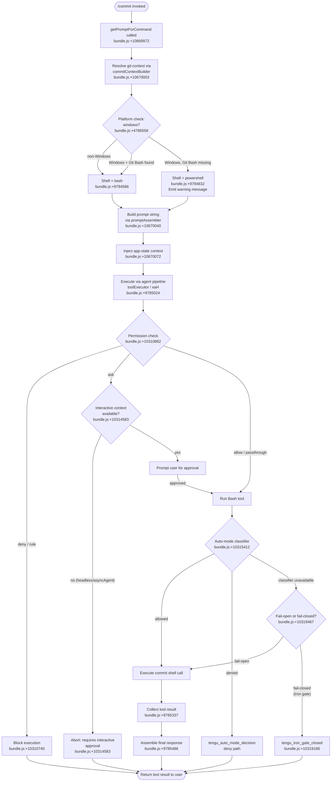

# `/commit`

> Analysis basis: CC v2.1.149 bundle.js (AST extraction + Claude interpretation)
> Minimum version: v2.1.149

---

## Overview

`/commit` is a `prompt`-type slash command that instructs the Claude Code agent to create a git commit in the current repository. It assembles a prompt via `getPromptForCommand`, dispatches it through the full tool-execution pipeline (including permission checks, shell-type resolution, and auto-mode classification), and returns a user-visible text result. On Windows, the command performs runtime detection to decide whether Bash or PowerShell is the appropriate shell before constructing the final instruction.

---

## Registration

| Field | Value |
|---|---|
| `type` | `prompt` |
| `name` | `commit` |
| `description` | Create a git commit |
| `loc_byte` | 10669819 |
| `loc_byte_end` | 10670243 |
| `loc_line` | 8414 |
| `handler_method` | `getPromptForCommand` |
| `handler_method_start` | 10669966 |
| `handler_method_end` | 10670242 |
| `prompt_body.length` | 203 characters |
| `prompt_body.trace` | `call→__H(...) (1 literals)` |
| `arbor_handler.name` | `getPromptForCommand` |
| `arbor_handler.fqn` | `claude-2.1.149::getPromptForCommand` |
| `arbor_handler.kind` | `Method` |
| `arbor_handler.resolution_path` | `direct` (symbol falls inside the registration byte range) |
| `arbor_handler.n_hits` | 2 |

Analysis basis: CC v2.1.149 bundle.js:+10669819

---

## Input Branching

The handler has four or more distinct execution paths, driven by shell-type detection, Windows Git Bash availability, permission-check outcomes, and auto-mode classifier results. A Mermaid flowchart is therefore required.



---

## Behavioral Spec

### 1. Handler Dispatch — `getPromptForCommand`

The registration object carries `handler_method: "getPromptForCommand"`, meaning the handler is an inline `ObjectMethod` on the registration object rather than a module-level function. Arbor resolved this via `resolution_path: direct`. The Arbor-preferred name is `getPromptForCommand`; the BFS synthetic entry `__handler_commit` is bookkeeping only and is not a real bundle symbol.

```
method getPromptForCommand(context):
    shellType = resolveShellType(context.platform)   // BuL → z4
    promptText = buildPromptText(shellType)           // __H literal injection
    appState   = context.getAppState()               // _.getAppState
    return { type: "text", content: promptText }     // literal "text" at +10670022
```

Analysis basis: CC v2.1.149 bundle.js:+10669966

---

### 2. Shell-Type Resolution — `platformShellResolver` (`BuL` → `z4`)

Before assembling the prompt, the command determines which shell is available.

```
function platformShellResolver(platform):
    if platform == "windows":                        // literal at +4786558
        if gitBashExists():                          // k9H check at +4786584
            return "bash"
        else:
            return "powershell"                      // literal at +9784832
    else:
        return "bash"                                // literal at +9784586
```

On a Windows host where Git Bash is absent, the returned shell is `"powershell"` and a diagnostic message is embedded in the prompt body (referencing the Git for Windows download URL). This is the source of the 203-character `prompt_body` fragment recovered by the extractor.

Analysis basis: CC v2.1.149 bundle.js:+10670003, +4786558, +9784586, +9784832

---

### 3. Prompt Assembly — `promptAssembler` (`__H`)

`__H` is the central prompt-construction function called from the handler. It:

1. Validates that a `"bash"` tool is declared in the current tool context (`+9784586`).
2. Scans for `"!`"` prefixed deny-patterns in the tool config (`+9784902`).
3. Calls `Promise.all` to gather asynchronous context (staged diff, branch name, recent log) (`+9784945`).
4. Applies string normalization via `patternReplacer` (`q18 → H.replace`, `+9784908`).
5. Builds a UUID for the operation via `p31.randomUUID` (`+9785345`).
6. Assembles the final instruction string using `responseFormatter` (`AVL`, `+9785486`) and `lineJoiner` (`U31`, `+9785403`).
7. Returns the assembled prompt as the agent's task description.

```
async function promptAssembler(toolCtx, appState):
    assertToolAvailable("bash", toolCtx)            // +9784586
    denyPatterns = extractDenyPatterns(toolCtx)     // "!`" literal +9784902
    [diff, branch, log] = await Promise.all([...])  // +9784945
    normalizedDiff = patternReplacer(diff)          // q18 +9784908
    opUUID = crypto.randomUUID()                    // p31.randomUUID +9785345
    lines = lineJoiner([branch, normalizedDiff])    // U31 +9785403
    return responseFormatter(lines)                 // AVL +9785486
```

Analysis basis: CC v2.1.149 bundle.js:+10670040, +9784586, +9784945, +9785345

---

### 4. Permission & Safety Pipeline — `toolExecutor` (`xaH`)

The tool executor (`xaH`) is the largest sub-system reached from the handler. It implements multi-layer permission checks before the Bash tool is actually run.

```
async function toolExecutor(toolCall, session):
    // Layer 1: Static rule lookup
    decision = permissionRuleEngine(toolCall)       // mSL +10310706
    if decision == "deny":
        return blocked("deny")                      // +10310740
    if decision == "rule":
        return blocked("rule")                      // +10310768

    // Layer 2: Context-mode guard
    if session.mode == "asyncAgent":               // +10314563
        if requiresUserInteraction(toolCall):      // +10314942
            abort("Action requires interactive approval…")  // +10314583

    // Layer 3: Auto-mode classifier
    classifierResult = autoModeClassifier(toolCall, session)  // Bj6
    emit telemetry("tengu_auto_mode_decision")     // +10315412
    if classifierResult == "allowed":
        proceed()
    elif classifierResult == "denied":
        emit telemetry("tengu_auto_mode_fallback_to_ask")  // +10314704
        return ask(toolCall)
    elif classifierResult == "unavailable":
        if session.isHeadless:
            emit telemetry("tengu_iron_gate_closed")  // +10319186
            return denied("fail-closed")
        else:
            log("fail-open fallback")              // +10319467
            proceed()

    // Layer 4: Bash allowlist strip
    if bashAllowlistStripsAll(toolCall):
        emit telemetry("tengu_bash_allowlist_strip_all")  // +10316682
        return blocked("allowlist")

    // Execute
    result = runBashTool(toolCall)
    return result
```

Analysis basis: CC v2.1.149 bundle.js:+10313773, +10310740, +10315412, +10319186

---

### 5. Dangerous Operation Guards

Within the permission rule engine (`mSL`), two hard-coded safety strings are checked before any `rm`-family operation is allowed:

- `"Dangerous rm operation"` (`+10311673`)
- `"Dangerous rmdir operation"` (`+10311720`)

These cause the tool executor to stop and surface an explicit denial message, preventing `/commit` post-hooks or pre-commit scripts from accidentally running destructive shell commands without user awareness.

Analysis basis: CC v2.1.149 bundle.js:+10311673, +10311720

---

### 6. Tool-Result Handling — `toolResultMapper` (`HcH`)

After the Bash tool completes, the result is normalized by `toolResultMapper`:

```
function toolResultMapper(rawResult):
    if isEmpty(rawResult):
        emit telemetry("tengu_tool_empty_result")   // +4894339
        return emptyPlaceholder()
    if containsNonText(rawResult):                  // images, documents
        throw "Cannot persist tool results containing non-text content"  // +4893167
    truncated = tokenBudgetTruncate(rawResult)      // Yqq → Math.min +4892836
    emit telemetry("tengu_tool_result_persisted")   // +4894579
    return truncated
```

Analysis basis: CC v2.1.149 bundle.js:+4893832, +4894339, +4894579

---

### 7. Auto-Denial Limit Guard — `denialLimitGuard` (`uSL`)

A separate guard counts classifier denials within a session and aborts the agent if limits are exceeded:

```
function denialLimitGuard(session):
    counts = session.getDenialCounts()    // "total", "consecutive" literals +10308947/+10308955
    if session.isHeadless or session.isCLI:
        if counts.consecutive > threshold or counts.total > threshold:
            emit telemetry("tengu_auto_mode_denial_limit_exceeded")  // +10308898
            abort("Agent aborted: too many classifier denials in headless mode")  // +10309089
```

Analysis basis: CC v2.1.149 bundle.js:+10308898, +10309089

---

### 8. Windows Platform Detection Detail — `windowsChecker` (`z4`)

```
function windowsChecker():
    os = getPlatform()                  // a6 at +4786551
    if os == "windows":                 // literal +4786558
        return checkGitBashPath()       // k9H at +4786584
    return null
```

Analysis basis: CC v2.1.149 bundle.js:+4786551, +4786558, +4786584

---

## State & Side Effects

| Item | Detail |
|---|---|
| **Telemetry: `tengu_auto_mode_decision`** | Fired for every auto-mode permission decision on any tool call within the pipeline (bundle.js:+10315412) |
| **Telemetry: `tengu_auto_mode_fallback_to_ask`** | Fired when classifier returns a deny and control falls back to interactive ask flow (bundle.js:+10314704) |
| **Telemetry: `tengu_auto_mode_denial_limit_exceeded`** | Fired when the session's consecutive or total denial count crosses the threshold in headless/CLI mode (bundle.js:+10308898) |
| **Telemetry: `tengu_iron_gate_closed`** | Fired when the auto-mode classifier is unavailable in headless mode and the system fails closed (bundle.js:+10319186) |
| **Telemetry: `tengu_bash_allowlist_strip_all`** | Fired when the Bash allowlist strips every permitted pattern, effectively blocking execution (bundle.js:+10316682) |
| **Telemetry: `tengu_tool_empty_result`** | Fired when the Bash tool returns an empty result (bundle.js:+4894339) |
| **Telemetry: `tengu_tool_result_persisted`** | Fired when a non-empty tool result is successfully persisted (bundle.js:+4894579) |
| **Telemetry: `tengu_cobalt_ridge`** | Fired inside the Windows/platform detection path (bundle.js:+4786509) |
| **appState changes** | `getAppState` read at +10670072; `setAppState` written via `UtH` at +10308464 (e.g., `allowed_tools`, `avoid_prompts`, `effort`, `model` fields updated) |
| **File-system side effects** | `SJK.unlinkSync` reachable via `q` → `nD` path (+15239407); temp files used during diff assembly may be unlinked after use |
| **Permission context** | `q.setToolPermissionContext` called inside `xSL` at +10307855; modifies the live permission registry for the session |
| **Sound** | No sound events found in depth-2 traversal |
| **Hook registration** | `xSL` registers/checks hooks (`GN` at +10307887); hook-rewritten inputs are re-evaluated with `"ask rule on hook-rewritten input"` label (+10307750) |

---

## Version History

| Version | Change |
|---|---|
| v2.1.149 | Initial analysis — `prompt`-type registration at byte range (10669819, 10670243); `getPromptForCommand` handler confirmed via Arbor `direct` resolution |

---

## Common Mistakes

1. **Assuming Bash is always available on Windows.** The handler silently switches to PowerShell when Git Bash is not installed. If your workflow depends on Bash-specific syntax in pre-commit hooks, `/commit` will use PowerShell instead, which may produce different behaviour or errors. Install Git for Windows to restore Bash.

2. **Running `/commit` in headless / non-interactive mode without pre-approving the Bash tool.** In `asyncAgent` or headless contexts the command aborts immediately if interactive approval would be required (`+10314583`). Pre-authorize the `bash` tool via `allowed_tools` in settings or with `--allowedTools` on the CLI.

3. **Expecting `/commit` to work when all Bash allowlist patterns are stripped.** If your project's permission rules strip every allowed Bash pattern, `tengu_bash_allowlist_strip_all` is fired and the commit is blocked silently. Check your `--allowedTools` configuration.

4. **Relying on commit output in non-text formats.** The tool-result mapper (`HcH`) throws an error if the result contains images or documents (`+4893167`). Any pre-commit hook that outputs binary content will cause the command to fail.

5. **Misreading the Arbor handler name.** The bundle's BFS bookkeeping creates a synthetic `__handler_commit` entry; this is **not** a real callable. The actual handler is `getPromptForCommand` (Arbor FQN: `claude-2.1.149::getPromptForCommand`).

---

## Appendix — Identifier Mapping

> For bundle debugging only. Identifiers change across versions.

| Identifier | Role |
|---|---|
| `__handler_commit` | Synthetic BFS entry point for the `/commit` handler (not a real bundle symbol) |
| `BuL` | Git-context builder; dispatches to `platformShellResolver` and `windowsChecker` |
| `lyH` | Connection/environment resolver; checks remote vs. local context |
| `PCH` | Platform/connection-type checker (called from environment resolver) |
| `FY6` | Environment flag reader (called from multiple paths) |
| `nD` | Local environment setup helper; calls `d_` and temp-file unlinker |
| `d_` | Module/process initializer; sets up ESModule flag and internal maps |
| `q` | Temp-file unlink wrapper (calls `SJK.unlinkSync`) |
| `TX_` | Staging-environment URL resolver (localhost / staging / production) |
| `Fq` | Model-resolution orchestrator; delegates to `Wt` and `QJ` |
| `Wt` | Model capability assembler |
| `nq` | Model-name normalizer (trim, lowercase, replace) |
| `QJ` | Model query helper |
| `K$H` | Model context-window suffix checker (e.g., `" (1M context)"`) |
| `Xq` | Inference-profile resolver |
| `v8_` | Variant of context-window checker |
| `HA` | Settings loader dispatcher |
| `hm` | Settings-from-disk loader (emits `loadSettingsFromDisk_start` / `_end` telemetry) |
| `z4` | Windows platform + Git Bash availability checker |
| `__H` | Prompt assembly function; core of the `/commit` instruction builder |
| `dp` | Git diff / staging-area data fetcher |
| `mH` | String-to-boolean coercion helper (`"yes"/"on"` → true) |
| `t1` | Inverse string-to-boolean coercion helper (`"no"/"off"` → false) |
| `V6` | Tool-permission registry updater (read/write `YOH`, `lg`, `FM_` sets) |
| `_$6` | Permission-set initializer |
| `A$6` | Permission-set secondary initializer |
| `we` | Permission entry constructor |
| `we6` | Permission deduplication / merge helper |
| `m6` | Permission-change event emitter (uses `Date.now`, `Et4`) |
| `q18` | Diff-string pattern replacer |
| `_W` | Agent pipeline entry; dispatches to `toolExecutor` (`xaH`) |
| `xaH` | Tool executor — main permission and execution orchestrator |
| `mSL` | Permission rule engine (deny / rule / ask / passthrough / allow) |
| `A` | App-state accessor (lowercase variant) |
| `S_` | App-state reader with `allowed_tools` / `avoid_prompts` extraction |
| `DE6` | App-state field extractor |
| `UtH` | App-state writer (`Object.assign` + `setAppState`) |
| `$j1` | Pre-execution hook runner |
| `Wc` | Recursive sub-command executor |
| `QW8` | Recursive permission-check walker |
| `Kj1` | Post-execution hook runner |
| `c` | Utility: object/key accessor |
| `rq` | MCP-tool prefix checker (`"mcp__"` string, `Object.hasOwn`) |
| `FW8` | Fast-path permission resolver |
| `N` | Message/notification formatter (uppercase, trim, include checks) |
| `Am` | Auto-mode allowlist checker |
| `Ih` | Interactive permission prompt displayer |
| `RH` | Error handler for tool execution failures (logs via `ll.logError`) |
| `ZE_` | Auto-mode classifier session state manager |
| `Vdq` | Classifier request adder (`q.add`) |
| `Bj6` | Auto-mode classifier core logic (rounds, slices, Math.round, Date.now) |
| `HjH` | Classifier request cleaner (`q.delete`) |
| `Ul6` | Token-usage tracker (calls `q$H`) |
| `o_6` | Input-token counter (uses `Object.values`, `zCH`) |
| `Vw` | Output-token counter |
| `a_6` | Cache-read-token counter |
| `s_6` | Cache-creation-token counter |
| `Ck` | Permission-registry snapshot helper |
| `zj1` | Context-window overflow handler (transcript-too-long path) |
| `iw1` | Fallback-to-manual-approval handler |
| `uSL` | Denial-limit guard (consecutive / total counts) |
| `Oj1` | Headless abort handler |
| `xSL` | Hook-rewrite and permission-context setter |
| `fj1` | Unavailable-context error handler (`"Permission prompts are not available"`) |
| `EX` | Stop-sequence / message-type dispatcher |
| `nj1` | Stop-sequence handler |
| `$` | Task-list state accessor |
| `f` | Tool-call lookup by ID (uses `L.get`, `L.values`) |
| `L` | Active-call registry (add/delete/finally) |
| `M` | Session close handler (closes streams) |
| `HcH` | Tool-result mapper and truncator |
| `wqq` | Tool-result normalizer |
| `yW7` | Text-content validator (trim, Array.isArray, every) |
| `Xqq` | Non-text content type detector (image / document) |
| `Pqq` | Result reducer |
| `NYH` | Result persistence handler (EEXIST guard, non-text error) |
| `kYH` | Result size estimator |
| `IYH` | Result content joiner |
| `Yqq` | Token-budget truncator (Number.isFinite, Math.min) |
| `U31` | Line joiner for prompt assembly (trim, push, join) |
| `_` | Secondary utility / string accessor |
| `K` | Column formatter (map + padEnd, 40-char padding) |
| `AVL` | Response formatter (final prompt string assembler) |
| `EH` | String coercion wrapper |

---

Note: index built via Arbor fallback; some signals (telemetry, literals) may be missing — see arbor-fallback.js.