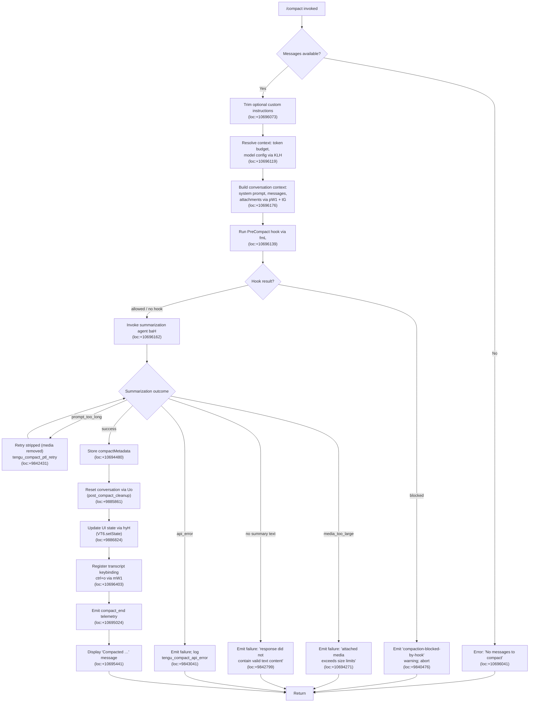

# `/compact`

> Analysis basis: CC v2.1.150 bundle.js (AST extraction + Claude interpretation)
> Minimum version: v2.1.150

---

## Overview

`/compact` frees up context window space by summarizing the current conversation history into a compact representation, then replacing the conversation with that summary. It supports an optional argument for custom summarization instructions and can run non-interactively (e.g., in scripts or SDK usage). The command also triggers pre-compaction lifecycle hooks and emits post-compaction telemetry.

---

## Registration

| Field | Value |
|---|---|
| type | `local` |
| name | `compact` |
| description | `Free up context by summarizing the conversation so far` |
| argumentHint | `<optional custom summarization instructions>` |
| supportsNonInteractive | `true` |
| thinClientDispatch | `post-text` |
| module_id | `UW1` |
| load_inline | `true` |
| loc_byte | `10697004` |
| loc_byte_end | `10697317` |
| loc_line | `8500` |
| arbor_handler.name | `MmL` |
| arbor_handler.fqn | `claude-2.1.150::MmL` |
| arbor_handler.kind | `AsyncFunction` |
| arbor_handler.resolution_path | `module_id` |
| arbor_handler.n_hits | `0` |

Analysis basis: CC v2.1.150 bundle.js:+10697004

---

## Input Branching

The command has more than three distinct execution branches (no messages available, custom instructions provided vs. absent, pre-compact hook blocking, compaction failure modes), so a flowchart is used.



---

## Behavioral Spec

### Handler Entry — `MmL` (compactHandler)

The top-level handler is the async function `MmL`.

```
async function compactHandler(args, context):
    // 1. Guard: need at least one message
    messages = getConversationMessages(context)  // via XO (loc:+10696010)
    if messages is empty:
        throw Error("No messages to compact")     // loc:+10696041

    // 2. Parse optional custom instructions
    customInstructions = args.trim()              // via H.trim (loc:+10696073)

    // 3. Resolve token budget and model configuration
    tokenBudget = resolveTokenBudget(context)     // via KLH (loc:+10696119)

    // 4. Build full context for the summarizer
    conversationContext = buildConversationContext(context)  // via fmL (loc:+10696139)
    systemPrompt = buildSystemPrompt(context)               // via pW1 (loc:+10696176)

    // 5. Pre-compact hook execution
    hookResult = runPreCompactHook(conversationContext)     // via fmL → HV → dvL
    if hookResult.blocked:
        emitWarning("compaction-blocked-by-hook")          // loc:+9840476
        return

    // 6. Summarization
    summary = await runSummarizationAgent(
        messages, systemPrompt, customInstructions, tokenBudget
    )                                                      // via baH (loc:+10696162)

    // 7. Handle failure modes
    switch summary.failureReason:
        case "prompt_too_long":
            summary = await retryStripped(messages)        // tengu_compact_ptl_retry (loc:+9842431)
        case "media_too_large":
            emitFailure("Compaction failed · attached media exceeds size limits") // loc:+10694271
            return
        case "no_summary":
            emitFailure("Failed to generate conversation summary ...")            // loc:+9842799
            return
        case "api_error":
            emitFailure("unknown error")                                          // loc:+10694396
            return

    // 8. Store metadata
    storeCompactMetadata(summary)                          // loc:+10694480

    // 9. Reset conversation state
    resetConversation(context)                             // via Uo (loc:+10696331)

    // 10. Update UI state
    updateUIState()                                        // via hyH (loc:+10696306)

    // 11. Wire transcript keybinding (ctrl+o)
    registerTranscriptToggle()                             // via mW1 (loc:+10696403)

    // 12. Emit final display message
    display("Compacted " + summaryStats)                   // loc:+10695441
```

Analysis basis: CC v2.1.150 bundle.js:+10696010 – +10696762

---

### Sub-feature: Message Collection — `XO` (getMessageSlice)

```
function getMessageSlice(conversation):
    // Returns array of conversation turns suitable for compaction
    // Uses aW8 (loc:+10407764) for message normalization
    // Uses H.slice (loc:+10407787) to extract the relevant window
    // A compact_boundary marker (loc:+10407634) delimits the prior compact point
    // Returns [] if no messages exist after boundary
    messages = conversation.slice(compactBoundaryIndex)
    return normalizeMessages(messages)
```

Analysis basis: CC v2.1.150 bundle.js:+10407634, +10407764, +10407787

The literal `"compact_boundary"` (loc:+10407634) is used as a message-type marker that separates previously compacted history from the current window. When a boundary exists, only messages after it are included in the next compaction.

---

### Sub-feature: Token Budget Computation — `KLH` (resolveTokenBudget)

```
function resolveTokenBudget(context):
    // Step 1: resolve effective model via WJH → V6 (loc:+9886956)
    model = resolveModel(context)

    // Step 2: look up context window size via JG (loc:+9887024)
    //   - parseInt + isNaN guard (loc:+2918732, +2918792)
    //   - model-specific max output tokens known at compile time
    //   - e.g. claude-3-opus → 4096 (loc:+2919805)
    //          claude-3-5-sonnet → 8192 (loc:+2919849)
    maxOutputTokens = lookupModelTokenLimit(model)

    // Step 3: compute budget via v28 → HB_ (loc:+9895048)
    //   - HB_ parses "auto" string (loc:+9894730)
    //   - handles numeric suffixes: divide by 1000 (loc:+9894835), percent (loc:+9894871)
    //   - Math.round applied (loc:+9894944)
    //   - autoCompactEnabled flag checked (loc:+9896908)
    budget = parseTokenBudget(config, maxOutputTokens)
    return budget
```

Analysis basis: CC v2.1.150 bundle.js:+9887006, +9887024, +9894730, +9896908

---

### Sub-feature: Context Assembly — `fmL` (buildConversationContext)

```
async function buildConversationContext(context):
    startTime = performance.now()                     // loc:+10693523

    // Build normalized message array (excludes system messages, attachments)
    normalizedMessages = await buildHVContext()       // via HV (loc:+10693545)
    // HV → dvL → OYH assembles: assistant, user, api_system, attachment
    //   message types filtered (loc:+9926394, +9926416, +9926433, +9926512)

    // Resolve MCP server context
    mcpContext = await Promise.all([buildMcpContextOc()])  // via Oc (loc:+10693585)
    // Oc → b7 + YW assemble server list, tool schemas, hook context

    // Retrieve app state for system prompt
    appState = pW1(context)                           // loc:+10693660

    // Finalize message list
    messageList = await $28(normalizedMessages)       // loc:+10693671

    // Determine stream mode
    streamMode = SU_(context)                         // loc:+10693744
    // SU_ → sU_ performs the actual compaction pass with j28

    return { normalizedMessages, mcpContext, appState, messageList, streamMode }
```

Analysis basis: CC v2.1.150 bundle.js:+10693523, +10693545, +10693585, +10693660, +10693671, +10693744

---

### Sub-feature: System Prompt Construction — `pW1` (buildSystemPrompt)

```
async function buildSystemPrompt(context):
    appState = context.getAppState()                  // H.getAppState (loc:+10695497)

    // Collect all context modules via tG (loc:+10695521)
    // tG assembles many system prompt sections:
    //   env_info_static (loc:+12974528)
    //   env_info_simple (loc:+12974565)
    //   language (loc:+12974603)
    //   output_style (loc:+12974638)
    //   context_management (loc:+12974722)
    //   memory sections via V$6 (loc:+12974486)
    //   team memory if enabled (zEH.isTeamMemoryEnabled, loc:+3280949)
    //   brief mode if enabled (hM5.qM5.isBriefEnabled, loc:+12983013)

    conversationHistory = Array.from(context.messages)   // loc:+10695564
    systemPrompt = $u(context)                           // loc:+10695621
    // $u calls H.getSystemPrompt (loc:+9135924)
    // checks for main-thread context (loc:+9136079)
    // resolves allowed_tools, avoid_prompts, model (loc:+10589516, +10589571, +10589686)

    return await Promise.all([systemPrompt, conversationHistory])  // loc:+10695807
```

Analysis basis: CC v2.1.150 bundle.js:+10695497, +10695521, +10695807

---

### Sub-feature: Summarization Core — `baH` (runSummarizationAgent)

```
async function runSummarizationAgent(messages, systemPrompt, customInstructions, budget):
    startTime = performance.now()                     // loc:+9841159

    // Create OTel span for compaction tracing
    span = mj6("claude_code.compaction")              // loc:+9841183
    // span.type = "claude_code.compaction" (loc:+9841183)

    // Classify trigger: manual vs auto
    triggerKind = "compact_manual"                    // loc:+9841134 (manual invocation)
    // (reactive path uses "compact_auto", loc:+9841119)

    // Guard: must have enough messages
    if messages.length < 2:
        emitTelemetry("tengu_compact", {reason:"compact_not_enough_messages"})  // loc:+9841321
        return {failure: "not_enough"}

    // Build summarizer system prompt via S_ + $28 + SU_
    summarizerPrompt = buildSummarizerPrompt(messages, customInstructions)

    // Invoke the AI summarization loop via sU_ → j28 → FVL
    // FVL is the reactive compact core (loc:+9858938):
    //   - Uses "reactive-compact" label (loc:+9859103)
    //   - Denies all tool use: "Tool use is not allowed during compaction" (loc:+9851869)
    //   - Compaction agent must only produce text summary (loc:+9851949)
    result = await runCompactionLoop(summarizerPrompt, budget)

    // Handle prompt_too_long retry
    if result.failureReason == "prompt_too_long":
        emitTelemetry("tengu_compact_ptl_retry")      // loc:+9842431
        result = await retryWithStrippedMedia(messages, budget)

    // Validate summary
    summaryText = extractSummaryText(result)
    if summaryText is empty:
        emitTelemetry("tengu_compact", {reason:"compact_no_summary"})  // loc:+9842771
        return {failure: "no_summary"}

    // Wrap summary in <summary> tag (loc:+9822208)
    wrappedSummary = "<summary>" + summaryText

    // Store compactMetadata (loc:+10694480)
    storeMetadata({summary: wrappedSummary, ...tokenStats})

    // Emit success telemetry
    emitTelemetry("tengu_compact", {result:"success"})  // loc:+10695225
    return {success: true, summary: wrappedSummary}
```

Analysis basis: CC v2.1.150 bundle.js:+9841159, +9841183, +9841321, +9842431, +9851869, +9822208, +10694480

---

### Sub-feature: Conversation Reset — `Uo` (postCompactCleanup)

```
function postCompactCleanup(context):
    // Emit "post_compact_cleanup" phase marker (loc:+9885861)

    // Flush precomputed compact (W28 → X28, Ju.delete) (loc:+9885855)
    flushPrecomputedCompact()

    // Clear tool caches (wD6 → TE) (loc:+9885908)
    clearToolCaches()

    // Clear subagent/background session state
    //   Z28 → lw1.clear (loc:+9885929)
    //   o0q → bj6.clear + KE_.clear (loc:+9885935)
    clearAgentState()

    // Reset autonomous loop delivered flag
    LvL.resetAutonomousLoopDelivered()                // loc:+9885967

    // Reset display/render state (Vw → zCH, Object.values) (loc:+9886017)
    resetDisplayState()

    // Run post-compact hook chain (iU_) (loc:+9886123)
    runPostCompactHooks()
```

Analysis basis: CC v2.1.150 bundle.js:+9885861, +9885929, +9885967, +9886017

---

### Sub-feature: Reactive Compact Path — `sU_` / `j28` / `FVL`

The reactive compact path is triggered automatically when context usage reaches ~80% (literal `80` at loc:+9890612). It shares the same summarization pipeline but uses `"compact_auto"` label and emits `tengu_reactive_compact_attempt` / `tengu_reactive_compact_succeeded` / `tengu_reactive_compact_failed`.

```
function reactiveCompactAttempt(context):
    // Usage threshold check: 80% (loc:+9890612)
    if usagePercent < 80: return

    emitTelemetry("tengu_reactive_compact_attempt")   // loc:+9861722

    // Require at least 2 groups (loc:+9860999)
    if groups.length < 2:
        log("Reactive compact: fewer than 2 groups, nothing to compact")
        emitTelemetry with reason "too_few_groups"    // loc:+9861089
        return

    // Must have assistant messages in the summarize set
    if no assistant messages:
        log("Reactive compact: no assistant messages in summarize set, bailing")
        emitTelemetry with reason "exhausted"         // loc:+9861663
        return

    // Run summarization (FVL reactive-compact core)
    result = await summarizeMessageWindow(messages)

    if result.failed:
        emitTelemetry("tengu_reactive_compact_failed")  // loc:+9890485
    else:
        emitTelemetry("tengu_reactive_compact_succeeded")  // loc:+9892739
```

Analysis basis: CC v2.1.150 bundle.js:+9890612, +9860999, +9861089, +9861663, +9890485, +9892739

---

## State & Side Effects

| Item | Detail |
|---|---|
| Telemetry — `tengu_compact` | Emitted on each compaction attempt; carries `result`, `trigger`, and token stats (loc:+9844342) |
| Telemetry — `tengu_compact_ptl_retry` | Emitted when a prompt-too-long error triggers a retry with stripped media (loc:+9842431) |
| Telemetry — `tengu_compact_cache_prefix` | Emitted when cache-prefix sharing is evaluated (loc:+9841959) |
| Telemetry — `tengu_compact_cache_sharing_success` | Cache prefix sharing succeeded (loc:+9852746) |
| Telemetry — `tengu_compact_cache_sharing_fallback` | Cache prefix sharing fell back (loc:+9853376) |
| Telemetry — `tengu_compact_failed` | Emitted on final failure (loc:+9855467) |
| Telemetry — `tengu_reactive_compact_attempt` | Auto-compact threshold crossed (loc:+9861722) |
| Telemetry — `tengu_reactive_compact_succeeded` | Auto-compact succeeded (loc:+9892739) |
| Telemetry — `tengu_reactive_compact_failed` | Auto-compact failed (loc:+9890485) |
| Telemetry — `tengu_precomputed_compact_discarded` | Pre-computed compact result was invalidated (loc:+9869418) |
| Telemetry — `tengu_post_compact_file_restore_success/error` | File @-mention restoration after compaction (loc:+9855949, +9855991) |
| Hook registration | Fires `PreCompact` hook before summarization; fires post-compact hook chain (`iU_`) after reset (loc:+9885967) |
| appState changes | `compactMetadata` is written to appState (loc:+10694480); `VT6.setState` called via `hyH` (loc:+9886824) |
| Conversation reset | Clears `lw1`, `bj6`, `KE_` caches, flushes precomputed compact from `Ju` map, resets autonomous loop delivered flag (loc:+9885929–9885967) |
| Keybinding | `app:toggleTranscript` bound to `ctrl+o` globally after compaction (loc:+10695302, +10695325, +10695334) |
| Summary wrapping | Output summary text is wrapped in `<summary>` XML tags before storage (loc:+9822208) |
| compact_boundary marker | A `"compact_boundary"` message is inserted at the compaction point to delineate prior history (loc:+10407634) |
| Sound | <!-- TODO: not found in depth-2 traversal; needs --depth 4 --> |

---

## Version History

| Version | Change |
|---|---|
| v2.1.150 | Initial analysis |

---

## Common Mistakes

1. **Running `/compact` with no conversation history.** The handler checks that at least one message exists before proceeding. If the conversation is empty, it immediately throws `"No messages to compact"` (loc:+10696041) and returns without any state change.

2. **Expecting tool calls during compaction.** The summarization agent runs with all tool use denied. The literal `"Tool use is not allowed during compaction"` (loc:+9851869) is returned as the denial reason. Any hook or extension expecting tool results in the compaction pass will receive no tool output.

3. **Assuming compaction always succeeds with large attached media.** When attached images or documents exceed API size limits the command fails with `"Compaction failed · attached media exceeds size limits"` (loc:+10694271) and does not fall back to text-only. Strip large media before compacting.

4. **Misunderstanding the auto-compact threshold.** Reactive compaction triggers at approximately 80% context utilization (loc:+9890612). Calling `/compact` manually below this threshold still works, but waiting past the threshold may cause the automatic path to preempt a user-triggered command.

5. **Using custom instructions that contain only whitespace.** The handler trims the argument string via `H.trim` (loc:+10696073) before passing it to the summarization prompt. An all-whitespace argument is treated identically to no argument.

---

## Appendix — Identifier Mapping

> For bundle debugging only. Identifiers change across versions.

| Identifier | Role |
|---|---|
| `MmL` | Top-level `/compact` command handler (AsyncFunction) |
| `XO` | Get conversation message slice (respects compact_boundary) |
| `aW8` | Message normalization helper called by XO |
| `iP` | Inner normalization utility called by aW8 |
| `KLH` | Token budget + model config resolver |
| `WJH` | Model resolution helper within KLH |
| `y_` | Utility called during model resolution |
| `V6` | Model/context lookup table |
| `_$6` | Model lookup sub-helper |
| `A$6` | Model lookup sub-helper |
| `we` | Context map helper |
| `we6` | Context map caching helper |
| `m6` | Token count / message group builder |
| `JG` | Token limit lookup by model name |
| `mH` | String coercion utility |
| `bW` | Model family string matcher |
| `ZqH` | Model string helper |
| `lm` | Model token-limit lookup table |
| `Xq` | Model feature flag checker |
| `sh` | Provider type resolver |
| `UD` | Provider classification helper |
| `EqH` | Extended model string helper |
| `Hs6` | Token budget computation sub-step |
| `dX` | Budget fallback helper |
| `v28` | Auto-compact configuration parser |
| `AT` | Config entry accessor |
| `qL` | Config key resolver |
| `HB_` | Budget string parser ("auto", numeric, percent) |
| `fmL` | Conversation context assembler (pre-summarization) |
| `HV` | Normalized message array builder |
| `dvL` | Message-type filter and assembler |
| `OYH` | Message content normalizer |
| `WB_` | System message builder / attachment normalizer |
| `Oc` | MCP server context builder |
| `b7` | MCP tool schema assembler |
| `S6` | MCP schema sub-helper |
| `Zh` | MCP schema sub-helper |
| `R2` | MCP resource formatter |
| `dZ` | MCP resource sub-helper |
| `BV` | MCP context assembler |
| `x6` | MCP entry formatter |
| `YW` | Full conversation context builder (hooks, tools, callbacks) |
| `Dp` | Policy settings accessor |
| `N` | Message role classifier / normalizer |
| `j5H` | Message list builder |
| `te_` | Hook type registry builder |
| `se_` | Third-party hook filter |
| `To1` | Hook resolver |
| `Wo1` | Hook filter helper |
| `c` | Generic context/state accessor |
| `CH` | JSON serialization helper |
| `RH` | Hook error logger |
| `uH` | App state reader |
| `SWH` | State writer helper |
| `JV` | Abort controller / timeout helper |
| `J` | Process / callback registry |
| `qAH` | Hook queue handler |
| `Hv` | Hook validation helper |
| `AN8` | Hook metadata builder |
| `re_` | Hook result parser |
| `MN8` | Hook output parser (JSON or plain text) |
| `H_H` | Hook response transformer |
| `ie_` | HTTP hook executor |
| `Po1` | Hook output slice parser |
| `aLH` | Async hook lock helper |
| `fN8` | Shell/process hook executor |
| `CIH` | Hook completion notifier |
| `bH` | State booleans helper |
| `K` | MCP padded output helper |
| `L` | Background task tracker |
| `M` | Connection/stream manager |
| `f` | MCP server map manager |
| `UyH` | MCP connection handler |
| `gDK` | MCP update applicator |
| `$` | MCP client registry |
| `lv5` | MCP server connector |
| `pW1` | System prompt builder |
| `tG` | System prompt section assembler |
| `YHA` | System prompt string helper |
| `XP8` | Environment context block builder |
| `HA` | Home directory helper |
| `bV` | Working directory block builder |
| `KM5` | Code style prompt section |
| `LM5` | System prompt section builder |
| `JHA` | Memory + state prompt section |
| `bM5` | Memory section combiner |
| `FG6` | Capability flags prompt section |
| `MM5` | Capability section wrapper |
| `PM5` | Tool permission context builder |
| `V$6` | Memory/CLAUDE.md loader |
| `vM5` | Environment info section |
| `VM5` | Extended environment builder |
| `OM5` | Output style section |
| `zM5` | Context management section |
| `IM5` | Instruction style section |
| `kM5` | Knowledge base section |
| `hM5` | Brief mode gate |
| `CM5` | Context management prompt builder |
| `TM5` | Token tracker section |
| `$M5` | Memory trimmer |
| `D41` | Deferred tool listing section |
| `GM5` | Growthbook feature section |
| `YM5` | Yield section |
| `DM5` | Dynamic prompt section |
| `wM5` | Worktree prompt section |
| `jM5` | Memory join section |
| `JM5` | Tool listing section |
| `WM5` | Wrapper section builder |
| `Cx9` | Context hint builder |
| `AOH` | API-origin context builder |
| `S_` | App state extractor |
| `v08` | Config loader |
| `$u` | System prompt resolver |
| `vK` | Verification key helper |
| `qD` | Query dispatcher |
| `$28` | Message list finalizer |
| `SU_` | Stream mode resolver |
| `sU_` | Compaction pass executor |
| `HJ` | History iterator |
| `QHH` | History cache checker |
| `m9q` | Token counter |
| `si` | Summary inserter |
| `j28` | Summarize message window |
| `esH` | Message push helper |
| `N$1` | Message count calculator |
| `w` | Background session manager |
| `FVL` | Reactive compact core |
| `j` | Background process list |
| `gVL` | Gap validator |
| `hG` | Message type detector |
| `OD` | App state reader (alternate) |
| `dw` | Display writer |
| `wx` | Text sanitizer / PII scrubber |
| `wI7` | URL userinfo scrubber |
| `YI7` | IP address scrubber |
| `fI7` | Email scrubber |
| `LI7` | Home path normalizer |
| `JI7` | Tilde path normalizer |
| `jI7` | URL scrubber |
| `_8` | State setter helper |
| `l$1` | Compaction loop orchestrator |
| `WVH` | Token counter wrapper |
| `YD6` | Token usage map builder |
| `VZH` | Token validation helper |
| `Dd` | Debug logger |
| `Tj6` | Token usage tracker |
| `wCH` | Context hash helper |
| `AtH` | Attachment handler |
| `A` | Lowercase normalizer |
| `WT6` | UUID generator wrapper |
| `a8H` | Attachment set builder |
| `$vL` | Parallel context loader |
| `PJH` | Prompt join helper |
| `hU_` | History updater |
| `B7H` | Budget helper |
| `_28` | Round helper |
| `H28` | History window builder |
| `Uo` | Post-compact cleanup orchestrator |
| `W28` | Precomputed compact flusher |
| `X28` | Compact entry reader |
| `k$1` | Compact entry processor |
| `wD6` | Tool cache clearer |
| `TE` | Tool entry eviction |
| `o8H` | Agent state clearer |
| `CC8` | Agent cache clearer |
| `gC8` | Agent cache eviction |
| `Z28` | Local workspace cache clearer |
| `o0q` | Context caches clearer |
| `Ndq` | Notification queue resetter |
| `ewH` | Event watcher resetter |
| `Vw` | Display state resetter |
| `iU_` | Post-compact hook runner |
| `hyH` | UI state setter (VT6.setState) |
| `mW1` | Post-compact action registrar |
| `OnH` | Transcript toggle registrar |
| `YU7` | Keybinding registrar |
| `HX` | Keybinding dedup guard |
| `T88` | Keybinding type mapper |
| `E88` | Keybinding executor |
| `hYH` | OTEL metric emitter for compaction |
| `f4` | OTEL span builder |
| `CR8` | OTEL counter |
| `SVH` | OTEL attribute builder |
| `ZA6` | OTEL histogram |
| `baH` | Summarization agent runner |
| `mj6` | OTel compaction span creator |
| `N4H` | Span attribute setter |
| `jV` | Span end helper |
| `Ly` | Active span tracker |
| `tsH` | Trigger classifier |
| `L28` | Summary text trimmer |
| `T8` | UUID factory |
| `X` | Stream reader |
| `zM` | Stream ender |
| `Ok5` | Daemon protocol handler |
| `EH` | String coercion for error messages |
| `v$1` | Compaction loop inner runner |
| `b51` | Compact state loader |
| `cX8` | Compact state cache reader |
| `C51` | Compact state updater |
| `tW` | Turn executor |
| `iJ8` | App state updater during turn |
| `T` | Event type registry |
| `My` | Random bytes generator |
| `l8H` | History line builder |
| `fu` | Turn completion handler |
| `jE6` | Stop event detector |
| `UJH` | Undefined/null guard |
| `N08` | Null object handler |
| `Sj1` | Stop event registrar |
| `D` | Daemon session manager |
| `JxL` | Context sharing helper |
| `RU_` | Context window fraction calculator |
| `ALH` | Context limit resolver |
| `_OH` | Context limit table |
| `gHH` | Numeric config parser |
| `NE` | Last message finder |
| `K28` | Last compact boundary finder |
| `q28` | Boundary search helper |
| `t8` | Underscore utility |
| `I` | Away-summary cache gate |
| `PJ8` | State snapshot accessor |
| `a05` | Away summary enabled check |
| `ELK` | Feature flag checker |
| `V` | Feature variant resolver |
| `V48` | Away summary executor |
| `YJ1` | UUID generator (alternate) |
| `B` | Process group |
| `mVL` | Message variance logger |
| `Pl` | Display printer |
| `PT6` | Turn state processor |
| `O2H` | Output formatter |
| `uvH` | Tool mode lowercase checker |
| `zyH` | Tool mode validator |
| `YB_` | Message builder |
| `uvL` | Message normalizer pipeline |
| `yU_` | Message content mapper |
| `bVL` | Array content checker |
| `xVL` | Message content filter |
| `uVL` | Message content normalizer |
| `XT6` | Content block type checker |
| `kU_` | Content block recursive normalizer |
| `G$1` | Surrogate pair detector |
| `TsH` | Tool permission context builder |
| `jB_` | Permission context builder |
| `Da1` | Main query/turn engine |
| `_T` | Message transformation pipeline |
| `qRL` | Message role re-assigner |
| `lg_` | Message log helper |
| `ORL` | Orphaned message detector |
| `$RL` | Media block stripper |
| `zRL` | Tool result checker |
| `h` | Away summary scheduler |
| `nW8` | Message window filter |
| `z` | Background session registry |
| `ZRL` | UUID injector for messages |
| `P0` | Position tracker |
| `vu_` | Void turn helper |
| `iW8` | Message insertion helper |
| `LR` | Model response builder |
| `ag_` | Agent listing builder |
| `KRL` | Tool reference remover |
| `Z` | Tool set |
| `LRL` | Array type guard |
| `ERL` | MCP tool name normalizer |
| `G4` | Tool group resolver |
| `WJ1` | Worktree checker |
| `DRL` | Deferred tool remover |
| `_J1` | Tool push helper |
| `VRL` | Tool reference join helper |
| `G` | Remote control handler |
| `YRL` | Message sequence fixer |
| `aW6` | Orphaned thinking block remover |
| `CRL` | Content block transformer |
| `oW6` | Whitespace-only assistant remover |
| `bRL` | Empty assistant content fixer |
| `wRL` | Message window slicer |
| `HJ1` | Post-turn summary injector |
| `AJ1` | Message appender |
| `fRL` | File-slice message builder |
| `q` | Config store |
| `Y` | MCP server watcher |
| `tXH` | MCP server config parser |
| `Ic1` | MCP capability inspector |
| `_XK` | MCP server heartbeat |
| `tU` | Tool use array checker |
| `E$1` | Message slice extractor |
| `IQH` | Token count estimator |
| `SZH` | Array content checker |
| `QD_` | Token count regex parser |
| `DN` | System message prefix checker |
| `O28` | File @-mention restorer |
| `pVL` | Path set builder |
| `HH8` | Path prefix checker |
| `P9` | File path validator/normalizer |
| `BVL` | File attachment builder |
| `CE` | CLAUDE.md content loader |
| `_EH` | Memory file loader |
| `JP8` | @-mention file reader |
| `msH` | File read helper |
| `vm6` | Path resolver |
| `yFH` | File type detector |
| `Q6` | Async file reader |
| `FM1` | File read with chunk limit |
| `kN` | File token counter |
| `cWH` | Chunk size calculator |
| `O7` | Index-of helper |
| `T9` | UUID generator (session-scoped) |
| `_M` | Math.round wrapper |
| `w28` | Local agent state restorer |
| `L3` | Task file path builder |
| `woH` | Task path helper |
| `z28` | Plan file reference restorer |
| `bE` | Plan file content loader |
| `j8` | K8 timer helper |
| `m` | Transient stdout writer |
| `S` | Stream sink |
| `b` | Timer ref holder |
| `D28` | @-mention plan file loader |
| `Y28` | Context file array builder |
| `kC8` | File cache setter |
| `UVL` | File content slicer |
| `n7H` | Deferred tool pool updater |
| `Zp_` | Tool pool state machine |
| `P` | Tool pool promise manager |
| `L9` | Tool pool list |
| `W` | Skill loader event emitter |
| `jyH` | MCP instruction pool updater |
| `JG_` | Instruction entry builder |
| `t1` | String coercion (alternate) |
| `D4H` | Instruction diff helper |
| `bjH` | Instruction set merger |
| `wLH` | Instruction flat-map builder |
| `xw6` | Tool filter helper |
| `aK8` | Tool name case-insensitive matcher |
| `jG_` | Tool label builder |
| `xI7` | Tool set formatter |
| `O1` | Memory prompt section builder |
| `MH_` | Memory header builder |
| `LH_` | Memory section liner |
| `dD` | Memory config reader |
| `JyH` | MCP pool merge helper |
| `a51` | Pool state updater |
| `xU` | Plugin hook loader |
| `K4` | Config key reader |
| `rY` | Policy settings reader |
| `p8` | Config parser |
| `KEH` | Plugin entry validator |
| `MuH` | Plugin load logger |
| `V8` | Plugin metrics logger |
| `cW6` | Full conversation runner (hooks + tools) |
| `qW` | Full agent query loop |
| `VM` | Vendor model label builder |
| `Wh` | Vendor model helper |
| `Dv` | Base model classifier |
| `j_` | Vendor label formatter |
| `cW` | Context window accessor |
| `Ug` | Context utility |
| `IY6` | REPL context getter |
| `JT6` | Summary text cleaner |
| `yVL` | Whitespace normalizer |
| `ti` | Token iterator |
| `V$1` | Compaction display formatter |
| `gS` | LRU summary cache |
| `_m` | Cache key builder |
| `bJ7` | Cache entry accessor |
| `l78` | Error display helper |
| `lvH` | Status setter |
| `KB_` | Auto-compact config reader |