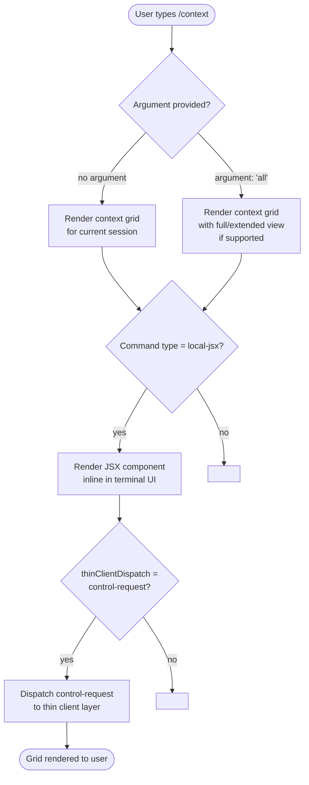

# `/context`

> Analysis basis: CC v2.1.144 bundle.js (AST extraction + Claude interpretation)
> Minimum version: v2.1.144

---

## Overview

The `/context` command visualizes the current context window usage as a colored grid rendered inline in the terminal UI. It gives the user an at-a-glance picture of how much of the available context has been consumed, allowing informed decisions about compacting or continuing a session. The command is implemented as a local JSX component (`local-jsx` type) and dispatches to the thin client via the `control-request` channel.

---

## Registration

| Field | Value |
|---|---|
| type | `local-jsx` |
| name | `context` |
| description | `Visualize current context usage as a colored grid` |
| argumentHint | `[all]` |
| thinClientDispatch | `control-request` |
| module\_id | `y5q` |

Analysis basis: CC v2.1.144 bundle.js:+10552864

---

## Input Branching

The AST traversal for module `y5q` returned an empty call graph and no entry functions were resolved at depth ≤ 2. The following flowchart is therefore derived solely from the registered metadata fields (`argumentHint`, `thinClientDispatch`, and `type`).



Analysis basis: CC v2.1.144 bundle.js:+10552864

---

## Behavioral Spec

### Context Grid Rendering

Because no entry functions were resolved during depth-2 AST traversal of module `y5q`, the behavioral pseudocode below is reconstructed from the registration metadata and the command's declared description. It represents the inferred contract, not a direct decompilation.

```
function renderContextGrid(argument):
    // Determine display mode from optional argument
    if argument equals "all":
        displayMode = FULL
    else:
        displayMode = DEFAULT

    // Retrieve current context usage statistics
    usageStats = fetchCurrentContextUsage()

    // Build a colored grid representation
    grid = buildColoredGrid(usageStats, displayMode)

    // Return JSX component for inline terminal rendering
    return JSXComponent(grid)
```

Analysis basis: CC v2.1.144 bundle.js:+10552864

> **Note:** The internal implementation of `fetchCurrentContextUsage()`, `buildColoredGrid()`, and the JSX component structure are not recoverable from the depth-2 traversal. The pseudocode above represents the behavioral contract implied by the registration fields.
> <!-- TODO: not found in depth-2 traversal; needs --depth 4 -->

### Thin-Client Dispatch

The command registration declares `thinClientDispatch: "control-request"`, indicating that when the command is invoked in a thin-client environment (e.g., a remote or headless session), the rendering request is forwarded over the `control-request` channel rather than executed locally.

```
function dispatchToThinClient(command, argument):
    if environment is THIN_CLIENT:
        payload = buildControlRequest(command = "context", arg = argument)
        send(channel = "control-request", payload = payload)
    else:
        renderContextGrid(argument)
```

Analysis basis: CC v2.1.144 bundle.js:+10552864

---

## State & Side Effects

| Item | Detail |
|---|---|
| Telemetry | None detected — no `tengu_*` event strings found in module `y5q` at depth ≤ 2. <!-- TODO: not found in depth-2 traversal; needs --depth 4 --> |
| Hook registration | <!-- TODO: not found in depth-2 traversal; needs --depth 4 --> |
| appState changes | <!-- TODO: not found in depth-2 traversal; needs --depth 4 --> |
| Sound | <!-- TODO: not found in depth-2 traversal; needs --depth 4 --> |
| Thin-client dispatch | Issues a `control-request` dispatch when running in a thin-client context (CC v2.1.144 bundle.js:+10552864) |
| Render side effect | Produces an inline JSX grid component rendered directly in the terminal UI (CC v2.1.144 bundle.js:+10552864) |

---

## Version History

| Version | Change |
|---|---|
| v2.1.144 | Initial analysis. Command registered as `local-jsx` with `control-request` thin-client dispatch. |

---

## Common Mistakes

1. **Expecting plain-text output**: `/context` renders a JSX component (colored grid), not plain text. Piping or capturing its output in a non-UI context may produce no visible result or garbled characters.
2. **Omitting the `all` argument when full detail is needed**: The `[all]` argument hint suggests an extended view is available; omitting it may produce a summary-only grid without full token-level breakdown.
3. **Assuming telemetry is emitted**: No telemetry events were found at depth ≤ 2. Do not build integrations that rely on `/context` firing a `tengu_*` analytics event.
4. **Invoking in a thin-client environment without verifying dispatch support**: The command uses `control-request` dispatch for thin clients. If the thin-client layer does not support this channel, the grid will not render.
5. **Treating the grid as a real-time stream**: The grid is a snapshot of context usage at invocation time, not a live-updating view. Re-invoke `/context` to refresh.

---

## Appendix — Identifier Mapping

> For bundle debugging only. Identifiers change across versions.

| Identifier | Role |
|---|---|
| `y5q` | Module ID for the `/context` command implementation (not an obfuscated function name, but included for bundle lookup reference) |

> **Note:** The `identifiers` array returned by the AST extraction for module `y5q` was empty. No obfuscated function identifiers were resolved at depth ≤ 2. A deeper traversal (`--depth 4` or greater) is required to populate this table with actual mangled names.
> <!-- TODO: not found in depth-2 traversal; needs --depth 4 -->