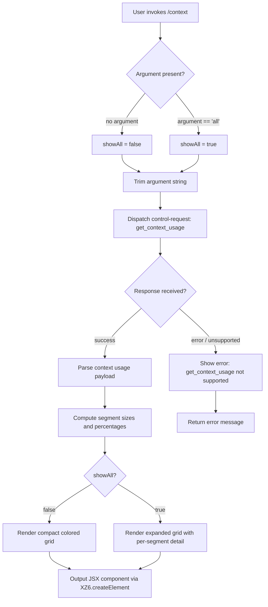

# `/context`

> Analysis basis: CC v2.1.150 bundle.js (AST extraction + Claude interpretation)
> Minimum version: v2.1.150

---

## Overview

`/context` visualizes the current context window usage as a colored grid, showing how the conversation's token budget is distributed across segments such as system prompt, tools, memory files, messages, and free space. It dispatches a `get_context_usage` control request to the backend, receives a structured usage payload, and renders a JSX grid component in the terminal. An optional `all` argument expands the display to include additional detail (e.g., per-segment breakdowns).

---

## Registration

| Field | Value |
|---|---|
| type | `local-jsx` |
| name | `context` |
| description | `Visualize current context usage as a colored grid` |
| argumentHint | `[all]` |
| thinClientDispatch | `control-request` |
| module_id | `XT1` |
| load_inline | `true` |
| loc_byte | `11096957` |
| loc_byte_end | `11097183` |
| loc_line | `8552` |
| arbor_handler.name | `OFL` |
| arbor_handler.fqn | `claude-2.1.150::OFL` |
| arbor_handler.kind | `AsyncFunction` |
| arbor_handler.resolution_path | `module_id` |
| arbor_handler.n_hits | `0` |

Analysis basis: CC v2.1.150 bundle.js:+11096957

---

## Input Branching

The command has 4+ distinct branches based on argument value, control-request response, and rendering path.



---

## Behavioral Spec

### Handler Entry Point — `contextCommandHandler` (bundle identifier: `OFL`)

The command's main handler is the async function `OFL`, resolved by Arbor via `module_id` → `XT1`.

```
async function contextCommandHandler(args, appState):
    rawArg = args.trim()                         // OFL → A.trim, loc +11095657
    showAll = (rawArg == "all")                  // literal "all", loc +11095682

    send controlRequest("get_context_usage",     // K.sendControlRequest, loc +11095717
                        payload={})

    on response event ("data"):                  // $rH event handler, loc +11095777
        parse response via responseParser        // Np / _KH / NgH, loc +3750680
        render contextGrid(response, showAll)
            via XZ6.createElement                // loc +11095781

    if response.type == "system":               // literal "system", loc +11095864
        handle system-level message

    threshold = 80                               // literal 80, loc +11096093
    // used when computing color thresholds for grid cells

    render compact indicator via compactBoundaryHelper  // XO → aW8, loc +11096060
    assemble final JSX output
    return rendered component
```

Analysis basis: CC v2.1.150 bundle.js:+11095651

---

### Context Usage Computation — `contextUsageBuilder` (bundle identifier: `JZ6`)

Invoked from `OFL` at loc +11095887. Responsible for building the data model that drives the grid display.

```
function contextUsageBuilder(usagePayload, showAll):
    // Load token-counter helper
    tokenFormatter = loadTokenFormatter()       // v1 → wK → YVK, loc +208176

    // Filter segments based on showAll flag
    segments = usagePayload
        .filter(seg => showAll || seg.visible)  // A.filter, loc +11093755
        .find(...)                              // A.find,   loc +11094073

    // Named segment labels (from literals):
    //   "Free space"         loc +11093790
    //   "Autocompact buffer" loc +11093813
    //   "System prompt"      loc +9908686
    //   "System tools"       loc +9908765
    //   "MCP tools"          loc +9908829
    //   "Memory files"       loc +9909147
    //   "Messages"           loc +9909709
    //   "Skills"             loc +9909209
    //   "Custom agents"      loc +9909080
    //   "Permission"         loc +9909111

    // Format percentages with locale "en-US", style "compact"
    // threshold for "< 20" warning label: 20 (loc +208219 / 208228)
    // threshold for low-detail tick:       10 (loc +208261)

    for each segment:
        pct = Math.round(segment.tokens / total * 100)  // Ws → Math.round, loc +208248
        label = formatCompact(pct, ".0")                // literal ".0", loc +208190

    return segmentArray
```

Analysis basis: CC v2.1.150 bundle.js:+11093714

---

### Compact Boundary Helper — `compactBoundaryHelper` (bundle identifier: `XO`)

```
function compactBoundaryHelper(usageData):
    marker = findCompactBoundary(usageData)     // aW8 → iP, loc +10407717
    // literal key "compact_boundary"            loc +10407634
    slice = usageData.slice(markerIndex)        // H.slice, loc +10407787
    return slice
```

Analysis basis: CC v2.1.150 bundle.js:+11095613

---

### Control-Request Response Handler — `controlResponseListener` (bundle identifier: `$rH`)

```
function controlResponseListener(transport):
    transport.on("data", handler)               // K.on,         loc +7595569
    rawText = message.toString()                // M.toString,   loc +7595606

    // Parse via Np (responseParser), which delegates to:
    //   Lz_ (loc +3750634) — layout resolver
    //   Xz_  → Bd9.createElement  (loc +3750547) — JSX element factory
    //   _KH  → NgH  (loc +3721802) — node-graph handler
    //     NgH calls: fi, D$_, Y9, mH, V6, mH

    render f8H.createElement(...)              // loc +7595636
```

Analysis basis: CC v2.1.150 bundle.js:+7595569

---

### Token-Budget Grid Renderer — `contextGridRenderer` (bundle identifier: `k28`)

The heaviest sub-routine; assembles all context segments into a visual grid.

```
function contextGridRenderer(segments, options):
    // Gather system prompt data
    systemPromptData = buildSystemPromptContext(...)   // sT, loc +9907728

    // Gather model / agent context
    modelContext  = buildModelContext(...)             // AT, loc +9907784
    autoCompact   = settings.autoCompactEnabled        // literal, loc +9896908

    // Gather tool/MCP context
    toolContext   = gatherToolContext(...)             // zc, loc +9907818

    // Gather task/background session context
    taskContext   = gatherTaskContext(...)             // tG, loc +9907834

    // Gather system-prompt file context
    spFileContext = gatherSystemPromptFiles(...)       // $u, loc +9907878

    await Promise.all([...contexts])                   // loc +9908399

    // Build segment rows for each named label group
    // Color coding: threshold 80% → warning color   // literal 80, loc +11096093

    promptBorderRow = buildRow("System prompt", ...)   // literal, loc +9908686
    systemToolsRow  = buildRow("System tools", ...)    // literal, loc +9908765
    mcpToolsRow     = buildRow("MCP tools", ...)       // literal, loc +9908829
    mcpDeferredRow  = buildRow("MCP tools (deferred)", ...)  // loc +9908905
    systemDeferredRow = buildRow("System tools (deferred)", ...) // loc +9908991
    customAgentsRow = buildRow("Custom agents", ...)   // loc +9909080
    permissionRow   = buildRow("Permission", ...)      // loc +9909111
    memFilesRow     = buildRow("Memory files", ...)    // loc +9909147
    skillsRow       = buildRow("Skills", ...)          // loc +9909209
    messagesRow     = buildRow("Messages", ...)        // loc +9909709

    // Math operations used for layout
    totalTokens = Math.max(allSegments)                // loc +9909534
    clampedPct  = Math.min(pct, 100)                   // loc +9909545
    gridWidth   = Math.round(...)                      // loc +9910129
    cellWidth   = Math.floor(...)                      // loc +9910291

    // Subagent-only color markers (not shown to end-users):
    //   "cyan_FOR_SUBAGENTS_ONLY"   loc +9908856
    //   "purple_FOR_SUBAGENTS_ONLY" loc +9909735

    return assembledGrid
```

Analysis basis: CC v2.1.150 bundle.js:+9907728

---

### System Prompt Context Builder — `buildSystemPromptContext` (bundle identifier: `sT`)

```
function buildSystemPromptContext(appState):
    promptData = loadWindowPrompt(appState)   // Wt → wv/gAH/TA/Xg, loc +2177196
    // Xg parses model strings such as "opusplan", "plan", "haiku", etc.
    // (literals loc +2177203, 2177219, 2177252)

    sections = buildSectionGroups(promptData) // GZ → Z3/cf, loc +2176806
    // cf handles: JCH, pZ4, O69, zc6, RA

    combined = combineSections(sections)      // cv → Z3/cf, loc +2176948
    return combined
```

Analysis basis: CC v2.1.150 bundle.js:+2177196

---

### Task / Background Session Context Builder — `buildTaskContext` (bundle identifier: `tG`)

This is the most expansive sub-routine, orchestrating over 30 helper calls.

```
async function buildTaskContext(appState):
    // Static environment info
    envStatic  = buildEnvInfoStatic(...)   // YHA, loc +12973985
                                           // literal "env_info_static" loc +12974528
    // Model context
    modelCtx   = getModelContext(x6)       // loc +12974036

    // Parallel context gathering
    await Promise.all([
        buildEnvContextSimple(...),        // "env_info_simple" loc +12974565
        buildLanguageInfo(...),            // "language"        loc +12974603
        buildOutputStyle(...),             // "output_style"    loc +12974638
        buildBgSessionInfo(...),           // "bg-session"      loc +12974668
        buildWorktreeInfo(...),            // "worktree"/"none" loc +12974695
        buildScratchpadInfo(...),          // "scratchpad"      loc +12974695
        buildContextManagement(...),       // "context_management" loc +12974722
        buildBriefInfo(...),              // "brief"           loc +12974761
        buildReproVerifyWorkflow(...),     // "reproduce_verify_workflow" loc +12974815
    ])

    // Memory context
    memCtx = buildMemoryContext(V$6)      // loc +12974486

    // Tool listings
    toolListings = buildToolListings(PM5) // loc +12974419

    // MCP server context
    mcpCtx = buildMcpContext(...)         // loc +12974900 (D41/WMH)

    return aggregatedTaskContext
```

Analysis basis: CC v2.1.150 bundle.js:+12974050

---

## State & Side Effects

| Item | Detail |
|---|---|
| Telemetry (direct path) | No `tengu_*` event found directly inside `OFL`'s immediate body; events in the call graph include `tengu_amber_creek` (loc +3360591), `tengu_pewter_brook` (loc +3360499), `tengu_marlin_porch` (loc +3721570), `tengu_cobalt_raccoon` (loc +9886959), `tengu_sparrow_ledger` (loc +12973853), `tengu_moth_copse` (loc +3280807) |
| Control request dispatched | `get_context_usage` sent via `K.sendControlRequest` (loc +11095717) |
| thinClientDispatch | `"control-request"` — command routes through thin-client control channel |
| JSX rendering | Renders via `XZ6.createElement` (loc +11095781) and `f8H.createElement` (loc +7595636) |
| AppState changes | None detected at depth-2; command is read-only diagnostic |
| Sound | None detected |
| Hook registration | `$rH` registers a `"data"` event listener on the transport (loc +7595569); listener is transient for this command invocation |
| Settings read | `autoCompactEnabled` (loc +9896908), compact window env var `CLAUDE_CODE_AUTO_COMPACT_WINDOW` (loc +9895305) |
| Color threshold | 80% usage triggers a visual warning color (loc +11096093) |

---

## Version History

| Version | Change |
|---|---|
| v2.1.150 | Initial analysis |

---

## Common Mistakes

1. **Omitting the `all` argument when expecting full detail.** Without `all`, per-segment breakdowns (deferred tools, custom agents, individual MCP servers) are hidden. Pass `/context all` to see every category.
2. **Confusing token counts with token percentages.** The grid renders percentages rounded to one decimal place (`".0"` format, loc +208190); the raw counts require a separate API call.
3. **Running in a context where `get_context_usage` is unsupported.** Thin-client or non-interactive environments may not have the `onGetContextUsage` callback registered; the command will show: `"get_context_usage is not supported in this context"` (loc +12267792).
4. **Expecting the subagent color markers (`cyan_FOR_SUBAGENTS_ONLY`, `purple_FOR_SUBAGENTS_ONLY`) in the end-user display.** These labels are internal and are not rendered in the user-facing grid.
5. **Interpreting the "< 20" label as an error.** It is a normal display artifact for segments occupying fewer than 20% of the context window (threshold literal, loc +208228).

---

## Appendix — Identifier Mapping

> For bundle debugging only. Identifiers change across versions.

| Identifier | Role |
|---|---|
| `OFL` | Main async handler for `/context` command (Arbor-resolved entry point) |
| `Y9` | Core context-display orchestrator called from `OFL` |
| `WxH` | Set membership check helper (calls `_QK.has`) |
| `I3_` | Token-string formatter (calls `t1`, `mH`) |
| `t1` | Low-level string coercion helper |
| `mH` | Secondary string utility |
| `fi` | Terminal feature/color capability probe |
| `_67` | Terminal environment detector (checks iTerm, screen, tmux) |
| `H67` | String `startsWith` helper for terminal detection |
| `N` | Shell/environment detection dispatcher |
| `LVK` | Sub-environment context builder |
| `T7A` | Token formatter pair dispatcher (calls `MTK`, `fTK`) |
| `CH` | `JSON.stringify` wrapper |
| `X4` | Path-segment extractor |
| `s5A` | Array-map helper for path segments |
| `HbH` | Write-to-buffer helper (calls `B5A`) |
| `$VK` | File-logging / conversation-history persister |
| `ICH` | Timer-queue flush utility |
| `q9H` | Join/segment helper for log paths |
| `G96` | File-key lookup (calls `K8`) |
| `LMA` | Path-join helper for log entries |
| `KMA` | File-rotate/stat helper |
| `fVK` | Append-file with directory creation |
| `a9` | Hook registrar (calls `W7A.register`) |
| `N3_` | Boolean-coercion helper |
| `HA` | Settings-load dispatcher |
| `hm` | Settings loader (calls `DC`, `Tq`, `Wl8`, `rF`, `cy6`) |
| `Tq` | Memory-usage tracker |
| `Wl8` | Settings-from-disk loader |
| `rF` | Settings reconciler |
| `A67` | Fullscreen/display-mode context builder |
| `V6` | Token-event emitter / context event publisher |
| `we` | Model-string helper |
| `we6` | Context-event deduplicator |
| `m6` | Context-event appender with timestamp |
| `H$` | UUID / request-ID factory (calls `Z2H`) |
| `K` | Transport/connection object |
| `L` | Connection set manager |
| `M` | Stream/session object |
| `$rH` | Control-response event listener setup |
| `Np` | JSX response parser |
| `Xz_` | React createElement wrapper (`Bd9.createElement`) |
| `_KH` | Node-hierarchy handler |
| `NgH` | Graph-node renderer |
| `JZ6` | Context-usage model builder (segment array) |
| `v1` | Token formatter (calls `wK`) |
| `wK` | Compact locale formatter (calls `YVK`) |
| `YVK` | `Intl.NumberFormat` instance for "en-US" compact style |
| `XuH` | Segment-label lookup helper |
| `Ws` | Percentage rounder (calls `v1`, `Math.round`) |
| `EH` | String coercion helper |
| `$FL` | Compact-boundary slice helper (calls `XO`) |
| `XO` | Compact boundary finder (calls `aW8`) |
| `aW8` | Compact boundary index helper (calls `iP`) |
| `iP` | Compact boundary index probe |
| `k28` | Context grid renderer / token-budget visual assembler |
| `sT` | System-prompt context builder |
| `Wt` | Window-prompt loader |
| `wv` | Prompt section helper |
| `gAH` | Prompt section helper 2 |
| `Xg` | Model-string parser (opusplan, plan, haiku, etc.) |
| `GZ` | Section-group builder |
| `Z3` | Section-group helper |
| `cf` | Section combiner |
| `cv` | Section combiner variant |
| `AT` | Model/agent context builder |
| `qL` | Agent-context fetcher |
| `Nm` | Agent-memory tracker |
| `p8` | Telemetry wrapper for agent context |
| `zc` | Tool-context gatherer (auto-compact, env, settings) |
| `Xq` | Token-limit resolver |
| `Yc6` | Model-endpoint discriminator |
| `xj` | Model-string normalizer |
| `OP` | String replace helper |
| `JG` | Token-window parser (parseInt, isNaN, bW, lm, EqH, Hs6) |
| `bW` | Token-window range builder |
| `lm` | Token-window lookup |
| `EqH` | Token-window with UD |
| `Hs6` | Token-window with model-specific cap |
| `dX` | Context-window dimension helper |
| `gHH` | Numeric env-var parser |
| `v28` | Auto-compact window builder |
| `HB_` | Context-size string parser (parseFloat, parseInt, Math.round) |
| `tG` | Task/background-session context builder (main orchestrator) |
| `YHA` | Static environment info builder |
| `x6` | Async-local-storage context accessor |
| `Mm6` | Store-reader (calls `Lm6.getStore`) |
| `j_` | Low-level utility (calls `Dv`) |
| `XP8` | Object-values context mapper |
| `bV` | Background-session context helper |
| `KM5` | Memory/context section builder |
| `LM5` | Additional context loader |
| `JHA` | Conversation-history context builder |
| `bM5` | History-wrapper (calls `JHA`) |
| `FG6` | Tool-listing context builder |
| `MM5` | Tool-listing wrapper (calls `FG6`) |
| `PM5` | Full tool/permission context builder |
| `wF` | Feature-flag helper |
| `wX` | Model-string utility (calls `mH`) |
| `XM5` | Tool-context sub-builder (calls `GE`) |
| `f0_` | Tool-filter helper |
| `GE` | Tool-category discriminator (calls `bAq`) |
| `LL` | Tool-label lookup |
| `cLH` | Context-limit helper (calls `ZH6`, `PaH`, `e_`) |
| `AB` | Message flatMap/array helper |
| `V$6` | Memory-file context builder |
| `M4` | Memory-entry formatter |
| `m1H` | Memory directory creator |
| `en` | File-type discriminator (isFile, isDirectory) |
| `bH` | Low-level file helper |
| `nY` | Memory-note builder (calls `V6`) |
| `Vx9` | Memory path joiner |
| `Zx9` | Memory-dir loader (calls `MEH`) |
| `Ex9` | Memory-dir alternative loader |
| `pf_` | Memory prompt builder (calls `MEH`) |
| `c` | Generic small utility |
| `vM5` | OS/environment context builder |
| `Gz` | Model-string display-name resolver |
| `DHA` | Detailed hardware/env context builder |
| `VM5` | Combined environment context (OS, shell, git, etc.) |
| `jHA` | OS-info reader (VSH.version, VSH.release, VSH.type) |
| `yf` | Shell/working-dir helper |
| `wHA` | Shell detection helper |
| `OM5` | Output-mode context builder |
| `zM5` | Additional output context |
| `IM5` | Worktree context builder (calls `wS_`) |
| `wS_` | Worktree info fetcher (calls `HA`) |
| `kM5` | Scratchpad context builder |
| `AAH` | Scratchpad section builder (calls `V6`) |
| `KPH` | Scratchpad path helper |
| `hM5` | Brief-mode context builder |
| `CM5` | Context-management section builder |
| `TM5` | Reproduce-verify workflow context |
| `$M5` | Additional context section builder |
| `D41` | Background-task context builder |
| `WMH` | Background-task-map helper |
| `RC8` | Task-result cacher |
| `GM5` | Growthbook context section |
| `YM5` | Heron-brook context section |
| `DM5` | Deferred-tool context builder (calls `fM5`, `AB`) |
| `fM5` | Deferred-tool formatter |
| `wM5` | Custom-agent context builder |
| `jM5` | Agent-memory context builder (calls `JHA`) |
| `JM5` | Tool-use message builder |
| `cW` | Conversation-mode context builder |
| `WM5` | Message-list context builder (calls `AB`) |
| `Cx9` | Combined-memory context builder |
| `Rx9` | Memory-file reader (calls `M4`, `nY`, `zEH.*`, `af`) |
| `AOH` | Context-window builder (calls `vZ`, `w5`, `RA`) |
| `vZ` | Context-window pair builder |
| `w5` | Window-size helper |
| `RA` | Model-display-name resolver |
| `$u` | System-prompt file loader |
| `vK` | Validation helper |
| `qD` | Query-string builder |
| `XvL` | Multi-file system-prompt loader |
| `JvL` | System-prompt line parser |
| `h28` | Combined-prompt assembler |
| `NM5` | Nested environment context builder |
| `bx9` | Prompt-section joiner |
| `Co1` | Section-header parser |
| `ztH` | Token-count context builder |
| `RyH` | Per-segment token counter |
| `RH` | Error/result logger |
| `s$1` | Segment-count accumulator |
| `PvL` | Parallel prompt-file loader |
| `jD6` | Tool-filter for prompt files (calls `V6`) |
| `WvL` | MCP/plugin server context builder |
| `f` | MCP server orchestrator |
| `UyH` | Per-server connection context builder |
| `gDK` | MCP server update applier |
| `$` | MCP HQ1 lookup |
| `lv5` | MCP client-listing helper |
| `GJH` | Conversation-history segment builder |
| `S28` | Single-message segment builder |
| `z` | Background-session terminator |
| `uH` | Small utility (calls `c`) |
| `Rk` | Process-spawn helper |
| `pu` | Promise.race / shutdown manager |
| `T` | Terminal feature set |
| `X` | IPC channel handler |
| `J` | IPC frame helper |
| `w` | Subprocess lifecycle manager |
| `zM` | Stream-end helper |
| `Ok5` | Full protocol message dispatcher |
| `EvL` | Per-message token allocator |
| `_M` | Math.round wrapper |
| `O` | Output-record manager |
| `k8` | Small constant / id helper |
| `D` | Session lifecycle manager |
| `Kv8` | Memory pressure helper |
| `kqA` | Spare-session spawner |
| `Dz` | Disconnect helper |
| `K8` | File-key builder |
| `ZvL` | Parallel segment token builder |
| `GvL` | Tool-use context builder |
| `J0_` | Tool-session initializer |
| `K6H` | Tool-filter for sessions |
| `a$1` | App-state accessor |
| `JK` | Config-cache reader |
| `IvL` | Context-segment assembler |
| `VvL` | Segment-color mapper |
| `vvL` | Segment-detail builder |
| `NvL` | Segment-count builder |
| `_T` | Message-normalization pipeline |
| `qRL` | Message-block resolver |
| `lg_` | Thinking-block filter |
| `ORL` | Orphaned-block handler |
| `$RL` | Block-type router |
| `zRL` | Thinking-block presence checker |
| `h` | Focus/blur tracker |
| `nW8` | Some-block checker |
| `ZRL` | UUID generator wrapper |
| `T8` | Message-ID stamper |
| `P0` | Priority-queue helper |
| `vu_` | Validation helper |
| `iW8` | Block injector |
| `LR` | Standard message prepender |
| `ag_` | Array-block resolver |
| `KRL` | Block-kind dispatcher |
| `Z` | Message-set tracker |
| `V` | Value accumulator |
| `LRL` | Legacy-block type checker |
| `ERL` | MCP tool-call block handler |
| `G4` | Generic getter |
| `WJ1` | Message-window finder |
| `DRL` | Deferred-tool resolver |
| `_J1` | Push-pair helper |
| `WB_` | Full message-assembly pipeline |
| `VRL` | Block-content joiner |
| `G` | Key-event handler |
| `YRL` | Message finalizer |
| `aW6` | Orphaned-thinking block filter |
| `CRL` | Content-at accessor |
| `oW6` | Whitespace-only assistant block filter |
| `bRL` | Empty-assistant content fixer |
| `wRL` | Message-slice trimmer |
| `HJ1` | Message-push helper |
| `AJ1` | Block appender |
| `fRL` | Full message filter |
| `TvL` | Tool-listing segment builder |
| `X0_` | Tool-session opener |
| `LG` | Prompt-language normalizer |
| `nq` | Full language/model normalizer |
| `YT6` | Token-display formatter |
| `jU_` | Token-unit helper |
| `c_` | Error/string coercer |
| `e8H` | Context-window size resolver |
| `ALH` | Max-output-tokens calculator |
| `_OH` | Token-limit with model override |
| `HH` | Voice-recording / timer array |
| `Q` | Zip-cache / timer manager |
| `WZ6` | File-cache reader |
| `KE1` | File-cache unlinker |
| `r` | Process wrapper |
| `d` | Process inner helper |
| `oq8` | Plugin-install state checker |
| `QHH` | Plugin-id set checker |
| `KLH` | Autocompact window resolver |
| `WJH` | Settings-path builder |
| `lH` | Background-session connection manager |
| `AH` | MCP connection handler |
| `qH` | Request-tracker set |
| `z8` | MCP debug logger |
| `uT6` | Elicitation-request handler |
| `FjK` | Queue helper |
| `mT6` | Elicitation-response handler |
| `Qd` | Notification builder |
| `y` | Write-stream helper |
| `S6` | Log writer (calls `Dv`) |
| `V8` | File-append logger |
| `DaK` | Append-file key builder |
| `g` | Tool-filter for MCP |
| `v6` | MCP tool-list filterer |
| `VH` | Permission-set tracker |
| `L6` | MCP server reconciler |
| `j6H` | MCP tool-format builder |
| `pH` | MCP tool-listing builder |
| `MH` | MCP state synchronizer |
| `cH` | Plugin context orchestrator |
| `dXH` | Plugin cache refresher |
| `XSH` | Plugin-filter helper |
| `a2` | Plugin-list reconciler |
| `WH` | Voice-input handler |
| `GF1` | Bridge-REPL message dispatcher |
| `AV8` | Bridge-message parser |
| `g6` | JSON.parse wrapper |
| `W_5` | Control-request validator |
| `G_5` | Control-response builder |
| `P_5` | Control-message router |
| `BH` | Message-slice / write-messages helper |
| `m` | Throttled-write stream |
| `SH` | Message-write orchestrator |
| `TF1` | Full bridge-message handler |
| `Y` | Session config updater |
| `j` | Process killer |
| `I` | Away-summary generator |
| `o6` | Plugin/server launch handler |
| `U9` | Plugin-path resolver |
| `DK` | Server-name resolver |
| `C9` | Server connection builder |
| `nA` | Task manager |
| `QA` | Fatal error handler |
| `wH` | Session-list helper |
| `GH` | Grid-height helper (calls `V6`) |
| `f6` | Plugin-MCP reconciler |
| `MuH` | Timed-operation logger |
| `FL8` | File-list helper |
| `SjK` | Headless plugin installer |
| `ep` | Plugin entry-point builder |
| `NP8` | Marketplace reconciler |
| `$JH` | Plugin-cache clearer |
| `ZE` | Plugin-registry helper |
| `Efq` | Plugin-zip error builder |
| `Zfq` | Plugin-zip error builder 2 |
| `wu` | Plugin-state builder |
| `py8` | Plugin-install executor |
| `Nfq` | Plugin-not-found error |
| `yjK` | Plugin-type router |
| `hN8` | Plugin-diff reporter |
| `VI` | Math.round wrapper for ms |
| `gH` | Grid-entry map cache |